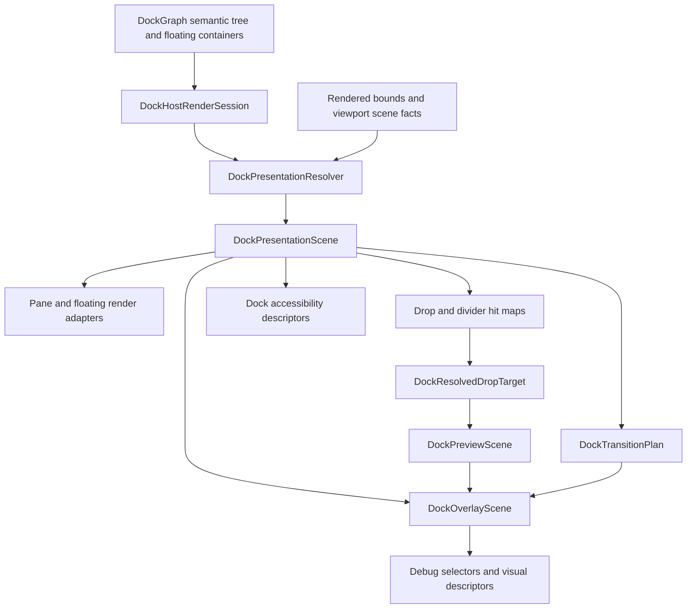
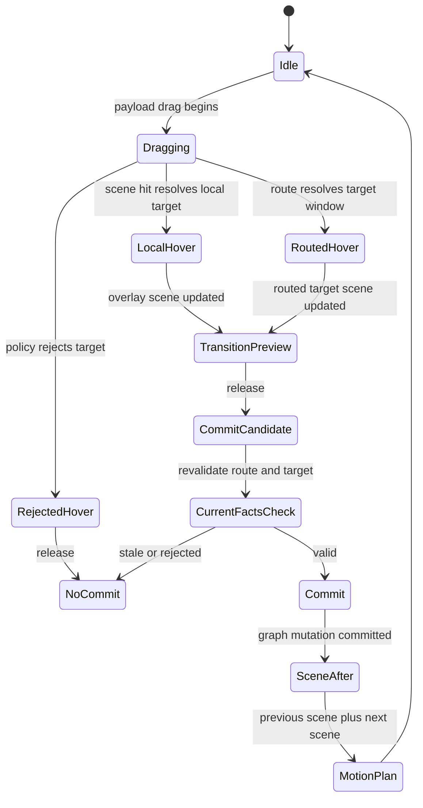
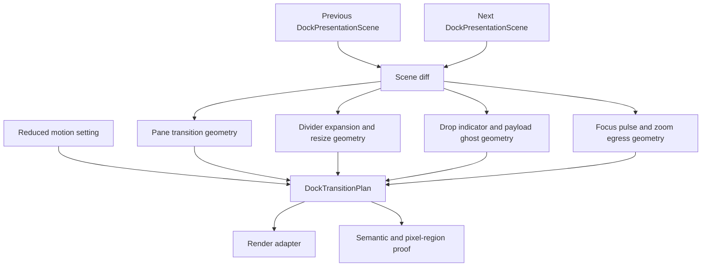

# Docking Presentation Scene And Motion Model - Plan

## Goal Capsule

| Field | Value |
| --- | --- |
| Objective | Refactor docking UI/UX capability around a flat presentation scene, explicit overlay layers, semantic tab insertion preview, transition geometry, zoom/focus presentation state, divider hit maps, and accessibility/reduced-motion descriptors. |
| Authority | `DockGraph` remains the semantic layout authority and current drop facts remain release authority; the new presentation scene becomes the shared geometry authority for rendering, hit testing, preview, motion, and semantic proof. |
| Scope posture | Fearless private refactor: break crate-internal modules, delete obsolete geometry/render compatibility paths, and keep public behavior stable unless an additive API is explicitly justified. |
| Execution profile | Characterization-first, then replace local geometry inference with shared scene data; use `nextest` for Rust test verification. |
| Stop condition | Docking preview and split interaction capabilities are explainable from one presentation/motion model, with tests proving tab insertion, overlay layering, transition descriptors, zoom/focus, divider hit maps, and accessibility/reduced-motion semantics. |

---

## Product Contract

### Summary

The next docking refactor should align UI/UX capabilities with the stronger split-layout systems observed in the user-provided SuperSplit notes and the local BonSplit reference, without trying to copy pixels, colors, or Apple-specific implementation details.
The capability target is a flat 2D presentation scene over the existing docking graph: panes, tab bars, tab labels, splitters, floating containers, drop targets, route markers, payload previews, focus affordances, and accessibility bounds should be data first and rendered second.
This lets docking describe what the user is about to do before committing the graph mutation: merge tabs, split inside a pane, split the root edge, drag across windows, tear off, zoom, unzoom, resize a divider, or corner-resize a junction.

### Problem Frame

The previous docking plans fixed the reported behavioral failures: nested inner-edge drops now stay scoped to the hit leaf, center vs edge preview is scene-owned, routed previews use current facts, multi-viewport platform caveats are explicit, and viewport tests are being split by concern.
The remaining UI/UX gap is structural.
Some geometry is still produced by render-time flex layout, some by `graph_layout.rs`, some by drop target resolution, some by preview scene builders, and some by recorded runtime bounds.
That fragmentation makes higher-quality preview behavior hard: tab insertion is still mostly payload tabs without a target insertion affordance, overlay z-order is implicit in child append order, transition geometry is not modeled, zoom/unzoom is absent, focus presentation is thin, divider hit testing is single-axis, and accessibility has no docking-level semantic contract.

SuperSplit's important lesson is not CoreAnimation or SwiftUI; it is the split between semantic tree, flat resolved geometry, root-level overlay, and transition plan.
BonSplit's useful lesson is the controller-facing tab/split API, flat layout snapshot, focus navigation, tab bar insertion indicator, and zoom-as-view-state behavior.
Open GPUI should adopt those capability ideas in Rust/GPUI terms while preserving its current strengths: pure `DockGraph`, current-facts release authority, dock spaces, floating containers, platform viewport runtime, and semantic descriptor tests.

### Requirements

**Presentation geometry**

- R1. Docking must resolve each rendered dock space into a flat `DockPresentationScene` that contains absolute panes, tab bars, tab labels, splitters, floating containers, focus regions, and overlay anchors.
- R2. The presentation scene must be derived from the render session and graph state without replacing `DockGraph` as the persistent semantic model.
- R3. Render, hit testing, drop preview, motion planning, focus presentation, and accessibility descriptors must consume the same scene geometry wherever they overlap.
- R4. Current-facts drop delivery must remain authoritative; presentation scenes and previews may explain a target but must not authorize a release.

**Overlay and preview**

- R5. Docking overlay rendering must have explicit root-level layer ordering for route markers, target bodies, guide boxes, tab insertion affordances, payload tabs, payload ghost descriptors, focus rings, and rejected state.
- R6. Center tab docking must show semantic tab insertion preview: target tab bar slot, insertion caret or slot highlight, payload tab shapes, insertion index, and clipping behavior.
- R7. Edge/root docking must show split preview bands and guide boxes without payload tab previews, and it must remain scoped to the resolved target pane/root layer.
- R8. Routed cross-window previews must carry the same target-scene and overlay-layer semantics as local previews while keeping source route markers separate.

**Motion and state**

- R9. Layout changes that can animate must be describable as `DockTransitionPlan` data from previous and next presentation scenes, including split insertion, divider expansion, tab insertion, tear-off, cross-window move, zoom, unzoom, and focus pulse.
- R10. New split insertion must be modeled with final-size placement first, then slide/occlusion/divider transition geometry so implementation can avoid resize jitter.
- R11. Zoom/unzoom must be presentation state, not a graph mutation; non-zoomed panes must compute an egress edge using nearest-edge distance with a touching-edge preference.
- R12. Focus presentation must expose focused-pane regions, optional focus view descriptors, and reduced-motion behavior without creating a second GPUI focus authority.

**Divider, accessibility, and proof**

- R13. Divider hit testing must be centralized in a hit map that can represent single-axis divider drags and corner junction drags that move two axes.
- R14. Divider and corner resize must obey the existing split fraction and minimum-size constraints, and tests must prove it does not bypass graph validation.
- R15. Docking must expose internal accessibility descriptors for panes, tab lists, tab panels, splitters, drop targets, drag sources, and drop destinations; platform mapping may remain incremental.
- R16. Reduced motion must be a first-class input: final scene, preview, focus, and accessibility semantics stay identical while motion descriptors degrade to immediate transitions.
- R17. Semantic visual descriptors, debug selectors, and narrow pixel-region proof must lock the user-facing preview capabilities without requiring pixel-perfect ImGui or SuperSplit styling.
- R18. Obsolete render-local geometry inference, duplicate drop-preview compatibility paths, and shallow pass-through helpers must be deleted once scene-owned tests cover them.

### Acceptance Examples

- AE1. Given a mixed split tree with root and floating containers, when a render session is resolved, then one presentation scene lists every visible pane, tab bar, tab label, splitter, floating chrome region, and overlay anchor with stable absolute bounds.
- AE2. Given a center hover over a tab stack, when the payload has multiple tabs, then the preview shows a target insertion slot plus payload tabs in source order, and the release still revalidates current drop facts.
- AE3. Given an edge hover over a nested lower-right leaf, when the pointer is in the leaf's left guide region, then the overlay shows a split preview scoped to that leaf and no payload tab insertion preview.
- AE4. Given an active routed cross-window hover, when the target window renders feedback, then the target scene uses the same overlay layers as a local hover and the source window only shows route-marker feedback.
- AE5. Given a rejected target, when the pointer remains over the target, then the overlay exposes rejected state and a release leaves the graph unchanged.
- AE6. Given a new split insertion, when previous and next scenes are compared, then the transition plan places the incoming pane at final size and describes slide-in, occlusion, and divider expansion geometry.
- AE7. Given zoom on a pane, when unzoom is requested, then the graph is unchanged, focus is preserved or restored, and sibling panes use deterministic egress/return edge descriptors.
- AE8. Given a splitter junction between horizontal and vertical splits, when the corner hit zone is dragged, then both axes update within minimum-size constraints and tests can identify the changed split handles.
- AE9. Given reduced motion, when any transition-capable docking action runs, then the final scene and accessibility descriptors match the animated path while motion descriptors report immediate completion.
- AE10. Given native dogfood hover across guide boxes, when the active target changes repeatedly, then overlay boxes remain stable and do not jitter because they are derived from one presentation scene.

### Scope Boundaries

#### In Scope

- Private docking presentation scene, geometry resolver, overlay layer model, transition descriptor model, zoom/focus presentation state, divider hit map, semantic accessibility descriptors, debug selectors, native dogfood status, verification docs, and deletion of replaced private helpers.
- Existing docking graph semantics, central regions, floating containers, dock-class policy, current-facts delivery, viewport route hardening, and scene-owned preview authority from prior plans.
- Capability alignment with SuperSplit and BonSplit at the data/interaction level: flat scene, root overlay, tab insertion preview, transition descriptors, zoom/focus presentation, divider hit maps, and accessibility semantics.

#### Deferred to Follow-Up Work

- Pixel-perfect styling parity with ImGui, SuperSplit, BonSplit, or macOS.
- Full CoreAnimation-style per-frame animation fidelity.
- Public theme API for docking preview styling.
- Complete platform VoiceOver/UIAutomation mapping if the GPUI accessibility backend does not yet expose enough primitives.
- Transparent payload-window rendering when platform overlay capabilities remain unavailable.

#### Outside This Plan

- Replacing `DockGraph` with a flat persistent data model.
- Replacing GPUI platform window ownership or turning docking into a second window manager.
- Making presentation scenes a commit token or release authority.
- Copying SwiftUI/AppKit/UIKit/CoreAnimation architecture into Rust.

---

## Planning Contract

### Current Findings

| Finding | Evidence | Planning implication |
| --- | --- | --- |
| Preview scene authority exists but stops short of full presentation authority. | `crates/gpui_docking/src/drop_preview.rs` owns `DockPreviewScene`, layers, payload tabs, and visual descriptors. | Extend from target preview scene to full presentation scene instead of inventing another preview-only DTO. |
| Split rendering still depends on nested flex composition. | `crates/gpui_docking/src/render_split.rs` renders child flex rows/columns and overlays splitter event layers. | A flat scene must be introduced before expecting reliable transition, corner drag, or accessibility geometry. |
| A pure layout calculator already exists but is not the renderer's full fact source. | `crates/gpui_docking/src/graph_layout.rs` computes subtree bounds from split fractions. | Reuse and deepen it into presentation geometry instead of keeping multiple rectangle calculators. |
| Drop targets already distinguish center, tab bar, inner edge, root edge, floating title bar, and empty space. | `crates/gpui_docking/src/drop_target.rs` resolves those target kinds with availability and drop boxes. | The refactor should not redo target semantics; it should feed them from and back into shared presentation geometry. |
| Platform and routed-preview authority have been recently hardened. | `docs/plans/2026-06-30-001-refactor-docking-platform-hardening-plan.md` and current viewport modules. | This plan must preserve current-facts delivery and keep routed scenes non-authoritative. |
| BonSplit has a useful tab/split surface but lacks this repo's multi-viewport semantics. | `repo-ref/bonsplit/README.md` and `repo-ref/bonsplit/Sources/Bonsplit`. | Borrow layout snapshot, tab insertion, focus navigation, and zoom-as-view-state ideas, not its nested AppKit model. |
| SuperSplit's closed-source notes point to a stronger architecture. | User-provided SuperSplit notes. | Adopt the tree-to-flat-scene, root overlay, transition plan, occlusion, focus, zoom, divider hit map, and accessibility principles in GPUI terms. |

### Key Technical Decisions

- KTD1. Keep semantic state and presentation state separate. `DockGraph` remains the serializable semantic authority; `DockPresentationScene` is rebuilt for geometry, render, hit, preview, motion, and semantic proof.
- KTD2. Make the flat scene the shared geometry contract. Panes, tab bars, labels, splitters, floating chrome, overlay anchors, and accessibility bounds should be resolved once per render frame or scene fact update.
- KTD3. Root overlay owns spatial feedback. Drop zones, tab insertion, payload previews, route markers, focus rings, and rejected state render through explicit overlay layers rather than pane-local ad hoc children.
- KTD4. Motion is planned from scenes, not graph mutation side effects. `DockTransitionPlan` compares previous and next scenes and describes movement, occlusion, divider expansion, zoom egress, and reduced-motion degradation.
- KTD5. Tab insertion is a first-class preview capability. Center docking should communicate "this becomes a tab at this slot" instead of relying on a generic rectangle.
- KTD6. Zoom and focus are presentation concerns. Zoom/unzoom must not collapse graph nodes; focus presentation must complement GPUI focus rather than maintain an independent focus system.
- KTD7. Divider hit maps and accessibility derive from the same scene. Pointer hit testing, keyboard/a11y bounds, and resize constraints should not drift apart.
- KTD8. Data descriptors come before full animation polish. The first implementation can render final states and semantic descriptors while progressively adding GPUI animation support behind the same transition model.
- KTD9. Delete replaced paths in the same refactor. Leaving old render-local geometry and compatibility helpers beside the scene model would preserve the bug class this plan is meant to remove.

### High-Level Technical Design

### Priority Model

| Priority | Capability | Rationale |
| --- | --- | --- |
| P0 | Presentation scene and overlay authority | Every later UX capability depends on one geometry and layer contract. |
| P0 | Tab insertion preview | This is the most visible remaining preview gap after the prior center/edge fixes. |
| P1 | Transition descriptors | Data-first motion lets implementation improve feel without changing target semantics. |
| P1 | Zoom/focus presentation | BonSplit and SuperSplit both treat zoom/focus as core split UX, and this repo currently lacks it. |
| P2 | Divider hit map and corner drag | Important for split-layout maturity, but safer after flat geometry exists. |
| P2 | Accessibility/reduced motion descriptors | Must be designed into the model now, with platform mapping allowed to mature incrementally. |

### Assumptions

- The user explicitly authorized fearless private refactor, breakage, and deletion of unneeded code.
- Existing public docking behavior should remain source-compatible unless a new additive API is required for zoom/focus or accessibility.
- External web research is not load-bearing because SuperSplit is closed-source and the user supplied the relevant notes; BonSplit is available locally under `repo-ref/bonsplit`.
- Pixel-region proof may be limited by renderer determinism; semantic descriptors remain the required cross-platform oracle.

### System-Wide Impact

This plan affects the docking render adapter, interaction model, viewport preview transport, native dogfood example, and future platform accessibility work.
Application users benefit from clearer preview feedback and future zoom/focus actions without needing to understand private geometry types.
Maintainers get a deeper contract: when a preview, hit test, motion descriptor, or accessibility bound is wrong, there is one presentation scene to inspect instead of multiple local rectangle calculators.

### Alternative Approaches Considered

- Keep extending `DockPreviewScene` only. Rejected because preview state is not enough for splitter hit maps, zoom, focus, transition geometry, and accessibility bounds.
- Flatten `DockGraph` permanently. Rejected because the graph already encodes persistent docking semantics, central regions, floating containers, and mutation validation well.
- Copy BonSplit's nested AppKit split tree. Rejected because this repo needs GPUI-native rendering, n-ary splits, floating containers, dock spaces, and multi-viewport routes.
- Copy SuperSplit's CoreAnimation architecture. Rejected because the useful part is the presentation/motion split; GPUI should provide the animation backend behind its own capability model.
- Start with pixel-perfect UI polish. Rejected because capability alignment needs stable data contracts first.

### Risks and Mitigations

| Risk | Impact | Mitigation |
| --- | --- | --- |
| Presentation scene duplicates graph semantics. | High | Keep graph as mutation authority and make scenes read-only derived facts with tests proving graph/current-facts release remains authoritative. |
| Flat geometry conflicts with GPUI flex rendering. | High | Introduce scene descriptors first, then migrate rendering in bounded steps; use existing rendered scene facts where absolute bounds are only available after layout. |
| Overlay layer model becomes another renderer fork. | Medium | Delete old preview/render-local geometry paths once overlay tests pass. |
| Transition descriptors overpromise animation fidelity. | Medium | Require descriptor tests and reduced-motion behavior first; treat per-frame animation polish as an adapter improvement behind the same model. |
| Zoom/unzoom accidentally mutates layout. | High | Store zoom as host/controller presentation state and assert graph snapshots remain unchanged. |
| Corner drag bypasses constraints. | High | Route all resize effects through existing split fraction validation and add min-size tests. |
| Accessibility descriptors drift from visual geometry. | Medium | Derive them from `DockPresentationScene` and include descriptor tests alongside visual tests. |

---

## Implementation Units

### U1. Characterize presentation-scene gaps

- **Goal:** lock current correct behavior and expose the remaining geometry/overlay/motion gaps before replacing private render paths.
- **Requirements:** R1, R3, R4, R5, R6, R7, R17, R18, AE1, AE2, AE3, AE4, AE5.
- **Dependencies:** None.
- **Files:** `crates/gpui_docking/src/host_presentation_scene_tests.rs`, `crates/gpui_docking/src/host_render_tests.rs`, `crates/gpui_docking/src/host_viewport_preview_tests.rs`, `crates/gpui_docking/src/host_viewport_preview_visual_tests.rs`, `crates/gpui_docking/src/drop_preview.rs`, `crates/gpui_docking/src/lib.rs`.
- **Approach:** add characterization tests around scene descriptors and rendered debug selectors for center tab merge, edge split, nested inner-edge split, root-edge split, routed preview, rejected preview, and multi-tab payload preview. These tests should describe behavior at the semantic layer rather than depending on exact colors or fonts.
- **Execution note:** Start characterization-first; failing assertions should identify the specific concept missing from the current implementation.
- **Patterns to follow:** `host_viewport_preview_visual_tests.rs` descriptor coverage, scene-owned preview tests from the prior preview authority plan, and nested inner-edge regression coverage from `docs/knowledge/engineering/verification/docking-nested-inner-edge-20260628.md`.
- **Test scenarios:** Center hover records target tab stack, insertion intent, payload tab descriptors, and active center state. Edge hover records split zone, preview band, and absence of payload tabs. Nested lower-right leaf left-edge hover remains scoped to the leaf. Routed known-viewport hover preserves target-scene semantics in the target window. Rejected hover renders rejected state and cannot commit. Repeated guide hover does not change inactive guide bounds.
- **Verification:** characterization tests fail for the intended gaps before implementation and pass after later units without requiring pixel-perfect screenshots.

### U2. Introduce DockPresentationScene and resolved grid

- **Goal:** create the flat absolute geometry model that will become the shared fact source for rendering, hit testing, preview, motion, and accessibility.
- **Requirements:** R1, R2, R3, R4, R13, R15, AE1.
- **Dependencies:** U1.
- **Files:** `crates/gpui_docking/src/presentation_scene.rs`, `crates/gpui_docking/src/graph_layout.rs`, `crates/gpui_docking/src/host_render_session.rs`, `crates/gpui_docking/src/host_drop_scene.rs`, `crates/gpui_docking/src/drop_scene_fact.rs`, `crates/gpui_docking/src/render.rs`, `crates/gpui_docking/src/render_split.rs`, `crates/gpui_docking/src/render_tabs.rs`, `crates/gpui_docking/src/render_floating.rs`, `crates/gpui_docking/src/host_presentation_scene_tests.rs`, `crates/gpui_docking/src/lib.rs`.
- **Approach:** add a crate-private scene resolver that consumes `DockHostRenderSession`, graph layout facts, existing rendered bounds facts, and viewport host scene frames. The initial scene should list visible panes, tab bars, tab labels, splitters, floating chrome, empty central regions, root bounds, and overlay anchors. It may coexist with nested rendering during migration, but all new preview and hit-map work should consume the scene.
- **Technical design:** The scene should distinguish semantic ids from geometry nodes: pane nodes point back to `DockNodeId`, tab label nodes point to target stack and index, splitter nodes point to split id and handle index, and overlay anchors point to target layer and coordinate space. This is directional guidance; final field names should follow implementation discoveries.
- **Patterns to follow:** `DockHostRenderSession` as render-pass snapshot, `DockGraph::compute_layout` for pure split geometry, `DockViewportHostSceneFrame` for host-local scene facts, and existing debug selector naming.
- **Test scenarios:** A root split resolves every child pane with absolute bounds. Floating containers resolve separately from root panes. Tab labels carry stack id and index. Splitter nodes carry split id, handle index, axis, and hit bounds. Empty central space produces an overlay anchor and empty-region descriptor. Presentation scene generation does not mutate graph or selection state.
- **Verification:** tests can assert all render-relevant geometry from `DockPresentationScene` without traversing rendered element fragments.

### U3. Move overlay rendering to explicit root-level layers

- **Goal:** replace implicit child append ordering with a `DockOverlayScene` that consumes presentation and preview data.
- **Requirements:** R5, R7, R8, R17, R18, AE3, AE4, AE5, AE10.
- **Dependencies:** U2.
- **Files:** `crates/gpui_docking/src/overlay_scene.rs`, `crates/gpui_docking/src/drop_preview.rs`, `crates/gpui_docking/src/render.rs`, `crates/gpui_docking/src/debug.rs`, `crates/gpui_docking/src/viewport_routed_preview.rs`, `crates/gpui_docking/src/host_render_tests.rs`, `crates/gpui_docking/src/host_viewport_preview_tests.rs`, `crates/gpui_docking/src/host_viewport_preview_visual_tests.rs`, `crates/gpui_docking/src/lib.rs`.
- **Approach:** make overlay pieces explicit data with stable layer identity: source route marker, target preview body, active and inactive guide boxes, tab insertion, payload tabs, payload ghost descriptor, focus ring, and rejected feedback. Render code should decorate those layers but not recompute availability, active target, or z-order.
- **Patterns to follow:** current `DockPreviewScene` layer ordering, prior route-marker separation in viewport preview tests, and GPUI overlay/floating rendering conventions from existing docking render modules.
- **Test scenarios:** Local preview layers render in declared order. Routed preview target window has target overlay but no source marker. Source window route marker stays separate from target scene. Rejected target suppresses commit but still emits rejected overlay descriptor. Root-edge overlay can appear above inner guide data without jitter. Overlay descriptors preserve layer ids across repeated hover updates.
- **Verification:** old render-local guide ordering helpers are deleted or demoted once overlay descriptors fully explain visible target feedback.

### U4. Implement semantic tab insertion preview

- **Goal:** make center docking communicate tab insertion rather than showing only a generic body rectangle or payload block.
- **Requirements:** R6, R7, R8, R17, AE2, AE3.
- **Dependencies:** U2, U3.
- **Files:** `crates/gpui_docking/src/drop_preview.rs`, `crates/gpui_docking/src/overlay_scene.rs`, `crates/gpui_docking/src/render.rs`, `crates/gpui_docking/src/render_tabs.rs`, `crates/gpui_docking/src/viewport_routed_preview.rs`, `crates/gpui_docking/src/host_viewport_preview_visual_tests.rs`, `crates/gpui_docking/src/host_interaction_tests.rs`.
- **Approach:** introduce a tab insertion preview descriptor that carries target stack, insertion index, insertion slot bounds, optional caret/slot highlight, payload tab descriptors, clipping bounds, and target tab bar relationship. Existing payload tab layout can seed this, but insertion affordance must become scene-owned so routed previews and semantic tests can see it.
- **Patterns to follow:** BonSplit's tab bar drop indicator and current `drop_preview_tab_layout` behavior, while preserving open-gpui's multi-tab payload descriptors and route transport.
- **Test scenarios:** Inserting before the first tab shows insertion slot at the tab bar start. Inserting after a hovered label uses label bounds rather than recomputing from title widths. Appending at the end clips within the target tab bar. Multi-tab payload preserves source order. Center leaf and floating title-bar merge show insertion preview. Edge and root-edge split suppress insertion preview. Routed center hover carries the same insertion descriptor as local hover.
- **Verification:** center merge visual descriptors identify tab insertion slot, payload tabs, and target stack; edge split descriptors prove insertion preview is absent.

### U5. Add DockTransitionPlan and motion descriptors

- **Goal:** model motion-capable docking changes as data from previous and next presentation scenes.
- **Requirements:** R9, R10, R16, R17, AE6, AE9.
- **Dependencies:** U2, U3, U4.
- **Files:** `crates/gpui_docking/src/transition_geometry.rs`, `crates/gpui_docking/src/presentation_scene.rs`, `crates/gpui_docking/src/overlay_scene.rs`, `crates/gpui_docking/src/geometry.rs`, `crates/gpui_docking/src/host.rs`, `crates/gpui_docking/src/host_interactions.rs`, `crates/gpui_docking/src/viewport_routed_preview.rs`, `crates/gpui_docking/src/viewport_tear_off_move.rs`, `crates/gpui_docking/src/host_transition_tests.rs`, `crates/gpui_docking/src/lib.rs`.
- **Approach:** add transition planning for split insertion, divider expansion, tab insertion, cross-window receive, tear-off, focus pulse, and rejected/no-op transitions. The first implementation should make descriptors deterministic and render-compatible; smooth per-frame animation can improve behind those descriptors without changing tests.
- **Technical design:** `DockTransitionPlan` should classify unchanged, entering, leaving, moving, resizing, divider, overlay, focus, and reduced-motion items. For new split insertion, the next pane's final bounds are known first; the source rect and occlusion mask describe how it enters.
- **Patterns to follow:** SuperSplit's scene-diff model from the user-provided notes, existing tear-off geometry in viewport runtime modules, and split preview sizing from `DockEdgeDockSizing`.
- **Test scenarios:** Previous plus next scene for an edge split produces entering pane final bounds, slide source edge, divider expansion descriptor, and occlusion region. Center tab insertion produces tab insertion motion but no split pane motion. Cross-window receive produces payload ghost and target overlay motion descriptors without commit authority. Reduced motion produces immediate descriptors with the same final scene. Rejected release produces no graph transition and a rejected overlay descriptor.
- **Verification:** transition tests assert descriptors, not animation frames, and do not rely on platform-specific animation support.

### U6. Implement zoom/unzoom and focus presentation state

- **Goal:** add split-layout zoom/focus capabilities without mutating persistent graph layout.
- **Requirements:** R11, R12, R16, R17, AE7, AE9.
- **Dependencies:** U2, U5.
- **Files:** `crates/gpui_docking/src/zoom_state.rs`, `crates/gpui_docking/src/presentation_scene.rs`, `crates/gpui_docking/src/transition_geometry.rs`, `crates/gpui_docking/src/viewport_focus.rs`, `crates/gpui_docking/src/host.rs`, `crates/gpui_docking/src/controller.rs`, `crates/gpui_docking/src/workspace_action.rs`, `crates/gpui_docking/src/host_zoom_focus_tests.rs`, `crates/gpui_docking/src/lib.rs`.
- **Approach:** introduce crate-private zoom presentation state keyed by dock space and target pane/tab stack. Resolve a zoomed scene by presenting the target pane at the dock-space bounds while preserving graph snapshots. Compute sibling egress edges from scene geometry: a pane touching a window edge prefers that edge; otherwise use nearest edge. Focus presentation should emit focused-pane region descriptors and optional focus pulse motion while GPUI focus remains authoritative.
- **Patterns to follow:** BonSplit's `zoomedPaneId` behavior and layout snapshot semantics, plus existing `viewport_focus.rs` focus recovery rules.
- **Test scenarios:** Zooming a pane changes presentation scene but not graph layout. Unzoom restores the full resolved scene. Closing or moving the zoomed pane clears or retargets zoom deterministically. Focus navigation while zoomed follows the configured behavior. Sibling panes compute egress directions with touching-edge preference. Reduced motion skips focus/zoom animation while preserving final descriptors.
- **Verification:** graph snapshot comparisons prove zoom is presentation-only, and focus descriptor tests prove GPUI focus recovery is not replaced by a parallel focus table.

### U7. Centralize divider hit maps and corner drag

- **Goal:** make divider and corner resizing consume one scene-derived hit map.
- **Requirements:** R13, R14, R16, R17, AE8, AE10.
- **Dependencies:** U2.
- **Files:** `crates/gpui_docking/src/divider_hit_map.rs`, `crates/gpui_docking/src/presentation_scene.rs`, `crates/gpui_docking/src/geometry.rs`, `crates/gpui_docking/src/render_split.rs`, `crates/gpui_docking/src/host_interactions.rs`, `crates/gpui_docking/src/workspace_resize_transaction.rs`, `crates/gpui_docking/src/workspace_resize_policy_tests.rs`, `crates/gpui_docking/src/host_divider_hit_map_tests.rs`, `crates/gpui_docking/src/lib.rs`.
- **Approach:** derive splitter handle hit bounds and corner junction hit zones from `DockPresentationScene`. Single-axis drags should keep existing resize behavior. Corner drags should produce a resize request that identifies both affected splitter handles and clamps both axes through existing split validation.
- **Patterns to follow:** `DockSplitLayout::geometry`, `resize_adjacent_splitter`, `SplitterDrag`, and existing split resize policy tests.
- **Test scenarios:** Horizontal and vertical splitter hits resolve to the same handles as before. A corner hit between adjacent horizontal and vertical splitters resolves both handles. Corner drag updates both axes within minimum sizes. Dragging beyond min constraints clamps without invalid graph state. Reduced motion has no effect on committed resize geometry. Hit-map debug descriptors remain stable during hover.
- **Verification:** resize tests prove no resize path bypasses `DockWorkspace` validation, and old render-local splitter hit detection is removed or reduced to scene consumption.

### U8. Add accessibility, reduced-motion, dogfood, and cleanup

- **Goal:** expose the new presentation capabilities to semantic proof, native dogfood, documentation, and future platform accessibility mapping.
- **Requirements:** R15, R16, R17, R18, AE1, AE2, AE4, AE5, AE9, AE10.
- **Dependencies:** U2, U3, U4, U5, U6, U7.
- **Files:** `crates/gpui_docking/src/accessibility_scene.rs`, `crates/gpui_docking/src/debug.rs`, `crates/gpui_docking/src/host_accessibility_tests.rs`, `crates/gpui_docking/src/host_viewport_preview_visual_tests.rs`, `examples/docking-native/src/main.rs`, `docs/verification.md`, `docs/adr/0010-docking-presentation-scene-motion-model.md`, `crates/gpui_docking/src/lib.rs`.
- **Approach:** add internal accessibility descriptors for panes, tab lists, tab panels, splitters, drop targets, drag sources, and drop destinations using presentation-scene bounds. Add reduced-motion input to motion planning and native dogfood status. Update verification docs to describe the new semantic and visual proof. Delete obsolete compatibility helpers and stale docs once replacement gates pass.
- **Patterns to follow:** existing debug selector and visual descriptor tests, native dogfood runtime panel patterns, and the UI component architecture rule that accessibility/focus semantics are first-class rather than afterthought styling.
- **Test scenarios:** Accessibility descriptors enumerate pane/tab/splitter/drop-target roles for a mixed root/floating layout. Dragging a payload updates drop-target descriptors without minting release authority. Reduced motion leaves final scene and a11y descriptors unchanged while disabling animated descriptors. Native dogfood status reports active overlay layer, insertion target, motion descriptor type, zoom state, and reduced-motion status. Deleted helpers have no remaining references.
- **Verification:** documentation and dogfood describe how to inspect the new capability model, and code search shows old compatibility paths are gone after tests pass.

---

## Verification Contract

| Gate | Applicability | Done signal |
| --- | --- | --- |
| Formatting | Whole repo after implementation | `cargo fmt --all -- --check` passes. |
| Diff hygiene | Whole repo after implementation | `git diff --check` passes. |
| Docking compile | Every unit touching `crates/gpui_docking` | `cargo check --tests -p open-gpui-docking` passes. |
| Docking regression suite | Every feature-bearing unit | `cargo nextest run -p open-gpui-docking --no-fail-fast` passes. |
| Native example compile | Units touching dogfood or platform preview behavior | `cargo check -p open-gpui-docking-native` passes. |
| Native example tests | Units touching dogfood or native regression tests | `cargo nextest run -p open-gpui-docking-native --no-fail-fast` passes. |
| GPUI compile smoke | Units adding GPUI-facing capabilities | `cargo check -p open-gpui` passes. |
| Manual dogfood | Final plan verification | The native docking example shows stable overlay layers, tab insertion preview, routed preview, zoom/focus state, divider/corner hit maps, and reduced-motion status without hover jitter. |
| Documentation and memory | Final plan verification | `docs/verification.md`, ADR, and engineering memory cite the new model and no longer describe these capabilities as unowned gaps. |

---

## Definition of Done

- `DockPresentationScene` is the shared geometry contract for the planned docking UI/UX capabilities, and all new preview, hit map, motion, focus, and accessibility descriptors derive from it.
- Center docking exposes a semantic tab insertion preview with target slot and payload tabs; edge/root docking exposes split preview without tab insertion affordance.
- Overlay layer ordering is explicit and tested for local, routed, rejected, root, nested, and multi-tab targets.
- `DockTransitionPlan` describes split insertion, divider expansion, tab insertion, cross-window receive, tear-off, zoom/unzoom, focus pulse, and reduced-motion behavior.
- Zoom/unzoom is implemented as presentation state and preserves graph layout semantics.
- Divider hit maps support existing single-axis behavior and corner junction drag without bypassing resize constraints.
- Internal accessibility descriptors cover panes, tab lists, tab panels, splitters, drop targets, drag sources, and drop destinations.
- Obsolete render-local geometry and preview compatibility paths introduced by earlier iterations are deleted once scene-owned tests pass.
- The verification gates pass, and native dogfood confirms the UI/UX capability model is stable in real hover/drag flows.

---

## Sources and Research

- User-provided SuperSplit notes from Mitchell Hashimoto's posts: tree-to-flat grid rasterization, root overlay drop zones, CoreAnimation-backed transition goals, new split final-size placement, occlusion masks, zoom/unzoom edge egress, focus views, corner drag, cross-window drag/drop, and accessibility.
- `repo-ref/bonsplit/README.md` and `repo-ref/bonsplit/Sources/Bonsplit`: controller API, layout snapshot, tree snapshot, tab bar insertion indicator, focus navigation, zoom state, split animation, delegate geometry notifications, and limitations around multi-window support.
- `docs/plans/2026-06-29-003-refactor-docking-preview-scene-authority-plan.md`: current preview scene authority baseline and retained current-facts release boundary.
- `docs/plans/2026-06-30-001-refactor-docking-platform-hardening-plan.md`: multi-viewport platform capability and test decomposition baseline.
- `docs/knowledge/engineering/verification/docking-nested-inner-edge-20260628.md`: ImGui-aligned nested inner-edge behavior that must remain locked.
- `docs/knowledge/engineering/subagents/docking-multiviewport-authority-20260619.md`: route authority finding that active/focused window stamps must not become commit authority.
- `crates/gpui_docking/src/drop_preview.rs`, `crates/gpui_docking/src/drop_target.rs`, `crates/gpui_docking/src/graph_layout.rs`, `crates/gpui_docking/src/render.rs`, `crates/gpui_docking/src/render_split.rs`, and `crates/gpui_docking/src/host_render_session.rs`: current local implementation facts.
