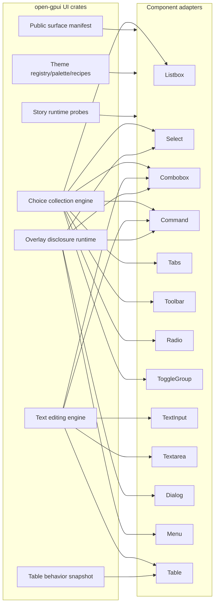
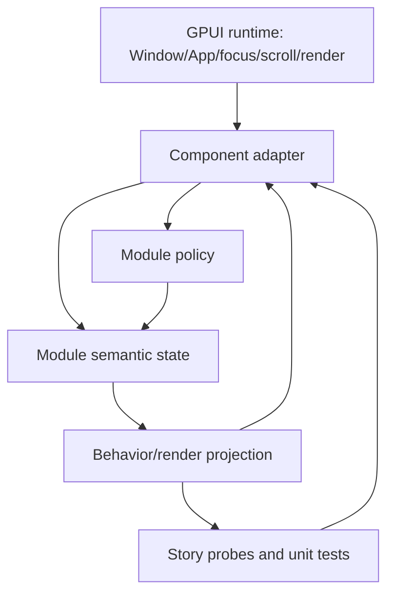
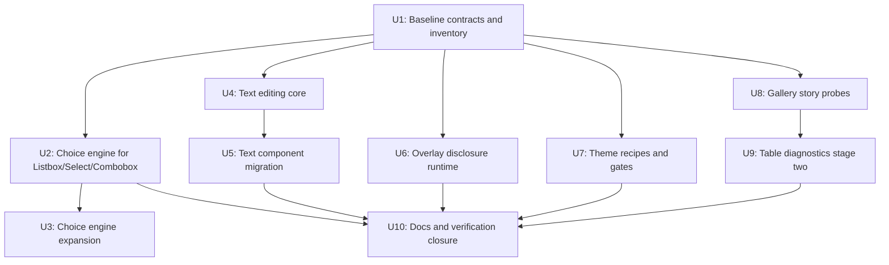

# UI Deep Modules - Plan

## Goal Capsule

Open GPUI's component library should become a general-purpose UI framework surface with deep, reusable behavior modules instead of shallow component-by-component state copies. This plan performs a fearless, breaking refactor across the UI layer while keeping the current crate/product boundary from the architecture ADRs: no standalone headless crate, no wholesale port from reference repositories, and no compatibility shims for redundant old APIs.

The highest priority is to deepen three runtime domains that currently repeat behavior across many components:

1. Choice and collection interaction.
2. Text editing.
3. Overlay disclosure.

Theme recipes, gallery contract probes, public surface inventory, and table diagnostics are supporting refactors that make the new architecture enforceable and easier to evolve.

## Product Contract

### Problem Frame

The first UI architecture deepening pass removed shallow primitive aliases, centralized some overlay state, introduced shared choice descriptors, narrowed table diagnostics, added theme snapshot registry support, and split gallery catalog metadata. That pass exposed a more important architectural issue: several component families still share the same user-facing semantics but implement them independently.

The current shape is usable for a component demo library, but not yet strong enough for a general UI framework because framework users need consistent behavior guarantees across components. The next refactor should replace duplicated local behavior with framework-level modules that own explicit contracts.

### Requirements

#### Architecture Boundary And Cleanup

`R1` Preserve the current product boundary. Keep behavior modules inside the existing UI crates and gallery example. Do not create a standalone headless crate in this plan.

`R2` Treat this as a breaking cleanup. Delete redundant compatibility surfaces, shallow pass-through exports, stale helper APIs, and obsolete test-only inspection paths when the new contracts make them unnecessary.

#### Deep Runtime Modules

`R3` Deepen choice and collection behavior. Listbox, Select, Combobox, Command, Tabs, Toolbar, Radio, and ToggleGroup should converge on one interaction model for item identity, active item movement, selected value projection, disabled item skipping, typeahead, roving focus, orientation, selection mode, accessibility-relevant semantic state, and optional command/query integration.

`R4` Deepen text editing behavior. TextInput, Textarea, table cell editors, Combobox query input, and Command query input should share a reusable editing core for document state, selection, grapheme-aware movement, UTF-16 range handling, masking, multiline policy, IME composition boundaries, submission policy, and scroll projection.

`R5` Deepen overlay disclosure behavior. Dialog, AlertDialog, Popover, HoverCard, Sheet, ContextMenu, Menu, Select, Combobox, and Command should share one disclosure runtime for controlled/uncontrolled open state, trigger/surface identity, focus restore, dismiss policy, escape/outside press semantics, accessibility-relevant open/focus semantics, surface scroll projection, and debug instrumentation. Menu branch navigation and safe-hover behavior remain specialized adapters.

`R6` Split theme responsibilities. `theme.rs` should stop being the long-term home for registry, palette, resolver, recipe, and component factory concerns. Introduce smaller theme modules and component recipes with drift and coverage gates inspired by `repo-ref/fret` tooling.

#### Contracts And Verification

`R7` Add gallery story contract probes. Gallery tests should assert user-observable component contracts through story/runtime probes instead of inspecting raw render plans, internal `.state()` values, or stringly debug selectors wherever possible.

`R8` Add a public surface manifest. Root exports, prelude exports, primitive exports, gallery/catalog ownership, docs ownership, adapter-only APIs, and diagnostic APIs should be verified from one explicit manifest or inventory source while keeping actual Rust exports explicit.

`R9` Finish table diagnostics stage two. Split public table behavior snapshots from crate-private render plans so tests and gallery code stop depending on internal layout structures such as columns, header rows, virtualizer windows, and grid viewport details.

`R10` Keep documentation, ADR references, gallery catalog metadata, and verification commands synchronized with the new architecture.

`R11` Use characterization-first implementation. Before each breaking replacement, capture current user-facing behavior in focused tests, then migrate components and delete obsolete APIs.

#### Reference Constraint

`R12` Use `repo-ref/fret` and `repo-ref/gpui-component` only as references. Do not add dependencies on either repository and do not copy their framework shape wholesale.

### Acceptance Examples

`AE1` Given equivalent option descriptors, Listbox, Select, Combobox, and Command compute active item, selected item, disabled skipping, wrapping, and typeahead behavior through the same choice collection module.

`AE2` Tabs, Toolbar, Radio, and ToggleGroup use the same collection movement semantics while applying their own selection policy and rendering adapters.

`AE3` TextInput, Textarea, table editors, Combobox query, and Command query preserve grapheme-aware cursor movement, UTF-16 selection ranges, IME composition boundaries, password masking, multiline navigation, and submission behavior through the shared text editing engine.

`AE4` Dialog, AlertDialog, Popover, Sheet, HoverCard, ContextMenu, Menu, Select, Combobox, and Command use consistent open ownership, dismiss, focus restore, and trigger/surface identity semantics.

`AE5` Theme recipes for shared component families resolve through a smaller theme module structure, and drift gates fail when component recipes or token coverage fall out of sync.

`AE6` Gallery tests can express interactions such as open, dismiss, select, edit, scroll, restore focus, and accessibility-relevant semantic state through story probes without relying on raw render plan internals.

`AE7` A public surface manifest catches root/prelude/catalog/docs drift and prevents adapter-only or diagnostic-only APIs from leaking into the public prelude.

`AE8` Table tests can validate user-facing table behavior through a public behavior snapshot while keeping detailed render plan structures crate-private.

## Planning Contract

### Key Technical Decisions

`KTD1` Current crates remain the product boundary. ADR 0005, ADR 0007, ADR 0008, and ADR 0009 all point toward adapter-first architecture inside the current crates. This plan deepens modules without extracting a new headless crate.

`KTD2` Replace duplicated behavior instead of layering facades over it. Compatibility wrappers are allowed only as short-lived migration scaffolding inside a single implementation unit and must be removed before that unit is considered done.

`KTD3` Separate semantic state from GPUI runtime handles. Deep modules own stable behavior contracts and pure projections, including accessibility-relevant state. Component adapters still own GPUI `Window`, `App`, focus handles, scroll handles, AccessKit integration, render elements, and runtime event wiring.

`KTD4` Characterize before breaking public behavior. Every component family migration starts by capturing existing behavior that users can observe, then replaces internals, then deletes old internals and brittle tests.

`KTD5` Use a manifest for verification, not for hidden code generation. Public exports stay explicit in `lib.rs`, `prelude.rs`, and module files. The manifest makes drift visible and testable.

`KTD6` Prioritize high-reuse interaction engines before cleanup-only work. Choice, text editing, and overlay runtime come before table diagnostics because they reduce repeated logic across more components.

`KTD7` Keep reference projects as design pressure only. `repo-ref/fret` is most useful for drift gates and authoring contracts. `repo-ref/gpui-component` is most useful for storybook/theme breadth. Neither becomes the architecture source of truth.

### Current Pressure Points

The audit found the largest and most coupled UI files around the same areas this plan targets:

- `crates/ui_components/src/menu.rs`
- `crates/ui_components/src/command/mod.rs`
- `crates/ui_components/src/text_input.rs`
- `crates/ui_components/src/textarea.rs`
- `crates/ui_components/src/listbox.rs`
- `crates/ui_components/src/theme.rs`
- `crates/ui_components/tests/components.rs`
- `examples/ui-foundation-gallery/tests/foundation_gallery.rs`
- `examples/ui-foundation-gallery/src/pages/components.rs`
- `examples/ui-foundation-gallery/src/pages/components/render.rs`
- `examples/ui-foundation-gallery/src/shell.rs`

This is not only a file-size problem. The same active item, selection, query editing, overlay open, focus restore, theme recipe, and test inspection ideas appear in multiple modules with local variations. A general UI framework should make these ideas explicit and reusable.

### Target Architecture



The framework modules expose policies, state transitions, and behavior snapshots. Component adapters translate GPUI events into module inputs and translate module projections into rendered UI.

### State And Runtime Ownership



Rules:

- GPUI handles stay in adapters.
- Deep modules may use stable ids, values, selection ranges, scroll intents, and behavior snapshots.
- Deep modules must not require a `Window` or `App` to compute ordinary behavior.
- Adapters may keep specialized runtime behavior only when it is truly component-specific, such as menu branch safe-hover.

### Refactor Sequence



The sequence starts with characterization and inventory because fearless refactoring is only safe when behavior is pinned down. Choice goes first because it has the highest reuse and affects many visible component contracts. Text editing and overlay runtime follow as the next broad duplication sources. Theme, gallery probes, public surface checks, and table diagnostics make the architecture enforceable.

### Public API Posture

Breaking changes are expected. The plan should prefer these outcomes:

- Remove broad primitive pass-through exports.
- Remove old component-local inspection methods when a behavior snapshot or story probe supersedes them.
- Remove redundant diagnostics getters that expose render internals.
- Rename or move helpers into domain modules when the old location hides ownership.
- Keep adapter APIs ergonomic even when internals change.
- Document meaningful public migration notes in the final docs pass.

### Unit Index

| Unit | Name | Primary Requirement | Depends On | Expected Commit Shape |
| --- | --- | --- | --- | --- |
| U1 | Baseline contracts and inventory | R8, R11 | none | test/docs/refactor |
| U2 | Choice engine for Listbox/Select/Combobox | R3 | U1 | refactor/test |
| U3 | Choice engine expansion | R3 | U2 | refactor/test |
| U4 | Text editing core | R4 | U1 | refactor/test |
| U5 | Text component migration | R4 | U4 | refactor/test |
| U6 | Overlay disclosure runtime | R5 | U1 | refactor/test |
| U7 | Theme recipes and drift gates | R6 | U1 | refactor/test/chore |
| U8 | Gallery story contract probes | R7, R8 | U1 | refactor/test |
| U9 | Table diagnostics stage two | R9 | U8 | refactor/test |
| U10 | Documentation and verification closure | R10, R11 | U2-U9 | docs/test |

## Implementation Units

### U1 - Baseline Contracts And Inventory

**Goal:** Establish the verification baseline that lets later units break internals without losing user-facing behavior.

**Requirements:** R8, R10, R11.

**Candidate files:**

- `crates/ui_components/src/lib.rs`
- `crates/ui_components/src/prelude.rs`
- `crates/ui_components/src/primitives/mod.rs`
- `crates/ui_components/tests/components.rs`
- `examples/ui-foundation-gallery/src/pages/components.rs`
- `examples/ui-foundation-gallery/src/pages/components/render.rs`
- `examples/ui-foundation-gallery/tests/foundation_gallery.rs`
- `docs/adr/0005-open-gpui-official-component-architecture.md`
- `docs/adr/0007-open-gpui-ui-headless-boundary-design.md`
- `docs/adr/0008-open-gpui-ui-component-productization-roadmap.md`
- `docs/adr/0009-open-gpui-table-and-virtualizer-product-shape.md`

**Approach:**

1. Add or refine a `SurfaceManifest`/inventory fixture under the UI component tests or crate internals. The exact location should follow existing test patterns, but it should capture component name, owning module, root export status, prelude export status, primitive status, adapter-only status, diagnostic-only status, gallery status, and docs status.
2. Convert existing public surface tests to derive expectations from the manifest.
3. Add characterization tests for the domains that will be broken later: choice movement, text editing edge cases, overlay focus/dismiss, theme recipe lookup, gallery story selection, and table behavior snapshots.
4. Identify old inspection helpers and exports that are scheduled for deletion in later units. Do not delete them in U1 unless tests already prove they are unused.

**Patterns:**

- Keep exports explicit. The manifest verifies drift; it does not generate public API.
- Prefer stable component names and owner names over stringly debug selector fragments.
- Store test-only inventory close to tests unless the production crate already has a suitable internal metadata module.

**Tests:**

- Public export inventory test.
- Prelude inventory test.
- Primitive inventory test.
- Gallery catalog inventory test.
- Docs/ADR reference inventory test where practical.
- Accessibility-relevant semantic projection characterization for choice, text, overlay, and table stories where existing components expose that state.

**Verification:**

```powershell
cargo nextest run -p open-gpui-ui-components public_surface
cargo nextest run -p open-gpui-ui-components component_inventory
cargo nextest run -p open-gpui-ui-foundation-gallery gallery_catalog
```

**Done when:**

- The manifest catches root/prelude/catalog/docs drift.
- Later units can delete or move APIs with a clear inventory failure if something still depends on the old surface.

### U2 - Choice Engine For Listbox, Select, And Combobox

**Goal:** Replace local active/selected/typeahead behavior in the first choice-family components with a shared collection engine.

**Requirements:** R3, R11.

**Candidate files:**

- `crates/ui_components/src/choice.rs`
- `crates/ui_components/src/listbox.rs`
- `crates/ui_components/src/select.rs`
- `crates/ui_components/src/combobox.rs`
- `crates/ui_components/tests/components.rs`
- `examples/ui-foundation-gallery/src/pages/components/render.rs`
- `examples/ui-foundation-gallery/tests/foundation_gallery.rs`

**Approach:**

1. Replace the current shallow descriptor helper with a deeper `ChoiceCollection` or equivalent model. It should own stable item identity, enabled/disabled status, optional text value, display label, group/section metadata if needed, and selection value projection.
2. Introduce a policy object or enum set for orientation, wrapping, typeahead, selection mode, activation mode, and disabled-item strategy.
3. Implement movement and typeahead transitions as pure operations that do not require GPUI runtime handles.
4. Migrate Listbox first because it is closest to raw collection behavior.
5. Migrate Select next, mapping trigger value display and popup selection to the same model.
6. Migrate Combobox after Select, using the same model while preserving query/filter integration points.
7. Delete superseded component-local helpers, duplicated keyboard movement code, and obsolete tests that assert internals instead of behavior.

**Patterns:**

- Component adapters own rendering, focus handles, popup wiring, and GPUI events.
- The choice engine owns item traversal and selection semantics.
- Stable identity should not depend on display label unless the component explicitly configures it.
- Typeahead should operate over normalized candidate text supplied by adapters.

**Tests:**

- Listbox skips disabled options and preserves selected value.
- Select opens with the selected item active and commits through the shared model.
- Combobox filters without losing stable active/selected identity.
- Typeahead behavior is identical for Listbox, Select, and Combobox when given the same candidates.
- Wrapping and non-wrapping movement are covered.
- Selected, active, and disabled semantic states are projected consistently for adapters to expose.

**Verification:**

```powershell
cargo nextest run -p open-gpui-ui-components listbox select combobox choice
```

**Done when:**

- Listbox, Select, and Combobox no longer each implement their own active item traversal.
- Shared tests prove equivalent descriptors produce equivalent movement and selection outcomes.

### U3 - Choice Engine Expansion

**Goal:** Extend the shared choice engine into Command, Tabs, Toolbar, Radio, and ToggleGroup without forcing those components into the same visual API.

**Requirements:** R3, R11.

**Candidate files:**

- `crates/ui_components/src/command/mod.rs`
- `crates/ui_components/src/command/runtime.rs`
- `crates/ui_components/src/tabs.rs`
- `crates/ui_components/src/toolbar.rs`
- `crates/ui_components/src/radio.rs`
- `crates/ui_components/src/toggle_group.rs`
- `crates/ui_components/src/choice.rs`
- `crates/ui_components/tests/components.rs`
- `examples/ui-foundation-gallery/src/pages/components/render.rs`

**Approach:**

1. Add choice policies required by non-list components: single required selection, optional selection, multi selection, roving focus without value selection, command activation, and orientation-specific movement.
2. Migrate Command item navigation while preserving command-specific search and action dispatch.
3. Migrate Tabs to use the shared active/selected model while keeping tab panel rendering owned by Tabs.
4. Migrate Toolbar to use roving focus semantics without pretending every toolbar control is a selectable option.
5. Migrate Radio and ToggleGroup to share selection movement while preserving form/value semantics.
6. Delete redundant movement helpers and duplicated disabled-skip logic.

**Patterns:**

- Do not invent a visual "choice component" abstraction. The module is behavioral.
- Command remains command-specific for ranking, query, and execution.
- Toolbar remains control-specific for buttons, menus, and mixed child controls.

**Tests:**

- Command preserves active result across query updates when the stable item is still present.
- Tabs skip disabled tabs and select according to configured activation mode.
- Toolbar roves focus through enabled controls without imposing selection state.
- Radio enforces single selection.
- ToggleGroup supports the existing single/multiple behavior through shared policy.

**Verification:**

```powershell
cargo nextest run -p open-gpui-ui-components command tabs toolbar radio toggle_group choice
```

**Done when:**

- Choice and collection semantics have one owner across the component family.
- Component-specific code handles only rendering, specialized actions, and integration.

### U4 - Text Editing Core

**Goal:** Create a reusable text editing module that owns document state, cursor/selection transitions, and editing policies.

**Requirements:** R4, R11.

**Candidate files:**

- `crates/ui_components/src/text_editing.rs`
- `crates/ui_components/src/text_input.rs`
- `crates/ui_components/src/textarea.rs`
- `crates/ui_components/src/table/editors.rs`
- `crates/ui_components/src/combobox.rs`
- `crates/ui_components/src/command/mod.rs`
- `crates/ui_components/tests/components.rs`

**Approach:**

1. Promote `text_editing.rs` from helper territory into the owner of text document behavior.
2. Define an `EditableTextDocument`, `TextSelection`, `TextEditingPolicy`, and `TextEditingProjection` or equivalent set of types.
3. Make grapheme-aware movement, UTF-16 range conversion, selection replacement, delete/backspace semantics, masking projection, and IME composition boundaries explicit.
4. Model single-line, multiline, password/masked, query, and table-editor behavior as policies.
5. Keep GPUI text input controller, focus handles, and rendering in adapters.
6. Add extensive unit tests before migrating components.

**Patterns:**

- The core module should accept text and policy inputs and return semantic updates/projections.
- It should not own visual measurement or GPUI event dispatch.
- Multiline behavior can expose scroll intents, but the adapter owns actual scroll handles.

**Tests:**

- Grapheme clusters move and delete as user-visible units.
- UTF-16 ranges round-trip for composed characters.
- Masked input does not leak actual text through display projection.
- Single-line submission differs from multiline newline insertion.
- IME composition updates do not corrupt committed selection.
- Selection replacement behaves consistently across input families.

**Verification:**

```powershell
cargo nextest run -p open-gpui-ui-components text_editing
```

**Done when:**

- Text editing behavior can be tested without rendering TextInput or Textarea.
- Component migrations have a stable target core.

### U5 - Text Component Migration

**Goal:** Move TextInput, Textarea, table editors, Combobox query input, and Command query input onto the shared text editing core.

**Requirements:** R4, R11.

**Candidate files:**

- `crates/ui_components/src/text_input.rs`
- `crates/ui_components/src/textarea.rs`
- `crates/ui_components/src/table/editors.rs`
- `crates/ui_components/src/combobox.rs`
- `crates/ui_components/src/command/mod.rs`
- `crates/ui_components/src/text_editing.rs`
- `crates/ui_components/tests/components.rs`
- `examples/ui-foundation-gallery/tests/foundation_gallery.rs`

**Approach:**

1. Migrate TextInput first because it should exercise single-line, masked, placeholder, selection, and submit behavior.
2. Migrate Textarea second, preserving multiline layout and scroll behavior through adapter-owned projection handling.
3. Migrate table cell editors so editing does not accidentally select rows or leak table internals.
4. Migrate Combobox query input while preserving choice/filter behavior from U2.
5. Migrate Command query input while preserving ranking and active-item retention from U3.
6. Delete old component-local selection/editing helpers and brittle tests that were only guarding duplicate internals.

**Patterns:**

- Components configure editing policy instead of reimplementing editing rules.
- Table editor integration should prove text editing and table selection are separate concerns.
- Query components should keep query text changes separate from choice active item transitions.

**Tests:**

- TextInput masked and unmasked behavior.
- Textarea multiline insertion, movement, and scroll projection.
- Table editor typing commits/cancels without row selection side effects.
- Combobox query editing preserves selected value and active result rules.
- Command query editing preserves active command when possible.

**Verification:**

```powershell
cargo nextest run -p open-gpui-ui-components text_input textarea table_cell_edit combobox command
```

**Done when:**

- User-facing text behavior is centralized.
- Component files stop carrying their own selection and editing engines.

### U6 - Overlay Disclosure Runtime

**Goal:** Replace repeated open/default-open/focus/dismiss/surface-scroll runtime logic with one overlay disclosure runtime used by all overlay-like components.

**Requirements:** R5, R11.

**Candidate files:**

- `crates/ui_components/src/overlay.rs`
- `crates/ui_components/src/menu.rs`
- `crates/ui_components/src/menu/runtime.rs`
- `crates/ui_components/src/context_menu.rs`
- `crates/ui_components/src/dialog.rs`
- `crates/ui_components/src/alert_dialog.rs`
- `crates/ui_components/src/popover.rs`
- `crates/ui_components/src/hover_card.rs`
- `crates/ui_components/src/sheet.rs`
- `crates/ui_components/src/select.rs`
- `crates/ui_components/src/combobox.rs`
- `crates/ui_components/src/command/mod.rs`
- `crates/ui_components/tests/components.rs`
- `examples/ui-foundation-gallery/src/pages/overlay.rs`
- `examples/ui-foundation-gallery/tests/foundation_gallery.rs`

**Approach:**

1. Define an `OverlayDisclosureRuntime`, `OverlayDisclosureState`, or equivalent owner for controlled/uncontrolled open state, trigger id, surface id, focus restore intent, dismiss reasons, escape/outside press policy, and surface scroll projection.
2. Migrate Dialog and Popover first because their behavior should be simpler than Menu.
3. Migrate AlertDialog, Sheet, HoverCard, and ContextMenu using specialized policy values.
4. Migrate Select, Combobox, and Command popup behavior once the runtime supports trigger/surface coordination.
5. Migrate Menu last. Keep branch navigation and safe-hover logic in `menu/runtime.rs` or a specialized menu adapter, but make open ownership and focus restore use the shared disclosure runtime.
6. Delete duplicated default-open handling, focus-restore helpers, and debug selector plumbing that the runtime supersedes.

**Patterns:**

- Overlay placement/rendering remains adapter-owned.
- Dismiss reasons should be explicit enough for tests and callbacks.
- Focus restore should be a runtime projection rather than each component manually remembering ad hoc handles.
- Menu can be specialized, but it should not duplicate generic disclosure state.

**Tests:**

- Controlled and uncontrolled open state behavior.
- Escape and outside press dismissal by component policy.
- Trigger focus restoration after close.
- Nested/menu branch behavior remains correct.
- Popup components preserve selection/query behavior from Choice/Text units while using the shared overlay runtime.
- Open, modal/non-modal, trigger, and focused-surface semantics are available to adapters.

**Verification:**

```powershell
cargo nextest run -p open-gpui-ui-components overlay dialog alert_dialog popover hover_card sheet context_menu menu select combobox command
```

**Done when:**

- Overlay-like components share open/dismiss/focus runtime semantics.
- Menu-specific runtime code contains only menu-specific behavior.

### U7 - Theme Recipes And Drift Gates

**Goal:** Split theme responsibilities into smaller modules and add automated drift checks for tokens and component recipes.

**Requirements:** R6, R10, R11, R12.

**Candidate files:**

- `crates/ui_components/src/theme.rs`
- `crates/ui_components/src/color.rs`
- `crates/ui_components/src/button.rs`
- `crates/ui_components/src/text_input.rs`
- `crates/ui_components/src/textarea.rs`
- `crates/ui_components/src/listbox.rs`
- `crates/ui_components/src/select.rs`
- `crates/ui_components/src/combobox.rs`
- `crates/ui_components/src/menu.rs`
- `crates/ui_components/src/table/mod.rs`
- `crates/ui_components/tests/components.rs`
- `xtask`
- `docs`
- `repo-ref/fret/tools/check_theme_token_drift.py`
- `repo-ref/fret/tools/check_theme_token_coverage.py`

**Approach:**

1. Split `theme.rs` into smaller modules such as registry, palette, resolver, and recipes. Exact names should match the local code style.
2. Define recipe types for repeated component surfaces, starting with Button, Field/Input, ChoiceItem, OverlaySurface, and Table.
3. Keep theme registration explicit and deterministic. Do not introduce global mutable theme state.
4. Add drift/coverage gates inspired by Fret's tools. Implement them in Rust `xtask`, existing test infrastructure, or a repo-appropriate script path.
5. Wire the gates into `cargo run -p xtask -- verify` if they are stable enough for every developer run.
6. Update theme snapshots and docs.

**Patterns:**

- Recipes should reduce repeated token resolution, not hide component intent.
- Component-specific overrides remain possible through typed recipe inputs.
- Gates should explain missing tokens or recipe coverage in terms maintainers can fix quickly.

**Tests:**

- Theme registry snapshot still resolves default themes.
- Component recipes produce stable colors/metrics for default theme.
- Drift gate fails for missing recipe/token coverage.
- Existing component visual/behavior tests keep passing after recipe migration.

**Verification:**

```powershell
cargo nextest run -p open-gpui-ui-components theme_registry theme_resolver theme_snapshots
cargo run -p xtask -- verify
```

**Done when:**

- `theme.rs` is no longer the long-term god module for all theme concerns.
- Token and recipe drift are automatically detected.

### U8 - Gallery Story Contract Probes

**Goal:** Give gallery tests a stable, user-observable contract layer so they stop depending on raw component internals.

**Requirements:** R7, R8, R10, R11.

**Candidate files:**

- `examples/ui-foundation-gallery/src/shell.rs`
- `examples/ui-foundation-gallery/src/pages/components.rs`
- `examples/ui-foundation-gallery/src/pages/components/render.rs`
- `examples/ui-foundation-gallery/src/pages/overlay.rs`
- `examples/ui-foundation-gallery/tests/foundation_gallery.rs`
- `crates/ui_components/tests/components.rs`

**Approach:**

1. Introduce `ComponentStoryContract`, `StoryRuntimeProbe`, or equivalent test-facing abstraction.
2. Define probe operations for open, dismiss, select, edit, scroll, focus, activate, and read public payload.
3. Migrate the most brittle gallery tests first: tests that inspect `.render_plan()`, `.state()`, raw selector strings, or internal row/window details.
4. Keep debug selectors where they are useful for accessibility-like targeting, but do not make them the primary assertion contract.
5. Align probe metadata with the public surface manifest from U1.

**Patterns:**

- Probes express what a user or app integrator can observe.
- Probes should make common interactions shorter, not create another hidden runtime.
- Do not expose crate-private render internals just to satisfy gallery tests.

**Tests:**

- Component gallery smoke still focuses catalog entries.
- All-mode gallery smoke still restores focus and navigates stories.
- Overlay page tests assert open/dismiss/focus through probes.
- Component story payload tests assert public behavior only.

**Verification:**

```powershell
cargo nextest run -p open-gpui-ui-foundation-gallery components_gallery_smoke_focuses_catalog_family_and_restores_all_mode components_gallery_smoke_focuses_every_focusable_catalog_entry
cargo nextest run -p open-gpui-ui-foundation-gallery
```

**Done when:**

- Gallery tests no longer need raw render plan internals for ordinary behavior.
- The story contract can be reused by future component families.

### U9 - Table Diagnostics Stage Two

**Goal:** Finish narrowing table diagnostics by separating public behavior snapshots from crate-private render plan internals.

**Requirements:** R9, R10, R11.

**Candidate files:**

- `crates/ui_components/src/table/render_plan/mod.rs`
- `crates/ui_components/src/table/resolve.rs`
- `crates/ui_components/src/table/mod.rs`
- `crates/ui_components/tests/components.rs`
- `examples/ui-foundation-gallery/src/pages/components/render.rs`
- `examples/ui-foundation-gallery/tests/foundation_gallery.rs`
- `docs`

**Approach:**

1. Define a public `TableBehaviorSnapshot` or equivalent that exposes only user-facing table behavior: selected rows, active cell or row, sort/filter state where applicable, visible range summary, and interaction readiness.
2. Move detailed render plan structures such as columns, header rows, row layouts, grid viewport, and virtualizer internals behind crate-private APIs.
3. Migrate tests and gallery probes to use the behavior snapshot plus StoryRuntimeProbe operations.
4. Keep low-level render plan tests inside module-level tests where crate-private access is appropriate.
5. Delete public getters and diagnostics that expose implementation layout.

**Patterns:**

- Public diagnostics describe behavior, not layout mechanics.
- Private render plan tests remain allowed for algorithm correctness.
- The virtualizer/table boundary from ADR 0009 remains intact.

**Tests:**

- Table behavior snapshot covers selected row/cell state.
- Virtualized visible range summary remains stable.
- Gallery table stories assert public behavior through probes.
- Render plan internals are tested only in crate-private tests.

**Verification:**

```powershell
cargo nextest run -p open-gpui-ui-components table
cargo nextest run -p open-gpui-ui-foundation-gallery table
```

**Done when:**

- Public consumers no longer need table render plan internals.
- Table diagnostics remain useful without leaking layout structures.

### U10 - Documentation And Verification Closure

**Goal:** Close the refactor with synchronized docs, migration notes, and full verification.

**Requirements:** R10, R11, R12.

**Candidate files:**

- `docs/adr/0005-open-gpui-official-component-architecture.md`
- `docs/adr/0007-open-gpui-ui-headless-boundary-design.md`
- `docs/adr/0008-open-gpui-ui-component-productization-roadmap.md`
- `docs/adr/0009-open-gpui-table-and-virtualizer-product-shape.md`
- `docs/plans/2026-06-30-001-refactor-ui-architecture-deepening-plan.md`
- `docs`
- `crates/ui_components/src/lib.rs`
- `crates/ui_components/src/prelude.rs`
- `examples/ui-foundation-gallery`
- `xtask`

**Approach:**

1. Update docs to describe the new module ownership: choice, text editing, overlay disclosure, theme recipes, story probes, public surface manifest, and table behavior snapshots.
2. Add migration notes for breaking removals and renamed APIs.
3. Update ADR references only if the final implementation changes the current architecture decisions. Do not rewrite accepted ADRs just to restate the plan.
4. Run focused package tests, then the full repository verification command.
5. Review the final public surface inventory and delete stale code that was left only for temporary migration.

**Verification:**

```powershell
cargo fmt --check
cargo check -p open-gpui-ui-core --tests
cargo check -p open-gpui-ui-components --tests
cargo check -p open-gpui-ui-foundation-gallery --tests
cargo nextest run -p open-gpui-ui-core
cargo nextest run -p open-gpui-ui-components
cargo nextest run -p open-gpui-ui-foundation-gallery
cargo run -p xtask -- verify
```

**Done when:**

- Full verification passes.
- Docs and tests describe the new architecture.
- Temporary compatibility scaffolding is removed.
- No dependency or source migration from `repo-ref/fret` or `repo-ref/gpui-component` exists.

## Cross-Cutting Risks

### Risk: Interaction Modules Become A New God Layer

Mitigation: Keep modules behavior-specific. Choice owns collection semantics, Text owns editing semantics, Overlay owns disclosure semantics. None of them should become a generic component framework inside the framework.

### Risk: Public Surface Manifest Drifts Into Code Generation

Mitigation: Treat the manifest as a test and documentation contract. Rust exports remain explicit so public API review remains readable.

### Risk: Gallery Probes Hide Real Regressions

Mitigation: Probes must encode user-observable interactions and payloads, not permissive snapshots. Keep targeted lower-level tests where internals matter.

### Risk: Text Editing Touches Many Edge Cases

Mitigation: Build the core with characterization tests for grapheme clusters, UTF-16 ranges, masking, IME composition, multiline behavior, and submission before migrating adapters.

### Risk: Overlay Runtime Over-Flattens Menu Behavior

Mitigation: Only general disclosure state moves into the shared runtime. Menu branch navigation, nested menu timers, and safe-hover behavior remain specialized.

### Risk: Theme Gates Become Noisy

Mitigation: Start gates with component families migrated in U7 and expand coverage deliberately. Error messages should name the missing token/recipe and owning component.

## Verification Contract

Use focused verification after each unit and full verification at the end.

Focused commands:

```powershell
cargo nextest run -p open-gpui-ui-components choice listbox select combobox
cargo nextest run -p open-gpui-ui-components command tabs toolbar radio toggle_group
cargo nextest run -p open-gpui-ui-components text_editing text_input textarea table_cell_edit
cargo nextest run -p open-gpui-ui-components overlay dialog alert_dialog popover hover_card sheet context_menu menu
cargo nextest run -p open-gpui-ui-components theme_registry theme_resolver theme_snapshots
cargo nextest run -p open-gpui-ui-foundation-gallery
```

Final commands:

```powershell
cargo fmt --check
cargo check -p open-gpui-ui-core --tests
cargo check -p open-gpui-ui-components --tests
cargo check -p open-gpui-ui-foundation-gallery --tests
cargo nextest run -p open-gpui-ui-core
cargo nextest run -p open-gpui-ui-components
cargo nextest run -p open-gpui-ui-foundation-gallery
cargo run -p xtask -- verify
```

If package names or test filters differ after refactor, update the command list in docs before closing U10.

## Definition Of Done

- Choice and collection semantics have one behavioral owner across Listbox, Select, Combobox, Command, Tabs, Toolbar, Radio, and ToggleGroup.
- Text editing semantics have one behavioral owner across TextInput, Textarea, table editors, Combobox query, and Command query.
- Overlay disclosure semantics have one runtime owner across overlay-like components while preserving menu-specific behavior.
- Theme registry, palette, resolver, and recipes are separated enough to stop `theme.rs` from growing as a god module.
- Theme token/recipe drift is covered by automated verification.
- Gallery tests assert story contracts through stable probes.
- Public surface drift is caught by a manifest/inventory test.
- Accessibility-relevant semantic states are covered by module projections and adapter/story tests where components expose them.
- Table public diagnostics expose behavior snapshots instead of render plan internals.
- Obsolete compatibility exports, duplicate helpers, and brittle inspection tests are removed.
- Documentation and migration notes match the final implementation.
- Full verification passes through `cargo run -p xtask -- verify`.

## Implementation Notes For The Next Worker

- Start with U1 even though Choice is the highest-priority domain. The baseline is what makes the rest safe to break.
- Commit per unit or per coherent component family using Conventional Commits.
- Before deleting an API, search for all local references and confirm the new manifest/probe/test contract covers the intended behavior.
- Prefer small domain modules with explicit names over broad `common` or `shared` buckets.
- Keep code comments sparse and explanatory. Public docs and API names should carry most of the design intent.
- If a unit uncovers a better module name than the placeholders in this plan, use the better local name and update docs/tests in the same unit.
