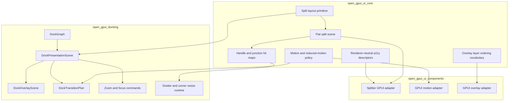
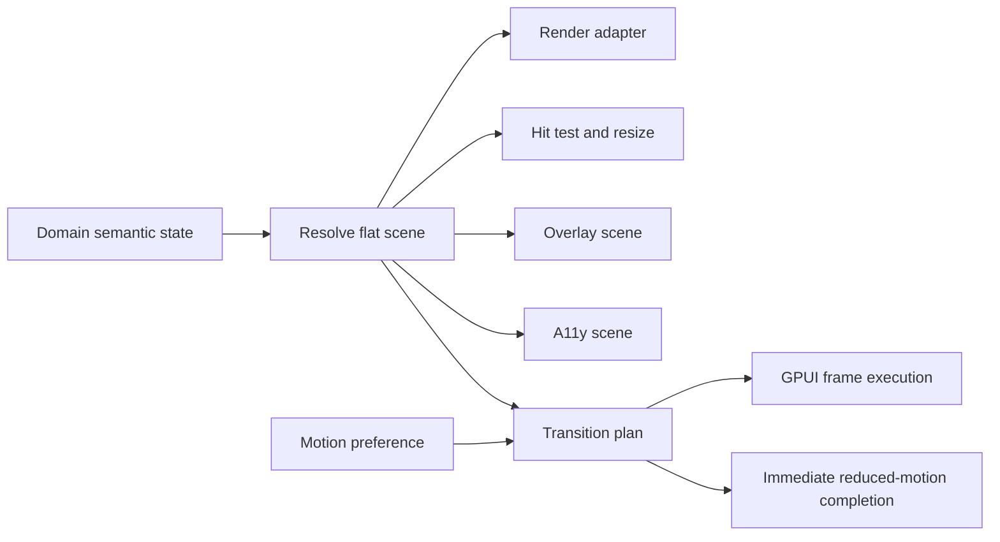
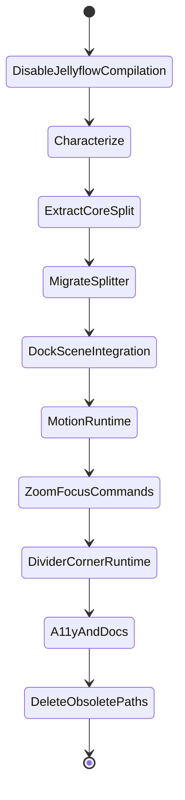

# Docking Split Motion Primitives - Plan

## Goal Capsule

| Field | Value |
| --- | --- |
| Objective | Promote split layout, motion policy, hit-map, and presentation-scene vocabulary into reusable Open GPUI primitives, then wire docking and the existing `Splitter` component through those primitives. |
| Authority | Semantic layout stays owned by each domain (`DockGraph` for docking, `SplitterState` inputs for the component); reusable primitives own resolved split geometry, transition descriptors, reduced-motion policy, and adapter-neutral proof surfaces. |
| Scope posture | Fearless refactor: break private APIs, move state solvers out of GPUI-rendering files, delete duplicate geometry paths, and keep public APIs source-compatible only where the compatibility does not preserve the old architecture. |
| Execution profile | Foundation-first extraction, characterization tests around existing behavior, then docking runtime integration and visual/semantic proof expansion. |
| Stop condition | Docking preview, `ui_components::Splitter`, zoom/focus descriptors, divider/corner hit maps, motion policy, reduced motion, and accessibility descriptors are explainable from shared primitives and covered by focused `nextest` gates. |

---

## Product Contract

### Summary

This plan turns the current descriptor-first docking work into reusable Open GPUI infrastructure: a renderer-neutral split layout primitive, a small motion/reduced-motion model, shared hit-map/accessibility descriptors, and GPUI adapters that can serve both `ui_components::Splitter` and docking.
The plan targets capability alignment with ImGui-style docking, BonSplit, Iced PaneGrid, egui_tiles, and the user-provided SuperSplit notes; it does not target pixel-level styling parity or Apple-specific CoreAnimation internals.

### Problem Frame

The previous docking refactor established a better vocabulary for presentation scenes, overlay layers, transition descriptors, zoom/focus state, divider hit maps, and accessibility descriptors inside `open-gpui-docking`.
That solved important preview behavior, but it left two architectural gaps.

First, the strongest ideas are still docking-private.
The component library already has a `Splitter`, but its panel descriptor, resolver, runtime drag state, metrics, and GPUI rendering live in one `ui_components` file.
That duplicates the same domain that docking needs: split fraction normalization, pane bounds, handle bounds, resize constraints, corner/junction hit maps, reduced-motion-aware transitions, keyboard/a11y semantics, and semantic proof.

Second, descriptor data is not yet a runtime capability.
Docking can describe scenes and transitions in tests, but user-facing actions still need a stronger bridge from scene data into rendering, overlay feedback, focus/zoom commands, animation scheduling, and cleanup of older render-local geometry paths.
The next refactor should make the scene and primitive models the real implementation surface, not only a proof surface.

The transferable lesson from SuperSplit is the separation of semantic tree, flat resolved geometry, root-level overlay, transition plan, occlusion, focus presentation, zoom/unzoom, accessibility, and platform animation adapter.
BonSplit contributes controller-facing split/tab operations, layout snapshots, focus navigation, and zoom as presentation state.
Iced PaneGrid contributes a clean programmatic state API for split, resize, drag, drop, maximize, restore, and nearest-region targeting.
egui_tiles contributes retained tile-tree and grid/drop-zone concepts.
Open GPUI should use those ideas to build repo-native primitives that remain renderer-neutral below `ui_components` and domain-aware inside docking.

### Requirements

**Reusable split primitives**

- R1. `open_gpui_ui_core` must own renderer-neutral split layout data: panel descriptors, resolved panels, split handles, layout rectangles, resize constraints, and stable IDs that do not depend on GPUI element state.
- R2. The split primitive must support both simple ordered splitters and nested pane-grid style trees without forcing docking to replace `DockGraph`.
- R3. Split layout resolution must produce a flat scene with absolute pane, handle, and optional junction hit regions for use by renderers, tests, accessibility descriptors, and motion planning.
- R4. Resize math must preserve min/max/collapsed constraints, normalize fractions deterministically, and expose observable no-op/rejected outcomes instead of silently drifting.
- R5. Existing `ui_components::Splitter` behavior must be migrated onto the split primitive while keeping a practical compatibility layer for current callers.

**Motion and overlay primitives**

- R6. `open_gpui_ui_core` must expose small renderer-neutral motion vocabulary for preference, duration tokens, easing tokens, immediate/reduced-motion degradation, interpolation intent, and transition identity.
- R7. GPUI-specific frame scheduling must stay in the adapter layer unless implementation proves a minimal GPUI core helper is required.
- R8. Root-level overlay feedback must be modeled as ordered scene layers, not pane-local ad hoc children; domains may map their own layer kinds into the shared ordering contract.
- R9. Motion descriptors must be independent from animation execution so semantic tests can pass in headless mode and native examples can animate where platform support exists.

**Docking capability integration**

- R10. Docking must consume the shared split primitive for resolved pane/handle geometry where it overlaps with split layout, while `DockGraph` remains the semantic authority.
- R11. `DockPresentationScene` must become the runtime geometry source for overlapping render, hit test, overlay, motion, accessibility, and debug selector behavior.
- R12. Center docking must keep tab insertion preview as a first-class layer with target slot, insertion index, payload tab descriptors, clipping bounds, and rejected state.
- R13. Edge/root docking must keep split preview bands scoped to the resolved leaf/root target and must not show tab insertion affordances.
- R14. Routed cross-window preview must preserve current-facts authority while using the same target overlay semantics as local hover.
- R15. Zoom/unzoom must be exposed as presentation commands that do not mutate `DockGraph`; hidden panes compute deterministic egress edges with touching-edge preference.
- R16. Focus presentation must derive from scene data and cooperate with existing GPUI focus tracking rather than replacing it.
- R17. Divider and corner/junction drag must use one hit-map model and update split fractions through existing validation paths.
- R18. Accessibility descriptors for panes, tab lists, tabs, tab panels, splitters, drag sources, drop destinations, and preview state must derive from the same scenes as render and hit testing.

**Verification and cleanup**

- R19. Tests must lock semantic behavior for split resolution, resize constraints, tab insertion preview, overlay layer order, route preview, transition plans, zoom/unzoom, focus descriptors, corner hit maps, reduced motion, and accessibility descriptors.
- R20. Native examples must keep a visible docking workflow that can be run with logging and that does not require Jellyflow dependencies to compile.
- R21. Obsolete render-local geometry inference, preview compatibility shims, shallow pass-through helpers, and duplicated splitter math must be deleted after replacement tests pass.
- R22. Documentation must capture the primitive boundary so future UI components do not reintroduce GPUI-renderer state solvers in component files.

### Acceptance Examples

- AE1. Given three splitter panels with uneven fractions and min/max constraints, when the split primitive resolves them in a fixed rectangle, then panel bounds and handle bounds are deterministic, fractions sum to one, and rejected resize attempts report why they failed.
- AE2. Given the existing `ui_components::Splitter`, when a caller builds it through current public constructors, then the rendered component uses the new split primitive state and existing component tests still prove fraction normalization, collapse, disabled handles, and drag preview state.
- AE3. Given a nested split tree with a junction between horizontal and vertical splits, when the pointer hits the corner zone, then the hit map identifies both affected axes and resize application updates both through constraint validation.
- AE4. Given a docking hover over the center of a tab stack, when the payload contains multiple tabs, then the overlay scene exposes tab insertion slot, insertion index, payload tab descriptors, clipping bounds, and rejected/allowed state without relying on pixel-perfect rendering.
- AE5. Given a docking hover over the left edge of a nested lower-right pane, when the release commits, then the graph mutation targets the nested pane and the preview never falls back to root-left semantics.
- AE6. Given a routed cross-window drag, when target hover changes, then the source window only exposes route-marker feedback and the target window exposes the same target overlay layers as a local hover.
- AE7. Given zoom on a dock pane, when unzoom is requested, then `DockGraph` is unchanged, focus is restored or preserved, sibling egress edges are deterministic, and reduced motion returns the final scene immediately.
- AE8. Given a new split insertion, when previous and next scenes are compared, then the transition descriptors place the incoming pane at final size, describe slide/occlusion/divider expansion intent, and can be executed or reduced without changing semantics.
- AE9. Given platform accessibility collection, when a docking scene is resolved, then panes, tab lists, selected tabs, tab panels, splitters, drag sources, and drop destinations have stable roles, bounds, labels, and action descriptors.
- AE10. Given the native docking example, when Jellyflow dependencies are disabled from compilation, then the docking example still builds and demonstrates local dock, routed dock, tab insertion preview, tear-off, zoom/unzoom, and divider resize paths.

### Scope Boundaries

#### In Scope

- Renderer-neutral split layout primitives in `open_gpui_ui_core`.
- Renderer-neutral motion/reduced-motion descriptors and GPUI adapter execution where needed.
- Refactoring `ui_components::Splitter` to consume core split primitives.
- Docking runtime integration of presentation scene, overlay layers, transition descriptors, zoom/focus commands, divider/corner hit maps, accessibility descriptors, and current-facts route previews.
- Deleting replaced private docking and splitter geometry helpers.
- Updating ADR/docs/verification notes for the new primitive boundary.
- Local reference use from `repo-ref/bonsplit`, `repo-ref/egui_tiles`, `repo-ref/iced`, and existing `repo-ref/imgui`.

#### Deferred To Follow-Up Work

- Pixel-perfect ImGui, BonSplit, SuperSplit, or macOS styling parity.
- A full public animation framework for every GPUI component.
- Full platform VoiceOver/UIAutomation mapping if GPUI lacks specific platform hooks.
- Cross-platform native compositor features such as transparent payload windows when the platform backend cannot support them reliably.
- A public docking layout persistence redesign beyond additive zoom/focus state if required.

#### Outside This Plan

- Replacing `DockGraph` with a persistent flat grid.
- Replacing GPUI's windowing or accessibility backend.
- Introducing SwiftUI/AppKit/CoreAnimation dependencies.
- Making repo-ref clones part of compiled workspace code.
- Re-enabling Jellyflow compilation in examples.

---

## Planning Contract

### Current Findings

| Finding | Evidence | Planning implication |
| --- | --- | --- |
| `ui_core` already owns foundation vocabulary but has no split or motion primitive. | `crates/ui_core/src/lib.rs` exports a11y, focus, geometry, overlay, table, tokens, and virtualizer modules. | Add split and motion primitives at the same layer instead of putting more solvers in `ui_components`. |
| `ui_components::Splitter` combines pure state, runtime drag state, metrics, and GPUI rendering. | `crates/ui_components/src/splitter.rs` defines descriptors, resolved state, handle state, runtime drag, and render logic in one file. | Extract the pure solver and scene data first, then keep GPUI event wiring in the component adapter. |
| Docking already has descriptor files but they are not yet a shared primitive. | `presentation_scene.rs`, `overlay_scene.rs`, `transition_geometry.rs`, `zoom_state.rs`, `divider_hit_map.rs`, and `accessibility_scene.rs` exist under `crates/gpui_docking/src`. | Treat these as characterization and migration input, not as the final boundary. |
| Docking still has many viewport and render modules that can drift from scene data. | `render.rs`, `render_split.rs`, `render_tabs.rs`, `viewport_drop_scene.rs`, `viewport_routed_preview.rs`, and `host_render_session.rs` all participate in geometry or feedback. | Runtime integration must replace overlapping geometry paths rather than only adding more descriptors. |
| GPUI has frame scheduling but no general UI motion primitive. | `Window::request_animation_frame` and existing element animation usage exist in `crates/gpui/src/window.rs` and GPUI elements. | Build motion policy in UI core and use GPUI frame scheduling from adapters before changing GPUI core. |
| BonSplit, Iced PaneGrid, and egui_tiles converge on retained semantic state plus resolved layout snapshots. | Local references under `repo-ref/bonsplit`, `repo-ref/iced/widget/src/pane_grid.rs`, and `repo-ref/egui_tiles/src/tree.rs`. | Open GPUI should keep domain-owned semantic trees but standardize the flat resolved scene and operation descriptors. |
| The user explicitly values capability parity over pixel parity. | Recent conversation focused on preview ability, split layout primitives, zoom/unzoom, animation, focus, and accessibility. | Tests should assert semantic descriptors and stable geometry, with only narrow pixel-region checks for visible regressions. |

### Key Technical Decisions

- KTD1. Add `ui_core` split primitives before touching more docking rendering. This prevents `Splitter` and docking from growing separate solvers for the same split math.
- KTD2. Keep semantic trees domain-owned. `DockGraph`, component panel lists, and future pane grids can each keep their own persistent model while resolving into shared flat scenes for geometry, hit maps, a11y, and motion.
- KTD3. Keep animation execution adapter-owned. `ui_core` should describe motion policy and transition intent; `ui_components` and docking can schedule frames through GPUI without forcing all components onto one runtime immediately.
- KTD4. Treat root overlay as a capability, not a style. Shared layer ordering and semantic descriptors matter more than matching ImGui or SuperSplit colors, opacity, or corner radius.
- KTD5. Move `Splitter` with a compatibility facade. Public constructors can continue where reasonable, but implementation should be free to move state types or re-export aliases from `ui_core`.
- KTD6. Make docking scene integration delete old paths. If render or hit testing can compute rectangles without the scene after this refactor, that duplicate path must either be justified or removed.
- KTD7. Zoom/focus ship as commands only after descriptor tests pass. The descriptor layer already exists; the next useful user capability is command/runtime integration, not more private-only DTOs.
- KTD8. Accessibility and reduced motion are part of the primitive contract. They are not optional polish because their descriptors constrain what motion and overlay state are allowed to mean.
- KTD9. Keep reference repos out of the workspace build. `repo-ref` is design evidence only; no compiled dependency should be introduced without a separate ADR.

### Assumptions

- The current local branch is the implementation target; no new worktree is required unless the user asks for isolation.
- The user accepts breakage of private APIs and deletion of obsolete code, but public examples and currently documented component APIs should only break when the plan calls it out explicitly.
- `repo-ref/iced` is available locally as reference material and should remain a non-workspace reference clone.
- Existing docking descriptor tests from the prior plan should be preserved and expanded, not discarded.
- If GPUI's accessibility API cannot express a descriptor immediately, tests should still lock the renderer-neutral descriptor and leave the platform mapping as a follow-up.

### High-Level Technical Design

The diagrams below are design sketches, not required type names.
Implementation can choose exact module names while preserving the layer boundaries.

### Priority Model

| Priority | Work | Why |
| --- | --- | --- |
| P0 | Core split primitive extraction | Without it, docking and `Splitter` will continue duplicating layout math. |
| P0 | `Splitter` migration | Proves the primitive is general and keeps the component library aligned with ADR 0007. |
| P0 | Docking scene/runtime integration | Turns the prior descriptor work into actual UI behavior and removes the old bug class. |
| P1 | Motion policy and execution | Enables zoom, split insertion, tab insertion, focus, and reduced-motion behavior without baking timing into domains. |
| P1 | Zoom/focus commands | High-value split-layout capability visible to users and already partially modeled. |
| P2 | Corner divider drag | Important maturity work, safest after shared hit maps exist. |
| P2 | Accessibility descriptors and docs | Must be included before the model hardens, but platform mapping may be incremental. |

### Sources And References

- `docs/adr/0005-open-gpui-official-component-architecture.md` for component layering and adapter-first design.
- `docs/adr/0007-open-gpui-ui-headless-boundary-design.md` for moving pure behavior out of GPUI-rendered component files.
- `docs/adr/0010-docking-presentation-scene-motion-model.md` for the accepted docking scene and motion direction.
- `docs/plans/2026-06-30-002-refactor-docking-presentation-scene-motion-plan.md` for the completed descriptor-first docking baseline.
- `repo-ref/bonsplit/README.md` for split/tab controller capability, layout snapshots, focus, animation, and zoom references.
- `repo-ref/iced/widget/src/pane_grid.rs` and `repo-ref/iced/widget/src/pane_grid/state.rs` for programmatic split, resize, drag/drop, maximize, restore, and pane-region APIs.
- `repo-ref/egui_tiles/src/tree.rs` and `repo-ref/egui_tiles/src/container/grid.rs` for retained tile trees and grid/drop-zone layout references.
- `repo-ref/imgui/imgui.cpp`, `repo-ref/imgui/imgui_internal.h`, and `repo-ref/imgui/imgui_demo.cpp` for docking target semantics, tab-bar behavior, docking preview color roles, and multi-viewport caveats.
- User-provided SuperSplit notes for flat rasterized layout, root overlay, occlusion masks, zoom/unzoom egress, focus view animation, corner drags, cross-window drag/drop, and accessibility integration.

### Open Questions

#### Resolved During Planning

- Should this plan aim for pixel parity with ImGui or SuperSplit? No. The plan targets capability parity: semantic preview, stable geometry, root overlay, motion descriptors, zoom/focus, hit maps, accessibility, and reduced motion.
- Should split primitives replace `DockGraph`? No. The primitive resolves geometry and operation descriptors; `DockGraph` remains docking's semantic authority.
- Should GPUI core grow a full animation framework now? No. The plan starts with UI-core motion policy and adapter execution, using GPUI frame scheduling already available.

#### Deferred To Implementation

- Exact module names for split and motion primitives, because implementation should follow the crate's existing module organization after the first extraction patch.
- Whether public `SplitterState` type aliases are enough for compatibility or whether a short migration note is required.
- Whether any GPUI core helper is needed for animation execution after adapter-only scheduling is attempted.
- Which native visual smoke checks are stable enough for CI versus manual dogfood.

---

## Implementation Units

### U1. Keep Jellyflow Out Of Normal Compilation

**Goal:** Apply the user's immediate build-surface request before the larger docking/split refactor begins.

**Requirements covered:** R20.

**Dependencies:** None.

**Files likely touched:**

- `Cargo.toml`
- `examples/canvas-jellyflow/Cargo.toml`
- `examples/canvas-jellyflow/src/main.rs`
- `docs/verification.md`

**Approach:**

- Confirm `examples/canvas-jellyflow` is not a workspace member and cannot enter normal workspace compile checks accidentally.
- If any Jellyflow dependency can still be resolved during ordinary workspace commands, gate or comment it so the example stays reference-only.
- Keep the docking native example untouched except for verification notes because its real path is `examples/docking-native/src/main.rs`.
- Document the exact command surface that should compile without Jellyflow.

**Patterns to follow:**

- The root workspace already comments out `examples/canvas-jellyflow`; preserve that posture unless implementation finds another compile path.

**Test scenarios:**

- Workspace check paths do not attempt to compile `open-gpui-canvas-jellyflow`.
- `cargo check -p open-gpui-docking-native` still compiles the docking dogfood example.

**Verification outcome:** The immediate Jellyflow compile-risk is closed before the broader refactor changes split or docking code.

### U2. Characterize Current Splitter And Docking Scene Behavior

**Goal:** Lock the current behavior that must survive extraction before moving code across crate boundaries.

**Requirements covered:** R1, R3, R5, R10, R11, R19.

**Dependencies:** U1.

**Files likely touched:**

- `crates/ui_components/tests/components.rs`
- `crates/ui_components/src/splitter.rs`
- `crates/gpui_docking/src/host_presentation_scene_tests.rs`
- `crates/gpui_docking/src/host_transition_tests.rs`
- `crates/gpui_docking/src/host_viewport_preview_visual_tests.rs`
- `crates/gpui_docking/src/host_divider_hit_map_tests.rs`
- `docs/verification.md`

**Approach:**

- Add missing characterization around `SplitterState` fraction normalization, disabled handles, collapsed panels, drag preview state, and min/max rejection.
- Add docking characterization where descriptor tests exist but do not yet assert render/runtime integration boundaries.
- Prefer semantic assertions over screenshots; use pixel-region checks only for visible docking preview regressions already proven stable.

**Test scenarios:**

- Splitter panel fractions normalize deterministically after invalid, zero, overfull, and collapsed inputs.
- Disabled splitter handles produce no resize mutation and expose disabled state.
- Docking presentation scene exposes matching pane, tab bar, label, splitter, overlay, and a11y bounds for a nested split fixture.
- Existing tab insertion preview tests assert insertion index, clipping bounds, payload order, and layer kind.

**Verification outcome:** Existing behavior is pinned before extraction, and failures identify whether a regression is in the component splitter, docking scene, or shared primitive.

### U3. Add Renderer-Neutral Split Primitives To UI Core

**Goal:** Create the reusable split layout foundation needed by both `Splitter` and docking.

**Requirements covered:** R1, R2, R3, R4, R17, R18, R19.

**Dependencies:** U2.

**Files likely touched:**

- `crates/ui_core/src/lib.rs`
- `crates/ui_core/src/prelude.rs`
- `crates/ui_core/src/split.rs`
- `crates/ui_core/src/split/tests.rs` or module-local tests
- `crates/ui_core/src/geometry.rs`
- `crates/ui_core/src/a11y.rs`

**Approach:**

- Move the pure descriptor/resolver concepts out of `ui_components::Splitter` into UI core with renderer-neutral IDs, orientation, constraints, resolved panels, handles, and flat scene rectangles.
- Include a small operation result model for accepted, clamped, and rejected resize outcomes.
- Include handle and junction hit-map descriptors without assuming GPUI event types.
- Keep the primitive generic enough for simple ordered splitters and nested pane-grid style scenes, but do not implement a full docking graph inside UI core.

**Patterns to follow:**

- UI-core modules such as `overlay`, `virtualizer`, `table`, and `grid_viewport` own pure state and proof.
- ADR 0007 expects behavior extraction before styled GPUI adapters.
- Iced PaneGrid's separation between `State`, tree nodes, resize operations, and widget adapter is the closest external reference.

**Test scenarios:**

- Ordered split panels resolve into stable pane and handle rectangles across horizontal and vertical orientations.
- Nested split nodes resolve into a flat scene with stable pane IDs and handle IDs.
- Resize applies within constraints and reports clamped/rejected outcomes.
- Junction hit regions identify both axes only where handles intersect.
- Reduced or invalid bounds produce empty/no-op scenes without panic.

**Verification outcome:** `open_gpui_ui_core` owns split math and can be tested without GPUI runtime setup.

### U4. Add Motion Policy And Transition Descriptor Primitives

**Goal:** Provide a small reusable vocabulary for motion intent, reduced motion, timing tokens, and transition identity.

**Requirements covered:** R6, R7, R8, R9, R15, R16, R19.

**Dependencies:** U3.

**Files likely touched:**

- `crates/ui_core/src/lib.rs`
- `crates/ui_core/src/prelude.rs`
- `crates/ui_core/src/motion.rs`
- `crates/ui_components/src/lib.rs`
- `crates/ui_components/src/motion.rs` or an existing GPUI adapter module
- `crates/gpui_docking/src/transition_geometry.rs`
- `crates/gpui_docking/src/host_transition_tests.rs`

**Approach:**

- Add renderer-neutral `MotionPreference`, duration/easing tokens, immediate completion, and transition descriptor identity to UI core.
- Keep actual frame scheduling in GPUI adapters by using existing `Window::request_animation_frame` behavior.
- Convert docking's private motion preference to the shared type or a thin domain wrapper around it.
- Ensure descriptors can be asserted in tests without executing animation frames.

**Patterns to follow:**

- UI-core overlay policy is data-only; GPUI overlay rendering lives in `ui_components`.
- Existing GPUI element animation code demonstrates frame request usage without requiring a broad public animation framework.
- Fret's local reduced-motion test inventory is useful as a reminder that preference must be part of the semantic contract.

**Test scenarios:**

- Reduced motion turns a transition plan into immediate descriptors with the same final scene.
- Animated motion preserves semantic target identity while carrying duration/easing tokens.
- Docking transition tests no longer depend on docking-private motion preference names where a shared primitive exists.
- Adapter-level frame scheduling can be unit tested through a fake clock or narrowly through GPUI test context if available.

**Verification outcome:** Motion semantics are reusable and headless-testable, while animation execution remains adapter-owned.

### U5. Refactor `ui_components::Splitter` Onto Core Split Primitives

**Goal:** Make the public Splitter component a GPUI adapter over the new core primitive.

**Requirements covered:** R1, R3, R4, R5, R18, R19, R22.

**Dependencies:** U3, U4.

**Files likely touched:**

- `crates/ui_components/src/splitter.rs`
- `crates/ui_components/src/prelude.rs`
- `crates/ui_components/src/lib.rs`
- `crates/ui_components/tests/components.rs`
- `docs/ui/component-contract.md`
- `docs/verification.md`

**Approach:**

- Replace local splitter resolver types with re-exports, aliases, or adapter-owned wrappers around UI-core types.
- Keep GPUI-specific runtime drag state, cursor handling, elements, and styling in `ui_components`.
- Add semantic handle/a11y descriptors where GPUI exposes appropriate element metadata.
- Delete duplicate normalization, resize, and handle-state helpers after tests move to UI core.

**Patterns to follow:**

- Existing component files expose renderer-facing builders while pure behavior sits in UI core.
- Compatibility can be achieved through re-exports when type movement would otherwise break current users.

**Test scenarios:**

- Current `SplitterState::resolve` callers continue to pass through the compatibility surface or receive a deliberate migration error.
- Drag preview uses core resolved handle bounds and does not recompute divergent hit regions.
- Splitter accessibility metadata reports separator orientation and disabled state where supported.
- Component tests and UI-core tests divide responsibility cleanly: core tests cover math; component tests cover GPUI adapter behavior.

**Verification outcome:** `Splitter` proves the primitive is reusable outside docking and no longer owns pure split math.

### U6. Integrate Core Split Scenes Into Docking Presentation

**Goal:** Make docking presentation geometry consume shared split primitives where they overlap with docking split layout.

**Requirements covered:** R2, R3, R10, R11, R12, R13, R14, R18, R19, R21.

**Dependencies:** U3, U4.

**Files likely touched:**

- `crates/gpui_docking/src/presentation_scene.rs`
- `crates/gpui_docking/src/geometry.rs`
- `crates/gpui_docking/src/host_render_session.rs`
- `crates/gpui_docking/src/render.rs`
- `crates/gpui_docking/src/render_split.rs`
- `crates/gpui_docking/src/render_tabs.rs`
- `crates/gpui_docking/src/host_presentation_scene_tests.rs`
- `crates/gpui_docking/src/host_render_tests.rs`

**Approach:**

- Replace duplicated split layout rectangle calculation with core split scene resolution where docking uses ordinary split children and handles.
- Preserve docking-specific central child behavior, floating containers, tab bars, and empty central regions above the shared primitive.
- Route render-time splitter bounds and debug selectors through `DockPresentationScene` instead of local flex assumptions.
- Keep current-facts release authority unchanged; presentation scenes explain geometry but never authorize stale drops.

**Patterns to follow:**

- ADR 0010's scene authority model.
- egui_tiles' retained tree plus resolved grid/drop-zone split, adapted to docking's existing graph.

**Test scenarios:**

- Nested leaf edge hover resolves the leaf-level split target and cannot drift to root edge.
- Presentation scene and render session agree on pane and handle bounds for simple and nested split fixtures.
- Empty central region and floating containers continue to produce correct overlay anchors.
- Root edge preview and pane edge preview remain distinguishable in descriptors.

**Verification outcome:** Docking's overlapping split geometry comes from one shared primitive-backed scene.

### U7. Make Docking Overlay Preview And Routed Feedback Scene-Driven

**Goal:** Ensure visible docking feedback uses the presentation/overlay scene as the source of truth for local and routed previews.

**Requirements covered:** R8, R11, R12, R13, R14, R19, R21.

**Dependencies:** U6.

**Files likely touched:**

- `crates/gpui_docking/src/overlay_scene.rs`
- `crates/gpui_docking/src/drop_preview.rs`
- `crates/gpui_docking/src/viewport_drop_scene.rs`
- `crates/gpui_docking/src/viewport_routed_preview.rs`
- `crates/gpui_docking/src/render.rs`
- `crates/gpui_docking/src/host_viewport_preview_visual_tests.rs`
- `crates/gpui_docking/src/host_viewport_route_tests.rs`
- `crates/gpui_docking/src/host_accessibility_tests.rs`

**Approach:**

- Map docking preview state into explicit root overlay layers ordered by route marker, target body, guide boxes, tab insertion, payload tabs, payload ghosts, focus rings, and rejected state.
- Keep center tab insertion preview separate from edge/root split preview.
- Keep source and target routed feedback separate so source route markers cannot be mistaken for target acceptance.
- Delete compatibility code that computes preview rectangles without the presentation scene once covered.

**Patterns to follow:**

- SuperSplit's root overlay lesson: feedback floats above the resolved grid rather than belonging to individual panes.
- Existing `DockOverlayScene` layer ordering from the prior plan.

**Test scenarios:**

- Center hover includes tab insertion and payload tab layers but no active split band.
- Edge/root hover includes split guide layers but no payload tab insertion.
- Routed hover produces source route-marker descriptors and target overlay descriptors in separate scenes.
- Rejected hover keeps visible rejected state and leaves release behavior no-op after current-facts revalidation.

**Verification outcome:** Preview behavior is capability-aligned and testable through scene data rather than fragile visual assumptions.

### U8. Wire Docking Motion Executor, Zoom, And Focus Commands

**Goal:** Turn transition, zoom, and focus descriptors into user-facing docking capabilities with reduced-motion parity.

**Requirements covered:** R6, R7, R9, R15, R16, R19, R20.

**Dependencies:** U4, U6, U7.

**Files likely touched:**

- `crates/gpui_docking/src/transition_geometry.rs`
- `crates/gpui_docking/src/zoom_state.rs`
- `crates/gpui_docking/src/host.rs`
- `crates/gpui_docking/src/host_render_actions.rs`
- `crates/gpui_docking/src/workspace_action.rs`
- `crates/gpui_docking/src/render.rs`
- `crates/gpui_docking/src/host_transition_tests.rs`
- `crates/gpui_docking/src/host_zoom_focus_tests.rs`
- `examples/docking-native/src/main.rs`

**Approach:**

- Add or wire docking commands for zoom, unzoom, and focus presentation using scene descriptors.
- Implement a small docking transition executor that consumes transition plans and schedules GPUI frames through adapter-owned scheduling.
- Keep reduced motion as an immediate path that reaches identical final scenes and accessibility descriptors.
- Use final-size placement for new split insertion descriptors before slide/occlusion/divider expansion execution.

**Patterns to follow:**

- BonSplit zoom tests treat zoom as presentation state and keep the underlying tree intact.
- SuperSplit's egress-edge behavior prefers touching edges before nearest-edge distance.

**Test scenarios:**

- Zoom/unzoom leaves `DockGraph` unchanged and restores or preserves recorded focus.
- Reduced motion produces the same final scene as animated motion without frame progression.
- New split insertion transition reports final-size incoming bounds, slide source, occlusion bounds, and divider expansion intent.
- Focus descriptor follows the selected/focused tab and does not create an independent focus authority.

**Verification outcome:** Users can exercise zoom/focus and transition-capable operations through runtime paths, not only descriptor tests.

### U9. Unify Divider, Corner Drag, And Resize Transactions

**Goal:** Use shared hit maps and validation paths for single-axis and corner/junction resizing.

**Requirements covered:** R3, R4, R17, R18, R19, R21.

**Dependencies:** U3, U6, U8.

**Files likely touched:**

- `crates/gpui_docking/src/divider_hit_map.rs`
- `crates/gpui_docking/src/workspace_resize_transaction.rs`
- `crates/gpui_docking/src/render_split.rs`
- `crates/gpui_docking/src/host_render_actions.rs`
- `crates/gpui_docking/src/host_divider_hit_map_tests.rs`
- `crates/gpui_docking/src/workspace_resize_policy_tests.rs`
- `crates/ui_core/src/split.rs`

**Approach:**

- Replace docking-only hit-map math with shared split hit-map descriptors where possible.
- Represent junction/corner drag as a compound hit target that names both affected handles and axes.
- Apply resize through existing docking graph validation and transaction paths so constraints remain centralized.
- Add debug descriptors that make jitter, incorrect target selection, and over-constraint visible in tests.

**Patterns to follow:**

- Iced PaneGrid's resize events name the split being resized rather than relying on pane-local pointer state.
- SuperSplit supports corner drags that move both axes; this plan adopts the capability without copying implementation internals.

**Test scenarios:**

- Single divider drag still updates the intended split fraction only.
- Corner drag updates both axes when constraints allow it.
- Corner drag clamps or rejects one axis without corrupting the other.
- Resize transactions cannot bypass minimum pane constraints.

**Verification outcome:** Divider and corner resize behavior is stable, explainable, and no longer tied to render-local hit boxes.

### U10. Complete Accessibility, Documentation, And Deletion Cleanup

**Goal:** Close the refactor by making semantics durable and removing replaced code.

**Requirements covered:** R18, R19, R20, R21, R22.

**Dependencies:** U5, U6, U7, U8, U9.

**Files likely touched:**

- `crates/gpui_docking/src/accessibility_scene.rs`
- `crates/gpui_docking/src/host_accessibility_tests.rs`
- `crates/ui_core/src/a11y.rs`
- `crates/ui_components/src/a11y.rs`
- `docs/adr/0011-docking-split-motion-primitives.md`
- `docs/adr/README.md`
- `docs/ui/component-contract.md`
- `docs/verification.md`
- `docs/knowledge/engineering/current-state.md`
- `docs/knowledge/engineering/log.md`
- `Cargo.toml`
- Native example manifests and Jellyflow-gated example configuration

**Approach:**

- Extend renderer-neutral accessibility descriptors where split and docking need roles, names, bounds, selected state, disabled state, orientation, and actions.
- Add an ADR that records the primitive boundary between UI core, UI components, GPUI adapters, and docking.
- Remove duplicate helper code and compatibility shims after all replacement tests pass.
- Keep Jellyflow-related dependencies and examples out of normal compilation until the user chooses to restore them.
- Update verification docs with focused nextest gates and native dogfood commands.

**Patterns to follow:**

- Existing engineering wiki entries record durable project state after major architecture changes.
- ADR 0007 explains why pure behavior belongs below GPUI rendering code.

**Test scenarios:**

- Accessibility scene descriptors match presentation scene bounds after zoom, tab insertion preview, and routed hover.
- Splitter handle descriptors expose orientation and disabled state.
- Removed helpers have no references left under `crates/gpui_docking` or `crates/ui_components`.
- Native docking example compiles with Jellyflow-disabled configuration.

**Verification outcome:** The architecture is documented, obsolete paths are deleted, and future agents can continue from the primitive boundary rather than reconstructing it.

---

## Verification Contract

### Required Gates

- `cargo fmt --all -- --check`
- `cargo nextest run -p open-gpui-ui-core --no-fail-fast`
- `cargo nextest run -p open-gpui-ui-components splitter component_api_inventory --no-fail-fast`
- `cargo nextest run -p open-gpui-docking host_presentation_scene_tests host_viewport_preview_visual_tests host_transition_tests host_zoom_focus_tests host_divider_hit_map_tests host_accessibility_tests --no-fail-fast`
- `cargo check -p open-gpui-docking-native`
- `git diff --check`

### Focused Manual Dogfood

- Run the native docking example with docking logs enabled.
- Drag a tab from a secondary window into the main window center and verify tab insertion preview is shown as tab insertion, not a generic rectangle.
- Drag into nested pane left/right/top/bottom guide zones and verify the target remains the nested pane, not root fallback.
- Drag across windows and verify source route marker and target preview remain separate.
- Toggle zoom/unzoom and verify hidden panes egress and return deterministically.
- Resize a single divider and a corner/junction; verify no overlay jitter and no repeated log spam.
- Verify Jellyflow-disabled examples do not enter normal compilation.

### Evidence To Record

- New/updated tests and their pass counts.
- Any public API compatibility decisions for `Splitter`.
- Any GPUI core helper added for animation, with rationale; if none, record that adapter-owned scheduling was sufficient.
- Deleted helper paths and the tests that replaced them.
- Native dogfood log summary for docking preview, route, zoom, and divider flows.

---

## System-Wide Impact

- `open_gpui_ui_core` gains new public foundation modules; this affects downstream imports, prelude exports, and future component design.
- `open_gpui_ui_components` moves `Splitter` from owning pure behavior to adapting UI-core state; existing callers may see moved type paths or compatibility re-exports.
- `open_gpui_docking` replaces private duplicated geometry paths with shared primitive-backed scene resolution; many tests should become more semantic and fewer render helpers should own geometry.
- GPUI core should remain mostly untouched, but animation execution may reveal a need for a tiny frame-scheduling helper.
- Native examples and manifests may change to keep Jellyflow references out of compilation.
- Documentation and ADRs must be updated because this is a reusable primitive boundary, not only a docking feature.

---

## Risks And Mitigations

| Risk | Impact | Mitigation |
| --- | --- | --- |
| Core split primitive becomes too docking-specific. | Future components inherit docking assumptions. | Keep domain tree ownership outside UI core; UI core resolves generic split scenes and operation descriptors only. |
| Compatibility re-exports hide architectural drift. | Old `Splitter` shape appears preserved but still duplicates logic. | Allow thin aliases only; delete local duplicate solvers after tests move. |
| Motion primitive grows into an unfinished framework. | Large surface area without user-facing payoff. | Keep UI core to policy and descriptors; execution stays adapter-owned until repeated components need more. |
| Docking current-facts authority is weakened by scenes. | Cross-window drops could commit stale targets. | Tests must assert scene preview explains targets while release still revalidates current facts. |
| Corner drag over-constrains nested splits. | Resize behavior becomes unpredictable. | Represent compound targets explicitly and validate each axis through existing resize policy. |
| Accessibility mapping is blocked by GPUI gaps. | Descriptor tests pass but platform users do not benefit yet. | Lock renderer-neutral descriptors now and record platform mapping gaps explicitly. |
| Visual tests become flaky. | CI noise obscures regressions. | Prefer semantic descriptors; limit pixel checks to stable narrow regions. |
| Reference clone becomes accidental dependency. | Workspace build or licensing surface changes unexpectedly. | Keep `repo-ref` outside workspace manifests and cite it only as design evidence. |

---

## Definition Of Done

- UI core owns split layout and motion policy primitives with focused unit tests.
- `ui_components::Splitter` renders through core split state and no longer owns duplicated pure split math.
- Docking presentation scene consumes shared split primitives for overlapping split geometry.
- Docking overlay preview, routed feedback, tab insertion, transition descriptors, zoom/focus, divider/corner hit maps, reduced motion, and accessibility descriptors are covered by focused tests.
- User-facing zoom/unzoom and focus presentation runtime paths exist or the plan records a concrete blocker discovered during implementation.
- Jellyflow dependencies and examples remain excluded from normal compilation.
- Replaced geometry/helper paths are deleted or explicitly justified.
- ADR, verification docs, and engineering wiki state are updated.
- Required verification gates pass, or any failure is documented with a concrete blocker and next action.
