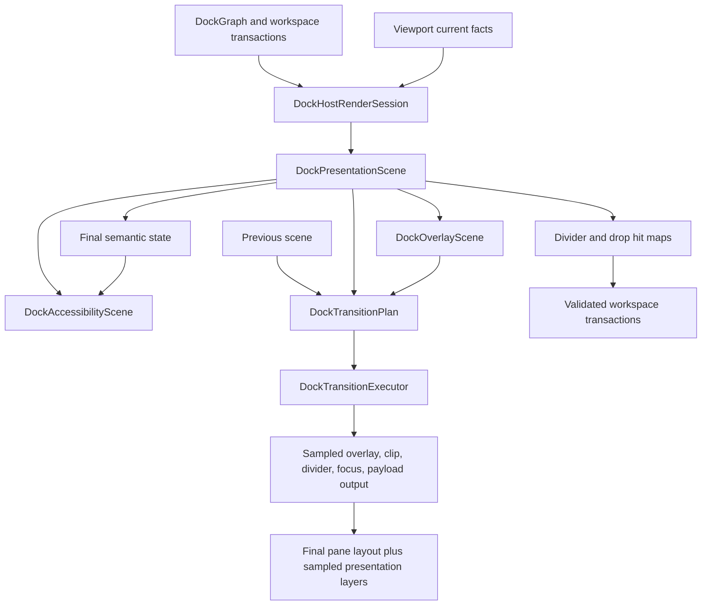
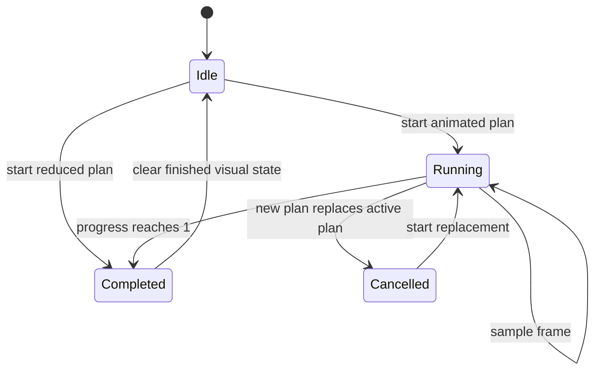

# Docking Runtime Capability Alignment - Plan

## Goal Capsule

| Field | Value |
| --- | --- |
| Objective | Turn the descriptor-first docking split/motion work into user-visible runtime capability: sampled layout motion, rendered transition frames, precise tab insertion, zoom/focus surfaces, platform accessibility mapping, corner-drag proof, and tighter shared split primitives. |
| Authority | `DockGraph`, docking policy, workspace transactions, and viewport current facts remain semantic and commit authority; presentation, overlay, transition, zoom, divider, and accessibility scenes explain and render user-facing state. |
| Scope posture | Fearless refactor: break crate-private APIs, delete replaced geometry paths, and move generic split math down to `open_gpui_ui_core` where it is not docking-specific. |
| Execution profile | Characterization-first for currently described behavior, then foundation work, runtime wiring, dogfood proof, and documentation cleanup. |
| Stop condition | A user can see and test the same capability the descriptor model already claims: animated split insertion/zoom/focus/payload feedback, precise tab merge preview, accessible controls, and corner resize behavior, all backed by focused `nextest` gates and native dogfood notes. |

---

## Product Contract

### Summary

The previous docking work established scene-owned preview, presentation geometry, transition descriptors, zoom/focus descriptors, divider hit maps, accessibility descriptors, and reusable split/motion primitives.
This plan finishes the capability alignment layer: descriptor data must drive runtime rendering, user actions, accessibility, and dogfood proof rather than staying mostly as test-only explanation.

The target is capability parity with the useful parts of ImGui docking, BonSplit, and the user-provided SuperSplit notes.
It is not pixel-level styling parity, not an AppKit/CoreAnimation clone, and not a rewrite of Open GPUI docking into ImGui's immediate-mode node model.

### Problem Frame

The current implementation has the right boundaries but not enough runtime force.
`DockTransitionExecutor` stores a transition plan and requests a frame, but it does not sample time, interpolate bounds, reschedule until completion, or feed sampled overlay/clip/divider output back into rendering.
`DockZoomState` computes presentation-only zoom and egress edges, but zoom/unzoom still behaves like an immediate scene swap from the user's perspective.
`DockAccessibilityScene` describes roles and actions, but most descriptors are not mapped into GPUI/AccessKit element output.

The remaining UI/UX gaps are no longer about whether docking can resolve a target.
They are about whether users can understand and trust the result while dragging, resizing, focusing, zooming, and navigating with assistive technology.
The strongest reference pattern is the one already chosen in ADR 0010 and ADR 0011: semantic tree authority, derived flat presentation scene, root overlay layers, previous/next motion plans, reduced-motion degradation, and platform adapters that consume those descriptors.

### Requirements

**Runtime motion and scene authority**

- R1. Docking transitions must have a real time-line model with a production time source, test clock, repeated frame scheduling, start, current progress, easing, final completion, restart/cancel behavior, and reduced-motion immediate completion.
- R2. Render code must consume sampled transition output first as overlay, clip, divider, focus, and payload presentation over the final semantic layout; replacing the recursive/flex pane layout with absolute sampled pane layout is a later decision unless Phase A proves it is required.
- R3. Split insertion transitions must place the new pane at final size from the first animated frame and animate reveal/occlusion/divider expansion without resize jitter.
- R4. Animation state must never mutate `DockGraph`; graph mutation stays inside workspace transactions and release validation.
- R5. Motion primitives in `open_gpui_ui_core` must stay small and renderer-neutral unless repeated component use proves a generic executor is needed.

**Drop preview, tab insertion, and payload feedback**

- R6. Center docking must compute precise tab insertion slots for before, middle, and append cases using actual tab label geometry.
- R7. Payload tab previews and payload ghosts must be explicit overlay layers with stable order, clipping, active/rejected/cancelled state, and cleanup on stale route changes, Escape, pointer exit, rejected release, and source/target close.
- R8. Source windows and target windows must keep distinct feedback in routed drags: route markers belong to the source view; target preview layers belong to the target view.
- R9. Edge/root split previews must keep their scoped leaf/root target behavior and must not regress into center/tab insertion affordances.

**Zoom, focus, keyboard, and spatial navigation**

- R10. Zoom/unzoom, focus movement, and focus presentation must be user reachable through docking commands and a native dogfood command channel, and they must animate through the transition system when motion is enabled.
- R11. Non-target panes in zoom must egress through deterministic edges, preferring an edge they touch before nearest-edge distance.
- R12. Focus presentation must produce visible focus ring or pulse layers and remain aligned with GPUI focus requests.
- R13. Directional pane navigation should start as a docking-private rectangle-neighbor algorithm; it should move into `ui_core` only after the API shape is docking-neutral and a second consumer or explicit proof exists.

**Accessibility**

- R14. Docking must map final scene descriptors and active overlay descriptors into GPUI accessibility output for panes, tab lists, tabs, tab panels, splitters, drag sources, drop destinations, focus regions, and rejected drop targets where GPUI supports them.
- R15. Accessibility descriptors must use stable IDs, useful labels, focus order, selected/disabled/orientation/value state, and actions for focus, activate, splitter increment/decrement, and supported drop affordances.
- R16. Reduced motion must preserve the same final accessibility semantics as animated motion, while active overlay accessibility nodes remain short-lived and are removed when the interaction or transition completes.

**Split primitive continuation and deletion**

- R17. Generic fill-child share policy and pixel-based resize helpers should move into `open_gpui_ui_core` only when they can be expressed without central-region, tab, drop, route, viewport, or docking semantics.
- R18. Docking must consume core split scene and hit-map primitives for overlapping pane, handle, junction, and pixel resize behavior.
- R19. Replaced docking-local split geometry helpers must be deleted or narrowed to domain-only adapters after tests prove parity.

**Verification and continuity**

- R20. Cross-window current-facts authority must remain fail-closed: preview scenes and transition scenes explain feedback but do not authorize commits.
- R21. Native dogfood must demonstrate local dock, routed dock, tab merge preview, payload ghost, zoom/unzoom, focus commands, corner resize, deterministic reduced-motion entry, cancellation cleanup, keyboard reachability, and accessibility proof state.
- R22. Documentation and engineering memory must be corrected so future agents do not read stale branch, commit, or U10 status.

### Acceptance Examples

- AE1. Given previous and next docking scenes for a split insertion, when the transition is sampled at start, midpoint, and completion, then the entering pane uses final-size bounds, the divider appears progressively, and the final sample equals the final presentation scene.
- AE2. Given reduced motion, when any docking transition, zoom, focus pulse, or payload feedback starts, then it completes immediately while preserving final scene, overlay, focus, and accessibility descriptors.
- AE3. Given a tab payload hovering before the first tab, between two tabs, and after the last tab, when preview resolves, then insertion index, slot bounds, clipping bounds, and payload tab positions match the target tab bar geometry.
- AE4. Given a routed cross-window drag, when hover moves between target windows or becomes stale, then the source route marker and target overlay are cleaned independently and release still revalidates current facts.
- AE5. Given a zoom command on a pane, when motion is enabled, then sibling panes animate toward deterministic egress edges and unzoom reverses to the previous resolved scene without changing `DockGraph`.
- AE6. Given focus moves to another pane, when a focus presentation is emitted, then a focus ring/pulse layer follows the focused pane and GPUI focus state still points at the selected item.
- AE7. Given GPUI accessibility collection, when a docking scene is rendered, then tabs are selectable/activatable, splitters expose orientation and increment/decrement actions, and drop destinations expose supported action availability and labels.
- AE8. Given a corner junction drag, when the pointer moves diagonally, then both affected split axes resize through validated workspace transactions and min-size clamps prevent invalid fractions.
- AE9. Given a generic split component, when fill-child and pixel resize helpers are used, then no `DockGraph`, `DropZone`, viewport, or central-region type appears in `open_gpui_ui_core`.
- AE10. Given the native docking example, when run with docking debug logs, then the runtime proof panel reports transition, zoom, payload, corner, route, and accessibility states without requiring Jellyflow dependencies.

### Scope Boundaries

#### In Scope

- Adapter-owned docking transition execution and sampled overlay, clip, divider, focus, and payload rendering.
- Precise tab insertion preview, payload ghost layers, route marker cleanup, rejected feedback, and stale overlay cleanup.
- Zoom/unzoom and focus presentation as user-visible docking capabilities.
- Incremental GPUI accessibility mapping from docking descriptors.
- Generic split fill policy and pixel resize helpers only where they remain docking-neutral.
- Docking-private rectangle-neighbor navigation proof, with `ui_core` extraction deferred until a second consumer or explicit API proof exists.
- Corner drag affordance, cursor/accessibility metadata, and rendered end-to-end proof.
- Native docking dogfood and verification documentation.
- Engineering wiki state correction for the post-merge local `main`.

#### Deferred To Follow-Up Work

- A fully public, reusable animation executor in `open_gpui_ui_core` for all components.
- Replacing docking's recursive/flex pane layout with a fully absolute sampled pane renderer before Phase A proves it is necessary.
- Public `ui_core` rectangle-neighbor navigation before a second non-docking consumer exists.
- Screenshot or broad pixel-regression baselines as the primary proof mechanism.
- Complete VoiceOver/UIAutomation parity across every platform backend.
- A general command registry or global keybinding system for all docking commands.
- Re-enabling Jellyflow dependencies in normal workspace compilation.

#### Outside This Plan

- Pixel-perfect ImGui styling, colors, rounded corners, or draw-list behavior.
- Copying CoreAnimation, AppKit, SwiftUI hosted-view, `NSSplitView`, or `CVDisplayLink` internals.
- Replacing `DockGraph` with ImGui's binary dock node model or BonSplit's Swift object graph.
- Letting preview, overlay, or animation scenes authorize docking commits.

---

## Planning Contract

### Current Findings

- Local `main` fast-forwarded to `3497a85` and is ahead of `origin/main` by 12 local commits.
- Existing gates recorded for the previous split/motion primitive refactor pass, but `docs/knowledge/engineering/current-state.md` still named the feature branch and an in-progress U10 state.
- Subagent research agreed that the core model is present: `DockPresentationScene`, `DockOverlayScene`, `DockTransitionPlan`, `DockZoomState`, `DockDividerHitMap`, `DockAccessibilityScene`, `SplitterLayoutScene`, `SplitterHitMap`, and `MotionSpec`.
- Subagent research also agreed that the biggest remaining gap is runtime execution: timeline sampling, render consumption, visible zoom/focus/payload effects, and platform a11y mapping.

### Key Technical Decisions

- KTD1. Keep transition execution adapter-owned for now. `open_gpui_ui_core` keeps motion preference, duration, easing, and generic split primitives; docking owns the first real executor because the immediate needs include viewport routing, pane overlays, zoom, and docking-specific cleanup.
- KTD2. Use final scenes for semantics and sampled output for presentation. Phase A keeps the recursive/flex pane layout as the final semantic layout and layers sampled reveal, clip, divider, focus, payload, and route feedback above it; a full absolute pane renderer is a follow-up decision.
- KTD3. Move only generic split math into `ui_core`. Fill-child policy and pixel resize helpers are candidates; central dock region, tab stack, floating, viewport, drop commit, rectangle-neighbor navigation, and graph invariants stay in docking until non-domain proof exists.
- KTD4. Make a11y incremental but real. The next step is not a perfect platform audit; it is mapping docking descriptors into the GPUI accessibility surface where the API already supports roles, labels, state, and actions, with unsupported platform metadata documented rather than promised.
- KTD5. Keep proof descriptor-first. Runtime visual behavior gets fake-clock and narrow visual assertions; broad screenshot baselines remain secondary because they are too flaky for the core contract.
- KTD6. Treat documentation drift as a correctness bug. Engineering memory drives future agent behavior, so stale branch/commit/U10 state must be corrected in the first implementation slice.
- KTD7. Make native dogfood command reachability explicit. The implementation must either expose per-space host command handles through the runtime/controller or render host-local controls; the status panel cannot call `DockHost` methods by implication.

### Assumptions

- GPUI's existing animation frame request path is probably sufficient for an adapter-owned executor; U2 must validate this and provide a crate-private clock abstraction or immediate-completion fallback before runtime animation work proceeds.
- GPUI accessibility output can be improved incrementally from current element APIs without requiring a platform backend rewrite.
- The native docking example remains the main manual dogfood surface for multi-viewport docking, even when automated tests carry most semantic proof.

### High-Level Technical Design





### Priority Model

1. Establish fake-clock transition sampling and render consumption before adding more motion styles.
2. Lock precise tab insertion and payload cleanup before polishing overlay colors or shapes.
3. Make zoom/focus user-visible once the executor can sample scenes.
4. Map accessibility descriptors after IDs and layer lifetimes are stable enough to avoid churn.
5. Move generic split helpers into `ui_core` when docking integration has shown the exact non-domain shape.

### Phased Delivery

| Phase | Units | Cutline | Commit posture |
| --- | --- | --- | --- |
| Phase A / P0 | U1, U2, U3, U10 | Correct state memory, prove production/test timing, and render sampled overlay/clip/divider output over final layout. | Can land independently after transition/render gates and memory validation pass. |
| Phase B / P0 | U4, U9, U10 | Precise tab insertion, payload ghosts, route marker lifecycle, stale cleanup, and cancel/close paths. | Can land after local and routed preview tests plus native dogfood notes. |
| Phase C / P1 | U5, U10 | Zoom/unzoom/focus commands, deterministic egress, focus presentation, reduced-motion entry, and native command channel. | Can land after zoom/focus tests and dogfood command proof. |
| Phase D / P1 | U6, U10 | Final-scene and active-overlay accessibility mapping with stable IDs, labels, roles, and supported actions. | Can land after GPUI-facing a11y tests and documented unsupported gaps. |
| Phase E / P2 | U7, U8, U10, U11 | Gated split primitive cleanup, corner-drag productization, docking-private spatial navigation proof, ADR, and deletion pass. | Can land as one or more cleanup/productization commits. |

### Sources And References

- `docs/adr/0010-docking-presentation-scene-motion-model.md`
- `docs/adr/0011-docking-split-motion-primitive-boundary.md`
- `docs/plans/2026-06-30-003-refactor-docking-split-motion-primitives-plan.md`
- `docs/verification.md`
- `docs/knowledge/engineering/subagents/docking-runtime-capability-followup-20260630.md`
- `repo-ref/bonsplit/Sources/Bonsplit/Public/BonsplitController.swift`
- `repo-ref/bonsplit/Sources/Bonsplit/Internal/Controllers/SplitViewController.swift`
- `repo-ref/imgui/imgui.cpp`
- `repo-ref/imgui/imgui_internal.h`

### Open Questions

#### Deferred To Implementation

- Whether Phase A evidence justifies replacing recursive/flex pane rendering with a full absolute sampled pane renderer in a later plan.
- Whether docking accessibility action callbacks should attach directly in render code or through a small docking a11y adapter module.
- Whether rectangle-neighbor navigation belongs in `ui_core` during this plan or should stay private until another component uses it.

---

## Implementation Units

| Unit | Title | Representative files | Depends on |
| --- | --- | --- | --- |
| U1 | Correct State Memory And Characterize Runtime Gaps | `docs/knowledge/engineering/current-state.md`, `docs/knowledge/engineering/subagents/docking-runtime-capability-followup-20260630.md`, `crates/gpui_docking/src/host_transition_tests.rs` | None |
| U2 | Add Fake-Clock Transition Sampling | `crates/gpui_docking/src/transition_executor.rs`, `crates/gpui_docking/src/transition_geometry.rs`, `crates/gpui_docking/src/host_transition_tests.rs`, `crates/ui_core/src/motion.rs` | U1 |
| U3 | Render Sampled Overlay, Clip, Divider, And Focus Geometry | `crates/gpui_docking/src/render.rs`, `crates/gpui_docking/src/render_split.rs`, `crates/gpui_docking/src/overlay_scene.rs`, `crates/gpui_docking/src/host_render_tests.rs` | U2 |
| U4 | Make Tab Insertion And Payload Ghosts Precise | `crates/gpui_docking/src/drop_preview.rs`, `crates/gpui_docking/src/overlay_scene.rs`, `crates/gpui_docking/src/render.rs`, `crates/gpui_docking/src/host_viewport_preview_visual_tests.rs` | U3 |
| U5 | Animate Zoom, Unzoom, And Focus Presentation | `crates/gpui_docking/src/zoom_state.rs`, `crates/gpui_docking/src/presentation_commands.rs`, `crates/gpui_docking/src/transition_geometry.rs`, `crates/gpui_docking/src/host_zoom_focus_tests.rs` | U2, U3 |
| U6 | Map Docking Accessibility To GPUI Output | `crates/gpui_docking/src/accessibility_scene.rs`, `crates/gpui_docking/src/render_tabs.rs`, `crates/gpui_docking/src/render_split.rs`, `crates/gpui_docking/src/host_accessibility_tests.rs`, `crates/ui_components/src/a11y.rs` | U4, U5 |
| U7 | Gate Split Primitive Consumption And Cleanup | `crates/ui_core/src/split.rs`, `crates/ui_components/src/splitter.rs`, `crates/gpui_docking/src/geometry.rs`, `crates/gpui_docking/src/presentation_scene.rs`, `crates/gpui_docking/src/render_split.rs` | U3, U4 |
| U8 | Productize Corner Drag And Docking-Private Spatial Navigation | `crates/gpui_docking/src/divider_hit_map.rs`, `crates/gpui_docking/src/host_render_actions.rs`, `crates/gpui_docking/src/interaction.rs`, `crates/gpui_docking/src/host_interaction_tests.rs`, `crates/ui_core/src/split.rs` | U6, U7 |
| U9 | Prove Cross-Window Overlay Animation And Cleanup | `crates/gpui_docking/src/viewport_runtime.rs`, `crates/gpui_docking/src/viewport_routed_preview.rs`, `crates/gpui_docking/src/viewport_drop_scene.rs`, `crates/gpui_docking/src/render.rs`, `examples/docking-native/src/main.rs` | U3, U4 |
| U10 | Record Phase Closeouts And Dogfood Gates | `docs/verification.md`, `docs/knowledge/engineering/current-state.md`, `docs/knowledge/engineering/log.md`, `docs/knowledge/engineering/verification/docking-runtime-capability-alignment-20260630.md`, `examples/docking-native/src/main.rs` | U2, U3 |
| U11 | Finalize ADR And Delete Replaced Helpers | `docs/adr/0012-docking-runtime-capability-alignment.md`, `docs/adr/README.md`, `docs/ui/component-contract.md`, `crates/gpui_docking/src/geometry.rs`, `crates/gpui_docking/src/render_split.rs` | U4, U5, U6, U7, U8, U9, U10 |

### U1. Correct State Memory And Characterize Runtime Gaps

- **Goal:** Bring engineering memory in line with local `main@3497a85` and add failing or pending characterization tests that prove the executor is not yet sampling/rendering runtime frames.
- **Requirements:** R1, R2, R22.
- **Dependencies:** None.
- **Files:** `docs/knowledge/engineering/current-state.md`, `docs/knowledge/engineering/log.md`, `docs/knowledge/engineering/subagents/docking-runtime-capability-followup-20260630.md`, `crates/gpui_docking/src/host_transition_tests.rs`, `crates/gpui_docking/src/host_viewport_preview_visual_tests.rs`.
- **Approach:** Update the stale branch/commit/U10 memory and add test names that describe the next expected runtime behavior before implementing it. Keep characterization semantic rather than screenshot-based.
- **Patterns to follow:** Existing verification memory in `docs/knowledge/engineering/verification/docking-split-motion-primitives-20260630.md`; transition descriptor tests in `crates/gpui_docking/src/host_transition_tests.rs`.
- **Test scenarios:** Transition executor starts an animated plan and exposes no sampled intermediate scene before U2; precise tab insertion tests mark the missing `slot_bounds` coverage; engineering wiki validation passes after memory edits.
- **Verification:** Memory reflects local `main`, and new tests either fail before implementation or are marked with a narrow pending expectation that U2/U4 removes.

### U2. Add Fake-Clock Transition Sampling

- **Goal:** Convert `DockTransitionExecutor` from a stored-plan scheduler into a deterministic time-line executor with production timing, fake-clock test coverage, and an explicit nil-window/reduced-motion fallback.
- **Requirements:** R1, R3, R4, R5, R16.
- **Dependencies:** U1.
- **Files:** `crates/gpui_docking/src/transition_executor.rs`, `crates/gpui_docking/src/transition_geometry.rs`, `crates/gpui_docking/src/presentation_commands.rs`, `crates/gpui_docking/src/host_transition_tests.rs`, `crates/ui_core/src/motion.rs`.
- **Approach:** Store active transition identity, start time, duration, easing token, progress, final scene, and completion state. Add a render-time `sample(now, bounds)` or equivalent accessor that requests another frame while incomplete. Validate how `Window::request_animation_frame` supplies the next render; when no window or time source exists, complete immediately or expose a deterministic pending-frame state instead of silently scheduling nothing. Provide test-only deterministic sampling and reduced-motion immediate completion. Avoid publicizing executor API beyond docking until another component needs it.
- **Patterns to follow:** `MotionSpec` in `crates/ui_core/src/motion.rs`; current `DockTransitionPlan::between` tests.
- **Test scenarios:** Animated plan sampled at start, midpoint, and end; reduced plan completes immediately; starting a second plan cancels or replaces the first; completed plan stops requesting frames; final scene equality remains stable.
- **Verification:** Focused transition tests prove sampling math, replacement, completion, and reduced-motion behavior.

### U3. Render Sampled Overlay, Clip, Divider, And Focus Geometry

- **Goal:** Make render paths consume sampled transition geometry for reveal clips, dividers, focus layers, and overlay layers while preserving the existing final pane layout as semantic render input.
- **Requirements:** R2, R3, R4, R7, R16.
- **Dependencies:** U2.
- **Files:** `crates/gpui_docking/src/render.rs`, `crates/gpui_docking/src/render_split.rs`, `crates/gpui_docking/src/presentation_scene.rs`, `crates/gpui_docking/src/overlay_scene.rs`, `crates/gpui_docking/src/host_render_tests.rs`, `crates/gpui_docking/src/host_transition_tests.rs`.
- **Approach:** Add a render-time `DockTransitionSample`-style accessor with sampled presentation output, overlay output, progress, completion, and next-frame need. Route divider, clip/reveal, focus, payload, and route-marker bounds through it while the pane contents continue to lay out at final semantic bounds in Phase A. Keep hit testing and release validation tied to current/final scenes unless the active interaction explicitly needs sampled visual bounds.
- **Patterns to follow:** Existing `render_divider_event_layer` scene usage; `DockOverlayScene::from_preview`; host render descriptor tests.
- **Test scenarios:** Split insertion start and middle frames render the entering pane at final-size content bounds while reveal/clip/occlusion and divider expansion animate; divider appears or moves through sampled bounds; overlay payload ghost uses sampled bounds; final frame returns to final presentation scene; reduced motion bypasses sampled intermediate frames.
- **Verification:** Render/transition tests prove sampled visual bounds without introducing graph mutation.

### U4. Make Tab Insertion And Payload Ghosts Precise

- **Goal:** Upgrade center docking preview from coarse payload tabs to explicit insertion slots and payload ghost layers aligned to actual tab label geometry.
- **Requirements:** R6, R7, R8, R9, R20.
- **Dependencies:** U3.
- **Files:** `crates/gpui_docking/src/drop_preview.rs`, `crates/gpui_docking/src/overlay_scene.rs`, `crates/gpui_docking/src/render.rs`, `crates/gpui_docking/src/host_viewport_preview_visual_tests.rs`, `crates/gpui_docking/src/host_transition_tests.rs`.
- **Approach:** Resolve insertion index and `slot_bounds` from rendered tab labels for before, between, and append positions. Render payload tabs and optional ghost layers from overlay descriptors, not from render-local recomputation. Define a payload state matrix for active hover, rejected hover, Escape, drop outside, pointer leave, source close, target close, and stale route replacement.
- **Patterns to follow:** `DockPreviewTabInsertion`; ImGui's data-first dock preview model; BonSplit's separation of preview from pane content.
- **Payload lifecycle contract:**

  | State | Visual output | Commit behavior |
  | --- | --- | --- |
  | Active hover | Payload tab/ghost plus active target overlay. | Release revalidates current facts before commit. |
  | Rejected hover | Rejected target overlay; no active payload insertion slot. | Release does not commit. |
  | Escape / drop outside / pointer leave | Payload and target overlays clear. | Release does not commit. |
  | Source or target close | Source route marker and target overlays clear independently. | Release does not commit. |
  | Stale route replacement | Old route marker and target overlays clear before new route draws. | Only newest current facts can commit. |

- **Test scenarios:** Hover before the first tab yields insertion index 0 and a leading slot; hover between tab labels yields the expected middle index and slot; hover after the last tab yields append; multi-tab payload keeps stable clipping; edge/root drops suppress payload tab previews; rejected center target renders rejected state without active payload; Escape, drop outside, pointer leave, source close, target close, and stale route replacement remove payload layers without committing.
- **Verification:** Visual descriptor tests lock insertion index, slot bounds, payload titles, and overlay layer order.

### U5. Animate Zoom, Unzoom, And Focus Presentation

- **Goal:** Connect zoom/unzoom and focus presentation to the transition executor and expose them in native dogfood controls.
- **Requirements:** R10, R11, R12, R16, R21.
- **Dependencies:** U2, U3.
- **Files:** `crates/gpui_docking/src/zoom_state.rs`, `crates/gpui_docking/src/presentation_commands.rs`, `crates/gpui_docking/src/transition_geometry.rs`, `crates/gpui_docking/src/overlay_scene.rs`, `crates/gpui_docking/src/render.rs`, `crates/gpui_docking/src/host_zoom_focus_tests.rs`, `examples/docking-native/src/main.rs`.
- **Approach:** Generate transition plans for zoom and unzoom using `DockZoomScene.egress`, and add focus ring/pulse layers that can animate without replacing GPUI focus authority. Expose explicit commands for zoom/unzoom, focus pane up/down/left/right, focus ring trigger/clear, and reduced-motion testing. Native dogfood must call those commands through a real host command handle, controller command surface, or host-local controls.
- **Patterns to follow:** Current `DockZoomState` presentation-only graph tests; SuperSplit egress-edge preference; BonSplit layout snapshot versus tree snapshot distinction.
- **Command reachability contract:**

  | Command | Minimum entry point | Notes |
  | --- | --- | --- |
  | Zoom pane | Native proof control or host-local control. | Uses selected/focused pane unless an explicit pane ID is supplied. |
  | Unzoom pane | Native proof control or host-local control. | Restores previous resolved scene without graph mutation. |
  | Focus up/down/left/right | Keyboard-reachable command and test helper. | Uses docking-private rectangle-neighbor selection. |
  | Focus pulse/clear | Test helper and proof control. | Does not override GPUI focus authority. |
  | Reduced motion toggle | Proof panel toggle, env hook, or deterministic fixture. | Must be deterministic in tests and manual dogfood. |

- **Test scenarios:** Zoom animates siblings toward touching-preferred edges; unzoom restores the previous resolved scene; focus region follows the target pane during zoom; reduced motion completes immediately through a deterministic proof panel toggle, env hook, or test fixture; keyboard-accessible commands invoke zoom/focus behavior; toggling zoom twice does not mutate `DockGraph`; dogfood proof panel reports zoom/focus state.
- **Verification:** Zoom/focus tests prove animation descriptors, sampled scenes, reduced motion, and native proof metadata.

### U6. Map Docking Accessibility To GPUI Output

- **Goal:** Turn docking a11y descriptors into real GPUI accessibility output with stable roles, labels, state, and actions where supported.
- **Requirements:** R14, R15, R16, R21.
- **Dependencies:** U4, U5.
- **Files:** `crates/gpui_docking/src/accessibility_scene.rs`, `crates/gpui_docking/src/render_tabs.rs`, `crates/gpui_docking/src/render_split.rs`, `crates/gpui_docking/src/render.rs`, `crates/gpui_docking/src/host_accessibility_tests.rs`, `crates/ui_components/src/a11y.rs`, `crates/ui_core/src/a11y.rs`.
- **Approach:** Keep renderer-neutral descriptor generation in docking and map supported roles/actions into GPUI element APIs in render adapters. Maintain a mapping table for `DockAccessibilityRole -> GPUI role -> element ID pattern -> label/hint -> state -> action callback`. Separate persistent final-scene nodes from short-lived active overlay nodes so transition and drag cleanup cannot leave stale accessibility output. Improve labels from internal IDs to panel/tab titles and action names.
- **Patterns to follow:** `ui_components::a11y` helpers and existing `Role::Splitter` coverage; `DockAccessibilityScene::from_presentation`.
- **Accessibility mapping contract:**

  | Dock role | GPUI output | Required state/action |
  | --- | --- | --- |
  | Pane / tab panel | Stable element ID and panel label. | Focus target when supported. |
  | Tab list / tab | Tab-list grouping plus selectable tab nodes. | Selected state and activate/select callback. |
  | Splitter | Splitter role with orientation and value. | Increment/decrement through existing resize transactions. |
  | Focus region | Short-lived or persistent focus descriptor. | Label and focus timing must match GPUI focus state. |
  | Drag source / drop destination | Active overlay descriptor where supported. | Supported action availability and target label. |
  | Rejected drop target | Disabled target descriptor. | No commit or activate action. |

- **Test scenarios:** Tab descriptors appear as selectable/activatable accessibility nodes; selected tab and panel state match focus; splitter exposes orientation plus increment/decrement through the existing resize transaction path; drop destinations expose supported action availability and labels without inventing unsupported platform metadata; rejected drop target is disabled; focus order is deterministic; reduced motion and animated final states expose identical final semantics; active overlay nodes disappear after cancel, completion, or route cleanup.
- **Verification:** Host accessibility tests assert descriptors and GPUI-facing role/action mapping without requiring full platform VoiceOver automation.

### U7. Gate Split Primitive Consumption And Cleanup

- **Goal:** Inventory the remaining split primitive gap, consume existing core primitives first, move only proven docking-neutral fill/pixel helpers into `open_gpui_ui_core`, and delete redundant docking-local geometry where it is no longer needed.
- **Requirements:** R17, R18, R19.
- **Dependencies:** U3, U4.
- **Files:** `crates/ui_core/src/split.rs`, `crates/ui_core/src/prelude.rs`, `crates/ui_components/src/splitter.rs`, `crates/ui_components/tests/components.rs`, `crates/gpui_docking/src/geometry.rs`, `crates/gpui_docking/src/presentation_scene.rs`, `crates/gpui_docking/src/render_split.rs`, `crates/gpui_docking/src/interaction.rs`, `crates/gpui_docking/src/workspace_resize_policy_tests.rs`.
- **Approach:** Start with a gap inventory against `SplitterState`, `SplitterLayoutScene`, and `SplitterHitMap`. Add generic fill-child share policy and pixel-to-fraction resize helpers in `ui_core` only if their APIs mention split IDs, fractions, extent, and constraints rather than docking concepts. Leave rectangle-neighbor navigation docking-private unless another component adopts it. Replace `DockSplitLayout` uses that overlap with core output and keep only domain-specific graph layout helpers.
- **Patterns to follow:** `SplitterState::resize_by`, `SplitterLayoutScene::from_tree`, `SplitterHitMap`, and ADR 0011 boundary language.
- **Test scenarios:** Fill-child share consumes the remaining fraction after fixed shares; pixel resize applies, clamps, or rejects consistently; nested overlay-boundary handles produce stable junctions; `ui_components::Splitter` still drags through runtime state; docking central region layout remains unchanged after consuming the generic helper; any proposed `ui_core` API is rejected if it names docking concepts.
- **Verification:** `ui_core`, `ui_components` splitter, and docking resize policy tests prove the extraction without leaking docking types into `ui_core`.

### U8. Productize Corner Drag And Docking-Private Spatial Navigation

- **Goal:** Make corner drag a visible and accessible end-to-end interaction, and add rectangle-neighbor navigation as docking-private behavior unless U7 proves a shared API.
- **Requirements:** R13, R14, R17, R18, R21.
- **Dependencies:** U6, U7.
- **Files:** `crates/gpui_docking/src/divider_hit_map.rs`, `crates/gpui_docking/src/host_render_actions.rs`, `crates/gpui_docking/src/interaction.rs`, `crates/gpui_docking/src/render_split.rs`, `crates/gpui_docking/src/host_interaction_tests.rs`, `crates/gpui_docking/src/host_divider_hit_map_tests.rs`, `crates/ui_core/src/split.rs`.
- **Approach:** Keep the existing multi-axis transaction path, add visible corner affordance/cursor/a11y metadata, and prove diagonal dragging updates both axes through the real event path. Define visible states for idle, hover, active, focused, one-axis-clamped, both-axes-rejected, and disabled. Keep rectangle-neighbor navigation private to docking unless U7 supplies a proven shared helper.
- **Patterns to follow:** Current `DockDividerHitMap::Corner`; BonSplit directional neighbor algorithm; existing workspace resize transaction validation.
- **Corner state contract:**

  | State | Required behavior |
  | --- | --- |
  | Idle | No layout shift; junction hit region remains stable. |
  | Hover | Corner affordance and cursor indicate two-axis resize. |
  | Active | Both axes try validated resize transactions. |
  | Focused | Keyboard/a11y increment target is clear. |
  | One-axis clamped | Unclamped axis can continue; clamped axis stays valid. |
  | Both-axes rejected | No fraction corruption and rejected feedback is visible. |
  | Disabled | No transaction is submitted. |

- **Test scenarios:** Junction hit prefers corner over single handles; diagonal drag updates horizontal and vertical fractions together; min-size clamp rejects or limits one axis without corrupting the other; keyboard or accessibility increment/decrement targets the correct axis; idle, hover, active, focused, clamped, rejected, and disabled states are distinguishable; rectangle navigation picks the nearest overlapping pane in each direction without exporting docking policy.
- **Verification:** Interaction and divider tests cover both model and rendered event path.

### U9. Prove Cross-Window Overlay Animation And Cleanup

- **Goal:** Align routed drag feedback with the same overlay/transition system used locally while preserving current-facts release authority.
- **Requirements:** R7, R8, R20, R21.
- **Dependencies:** U3, U4.
- **Files:** `crates/gpui_docking/src/viewport_runtime.rs`, `crates/gpui_docking/src/viewport_routed_preview.rs`, `crates/gpui_docking/src/viewport_drop_scene.rs`, `crates/gpui_docking/src/render.rs`, `crates/gpui_docking/src/host_viewport_preview_visual_tests.rs`, `examples/docking-native/src/main.rs`, `docs/verification.md`.
- **Approach:** Reuse overlay transition descriptors for route marker, payload ghost, rejected state, and stale cleanup. Keep release commit checks in viewport runtime and workspace transactions, not in overlay scenes.
- **Patterns to follow:** Existing source/target route preview split; platform capability status in `docs/verification.md`; ADR 0010 current-facts boundary.
- **Test scenarios:** Source route marker remains separate from target preview; target hover change replaces overlay state without stale payload; rejected route cleans payload feedback; Escape/drop outside/source close/target close clean route overlays; deterministic reduced motion preserves final route cleanup semantics; minimized/no-input viewport does not commit; release succeeds only after current facts revalidate.
- **Verification:** Viewport preview visual tests and native dogfood show route marker and target overlay lifecycle separately.

### U10. Record Phase Closeouts And Dogfood Gates

- **Goal:** Record verification, dogfood, and engineering memory after each delivery phase instead of waiting for the final cleanup pass.
- **Requirements:** R20, R21, R22.
- **Dependencies:** U2, U3 for the first closeout, then the unit set completed in each later phase.
- **Files:** `docs/verification.md`, `docs/knowledge/engineering/current-state.md`, `docs/knowledge/engineering/log.md`, `docs/knowledge/engineering/verification/docking-runtime-capability-alignment-20260630.md`, `examples/docking-native/src/main.rs`.
- **Approach:** Update verification commands, dogfood steps, proof-panel wording, and engineering memory at each phase boundary. Record which manual flows were exercised, which were deferred, and which platform limitations remain.
- **Patterns to follow:** ADR 0010/0011; verification evidence files under `docs/knowledge/engineering/verification`.
- **Test scenarios:** Documentation names actual supported capabilities for the current phase; wiki validation passes; stale branch/commit references are gone; native dogfood instructions exercise the runtime capabilities already landed; deferred behavior is explicit.
- **Verification:** Docs, wiki validation, formatting, diff check, and phase-required crate gates all pass.

### U11. Finalize ADR And Delete Replaced Helpers

- **Goal:** Record the durable runtime capability boundary and remove obsolete code paths after all behavioral slices are covered.
- **Requirements:** R19, R20, R21, R22.
- **Dependencies:** U4, U5, U6, U7, U8, U9, U10.
- **Files:** `docs/adr/0012-docking-runtime-capability-alignment.md`, `docs/adr/README.md`, `docs/ui/component-contract.md`, `docs/verification.md`, `docs/knowledge/engineering/current-state.md`, `docs/knowledge/engineering/log.md`, `crates/gpui_docking/src/geometry.rs`, `crates/gpui_docking/src/render_split.rs`, `examples/docking-native/src/main.rs`.
- **Approach:** Add an ADR only after implementation confirms a durable runtime executor/a11y boundary. Delete compatibility helpers and `allow(dead_code)` annotations whose only purpose was descriptor scaffolding. Keep intentional domain adapters with a cited reason.
- **Patterns to follow:** ADR 0010/0011; verification evidence files under `docs/knowledge/engineering/verification`.
- **Test scenarios:** ADR names actual supported capabilities; no replaced helper remains without a cited reason; component contract reflects any `ui_core` split primitive change; dogfood and verification docs agree with current runtime behavior.
- **Verification:** Docs, wiki validation, formatting, diff check, and required crate gates all pass.

---

## Verification Contract

### Required Gates

| Gate | Scope | Done signal |
| --- | --- | --- |
| `cargo fmt --all -- --check` | Workspace formatting | No formatting drift. |
| `cargo nextest run -p open-gpui-ui-core split motion --no-fail-fast` | Shared split and motion primitives | Fill policy, pixel resize, hit map, motion spec, and any generic navigation tests pass. |
| `cargo nextest run -p open-gpui-ui-components splitter component_api_inventory --no-fail-fast` | Splitter adapter and public inventory | Splitter still renders through core primitives and API inventory stays intentional. |
| `cargo nextest run -p open-gpui-docking host_presentation_scene_tests host_viewport_preview_visual_tests host_transition_tests host_zoom_focus_tests host_divider_hit_map_tests host_accessibility_tests host_interaction_tests workspace_resize_policy_tests --no-fail-fast` | Docking runtime capability proof | Presentation, preview, transition sampling, zoom/focus, corner drag, a11y, interaction, and resize transactions pass. |
| `cargo check -p open-gpui-docking-native` | Native dogfood compile | Docking native example compiles without Jellyflow workspace dependencies. |
| `git diff --check` | Patch hygiene | No whitespace errors. |
| `python $HOME/.codex/skills/engineering-wiki-memory/scripts/wiki_memory.py validate --root docs/knowledge/engineering` | Engineering memory | Wiki bundle remains valid. |

### Focused Manual Dogfood

Run the native docking example with:

```sh
RUST_LOG=info,open_gpui_docking=debug,open_gpui=info RUST_BACKTRACE=1 cargo run -p open-gpui-docking-native --bin open-gpui-docking-native
```

Manual flows:

- Drag one or more tabs into center tab insertion before, between, and after existing tabs.
- Drag a tab to nested pane left/right/top/bottom edges and confirm preview stays scoped to the intended pane.
- Drag across windows and confirm route marker/source feedback and target overlay are distinct.
- Tear a tab into a floating window and dock it back with payload feedback.
- Zoom and unzoom a pane through the dogfood control and verify sibling egress/focus behavior.
- Drag a corner junction diagonally and verify both axes resize.
- Trigger reduced motion through the deterministic proof-panel toggle, env hook, or test fixture and confirm final state remains correct.
- Use keyboard-reachable commands for zoom/unzoom and pane focus movement.
- Press Escape, drop outside, and close source/target windows during active drags to confirm cleanup.
- Inspect proof panel/logs for transition, payload, zoom, corner, route, and accessibility descriptors.

### Evidence To Record

- Test commands and pass/fail summaries in `docs/knowledge/engineering/verification/docking-runtime-capability-alignment-20260630.md`.
- Any platform a11y limitations under `docs/verification.md` rather than hidden in chat.
- Any helper or compatibility path intentionally left behind with a reason in the ADR or component contract.

---

## System-Wide Impact

- `open_gpui_ui_core` gains slightly deeper split primitives; the boundary must remain renderer-neutral and docking-neutral.
- `open_gpui_ui_components::Splitter` remains the concrete component adapter and should not regain pure solver logic.
- `open_gpui_docking` becomes more presentation-driven at runtime, which may break crate-private render/helper APIs.
- Native dogfood grows from proof text into runtime behavior inspection for animation, a11y, and cross-window overlay state.
- Engineering memory becomes part of correctness because stale plan state has already caused ambiguity about what is done.

---

## Risks And Mitigations

| Risk | Impact | Mitigation |
| --- | --- | --- |
| Executor becomes a broad animation framework too early. | Large unstable API with little immediate payoff. | Keep the first executor crate-private to docking and expose only reusable motion tokens in `ui_core`. |
| Sampled scenes accidentally become commit authority. | Stale or animated state could authorize wrong drops. | Keep workspace transactions and viewport current facts as the only commit path; test stale route rejection. |
| Render integration destabilizes existing layout. | Preview or pane bounds regress while animation lands. | Add characterization and final-scene equality tests before rendering sampled frames. |
| Accessibility mapping blocks on platform gaps. | Descriptor work appears done but users still get no benefit. | Map supported GPUI roles/actions now and document unsupported platform gaps explicitly. |
| Generic split extraction leaks docking concepts. | Future components inherit central-region or tab assumptions. | Reject any `ui_core` API that names docking types or route/drop semantics. |
| Visual proof becomes flaky. | CI noise obscures meaningful regressions. | Use fake-clock semantic bounds and narrow visual descriptor assertions before screenshots. |
| Native dogfood hides automated gaps. | Manual checks pass but regressions recur. | Every dogfood-only behavior gets a descriptor or interaction test where feasible. |

---

## Definition of Done

- Local `main` state and engineering memory correctly reflect the completed split/motion primitive merge and the new follow-up plan.
- Transition executor samples animated plans deterministically and completes reduced-motion plans immediately.
- Render paths can consume sampled overlay, clip, divider, focus, and payload geometry without mutating `DockGraph`.
- Center tab insertion preview exposes precise slot/index/payload ghost descriptors for local and routed drags.
- Zoom/unzoom and focus presentation are user-visible, testable, and represented in the native dogfood panel.
- Docking accessibility descriptors are mapped to GPUI output for supported roles, state, labels, and actions.
- Shared split primitives cover accepted generic fill policy and pixel resize behavior without docking types; rectangle-neighbor navigation remains docking-private unless a shared API is proven.
- Corner drag is visibly productized and covered through model plus rendered interaction tests.
- Cross-window overlay animation and stale cleanup preserve current-facts release authority.
- Obsolete geometry/helper paths and dead scaffolding are deleted or documented with a reason.
- Each phase records its verification and dogfood evidence before the next phase starts.
- Full-plan completion requires U1 through U11, all required gates, deletion/ADR cleanup, and engineering memory evidence.
