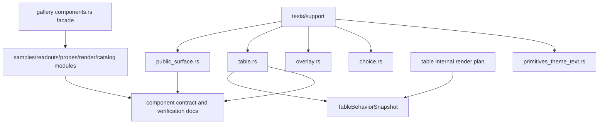

# UI Contract Test Modules - Plan

## Goal Capsule

| Field | Decision |
|---|---|
| Objective | Finish the next UI architecture cleanup by turning public-surface tests, Table internal render plans, and the gallery Components page into maintainable contract modules. |
| Authority | Current `main` after the behavior snapshot work, `docs/ui/component-contract.md`, `docs/verification.md`, and the two 2026-06-30 UI architecture plans. |
| Execution profile | Fearless refactor is allowed: break internal APIs, rename crate-private contracts, delete stale tests, and remove redundant helper code once replacement coverage exists. |
| Public API posture | Public exports should expose behavior snapshots and stable state contracts, not adapter render-plan internals. |
| Stop conditions | Stop and re-plan only if implementation requires changing a documented public behavior contract, creating a new crate, or weakening existing test coverage. |

This plan is the follow-up after deep interaction modules were introduced.
The next bottleneck is not another feature family; it is the maintainability of the UI contract itself.
`crates/ui_components/tests/components.rs` is still a monolith, Table still uses `TableRenderDiagnostics` as the internal render-plan vocabulary, and the gallery Components page still mixes sample data, probes, state readouts, and rendering orchestration.

---

## Product Contract

### Summary

Open GPUI should make the component library contract easy to understand, extend, and verify.
This refactor splits the remaining monolithic UI test and gallery surfaces into focused modules, tightens the Table render-plan boundary, and updates verification docs so future UI work has smaller, targeted gates.

### Problem Frame

The UI layer now has better behavior snapshots for interaction-heavy surfaces, but the supporting contract infrastructure is still too broad.
The largest risk is that future component work has to edit a 16k-line integration test file or reason about internal render plans that look more public than they are.

Table has a specific naming problem.
The documented intent is that Table render-plan structures are crate-private adapter contracts, but the main internal object is still named `TableRenderDiagnostics` and flows through body, header, runtime, resolve, and behavior snapshot code.
The name encourages tests and docs to treat render assembly data as diagnostics instead of as an internal viewport plan feeding a public behavior snapshot.

The gallery Components page has a similar ownership problem.
It already has `catalog.rs` and `render.rs`, but the root page file still owns sample state, metadata readouts, contract probes, and rendering decisions.
That is workable for a demo, but it is a poor framework conformance surface.

### Requirements

#### Public Contract And Export Discipline

- R1. Root and prelude exports must continue to expose official components, stable state contracts, and behavior snapshots only through intentional paths.
- R2. Internal render plans may exist, but they must not appear in root/prelude exports, gallery public metadata, or docs as normal application state contracts.
- R3. Contract scanners must remain deterministic and source-based so accidental export drift fails in tests.
- R4. Breaking cleanup is allowed for internal APIs, test helpers, gallery sample plumbing, and stale documentation names.

#### Test Architecture

- R5. Split `crates/ui_components/tests/components.rs` into concern-focused integration test modules with shared support helpers.
- R6. Preserve existing coverage while making each focused test module runnable without loading unrelated component families.
- R7. Move source scanning, manifest parsing, sample fixtures, and repeated assertions into `crates/ui_components/tests/support/`.
- R8. Keep test names and filters discoverable for Table, public surface, overlay, choice/search, primitives, theme, and text input contracts.

#### Table Internal Boundary

- R9. Rename or restructure Table's crate-private render-plan vocabulary so internal viewport assembly is not presented as public diagnostics.
- R10. Keep `TableBehaviorSnapshot` as the durable behavior-facing readout for tests, docs, and gallery probes.
- R11. Tighten visibility on Table render-plan types to the narrowest useful table-internal scope.
- R12. Delete stale `TableRenderDiagnostics` references once the replacement name and behavior snapshot path are in place.

#### Gallery Components Page

- R13. Split gallery component samples, contract probes, status/readout state, and rendering orchestration into separate modules under `examples/ui-foundation-gallery/src/pages/components/`.
- R14. Keep the gallery catalog as a product-conformance index rather than a dumping ground for sample state.
- R15. Keep the visible gallery behavior unchanged unless a stale sample exists only to exercise a removed internal contract.

#### Documentation And Verification

- R16. Update `docs/ui/component-contract.md` so it names public behavior snapshots and private adapter plans consistently.
- R17. Update `docs/verification.md` with focused commands for the split test modules.
- R18. Leave no compatibility shims for removed internal test helpers, render-plan aliases, or old gallery module paths.

### Acceptance Examples

- AE1. Searching root exports and prelude exports shows behavior snapshots but no `*RenderPlan` or `TableRenderDiagnostics` public re-export.
- AE2. A developer can run Table-focused integration tests without running overlay, choice, theme, and primitive contract tests in the same integration binary.
- AE3. Adding a new official component requires updating one public-surface inventory helper and one focused test module, not editing an unrelated 16k-line monolith section.
- AE4. Table behavior assertions use `TableBehaviorSnapshot` or targeted crate-private tests, not a broad public render-plan object.
- AE5. The gallery Components page can add a new component story by touching a sample module and catalog metadata without editing rendering orchestration.
- AE6. Verification docs list focused UI commands that match the new test module names and still include a full package gate.

### Scope Boundaries

In scope:

- `crates/ui_components/tests/components.rs`
- `crates/ui_components/tests/support/`
- New focused integration tests under `crates/ui_components/tests/`
- `crates/ui_components/src/table/`
- `examples/ui-foundation-gallery/src/pages/components.rs`
- `examples/ui-foundation-gallery/src/pages/components/`
- `docs/ui/component-contract.md`
- `docs/verification.md`

Deferred:

- Creating a standalone headless UI crate.
- Reworking the Table feature model beyond internal render-plan naming and visibility.
- Adding new visual components to the gallery.
- Replacing the whole gallery shell or navigation model.

Outside this plan:

- Preserving old internal helper names as compatibility aliases.
- Keeping tests in one file just to minimize the diff.
- Treating reference repositories as authoritative API contracts.

---

## Planning Contract

### Key Technical Decisions

- KTD1. Split tests before changing Table internals. The test split creates smaller safety gates before the render-plan rename touches widely used table code.
- KTD2. Use Rust integration-test support modules instead of a new test crate. `crates/ui_components/tests/support/` gives reuse without expanding the public workspace or adding a crate boundary.
- KTD3. Keep the Table render plan internal, but rename the misleading diagnostics vocabulary. `TableRenderDiagnostics` should become an internal plan name such as `TableRenderPlan` or `TableViewportPlan`; `TableBehaviorSnapshot` remains the public behavior readout.
- KTD4. Prefer visibility narrowing over documentation promises. If a render-plan type is only needed inside `table::render_plan`, use module-local visibility; if it crosses table modules, use the narrowest `pub(in crate::table)` path.
- KTD5. Keep gallery root files as facades. `components.rs` should wire modules and page state, while samples, probes, readouts, and rendering helpers live in named submodules.
- KTD6. Remove stale code in the same unit that replaces it. This plan should not leave old helper modules, old aliases, or duplicate test scanners behind for a later cleanup pass.
- KTD7. Documentation follows code ownership. Verification docs and component contracts should be updated after each ownership move, not batched after all code changes.

### High-Level Technical Design

### Refactor Sequence

1. Extract reusable test support and public-surface tests while keeping the original assertions intact.
2. Move Table tests into a focused integration module and prove behavior snapshots still cover current contracts.
3. Move overlay, choice/search, primitive, theme, and text input tests into focused modules.
4. Rename and narrow the Table internal render-plan vocabulary after focused tests exist.
5. Split gallery Components page ownership and remove obsolete internal-probe code.
6. Update docs and verification commands, then run the full package gates.

### Assumptions

- The current public behavior snapshot surface is the preferred replacement for raw render-plan assertions.
- Current `main` is the source of truth for coverage; any unrelated user changes must be preserved and not restored away.
- `cargo nextest` is available or installable in the developer environment; fallback commands should use `cargo test` only if nextest is unavailable.

---

## Implementation Units

### U1. Extract Test Support And Public Surface Tests

- **Goal:** Create shared support modules and move public-surface contract assertions out of the monolithic integration file.
- **Requirements:** R1, R2, R3, R5, R6, R7, R8.
- **Files:** `crates/ui_components/tests/components.rs`, `crates/ui_components/tests/public_surface.rs`, `crates/ui_components/tests/support/mod.rs`, optional support submodules under `crates/ui_components/tests/support/`.
- **Approach:** Move source-map helpers, export scanners, manifest-like constants, component inventory helpers, and repeated assertion utilities into `support`; keep public-surface assertions in `public_surface.rs`; leave only temporarily unmoved tests in `components.rs`.
- **Test Scenarios:** Public root and prelude export allowlists still fail on accidental `*RenderPlan` exports; official component inventory still matches docs and gallery metadata; source ownership checks still find the same component owner files.
- **Verification:** `cargo nextest run -p open-gpui-ui-components public_surface --no-fail-fast`.

### U2. Split Table Contract Tests

- **Goal:** Move Table behavior, runtime, callback, column, row, virtualization, and source-mapping tests into a dedicated integration module.
- **Requirements:** R5, R6, R8, R9, R10, R11, R12.
- **Files:** `crates/ui_components/tests/components.rs`, `crates/ui_components/tests/table.rs`, `crates/ui_components/tests/support/mod.rs`, `crates/ui_components/src/table/behavior/mod.rs`, `crates/ui_components/src/table/resolve.rs`.
- **Approach:** Move Table-only helpers and tests into `table.rs`; keep shared sample builders in support only if more than one focused module needs them; convert broad render-plan assertions to behavior snapshot assertions when they are testing user-facing behavior.
- **Test Scenarios:** Filtering, grouping, row pinning, column sizing, nested headers, editing metadata, callbacks, virtual windows, pinned columns, and source ownership tests still pass under Table-focused filters.
- **Verification:** `cargo nextest run -p open-gpui-ui-components table --no-fail-fast`.

### U3. Split Overlay And Choice/Search Tests

- **Goal:** Move overlay-family and choice/search-family tests into focused modules that map to behavior engines introduced by prior refactors.
- **Requirements:** R5, R6, R7, R8.
- **Files:** `crates/ui_components/tests/components.rs`, `crates/ui_components/tests/overlay.rs`, `crates/ui_components/tests/choice.rs`, `crates/ui_components/tests/support/mod.rs`, relevant component modules under `crates/ui_components/src/`.
- **Approach:** Group Dialog, Popover, Sheet, HoverCard, Menu, ContextMenu, Select overlay, Combobox overlay, and Command overlay tests in `overlay.rs`; group Listbox, Select, Combobox, Command, Tabs, Toolbar, Radio, and ToggleGroup interaction contracts in `choice.rs`.
- **Test Scenarios:** Open ownership, dismiss policy, escape/outside behavior, focus restore, active item movement, disabled skipping, selected value projection, query filtering, and typeahead behavior remain covered by focused filters.
- **Verification:** `cargo nextest run -p open-gpui-ui-components overlay --no-fail-fast` and `cargo nextest run -p open-gpui-ui-components choice --no-fail-fast`.

### U4. Split Primitive, Theme, Text, And Residual Component Tests

- **Goal:** Reduce `components.rs` to a small compatibility shell or remove it after all focused modules own the contracts.
- **Requirements:** R5, R6, R7, R8, R18.
- **Files:** `crates/ui_components/tests/components.rs`, `crates/ui_components/tests/primitives.rs`, `crates/ui_components/tests/theme.rs`, `crates/ui_components/tests/text_input.rs`, `crates/ui_components/tests/support/mod.rs`, `crates/ui_components/src/theme/`, `crates/ui_components/src/text_input.rs`, `crates/ui_components/src/textarea.rs`.
- **Approach:** Move primitive import, theme registry/snapshot, text input, textarea, sidebar, toolbar, form, and remaining component tests into named modules; delete duplicated helper blocks once the last consumer moves.
- **Test Scenarios:** Theme snapshot and recipe coverage still pass; text input and textarea editing contracts still pass; primitive and low-level component contracts still fail on accidental public-surface drift.
- **Verification:** `cargo nextest run -p open-gpui-ui-components primitives --no-fail-fast`, `cargo nextest run -p open-gpui-ui-components theme --no-fail-fast`, and `cargo nextest run -p open-gpui-ui-components text_input --no-fail-fast`.

### U5. Rename And Narrow Table Internal Render Plan

- **Goal:** Replace the misleading `TableRenderDiagnostics` vocabulary with an internal render-plan name and tighten type visibility.
- **Requirements:** R2, R4, R9, R10, R11, R12, R16.
- **Files:** `crates/ui_components/src/table/mod.rs`, `crates/ui_components/src/table/render_plan/mod.rs`, `crates/ui_components/src/table/render_plan/columns.rs`, `crates/ui_components/src/table/render_plan/header.rs`, `crates/ui_components/src/table/render_plan/rows.rs`, `crates/ui_components/src/table/behavior/mod.rs`, `crates/ui_components/src/table/body/mod.rs`, `crates/ui_components/src/table/header.rs`, `crates/ui_components/src/table/resolve.rs`, `crates/ui_components/src/table/runtime.rs`, `docs/ui/component-contract.md`.
- **Approach:** Rename `TableRenderDiagnostics` to `TableRenderPlan` or `TableViewportPlan`; rename internal `diagnostics` functions to render-plan terminology; update `TableBehaviorSnapshot` construction to read from the renamed internal plan; narrow `pub` visibility on render-plan row, column, header, and region types after call sites are clear.
- **Test Scenarios:** No `TableRenderDiagnostics` references remain; no Table render-plan type is root/prelude-exported; behavior snapshot tests still verify the public behavior contract; internal table rendering still resolves pinned, center, header, and virtual row plans.
- **Verification:** `cargo nextest run -p open-gpui-ui-components table --no-fail-fast` and `rg -n "TableRenderDiagnostics|pub use .*RenderPlan|pub\\(crate\\) use render_plan" crates/ui_components/src crates/ui_components/tests docs/ui/component-contract.md`.

### U6. Split Gallery Components Page Ownership

- **Goal:** Turn the gallery Components page into a small facade over catalog, samples, readouts, contract probes, and render helpers.
- **Requirements:** R13, R14, R15, R16, R17, R18.
- **Files:** `examples/ui-foundation-gallery/src/pages/components.rs`, `examples/ui-foundation-gallery/src/pages/components/catalog.rs`, `examples/ui-foundation-gallery/src/pages/components/render.rs`, new modules under `examples/ui-foundation-gallery/src/pages/components/`, `examples/ui-foundation-gallery/tests/foundation_gallery.rs`, `docs/ui/component-contract.md`, `docs/verification.md`.
- **Approach:** Move sample data and sample builders into `samples.rs` or focused sample modules; move status/readout logic into `readouts.rs`; move story contract probes into `probes.rs`; leave `components.rs` as page state and module wiring; keep `render.rs` focused on rendering composition.
- **Test Scenarios:** Gallery component catalog counts and metadata still match docs; story probes still cover visible component states; sample rendering remains unchanged for existing pages; stale probes that only existed for removed internals are deleted.
- **Verification:** `cargo nextest run -p open-gpui-ui-foundation-gallery --no-fail-fast`.

### U7. Update Verification Docs And Remove Stale Contract Text

- **Goal:** Make docs reflect the new focused test modules and internal/public boundary.
- **Requirements:** R1, R2, R10, R16, R17, R18.
- **Files:** `docs/ui/component-contract.md`, `docs/verification.md`, any UI-specific verification notes referenced from those docs.
- **Approach:** Replace stale references to Table diagnostics with public behavior snapshots plus private render plans; list focused `nextest` commands by module; remove obsolete references to the old monolithic `components.rs` layout.
- **Test Scenarios:** Documentation source checks still pass; command snippets match real package and test names; public-surface docs do not describe internal render plans as application APIs.
- **Verification:** `rg -n "TableRenderDiagnostics|components.rs monolith|render plan.*public" docs/ui docs/verification.md` should show no stale contract text.

---

## Verification Contract

| Gate | Command | Covers |
|---|---|---|
| Formatting | `cargo fmt -p open-gpui-ui-components -p open-gpui-ui-foundation-gallery --check` | All units |
| UI components check | `cargo check -p open-gpui-ui-components --tests` | U1-U5, U7 |
| Gallery check | `cargo check -p open-gpui-ui-foundation-gallery --tests` | U6-U7 |
| Public surface tests | `cargo nextest run -p open-gpui-ui-components public_surface --no-fail-fast` | U1, U7 |
| Table tests | `cargo nextest run -p open-gpui-ui-components table --no-fail-fast` | U2, U5 |
| Overlay and choice tests | `cargo nextest run -p open-gpui-ui-components overlay --no-fail-fast` and `cargo nextest run -p open-gpui-ui-components choice --no-fail-fast` | U3 |
| Primitive, theme, and text tests | `cargo nextest run -p open-gpui-ui-components primitives --no-fail-fast`, `cargo nextest run -p open-gpui-ui-components theme --no-fail-fast`, and `cargo nextest run -p open-gpui-ui-components text_input --no-fail-fast` | U4 |
| Full UI component package | `cargo nextest run -p open-gpui-ui-components --no-fail-fast` | U1-U5, U7 |
| Gallery package | `cargo nextest run -p open-gpui-ui-foundation-gallery --no-fail-fast` | U6-U7 |
| Internal-name cleanup | `rg -n "TableRenderDiagnostics" crates/ui_components examples docs` returns no matches | U5-U7 |
| Export cleanup | `rg -n "pub use .*RenderPlan|pub\\(crate\\) use render_plan" crates/ui_components/src crates/ui_components/tests docs/ui/component-contract.md` shows only intentional crate-private internals | U1, U5, U7 |
| Diff hygiene | `git diff --check` | All units |

If `cargo nextest` is unavailable, install it or use package-scoped `cargo test` as a temporary fallback, then record the fallback in the final implementation notes.

---

## Definition of Done

- The old `crates/ui_components/tests/components.rs` monolith is either removed or reduced to a small intentionally scoped module with no broad helper ownership.
- Focused integration modules exist for public surface, Table, overlay, choice/search, primitive/theme/text, and any residual component family that still needs contract coverage.
- Shared integration-test support lives under `crates/ui_components/tests/support/` and has no public crate API impact.
- Table no longer uses `TableRenderDiagnostics`; public behavior assertions use `TableBehaviorSnapshot` and internal rendering uses a clearly private plan vocabulary.
- No Table, Command, Tree, or VirtualizedList render-plan type is exported through `ui_components` root or prelude.
- The gallery Components page is split into facade, catalog, render, sample, readout, and probe responsibilities.
- `docs/ui/component-contract.md` and `docs/verification.md` describe the new public/internal boundary and focused verification gates.
- Stale aliases, compatibility helpers, and abandoned migration code are deleted before the branch is considered done.
- All Verification Contract gates pass or have a documented environment-only reason for failure.

---

## Appendix

### Current Local Findings

- `crates/ui_components/tests/components.rs` is still over 16k lines, so it is the largest remaining UI contract maintenance risk.
- `crates/ui_components/src/table/render_plan/mod.rs` defines `TableRenderDiagnostics`, and the name is used through table behavior, body, header, resolve, and runtime modules.
- `docs/ui/component-contract.md` already says Table render-plan structures are crate-private adapter contracts, which supports narrowing and renaming rather than making those types public.
- `examples/ui-foundation-gallery/src/pages/components/` currently contains `catalog.rs` and `render.rs`; further sample, readout, and probe ownership is still in the root page file.
