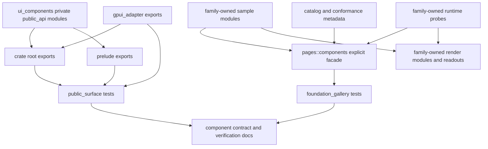

# UI Public Surface And Gallery Boundaries - Plan

## Goal Capsule

| Field | Decision |
|---|---|
| Objective | Turn the UI component public surface and foundation gallery into intentional facades backed by small ownership modules instead of large files and wildcard exports. |
| Authority | Current `main` after `docs/plans/2026-07-01-001-refactor-ui-contract-test-modules-plan.md`, `docs/ui/component-contract.md`, and `docs/verification.md`. |
| Execution profile | Fearless refactor is allowed: break internal gallery paths, remove wildcard facades, delete compatibility shims, and replace source-string tests when stronger contracts exist. |
| Public API posture | The default `ui_components` surface should be curated once, then consumed by crate root and prelude; GPUI adapter helpers remain grouped outside the default interface. |
| Stop conditions | Stop and re-plan only if implementation must create a new crate, change documented component behavior, or intentionally remove a public component/state contract. |

This is the next cleanup after the contract-test module split.
The previous plan made tests runnable by concern; this plan removes the new structural bottlenecks that became visible after that split.
The core problem is ownership drift: public API inventory lives in one large test file, root and prelude exports duplicate a huge list, and the gallery Components page still exposes internal runtime and sample modules through wildcard facades.

---

## Product Contract

### Summary

Open GPUI should expose a component library surface that is easy to audit and hard to widen accidentally.
This refactor makes the default component exports, public-surface tests, gallery facade, sample data, render sections, and runtime probes all flow through named ownership boundaries.

### Problem Frame

`crates/ui_components/tests/support/public_surface.rs` is now the largest remaining public-contract bottleneck.
It mixes owner maps, API inventory, source scanning, doc scanning, helper parsing, and the tests themselves in one file.
That gives good coverage, but it makes every public-surface change feel like editing a private testing framework.

`crates/ui_components/src/lib.rs` and `crates/ui_components/src/prelude.rs` still hand-maintain overlapping re-export lists.
The current tests catch drift, but they do not remove the duplication that causes drift.
The framework needs a curated export surface that root and prelude can consume intentionally, with adapter-only exports kept out of the default surface.

The gallery Components page has the same shape at a larger scale.
`examples/ui-foundation-gallery/src/pages/components.rs` publicly exposes `runtime` and `samples`, then wildcard re-exports both.
The backing files are also too broad: `samples.rs` owns all families, `render.rs` owns page orchestration plus readout rows plus section rendering, and `runtime.rs` owns unrelated Tree, Table, and VirtualizedList probes.
Integration tests currently depend on that broad facade, so the next refactor must replace incidental access with explicit conformance APIs.

### Requirements

**Public Surface Ownership**

- R1. Root and prelude exports must be backed by one curated default public surface instead of two manually duplicated item lists.
- R2. GPUI adapter helpers must remain grouped behind `open_gpui_ui_components::gpui_adapter` and must not leak into the default prelude.
- R3. Render-plan internals for Table, Tree, and VirtualizedList must remain private implementation details and must not enter root, prelude, docs, or gallery signals as default APIs.
- R4. Public-surface tests must be split by concern so export drift, ownership manifest drift, docs drift, and source-scanner drift can fail independently.

**Gallery Facade**

- R5. `pages::components` must expose a deliberate conformance contract, not wildcard access to sample and runtime internals.
- R6. Integration tests may consume explicit gallery probes and public sample accessors, but must not rely on `pub use runtime::*` or `pub use samples::*`.
- R7. Gallery sample data, rendering, readout rows, and runtime logs must be split into family-owned modules with small parent facades.
- R8. Public gallery metadata such as `COMPONENT_CATALOG`, `COMPONENT_CONFORMANCE_GATES`, story contracts, sample selectors, and state-contract readout selectors must remain stable.

**Deletion And Documentation**

- R9. Stale compatibility aliases, obsolete wildcard exports, and source-string tests that only prove old file placement must be deleted once replacement contracts exist.
- R10. `docs/ui/component-contract.md` and `docs/verification.md` must describe the curated public API surface and the explicit gallery facade.
- R11. Verification commands must keep focused gates for public surface and gallery conformance after the file split.

### Acceptance Examples

- AE1. Root and prelude export checks prove the same intended default surface without duplicating the entire export list in both files.
- AE2. `pages::components` contains no `pub use runtime::*`, no `pub use samples::*`, and no public `runtime` or `samples` module exposure.
- AE3. Public-surface test failures point to a focused test module such as export alignment, ownership manifest, docs vocabulary, source mapping, or adapter-only leakage.
- AE4. Gallery sample families can move files without changing public sample selectors, component catalog entries, or focused gallery smoke tests.
- AE5. Table, Tree, and VirtualizedList runtime probes remain accessible only through explicit gallery test/probe exports.
- AE6. Documentation names the public API facade, adapter-only boundary, gallery facade, and focused verification gates without referring to monolithic helper files as the intended design.

### Scope Boundaries

In scope:

- Public re-export organization in `crates/ui_components/src/lib.rs`, `crates/ui_components/src/prelude.rs`, and new private public-surface modules under `crates/ui_components/src/`.
- Public-surface test architecture under `crates/ui_components/tests/public_surface.rs`, `crates/ui_components/tests/public_surface/`, and `crates/ui_components/tests/support/`.
- Components gallery facade, sample modules, render modules, runtime modules, and conformance tests.
- Documentation and verification updates for the new boundaries.

Deferred to follow-up work:

- Creating a separate headless UI crate.
- Replacing every gallery source-string conformance assertion with runtime or typed APIs.
- Reorganizing overlay gallery internals; this plan targets the Components page.
- Introducing code generation for public exports.

Outside this plan:

- Preserving old gallery module paths as compatibility aliases.
- Keeping wildcard facade exports because integration tests currently use them.
- Changing visual design or component behavior while moving ownership.

---

## Planning Contract

### Key Technical Decisions

- KTD1. Use a curated internal public API surface instead of export-generation macros. A private `public_api` module family can own the default item list, while crate root and prelude consume that list through narrow re-exports.
- KTD2. Allow wildcard only from a private curated surface when tests prove the source is intentional. Wildcard exports from component families, gallery `runtime`, or gallery `samples` remain forbidden.
- KTD3. Split public-surface tests before changing export architecture. The characterization pass preserves today behavior before the root/prelude duplication is removed.
- KTD4. Keep gallery modules private and re-export explicit conformance items from `pages::components`. Integration tests should depend on the facade contract, not module topology.
- KTD5. Split gallery by ownership families rather than one file per component. Families such as primitives, feedback, text, choice, navigation, data, and layout keep files navigable without creating dozens of tiny modules.
- KTD6. Keep current crate boundaries. Reference repositories show value in separate story/demo surfaces, but this repo already has `examples/ui-foundation-gallery`; the high-value move is to harden that boundary before adding crates.
- KTD7. Delete stale tests in the unit that replaces them. Source-string assertions that only check old file placement should become contract tests or disappear.

### High-Level Technical Design

### Assumptions

- Current public component names and state contracts should remain available unless a test proves an item was already classified as internal or deprecated.
- Current gallery smoke tests are the behavioral authority for rendered interactions; source-string tests are secondary when a stronger runtime contract exists.
- `repo-ref/gpui-component` and `repo-ref/fret` are prior-art references only. They support the direction of curated story/demo surfaces and contract tests, but they do not override this repo's existing API.
- `cargo nextest` is available for focused verification; package-scoped `cargo test` is an implementation-time fallback only if nextest is unavailable.

### Refactor Sequence

1. Split and characterize public-surface tests while behavior is unchanged.
2. Move root/prelude default exports behind a curated internal public API surface.
3. Replace gallery wildcard facade exports with explicit public probe and sample exports.
4. Split gallery sample, render, and runtime ownership by family while preserving the explicit facade.
5. Update documentation and remove obsolete compatibility paths.

---

## Implementation Units

### U1. Split Public Surface Contract Harness

- **Goal:** Turn `public_surface` from one large hidden test body into focused test modules plus shared support data.
- **Requirements:** R1, R2, R3, R4, R9, AE3.
- **Dependencies:** None.
- **Files:** `crates/ui_components/tests/public_surface.rs`, new modules under `crates/ui_components/tests/public_surface/`, `crates/ui_components/tests/support/mod.rs`, new support modules under `crates/ui_components/tests/support/public_surface/`, and removal or reduction of `crates/ui_components/tests/support/public_surface.rs`.
- **Approach:** Move test functions into focused modules for export alignment, ownership manifest, API inventory, docs vocabulary, adapter-only leakage, source mapping, and parser helpers. Move reusable owner maps, component inventories, and source-reading helpers under `tests/support/public_surface/`. Keep the initial assertions behavior-equivalent so later units can rely on the focused gates.
- **Execution note:** Characterization-first. Preserve existing failing/passing semantics before changing `src` exports.
- **Patterns to follow:** The existing focused integration files in `crates/ui_components/tests/table.rs`, `crates/ui_components/tests/choice.rs`, `crates/ui_components/tests/overlay.rs`, and `crates/ui_components/tests/layout.rs`.
- **Test Scenarios:** The export-alignment module still rejects accidental root/prelude drift. The ownership-manifest module still classifies every public surface once. The docs-vocabulary module still fails on stale public contract text. The adapter-only module still rejects GPUI runtime helpers in default exports. The source-mapping module still proves split component directories map to real files.
- **Verification:** The `public_surface` integration binary passes, and each moved concern can be filtered by test name without running unrelated concerns.

### U2. Introduce A Curated Public API Surface

- **Goal:** Remove duplicated root/prelude export ownership by moving the default export list into one curated private module family.
- **Requirements:** R1, R2, R3, R4, AE1.
- **Dependencies:** U1.
- **Files:** `crates/ui_components/src/lib.rs`, `crates/ui_components/src/prelude.rs`, new modules under `crates/ui_components/src/public_api/`, and public-surface tests from U1.
- **Approach:** Create a private `public_api` module family that owns default component, state, behavior snapshot, helper, and core-table/virtualizer re-exports. Re-export that curated surface from crate root and prelude without retyping the full item list twice. Keep `gpui_adapter` as a separate public adapter namespace and keep prelude-only additions explicit. Adjust tests to distinguish allowed curated-surface wildcard re-exports from unsafe module wildcards.
- **Execution note:** Make the smallest behavior-preserving export move first, then delete the old duplicated lists once the focused tests prove parity.
- **Patterns to follow:** Existing root/prelude alignment tests and the `gpui_adapter` namespace in `crates/ui_components/src/lib.rs`.
- **Test Scenarios:** A public type available from root before the refactor remains available from root. A public type available from prelude before the refactor remains available from prelude. `gpui_adapter::TextInputController` and overlay adapter helpers remain adapter-namespaced. Table, Tree, and VirtualizedList render-plan internals remain absent from root and prelude. Unsafe `pub use some_component::*` additions still fail.
- **Verification:** `open-gpui-ui-components` checks and the focused `public_surface` export-alignment tests pass.

### U3. Replace Gallery Wildcard Facade Exports

- **Goal:** Make `pages::components` expose only explicit conformance items, sample accessors, and runtime probe types/functions.
- **Requirements:** R5, R6, R8, R9, AE2, AE5.
- **Dependencies:** U1.
- **Files:** `examples/ui-foundation-gallery/src/pages/components.rs`, `examples/ui-foundation-gallery/src/pages/components/runtime.rs`, `examples/ui-foundation-gallery/src/pages/components/samples.rs`, `examples/ui-foundation-gallery/tests/foundation_gallery.rs`, and gallery contract assertions.
- **Approach:** Change `runtime` and `samples` from public modules to private modules. Replace `pub use runtime::*` and `pub use samples::*` with explicit `pub use` lists for the catalog, conformance gates, stable sample accessors, state-contract sample accessors, and runtime logs/probe functions consumed by rendering and integration tests. Delete sample/runtime items that are no longer reachable or used.
- **Execution note:** Convert integration tests away from module-topology assumptions before hiding the modules.
- **Patterns to follow:** The existing explicit catalog and conformance re-exports at the top of `examples/ui-foundation-gallery/src/pages/components.rs`.
- **Test Scenarios:** `components.rs` has no wildcard export from `runtime` or `samples`. Integration tests can still access `COMPONENT_CATALOG`, `COMPONENT_CONFORMANCE_GATES`, sample selectors, state-contract readout selectors, Table runtime logs, Tree runtime logs, and VirtualizedList runtime logs through explicit facade names. Private sample/runtime helpers are not visible through `pages::components`.
- **Verification:** The foundation gallery package tests pass, and a source contract rejects reintroducing wildcard facade exports.

### U4. Split Gallery Sample Ownership By Family

- **Goal:** Replace the large `samples.rs` file with family-owned sample modules while preserving stable facade accessors.
- **Requirements:** R5, R6, R7, R8, R9, AE4.
- **Dependencies:** U3.
- **Files:** `examples/ui-foundation-gallery/src/pages/components/samples.rs`, new modules under `examples/ui-foundation-gallery/src/pages/components/samples/`, `examples/ui-foundation-gallery/src/pages/components/render.rs` or its replacement modules, and `examples/ui-foundation-gallery/tests/foundation_gallery.rs`.
- **Approach:** Move sample structs, builders, and static data into family modules for primitives/foundation, feedback, text, choice, navigation, layout, tree, virtualized list, and table. Keep a small `samples` parent facade that re-exports only the names used by `pages::components` and render modules. Keep heavy Table and Tree data builders isolated so future data-component work does not require scanning unrelated primitive samples.
- **Patterns to follow:** Existing sample function naming such as `button_samples`, `table_samples`, and `tree_state_contract_samples`.
- **Test Scenarios:** Official catalog entries still have matching sample selectors. State-contract entries still have matching readout selectors. Table sample ids used by gallery smokes remain stable. Tree and VirtualizedList state-contract samples still expose the documented metadata. Non-official catalog entries do not accidentally satisfy official sample selector checks.
- **Verification:** Gallery sample metadata tests and focused Components page smoke tests pass.

### U5. Split Gallery Render And Readout Ownership

- **Goal:** Reduce `render.rs` to page orchestration over family render sections, shared card helpers, and readout modules.
- **Requirements:** R5, R7, R8, R9, AE4, AE6.
- **Dependencies:** U3, U4.
- **Files:** `examples/ui-foundation-gallery/src/pages/components/render.rs`, new modules under `examples/ui-foundation-gallery/src/pages/components/render/`, `examples/ui-foundation-gallery/src/pages/components/catalog.rs`, `examples/ui-foundation-gallery/tests/foundation_gallery.rs`, and docs that describe Components page ownership.
- **Approach:** Move page list orchestration and focus-mode section routing into a small render parent. Move family sections into focused render modules. Move `component_*_state_row` readout functions into readout modules grouped by family. Move shared card/status helpers into a shared render support module. Replace brittle source-string tests that assert function order with contract tests over selectors, catalog entries, and rendered smoke behavior.
- **Patterns to follow:** Existing `ComponentFocusMode`, `COMPONENT_PAGE_JUMPS`, `official_sample_selector_pairs`, and focused gallery smoke tests.
- **Test Scenarios:** All-components mode renders the same catalog, conformance, and sample sections. Focused mode still opens every focusable official or state-contract catalog entry. Directory chips still remain anchor jumps. State readout selectors still render for state-contract entries. Nested scroll containment and table-focused smoke tests continue to pass after section modules move.
- **Verification:** Focused Components gallery smoke tests and conformance metadata tests pass.

### U6. Split Gallery Runtime Probe Ownership

- **Goal:** Separate Tree, Table, and VirtualizedList runtime logs so rendered sample probes are explicit and independently maintainable.
- **Requirements:** R5, R6, R7, R8, R9, AE5.
- **Dependencies:** U3.
- **Files:** `examples/ui-foundation-gallery/src/pages/components/runtime.rs`, new modules under `examples/ui-foundation-gallery/src/pages/components/runtime/`, `examples/ui-foundation-gallery/src/pages/components/render/`, `examples/ui-foundation-gallery/tests/foundation_gallery.rs`.
- **Approach:** Move Tree runtime events and controlled item overrides into a Tree runtime module. Move Table sizing, order, selection, expansion, filter, visibility, edit, and server-tree state into a Table runtime module. Move VirtualizedList activation tracking into its own module. Keep the parent runtime facade private to the gallery, and expose only explicit probe names through `pages::components`.
- **Patterns to follow:** Current `TreeSampleRuntimeLog`, `TableSampleRuntimeLog`, and `VirtualizedListSampleRuntimeLog` behavior.
- **Test Scenarios:** Table column resize, column order, filters, visibility, expansion, and cell edits still update the runtime log. Tree selection, toggle, move, and lazy child-loading smokes still read the expected events. VirtualizedList activation still records the clicked row. Runtime globals can still be reset by integration tests without exposing module internals.
- **Verification:** Foundation gallery runtime smoke tests pass, especially Table, Tree, and VirtualizedList focused tests.

### U7. Update Contracts, Verification, And Stale Text

- **Goal:** Make docs and verification describe the new public API and gallery facade architecture.
- **Requirements:** R9, R10, R11, AE6.
- **Dependencies:** U2, U3, U4, U5, U6.
- **Files:** `docs/ui/component-contract.md`, `docs/verification.md`, and any UI-specific verification notes referenced by those docs.
- **Approach:** Replace references to the long public-surface helper file with the focused public-surface modules. Document the curated default export surface, the adapter-only namespace, and the explicit gallery conformance facade. Update focused verification gates so public surface, gallery conformance, and runtime smoke coverage remain easy to run after files move. Remove stale text that treats sample/render/runtime internals as public gallery modules.
- **Test Scenarios:** Docs mention the new public API facade and explicit gallery facade. Docs do not mention `pub use runtime::*`, `pub use samples::*`, or a monolithic public-surface helper as the desired shape. Verification commands reference real test binaries and focused sentinel names.
- **Verification:** Documentation source checks and stale-text searches pass.

---

## Verification Contract

| Gate | Command | Covers |
|---|---|---|
| Formatting | `cargo fmt -p open-gpui-ui-components -p open-gpui-ui-foundation-gallery --check` | U1-U7 |
| UI components check | `cargo check -p open-gpui-ui-components --tests` | U1-U2 |
| Gallery check | `cargo check -p open-gpui-ui-foundation-gallery --tests` | U3-U7 |
| Public surface contract | `cargo nextest run -p open-gpui-ui-components --test public_surface --no-fail-fast` | U1-U2, U7 |
| Focused component families | `cargo nextest run -p open-gpui-ui-components --test layout --test navigation --test primitives --test theme --test form --no-fail-fast` | U2 |
| Gallery conformance metadata | `cargo nextest run -p open-gpui-ui-foundation-gallery components_page_samples_expose_component_metadata components_page_conformance_gates_reference_core_and_gallery_contracts state_contract_catalog_entries_have_signals_and_readout_selectors` | U3-U5, U7 |
| Gallery focused mode | `cargo nextest run -p open-gpui-ui-foundation-gallery components_gallery_smoke_focuses_every_focusable_catalog_entry components_gallery_smoke_focuses_catalog_family_and_restores_all_mode components_gallery_smoke_focused_mode_resets_page_on_family_change` | U4-U5 |
| Gallery runtime probes | `cargo nextest run -p open-gpui-ui-foundation-gallery components_gallery_smoke_editable_table_cell_updates_sample_rows components_gallery_smoke_checkbox_table_cell_updates_sample_rows components_gallery_smoke_select_table_cell_updates_sample_rows components_gallery_smoke_table_server_tree_loads_children_from_expansion_request` | U3, U6 |
| Full UI component package | `cargo nextest run -p open-gpui-ui-components --no-fail-fast` | U1-U2, U7 |
| Full gallery package | `cargo nextest run -p open-gpui-ui-foundation-gallery --no-fail-fast` | U3-U7 |
| Facade cleanup | `rg -n "pub use (runtime|samples)::\\*|pub mod (runtime|samples)" examples/ui-foundation-gallery/src/pages/components.rs` returns no matches | U3-U7 |
| Public internals cleanup | `rg -n "pub use .*RenderPlan|pub use .*RenderDiagnostics|pub use .*runtime::\\*|pub use .*samples::\\*" crates/ui_components/src examples/ui-foundation-gallery/src/pages/components.rs` shows no unsafe public leaks | U2-U7 |
| Diff hygiene | `git diff --check` | U1-U7 |

If `cargo nextest` is unavailable, use the same package and test-binary scope with `cargo test` as an implementation-time fallback and record the fallback in the implementation notes.

---

## Definition of Done

- `crates/ui_components/tests/support/public_surface.rs` is removed or reduced to a small compatibility shim with no test ownership.
- Public-surface tests are split into focused modules for exports, ownership, docs, source mapping, API inventory, and adapter-only leakage.
- `crates/ui_components/src/lib.rs` and `crates/ui_components/src/prelude.rs` consume a curated default public API surface instead of maintaining duplicated broad lists.
- `open_gpui_ui_components::gpui_adapter` remains the only public namespace for GPUI-specific adapter helpers that are not default component contracts.
- `examples/ui-foundation-gallery/src/pages/components.rs` has no wildcard exports from `runtime` or `samples`.
- Gallery sample data, render sections/readouts, and runtime probes are split into family-owned modules with small parent facades.
- Integration tests consume explicit `pages::components` conformance exports rather than private module topology.
- Table, Tree, and VirtualizedList render-plan internals remain absent from root, prelude, gallery signals, and public docs.
- `docs/ui/component-contract.md` and `docs/verification.md` describe the new facade boundaries and focused verification gates.
- Stale compatibility aliases, abandoned helper modules, and obsolete source-placement assertions are deleted.
- All Verification Contract gates pass or have a documented environment-only reason for failure.

---

## Appendix

### Current Local Findings

- `crates/ui_components/tests/support/public_surface.rs` is about 4k lines and contains owner maps, API inventory, source scanners, docs scanners, helper parsing, and public-surface tests.
- `crates/ui_components/tests/public_surface.rs` is currently only a tiny path wrapper around that large support file.
- `crates/ui_components/src/lib.rs` and `crates/ui_components/src/prelude.rs` still maintain overlapping explicit export lists.
- `examples/ui-foundation-gallery/src/pages/components.rs` publicly declares `runtime` and `samples`, then wildcard re-exports both.
- `examples/ui-foundation-gallery/src/pages/components/samples.rs` is about 5k lines, `render.rs` is about 3.7k lines, and `runtime.rs` is about 1k lines.
- `examples/ui-foundation-gallery/tests/foundation_gallery.rs` consumes `pages::components` sample constructors and runtime logs directly, so the facade must be tightened with explicit replacement exports before modules are hidden.
- `repo-ref/gpui-component` separates a story surface from the core UI crate, and `repo-ref/fret` uses tests to enforce explicit public surfaces in examples. The useful lesson is boundary discipline, not API shape copying.
