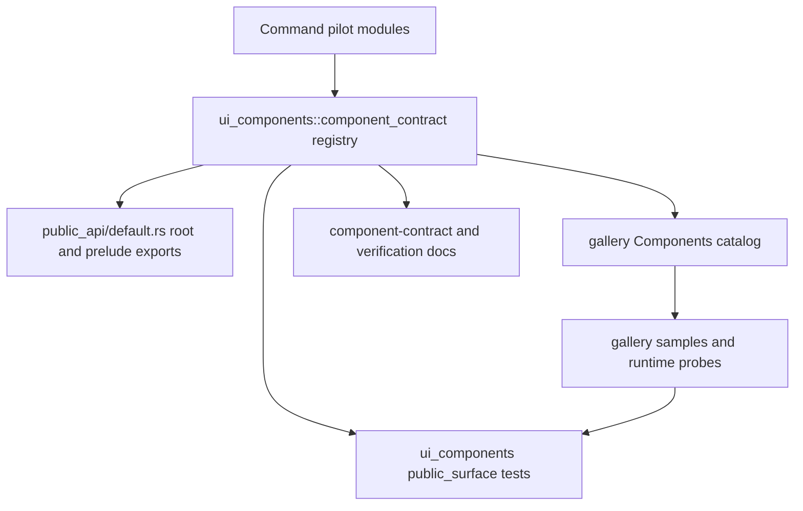

# UI Component Contract Registry - Plan

## Goal Capsule

| Field | Decision |
|---|---|
| Objective | Make `open-gpui-ui-components` own the official component contract registry, then make public-surface tests and the foundation gallery consume that registry instead of treating gallery source and test helpers as the product source of truth. |
| Authority | ADR 0005 adapter-first architecture, ADR 0008 current-crate productization roadmap, `docs/ui/component-contract.md`, `docs/verification.md`, and the shipped UI public/gallery boundary refactor. |
| Execution profile | Fearless refactor is allowed: break internal test helper APIs, delete duplicated metadata maps, move registry data into source modules, and split one complex component family as a pilot. |
| Contract posture | The registry becomes a typed component-library contract surface; gallery remains a rendered dogfood consumer, not the canonical owner of shipped component status. |
| Stop conditions | Stop and re-plan only if implementation must create a new crate, change visible component behavior, remove an official component, or make registry data depend on GPUI render/runtime types. |

The previous refactor made facades explicit.
The next bottleneck is the fact source: official component status, API inventory, public-surface ownership, and conformance evidence are still distributed across `examples/ui-foundation-gallery/src/pages/components/catalog.rs`, `examples/ui-foundation-gallery/src/pages/components/conformance.rs`, and `crates/ui_components/tests/support/public_surface/mod.rs`.
That shape keeps tests strong, but it makes the example gallery and test helper responsible for product decisions that belong in `open-gpui-ui-components`.

---

## Product Contract

### Summary

Open GPUI should expose component-library metadata from the component crate itself.
The gallery should render and dogfood that metadata, while tests verify that exports, docs, samples, and conformance gates still agree with it.

This plan introduces a typed contract registry in `crates/ui_components`, rewires public-surface and gallery checks to consume it, and migrates `Command` as the first complex family to the module shape the registry expects.

### Problem Frame

`crates/ui_components/tests/support/public_surface/mod.rs` currently contains product-level maps such as `PUBLIC_SURFACE_OWNER_MAP` and `COMPONENT_API_INVENTORY`.
Those maps are useful, but they live in a test helper, so the production crate cannot expose the same contract to examples, downstream docs, or future tooling.

`examples/ui-foundation-gallery/src/pages/components/catalog.rs` currently owns `COMPONENT_CATALOG`, which means shipped component status is inferred from gallery constructors such as `ComponentCatalogEntry::official`.
The gallery should keep presentation metadata, stable sample selectors, and focused page navigation, but the official component list should originate from `ui_components`.

The roadmap also says the next UI component series should deepen complex families, starting with `Command`.
`crates/ui_components/src/command/mod.rs` is still a 2k+ line module that mixes descriptors, ranking, selection, state, builder API, and adapter wiring.
The contract registry can stay abstract unless one complex family proves the intended module boundary.

### Requirements

**Contract Registry Ownership**

- R1. `open-gpui-ui-components` must expose a typed component contract registry that classifies official components, official recipes, renderer-neutral state contracts, adapter helpers, internal anatomy, diagnostics, and deprecated removal targets.
- R2. The registry must include the API inventory currently used by public-surface tests: render inputs, controlled inputs, `default_*` seeds, policy hints, callbacks, callback payloads, renderer-neutral state ownership, docs token, source home, and gallery status.
- R3. Registry data must stay renderer-neutral: it may name GPUI adapter helpers as adapter-only entries, but registry structs must not contain `Window`, `App`, `Context`, `Element`, `RenderOnce`, focus handles, scroll handles, or callback closures.
- R4. Crate root and prelude default exports must remain curated through `public_api/default.rs`, and tests must prove those exports match registry intent without duplicating the whole inventory in test helper code.

**Gallery Consumer Boundary**

- R5. `examples/ui-foundation-gallery` must consume the registry for shipped component status, family grouping, docs token, and conformance evidence instead of re-declaring official component status as the canonical source.
- R6. Gallery-specific metadata such as page jumps, sample selectors, focused-section ids, state-contract readout selectors, and rendered sample builders remains in the gallery because it describes dogfood presentation, not the component crate's public contract.
- R7. Gallery tests must fail if gallery source marks a component official that the registry does not classify as official, or if the registry marks a component official without a gallery sample selector.

**Command Pilot**

- R8. `Command` must become the first complex family that follows a registry-friendly module shape: descriptor/index data, selection/query state, behavior snapshots, GPUI runtime adapter, and public builder facade are separated by ownership.
- R9. The `Command` public API exported from root and prelude must remain source-compatible unless the registry exposes a stale or accidental surface that should be deleted as part of the fearless refactor.
- R10. Existing `Command` state, ranking, snapshot, multi-select, dialog, and runtime tests must continue to prove behavior after the split.

**Docs And Verification**

- R11. `docs/ui/component-contract.md` must state that `ui_components` owns the component contract registry and that the gallery consumes it.
- R12. `docs/verification.md` must name focused gates for the registry, public-surface alignment, gallery consumption, and the `Command` pilot split.
- R13. Obsolete source-string tests and helper parsers that exist only to compensate for missing typed registry data must be deleted or narrowed to forbidden-boundary checks.

### Acceptance Examples

- AE1. Adding a new official component requires one registry entry in `crates/ui_components`, then gallery samples and tests prove the rendered dogfood; it does not require adding the same official status to both gallery source and public-surface helper maps.
- AE2. A gallery-only typo such as `ComponentCatalogEntry::official("MissingComponent", ...)` fails because the registry has no matching official component contract.
- AE3. A registry entry for an official component without crate-root/prelude exports fails public-surface tests with a registry-alignment error.
- AE4. `Command` exports such as `Command`, `CommandState`, `CommandIndexSnapshot`, `CommandSelectionChange`, and `CommandBehaviorSnapshot` remain importable from root and prelude after the module split.
- AE5. Documentation no longer says `examples/ui-foundation-gallery::pages::components::catalog::COMPONENT_CATALOG` owns the official component completion contract; it says the gallery consumes the component crate registry.

### Scope Boundaries

In scope:

- Creating a typed registry module under `crates/ui_components/src/`.
- Moving the public-surface owner map and component API inventory out of test helper ownership.
- Rewiring `crates/ui_components/tests/public_surface/` to consume typed registry data.
- Rewiring the Components gallery catalog/conformance layer to consume registry data while keeping gallery presentation metadata local.
- Splitting `crates/ui_components/src/command/mod.rs` into smaller ownership modules as the pilot complex family.
- Updating docs and verification gates for the new source of truth.

Deferred to follow-up work:

- Moving every large component family into the new module shape.
- Creating `open-gpui-ui-headless` or any other new crate.
- Generating registry data with build scripts or macros.
- Turning gallery sample builders into component crate fixtures.
- Replacing the whole gallery source-string test suite; this plan only deletes or narrows checks superseded by typed registry data.

Outside this plan:

- Changing `Command` behavior or visual design.
- Preserving old test-helper-private APIs for compatibility.
- Promoting adapter helpers into the default prelude.
- Treating registry metadata as a substitute for rendered gallery smoke tests.

---

## Planning Contract

### Key Technical Decisions

- KTD1. `ui_components` owns the product registry.
  The registry belongs in source because downstream examples, docs, tests, and future tooling need the same classification vocabulary.
  Test helpers may project or validate registry data, but they should not define the product truth.
- KTD2. The registry is public but not prelude-default.
  The gallery package must be able to import the registry through `open_gpui_ui_components`, but ordinary app code should not receive registry types through the default prelude unless a future public API decision promotes them.
- KTD3. Gallery catalog becomes an adapter over registry entries.
  Gallery code may attach sample selectors, page sections, and presentation labels to registry entries, but it must not independently classify official component status.
- KTD4. `Command` is the pilot family.
  The component-depth roadmap names `Command` as the next priority, and its current module mixes enough concerns to prove the registry-friendly structure without expanding the plan to Menu, Tree, or Table.
- KTD5. No code generation in this slice.
  A handwritten typed registry is easier to review, keeps the refactor deterministic, and avoids introducing build-script churn while the contract vocabulary is still settling.
- KTD6. Source-string tests stay only where they guard boundaries that Rust types cannot express.
  Tests may still reject `pub use runtime::*` or accidental public modules by source inspection, but registry alignment should use typed data.

### High-Level Technical Design

The registry is the single typed source for product classification and API inventory.
`public_api/default.rs` still owns actual Rust re-export syntax, but public-surface tests compare exported tokens against registry intent.
The gallery remains the runtime evidence surface: it maps registry entries to sample selectors and renders real components, then its tests prove the registry entries are visible and interactive where required.

### Assumptions

- The registry can be added as a public module without treating every registry struct as a default prelude item.
- The current `Command` tests in `crates/ui_components/tests/choice.rs` are enough characterization coverage for a module split before behavior changes.
- The gallery can keep its stable public `pages::components::COMPONENT_CATALOG` path by projecting registry entries into the existing gallery-facing entry type.

### System-Wide Impact

This change affects the public API governance path for all future components.
After it lands, component promotion should flow through the registry first, then through exports, gallery samples, docs, and smoke tests.
That will make later deepening work on Menu, Tree, Table, and additional form controls easier to audit because they will share one promotion contract.

### Risks And Mitigations

| Risk | Mitigation |
|---|---|
| Registry types accidentally become a broad app-facing API. | Keep the module explicit and out of the prelude; document that it is a product-contract surface. |
| Gallery loses presentation flexibility. | Keep page jumps, sample selectors, focused modes, and runtime probe exports local to gallery. |
| Command split becomes behavior-changing. | Treat existing Command state/runtime tests as characterization gates and run them before and after the split. |
| Typed registry duplicates export lists in a new place. | Registry records intent and classification; `public_api/default.rs` remains the syntax owner, and tests compare them instead of hand-copying all exports into test helpers. |
| Plan expands into all large modules. | Limit the implementation pilot to `Command`; route Menu, Tree, Table, and remaining single-file modules to follow-up plans. |

---

## Implementation Units

### U1. Add component contract registry

- **Goal:** Create the typed registry module in `ui_components` and move product-level public-surface metadata out of test-helper ownership.
- **Requirements:** R1, R2, R3, AE1.
- **Dependencies:** None.
- **Files:** `crates/ui_components/src/component_contract/mod.rs`, new submodules under `crates/ui_components/src/component_contract/`, `crates/ui_components/src/lib.rs`, `crates/ui_components/tests/support/public_surface/mod.rs`, `crates/ui_components/tests/public_surface/inventory.rs`, `crates/ui_components/tests/public_surface/manifest.rs`.
- **Approach:** Define registry structs and enums for component kind, surface owner, gallery status, docs status, API inventory, default seeds, callbacks, and source homes.
  Move `PUBLIC_SURFACE_OWNER_MAP` and `COMPONENT_API_INVENTORY` data under this module and expose it through typed accessors.
  Keep raw data static and deterministic; avoid runtime allocation except in test projections.
- **Execution note:** Characterization-first: keep existing public-surface tests passing before replacing helper-owned constants.
- **Patterns to follow:** `crates/ui_components/src/public_api/default.rs`, `crates/ui_components/tests/support/public_surface/mod.rs`, `crates/ui_components/tests/public_surface/inventory.rs`, `crates/ui_components/tests/public_surface/manifest.rs`.
- **Test scenarios:**
  - Happy path: `COMPONENT_API_INVENTORY` equivalent data is reachable through the registry and still has unique component rows.
  - Edge case: adapter-only entries such as `TextInputController` remain classified outside official component status.
  - Error path: a duplicate registry row or unclassified component fails the existing inventory uniqueness/classification tests.
  - Integration: public-surface manifest generation uses registry entries instead of test-local constants.
- **Verification:** `public_surface` tests pass with no test-local duplicate of the moved product maps.

### U2. Align default exports with registry intent

- **Goal:** Make root/prelude export tests compare the curated default surface against registry intent, while keeping `public_api/default.rs` as the syntax owner.
- **Requirements:** R4, R9, AE3, AE4.
- **Dependencies:** U1.
- **Files:** `crates/ui_components/src/public_api/default.rs`, `crates/ui_components/src/lib.rs`, `crates/ui_components/src/prelude.rs`, `crates/ui_components/tests/public_surface/exports.rs`, `crates/ui_components/tests/support/public_surface/mod.rs`.
- **Approach:** Add registry fields or projections that say whether a surface belongs in the default root/prelude set, adapter-only module, or neither.
  Update export tests so they compare parsed re-export tokens to registry intent.
  Keep `pub use public_api::default::*` as the only wildcard hop allowed by tests.
- **Test scenarios:**
  - Happy path: root and prelude expose all registry default-surface entries and no adapter-only entries.
  - Edge case: prelude-only core extensions such as `UiA11yElementExt` remain allowed without becoming component registry entries.
  - Error path: adding an adapter helper to `public_api/default.rs` fails because registry marks it adapter-only.
  - Integration: `crate_root_and_prelude_reexports_stay_intentionally_aligned` still proves root/prelude token parity after the registry move.
- **Verification:** Focused export tests pass and no new wildcard public re-export is introduced.

### U3. Rewire gallery catalog and conformance to consume registry

- **Goal:** Keep the existing gallery-facing catalog path stable while making official status and component metadata originate from `ui_components`.
- **Requirements:** R5, R6, R7, AE1, AE2, AE5.
- **Dependencies:** U1.
- **Files:** `examples/ui-foundation-gallery/src/pages/components/catalog.rs`, `examples/ui-foundation-gallery/src/pages/components/conformance.rs`, `examples/ui-foundation-gallery/src/pages/components.rs`, `examples/ui-foundation-gallery/tests/foundation_gallery.rs`, `crates/ui_components/tests/public_surface/manifest.rs`.
- **Approach:** Replace gallery-owned official-status declarations with projections from the component registry.
  Keep `ComponentCatalogEntry` if it is still useful as a gallery view model, but construct official rows from registry entries.
  Keep state-contract readout selectors and sample selectors in gallery because they are dogfood artifacts.
  Make conformance gates either reference registry evidence directly or validate that gate evidence names registry entries.
- **Test scenarios:**
  - Happy path: every registry official component with a gallery requirement appears in `pages::components::COMPONENT_CATALOG` with a stable sample selector.
  - Edge case: state-contract entries such as `TreeState` remain state-contract rows, not official rendered components.
  - Error path: gallery cannot introduce an official component row that is absent from the registry.
  - Integration: focused Components page smoke tests still navigate by catalog entry and render sample selectors.
- **Verification:** Gallery metadata/conformance tests pass without parsing gallery constructors as the product source of truth.

### U4. Split Command into registry-friendly ownership modules

- **Goal:** Prove the new contract shape on one complex family by splitting `Command` into smaller modules without behavior changes.
- **Requirements:** R8, R9, R10, AE4.
- **Dependencies:** U1, U2.
- **Files:** `crates/ui_components/src/command/mod.rs`, new modules under `crates/ui_components/src/command/`, `crates/ui_components/src/public_api/default.rs`, `crates/ui_components/tests/choice.rs`, `crates/ui_components/tests/public_surface/source_mapping.rs`, `crates/ui_components/tests/public_surface/inventory.rs`.
- **Approach:** Keep `command/mod.rs` as the public facade and move cohesive ownership clusters into submodules.
  Candidate clusters are descriptor/index models, query and selection state, behavior snapshot projection, dialog/open policy, and GPUI runtime adapter.
  Preserve public type names and root/prelude exports unless the registry exposes an accidental surface.
- **Execution note:** Characterization-first: run focused Command state/runtime tests before making the split, then rerun them after each major module move.
- **Patterns to follow:** `crates/ui_components/src/table/`, `crates/ui_components/src/command/render_plan.rs`, `crates/ui_components/src/command/runtime.rs`.
- **Test scenarios:**
  - Happy path: Command state still filters, ranks, preserves caller order for empty queries, models default/controlled query ownership, and exposes loading metadata.
  - Edge case: duplicate command values remain disambiguated in behavior snapshots, disabled items remain visible but non-activatable, and multi-select chips stay stable after reorder.
  - Error path: Escape and dialog close policy still emit open-change events in the existing order.
  - Integration: rendered Command runtime tests still filter input, select with keyboard, keep multi-select dialogs open, and keep virtualized wheel input inside the command viewport.
- **Verification:** `crates/ui_components/tests/choice.rs` Command tests and public-surface export/source-mapping tests pass after the split.

### U5. Delete superseded helper parsers and narrow source-string tests

- **Goal:** Remove duplicated source-of-truth logic that the typed registry replaces.
- **Requirements:** R13, AE2, AE3.
- **Dependencies:** U1, U2, U3.
- **Files:** `crates/ui_components/tests/support/public_surface/mod.rs`, `crates/ui_components/tests/public_surface/manifest.rs`, `examples/ui-foundation-gallery/tests/foundation_gallery.rs`, `docs/verification.md`.
- **Approach:** Delete helper functions that parse gallery constructors for official status once tests can consume registry projections.
  Keep source-string tests only for boundaries Rust types cannot express, such as forbidding `pub mod runtime`, `pub mod samples`, and wildcard facade exports.
  Update failure messages so they name registry drift rather than gallery source drift.
- **Test scenarios:**
  - Happy path: registry, public exports, docs, and gallery catalog all agree without gallery-constructor parsing.
  - Edge case: forbidden public module or wildcard facade checks still fail through source inspection.
  - Error path: a stale docs token or missing registry docs token fails public-surface docs/manifest tests.
- **Verification:** `rg` no longer finds helper functions whose only purpose is parsing `ComponentCatalogEntry::official` as the product source, while boundary-forbidden source checks remain.

### U6. Update docs and verification gates

- **Goal:** Make the documented architecture match the registry-first ownership model.
- **Requirements:** R11, R12, AE5.
- **Dependencies:** U1, U2, U3, U4, U5.
- **Files:** `docs/ui/component-contract.md`, `docs/verification.md`, `crates/ui_components/tests/public_surface/docs.rs`, `examples/ui-foundation-gallery/tests/foundation_gallery.rs`.
- **Approach:** Rewrite the Official Component Completion and Gallery Conformance Surface sections so the component crate owns registry truth and gallery owns dogfood evidence.
  Add focused verification commands for registry/public-surface alignment, gallery consumption, and Command pilot behavior.
  Update docs tests so stale gallery-as-owner vocabulary fails.
- **Test scenarios:**
  - Happy path: docs mention the registry, gallery consumer role, and Command pilot focused gates.
  - Edge case: docs still preserve adapter-first and headless-ready language without implying a new crate.
  - Error path: stale wording that says gallery catalog owns official component completion fails docs tests.
- **Verification:** Public-surface docs tests and gallery verification-doc tests pass with the new vocabulary.

---

## Verification Contract

| Gate | Command | Proves |
|---|---|---|
| Formatting | `cargo fmt -p open-gpui-ui-components -p open-gpui-ui-foundation-gallery --check` | Registry, Command split, gallery, and docs-adjacent Rust files are formatted. |
| Component typecheck | `cargo check -p open-gpui-ui-components --tests` | Registry module and Command split compile across test targets. |
| Gallery typecheck | `cargo check -p open-gpui-ui-foundation-gallery --tests` | Gallery consumes the registry without private component crate access. |
| Public surface | `cargo nextest run -p open-gpui-ui-components --test public_surface --no-fail-fast` | Registry, export, manifest, docs, adapter-only, and source-mapping contracts agree. |
| Command focus | `cargo nextest run -p open-gpui-ui-components --test choice command --no-fail-fast` | Command state, ranking, snapshot, selection, dialog, and runtime behavior survive the split. |
| Gallery metadata | `cargo nextest run -p open-gpui-ui-foundation-gallery components_page_samples_expose_component_metadata components_catalog_metadata_is_separate_from_rendering components_page_conformance_gates_reference_core_and_gallery_contracts --no-fail-fast` | Gallery remains a registry consumer with stable samples and gates. |
| Gallery Command smoke | `cargo nextest run -p open-gpui-ui-foundation-gallery components_gallery_smoke_focused_command_samples_cover_depth_behaviors --no-fail-fast` | Rendered Command samples still cover focused family behavior. |
| Full component package | `cargo nextest run -p open-gpui-ui-components --no-fail-fast` | No component-wide regression from registry ownership or Command split. |
| Full gallery package | `cargo nextest run -p open-gpui-ui-foundation-gallery --no-fail-fast` | No gallery conformance regression. |
| Boundary cleanup | `rg -n "ComponentCatalogEntry::official\\(|official_component_catalog_names_from_gallery_source|component_catalog_names_from_gallery_constructor" crates/ui_components/tests examples/ui-foundation-gallery/tests` | No remaining test helper treats gallery constructors as the official product source. |

---

## Definition of Done

- The canonical component contract registry lives in `crates/ui_components/src/` and is consumed by tests and gallery.
- Test-helper-owned copies of public-surface owner maps and component API inventory are removed or reduced to projections over registry data.
- Root/prelude export tests prove curated default exports against registry intent while keeping adapter helpers out of the default surface.
- The Components gallery still exposes stable catalog, sample selector, state-contract readout, focused-mode, and conformance APIs, but official component status comes from the registry.
- `Command` is split into small ownership modules with unchanged public imports and unchanged behavior.
- Stale source-string tests are deleted or narrowed to forbidden-boundary checks.
- `docs/ui/component-contract.md` and `docs/verification.md` describe registry-first ownership.
- All Verification Contract gates pass, or any environment-only failure is documented with the exact command and reason.
- The final diff contains no abandoned experimental modules, duplicate registries, or compatibility shims for old test-helper internals.

---

## Appendix

### Local Research Inputs

- `docs/adr/0005-open-gpui-official-component-architecture.md` chooses adapter-first, headless-ready components without creating a headless crate yet.
- `docs/adr/0008-open-gpui-ui-component-productization-roadmap.md` keeps current crates as the active product boundary.
- `docs/knowledge/engineering/decisions/open-gpui-ui-component-depth-roadmap.md` prioritizes deeper complex families and names `Command` first.
- `docs/knowledge/engineering/subagents/ui-component-roadmap-reference-research.md` says `repo-ref/gpui-component` is useful for GPUI-native story shape and `repo-ref/fret/apps/fret-ui-gallery` is useful for gallery/conformance policy.
- `repo-ref/fret/apps/fret-ui-gallery/tests/*_docs_surface.rs` shows a mature pattern of treating gallery docs/tests as conformance evidence, while this plan keeps Open GPUI's product classification in the component crate.
- `repo-ref/gpui-component/crates/story/src/lib.rs` and story examples show GPUI-native stories as rendering surfaces, not as the canonical component API registry.
- Current hotspots include `crates/ui_components/src/menu.rs`, `crates/ui_components/src/command/mod.rs`, `crates/ui_components/src/tree.rs`, `crates/ui_components/tests/support/public_surface/mod.rs`, and `examples/ui-foundation-gallery/src/pages/components/catalog.rs`.
