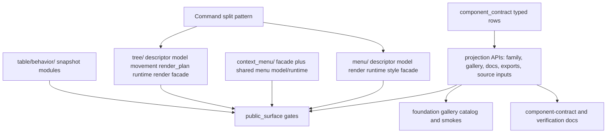

# UI Family Boundary Deepening - Plan

## Goal Capsule

| Field | Decision |
|---|---|
| Objective | Deepen the component-library architecture by turning the registry into a table-driven contract surface and moving the next large UI families into explicit descriptor, model, render-plan, runtime, style, and facade ownership modules. |
| Authority | The registry-first contract from plan 003, ADR 0008's current-crate productization roadmap, the component-depth roadmap, `docs/ui/component-contract.md`, and `docs/verification.md`. |
| Execution profile | Fearless refactor is allowed: move files, break private test helpers, delete stale source mappings, remove compatibility shims, and replace stringly projections with typed rows when they are only preserving old structure. |
| Contract posture | Public behavior stays stable; internal module ownership may break. The component crate remains the product boundary, and renderer-neutral state must not absorb GPUI runtime handles. |
| Stop conditions | Stop and re-plan only if implementation requires a new crate, changes visible component behavior, removes an official public component, or makes registry data depend on GPUI render/runtime types. |

Plan 003 proved the registry and split `Command` into the shape the library wants.
The remaining bottleneck is that large families still carry product, state, runtime, and render assembly in the same source owners.
`Menu`, `ContextMenu`, and `Tree` are the next highest leverage families because they are official, behavior-rich, and still single-file dominated.
`Table` already has a directory boundary, so this plan narrows it to the behavior snapshot owner and source mapping contract instead of reopening the full table renderer.

---

## Product Contract

### Summary

Open GPUI should make large component families navigable by responsibility, not by historical file growth.
The registry should describe those owners directly enough that public-surface tests, docs, and gallery conformance can detect source-owner drift without parsing implementation files.

This plan upgrades registry projections, splits `Menu` / `ContextMenu`, splits `Tree`, and narrows the oversized `TableBehaviorSnapshot` owner.
`Command` remains the reference implementation.

### Problem Frame

`crates/ui_components/src/component_contract/mod.rs` now owns product metadata, but several projections still live as independent `match` or `if` chains: family grouping, gallery status, source inputs, source home, public methods, and inventory rows.
That is better than test-helper ownership, but it still lets related facts drift.

`crates/ui_components/src/menu.rs` is a 2k+ line module that mixes item descriptors, menu state, submenu placement, safe hover geometry, style tokens, render elements, callbacks, and the public builder.
`crates/ui_components/src/menu_runtime.rs` separately owns shared submenu timing and scroll state, while `crates/ui_components/src/context_menu.rs` duplicates context-menu state and render assembly around the same menu model.
The family is behavior-rich enough that a source mapping of `["menu.rs"]` no longer represents the contract.

`crates/ui_components/src/tree.rs` already has `tree/movement.rs` and `tree/render_plan.rs`, but the root file still owns descriptors, resolved state, keyed runtime, rendering, drag payloads, keyboard handling, and tests.
That keeps the official `Tree` family hard to review and unlike the `Command` pattern.

`crates/ui_components/src/table/behavior.rs` is the last large Table owner after the table directory refactors.
The Table plan should not rework the renderer again; it should split the public behavior readout into small snapshot modules and update source mapping so the registry records actual ownership.

### Requirements

**Registry Contract Structure**

- R1. Registry data must converge toward one typed row model for product metadata: surface name, owner class, family, gallery status, docs status, default-export intent, source inputs, and source home.
- R2. Existing public projection functions may remain as compatibility facades, but they must derive from the typed rows or from one canonical inventory table rather than from parallel hand-written maps.
- R3. Registry structs and static rows must stay renderer-neutral. They may name GPUI adapter modules as source owners, but they must not store `Window`, `App`, `Context`, `RenderOnce`, focus handles, scroll handles, callbacks, or elements.
- R4. Source mapping tests must fail if `Menu`, `ContextMenu`, `Tree`, or `TableBehaviorSnapshot` regress to stale single-file ownership.

**Menu And ContextMenu Boundary**

- R5. `Menu` must move from `menu.rs` into a `menu/` family directory with separate owners for descriptor data, resolved model/state, render-plan or geometry facts, runtime adapter state, style tokens, and the public facade.
- R6. `ContextMenu` must share the menu descriptor/model/runtime contract instead of duplicating menu behavior. It may keep a `context_menu/` facade directory for point-anchor state, hotspot rendering, and context-menu-specific placement.
- R7. Root and prelude exports for `Menu`, `MenuState`, `MenuItemDescriptor`, `MenuItemState`, `MenuSelection`, submenu helpers, `ContextMenu`, and `ContextMenuState` must remain importable unless a surface is explicitly proven accidental and removed with matching tests and docs.
- R8. Runtime behavior for roving focus, typeahead, submenu hover timing, safe hover corridor, local submenu scroll, outside policy, Escape policy, context-menu point anchoring, and long context-menu scroll must remain unchanged.

**Tree Boundary**

- R9. `Tree` must move from `tree.rs` into a `tree/` family directory that separates descriptor/model state, movement helpers, render plans and behavior snapshots, runtime adapter state, render assembly, and public facade methods.
- R10. `TreeState` remains the renderer-neutral hierarchy contract. Drag payloads, `ScrollHandle`, focus handles, keyed runtime state, and GPUI callbacks remain adapter/runtime private.
- R11. Root and prelude exports for `Tree`, `TreeState`, `TreeBehaviorSnapshot`, `TreeItemDescriptor`, `TreeItemState`, `TreeSelection`, `TreeToggle`, movement types, load-state types, and navigation helpers must remain aligned with the registry.
- R12. Runtime behavior for expansion, typeahead, reveal, selection, lazy-child metadata, drag/move drop zones, virtualization, and wheel containment must remain unchanged.

**Table Behavior Snapshot Boundary**

- R13. `TableBehaviorSnapshot` stays the public readout, but its implementation must split row counts, visible row windows, column regions, header summary, tree summary, column snapshots, row snapshots, and cell snapshots into reviewable modules.
- R14. This plan must not reopen the full Table renderer, filter recipes, editing recipes, or row-model core. The Table work is only behavior snapshot ownership, exports, source mapping, and tests that prove no behavior changed.
- R15. Table source mapping must identify the behavior snapshot modules explicitly enough that future moves are caught by public-surface tests.

**Docs And Verification**

- R16. `docs/ui/component-contract.md` must describe Command as the reference split and Menu, ContextMenu, Tree, and Table behavior snapshots as the next deepened boundaries.
- R17. `docs/verification.md` must name focused gates for registry source mapping, Menu/ContextMenu, Tree, and Table behavior snapshots.
- R18. Obsolete source strings, old single-file assumptions, and test-only helper maps that exist only to preserve pre-registry structure must be deleted or reduced to registry projections.

### Acceptance Examples

- AE1. Renaming or moving a Menu owner file requires changing one registry source mapping row; `menu_component_source_mapping_tracks_split_owners` fails if `component_source_inputs("Menu")` still returns only `menu.rs`.
- AE2. `ContextMenu` source mapping proves both its context-menu facade owners and the shared menu model/runtime owners exist, without classifying ContextMenu as a separate product family from overlay menus.
- AE3. `Tree` root and prelude imports still compile after the split, and the source mapping gate fails if the old `tree.rs` file remains as the primary owner.
- AE4. Menu hover submenu and ContextMenu long-scroll runtime tests pass without reaching into private module paths.
- AE5. Tree runtime tests for expansion, typeahead, drag/move, lazy child metadata, and wheel containment pass with unchanged selectors and payloads.
- AE6. Table behavior snapshot tests pass with the same public `TableBehaviorSnapshot` API while the implementation lives under `table/behavior/`.
- AE7. Registry family, gallery status, docs status, default-export intent, and source mapping for the touched families are table-driven from the canonical contract entries.

### Scope Boundaries

In scope:

- Refactoring registry product metadata into typed contract rows and projection helpers.
- Moving `Menu` and shared menu runtime code into a `menu/` directory.
- Moving `ContextMenu` into a `context_menu/` directory when that is needed to keep point-anchor facade code small.
- Moving `Tree` into a `tree/` directory with existing `movement` and `render_plan` owners preserved or narrowed.
- Splitting `TableBehaviorSnapshot` implementation under `table/behavior/`.
- Updating root/prelude exports only when module paths change.
- Updating public-surface, overlay, layout, table, gallery, docs, and verification tests for the new owners.

Deferred to follow-up work:

- Extracting `open-gpui-ui-headless`.
- Rewriting the full Table renderer or Table recipe modules.
- Adding new visible Menu, ContextMenu, Tree, or Table features.
- Generating registry data with macros or build scripts.
- Splitting every remaining 1k+ line component file.

Outside this plan:

- Changing rendered visuals or interaction semantics.
- Treating source mapping as a substitute for runtime/gallery behavior tests.
- Promoting registry types into the default prelude.
- Keeping old private helper APIs only for compatibility with pre-registry tests.

---

## Planning Contract

### Key Technical Decisions

- KTD1. Use `Command` as the module-boundary reference.
  `command/mod.rs` is the public builder facade; descriptor, model, style, render-plan, and runtime code live in sibling modules.
  Menu and Tree should follow that shape unless a family-specific concern needs one more narrow owner.
- KTD2. Convert registry projections to table-driven rows before expanding source mapping.
  Adding split-owner mappings on top of independent `match` chains would make drift harder to see.
  The registry row model should become the place where official status, family, docs status, default-export intent, and source owners meet.
- KTD3. Keep behavior-stable refactors characterization-first.
  These families already have strong runtime and gallery tests.
  The implementation should run focused tests before and after each family move instead of inventing new visible behavior.
- KTD4. Split files by review ownership, not by feature marketing.
  `Menu` needs descriptor, model, runtime, render, and style boundaries.
  `Tree` needs descriptor/model, movement, render-plan/snapshot, runtime, render assembly, and facade boundaries.
  `TableBehaviorSnapshot` needs snapshot categories, not a new product contract.
- KTD5. Let root/prelude export tests police public compatibility.
  Internal modules may move aggressively, but public imports stay curated through `crates/ui_components/src/public_api/default.rs` and registry-alignment tests.
- KTD6. Keep GPUI types out of neutral models.
  `TreeState`, `MenuState`, `ContextMenuState`, `TableBehaviorSnapshot`, and registry rows must not absorb `Window`, `App`, `Context`, `ScrollHandle`, `FocusHandle`, `RenderOnce`, or callback closures.

### High-Level Design

### Sequencing

1. Refactor registry rows and keep projection function names stable.
2. Split Menu and ContextMenu because overlay tests give the fastest behavior characterization loop.
3. Split Tree after Menu so the second large-family move can reuse the source-mapping test pattern.
4. Split Table behavior snapshots last because it is lower behavior risk but touches many public snapshot types.
5. Update docs and verification after code and tests reveal the final owner names.

### Alternatives Considered

| Alternative | Decision | Rationale |
|---|---|---|
| Split every large component in one sweep. | Rejected. | `Sidebar`, `TextInput`, `Sheet`, `Combobox`, and others are large, but Menu, ContextMenu, Tree, and Table behavior cover the highest-value boundary patterns without turning this into an unreviewable rewrite. |
| Leave registry projections as independent functions. | Rejected. | Plan 003 moved truth into the crate, but independent chains still allow product facts to drift. |
| Create a new headless crate now. | Rejected. | ADR 0008 keeps the current crates as the active product boundary until behavior contracts repeat enough. |
| Split Table renderer again. | Rejected. | Table already has a mature directory layout. The remaining problem is the behavior snapshot owner, not the whole renderer. |

### Risk Register

| Risk | Mitigation |
|---|---|
| Large file moves hide behavior changes. | Run focused characterization gates before and after each family split; avoid selector and payload churn. |
| Registry row model becomes a giant hard-to-review struct. | Keep API inventory rows separate if needed, but make product metadata and source ownership table-driven. |
| Menu and ContextMenu create circular module dependencies. | Put shared item descriptors, menu state, geometry, and runtime helpers under `menu/`; keep context-menu point-anchor facade code in `context_menu/`. |
| Tree runtime leaks into renderer-neutral state. | Keep `TreeRuntime`, drag payloads, focus handles, and scroll handles private to runtime/render modules. |
| Table behavior split changes public type paths. | Re-export all public snapshot types from `table::behavior` and existing root/prelude surfaces; tests assert import compatibility. |
| Docs overstate final extraction readiness. | Keep docs aligned to ADR 0008: current crates are the product boundary; headless extraction remains deferred. |

---

## Implementation Units

### U1. Make registry metadata row-driven

- **Goal:** Reduce registry drift by making family, gallery status, docs status, default-export intent, source home, and source inputs project from typed contract rows.
- **Requirements:** R1, R2, R3, R4, R18, AE7.
- **Dependencies:** None.
- **Primary files:**
  - `crates/ui_components/src/component_contract/mod.rs`
  - `crates/ui_components/tests/public_surface/manifest.rs`
  - `crates/ui_components/tests/public_surface/source_mapping.rs`
  - `crates/ui_components/tests/public_surface/exports.rs`
  - `examples/ui-foundation-gallery/tests/foundation_gallery.rs`
- **Implementation notes:**
  - Introduce a typed product row such as `ComponentContractEntry` or `PublicSurfaceContractEntry` for metadata currently spread across projection functions.
  - Keep `ComponentApiInventoryEntry` separate if merging API inventory would make the row too large.
  - Preserve existing public projection function names unless a function is test-only and can be deleted.
  - Prefer table lookup over parallel `match` chains. If a `const fn` projection blocks table-driven lookup, drop const-ness unless a real caller requires it.
- **Test scenarios:**
  - Registry official component rows still cover the public API inventory.
  - Gallery family/status projections consume the same row data as public-surface tests.
  - Default-export intent still matches `public_api/default.rs`.
  - Source home and source input projections reject unknown rows without panics.
- **Verification:** Public-surface manifest, exports, source-mapping, and gallery metadata tests pass.

### U2. Split Menu and shared menu runtime owners

- **Goal:** Convert `Menu` from a single-file component into a `menu/` family directory with clear descriptor, model, render-plan, runtime, style, and facade owners.
- **Requirements:** R5, R7, R8, R16, R17, AE1, AE4.
- **Dependencies:** U1.
- **Primary files:**
  - `crates/ui_components/src/lib.rs`
  - `crates/ui_components/src/menu.rs`
  - `crates/ui_components/src/menu_runtime.rs`
  - `crates/ui_components/src/menu/mod.rs`
  - `crates/ui_components/src/menu/descriptor.rs`
  - `crates/ui_components/src/menu/model.rs`
  - `crates/ui_components/src/menu/render_plan.rs`
  - `crates/ui_components/src/menu/runtime.rs`
  - `crates/ui_components/src/menu/style.rs`
  - `crates/ui_components/tests/overlay.rs`
  - `crates/ui_components/tests/public_surface/source_mapping.rs`
- **Implementation notes:**
  - Move public builder and `RenderOnce` implementation into `menu/mod.rs`.
  - Move `MenuItemDescriptor` and `MenuItemKind` into `menu/descriptor.rs`.
  - Move `MenuState`, `MenuItemState`, `MenuSelection`, keyboard/typeahead helpers, submenu surface, and safe hover corridor into model or render-plan modules based on whether they are renderer-neutral facts or adapter geometry.
  - Fold `menu_runtime.rs` into `menu/runtime.rs` and expose only crate-private helpers needed by ContextMenu.
  - Move `MenuColors` and `MenuMetrics` into `menu/style.rs` unless an existing theme module boundary is a better owner.
  - Delete `menu.rs` after `lib.rs` resolves `pub mod menu;` to `menu/mod.rs`.
- **Test scenarios:**
  - Root and prelude imports for all public Menu types still compile.
  - Menu state tests still cover disabled items, separators, checkbox/radio state, submenu state, typeahead, local scroll, and outside/Escape policy.
  - Runtime Menu tests still open the menu, move roving focus, activate items, hover-open submenus, switch submenu branches, and close correctly.
  - Source mapping proves every split Menu owner exists and `menu.rs` is gone.
- **Verification:** `overlay` Menu-focused tests and public-surface source-mapping tests pass.

### U3. Split ContextMenu without duplicating Menu behavior

- **Goal:** Move ContextMenu-specific point-anchor and hotspot behavior into a small context-menu facade while sharing the menu descriptor/model/runtime contract.
- **Requirements:** R6, R7, R8, R16, R17, AE2, AE4.
- **Dependencies:** U2.
- **Primary files:**
  - `crates/ui_components/src/lib.rs`
  - `crates/ui_components/src/context_menu.rs`
  - `crates/ui_components/src/context_menu/mod.rs`
  - `crates/ui_components/src/context_menu/model.rs`
  - `crates/ui_components/src/context_menu/render.rs`
  - `crates/ui_components/src/context_menu/runtime.rs`
  - `crates/ui_components/src/menu`
  - `crates/ui_components/tests/overlay.rs`
  - `crates/ui_components/tests/public_surface/source_mapping.rs`
- **Implementation notes:**
  - Keep `ContextMenu` and `ContextMenuState` public exports stable.
  - Put point-anchor state and `OverlayPlacementInput` resolution in `context_menu/model.rs`.
  - Keep hotspot/render assembly and close/focus helpers in context-menu render/runtime modules.
  - Reuse menu item descriptors, menu state, submenu surfaces, hover corridor, and shared runtime helpers from `menu/`.
  - Delete `context_menu.rs` after `lib.rs` resolves `pub mod context_menu;` to `context_menu/mod.rs`.
- **Test scenarios:**
  - ContextMenu state tests still prove point anchoring, duplicate item handling, disabled/separator behavior, submenu metadata, and long-scroll metrics.
  - Runtime ContextMenu tests still open from right-click, snap inside edges, keep local scroll, and close on outside press or Escape.
  - Source mapping proves ContextMenu-specific owners and shared Menu owners exist.
- **Verification:** `overlay` ContextMenu-focused tests and public-surface source-mapping tests pass.

### U4. Split Tree family owners

- **Goal:** Convert `Tree` from a root single file plus two submodules into a `tree/` family directory that mirrors the Command ownership pattern.
- **Requirements:** R9, R10, R11, R12, R16, R17, AE3, AE5.
- **Dependencies:** U1.
- **Primary files:**
  - `crates/ui_components/src/lib.rs`
  - `crates/ui_components/src/tree.rs`
  - `crates/ui_components/src/tree/mod.rs`
  - `crates/ui_components/src/tree/descriptor.rs`
  - `crates/ui_components/src/tree/model.rs`
  - `crates/ui_components/src/tree/movement.rs`
  - `crates/ui_components/src/tree/render_plan.rs`
  - `crates/ui_components/src/tree/runtime.rs`
  - `crates/ui_components/src/tree/render.rs`
  - `crates/ui_components/tests/layout.rs`
  - `crates/ui_components/tests/public_surface/source_mapping.rs`
  - `examples/ui-foundation-gallery/tests/foundation_gallery.rs`
- **Implementation notes:**
  - Move public builder and `RenderOnce` implementation into `tree/mod.rs`.
  - Move `TreeItemDescriptor`, `TreeChildrenLoadState`, and descriptor helpers into `tree/descriptor.rs`.
  - Move `TreeState`, `TreeItemState`, `TreeSelection`, `TreeToggle`, keyboard actions, navigation, typeahead, flattening, and load-state hints into `tree/model.rs`.
  - Keep `tree/movement.rs` as the move/drop contract owner.
  - Keep or narrow `tree/render_plan.rs` as the behavior snapshot owner.
  - Move keyed runtime, focus, scroll, keyboard event handling, and drag payload state into `tree/runtime.rs`.
  - Move GPUI element assembly into `tree/render.rs`.
  - Delete `tree.rs` after `lib.rs` resolves `pub mod tree;` to `tree/mod.rs`.
- **Test scenarios:**
  - Root and prelude imports for Tree state, movement, behavior snapshot, and component types still compile.
  - Pure Tree state tests still cover visible flattening, disabled skip, typeahead, navigation, lazy child states, selection payloads, and move application.
  - Runtime Tree tests still cover expansion, keyboard reveal, typeahead focus, drag/drop move payloads, and wheel containment.
  - Gallery Tree smokes still pass for document-outline, editable-outline, remote-workspace, release-outline, and component metadata.
  - Source mapping proves every split Tree owner exists and `tree.rs` is gone.
- **Verification:** `layout` Tree-focused tests, public-surface tests, and Tree-focused gallery tests pass.

### U5. Split Table behavior snapshot modules

- **Goal:** Keep the public Table behavior readout stable while replacing the oversized `table/behavior.rs` owner with focused snapshot modules.
- **Requirements:** R13, R14, R15, R16, R17, AE6.
- **Dependencies:** U1.
- **Primary files:**
  - `crates/ui_components/src/table/mod.rs`
  - `crates/ui_components/src/table/behavior.rs`
  - `crates/ui_components/src/table/behavior/mod.rs`
  - `crates/ui_components/src/table/behavior/counts.rs`
  - `crates/ui_components/src/table/behavior/columns.rs`
  - `crates/ui_components/src/table/behavior/header.rs`
  - `crates/ui_components/src/table/behavior/rows.rs`
  - `crates/ui_components/src/table/behavior/tree.rs`
  - `crates/ui_components/tests/table.rs`
  - `crates/ui_components/tests/public_surface/source_mapping.rs`
- **Implementation notes:**
  - Keep `TableBehaviorSnapshot` construction and public re-exports in `table/behavior/mod.rs`.
  - Move `TableRowCountSnapshot` and `TableVisibleRowsSnapshot` into `counts.rs` or a row-window owner.
  - Move `TableColumnRegionSnapshot` and `TableColumnBehaviorSnapshot` into `columns.rs`.
  - Move `TableHeaderSummarySnapshot` into `header.rs`.
  - Move `TableTreeSummarySnapshot` into `tree.rs`.
  - Move `TableRowBehaviorSnapshot` and `TableCellBehaviorSnapshot` into `rows.rs`.
  - Use crate-private constructors such as `pub(in crate::table::behavior)` where cross-module construction is needed.
  - Delete `table/behavior.rs` after `table/mod.rs` resolves `mod behavior;` to `table/behavior/mod.rs`.
- **Test scenarios:**
  - Existing `Table::behavior_snapshot` tests still pass without public API changes.
  - Snapshot getters still expose row counts, visible rows, column regions, header summary, tree summary, columns, rows, cells, selection, sorting, filtering, pagination, and roles.
  - Root and prelude imports for all public Table behavior snapshot types still compile.
  - Source mapping includes the new behavior owner modules and rejects the old single file.
- **Verification:** Table-focused component tests and public-surface source-mapping tests pass.

### U6. Update docs, verification, and cleanup gates

- **Goal:** Make the architectural record match the new ownership model and delete superseded assumptions.
- **Requirements:** R16, R17, R18.
- **Dependencies:** U2, U3, U4, U5.
- **Primary files:**
  - `docs/ui/component-contract.md`
  - `docs/verification.md`
  - `crates/ui_components/tests/public_surface/docs.rs`
  - `crates/ui_components/tests/public_surface/source_mapping.rs`
  - `examples/ui-foundation-gallery/tests/foundation_gallery.rs`
- **Implementation notes:**
  - Update component-contract language so `Command` is the first split pattern and Menu, ContextMenu, Tree, and Table behavior snapshot are the next deepened families.
  - Update verification commands for focused Menu, ContextMenu, Tree, Table behavior, registry, and gallery gates.
  - Delete tests that only assert stale single-file ownership. Replace them with registry-backed source mapping gates.
  - Keep manual dogfood notes behavior-based rather than source-layout based.
- **Test scenarios:**
  - Docs tests find the new registry and split-owner vocabulary.
  - Public-surface source mapping tests prove all moved owners exist.
  - Gallery metadata tests still prove registry-backed family/status data.
- **Verification:** Docs, public-surface, and gallery metadata tests pass.

---

## Verification Contract

| Gate | Command | Proves |
|---|---|---|
| Formatting | `cargo fmt -p open-gpui-ui-components -p open-gpui-ui-foundation-gallery --check` | Moved Rust modules are formatted without broad workspace churn. |
| Component typecheck | `cargo check -p open-gpui-ui-components --tests` | Registry, Menu, ContextMenu, Tree, and Table behavior module moves compile across tests. |
| Gallery typecheck | `cargo check -p open-gpui-ui-foundation-gallery --tests` | Gallery tests still import the public surfaces and registry projections. |
| Registry and public surface | `cargo nextest run -p open-gpui-ui-components public_surface --no-fail-fast` | Registry projections, source mapping, docs, exports, and manifest gates agree. |
| Menu behavior | `cargo nextest run -p open-gpui-ui-components menu --no-fail-fast` | Menu pure state and runtime behavior survive the split. |
| ContextMenu behavior | `cargo nextest run -p open-gpui-ui-components context_menu --no-fail-fast` | ContextMenu point anchoring, shared menu behavior, and scroll behavior survive the split. |
| Tree behavior | `cargo nextest run -p open-gpui-ui-components tree --no-fail-fast` | Tree state, runtime, drag/drop, load-state, and behavior snapshot gates survive the split. |
| Table behavior | `cargo nextest run -p open-gpui-ui-components table --no-fail-fast` | Table behavior snapshot public API and runtime-adjacent tests survive the split. |
| Gallery metadata | `cargo nextest run -p open-gpui-ui-foundation-gallery components_page_samples_expose_component_metadata --no-fail-fast` | Registry-backed family/status metadata remains visible in the gallery. |
| Gallery overlay smoke | `cargo nextest run -p open-gpui-ui-foundation-gallery overlay --no-fail-fast` | Rendered Menu and ContextMenu samples still dogfood behavior. |
| Gallery tree smoke | `cargo nextest run -p open-gpui-ui-foundation-gallery tree --no-fail-fast` | Rendered Tree samples keep selectors, runtime logs, and containment behavior. |
| Gallery table smoke | `cargo nextest run -p open-gpui-ui-foundation-gallery table --no-fail-fast` | Rendered Table samples keep selectors, runtime logs, and containment behavior. |
| Full component package | `cargo nextest run -p open-gpui-ui-components --no-fail-fast` | No component-wide regression from the family moves. |
| Full gallery package | `cargo nextest run -p open-gpui-ui-foundation-gallery --no-fail-fast` | No gallery-wide regression from registry and source-owner changes. |
| Boundary cleanup | `rg -n -g "!docs/plans/2026-07-01-004-refactor-ui-family-boundaries-plan.md" "component_source_inputs\\(\"(Menu|ContextMenu|Tree)\"\\).*\\[(\"menu.rs\"|\"context_menu.rs\"|\"tree.rs\")\\]|menu_runtime\\.rs|table/behavior\\.rs" crates/ui_components/src crates/ui_components/tests docs` | No stale single-file ownership or obsolete runtime file references remain outside intentional migration notes. |

---

## Definition of Done

- Registry product metadata for touched families is table-driven from canonical contract rows.
- `Menu` implementation lives under `crates/ui_components/src/menu/`, with `menu.rs` removed.
- Shared menu runtime ownership lives under `menu/`, with `menu_runtime.rs` removed.
- `ContextMenu` implementation lives under `crates/ui_components/src/context_menu/`, with `context_menu.rs` removed.
- `Tree` implementation lives under `crates/ui_components/src/tree/`, with `tree.rs` removed.
- `TableBehaviorSnapshot` implementation lives under `crates/ui_components/src/table/behavior/`, with `table/behavior.rs` removed.
- Root and prelude exports for Menu, ContextMenu, Tree, and Table behavior snapshot surfaces remain aligned with registry intent.
- Public-surface source mapping tests fail on stale single-file owners and pass on the new split owners.
- Focused Menu, ContextMenu, Tree, Table, public-surface, and gallery tests pass.
- `docs/ui/component-contract.md` and `docs/verification.md` describe the new family boundaries without implying a new headless crate.
- The final diff contains no abandoned duplicate modules, stale registry maps, old single-file source assumptions, or compatibility shims for deleted private test helpers.

---

## Appendix

### Local Research Inputs

- `docs/plans/2026-07-01-003-refactor-ui-component-contract-registry-plan.md` established registry-first ownership and split `Command` as the first complex family.
- `crates/ui_components/src/command/mod.rs` now re-exports descriptor, model, render-plan, runtime, and style modules while keeping the public builder facade.
- `crates/ui_components/src/menu.rs` still owns menu descriptors, state, submenu surfaces, safe hover geometry, rendering, callbacks, and facade code.
- `crates/ui_components/src/context_menu.rs` still owns point-anchor state and context-menu render/runtime assembly around shared Menu behavior.
- `crates/ui_components/src/tree.rs` still owns most Tree descriptors, state, runtime, render assembly, and tests even though `tree/movement.rs` and `tree/render_plan.rs` exist.
- `crates/ui_components/src/table/behavior.rs` is the largest remaining Table owner after table directory refactors.
- `crates/ui_components/tests/public_surface/source_mapping.rs` already proves Command and Table split-owner mappings, making it the right place to extend Menu, ContextMenu, Tree, and Table behavior gates.
- `docs/ui/component-contract.md` and `docs/verification.md` already describe the registry, Command split, Menu runtime behavior, Tree gates, and Table behavior snapshot boundary.

### Execution Notes For The Implementer

- Treat each family split as a move-plus-characterization loop: run focused tests before the move when practical, move the ownership boundary, then rerun the same focused tests.
- Use `apply_patch` for manual edits. For mechanical file moves, use native git/file operations only after checking the worktree for unrelated user changes.
- Do not preserve private compatibility layers for old module paths unless a public root/prelude export test proves the path is public.
- Commit after U1/U2-U3, U4, U5, and U6 if each slice is independently green enough to review.
