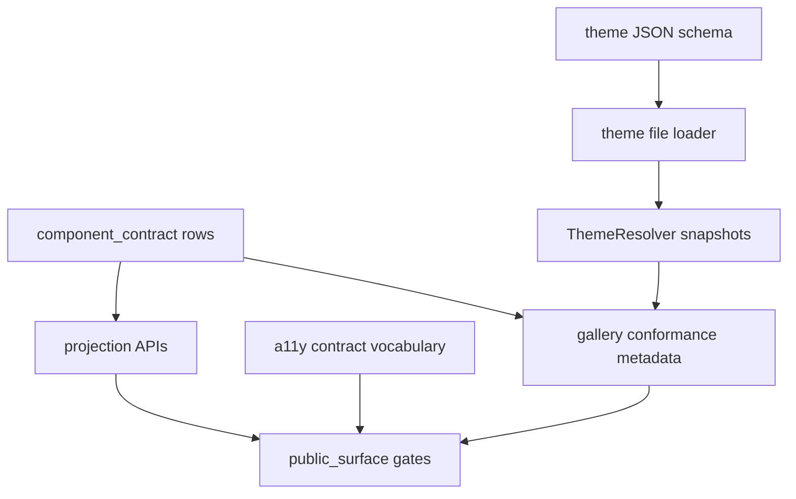

# UI Contract Registry, Accessibility, And Theme Productization - Plan

## Goal Capsule

| Field | Decision |
|---|---|
| Objective | Productize the next UI framework boundary by splitting the component contract registry, adding real accessibility contract gates, and adding a theme JSON schema plus file-loader facade. |
| Authority | ADR 0008 keeps the current UI crates as the product boundary; the 2026-07-01 family-boundary plan completed the complex-family module split; the user explicitly chose registry, a11y, and theme work while rejecting broad 1k+ component splitting and headless crate extraction for this phase. |
| Execution profile | Fearless refactor is allowed for registry internals, tests, and docs. Public component behavior stays stable. Break private helpers when they only preserve old registry shape. |
| Contract posture | `open-gpui-ui-components` remains the product crate. Renderer-neutral state stays GPUI-runtime-free, but this plan does not create `open-gpui-ui-headless`. |
| Stop conditions | Stop and re-plan only if implementation requires a new crate, changes visible component behavior, removes an official public component, or makes theme/a11y contracts depend on GPUI render/runtime types. |

The previous series moved `Command`, `Menu`, `ContextMenu`, `Tree`, and Table behavior snapshots
into clearer family boundaries. The next bottleneck is not broad file-size cleanup. It is the
product contract layer that every component now depends on: the registry module is too large,
accessibility assertions are still uneven across components, and theme definitions cannot yet be
loaded or validated from a portable file contract.

---

## Product Contract

### Summary

Open GPUI should make its component library inspectable and configurable as a product surface.
The component registry should be split by responsibility, accessibility should have explicit
contract tests instead of mostly visual coverage, and theme definitions should have a schema-backed
loading boundary.

This plan deliberately does **not** split every remaining 1k+ component file and does **not** create
`open-gpui-ui-headless`. Those are not current product priorities.

### Problem Frame

`crates/ui_components/src/component_contract/mod.rs` is now the canonical product registry, but it
has grown into one large owner for entry data, projection functions, source mappings, public API
inventory, docs tokens, and validation helpers. That makes future component work review-heavy and
increases drift risk between rows and projections.

Accessibility vocabulary exists in `open_gpui_ui_core` and GPUI adapter helpers, but the component
library still lacks a clear "a11y contract gate" that proves official components expose expected
roles, labels, state, and actions at the renderer-neutral and adapter-mapping levels.

The theme resolver supports runtime snapshots and registered theme definitions, but product users
still need to construct `ThemeDefinition` in code. A JSON schema and loader facade are the next
step before theme packs can be documented or exchanged safely.

### Requirements

**Registry Boundary**

- R1. Split `component_contract` into responsibility modules: entry types, canonical rows,
  projections, source mapping, public API inventory, docs/gallery status, and validation helpers.
- R2. Keep existing public projection functions available unless a surface is explicitly accidental.
  Compatibility functions must delegate to the new owners rather than preserve duplicate maps.
- R3. Registry rows must remain renderer-neutral and must not store `Window`, `App`, `Context`,
  `RenderOnce`, focus handles, scroll handles, callbacks, or GPUI elements.
- R4. Public-surface tests must prove official components, state contracts, adapter-only helpers,
  internal anatomy, removed targets, source mappings, docs tokens, and gallery status still agree.

**Accessibility Contract Gates**

- R5. Define a component a11y contract vocabulary that can express role, label source, description
  source, selected/checked/expanded/disabled state, value metadata, orientation, and supported
  actions without requiring a live platform accessibility backend.
- R6. Add focused tests for official representative families: primitives, form controls, overlays,
  choice/listbox surfaces, Table, Tree, VirtualizedList, Splitter, and icon-only controls.
- R7. Tests must distinguish renderer-neutral contract coverage from GPUI adapter mapping coverage.
  Unsupported GPUI platform details should be documented, not faked.
- R8. The gallery conformance surface should expose enough metadata to keep sample selectors,
  rendered labels, and accessibility intent aligned.

**Theme Schema And Loader**

- R9. Add a stable JSON schema for `ThemeDefinition` values covering identity, semantic palettes,
  component tokens, dark mode, high contrast, disabled, hover, pressed, selected, invalid, and focus
  ring states where the current resolver supports them.
- R10. Add a file-loader facade that validates identity, version, duplicate token names, missing
  required fields, and unsupported schema versions before registering a theme snapshot.
- R11. Loader errors must be structured enough for tests and applications to display actionable
  messages without parsing strings.
- R12. Existing code-built `ThemeDefinition` registration must continue to work.

### Acceptance Examples

- AE1. Moving a registry row or projection requires changing one owning module; public-surface tests
  fail if an old parallel map diverges from canonical rows.
- AE2. A component that claims an icon-only button sample without an accessible label fails the
  a11y contract gate.
- AE3. A Tree or Table sample that exposes state metadata but no matching roles/state contract fails
  the focused a11y gate.
- AE4. Loading a valid theme JSON file produces the same resolver snapshot as constructing the
  matching `ThemeDefinition` in code.
- AE5. Loading a theme JSON file with an unknown schema version, missing identity, duplicate token,
  or invalid state token returns a typed loader error.
- AE6. `docs/ui/component-contract.md` and `docs/verification.md` make it clear that broad 1k+
  component splitting and `open-gpui-ui-headless` extraction are not part of this phase.

### Scope Boundaries

In scope:

- Splitting `component_contract/mod.rs` into registry submodules.
- Tightening public-surface tests around registry ownership.
- Adding accessibility contract tests and metadata gates where current APIs can support them.
- Adding theme JSON schema and file-loader facade.
- Updating docs and verification notes for the new product boundary.

Out of scope:

- Splitting every remaining 1k+ component file.
- Creating `open-gpui-ui-headless` or any other new crate.
- Rewriting visible component rendering or interaction semantics.
- Adding new component families.
- Adding screenshot or pixel-regression infrastructure.
- Implementing full platform screen-reader automation.

---

## Planning Contract

### Key Technical Decisions

- KTD1. Split by product contract responsibility, not file size. `component_contract` is the next
  split because it is a shared fact source; large component files are not a priority by size alone.
- KTD2. Keep a11y contract tests semantic. Tests should assert roles, labels, states, and supported
  actions using available Open GPUI vocabulary and adapter mappings, without pretending to validate
  every platform accessibility backend.
- KTD3. Make theme loading schema-first. A portable theme file should fail before registration if
  its identity, version, or token shape is invalid.
- KTD4. Keep current-crate productization explicit. Headless extraction references remain historical
  boundary evidence, not an active implementation target.

### High-Level Design



### Work Breakdown

| Unit | Work | Files | Verification |
|---|---|---|---|
| U1 | Split component registry modules | `crates/ui_components/src/component_contract/*` | `cargo nextest run -p open-gpui-ui-components --test public_surface --no-fail-fast` |
| U2 | Tighten registry projection/source tests | `crates/ui_components/tests/public_surface/*` | public-surface focused gates |
| U3 | Add a11y contract vocabulary and tests | `crates/ui_components/src/a11y.rs`, `crates/ui_components/tests/a11y.rs` | `cargo nextest run -p open-gpui-ui-components a11y --no-fail-fast` |
| U4 | Wire gallery conformance metadata to a11y claims | `examples/ui-foundation-gallery/tests/foundation_gallery.rs` | gallery metadata and focused smoke gates |
| U5 | Add theme JSON schema and loader facade | `crates/ui_components/src/theme/*` | `cargo nextest run -p open-gpui-ui-components theme --no-fail-fast` |
| U6 | Update docs and verification notes | `docs/ui/component-contract.md`, `docs/verification.md` | `git diff --check` |

### Success Metrics

| Metric | Current | Target | Measurement |
|---|---|---|---|
| Registry owner size | `component_contract/mod.rs` is the dominant registry owner | Shared registry facts live in named submodules | line count and source mapping tests |
| Registry drift | Rows and projections can still grow in one large module | Projection tests fail on row/projection mismatch | public-surface tests |
| A11y contract coverage | Mixed across components and gallery docs | Representative official families have focused a11y contract gates | `cargo nextest run -p open-gpui-ui-components a11y --no-fail-fast` |
| Theme portability | Code-only `ThemeDefinition` construction | Valid JSON theme files can be schema-checked and loaded | theme loader tests |
| Roadmap clarity | Headless and broad file splits still appear as tempting follow-ups | Docs mark them as out of scope for this phase | docs review and `rg` checks |

### Alternatives Considered

#### Option A: Split every remaining 1k+ component file

**Pros**: Reduces local file size and may improve navigation.
**Cons**: Large blast radius with limited product payoff; risks churn in components that do not
currently block registry, a11y, or theme work.
**Decision**: Rejected for this phase.

#### Option B: Create `open-gpui-ui-headless`

**Pros**: Gives renderer-neutral behavior an explicit package boundary.
**Cons**: Freezes a package contract before registry, a11y gates, and theme loading are productized.
**Decision**: Rejected for this phase.

#### Option C: Productize registry, a11y, and theme first

**Pros**: Improves shared contract quality with contained scope and clear verification gates.
**Cons**: Leaves some large component files untouched.
**Decision**: Chosen.

### Risks And Mitigations

| Risk | Impact | Mitigation |
|---|---|---|
| Registry split creates duplicate sources of truth | Public-surface drift | Move projections to delegates and add tests that compare rows to outputs |
| A11y tests overpromise platform behavior | False confidence | Separate neutral contract tests from GPUI adapter mapping tests and document unsupported platform gaps |
| Theme schema becomes too rigid too early | Future theme evolution becomes painful | Include schema versioning and structured unsupported-version errors |
| Loader accepts invalid themes silently | Hard-to-debug visual regressions | Validate identity, duplicate tokens, required states, and unknown schema versions before registration |
| Scope expands back into file-size cleanup | Long refactor with weak product value | Treat broad 1k+ component splits as explicitly out of scope unless a concrete contract gap requires one |

### Verification Matrix

```powershell
cargo fmt -p open-gpui-ui-components -p open-gpui-ui-foundation-gallery --check
cargo check -p open-gpui-ui-components --tests
cargo check -p open-gpui-ui-foundation-gallery --tests
cargo nextest run -p open-gpui-ui-components --test public_surface --no-fail-fast
cargo nextest run -p open-gpui-ui-components a11y --no-fail-fast
cargo nextest run -p open-gpui-ui-components theme --no-fail-fast
cargo nextest run -p open-gpui-ui-foundation-gallery components_page_samples_expose_component_metadata components_page_conformance_gates_reference_core_and_gallery_contracts --no-fail-fast
git diff --check
```

Run full package gates when registry, theme, or gallery changes are broad:

```powershell
cargo nextest run -p open-gpui-ui-components --no-fail-fast
cargo nextest run -p open-gpui-ui-foundation-gallery --no-fail-fast
```

### Documentation Updates

- `docs/ui/component-contract.md` must name this as the active next UI productization slice.
- `docs/verification.md` must list focused gates for registry, a11y, and theme work.
- ADR 0006 and ADR 0008 should continue to say headless extraction is not active roadmap work.
- The component-depth roadmap should state that broad component file splitting is not a current
  priority after the completed `Command`, `Menu`, `ContextMenu`, `Tree`, and Table behavior splits.
