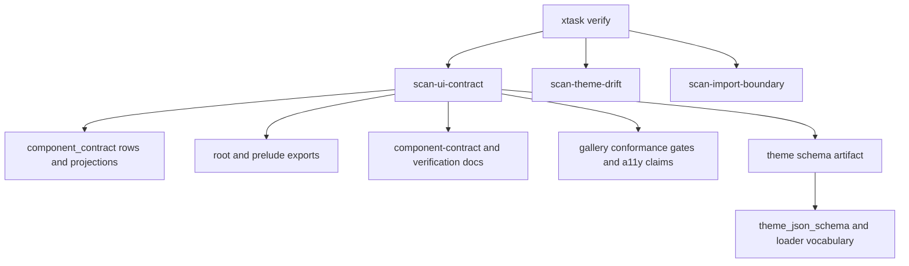

# UI Contract Tooling And Productization Audit - Plan

## Goal Capsule

| Field | Decision |
|---|---|
| Objective | Turn the UI component contract registry, a11y claims, gallery conformance metadata, and theme JSON schema into a reusable `xtask` audit surface instead of keeping them only as scattered tests and prose. |
| Authority | Plan 005 shipped registry ownership, a11y contracts, and theme loading; ADR 0008 keeps current-crate productization as the active roadmap; `xtask verify` is already the workspace automation entry point. |
| Execution profile | Fearless refactor is allowed inside `xtask` and test-support helpers. Public component behavior stays stable. Delete duplicated scanner logic once a shared audit path replaces it. |
| Contract posture | `open-gpui-ui-components` remains the product crate. The audit tooling reports contract drift; it does not introduce a headless crate or a second component registry. |
| Stop conditions | Stop and re-plan if the audit requires linking `xtask` to GPUI runtime APIs, changes rendered component behavior, or turns generated reports into a new public API promise. |

The previous slice made the UI product contract explicit but still leaves much of the enforcement experience test-shaped. The next useful slice is to make contract drift visible through one developer-facing command that can run locally, in CI, and during future component work.

---

## Product Contract

### Summary

Open GPUI should expose a first-class UI contract audit command. The command should summarize whether component registry rows, public exports, docs tokens, gallery conformance claims, accessibility metadata, and theme schema artifacts are aligned.

### Problem Frame

The UI product surface is now split across durable owners: `component_contract` rows and projections, public-surface tests, gallery conformance constants, a11y tests, theme loader/schema code, and documentation. This is correct architecturally, but the enforcement surface is still fragmented. A developer adding a component or theme token must know which focused tests to run and which docs to inspect.

`xtask` already owns workspace automation and drift scans such as `scan-theme-drift` and `scan-import-boundary`. Extending that entry point is cheaper and more coherent than creating a new audit binary or preserving more bespoke test-only helpers.

### Requirements

**Audit command**

- R1. Add a reusable UI contract audit command under `xtask` that checks the component registry, public exports, docs tokens, source homes, gallery status, a11y claims, and theme schema artifacts.
- R2. Keep `cargo run -p xtask -- verify` as the top-level local gate and have it run the new audit after the focused UI contract checks are available.
- R3. Keep diagnostics actionable: each failure should name the owning file, the drifted token or component, and the expected fix direction.

**Tool architecture**

- R4. Split `xtask/src/main.rs` into command and scanner modules when adding UI audit logic, so import-boundary, theme-drift, renderer-smoke, and UI-contract checks do not grow in one file.
- R5. Prefer structured parsing or existing typed facts over broad string search where practical; when text scanning is necessary, keep it localized and covered by `xtask` unit tests.
- R6. Do not make `xtask` depend on GPUI runtime handles, windows, app contexts, render elements, or native adapter setup.

**Theme schema artifact**

- R7. Add a committed or reproducible theme JSON schema artifact for the current `THEME_JSON_SCHEMA_VERSION`.
- R8. Add a gate that fails when `theme_json_schema()` drifts from the artifact or when docs reference schema fields unsupported by the loader.

**Gallery and a11y coverage**

- R9. Report whether `COMPONENT_A11Y_CLAIMS` covers the representative components required by the current a11y contract plan.
- R10. Report whether conformance gate evidence names the registry, a11y, theme, and focused test owners that docs claim are product gates.

**Documentation and memory**

- R11. Update `docs/verification.md` and `docs/ui/component-contract.md` so future component work starts from the audit command and only drops to focused tests for investigation.
- R12. Update engineering memory so plan 005 is recorded as complete and this audit tooling plan is the active next action.

### Acceptance Examples

- AE1. A component added to `COMPONENT_CONTRACT_REGISTRY` with `default_export: true` but missing from root or prelude exports fails the audit with the component name and export owner.
- AE2. A registry row with `docs_token: Some(...)` that is absent from the required docs fails the audit with the token and expected docs class.
- AE3. A new `ThemeJsonColorState` or semantic token added to the loader without regenerating the schema artifact fails the schema drift gate.
- AE4. Removing `IconButton` or `Splitter handle` from `COMPONENT_A11Y_CLAIMS` fails the audit before gallery smoke tests are needed.
- AE5. `cargo run -p xtask -- verify` runs the UI contract audit after existing import and theme drift scans remain available as focused commands.

### Scope Boundaries

In scope:

- Refactor `xtask` internals to support multiple scanner modules.
- Add a UI contract audit command and tests.
- Add or validate a theme schema artifact.
- Update docs and engineering memory for the new audit entry point.

Out of scope:

- Creating `open-gpui-ui-headless`.
- Splitting large component files by size alone.
- Rewriting component rendering, interaction behavior, or GPUI adapter runtime behavior.
- Replacing existing focused public-surface, a11y, theme, or gallery tests; the audit should complement and aggregate them.

---

## Planning Contract

### Key Technical Decisions

- KTD1. Extend `xtask` instead of creating a new tool. `xtask verify` is already documented as the local gate, and `scan-theme-drift` proves scanner-style commands fit the repo.
- KTD2. Keep typed tests as the source of deep behavioral proof. The audit should catch drift early and name owners, while `cargo nextest` remains the authoritative behavior gate.
- KTD3. Split `xtask` before adding more scanners. The current single file is acceptable for import/theme scans but will become a maintenance bottleneck once UI contract checks arrive.
- KTD4. Generate or validate the theme schema through `open-gpui-ui-components` rather than duplicating schema vocabulary in `xtask`.
- KTD5. Treat a11y and gallery checks as representative contract coverage. The audit should enforce the documented representative claim set, not pretend to prove full platform screen-reader behavior.

### High-Level Technical Design

The command topology stays shallow: `main.rs` parses commands, modules own scanners, and shared diagnostics format failures consistently. The audit reads existing contract facts and source artifacts; it does not create a runtime GPUI app.

### Assumptions

- The plan can add a small `xtask` library/module layout without changing the workspace package name.
- If direct schema generation from `xtask` would pull in too much GPUI runtime surface, implementation may add a small `open-gpui-ui-components` example or test-only helper and have `xtask` invoke it as a subprocess.
- Existing focused tests stay in place while scanners are introduced; deletion is limited to duplicated helper logic that is fully replaced and verified.

---

## Implementation Units

### U1. Split xtask command ownership

- **Goal:** Keep `xtask` maintainable before adding UI contract scanners.
- **Requirements:** R2, R4, R5.
- **Dependencies:** None.
- **Files:** `xtask/src/main.rs`, `xtask/src/lib.rs`, `xtask/src/commands.rs`, `xtask/src/import_boundary.rs`, `xtask/src/theme_drift.rs`, `xtask/src/fs_scan.rs`, `xtask/Cargo.toml`.
- **Approach:** Move existing command implementations into named modules while preserving command names and output. Keep `main.rs` focused on argument parsing and exit-code routing. Preserve current scan behavior before adding new UI checks.
- **Execution note:** Characterization-first: keep existing `xtask` unit tests green before moving scanner logic.
- **Patterns to follow:** Existing `scan_theme_drift`, `scan_import_boundary`, `tracked_text_files`, and `run` helpers in `xtask/src/main.rs`.
- **Test scenarios:** Existing theme-drift and import-boundary unit tests still pass after module moves. Running an unknown command still prints usage and exits failure. `verify` still runs formatting, workspace checks, UI component tests, theme drift, and import boundary.
- **Verification:** `cargo test -p xtask` passes, and `cargo run -p xtask -- scan-theme-drift` / `cargo run -p xtask -- scan-import-boundary` preserve current pass/fail behavior.

### U2. Add scan-ui-contract registry and export audit

- **Goal:** Add the first UI contract audit command for registry, source-home, docs-token, and export drift.
- **Requirements:** R1, R2, R3, R5, AE1, AE2.
- **Dependencies:** U1.
- **Files:** `xtask/src/ui_contract.rs`, `xtask/src/commands.rs`, `xtask/src/main.rs`, `crates/ui_components/tests/public_surface/manifest.rs`, `crates/ui_components/tests/public_surface/inventory.rs`, `crates/ui_components/tests/support/public_surface/mod.rs`, `docs/verification.md`.
- **Approach:** Reuse the assertions already proven in public-surface tests as audit requirements: registry rows are unique, default-export rows match root/prelude tokens, source homes exist, docs tokens appear in their owning docs, and removed primitive targets do not reappear. Keep detailed behavior assertions in tests; make the audit fail fast with actionable file/token diagnostics.
- **Patterns to follow:** `surface_manifest_tracks_exports_gallery_and_docs_contracts`, `component_contract_registry_covers_inventory_and_adjacent_surfaces`, `component_contract_projection_functions_delegate_to_registry_rows`, `primitive_deletion_target_inventory_blocks_removed_shallow_reexports`.
- **Test scenarios:** A fixture with a default-export contract missing from prelude reports the missing export. A fixture with a docs token absent from both docs reports the token and docs class. A fixture with a missing source home reports the registry name and path. The real repository passes the audit.
- **Verification:** `cargo test -p xtask ui_contract` passes and `cargo run -p xtask -- scan-ui-contract` passes on the current tree.

### U3. Add gallery and a11y claim audit coverage

- **Goal:** Make representative a11y and gallery conformance coverage visible outside focused tests.
- **Requirements:** R1, R3, R9, R10, AE4.
- **Dependencies:** U1, U2.
- **Files:** `xtask/src/ui_contract.rs`, `examples/ui-foundation-gallery/src/pages/components/conformance.rs`, `examples/ui-foundation-gallery/tests/foundation_gallery.rs`, `crates/ui_components/tests/a11y.rs`, `docs/verification.md`.
- **Approach:** Add audit checks that the documented representative a11y components are present in `COMPONENT_A11Y_CLAIMS`, that each claim has a gallery selector prefix, name source, expected value/orientation metadata when required, and actions for interactive roles. Check conformance gate evidence for the registry, a11y, theme, and gallery test anchors that docs identify as product gates.
- **Patterns to follow:** `components_page_conformance_gates_reference_core_and_gallery_contracts`, `representative_component_a11y_contracts_are_valid`, `COMPONENT_A11Y_CLAIMS`.
- **Test scenarios:** Removing `IconButton` from a fixture claim set reports the missing representative claim. A `Slider` claim without `SetValue` reports the missing action. A conformance gate fixture without `ComponentA11yContract` evidence reports the missing evidence token. The real gallery conformance file passes the audit.
- **Verification:** `cargo test -p xtask ui_contract` covers a11y/gallery fixtures, and the existing gallery focused tests still pass.

### U4. Add theme schema artifact and drift gate

- **Goal:** Make the portable theme schema reproducible and reviewable.
- **Requirements:** R7, R8, AE3.
- **Dependencies:** U1.
- **Files:** `docs/schemas/open-gpui-theme-v1.schema.json`, `crates/ui_components/src/theme/schema.rs`, `crates/ui_components/tests/theme.rs`, `xtask/src/theme_schema.rs`, `xtask/src/commands.rs`, `xtask/Cargo.toml`, `docs/ui/component-contract.md`.
- **Approach:** Add a schema artifact for `THEME_JSON_SCHEMA_VERSION` 1 and a gate that compares it with `theme_json_schema()`. If direct linking from `xtask` makes the tool too heavy, add a small schema export path under `open-gpui-ui-components` and let `xtask` delegate to that path.
- **Patterns to follow:** `theme_json_schema_exposes_portable_theme_contract`, `theme_json_loader_reports_structured_errors_before_registration`, `scan-theme-drift`.
- **Test scenarios:** The committed schema contains `schema_version`, `fallback_mode`, semantic token names, current color states, and high-contrast mode. A fixture schema with a missing current token/state reports drift. A loader enum change without artifact refresh fails the drift gate.
- **Verification:** `cargo nextest run -p open-gpui-ui-components theme --no-fail-fast` and `cargo run -p xtask -- scan-ui-contract` both pass.

### U5. Wire the audit into verify and documentation

- **Goal:** Make the audit the default developer entry point without hiding focused tests.
- **Requirements:** R2, R3, R11, R12, AE5.
- **Dependencies:** U2, U3, U4.
- **Files:** `xtask/src/commands.rs`, `xtask/src/main.rs`, `docs/verification.md`, `docs/ui/component-contract.md`, `docs/knowledge/engineering/current-state.md`.
- **Approach:** Add `scan-ui-contract` to usage and to `verify`. Update docs so new component/theme/a11y work starts with the audit command and then runs focused nextest gates for deeper behavior proof. Keep `scan-theme-drift` as a focused command instead of burying its semantics.
- **Patterns to follow:** Existing `xtask verify` documentation in `docs/verification.md` and current component contract sections for registry, theme, and a11y.
- **Test scenarios:** Usage output lists `scan-ui-contract`. `verify` calls the audit in the intended sequence. Docs mention `scan-ui-contract`, schema artifact ownership, and focused fallback gates. Engineering memory names this plan as the active slice until execution completes.
- **Verification:** `cargo test -p xtask`, `cargo run -p xtask -- scan-ui-contract`, `git diff --check`, and focused docs/public-surface nextest gates pass.

---

## Verification Contract

| Gate | Applies To | Done Signal |
|---|---|---|
| `cargo fmt --all --check` | All Rust edits | Formatting is stable across `xtask`, UI component tests, and schema export code. |
| `cargo test -p xtask` | U1-U5 | Scanner module tests and command-routing tests pass. |
| `cargo run -p xtask -- scan-ui-contract` | U2-U5 | The new audit passes on the current repository. |
| `cargo run -p xtask -- scan-theme-drift` | U1, U4-U5 | Existing theme drift behavior survives modularization and schema artifact work. |
| `cargo run -p xtask -- scan-import-boundary` | U1 | Existing import-boundary scan survives modularization. |
| `cargo nextest run -p open-gpui-ui-components --test public_surface --no-fail-fast` | U2-U5 | Typed public-surface gates remain authoritative. |
| `cargo nextest run -p open-gpui-ui-components a11y --no-fail-fast` | U3 | A11y contract tests stay green. |
| `cargo nextest run -p open-gpui-ui-components theme --no-fail-fast` | U4 | Theme loader/schema tests stay green. |
| `cargo nextest run -p open-gpui-ui-foundation-gallery components_page_samples_expose_component_metadata components_page_conformance_gates_reference_core_and_gallery_contracts --no-fail-fast` | U3, U5 | Gallery metadata still aligns with conformance claims. |
| `git diff --check` | U1-U5 | Docs and generated schema artifacts have no whitespace errors. |

---

## Definition of Done

- `xtask` has named modules for command routing, shared file scanning, import boundary, theme drift, theme schema, and UI contract auditing.
- `cargo run -p xtask -- scan-ui-contract` exists, reports actionable failures, and passes on the current tree.
- `cargo run -p xtask -- verify` includes the new audit without removing existing focused gates.
- Theme schema version 1 has a reproducible artifact or reproducible export path with drift coverage.
- Public-surface, a11y, theme, gallery, and docs verification still pass.
- `docs/verification.md`, `docs/ui/component-contract.md`, and engineering memory describe the audit as the next productization entry point.
- Abandoned scanner prototypes, duplicated helper logic, and stale documentation about plan 005 being next work are removed.

---

## Sources & Research

- `xtask/src/main.rs` is the current workspace automation entry point and already owns `verify`, `scan-theme-drift`, and `scan-import-boundary`.
- `crates/ui_components/tests/public_surface/manifest.rs` and `crates/ui_components/tests/public_surface/inventory.rs` contain the registry/export/docs/source checks that should shape the audit.
- `examples/ui-foundation-gallery/src/pages/components/conformance.rs` owns `COMPONENT_CONFORMANCE_GATES` and `COMPONENT_A11Y_CLAIMS`.
- `crates/ui_components/src/theme/schema.rs` owns `THEME_JSON_SCHEMA_VERSION`, `theme_json_schema`, and loader vocabulary.
- `docs/verification.md` already documents focused UI contract gates and should become the user-facing audit guide.
