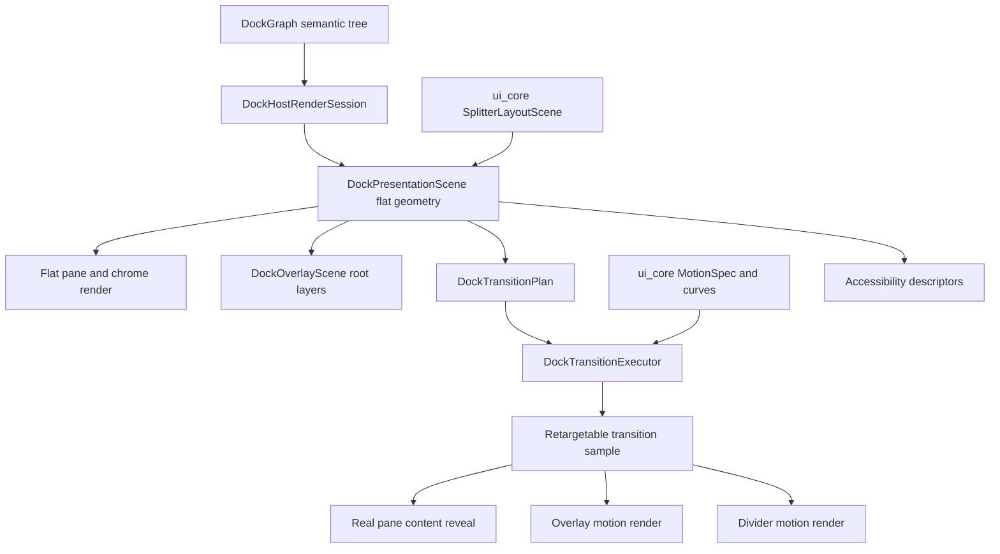
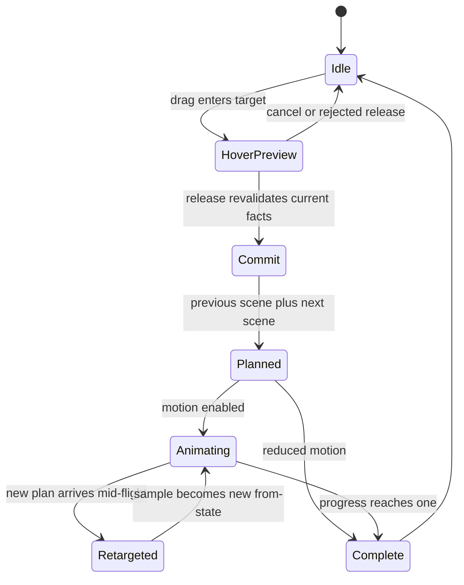
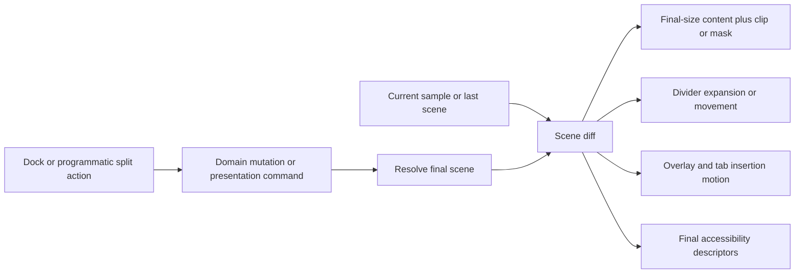

# Docking Flat Motion Runtime Framework - Plan

## Goal Capsule

| Field | Value |
| --- | --- |
| Objective | Turn the existing docking presentation, overlay, split, transition, zoom, and accessibility descriptors into a runtime-quality flat rendering and motion framework. |
| Authority | `DockGraph` remains the semantic mutation authority, current drop facts remain release authority, and `DockPresentationScene` becomes the rendered geometry authority for panes, dividers, overlays, transition samples, and accessibility bounds. |
| Scope posture | Fearless private refactor: break crate-internal APIs, delete placeholder transition paths and duplicate geometry helpers, and keep public behavior stable unless a runtime motion or zoom/focus API must be additive. |
| Execution profile | Characterization-first for animation/preview gaps, then flat-render migration, then transition execution, then cleanup and docs. |
| Stop condition | Docking pane content, overlay previews, split insertion, zoom/unzoom, focus feedback, divider motion, reduced motion, and accessibility descriptors are all driven by the same flat scene and verified by semantic tests plus focused native dogfood. |

---

## Product Contract

### Summary

The previous docking work built the right semantic foundation: shared split primitives exist in `ui_core`, docking has `DockPresentationScene`, `DockOverlayScene`, `DockTransitionPlan`, `DockTransitionExecutor`, zoom/focus descriptors, divider hit maps, and accessibility scenes, and recent ImGui-aligned guide behavior is locked by tests.
The remaining gap is runtime quality.
Transitions currently sample useful descriptors but still render placeholder pane clips, reset timelines instead of retargeting from the current visual sample, and leave normal pane rendering partly tied to recursive flex composition.

This plan completes the capability alignment that the SuperSplit notes point toward: tree semantics stay as a tree, presentation rasterizes to a flat grid, overlay feedback floats above the grid, transition execution animates the real rendered content, and the motion primitive is shared enough for both docking and programmatic split-component changes.
The goal is not pixel parity with ImGui, BonSplit, SuperSplit, or macOS.
The goal is capability parity: stable target affordances, tab insertion preview, real pane reveal, interruptible layout motion, zoom egress, focus continuity, reduced-motion semantics, and accessibility bounds that match the final scene.

### Problem Frame

Current docking UI/UX is much stronger than the original state, but it still has two classes of risk.
First, descriptors and runtime rendering are not yet the same thing.
`DockTransitionExecutor` can sample pane clips and dividers, but `render_transition_pane_clip` paints a translucent rectangle instead of rendering the pane content at final size behind a clip or mask.
That is why the user can see artifacts such as generic white rectangles or dark blocks that do not feel like a real tab/pane preview.

Second, the motion system is not yet an animation framework boundary.
`MotionSpec` has useful duration and easing tokens, but it lacks a curve vocabulary strong enough for layout motion review, retargeting semantics, and a clear reduced-motion model beyond immediate completion.
`DockTransitionExecutor::execute` starts each scheduled plan at `Instant::now()`, which is deterministic but not interruptible.
That makes repeated hover changes, second dock attempts, and mid-animation operations more likely to jump, jitter, or lose continuity.

The clean fix is a deeper refactor, not another local patch.
The normal render path should be able to render from a flat presentation scene, the transition layer should reuse the same content renderers with final-size layout and clip/mask transforms, and the executor should retarget from current sampled geometry.
Shared split primitives should also expose programmatic motion intent so `ui_components::Splitter` does not stay immediate-only for insert/collapse changes while docking grows a private solution.

### Requirements

**Flat render and scene authority**

- R1. Docking must render pane, tab, divider, floating, overlay, and accessibility geometry from `DockPresentationScene` wherever those concepts overlap.
- R2. `DockGraph` must remain the semantic authority for layout mutation, tabs, floating containers, central regions, and persistence.
- R3. Current drop facts must remain release authority; presentation and transition scenes may explain a target but must not authorize a stale commit.
- R4. The flat render path must preserve existing root, nested, floating, empty-central, routed, and zoomed scenes while deleting duplicate geometry paths after replacement tests pass.

**Runtime transition quality**

- R5. Transition execution must animate real pane content at final layout size with reveal clipping or masking instead of painting placeholder rectangles.
- R6. Split insertion must place the incoming pane at final size first, reveal it through a slide or mask, and animate the divider separately so no resize jitter is visible.
- R7. Transition execution must support retargeting from the current sampled visual state when a new plan arrives mid-flight.
- R8. Motion curves must use shared tokens that are appropriate for UI layout motion, stay under the existing sub-300ms budget, and support stronger ease-out/ease-in-out curves than the current cubic-only sampler.
- R9. Reduced motion must preserve final scene, overlay, focus, zoom, and accessibility semantics while replacing large spatial movement with immediate or low-motion feedback.

**Overlay, preview, and drag continuity**

- R10. Drop preview overlays must stay root-level and scene-driven for local, routed, rejected, root-edge, nested-edge, center-tab, and multi-tab payload states.
- R11. Hovering non-center edge regions must keep guide affordances and edge highlights visible, including inactive inner guides under a root-edge active layer.
- R12. Center docking must preview tab insertion with target slot/caret and payload tab shape rather than a generic body rectangle.
- R13. Routed cross-window previews must use the same target overlay and transition descriptor semantics as local previews while keeping source route markers separate.

**Shared split and zoom/focus capability**

- R14. `ui_core` split/motion primitives must represent programmatic split insert, remove, collapse, expand, and resize transition intent without taking ownership of domain semantic trees.
- R15. `ui_components::Splitter` must keep pointer drag immediate but use shared motion descriptors for programmatic layout changes where the component can animate safely.
- R16. Docking zoom/unzoom must remain presentation state, use touching-edge-preferred egress, and render through the same real-content transition path as split insertion.
- R17. Focus presentation must complement GPUI focus, remain immediate for high-frequency keyboard navigation where appropriate, and still expose semantic focus-ring descriptors for proof and future low-frequency animation.

**Verification, docs, and cleanup**

- R18. Tests must lock descriptor, transition sample, render selector, root-edge guide, retargeting, reduced-motion, zoom/focus, splitter programmatic motion, and accessibility behavior.
- R19. Native dogfood must expose the runtime capabilities without requiring Jellyflow-related examples or dependencies to compile.
- R20. Obsolete placeholder pane-clip rendering, render-local geometry inference, duplicate splitter math, and compatibility shims must be deleted once covered.
- R21. ADR or engineering memory must be updated if implementation changes the accepted boundary from ADR 0011 or ADR 0012.

### Acceptance Examples

- AE1. Given a new split insertion, when the transition renders at 50% progress, then the incoming pane content is laid out at final size and only the visible reveal region is clipped; no generic white pane-clip rectangle is rendered.
- AE2. Given an active transition, when a second dock operation starts before completion, then the new transition starts from the current sampled geometry instead of snapping back to the previous scene or restarting from zero.
- AE3. Given a tab dragged over a non-center edge of the main window's upper-right pane, when the pointer is in that edge zone, then side guides and edge highlight remain visible and release targets that pane edge rather than silently doing nothing.
- AE4. Given center hover over a tab stack with a multi-tab payload, when the preview renders, then the target tab bar shows an insertion slot or caret and the payload tabs keep their source order.
- AE5. Given a routed cross-window hover, when the target window renders feedback, then target overlay layers match the local-hover layer contract and the source window renders only route-marker feedback.
- AE6. Given programmatic splitter collapse or expand, when motion is enabled, then the component can animate toward the final `SplitterLayoutScene`; given pointer drag, the same splitter stays immediate and tracks the pointer.
- AE7. Given zoom on a pane, when unzoom is requested, then `DockGraph` is unchanged, hidden panes return from deterministic egress edges, and reduced motion reaches the same final scene immediately.
- AE8. Given GPUI accessibility collection during or after a transition, when descriptors are inspected, then bounds and roles match the final semantic scene rather than a transient placeholder rectangle.

### Scope Boundaries

#### In Scope

- Docking flat render migration from descriptor proof toward presentation-scene render authority.
- Real-content transition rendering for panes, dividers, overlays, tab insertion, focus, and zoom.
- Interruptible transition retargeting from current sampled geometry.
- Shared motion curve vocabulary and reduced-motion policy in `open_gpui_ui_core`.
- Programmatic split motion descriptors for `ui_components::Splitter`.
- Overlay preview stability for local, routed, nested, root-edge, center-tab, and rejected targets.
- Focused semantic tests, narrow render-selector tests, native dogfood proof, docs, memory, and deletion cleanup.

#### Deferred to Follow-Up Work

- Pixel-perfect styling parity with ImGui, BonSplit, SuperSplit, or macOS.
- A public animation framework for every GPUI element.
- Native compositor or CoreAnimation-specific backend integration.
- Full platform VoiceOver/UIAutomation feature coverage when GPUI lacks a mapping API.
- Broad redesign of docking persistence or public dock layout serialization.

#### Outside This Plan

- Replacing `DockGraph` with a persistent flat grid.
- Making presentation or transition scenes commit tokens.
- Re-enabling Jellyflow examples as normal workspace build targets.
- Copying SwiftUI/AppKit/UIKit/CoreAnimation architecture into Open GPUI.

---

## Planning Contract

### Current Findings

| Finding | Evidence | Planning implication |
| --- | --- | --- |
| The descriptor foundation already exists. | `crates/ui_core/src/split.rs`, `crates/ui_core/src/motion.rs`, `crates/gpui_docking/src/presentation_scene.rs`, `crates/gpui_docking/src/overlay_scene.rs`, `crates/gpui_docking/src/transition_geometry.rs`, `crates/gpui_docking/src/transition_executor.rs`, `crates/gpui_docking/src/zoom_state.rs`, and accessibility/divider tests are present. | The new plan should not repeat descriptor extraction; it should convert descriptors into runtime-quality rendering and motion. |
| Transition pane clips are still visual placeholders. | `crates/gpui_docking/src/render.rs` renders `DockPaneClipSample` as a translucent `div` in `render_transition_pane_clip`. | Real-content reveal is the highest-value animation fix. |
| Transition execution starts new plans from a fresh clock. | `DockTransitionExecutor::execute` stores a new plan with `started_at: Some(Instant::now())` for scheduled transitions. | Retargeting must be designed explicitly rather than layered on top of fresh-plan restarts. |
| Motion vocabulary is useful but too small for review-grade layout motion. | `MotionEasing` currently has `Linear`, `EaseOut`, and `EaseInOut`; easing sampling is hand-coded polynomial math. | Add stronger curve tokens and a single sampler policy that docking and split components can share. |
| Normal docking render still has recursive render modules. | `render.rs`, `render_split.rs`, and `render_tabs.rs` coexist with `DockPresentationScene`. | Flat scene should become render authority in stages so transition rendering can reuse real content. |
| Recent root-edge guide work fixed one symptom. | Commit `4b238ac` keeps inner guides visible during root-edge hover and adds focused tests. | The plan should preserve that behavior as part of the overlay contract and look for similar active-layer/passive-layer gaps. |
| ADRs already accept the semantic boundaries. | ADR 0010, 0011, and 0012 keep `DockGraph` semantic, `ui_core` generic, docking domain-specific, and runtime descriptors capability-gated. | A new ADR is only needed if implementation changes these boundaries, not just because this plan exists. |

### Key Technical Decisions

- KTD1. Make flat presentation scenes render-real before adding more animation polish. Real content at final size with clip/mask reveal removes the placeholder artifact class and unlocks continuity.
- KTD2. Keep semantic tree ownership unchanged. `DockGraph`, component splitter state, and future pane grids own their semantic models; shared primitives own resolved geometry and motion intent.
- KTD3. Retarget transitions from samples, not from graph history. The executor should convert the current visual sample into a previous-scene approximation when a new plan interrupts an old one.
- KTD4. Keep motion policy renderer-neutral and execution adapter-owned. `ui_core` owns tokens, curves, reduced-motion semantics, and interpolation intent; docking and UI components schedule frames through GPUI.
- KTD5. Drag motion and programmatic motion are different. Pointer drag should remain immediate and tactile; programmatic insert, collapse, expand, zoom, and dock commits may animate.
- KTD6. Overlay feedback stays root-level. Drop zones, tab insertion, payload tabs, route markers, focus rings, and rejected state must not be pane-local children with independent z-order.
- KTD7. Reduced motion is not "no feedback". It should eliminate large spatial movement while preserving final-scene descriptors, short opacity/focus affordances when appropriate, and accessibility state.
- KTD8. Documentation follows boundary changes. The plan itself is enough for execution; add a new ADR only if implementation changes ADR 0011 or ADR 0012's accepted split between `ui_core`, `ui_components`, GPUI adapters, and docking.

### High-Level Technical Design

### Priority Model

| Priority | Work | Why |
| --- | --- | --- |
| P0 | Real-content flat transition rendering | This removes the visible placeholder artifact and proves descriptor-to-runtime alignment. |
| P0 | Transition retargeting | Repeated hover/dock operations are common during drag and must not jump or require a second attempt. |
| P0 | Overlay stability and root-edge/passive guide parity | Recent user reports show passive guide disappearance is a recurring UX failure mode. |
| P1 | Shared motion curve and reduced-motion vocabulary | Motion review needs consistent tokens before more animations are added. |
| P1 | Programmatic split motion in `Splitter` | This proves the primitive is reusable beyond docking without making pointer drag sluggish. |
| P1 | Zoom/unzoom/focus runtime polish | The descriptors exist; runtime quality should now use the same content transition path. |
| P2 | ADR and wiki updates | Documentation should follow actual boundary changes, not precede them with speculative architecture. |

### Sources and Research

- ADR 0010 establishes `DockPresentationScene` as the derived geometry authority and rejects flattening `DockGraph`.
- ADR 0011 establishes that `open_gpui_ui_core` owns generic split/motion/accessibility vocabulary while docking owns graph, tab, route, viewport, and release semantics.
- ADR 0012 records that the current runtime has descriptor proof but not every-frame overlay animation guarantees.
- `docs/plans/2026-06-30-004-refactor-docking-runtime-capability-alignment-plan.md` is the completed runtime-capability baseline.
- `repo-ref/imgui/imgui.cpp` shows ImGui keeps inner drop-box affordances visible even when an outer target layer is active.
- User-provided SuperSplit notes motivate final-size split placement, flat scene rendering, root-level overlay, occlusion masks, retargetable cross-window drag/drop motion, zoom egress, focus animation, and accessibility integration.
- `repo-ref/bonsplit/README.md` remains useful for zoom-as-presentation-state, focus navigation, and tab insertion indicators, but it is not a runtime dependency.

### Open Questions

#### Resolved During Planning

- Should this be a new plan or an update to the June 30 plans? New plan. The old plans describe descriptor extraction and first runtime alignment; this one supersedes them for the next runtime-quality layer while preserving them as origin evidence.
- Do we need a new ADR immediately? No. ADR 0010-0012 already cover the boundary; add ADR 0013 only if implementation changes the accepted primitive/executor boundary.
- Should the target be pixel parity? No. The target is capability parity and animation behavior quality.
- Should pointer drag animate? No. Pointer drag remains immediate; committed/programmatic layout changes may animate.

#### Deferred to Implementation

- Whether flat pane rendering can be switched in one pass or needs a compatibility adapter while test coverage catches up.
- Whether real-content reveal should use clip bounds, mask layers, transform-only wrappers, or a GPUI-native clipping helper after render constraints are inspected.
- Whether retargeting should store sampled synthetic scenes or per-pane transition anchors after implementation reveals the cleanest data shape.
- Whether any GPUI core helper is needed for frame scheduling after docking and `Splitter` try adapter-owned execution.

---

## Implementation Units

### U1. Characterize current runtime motion and preview gaps

- **Goal:** lock the current user-visible gaps before replacing render and transition paths.
- **Requirements:** R5, R7, R10, R11, R12, R18, AE1, AE2, AE3, AE4.
- **Dependencies:** None.
- **Files:** `crates/gpui_docking/src/host_render_tests.rs`, `crates/gpui_docking/src/host_transition_tests.rs`, `crates/gpui_docking/src/host_viewport_preview_visual_tests.rs`, `crates/gpui_docking/src/drop_preview.rs`, `crates/gpui_docking/src/drop_target.rs`.
- **Approach:** add failing or characterization tests that distinguish placeholder pane clips from real pane-content reveal, fresh-start transitions from retargeted transitions, and active outer guide layers from passive inner guide visibility. Keep assertions semantic or debug-selector based unless a narrow pixel-region check is already stable.
- **Execution note:** Start with tests that name the artifact class: placeholder clip, transition snap, vanished passive guide, missing tab insertion slot, or routed overlay drift.
- **Patterns to follow:** root-edge guide tests from commit `4b238ac`, existing `host_transition_tests`, and visual descriptor tests under `host_viewport_preview_visual_tests`.
- **Test scenarios:** A scheduled split transition exposes pane content identity rather than only `TransitionPaneClip` placeholder selectors. A second transition can be installed while the first has partial progress and records a retargeting source. Root-edge hover keeps inactive inner side guides visible. Center hover over a tab stack exposes a target insertion slot and payload tab descriptors. Routed center hover uses the same target overlay contract as local hover.
- **Verification:** tests fail or clearly mark expected gaps before implementation and pass after U3-U6.

### U2. Deepen shared motion vocabulary and sampling

- **Goal:** give docking and splitter transitions one renderer-neutral motion policy with review-grade curves, reduced-motion behavior, and interpolation hooks.
- **Requirements:** R8, R9, R14, R18, AE6, AE7.
- **Dependencies:** U1.
- **Files:** `crates/ui_core/src/motion.rs`, `crates/ui_core/src/lib.rs`, `crates/ui_core/src/prelude.rs`, `crates/gpui_docking/src/transition_executor.rs`, `crates/gpui_docking/src/host_transition_tests.rs`.
- **Approach:** extend `MotionSpec` with stronger named curve tokens and a sampler API that can be reused without exposing implementation-specific easing math. Preserve existing duration tokens unless tests prove they need adjustment. Model reduced motion as a policy that can keep short opacity or focus feedback while dropping large layout translation.
- **Patterns to follow:** existing `MotionSpec::layout`, review guidance that layout motion stays under 300ms, and GPUI frame scheduling through `Window::request_animation_frame`.
- **Test scenarios:** Existing `EaseOut` behavior remains compatible or is intentionally migrated. Strong layout curve samples are monotonic and finish at one. Reduced motion converts spatial transitions to immediate final geometry while preserving final overlay and accessibility descriptors. Docking transition executor consumes shared sampler output rather than private easing math.
- **Verification:** `open_gpui_ui_core` motion tests and docking transition tests prove curve and reduced-motion semantics without needing a window.

### U3. Promote DockPresentationScene to flat render authority

- **Goal:** make normal docking render and transition render consume the same flat scene for panes, tabs, dividers, floating containers, and overlay anchors.
- **Requirements:** R1, R2, R3, R4, R10, R18, AE3, AE5, AE8.
- **Dependencies:** U1, U2.
- **Files:** `crates/gpui_docking/src/presentation_scene.rs`, `crates/gpui_docking/src/render.rs`, `crates/gpui_docking/src/render_split.rs`, `crates/gpui_docking/src/render_tabs.rs`, `crates/gpui_docking/src/render_floating.rs`, `crates/gpui_docking/src/host_presentation_scene_tests.rs`, `crates/gpui_docking/src/host_render_tests.rs`.
- **Approach:** introduce a flat render adapter that renders pane chrome/content by presentation-scene bounds while preserving the existing semantic tree for mutation and item lookup. Migrate root, nested, floating, empty-central, and zoomed render paths in bounded slices, deleting recursive geometry once descriptor/render parity tests pass.
- **Technical design:** The scene renderer should resolve renderable pane entries from `DockPresentationScene` and call existing pane/tab content builders with final bounds. The exact helper names are implementation-owned; the architectural rule is that render geometry comes from the scene, not from a second layout pass.
- **Patterns to follow:** `DockPresentationScene::from_render_session`, `split_layout_scene`, existing tab-render helpers, and `ui_core::SplitterLayoutScene`.
- **Test scenarios:** Simple root split renders panes at presentation-scene bounds. Nested lower-right pane render bounds match scene descriptors. Floating container render bounds stay independent from root panes. Empty central region still exposes overlay anchors. Zoomed scene renders one pane at dock-space bounds without mutating graph. Render debug selectors can map back to scene pane ids.
- **Verification:** render tests can compare scene bounds and render selectors without traversing recursive flex children.

### U4. Replace placeholder pane clips with real-content reveal

- **Goal:** render animated pane transitions with real pane content at final size behind a clip or mask.
- **Requirements:** R5, R6, R8, R9, R16, R18, R20, AE1, AE6, AE7, AE8.
- **Dependencies:** U2, U3.
- **Files:** `crates/gpui_docking/src/render.rs`, `crates/gpui_docking/src/transition_executor.rs`, `crates/gpui_docking/src/transition_geometry.rs`, `crates/gpui_docking/src/presentation_scene.rs`, `crates/gpui_docking/src/host_transition_tests.rs`, `crates/gpui_docking/src/host_render_tests.rs`.
- **Approach:** change transition samples from "draw this placeholder rectangle" to "render pane content using final content bounds, then clip or mask to this visible region." Keep divider samples separate so divider expansion can be tuned without changing pane layout. Remove or quarantine `render_transition_pane_clip` once real-content reveal covers the same cases.
- **Technical design:** Directional sample shape: content identity plus final bounds plus visible clip plus optional transform. Avoid laying content at intermediate sizes; reveal should change clipping/mask/transform, not final layout measurement.
- **Patterns to follow:** SuperSplit final-size placement and occlusion-mask lesson, existing `DockPaneClipSample`, and GPUI absolute/overflow clipping patterns already used by docking overlays.
- **Test scenarios:** Entering pane content selector exists inside the transition layer. The visible region changes with progress while content final bounds remain stable. Leaving pane hides through reverse reveal. Divider appearing sample is independent from pane content reveal. Reduced motion renders final scene without transient placeholder selectors.
- **Verification:** visual artifacts from generic white transition rectangles are impossible because the placeholder path is deleted or test-only.

### U5. Make transitions interruptible and retargetable

- **Goal:** allow new docking and zoom/split plans to continue from the current visual sample instead of snapping or restarting.
- **Requirements:** R7, R8, R9, R16, R18, AE2, AE7.
- **Dependencies:** U2, U3, U4.
- **Files:** `crates/gpui_docking/src/transition_executor.rs`, `crates/gpui_docking/src/transition_geometry.rs`, `crates/gpui_docking/src/host.rs`, `crates/gpui_docking/src/host_render_actions.rs`, `crates/gpui_docking/src/host_transition_tests.rs`, `crates/gpui_docking/src/host_interaction_tests.rs`.
- **Approach:** when `execute` receives a new scheduled plan while another transition is active, sample the active transition at the current time and use that sampled geometry as the previous visual state for the new plan. Preserve immediate completion for reduced motion. Treat retargeting as executor behavior, not graph behavior.
- **Technical design:** The executor can store a lightweight sampled-scene or per-pane transition anchors. The choice is implementation-time, but the contract is that a retargeted transition starts from current visible geometry and keeps final-scene semantics authoritative.
- **Patterns to follow:** existing `sample_for_test` fake-time path, final-scene ownership in `DockTransitionPlan`, and the SuperSplit cross-window drag/drop continuity goal.
- **Test scenarios:** A transition sampled at 40% then retargeted to a different final scene starts from the 40% visible geometry. Retargeting a reduced-motion plan completes immediately. Retargeting preserves overlay target identity. Retargeting does not mutate `DockGraph` until a release/command has already committed through normal authority. Completed transitions still clear executor state.
- **Verification:** hover/dock sequences that previously needed a second attempt no longer rely on fresh-start timing.

### U6. Animate root overlay, tab insertion, and routed preview feedback

- **Goal:** make overlay feedback stable and capability-aligned while preserving root-level ownership.
- **Requirements:** R10, R11, R12, R13, R18, AE3, AE4, AE5.
- **Dependencies:** U3, U4, U5.
- **Files:** `crates/gpui_docking/src/overlay_scene.rs`, `crates/gpui_docking/src/drop_preview.rs`, `crates/gpui_docking/src/drop_target.rs`, `crates/gpui_docking/src/viewport_routed_preview.rs`, `crates/gpui_docking/src/render.rs`, `crates/gpui_docking/src/host_viewport_preview_visual_tests.rs`, `crates/gpui_docking/src/host_viewport_preview_tests.rs`, `crates/gpui_docking/src/host_render_tests.rs`.
- **Approach:** extend overlay transition samples for guide boxes, edge bands, tab insertion slots, payload tabs, payload ghosts, route markers, and rejected feedback. Preserve the active outer plus passive inner guide behavior proven by root-edge tests. Ensure center/tab insertion preview and edge/root split preview remain distinct layer families.
- **Patterns to follow:** ImGui's rendered inner drop-box affordances under an active outer dock target, existing `DockOverlayLayerKind`, and routed source/target separation from viewport preview tests.
- **Test scenarios:** Root-edge hover renders active root layer and passive inner side guides without jitter. Nested edge hover renders edge highlight and release target. Center hover renders insertion slot/caret and payload tabs. Routed preview renders source route marker only in source scene and target overlay only in target scene. Rejected hover keeps rejected descriptor visible and release remains no-op.
- **Verification:** drag preview affordances remain visible across non-center edge zones and repeated hover updates do not spam changing overlay geometry.

### U7. Add programmatic split motion to shared Splitter

- **Goal:** make `ui_components::Splitter` consume shared motion descriptors for programmatic layout changes while keeping pointer drag immediate.
- **Requirements:** R14, R15, R18, AE6.
- **Dependencies:** U2.
- **Files:** `crates/ui_core/src/split.rs`, `crates/ui_core/src/motion.rs`, `crates/ui_components/src/splitter.rs`, `crates/ui_components/tests/components.rs`, `docs/ui/component-contract.md`.
- **Approach:** add transition descriptors for split insert, remove, collapse, expand, and resize-from-state in `ui_core` without owning any component semantic tree. Update `Splitter` so external state changes can request motion when safe, while pointer drag continues to update fractions directly.
- **Patterns to follow:** existing `SplitterLayoutScene`, `SplitterHitMap`, `MotionSpec`, and adapter-owned GPUI scheduling.
- **Test scenarios:** Programmatic collapse produces a transition descriptor from previous scene to final scene. Programmatic expand reverses toward the final scene. Pointer drag remains immediate and does not queue layout animation. Disabled handles remain disabled through animated state changes. Reduced motion reaches the final `SplitterLayoutScene` immediately.
- **Verification:** component tests prove `Splitter` is still a predictable adapter and UI-core tests prove split motion without GPUI runtime.

### U8. Polish zoom, unzoom, and focus runtime on the real-content path

- **Goal:** ensure zoom/focus capabilities benefit from flat scene rendering and retargetable transitions.
- **Requirements:** R9, R16, R17, R18, AE7, AE8.
- **Dependencies:** U3, U4, U5.
- **Files:** `crates/gpui_docking/src/zoom_state.rs`, `crates/gpui_docking/src/transition_geometry.rs`, `crates/gpui_docking/src/transition_executor.rs`, `crates/gpui_docking/src/host_render_actions.rs`, `crates/gpui_docking/src/spatial_navigation.rs`, `crates/gpui_docking/src/host_zoom_focus_tests.rs`, `crates/gpui_docking/src/host_transition_tests.rs`.
- **Approach:** route zoom/unzoom through the same final-size real-content transition path as split insertion. Preserve touching-edge egress, immediate high-frequency keyboard focus behavior, semantic focus-ring descriptors, and missing-target cleanup. Add retargeting coverage for zoom-to-dock or dock-to-zoom sequences if implementation exposes the flow.
- **Patterns to follow:** existing `DockZoomScene`, `DockZoomPaneEgress`, public focus command behavior corrected by the animation review, and BonSplit's zoom-as-presentation-state model.
- **Test scenarios:** Zoom renders target pane content at final dock-space bounds. Sibling panes egress through touching-preferred edges. Unzoom retargets from current sample when interrupted. Focus commands preserve immediate semantic feedback for keyboard navigation. Reduced motion skips spatial movement but preserves final focus descriptors. Accessibility bounds match final zoom/unzoom scene.
- **Verification:** zoom/focus remains graph-preserving and no longer depends on placeholder transition visuals.

### U9. Complete docs, dogfood, and deletion cleanup

- **Goal:** close the architecture by removing replaced paths and recording durable state.
- **Requirements:** R18, R19, R20, R21.
- **Dependencies:** U1, U2, U3, U4, U5, U6, U7, U8.
- **Files:** `examples/docking-native/src/main.rs`, `docs/verification.md`, `docs/adr/README.md`, `docs/knowledge/engineering/current-state.md`, `docs/knowledge/engineering/log.md`, `docs/knowledge/engineering/progress/2026-07-02-docking-flat-motion-runtime-plan.md`, `crates/gpui_docking/src/render.rs`, `crates/gpui_docking/src/render_split.rs`, `crates/gpui_docking/src/transition_executor.rs`, `crates/gpui_docking/src/transition_geometry.rs`; create `docs/adr/0013-docking-flat-motion-runtime-boundary.md` only if implementation changes the ADR 0011 or ADR 0012 boundary.
- **Approach:** update native dogfood status to describe real-content transition, retargeting, overlay stability, split programmatic motion, zoom/focus, and reduced-motion capabilities. Delete obsolete placeholder render helpers and duplicate geometry paths. Add ADR 0013 only if implementation changes the accepted ADR 0011/0012 boundary; otherwise update verification and engineering memory only.
- **Patterns to follow:** ADR 0012's rule that descriptor scaffolding must not advertise phantom capabilities, and existing engineering memory validation.
- **Test scenarios:** Native status panel names only capabilities actually wired at runtime. Code search finds no production call to placeholder pane-clip rendering after real-content reveal lands. Verification docs list the focused nextest gates. Engineering memory validates. ADR 0013 is present only when a boundary changed and is referenced from ADR index.
- **Verification:** docs and code agree about what is shipped, and obsolete code cannot be reintroduced silently.

---

## Verification Contract

| Gate | Applicability | Done signal |
| --- | --- | --- |
| Formatting | Whole plan implementation | `cargo fmt --all -- --check` passes. |
| Diff hygiene | Whole plan implementation | `git diff --check` passes. |
| UI core motion/split | U2, U7 | `cargo nextest run -p open-gpui-ui-core motion split --no-fail-fast` passes. |
| Splitter adapter | U7 | `cargo nextest run -p open-gpui-ui-components splitter component_api_inventory --no-fail-fast` passes. |
| Docking transition/render | U1, U3, U4, U5, U8 | Focused `open-gpui-docking` nextest gates for `host_transition_tests`, `host_render_tests`, `host_presentation_scene_tests`, and `host_zoom_focus_tests` pass. |
| Docking preview/routing | U1, U6 | Focused `open-gpui-docking` nextest gates for `host_viewport_preview_visual_tests`, `host_viewport_preview_tests`, and root-edge guide tests pass. |
| Docking full sweep | After U9 | `cargo nextest run -p open-gpui-docking --no-fail-fast` passes or any failure has a concrete blocker. |
| Native example | U9 | `cargo check -p open-gpui-docking-native` passes and the dogfood example starts without Jellyflow compile involvement. |
| Engineering memory | U9 | Engineering wiki validation passes after memory/log updates. |

### Focused Manual Dogfood

- Run the native docking example with docking logs enabled and drag a tab into a nested pane edge; guides and edge highlight remain visible.
- Drag a tab to center; target tab insertion preview appears as tab insertion rather than a generic block.
- Trigger a split insertion transition; pane content reveals at final size without a white placeholder rectangle.
- Begin another dock or zoom action during an active transition; the visual path continues from current geometry without snapping.
- Toggle zoom/unzoom; sibling panes egress and return deterministically.
- Try programmatic splitter collapse/expand if exposed in the example; pointer drag still tracks immediately.
- Enable reduced motion if the example exposes it; final scene and accessibility descriptors remain the same.

---

## System-Wide Impact

- `open_gpui_ui_core` gains a stronger motion vocabulary and split transition descriptors that future components can reuse.
- `open_gpui_ui_components::Splitter` gains a cleaner distinction between immediate drag and programmatic layout motion.
- `open_gpui_docking` shifts from descriptor proof toward flat scene render authority, which will change many private render helper boundaries.
- GPUI frame scheduling should remain adapter-owned unless implementation proves a tiny shared helper is necessary.
- Documentation must avoid claiming full platform/native compositor animation support; the shipped claim is GPUI-native runtime content reveal, retargeting, and reduced-motion semantics.

---

## Risks and Mitigations

| Risk | Impact | Mitigation |
| --- | --- | --- |
| Flat render migration destabilizes existing docking layout. | High | Characterize current root, nested, floating, empty-central, routed, and zoomed layouts before replacing render paths. |
| Real-content reveal is hard with current GPUI element ownership. | High | Start with final-size content plus clipping wrappers; only add a GPUI helper if adapter-owned rendering cannot express the needed mask. |
| Retargeting becomes too complex for first pass. | Medium | Implement per-pane sampled anchors first; keep spring physics or more advanced retargeting as a follow-up if not needed. |
| Motion primitive expands into a broad animation framework. | Medium | Limit UI core to curves, policy, duration, reduced motion, and transition descriptors; execution stays in adapters. |
| Pointer drag becomes laggy if animated. | High | Keep pointer drag immediate by requirement and test it separately from programmatic transitions. |
| Accessibility describes transient visuals instead of semantic state. | Medium | Derive accessibility from final presentation scene and overlay semantics, not placeholder or intermediate clip rectangles. |
| Docs overclaim every-frame-perfect animation. | Medium | Verification and dogfood text must distinguish real-content GPUI runtime motion from native compositor or pixel-perfect guarantees. |

---

## Definition of Done

- Docking transition pane rendering uses real pane content at final size with reveal clipping/masking; production placeholder pane-clip rectangles are gone.
- `DockTransitionExecutor` can retarget scheduled transitions from the current sampled visual state.
- Motion curves, duration tokens, and reduced-motion semantics are shared through `ui_core` and used by docking.
- `DockPresentationScene` is the render authority for overlapping docking pane, tab, divider, floating, overlay, and accessibility geometry.
- Overlay preview remains root-level and stable for local, routed, nested, root-edge, center-tab, rejected, and multi-tab payload states.
- `ui_components::Splitter` distinguishes immediate pointer drag from programmatic split motion descriptors.
- Zoom/unzoom and focus presentation render through the same real-content transition path where motion is enabled and preserve graph authority.
- Tests cover every feature-bearing unit, native dogfood proves the visible flows, and docs/memory record shipped capability without overclaiming pixel or compositor parity.
- Obsolete duplicate geometry, placeholder render, and compatibility code introduced by earlier iterations is deleted or explicitly justified.
