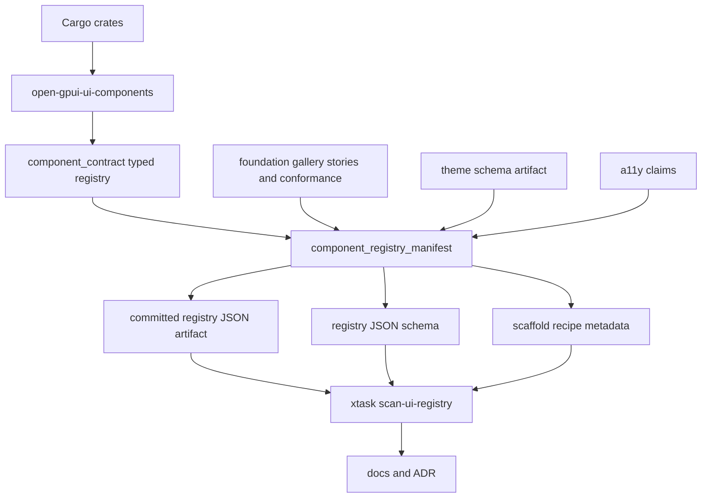

# Native UI Hybrid Registry Architecture - Plan

## Goal Capsule

| Field | Decision |
|---|---|
| Objective | Promote the current component contract registry into a hybrid ecosystem registry MVP: Cargo remains the official distribution authority, while a generated metadata manifest, schema, scaffold recipes, docs, gallery signals, and verification gates make the Open GPUI UI framework inspectable, scaffoldable, and AI-friendly. |
| Authority | The 28-item native UI framework research, ADR 0008, the shipped `component_contract` registry, `scan-ui-contract`, the theme schema artifact, and the foundation gallery conformance model. |
| Execution profile | Fearless refactor is allowed inside component contract metadata, examples, `xtask`, docs, and tests. Public component behavior and existing Cargo crate boundaries stay stable. Delete duplicated metadata once generated manifest paths replace it. |
| Contract posture | This is not a shadcn-style source registry. The registry is metadata and recipe infrastructure over Rust crates, not a second package manager or a web component clone. |
| Stop conditions | Stop and re-plan if implementation requires a hosted registry service, a new public CLI package manager, a standalone headless crate, a source-copy registry as the primary distribution channel, or changes to rendered component behavior. |

Open GPUI already has the hard part of a native UI component product: typed component contracts, theme schema, gallery samples, accessibility claims, and `xtask` audit gates.
The missing layer is the ecosystem contract that lets humans, tooling, and AI agents discover what exists, what can be scaffolded, how it is verified, and which crate still owns the shipped implementation.

---

## Product Contract

### Summary

Open GPUI should ship a generated component registry manifest and schema as the first native UI ecosystem artifact.
The manifest should be derived from existing typed contract facts and gallery evidence, not handwritten as another parallel registry.
Scaffold recipes should describe how to create app-owned wrappers or example starting points, while official components continue to ship through Cargo crates.

### Problem Frame

The project has moved from a broad component catalog toward a disciplined product surface: `crates/ui_components/src/component_contract/` owns contract rows, the foundation gallery consumes registry metadata, and `xtask` audits registry, docs, a11y, gallery, and theme drift.
That solves internal consistency, but not ecosystem distribution.

Frontend ecosystems such as shadcn/ui win because components are easy to find, inspect, copy, modify, and verify.
Rust native UI should not copy that distribution model literally because Cargo already solves package distribution and Rust APIs are not file-copy JavaScript modules.
The transferable idea is a machine-readable contract that lets tools list components, show anatomy and story selectors, generate docs, scaffold app-owned recipes, and run verification.

### Requirements

**Hybrid distribution model**

- R1. Keep `open-gpui-ui-core` and `open-gpui-ui-components` as the official shipped distribution surface through Cargo.
- R2. Add a generated metadata manifest that describes components, recipes, adjacent public surfaces, theme schema, a11y claims, gallery evidence, source homes, docs tokens, and verification commands.
- R3. Do not make source-copy recipes the authority for official components; recipes may scaffold app-owned wrappers, examples, or composition starting points.

**Manifest and schema**

- R4. Add stable manifest types and a `component_registry_manifest()` style export path under `open_gpui_ui_components::component_contract`.
- R5. Generate a committed JSON artifact under `docs/registry` and a JSON schema for manifest version 1 under `docs/schemas`.
- R6. The manifest must be deterministic, sorted, and renderer-neutral: no GPUI runtime handles, callbacks, `Window`, `App`, `Context`, `Element`, focus handles, or scroll handles.
- R7. Every manifest entry must trace back to the typed registry, API inventory, gallery status, docs token, theme/a11y evidence, and verification owner that already exists in the repo.

**Scaffold recipes**

- R8. Define recipe metadata for app-owned scaffolds without implementing a full public package manager.
- R9. The first recipe set should cover official composition recipes and high-value app-owned wrappers: table filters/toolbar, themed component wrapper, form field composition, and a gallery story sample.
- R10. Recipes must declare generated file intent, required imports, verification gates, customization boundaries, and whether the output is app-owned source or a crate dependency usage snippet.

**Docs, gallery, and AI-friendly loop**

- R11. Add docs that explain the hybrid registry model, including why Cargo remains the package authority and when source scaffolding is appropriate.
- R12. Surface manifest-derived metadata in the gallery or docs without making the gallery the source of registry truth again.
- R13. Make the add/modify/verify loop explicit: discover manifest entry, scaffold or compose locally, run focused verification, and keep docs/schema/gates aligned.

**Verification and ADR**

- R14. Extend `xtask` so manifest/schema/artifact drift fails locally before docs or gallery claims drift.
- R15. Add a formal ADR only after the implementation proves durable names for manifest version, artifact paths, recipe shape, and verification commands.

### Acceptance Examples

- AE1. A developer can run one documented command and receive a deterministic component registry JSON artifact that includes `Button`, `Command`, `Table`, `TableFacetedFilter`, `ThemeDefinition`, and adapter-only helpers with their ownership class, docs token, source home, gallery status, and verification owners.
- AE2. Adding a new official component without updating manifest derivation or schema fails a focused manifest drift gate.
- AE3. A table filter recipe declares that generated source is app-owned, depends on `open-gpui-ui-components`, points to its source family, and names focused tests that prove the recipe.
- AE4. The Components gallery can show or test manifest-derived registry metadata while still keeping sample selectors and story contracts as gallery-owned dogfood evidence.
- AE5. Docs state that Open GPUI rejects a shadcn-style source registry as primary distribution, while adopting metadata registry, scaffold recipes, gallery evidence, and verification commands.
- AE6. ADR 0013 records concrete public names only after the manifest artifact, schema artifact, and `xtask` gate exist.

### Scope Boundaries

In scope:

- Typed manifest and recipe metadata derived from `component_contract`.
- JSON export and committed schema/artifact drift checks.
- `xtask` audit extension for registry manifest and recipe drift.
- Docs and gallery metadata alignment.
- ADR 0013 after implementation proves names.

Deferred:

- Hosted registry service.
- `gpui add` or a public CLI that edits application source files.
- Third-party registry publishing workflow.
- Version negotiation beyond manifest schema version 1.
- Full source-copy component registry.

Out of scope:

- Creating `open-gpui-ui-headless`.
- Changing rendered component behavior or public builder semantics.
- Moving official components out of Cargo crates.
- Replacing existing gallery smoke tests with manifest checks.
- Reworking all component families for breadth.

---

## Planning Contract

### Key Technical Decisions

- KTD1. Cargo remains the distribution authority. The manifest makes the crate ecosystem discoverable and verifiable; it does not replace `Cargo.toml`, crates.io, or normal Rust dependency flow.
- KTD2. Manifest facts derive from typed registry owners. Handwritten JSON is only an artifact generated from Rust source and checked for drift, matching the existing theme schema pattern.
- KTD3. Recipes are metadata first. The MVP should define scaffold intent and verification ownership before adding a source-editing CLI that could ossify bad code-generation habits.
- KTD4. Gallery remains evidence, not authority. Gallery sample selectors and story contracts can feed manifest entries, but product classification continues to live in `ui_components::component_contract`.
- KTD5. ADR follows implementation proof. The public names worth freezing are manifest version, schema path, export command, recipe vocabulary, and verification gate; those should be validated before ADR 0013 is accepted.
- KTD6. AI-friendly means machine-readable and locally verifiable. The plan should optimize for agents and humans reading structured metadata, not for a hosted marketplace in this slice.

### High-Level Technical Design

The architecture is deliberately one-way.
Typed Rust facts generate portable artifacts, and `xtask` checks that artifacts and docs have not drifted.
The artifacts do not generate the Rust component registry in this slice, because Rust source remains the reviewed product authority.

### Assumptions

- `serde`, `serde_json`, and `schemars` are already available to `open-gpui-ui-components`; the manifest can follow the theme schema export pattern without new heavy dependencies.
- `xtask` may either call a small `open-gpui-ui-components` example to export the manifest or link only to JSON artifact comparison code. The implementation should choose the lighter path after checking compile cost.
- Gallery story contracts can be consumed as test evidence without moving gallery-only selectors into the component crate.

### System-Wide Impact

This plan changes how future component work is productized.
After it lands, adding or promoting a component should update typed contract rows, gallery evidence, docs tokens, manifest output, recipe metadata when applicable, and `xtask` verification.
That gives Open GPUI a native alternative to shadcn-style distribution without giving up Rust crate discipline.

### Risks And Mitigations

| Risk | Mitigation |
|---|---|
| Manifest becomes a second handwritten registry. | Generate it from typed Rust facts and fail drift through `xtask`. |
| Recipe metadata is mistaken for a promise that source generation is complete. | Name recipes as metadata/scaffold intent and keep source-editing CLI out of this MVP. |
| Schema names freeze too early. | Put ADR after implementation and tests, not before. |
| Gallery facts leak into component crate runtime APIs. | Keep gallery selectors in gallery and import them only in tests or artifact export paths that are already docs/tooling oriented. |
| `xtask verify` becomes too slow if it invokes Cargo examples repeatedly. | Add a focused scan command and include it in `verify` only if it stays comparable to existing schema scans; otherwise document the narrower gate for registry work. |

---

## Implementation Units

### U1. Add typed component registry manifest model

- **Goal:** Introduce renderer-neutral manifest types derived from the current component contract registry.
- **Requirements:** R1, R2, R4, R6, R7, AE1.
- **Dependencies:** None.
- **Files:** `crates/ui_components/src/component_contract/mod.rs`, `crates/ui_components/src/component_contract/types.rs`, `crates/ui_components/src/component_contract/manifest.rs`, `crates/ui_components/tests/public_surface/inventory.rs`, `crates/ui_components/tests/component_registry_manifest.rs`.
- **Approach:** Add manifest structs for registry version, entries, ownership class, family, docs status, gallery status, source inputs, API inventory summary, public export intent, and verification owners. Derive manifest rows from `COMPONENT_CONTRACT_REGISTRY`, `COMPONENT_API_INVENTORY`, and existing projection helpers. Keep any serde/schemars derives on manifest-only types rather than mutating core row structs if that keeps the old registry simple.
- **Test scenarios:** Manifest version is `1`. Entries are sorted by name and unique. Official component, recipe, state-contract, adapter-only, internal-anatomy, and deprecated-removal entries all appear with the expected classification. No manifest type exposes GPUI runtime/render types.
- **Verification:** `cargo nextest run -p open-gpui-ui-components component_registry_manifest public_surface --no-fail-fast`.

### U2. Add scaffold recipe metadata

- **Goal:** Define a scaffold recipe vocabulary without introducing a full source-editing package manager.
- **Requirements:** R3, R8, R9, R10, AE3.
- **Dependencies:** U1.
- **Files:** `crates/ui_components/src/component_contract/recipes.rs`, `crates/ui_components/src/component_contract/manifest.rs`, `crates/ui_components/tests/component_registry_manifest.rs`, `docs/ui/component-contract.md`.
- **Approach:** Add recipe metadata for app-owned composition scaffolds. Include recipe id, title, owner family, source components, generated-file intent, required imports, customization boundary, verification gates, and output ownership (`AppOwnedSource`, `CargoDependencySnippet`, or `GalleryStorySample`). Seed the first recipe set from existing official recipes and composition surfaces: table filters/toolbar, form field composition, themed wrapper, and a gallery story sample.
- **Test scenarios:** Every recipe id is unique and stable. Every recipe references existing registry entries. Every recipe has at least one verification gate and an explicit output ownership classification. Official components do not become source-copy recipes by default.
- **Verification:** `cargo nextest run -p open-gpui-ui-components component_registry_manifest --no-fail-fast`.

### U3. Export manifest JSON and schema artifacts

- **Goal:** Create deterministic reviewable artifacts for the registry manifest and its schema.
- **Requirements:** R4, R5, R6, R14, AE1, AE2.
- **Dependencies:** U1, U2.
- **Files:** `crates/ui_components/examples/export_component_registry.rs`, `crates/ui_components/examples/export_component_registry_schema.rs`, `docs/registry/open-gpui-component-registry-v1.json`, `docs/schemas/open-gpui-component-registry-v1.schema.json`, `xtask/src/ui_registry.rs`, `xtask/src/commands.rs`, `xtask/src/lib.rs`.
- **Approach:** Mirror the theme schema pattern: add examples that write pretty JSON to stdout, commit generated artifacts, and add an `xtask` scan that compares generated output to committed files. Normalize JSON before comparison so formatting noise does not produce false drift. Keep registry data artifacts under `docs/registry` and schemas under `docs/schemas`.
- **Test scenarios:** Generated JSON matches the committed artifact. Generated schema includes manifest version, entry classifications, docs fields, source fields, verification fields, and recipe references. A fixture artifact missing a current registry row fails with the missing component name. Usage output lists the focused scan command.
- **Verification:** `cargo test -p xtask ui_registry`, `cargo run -p xtask -- scan-ui-registry`, `cargo run -p xtask -- scan-ui-contract`.

### U4. Connect gallery and story evidence to the manifest

- **Goal:** Surface gallery evidence in the manifest while preserving gallery ownership of selectors and story probes.
- **Requirements:** R7, R11, R12, AE4.
- **Dependencies:** U1, U3.
- **Files:** `examples/ui-foundation-gallery/src/pages/components/catalog.rs`, `examples/ui-foundation-gallery/src/pages/components/conformance.rs`, `examples/ui-foundation-gallery/src/story.rs`, `examples/ui-foundation-gallery/tests/foundation_gallery.rs`, `crates/ui_components/tests/component_registry_manifest.rs`.
- **Approach:** Add a test-visible projection that pairs manifest entries with existing `COMPONENT_CATALOG`, official sample selector pairs, state-contract selectors, and `StoryContract` operations. Do not move gallery-only selector constants into `ui_components`. If production crates should not depend on gallery, keep this as gallery-side tests plus artifact audit evidence rather than a direct library dependency.
- **Test scenarios:** Every official manifest component that expects gallery evidence has a sample selector or documented state-contract selector. Every story contract references a manifest row or an explicit overlay catalog row. A manifest row cannot claim gallery evidence absent from `COMPONENT_CATALOG`.
- **Verification:** `cargo nextest run -p open-gpui-ui-foundation-gallery components_catalog_consumes_component_contract_registry official_component_catalog_entries_have_signals_and_sample_selectors components_page_conformance_gates_reference_core_and_gallery_contracts --no-fail-fast`.

### U5. Fold registry manifest checks into xtask verification

- **Goal:** Make manifest/schema/recipe drift part of the local productization gate.
- **Requirements:** R13, R14, AE2.
- **Dependencies:** U2, U3, U4.
- **Files:** `xtask/src/commands.rs`, `xtask/src/ui_registry.rs`, `xtask/src/ui_contract.rs`, `docs/verification.md`.
- **Approach:** Add a focused `scan-ui-registry` command and decide whether `scan-ui-contract` should call it or `verify` should call both separately. Keep diagnostics actionable: failures should name the registry row, artifact path, schema path, recipe id, or gallery evidence token. Avoid hiding the existing `scan-theme-schema` gate; registry and theme schema remain separate focused scans even if `verify` runs both.
- **Test scenarios:** `xtask` usage lists the new scan. `verify` runs the registry scan in a stable order. Artifact drift reports the stale path and regeneration command. Recipe drift reports the recipe id and missing registry reference.
- **Verification:** `cargo test -p xtask`, `cargo run -p xtask -- scan-ui-registry`, `cargo run -p xtask -- verify` if practical for the environment, otherwise document the exact package or environment blocker.

### U6. Document the hybrid registry workflow

- **Goal:** Make the ecosystem model readable without reopening the source-registry debate.
- **Requirements:** R11, R12, R13, AE5.
- **Dependencies:** U2, U3, U5.
- **Files:** `docs/ui/component-contract.md`, `docs/verification.md`, `docs/architecture/native-ui-framework-strategy.md`, `docs/knowledge/engineering/current-state.md`, `docs/knowledge/engineering/log.md`.
- **Approach:** Add a concise architecture page or section that explains Cargo-first distribution, metadata registry artifacts, scaffold recipe ownership, the add/modify/verify loop, and non-goals. Link the research report as supporting evidence rather than copying it into the docs. Update verification docs so component ecosystem changes start with `scan-ui-registry` and then drop to focused behavior tests.
- **Test scenarios:** Docs name the manifest artifact path, schema artifact path, export commands, focused `xtask` scan, and recipe ownership classes. Docs explicitly reject treating scaffold recipes as the official component source. Current-state memory points future sessions at this plan and the research report.
- **Verification:** `cargo nextest run -p open-gpui-ui-components --test public_surface docs --no-fail-fast`, `cargo run -p xtask -- scan-ui-registry`, and engineering wiki validation.

### U7. Record ADR 0013 after implementation proof

- **Goal:** Freeze the durable architecture decision after the code and artifact names are proven.
- **Requirements:** R15, AE6.
- **Dependencies:** U1, U2, U3, U5, U6.
- **Files:** `docs/adr/0013-open-gpui-native-ui-hybrid-registry.md`, `docs/adr/README.md`, `docs/knowledge/engineering/decisions/open-gpui-native-ui-framework-distribution-strategy.md`, `docs/knowledge/engineering/current-state.md`.
- **Approach:** Write ADR 0013 with the accepted decision: Cargo crates are the official distribution authority; Open GPUI ships a generated metadata registry and schema; scaffold recipes are app-owned starting points; gallery and a11y evidence are verification inputs; hosted registry and source-copy package manager remain future work. Reference the actual artifact paths and commands shipped by U1-U6.
- **Test scenarios:** ADR references concrete paths that exist. ADR alternatives include shadcn-style source registry, Cargo-only distribution, and hosted marketplace. ADR consequences match docs and memory.
- **Verification:** `git diff --check`, engineering wiki validation, and any ADR index check already present in the repo.

---

## Verification Contract

| Gate | Applies To | Done Signal |
|---|---|---|
| `cargo fmt --all --check` | U1-U5 | Rust manifest, recipe, example, and `xtask` edits are formatted. |
| `cargo nextest run -p open-gpui-ui-components component_registry_manifest public_surface --no-fail-fast` | U1-U3, U6 | Manifest derivation and existing public-surface contracts agree. |
| `cargo test -p xtask ui_registry` | U3, U5 | Registry artifact, schema, recipe, and command tests pass. |
| `cargo run -p xtask -- scan-ui-registry` | U3-U6 | Generated manifest/schema artifacts match committed files and recipe references are valid. |
| `cargo run -p xtask -- scan-ui-contract` | U1-U6 | Existing registry, docs, a11y, gallery, and theme contract scan remains green. |
| `cargo nextest run -p open-gpui-ui-foundation-gallery components_catalog_consumes_component_contract_registry official_component_catalog_entries_have_signals_and_sample_selectors components_page_conformance_gates_reference_core_and_gallery_contracts --no-fail-fast` | U4 | Gallery evidence remains aligned with registry truth. |
| `cargo nextest run -p open-gpui-ui-components --test public_surface docs --no-fail-fast` | U6 | Documentation vocabulary matches the public surface and new registry workflow. |
| `python $HOME/.codex/skills/engineering-wiki-memory/scripts/wiki_memory.py validate --root docs/knowledge/engineering` | U6-U7 | Engineering memory stays valid after current-state and decision updates. |
| `git diff --check` | U1-U7 | Generated artifacts and docs have no whitespace errors. |

`cargo run -p xtask -- verify` is the preferred final gate if it completes in the local environment.
If it times out or fails for an unrelated environment reason, record the exact command, failure, and focused gates that passed.

---

## Definition of Done

- `open_gpui_ui_components::component_contract` exposes manifest version 1 metadata derived from typed registry facts.
- A deterministic registry JSON artifact and JSON schema artifact are committed and audited for drift.
- Scaffold recipe metadata exists for the first app-owned composition recipes, with output ownership and verification gates.
- Gallery evidence is connected to manifest validation without moving gallery-only selectors into the component crate as product authority.
- `xtask` exposes a focused registry scan and either `scan-ui-contract` or `verify` runs it in the documented local gate path.
- Docs explain Cargo-first distribution, metadata registry, scaffold recipes, gallery/a11y/theme evidence, AI-friendly add/modify/verify flow, and source-registry non-goals.
- ADR 0013 records the final public names and compatibility posture after implementation proof.
- Existing component behavior, gallery behavior, and theme/a11y contracts remain green.
- Abandoned manifest experiments, duplicate handwritten JSON, stale registry descriptions, and obsolete docs about this work being future-only are removed.

---

## Appendix

### Local Sources

- `native-ui-framework-design-research/report.md` is the research basis for rejecting a direct shadcn-style source registry and choosing the hybrid model.
- `docs/knowledge/engineering/decisions/open-gpui-native-ui-framework-distribution-strategy.md` records the current decision memory.
- `crates/ui_components/src/component_contract/` is the typed source of component product facts.
- `xtask/src/ui_contract.rs` is the current contract drift audit and should shape diagnostics.
- `docs/schemas/open-gpui-theme-v1.schema.json` and `crates/ui_components/examples/export_theme_schema.rs` are the artifact/schema pattern to mirror.
- `examples/ui-foundation-gallery/src/pages/components/catalog.rs` and `examples/ui-foundation-gallery/src/story.rs` own gallery selectors and story evidence.
- `docs/adr/0008-open-gpui-ui-component-productization-roadmap.md` keeps current UI crates as the active product boundary.
