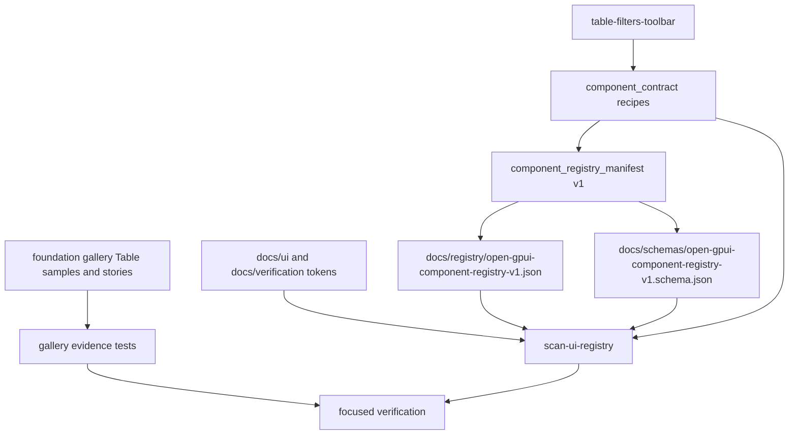

# Registry V1 Real Usage Validation - Plan

## Goal Capsule

| Field | Decision |
|---|---|
| Objective | Prove registry manifest version 1 survives a real component-ecosystem mutation by using the existing Table scaffold recipe and gallery evidence as the first validation slice. |
| Authority | ADR 0013, the shipped registry manifest/schema artifacts, `docs/architecture/native-ui-hybrid-registry.md`, and the current `scan-ui-registry` / gallery evidence gates. |
| Execution profile | Code and docs work are in scope. Public component behavior should stay stable unless the validation exposes a missing contract test for existing behavior. |
| Contract posture | Validate the local manifest/recipe workflow before designing hosted registry, `gpui add`, third-party publishing, or a new crate boundary. |
| Stop conditions | Stop and re-plan if the change requires a public scaffolding CLI, a hosted service, a manifest version bump beyond backward-compatible v1 additions, a source-copy official component distribution model, or `open-gpui-ui-headless`. |

Registry v1 is shipped, but it has only been proven by its initial implementation.
The next useful step is a narrow real-use pass: mutate one meaningful recipe path, connect it to existing Table documentation and gallery evidence, regenerate artifacts, and make drift checks fail when that evidence goes stale.

---

## Product Contract

### Summary

Open GPUI should validate registry v1 by exercising the exact add/modify/verify loop documented in ADR 0013.
The slice should use the existing `table-filters-toolbar` scaffold recipe because it already crosses typed component metadata, app-owned composition boundaries, documentation tokens, gallery samples, and focused Table verification.
The result should make recipe evidence more concrete without shipping a public source-generation CLI.

### Problem Frame

The hybrid registry MVP established the manifest, schema, scaffold recipe metadata, export examples, gallery evidence tests, and `xtask` scan.
That proves the architecture can be generated.
It does not yet prove the architecture stays usable when a contributor changes recipe metadata after the initial launch.

The most likely v1 drift is recipe-level drift.
Recipes currently name source components, generated file intent, imports, boundaries, and verification gates, but they do not carry a typed link to the docs or gallery evidence that shows the recipe is grounded in a real component story.
Future tools and agents will need that link before a CLI or hosted registry is worth designing.

### Requirements

**Real validation target**

- R1. Use an existing shipped recipe as the validation target rather than inventing a speculative component or distribution channel.
- R2. Prefer `table-filters-toolbar` because it composes official Table helpers, app-owned filter state, docs tokens, and focused gallery evidence.
- R3. Keep official components Cargo-owned; the recipe remains an app-owned scaffold contract, not copied official source.

**Recipe evidence contract**

- R4. Add typed recipe evidence metadata when the implementation proves the current recipe shape lacks enough grounding for real usage validation.
- R5. Recipe evidence must reference repo-local docs tokens, gallery sample identifiers, story owners, or verification commands that can be checked locally.
- R6. Manifest/schema additions must remain renderer-neutral and backward-compatible with registry v1 consumers.

**Drift detection**

- R7. `scan-ui-registry` must fail when recipe evidence references a missing source component, missing generated-file intent, missing docs token, missing gallery sample, or stale verification command.
- R8. Gallery-side tests must prove Table recipe evidence still maps to a real Table sample or story contract without moving gallery selector constants into `open-gpui-ui-components`.
- R9. Committed JSON and schema artifacts must be regenerated from Rust sources and compared by the focused registry scan.

**Documentation and memory**

- R10. Update the architecture and verification docs so the add/modify/verify loop explains recipe evidence validation.
- R11. Update engineering memory with the new validated next action and verification evidence after implementation.
- R12. Do not claim that registry v1 is ready for hosted registry or public scaffold CLI until several real mutations have passed this loop.

### Acceptance Examples

- AE1. Changing the `table-filters-toolbar` recipe regenerates `docs/registry/open-gpui-component-registry-v1.json` and `docs/schemas/open-gpui-component-registry-v1.schema.json`, and `scan-ui-registry` reports clean output only when both artifacts match source.
- AE2. A stale recipe evidence token such as a missing Table gallery sample id fails a focused test or `scan-ui-registry` diagnostic that names the recipe id and missing token.
- AE3. The Table recipe still declares `AppOwnedSource`, source components such as `TableFacetedFilter`, and focused Table verification gates.
- AE4. Gallery evidence tests prove recipe evidence against existing Table samples or `StoryContract` rows without importing gallery-only selectors into the component crate.
- AE5. Docs describe recipe evidence as local validation metadata, not a promise that `gpui add` or hosted publishing exists.

### Scope Boundaries

In scope:

- Typed recipe evidence metadata if needed to validate a real recipe mutation.
- `table-filters-toolbar` recipe evidence and manifest projection.
- JSON/schema artifact regeneration.
- `scan-ui-registry` recipe evidence diagnostics.
- Focused component, xtask, and gallery tests.
- Architecture, verification, and engineering memory updates.

Deferred:

- Hosted registry service.
- `gpui add` or any public source-editing CLI.
- Third-party registry publishing.
- Manifest version negotiation beyond version 1.
- Additional recipe families after Table proves the loop.

Out of scope:

- Public Table behavior changes.
- Source-copy official components.
- New `open-gpui-ui-headless` crate.
- Broad component-family redesign or another Table feature slice.

---

## Planning Contract

### Key Technical Decisions

- KTD1. Validate by mutating an existing recipe. A real v1 usage pass must touch current metadata, artifacts, scans, and docs rather than produce another architecture-only document.
- KTD2. Treat Table as the first recipe evidence probe. Table already has rich app-owned sample state, filter helpers, story coverage, and focused verification, so it gives the registry workflow a realistic stress point without new product behavior.
- KTD3. Keep recipe evidence local and checkable. Evidence should point at repo paths, docs tokens, gallery sample ids, story owners, and commands that local tests can validate.
- KTD4. Preserve v1 compatibility unless a true incompatibility appears. Additive fields in the schema are acceptable; a breaking manifest shape or version bump requires a separate ADR follow-up.
- KTD5. Gallery validates evidence from its side. The component crate owns recipe metadata and manifest generation; gallery tests own sample/story selector proof.

### High-Level Technical Design

The component crate should continue to generate the manifest without depending on gallery internals.
`xtask` can validate source-side evidence that is visible from repo files and commands.
Gallery tests can validate gallery-only sample/story ownership against the manifest.

### Assumptions

- Existing Table samples already expose enough stable identifiers or story ownership to validate recipe evidence without new rendered behavior.
- Adding evidence metadata to `ScaffoldRecipe` is a small additive schema change if the current recipe shape cannot express the validation target.
- The focused gates are sufficient; a full `cargo run -p xtask -- verify` remains optional if local runtime is too slow.

### Risks And Mitigations

| Risk | Mitigation |
|---|---|
| Recipe evidence becomes another handwritten registry. | Store only pointers to existing docs, samples, story owners, and commands, then validate those pointers. |
| Gallery constants leak into the component crate. | Keep gallery-owned proof in gallery tests; component metadata may name stable strings but must not import gallery modules. |
| Schema v1 changes become breaking. | Prefer additive optional evidence fields; stop and re-plan for version bump if compatibility cannot be kept. |
| The slice turns into a Table feature project. | Limit Table work to existing recipe metadata, docs, and evidence tests; no new Table behavior unless a missing regression test is discovered. |
| `scan-ui-registry` diagnostics become vague. | Require failures to name the recipe id, evidence kind, target token/path, and expected owner. |

---

## Implementation Units

### U1. Characterize recipe evidence drift

- **Goal:** Add or strengthen failing-first tests that describe the expected real-usage validation behavior before changing recipe metadata.
- **Requirements:** R1, R2, R5, R7, AE2.
- **Dependencies:** None.
- **Files:** `crates/ui_components/tests/component_registry_manifest.rs`, `xtask/src/ui_registry.rs`, `examples/ui-foundation-gallery/tests/foundation_gallery.rs`.
- **Approach:** Start with tests that prove the `table-filters-toolbar` recipe has checkable evidence beyond source components and command strings. If the existing metadata cannot express that evidence, let these tests drive the minimal typed metadata addition in U2.
- **Test scenarios:** Table recipe evidence is required. Missing evidence names the `table-filters-toolbar` recipe. Existing source-component validation still fails for missing registry rows.
- **Verification:** `cargo nextest run -p open-gpui-ui-components component_registry_manifest --no-fail-fast`, `cargo test -p xtask ui_registry`.

### U2. Add typed recipe evidence metadata

- **Goal:** Extend scaffold recipe metadata with local evidence pointers only as much as the characterization tests require.
- **Requirements:** R4, R5, R6, AE3.
- **Dependencies:** U1.
- **Files:** `crates/ui_components/src/component_contract/recipes.rs`, `crates/ui_components/src/component_contract/manifest.rs`, `crates/ui_components/src/component_contract/mod.rs`, `crates/ui_components/tests/component_registry_manifest.rs`.
- **Approach:** Add a small renderer-neutral evidence vocabulary such as docs token, gallery sample id, story owner, and verification command if those concepts cannot be represented cleanly today. Keep evidence rows copyable into JSON, sorted or source-stable, and tied to recipe ids rather than component rows.
- **Test scenarios:** `table-filters-toolbar` includes evidence for Table docs, Table filter helper docs, a Table gallery sample or story owner, and the existing focused Table gates. Evidence serialization is deterministic. Official component rows remain separate from app-owned recipe output.
- **Verification:** `cargo nextest run -p open-gpui-ui-components component_registry_manifest public_surface --no-fail-fast`.

### U3. Regenerate registry artifacts and strengthen `scan-ui-registry`

- **Goal:** Push the real recipe mutation through JSON/schema artifacts and local drift checks.
- **Requirements:** R6, R7, R9, AE1, AE2.
- **Dependencies:** U2.
- **Files:** `docs/registry/open-gpui-component-registry-v1.json`, `docs/schemas/open-gpui-component-registry-v1.schema.json`, `xtask/src/ui_registry.rs`, `xtask/src/commands.rs`.
- **Approach:** Regenerate the registry JSON and schema from the existing examples. Extend `scan-ui-registry` to validate evidence references that can be checked without importing gallery code, such as docs token presence, command shape, generated file intent, and artifact/schema drift.
- **Test scenarios:** Stale artifact comparison names the artifact path and regeneration command. Missing docs token reports the recipe id and token. Evidence command checks remain focused and do not execute the command during the scan.
- **Verification:** `cargo test -p xtask ui_registry`, `cargo run -p xtask -- scan-ui-registry`.

### U4. Validate Table recipe evidence from the gallery side

- **Goal:** Prove recipe evidence maps to real Table gallery sample or story evidence while preserving gallery ownership.
- **Requirements:** R2, R8, AE4.
- **Dependencies:** U2, U3.
- **Files:** `examples/ui-foundation-gallery/tests/foundation_gallery.rs`, `examples/ui-foundation-gallery/src/pages/components/catalog.rs`, `examples/ui-foundation-gallery/src/pages/components/samples/table.rs`, `examples/ui-foundation-gallery/src/story.rs`.
- **Approach:** Add a gallery-side assertion that reads `component_registry_manifest()` and checks the Table recipe evidence against existing Table catalog/sample/story data. Prefer existing sample identifiers such as the filter board or Table story owner; only introduce a new visible identifier if no stable evidence hook exists.
- **Test scenarios:** `table-filters-toolbar` evidence maps to a Table sample or story owner. A manifest recipe cannot claim a missing Table gallery target. Existing gallery manifest evidence tests remain green.
- **Verification:** `cargo nextest run -p open-gpui-ui-foundation-gallery gallery_catalog_entries_satisfy_component_registry_manifest_evidence gallery_story_contracts_reference_component_registry_manifest_rows --no-fail-fast`.

### U5. Update docs, memory, and final verification trail

- **Goal:** Record the validated registry v1 usage loop without overstating future distribution features.
- **Requirements:** R10, R11, R12, AE5.
- **Dependencies:** U1, U2, U3, U4.
- **Files:** `docs/architecture/native-ui-hybrid-registry.md`, `docs/ui/component-contract.md`, `docs/verification.md`, `docs/knowledge/engineering/current-state.md`, `docs/knowledge/engineering/log.md`, `docs/knowledge/engineering/verification/registry-v1-real-usage-validation-20260702.md`.
- **Approach:** Update the add/modify/verify loop with recipe evidence validation and add verification memory after the gates pass. Keep ADR 0013 unchanged unless implementation reveals a new compatibility decision; this plan should exercise the ADR, not reopen it.
- **Test scenarios:** Docs name recipe evidence as local validation metadata. Verification docs keep `scan-ui-registry` before `scan-ui-contract`. Memory points future sessions at this plan and the resulting verification file.
- **Verification:** `python $HOME/.codex/skills/engineering-wiki-memory/scripts/wiki_memory.py validate --root docs/knowledge/engineering`, `git diff --check`.

---

## Verification Contract

| Gate | Applies To | Done Signal |
|---|---|---|
| `cargo fmt --all --check` | U1-U4 | Rust metadata, tests, and `xtask` edits are formatted. |
| `cargo nextest run -p open-gpui-ui-components component_registry_manifest public_surface --no-fail-fast` | U1-U3 | Manifest, recipe evidence, schema vocabulary, and public-surface contracts agree. |
| `cargo test -p xtask ui_registry` | U1, U3 | Registry scan unit tests cover artifact drift and recipe evidence diagnostics. |
| `cargo run -p xtask -- scan-ui-registry` | U3-U5 | Generated registry/schema artifacts match committed files and recipe evidence references are valid. |
| `cargo run -p xtask -- scan-ui-contract` | U3-U5 | Broader component contract, docs, gallery, a11y, and theme checks remain green. |
| `cargo nextest run -p open-gpui-ui-foundation-gallery gallery_catalog_entries_satisfy_component_registry_manifest_evidence gallery_story_contracts_reference_component_registry_manifest_rows --no-fail-fast` | U4 | Gallery evidence remains connected to manifest rows and recipe claims. |
| `python $HOME/.codex/skills/engineering-wiki-memory/scripts/wiki_memory.py validate --root docs/knowledge/engineering` | U5 | Engineering memory validates after docs and verification evidence updates. |
| `git diff --check` | U1-U5 | Docs, generated artifacts, and source changes have no whitespace errors. |

`cargo run -p xtask -- verify` is the preferred final confidence gate if it completes locally.
If it is too slow or blocked by the environment, record the exact failure and the focused gates that passed.

---

## Definition of Done

- The `table-filters-toolbar` recipe has survived a real metadata mutation through typed source, manifest projection, committed JSON, committed schema, and drift scan.
- Recipe evidence is local, renderer-neutral, and checkable without turning recipes into official copied component source.
- `scan-ui-registry` reports actionable diagnostics for stale recipe evidence it can validate from repo-local files and commands.
- Gallery-side tests prove Table recipe evidence against existing Table sample or story data without moving gallery selector ownership into the component crate.
- Architecture and verification docs explain how to validate recipe evidence in the add/modify/verify loop.
- Engineering memory records the implementation result, commit, and verification gates.
- Hosted registry, public scaffolding CLI, third-party publishing, manifest version negotiation, and `open-gpui-ui-headless` remain deferred.
- Abandoned experiments, duplicate evidence lists, stale generated artifacts, and misleading docs that imply the recipe CLI already exists are removed.

---

## Appendix

### Local Sources

- `docs/adr/0013-open-gpui-native-ui-hybrid-registry.md` defines the accepted Cargo-first hybrid registry architecture and follow-up threshold.
- `docs/architecture/native-ui-hybrid-registry.md` defines the add/modify/verify loop this plan must exercise.
- `crates/ui_components/src/component_contract/recipes.rs` owns current scaffold recipe metadata.
- `crates/ui_components/src/component_contract/manifest.rs` projects typed registry and recipe facts into manifest version 1.
- `crates/ui_components/tests/component_registry_manifest.rs` owns current manifest and recipe invariants.
- `xtask/src/ui_registry.rs` owns registry/schema artifact drift diagnostics.
- `examples/ui-foundation-gallery/tests/foundation_gallery.rs` owns gallery evidence tests that may consume manifest rows.
- `docs/knowledge/engineering/verification/native-ui-hybrid-registry-implementation-20260702.md` records the baseline registry v1 implementation proof.
