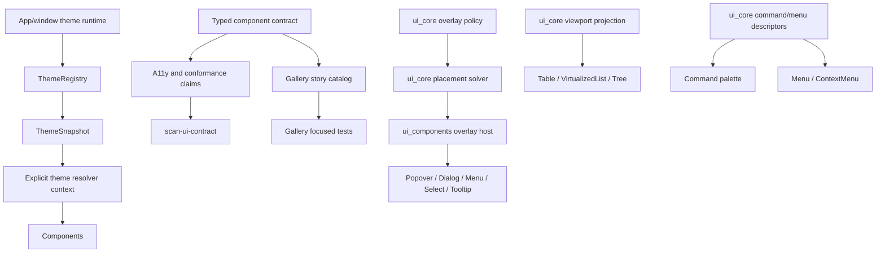

## Goal Capsule

| Field | Value |
| --- | --- |
| Objective | Turn the current broad UI component library into deeper runtime framework modules: app/window-scoped theme runtime, renderer-neutral overlay placement, shared viewport projection, gallery story contract, and a minimal command/menu data contract. |
| Authority | ADR 0005, ADR 0007, ADR 0008, ADR 0009, ADR 0014, `docs/architecture/native-ui-framework-strategy.md`, `docs/ui/component-contract.md`, the current `component_contract` typed rows, `scan-ui-contract`, and the in-session architecture review. |
| Execution profile | Fearless refactor is allowed inside the UI crates, gallery, xtask drift gates, and docs. Breaking API changes are expected when they remove wrong authority, default-light behavior, obsolete registry-era leftovers, duplicated contract facts, or shallow adapter-only seams. |
| Product boundary | Keep `open-gpui-ui-core`, `open-gpui-ui-components`, and the foundation gallery as the active product boundary. Do not create a standalone headless crate in this plan. |
| Contract posture | Typed Rust source is the contract authority. Cargo remains the distribution authority. Generated component registry manifests, registry schemas, scaffold recipe metadata, and `scan-ui-registry` stay removed. |
| Stop conditions | Stop and re-plan if an implementation requires a new headless crate, a hosted/JSON component registry, a package-manager style scaffold tool, GPUI runtime types inside `ui_core`, a wholesale rewrite of GPUI runtime, or behavior that cannot be covered by focused tests. |

## Execution Priority

| Priority | Units | Reason |
| --- | --- | --- |
| P0 | U1 Theme Snapshot Context And Resolver Migration | The current schema, registry, and snapshots exist, but production render paths can still resolve through the implicit light snapshot. This is the broadest framework correctness gap. |
| P1 | U6 Gallery Story Catalog Contract | `docs/knowledge/engineering/current-state.md` already identifies the component render/story surface as the next high-leverage gallery action, and the test surface is mature enough for fearless refactor. |
| P1 | U4 Overlay Adapter Runtime/Host | A general UI framework needs consistent overlay dismissal, focus restore, placement, and stack behavior. Existing neutral policy is deep; the GPUI adapter host remains too shallow. |
| P2 | U2 Typed Component Contract And A11y Evidence Authority, U3 Hybrid Registry Remnant Cleanup | The contract direction is correct, but duplicated a11y expectations and stale registry-era wording still create drift risk. This work must stay under ADR 0014. |
| P2 | U5 Shared Viewport Projection For Table/List/Tree | Table, Tree, and VirtualizedList already have good coverage. The right move is shared projection, not a table rewrite. |
| P2/P3 | U7 Command/Menu App Command Seam Checkpoint | Important long-term framework capability, but it should be shipped only if the current Command/Menu code proves a small renderer-neutral seam. |
| Final | U8 Docs, Verification, And Final Cleanup | Documentation should trail the code so it records the actual final authority boundaries and commands run. |

Implementation should follow this priority when risk and dependencies allow. U2 and U3 can be pulled earlier if a theme or gallery change touches contract drift gates.

## Product Requirements

| ID | Requirement |
| --- | --- |
| R1 | Components can resolve semantic colors from the current runtime `ThemeSnapshot`, selected by an app/window-scoped theme runtime or explicit adapter context, without silently falling back to light mode in production render paths. |
| R2 | The default-light `ThemeResolver::resolve` path is removed, deprecated, or restricted so normal component rendering must use an explicit snapshot/context. Dark, high-contrast, and JSON-loaded custom themes have representative component coverage and diagnostics. |
| R3 | Component contract authority includes representative a11y and conformance evidence as typed data. `xtask scan-ui-contract` should consume that authority instead of maintaining a second hardcoded expectation table where avoidable. |
| R4 | No generated component registry, component registry manifest, scaffold recipe manifest, registry schema artifact, or `scan-ui-registry` path is reintroduced. Any stale registry-era code/docs found during implementation are deleted or clearly marked historical. |
| R5 | Overlay components share a renderer-neutral placement solver for flip, shift, collision, safe bounds, arrow offset, and trace output; GPUI adapter code consumes the resolved placement instead of owning geometry policy. |
| R6 | Overlay components share a GPUI adapter runtime/host for open-change handling, Escape/outside press policy, focus restore, and placement glue while `ui_core::overlay` remains renderer-neutral policy. |
| R7 | Row and column viewport projection becomes a single deep renderer-neutral module used by Table, VirtualizedList, and Tree where their behavior overlaps. Table pinned regions remain table-specific adapter/render-plan concerns. |
| R8 | The foundation gallery has a story contract/catalog module that owns metadata, selectors, probes, and render/sample registration enough that adding a component has fewer touchpoints and better drift gates. |
| R9 | Command/menu/keybinding app-level integration gains a minimal renderer-neutral data seam for descriptors, enablement metadata, shortcut display, and menu projection. The `Command` palette component must not accidentally become a global app command runtime. |
| R10 | Documentation, verification notes, and engineering memory are updated to match the new authority boundaries, and obsolete code is removed rather than preserved for compatibility by default. |

## Key Technical Decisions

| ID | Decision |
| --- | --- |
| KTD1 | Keep the current UI crates as the product boundary. This follows ADR 0008 and ADR 0009 and avoids premature headless extraction. |
| KTD2 | Prioritize runtime theme propagation first because most component render paths currently resolve semantic colors and many use default-light helpers. |
| KTD3 | Deepen typed contract authority instead of generating registry artifacts. ADR 0014 makes generated registry/scaffold metadata an explicitly rejected direction. |
| KTD4 | Split overlay responsibility by layer: `ui_core` owns renderer-neutral policy and placement solving; `ui_components` owns GPUI adapter/runtime mechanics. |
| KTD5 | Move shared viewport math toward `ui_core` only when it is renderer-neutral. Keep table chrome, pinned regions, and GPUI element assembly in `ui_components`. |
| KTD6 | Treat the gallery as a conformance product module, not only a demo app. Gallery selectors remain gallery-owned. Component crate contracts remain component-owned. |
| KTD7 | Sequence command/menu/keybinding after the higher-leverage runtime seams. Add only a small tested data contract; keep callbacks, GPUI actions, and application command dispatch outside this slice. |

## Architecture Shape



## Assumptions

- The scope is inferred from the user's request to develop all architecture-review candidates, optimize/fix existing code, and use fearless refactoring.
- Breaking changes inside the UI framework surface are acceptable when they remove incorrect behavior or obsolete architecture.
- This plan intentionally stays inside the current UI crates and gallery; no new standalone headless crate is created.
- `scan-ui-contract` remains the public drift gate. Generated registry/scaffold tooling remains out of scope.
- The repository is already on a feature branch for this work, so implementation can proceed without creating another worktree.

## Scope Boundaries

### In Scope

- Runtime theme context/snapshot propagation through `ui_components` render paths.
- Typed component contract and representative a11y/conformance authority.
- Deletion or cleanup of stale hybrid-registry remnants if any still exist.
- Shared overlay adapter runtime/host for GPUI overlay mechanics.
- Shared viewport projection for row/column windows where it is renderer-neutral.
- Foundation gallery story/catalog contract consolidation.
- A small command/menu/keybinding data contract only if proven by existing code.
- Verification docs, component contract docs, and engineering memory updates.

### Deferred

- A new `open-gpui-ui-headless` crate.
- Hosted component marketplace, remote registry, or package-manager style source-copy installation.
- `gpui add` or scaffold recipe generation.
- Full native OS menu/keybinding integration.
- Broad file splitting done only because a file is large.
- New table features unrelated to projection reuse.
- Overlay animation/presence transitions beyond the runtime glue required by this plan.

### Out Of Scope

- Restoring the ADR 0013 hybrid registry direction.
- Rewriting the GPUI runtime.
- Changing the Zed fork runtime architecture.
- Copying `gpui-component` or Fret architecture wholesale.

## Implementation Units

### U1. Theme Snapshot Context And Resolver Migration

**Requirements:** R1, R2

**Goal:** Make the current `ThemeSnapshot` explicit in component rendering so production UI no longer resolves semantic colors through an implicit light snapshot.

**Files:**

- `crates/ui_components/src/theme/resolver.rs`
- `crates/ui_components/src/theme/registry.rs`
- `crates/ui_components/src/theme/snapshot.rs`
- `crates/ui_components/src/theme/mod.rs`
- Representative component render paths in `crates/ui_components/src`
- `examples/ui-foundation-gallery/src/pages/tokens.rs`
- Theme-focused tests in `crates/ui_components/tests`

**Approach:**

1. Add a small snapshot-carrying resolver/context type in the theme module.
2. Make production render paths accept/use the explicit resolver or snapshot.
3. Deprecate, remove, or test-only fence the default-light `ThemeResolver::resolve` helper.
4. Migrate representative components first, then mechanically migrate the remaining production call sites.
5. Keep `resolve_fallback` behavior for missing tokens so incomplete custom themes degrade predictably.

**Acceptance:**

- Dark, high-contrast, and JSON-loaded custom snapshots resolve through Button, Menu/Popover, TextInput, and Table-related component paths.
- No production render path calls the default-light resolver helper.
- Existing built-in theme snapshots and schema loading still pass.

**Verification:**

- `cargo nextest run -p open-gpui-ui-components theme --no-fail-fast`
- `cargo run -p xtask -- scan-theme-drift`
- `cargo run -p xtask -- scan-ui-contract`

### U2. Typed Component Contract And A11y Evidence Authority

**Requirements:** R3, R4

**Goal:** Move representative a11y and conformance facts into typed authority so `scan-ui-contract` checks one product contract instead of duplicated hardcoded expectations.

**Files:**

- `crates/ui_components/src/component_contract/mod.rs`
- `crates/ui_components/src/component_contract/types.rs`
- `crates/ui_components/src/component_contract/rows.rs`
- `crates/ui_components/src/a11y.rs`
- `examples/ui-foundation-gallery/src/pages/components/conformance.rs`
- `xtask/src/ui_contract.rs`
- `crates/ui_components/tests/public_surface`
- `examples/ui-foundation-gallery/tests`

**Approach:**

1. Add typed a11y/conformance evidence records beside the existing component contract rows.
2. Keep gallery-owned selectors and story probes in the gallery, but link them to the typed component contract.
3. Refactor `xtask scan-ui-contract` to consume or parse the typed authority with less duplicated expectation data.
4. Preserve the current distinction between product contract authority and Cargo distribution authority.

**Acceptance:**

- Adding/removing a representative a11y claim is visible through typed contract tests and `scan-ui-contract`.
- `xtask/src/ui_contract.rs` no longer owns a second independent expected-claims table when typed source can express the same fact.
- No generated component registry or scaffold manifest appears.

**Verification:**

- `cargo nextest run -p open-gpui-ui-components a11y --no-fail-fast`
- `cargo nextest run -p open-gpui-ui-components --test public_surface --no-fail-fast`
- `cargo run -p xtask -- scan-ui-contract`

### U3. Hybrid Registry Remnant Cleanup

**Requirements:** R4, R9

**Goal:** Delete or mark obsolete any remaining implementation/doc traces that imply the removed hybrid registry is still active.

**Files:**

- `xtask/src`
- `docs/ui/component-contract.md`
- `docs/architecture`
- `docs/knowledge/engineering`
- Any registry/schema/scaffold files found by search

**Approach:**

1. Search for active references to `scan-ui-registry`, registry manifest, scaffold recipe manifest, generated component registry, and registry schema artifacts.
2. Delete stale active code paths.
3. Preserve historical ADR/plan references only when clearly marked as superseded by ADR 0014.
4. Update docs to point at `component_contract` and `scan-ui-contract`.

**Acceptance:**

- Active docs and tooling describe typed component contracts, not generated registries.
- Historical references are clearly historical or superseded.
- No registry/scaffold code path remains callable.

**Verification:**

- `rg "scan-ui-registry|component registry manifest|scaffold recipe|generated component registry" docs crates xtask`
- `cargo run -p xtask -- scan-ui-contract`

### U4. Overlay Adapter Runtime/Host

**Requirements:** R5

**Goal:** Centralize repeated GPUI overlay adapter mechanics while preserving component-specific state and `ui_core` policy ownership.

**Files:**

- `crates/ui_core/src/overlay.rs`
- `crates/ui_components/src/overlay.rs`
- `crates/ui_components/src/popover.rs`
- `crates/ui_components/src/dialog.rs`
- `crates/ui_components/src/alert_dialog.rs`
- `crates/ui_components/src/sheet.rs`
- `crates/ui_components/src/hover_card.rs`
- `crates/ui_components/src/tooltip.rs`
- `crates/ui_components/src/menu`
- `crates/ui_components/src/context_menu`
- `crates/ui_components/src/select.rs`
- `crates/ui_components/src/combobox.rs`
- Overlay-focused component tests

**Approach:**

1. Identify repeated open-change, Escape, outside press, focus restore, and placement glue.
2. Add an overlay adapter host/runtime helper in `ui_components`.
3. Keep menu submenu hover timing and safe-hover follow-ups in the menu runtime.
4. Migrate overlay family components incrementally, proving behavior after each family.
5. Keep `ui_core` free of GPUI runtime types.

**Acceptance:**

- Popover, Dialog/AlertDialog/Sheet, Menu/ContextMenu, Select/Combobox, Tooltip/HoverCard use shared overlay host helpers for common mechanics.
- Escape and outside press behavior still follows `ui_core::overlay` policy.
- Focus restore behavior is consistent and tested across representative overlays.

**Verification:**

- `cargo nextest run -p open-gpui-ui-components menu context_menu --no-fail-fast`
- Overlay-specific tests added or updated for Popover, Dialog, Select/Combobox, Tooltip/HoverCard.
- `cargo nextest run -p open-gpui-ui-core overlay --no-fail-fast`

### U5. Shared Viewport Projection For Table/List/Tree

**Requirements:** R6

**Goal:** Move shared row/column window projection into a renderer-neutral module and make Table, VirtualizedList, and Tree use it where their behavior overlaps.

**Files:**

- `crates/ui_core/src/grid_viewport.rs`
- `crates/ui_core/src/lib.rs`
- `crates/ui_components/src/row_window.rs`
- `crates/ui_components/src/table/render_plan`
- `crates/ui_components/src/table/virtualization.rs`
- VirtualizedList and Tree implementations/tests

**Approach:**

1. Generalize the existing `GridViewport2D` and row-window projection into a single `ui_core` viewport projection API if the data stays renderer-neutral.
2. Replace `ui_components` private row-window duplication where the core abstraction fits.
3. Keep table pinned rows/columns and GPUI element assembly in table render plans.
4. Add exact-size and variable-size projection tests before migrating call sites.

**Acceptance:**

- Shared row-window math no longer lives only in `ui_components` if it is generic.
- Table center column windowing, VirtualizedList rows, and Tree rows consume the shared projection where appropriate.
- Existing pinned table behavior remains unchanged.

**Verification:**

- `cargo nextest run -p open-gpui-ui-core grid_viewport virtualizer table --no-fail-fast`
- `cargo nextest run -p open-gpui-ui-components --test table --no-fail-fast`
- Gallery table/tree/virtualized-list focused smoke tests where available.

### U6. Gallery Story Catalog Contract

**Requirements:** R7

**Goal:** Make the gallery story contract the single gallery-owned authority for component metadata, selectors, probes, and render/sample registration.

**Files:**

- `examples/ui-foundation-gallery/src/story.rs`
- `examples/ui-foundation-gallery/src/pages/components/catalog.rs`
- `examples/ui-foundation-gallery/src/pages/components/conformance.rs`
- `examples/ui-foundation-gallery/src/pages/components/render/sections.rs`
- `examples/ui-foundation-gallery/src/pages/components/samples`
- `examples/ui-foundation-gallery/tests`

**Approach:**

1. Move repeated story metadata and selector/probe declarations into one gallery-owned contract.
2. Reduce the giant component-render match surface by registering render/sample entries through the contract where practical.
3. Keep component crate contract rows as product authority and gallery selectors as gallery authority.
4. Add tests that compare official component rows, story contracts, selectors, and probes.

**Acceptance:**

- Each official gallery component entry has one story contract record.
- Focused and all-mode gallery tests use the same contract data.
- Adding a component requires fewer independent edits than before.

**Verification:**

- `cargo nextest run -p open-gpui-ui-foundation-gallery component --no-fail-fast`
- Existing focused gallery metadata/catalog/probe tests.
- `cargo run -p xtask -- scan-ui-contract`

### U7. Command/Menu App Command Seam Checkpoint

**Requirements:** R8

**Goal:** Decide with code evidence whether a small renderer-neutral command/menu/keybinding data contract belongs now, and implement only the proven minimum.

**Files:**

- `crates/ui_components/src/command`
- `crates/ui_components/src/menu`
- `crates/ui_components/src/component_contract`
- Related command/menu tests and docs

**Approach:**

1. Audit `Command` palette descriptors, menu descriptors, and existing keybinding usage.
2. If there is a real shared data seam, introduce a minimal contract that describes command id, label, grouping, enablement metadata, and optional shortcut display without owning callbacks or app runtime.
3. Keep `Command` as a palette/search component and menu as UI component adapters.
4. If the seam is still speculative, document the deferral and delete any partial dead code.

**Acceptance:**

- Either a small tested data contract exists and both Command/Menu can consume it, or the seam is explicitly deferred with no dead code left behind.
- No app-global command registry is introduced accidentally.

**Verification:**

- `cargo nextest run -p open-gpui-ui-components command menu --no-fail-fast`
- Contract/public-surface tests if a public data contract is added.

### U8. Docs, Verification, And Final Cleanup

**Requirements:** R9

**Goal:** Align docs and verification gates with the new module boundaries and remove obsolete compatibility leftovers.

**Files:**

- `docs/ui/component-contract.md`
- `docs/verification.md`
- `docs/knowledge/engineering/current-state.md`
- `docs/knowledge/engineering/log.md`
- New or updated verification notes under `docs/knowledge/engineering/verification`

**Approach:**

1. Update docs after code settles, not before.
2. Record the final authority boundaries and exact verification commands.
3. Delete obsolete helpers, comments, or docs that preserved removed behavior.
4. Run a final source search for old names and accidental duplicate authority.

**Acceptance:**

- Docs describe the implemented boundaries and no longer imply removed tooling is current.
- Verification notes capture the commands that actually ran.
- `git diff --check` is clean.

## Cross-Unit Risks

| Risk | Mitigation |
| --- | --- |
| Theme migration touches many component files. | Start with proof tests and migrate through a small explicit resolver API. Use focused tests after each group. |
| Contract/a11y authority can drift between component crate and gallery. | Keep component contract facts in `ui_components`; keep selectors/probes in gallery; make `scan-ui-contract` compare both. |
| Overlay refactor can regress focus or nested dismissal behavior. | Migrate one overlay family at a time and preserve existing menu/runtime tests. |
| Viewport projection can over-generalize table-specific pinned behavior. | Move only renderer-neutral range/window math to `ui_core`; leave pinned chrome in table render plans. |
| Gallery render registration can become too abstract. | Stop at reducing repeated catalog/probe/render touchpoints; do not invent a plugin registry. |
| Command/menu seam may be speculative. | Treat U7 as a checkpoint with a delete-or-ship rule. |

## Verification Contract

Run focused gates as units land:

```powershell
cargo fmt -p open-gpui-ui-core -p open-gpui-ui-components -p open-gpui-ui-foundation-gallery
cargo check -p open-gpui-ui-core --tests
cargo check -p open-gpui-ui-components --tests
cargo check -p open-gpui-ui-foundation-gallery --tests
cargo nextest run -p open-gpui-ui-core overlay grid_viewport virtualizer table --no-fail-fast
cargo nextest run -p open-gpui-ui-components theme a11y menu context_menu command --no-fail-fast
cargo nextest run -p open-gpui-ui-components --test table --no-fail-fast
cargo nextest run -p open-gpui-ui-components --test public_surface --no-fail-fast
cargo nextest run -p open-gpui-ui-foundation-gallery component --no-fail-fast
cargo run -p xtask -- scan-theme-drift
cargo run -p xtask -- scan-ui-contract
git diff --check
```

Run the full gate when practical:

```powershell
cargo run -p xtask -- verify
```

## Definition Of Done

- Production component rendering no longer depends on an implicit light theme resolver.
- Representative component/theme tests prove light, dark, high-contrast, and JSON-loaded custom theme paths.
- Component contract/a11y evidence has one typed authority, and `scan-ui-contract` is green.
- Generated registry/scaffold remnants are absent from active code and clearly historical in docs.
- Overlay family components share GPUI adapter runtime helpers for common mechanics.
- Renderer-neutral row/column projection is shared by table/list/tree where appropriate.
- Gallery story contract records cover official component metadata, selectors, probes, and render/sample registration.
- Command/menu app-command contract is either implemented minimally with tests or explicitly deferred with no dead code.
- Documentation, verification notes, and engineering memory reflect the final architecture.
- Focused verification gates pass, or any remaining failures are documented with exact failing commands and follow-up blockers.

## Sources

- `docs/adr/0008-open-gpui-ui-component-productization-roadmap.md`
- `docs/adr/0009-open-gpui-table-and-virtualizer-product-shape.md`
- `docs/adr/0014-remove-native-ui-hybrid-registry.md`
- `docs/ui/component-contract.md`
- `docs/verification.md`
- `docs/plans/2026-07-02-001-refactor-ui-contract-tooling-plan.md`
- `docs/plans/2026-07-02-002-refactor-native-ui-hybrid-registry-architecture-plan.md`
- `docs/knowledge/engineering/current-state.md`
- `docs/knowledge/engineering/decisions/open-gpui-ui-productization-roadmap.md`
- `docs/knowledge/engineering/decisions/open-gpui-ui-component-depth-roadmap.md`
- `docs/knowledge/engineering/decisions/open-gpui-native-ui-framework-distribution-strategy.md`
- `docs/knowledge/engineering/subagents/runtime-theme-reference-research.md`
- `docs/knowledge/engineering/subagents/gallery-architecture-review-20260618.md`
- `docs/knowledge/engineering/progress/2026-06-21-table-virtualizer-roadmap-framing.md`
- `docs/knowledge/engineering/progress/2026-06-26-menu-hover-open-submenu-proof.md`
