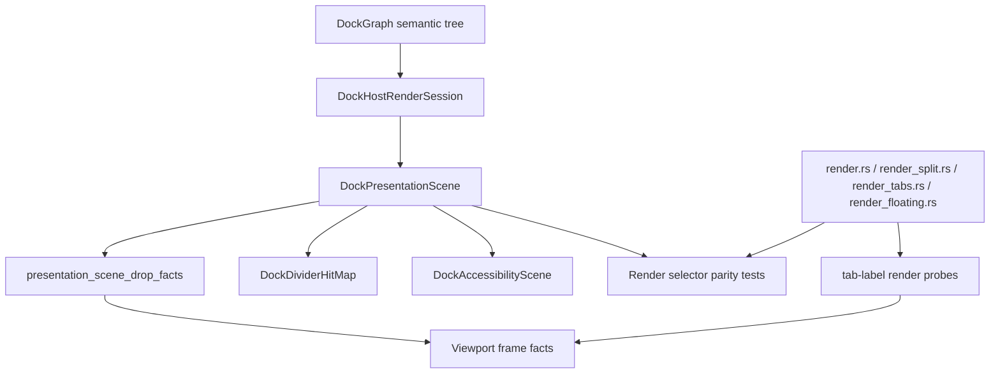

# Docking Render Authority Convergence - Plan

## Goal Capsule

| Field | Value |
| --- | --- |
| Objective | Converge docking render-adjacent geometry on `DockPresentationScene` so normal render, drop facts, transition samples, divider hit maps, floating chrome, and accessibility proofs stop drifting. |
| Authority | `DockGraph` remains semantic mutation authority; current drop facts remain release authority; `DockPresentationScene` becomes the deterministic geometry authority for overlapping render and preview regions. |
| Scope posture | Fearless private refactor: crate-private render helpers may break, duplicate geometry code may be deleted, and probe-only fallbacks must justify why text shaping or GPUI measurement still requires them. |
| Execution profile | Characterization-first geometry parity, then scene-seeded fact migration, then render helper cleanup, then focused native dogfood. |
| Stop condition | Scene/render/drop-fact parity tests lock root, nested, floating, empty-central, tab, splitter, and zoomed layouts, and remaining render probes are limited to documented intrinsic-measurement cases. |

---

## Product Contract

### Summary

The flat motion runtime work shipped real-content transition reveal, shared motion timelines, overlay current-target behavior, and presentation-scene-seeded drop facts.
The remaining risk is not a missing animation primitive.
The risk is that docking still has several geometry authorities: `DockPresentationScene`, recursive flex render modules, render-measured tab facts, viewport runtime facts, and local chrome math.

This plan narrows the next pass to render authority convergence.
It should make the existing scene the source of truth for deterministic pane, splitter, tab-bar, floating, empty-central, and accessibility geometry while preserving render probes only where GPUI text shaping or intrinsic tab label measurement requires them.

### Problem Frame

`DockPresentationScene` already derives panes, tab bars, tab labels, splitters, floating containers, focus regions, and overlay anchors from a render session.
At the same time, `render.rs`, `render_split.rs`, `render_tabs.rs`, and `render_floating.rs` still compose visible UI through recursive flex layout and local measurement.
That split is acceptable while a probe path is explicitly required, but it is risky when deterministic geometry can be calculated before rendering.

The user-facing symptom class is subtle: preview affordances can feel correct after the motion fixes, but small future changes may make nested pane edges, tab insertion targets, floating chrome, or accessibility bounds drift from what the release path believes.
The correct fix is to reduce geometry duplication and make exceptions visible, rather than adding another animation layer.

### Requirements

**Scene/render parity**

- R1. Normal docking render must expose pane, split child, splitter, tab-bar, tab-label, floating, and empty-central bounds that match `DockPresentationScene` where the geometry is deterministic.
- R2. Zoomed presentation scenes must keep render/debug bounds aligned with the scene while leaving `DockGraph` unchanged.
- R3. Floating title/content geometry must come from the same title-height policy as `DockPresentationFloatingContainer`.
- R4. Divider hit maps, accessibility descriptors, and render/debug selectors must reference the same splitter bounds where a splitter is visible.

**Drop facts and probes**

- R5. Viewport host scene frames must be seeded from `DockPresentationScene` for root, leaf, tab-bar, floating-title, and empty-space facts.
- R6. Tab label facts may remain render-measured only where final label bounds depend on GPUI text shaping or intrinsic content measurement.
- R7. Any remaining `render_viewport_drop_scene_fact_probe` production call must document the measurement dependency and have a parity test that proves the scene fallback cannot silently replace it.
- R8. Drop fact release authority must stay in the current runtime fact path; presentation-scene facts describe geometry but do not authorize stale commits.

**Cleanup and verification**

- R9. Duplicate split fraction and chrome geometry in render helpers must either delegate to the shared scene/layout primitive or be deleted once covered.
- R10. The plan must preserve current ImGui-aligned UX capabilities: current-target overlays, visible side guides on edge hover, center tab insertion preview, and routed cross-window preview separation.
- R11. Focused tests must catch future drift before manual native dogfood catches it.

### Acceptance Examples

- AE1. Given a horizontal root split with two tab leaves, when the host renders, then the render debug bounds for each split child match the `DockPresentationScene` pane bounds.
- AE2. Given a nested lower-right tab stack, when a tab is dragged over its left edge, then the release target, drop guide, and scene pane bounds all refer to the nested stack, not the enclosing root region.
- AE3. Given a floating container, when the title bar is used as a drop target, then the floating-title drop fact bounds match `DockPresentationFloatingContainer::title_bar_bounds`.
- AE4. Given a tab stack whose tab labels are render-measured, when scene label bounds and rendered label bounds differ, then the runtime keeps the render-measured tab-label fact and tests document that exception.
- AE5. Given a zoomed pane, when render/debug bounds are inspected, then visible panes and accessibility descriptors align with the resolved zoom presentation scene.

### Scope Boundaries

#### In Scope

- Presentation-scene/render parity tests for deterministic geometry.
- Scene-seeded drop facts and documented probe exceptions.
- Splitter/divider geometry convergence across normal render, hit maps, and accessibility.
- Tab-bar/tab-label and floating chrome helper cleanup where scene geometry is enough.
- Native example dogfood instructions focused on geometry authority, not animation taste.

#### Deferred to Follow-Up Work

- Pixel-level styling parity with Dear ImGui, BonSplit, SuperSplit, or macOS.
- New compositor, spring, or keyframe animation primitives.
- Full public docking API changes for layout serialization.
- A full flat absolute render rewrite if incremental scene authority removes the drift risk first.

#### Outside This Plan

- Replacing `DockGraph` with a flat persistent grid.
- Making `DockPresentationScene` a release commit token.
- Removing render probes that are still required by GPUI text shaping.
- Reopening Jellyflow-related dependencies or examples.

---

## Planning Contract

### Current Findings

| Finding | Evidence | Planning implication |
| --- | --- | --- |
| The scene already describes deterministic docking geometry. | `crates/gpui_docking/src/presentation_scene.rs` collects panes, tab bars, tab labels, splitters, floating containers, focus regions, and overlay anchors. | The next pass should consume this scene more consistently rather than create another descriptor. |
| Normal render still computes geometry locally. | `crates/gpui_docking/src/render_split.rs` resolves split shares and lays out flex children; `crates/gpui_docking/src/render_tabs.rs` and `crates/gpui_docking/src/render_floating.rs` own tab/floating chrome layout. | Characterization must compare render debug bounds with scene bounds before deleting helper logic. |
| Drop facts are partly scene-seeded and partly probe-measured. | `render_viewport_host_scene_probe` calls `presentation_scene_drop_facts`, while `render_tabs.rs` still calls `render_viewport_drop_scene_fact_probe` for tab labels. | Keep the split, but make it explicit and tested so probe use does not spread again. |
| Splitter hit maps already consume the presentation scene. | `DockDividerHitMap::from_scene` is built from `DockPresentationScene` in the divider event layer. | Normal render and accessibility should not keep divergent splitter geometry once parity tests exist. |
| ADR 0015 solved timing/retargeting, not render authority. | `MotionTimeline` is now shared and renderer-neutral, while adapters still own render geometry. | This plan should not add animation primitives; it should make adapter geometry less duplicated. |

### Key Technical Decisions

- KTD1. Converge authority incrementally instead of replacing all render with one big flat renderer. Tests should prove scene/render parity first, then allow helper deletion where it is safe.
- KTD2. Treat render probes as exceptions. A probe is acceptable for text-shaped tab labels, but deterministic regions should be scene-seeded.
- KTD3. Keep release authority unchanged. Scene facts are geometry facts; current runtime drop facts still decide whether release can commit.
- KTD4. Prefer shared layout primitives over mirrored math. If render and scene both need split or chrome geometry, they should share the same helper or consume the same scene output.
- KTD5. Document negative space. Any geometry that intentionally cannot be scene-owned in this pass must be named in tests or docs so it does not become hidden drift.

### High-Level Technical Design

### Sources and Research

- ADR 0010 establishes `DockPresentationScene` as derived presentation geometry while keeping `DockGraph` semantic.
- ADR 0015 establishes shared motion timing and retargeting but keeps adapter-specific rendering outside `ui_core`.
- `docs/knowledge/engineering/progress/2026-07-02-docking-flat-motion-runtime-plan.md` records that presentation-scene drop facts are shipped and tab-label probes are intentionally retained for text-shaped bounds.
- `crates/gpui_docking/src/render_tabs.rs` shows the current tab-label probe exception and leaf tear-off sizing path.
- `crates/gpui_docking/src/render_split.rs` and `crates/gpui_docking/src/presentation_scene.rs` both resolve split shares, making them the first duplicate geometry area to audit.

---

## Implementation Units

### U1. Add scene/render geometry parity tests

- **Goal:** lock deterministic geometry parity before changing render helper ownership.
- **Requirements:** R1, R2, R3, R4, R11, AE1, AE3, AE5.
- **Dependencies:** None.
- **Files:** `crates/gpui_docking/src/host_render_tests.rs`, `crates/gpui_docking/src/host_presentation_scene_tests.rs`, `crates/gpui_docking/src/host_test_support.rs`.
- **Approach:** add test helpers that compare `DockPresentationScene` bounds with rendered debug selectors for root split children, nested lower-right pane stacks, floating containers/title bars, empty central regions, and zoomed scenes. Keep comparisons tolerance-based and selector-driven.
- **Execution note:** Start characterization-first. If a deterministic region currently fails parity, keep the test focused and mark the implementation unit that must make it pass.
- **Patterns to follow:** existing `selector_for`, `debug_bounds`, `presentation_scene_for_test`, and split render tests at the end of `host_render_tests.rs`.
- **Test scenarios:** Root horizontal split child bounds match scene panes. Nested vertical-inside-horizontal split bounds match the scene. Floating frame/title/content bounds match scene floating container descriptors. Empty central scene exposes matching render bounds. Zoomed pane render bounds match the resolved zoom scene.
- **Verification:** focused render and presentation-scene tests pass before and after later units.

### U2. Make deterministic drop facts scene-owned

- **Goal:** ensure viewport frame facts for deterministic regions originate from `DockPresentationScene`.
- **Requirements:** R5, R6, R7, R8, R10, AE2, AE3, AE4.
- **Dependencies:** U1.
- **Files:** `crates/gpui_docking/src/drop_scene_fact.rs`, `crates/gpui_docking/src/render.rs`, `crates/gpui_docking/src/render_tabs.rs`, `crates/gpui_docking/src/viewport_runtime.rs`, `crates/gpui_docking/src/host_presentation_scene_tests.rs`, `crates/gpui_docking/src/host_viewport_preview_tests.rs`.
- **Approach:** keep `presentation_scene_drop_facts` as the initial fact source and expand tests so root, leaf, tab-bar, empty-space, and floating-title facts are proven without per-element probes. Leave tab-label probes in `render_tabs.rs` only for render-measured label bounds and document that exception near the call site.
- **Patterns to follow:** current `presentation_scene_drop_facts` tests in `host_presentation_scene_tests.rs` and the render-measured tab-label path in `render_tabs.rs`.
- **Test scenarios:** Initial viewport host scene frame contains scene-owned root, leaf, tab-bar, empty-space, and floating-title facts. Tab-label facts still update from render-measured bounds. A nested lower-right edge hover resolves against the nested leaf after scene-owned facts seed the frame. Routed preview target facts remain separated from source route markers.
- **Verification:** preview/routing tests pass without adding new deterministic render probes.

### U3. Converge splitter and split-child geometry

- **Goal:** remove split geometry drift between scene descriptors, normal render, divider hit maps, and accessibility.
- **Requirements:** R1, R4, R9, R11, AE1, AE2.
- **Dependencies:** U1.
- **Files:** `crates/gpui_docking/src/presentation_scene.rs`, `crates/gpui_docking/src/render_split.rs`, `crates/gpui_docking/src/divider_hit_map.rs`, `crates/gpui_docking/src/accessibility_scene.rs`, `crates/gpui_docking/src/host_render_tests.rs`, `crates/gpui_docking/src/host_divider_hit_map_tests.rs`, `crates/gpui_docking/src/host_accessibility_tests.rs`.
- **Approach:** centralize split scene resolution so render and presentation do not maintain independent share/handle math. Use `DockPresentationScene` or a shared helper as the source for splitter handle bounds wherever normal render can consume absolute bounds safely. Delete local duplicate math only after parity tests cover root and nested splits.
- **Patterns to follow:** `split_layout_scene` in `presentation_scene.rs`, `DockDividerHitMap::from_scene`, and current split child debug selector tests.
- **Test scenarios:** Split child debug bounds match presentation pane bounds for two-child and three-child splits. Splitter handle debug bounds match `DockPresentationSplitter` bounds. Divider hit targets and accessibility splitter bounds remain aligned after a fraction update. Corner divider affordances still derive from the same hit map.
- **Verification:** render, divider hit-map, and accessibility tests agree on the same splitter rectangles.

### U4. Converge tab and floating chrome geometry

- **Goal:** make tab-bar, tab-label, floating-title, and floating-content geometry use one policy unless render measurement is required.
- **Requirements:** R1, R3, R6, R7, R9, AE3, AE4.
- **Dependencies:** U1, U2.
- **Files:** `crates/gpui_docking/src/presentation_scene.rs`, `crates/gpui_docking/src/render_tabs.rs`, `crates/gpui_docking/src/render_floating.rs`, `crates/gpui_docking/src/host_render_tests.rs`, `crates/gpui_docking/src/host_presentation_scene_tests.rs`, `crates/gpui_docking/src/host_interaction_tests.rs`.
- **Approach:** extract or reuse tab/floating chrome geometry helpers so `DockPresentationScene` and render agree on tab-bar height, floating title height, and content bounds. For tab labels, decide whether equal-width scene labels are sufficient for non-text paths; keep render-measured label facts where intrinsic title/close-button layout matters.
- **Patterns to follow:** `dock_presentation_tab_label_bounds`, `DockPresentationFloatingContainer::from_bounds`, and current tab label `render_viewport_drop_scene_fact_probe`.
- **Test scenarios:** Tab-bar debug bounds match scene tab-bar bounds. Floating handle debug bounds match scene title-bar bounds. Floating content starts below the scene title-bar height. Render-measured tab-label fact overrides scene equal-width bounds when label content measurement differs. Dragging a tab from a floating container keeps tear-off preferred size stable.
- **Verification:** tab and floating tests pass with no duplicate title/content constants outside the shared policy.

### U5. Delete replaced geometry paths and record the boundary

- **Goal:** finish the pass by removing obsolete duplicate logic and recording what intentionally remains.
- **Requirements:** R7, R8, R9, R10, R11.
- **Dependencies:** U2, U3, U4.
- **Files:** `crates/gpui_docking/src/render.rs`, `crates/gpui_docking/src/render_split.rs`, `crates/gpui_docking/src/render_tabs.rs`, `crates/gpui_docking/src/render_floating.rs`, `docs/verification.md`, `docs/knowledge/engineering/current-state.md`, `docs/knowledge/engineering/log.md`, `docs/knowledge/engineering/progress/2026-07-02-docking-render-authority-convergence-plan.md`.
- **Approach:** search for duplicate split/chrome/probe geometry and delete replaced code. Add short comments only where a remaining render probe is necessary because render measurement is the authority. Update verification docs and memory with the final shipped boundary.
- **Patterns to follow:** the closeout style in `docs/knowledge/engineering/progress/2026-07-02-docking-flat-motion-runtime-plan.md`.
- **Test scenarios:** Code search finds no deterministic region using `render_viewport_drop_scene_fact_probe`. Remaining probes are tab-label-specific and covered by tests. Native dogfood still shows current-target overlay behavior, side guides on non-center edge hover, center tab insertion preview, and routed preview separation.
- **Verification:** full focused gates pass and docs/memory validate.

---

## Verification Contract

| Gate | Applicability | Done signal |
| --- | --- | --- |
| Formatting | Whole plan implementation | `cargo fmt --all -- --check` passes. |
| Diff hygiene | Whole plan implementation | `git diff --check` passes. |
| Docking render parity | U1, U3, U4 | `cargo nextest run -p open-gpui-docking host_render_tests host_presentation_scene_tests --no-fail-fast` passes. |
| Docking drop/preview parity | U2 | `cargo nextest run -p open-gpui-docking host_viewport_preview_tests host_viewport_preview_visual_tests host_viewport_route_tests --no-fail-fast` passes. |
| Divider/accessibility parity | U3 | `cargo nextest run -p open-gpui-docking host_divider_hit_map_tests host_accessibility_tests --no-fail-fast` passes. |
| Interaction regressions | U2, U4, U5 | focused `host_interaction_tests` for tab drag, center insertion, floating tear-off, and nested edge hover pass. |
| Package health | U5 | `cargo check -p open-gpui-docking` and `cargo check -p open-gpui-docking-native` pass. |
| Engineering memory | U5 | `python $HOME/.codex/skills/engineering-wiki-memory/scripts/wiki_memory.py validate --root docs/knowledge/engineering` passes. |

### Focused Manual Dogfood

- Run the native docking example and drag a tab over a nested lower-right pane edge; the edge highlight and release target should stay scoped to that pane.
- Drag to center over a tab stack; the tab insertion preview should remain current-target and should not drift from the tab bar.
- Drag from and to a floating container title bar; title-bar hover bounds should match the visible title bar.
- Zoom and unzoom a pane, then inspect drag/drop behavior after returning; scene and render geometry should remain aligned.

---

## System-Wide Impact

- `gpui_docking` reduces private render geometry duplication and makes `DockPresentationScene` the normal reference point for deterministic render-adjacent rectangles.
- `open_gpui_ui_core` and `open_gpui_ui_components` should not need changes unless a shared split/chrome helper must move out of docking; that would require a separate boundary decision.
- Native dogfood remains the visible proof surface, but the primary correctness proof is semantic parity tests rather than screenshots.

---

## Risks and Mitigations

| Risk | Impact | Mitigation |
| --- | --- | --- |
| Replacing recursive render geometry too aggressively destabilizes layout. | High | Start with parity tests and centralize helpers before switching render ownership. |
| Tab labels need render measurement, making full scene ownership impossible. | Medium | Treat tab-label probes as documented exceptions and prove deterministic regions do not depend on them. |
| Scene facts accidentally become release authority. | High | Keep release tests on current runtime facts and document that scene facts are geometry only. |
| Cleanup removes compatibility needed for routed or floating drops. | Medium | Include routed and floating preview tests in the required verification set. |
| The plan drifts back into animation work. | Medium | Keep animation follow-ups out of scope; this pass is geometry authority and deletion cleanup. |

---

## Definition of Done

- `DockPresentationScene` and render debug selectors agree for deterministic root, nested, floating, empty-central, splitter, tab-bar, and zoomed geometry.
- Viewport drop scene frames are seeded from the scene for deterministic facts, with tab-label render probes documented as the remaining intrinsic-measurement exception.
- Splitter/divider hit maps, accessibility descriptors, and normal render no longer use divergent splitter rectangles.
- Floating title/content and tab-bar geometry use one policy across scene and render.
- Duplicate deterministic geometry helpers and obsolete probe paths are deleted after tests cover them.
- Existing docking UI/UX capabilities remain intact: current-target overlays, visible side guides on edge hover, center tab insertion preview, routed preview separation, real-content transition reveal, and reduced-motion final semantics.
- Docs and engineering memory describe the shipped boundary without claiming pixel-level or compositor-level parity.
