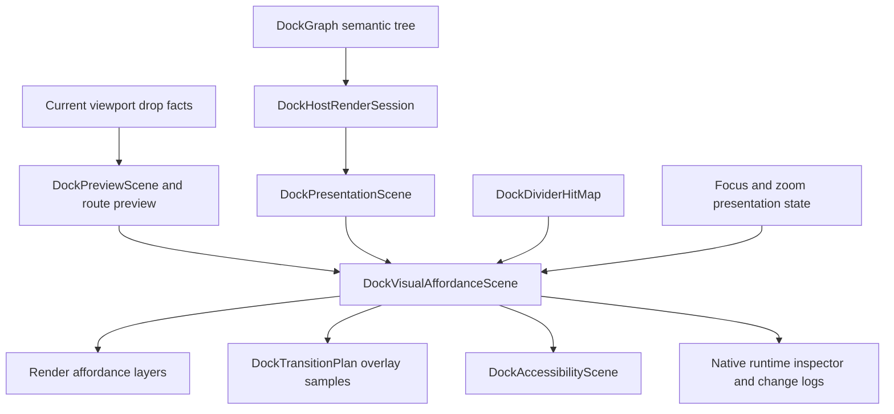
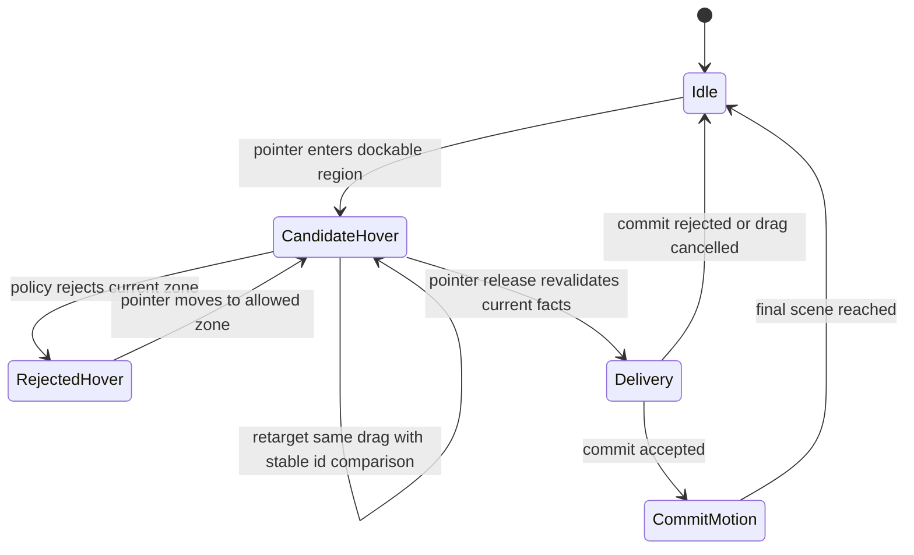

# Docking Visual Affordance Runtime Alignment - Plan

## Goal Capsule

| Field | Value |
| --- | --- |
| Objective | Turn docking's existing preview, overlay, motion, divider, focus, zoom, accessibility, and native debug surfaces into one capability-aligned visual affordance runtime. |
| Authority | `DockGraph` remains semantic mutation authority, current drop facts remain release authority, `DockPresentationScene` remains deterministic geometry authority, and a new affordance scene becomes the visual-feedback authority. |
| Scope posture | Fearless private refactor: crate-private affordance, render, overlay, transition, and test helpers may break; duplicated preview/render logic should be deleted once covered. |
| Execution profile | Characterization first, then descriptor unification, then render and motion migration, then accessibility/native proof, then cleanup. |
| Stop condition | Local and routed docking previews, center tab insertion, edge guide layers, divider/corner affordances, focus/zoom indicators, and native diagnostics are described by one testable affordance model and rendered without stale-target or placeholder artifacts. |

---

## Product Contract

### Summary

The recent docking work fixed the hardest correctness problems: multi-viewport drop authority, root and nested guide behavior, transition retargeting, shared motion timelines, render geometry convergence, and scene-owned deterministic facts.
The remaining UI/UX risk is that visual feedback is still spread across `DockPreviewScene`, `DockOverlayScene`, `DockTransitionPlan`, `DockDividerHitMap`, `DockAccessibilityScene`, render helpers, and native logs.
That fragmentation makes it easy to fix one hover case while another edge, tab insertion, rejected target, route marker, focus ring, or corner affordance regresses.

This plan aligns capabilities, not pixels.
Dear ImGui is the reference for target evaluation and preview layering: each candidate evaluates its own payload filters, preview and delivery stay separated, inner and outer split previews coexist, and tab-bar explicit targets keep distinct behavior.
BonSplit is the reference for lightweight tab drag preview and display-synchronized split animation discipline.
The SuperSplit notes are the reference for flat presentation, root-level overlay animation, final-size content reveal, synchronized focus views, cross-window drag/drop feedback, and accessibility integration.
Open GPUI should adopt the transferable shape without copying the platform implementation or styling.

### Problem Frame

`DockOverlayScene` already turns preview layers into renderable overlay layers, but it is still preview-shaped.
It knows target bodies, guide boxes, tab insertion, payload tabs, route markers, and rejected state; it does not own divider/corner affordances, focus/zoom overlays, accessibility phrasing, motion identity, or native debug facts.
`DockTransitionPlan` then has a second overlay transition enum, while accessibility independently maps presentation and overlay descriptors.

The consequence is architectural drift.
When a user drags near a non-center edge, the desired behavior is not merely "draw a rectangle"; the runtime must know which candidate won, which guides remain passive, whether the target is inner or outer, what release would do, what route marker belongs to the source window, what preview shape should animate, and what an assistive tool or debug panel should report.
Those are one product affordance, but the current implementation represents them as several local helper outputs.

The clean fix is a single crate-private `DockVisualAffordanceScene` derived from presentation, preview, route, divider, focus, zoom, and policy state.
Render, motion, accessibility, and native diagnostics consume that scene.
Old preview-specific and render-local affordance branches are deleted as the scene takes over.

### Requirements

**Capability alignment**

- R1. Docking must expose one visual affordance model for drop zones, guide boxes, target bodies, tab insertion, payload tab previews, route markers, rejected targets, divider handles, corner junctions, focus rings, and zoom/unzoom indicators.
- R2. The affordance model must distinguish semantic authority from visual feedback: current drop facts still authorize releases, while affordance descriptors explain what the user sees.
- R3. Local and routed previews must share target affordance semantics while keeping source-window route markers separate from target-window drop guides.
- R4. Inner and outer guide layers must remain visible and inspectable when an active root or parent edge target suppresses an inner release target, matching ImGui's split-inner and split-outer capability rather than pixel styling.
- R5. Center docking must describe tab insertion slot, payload tab shape, payload order, and target tab stack instead of falling back to a generic body rectangle.

**Runtime quality**

- R6. Affordance motion must use stable identities so hover retarget, preview retarget, focus movement, and route marker changes do not drift or interpolate from stale bounds.
- R7. New split, tab insertion, focus, and zoom feedback must render from final-size scene geometry with clipping, masking, or presence animation; placeholder rectangles are not acceptable as the primary runtime proof.
- R8. Reduced motion must preserve the same final affordance descriptors and accessibility state while replacing large spatial movement with immediate or low-motion feedback.
- R9. Pointer-coupled divider drags remain immediate, while programmatic divider, corner, focus, zoom, and dock-commit feedback may animate through shared `MotionTimeline` semantics.

**Accessibility, diagnostics, and examples**

- R10. Accessibility descriptors must be derived from the same affordance scene for drop destinations, rejected targets, focus regions, splitters, and corner resize states.
- R11. The native docking example must expose a compact runtime inspector for current viewport, hovered candidate, active affordance id, inner/outer layer state, route marker, motion state, and frame generation without requiring log spam.
- R12. Debug logs must remain useful for diagnosing stale facts and retarget churn, but steady hover should not continuously emit high-volume logs unless an explicit debug flag is enabled.

**Cleanup and verification**

- R13. Existing tests must be expanded to lock capability descriptors rather than screenshot or pixel parity.
- R14. Duplicated preview, overlay, transition, accessibility, and render-local affordance mapping must be deleted or narrowed once the affordance scene replaces it.
- R15. The plan must preserve the already shipped behavior for dock-float, routed cross-window docking, nested lower-right edge docking, stable edge guides, tab insertion preview, and render authority convergence.

### Acceptance Examples

- AE1. Given a tab dragged over the left edge of a nested lower-right pane, when the root also has an outer candidate, then the affordance scene exposes both passive inner guides and the active chosen target, and release still validates current drop facts.
- AE2. Given a tab dragged over a tab stack center, when center merge is allowed, then the scene exposes a tab insertion slot, payload tab previews in payload order, and no generic target body as the primary tab feedback.
- AE3. Given a routed cross-window drag, when the source and target windows render, then the source window exposes a route marker affordance and the target window exposes the same local target affordances it would expose for an in-window drag.
- AE4. Given a rejected center drop, when the pointer remains over the target, then the scene reports rejected state, disabled or unavailable zones, and an accessibility label that explains the destination is not currently available.
- AE5. Given a divider corner hover, when no drag is active, then corner affordance state is hover only at the junction; given a corner drag, both axes report active state and pointer drag remains immediate.
- AE6. Given a focus change or zoom/unzoom command, when motion is enabled, then focus/zoom indicators animate from stable affordance identities; when reduced motion is enabled, final descriptors and accessibility state are identical.
- AE7. Given steady hover over one target for multiple frames, when debug logging is enabled at normal docking debug level, then logs show state changes rather than repeated identical affordance frames.

### Scope Boundaries

#### In Scope

- A crate-private `DockVisualAffordanceScene` or equivalent descriptor layer.
- Migration of preview, route, divider, focus, zoom, accessibility, and native debug consumers to that descriptor layer.
- Stable affordance identities for motion retarget and debug summaries.
- Semantic tests for local, nested, routed, rejected, center-tab, edge-guide, divider-corner, focus, zoom, and reduced-motion behavior.
- Deletion of obsolete mapping helpers after coverage proves the replacement.

#### Deferred to Follow-Up Work

- Pixel-perfect styling parity with Dear ImGui, BonSplit, SuperSplit, or macOS.
- Native CoreAnimation/AppKit/UIKit-specific compositor integration.
- A public cross-crate animation builder API beyond the existing `ui_core` motion runtime.
- Full VoiceOver or platform automation adapter completeness beyond internal descriptor correctness.
- Broad redesign of docking persistence, public layout serialization, or window management policy.

#### Outside This Plan

- Replacing `DockGraph` with a persistent flat grid.
- Making affordance descriptors release tokens.
- Re-enabling Jellyflow examples or dependencies in normal workspace builds.
- Copying Swift or C++ reference code into Open GPUI.

---

## Planning Contract

### Current Findings

| Finding | Evidence | Planning implication |
| --- | --- | --- |
| Overlay descriptors exist but are preview-shaped. | `crates/gpui_docking/src/overlay_scene.rs` maps `DockPreviewScene` to target body, guide box, tab insertion, payload tab, payload ghost, route marker, and rejected layers. | Promote the concept into a broader affordance scene instead of adding more fields to preview-only structures. |
| Transition overlays duplicate overlay kinds. | `crates/gpui_docking/src/transition_geometry.rs` defines `DockOverlayTransitionKind` separately from `DockOverlayLayerKind`. | Stable affordance ids and kinds should feed transition sampling directly so render, motion, and debug agree. |
| Divider and corner affordances already have a scene-backed hit map. | `crates/gpui_docking/src/divider_hit_map.rs` derives targets from `DockPresentationScene` and computes corner hover or active state. | Fold divider and corner affordances into the shared visual model instead of leaving them as a parallel UX channel. |
| Accessibility has the right ingredients but separate construction. | `crates/gpui_docking/src/accessibility_scene.rs` maps presentation and overlay descriptors to roles including drop target, destination, rejected drop target, splitter, drag source, and focus region. | Accessibility should consume final affordance descriptors to avoid divergent bounds, labels, and active/disabled state. |
| ImGui keeps candidate evaluation local and preview/delivery separate. | `repo-ref/imgui/imgui.cpp` uses `AcceptDragDropPayload(...AcceptBeforeDelivery...)`, computes inner and outer preview data independently, renders inner then outer, and only queues docking on delivery. | Open GPUI should keep current drop facts as delivery authority while making visual layers explicit and inspectable. |
| BonSplit's visible polish is simple but disciplined. | `repo-ref/bonsplit/Sources/Bonsplit/Internal/Views/TabDragPreview.swift` uses a dedicated tab preview shape, and `SplitAnimator.swift` display-syncs and rounds divider position. | We need a first-class tab preview descriptor and pixel-stable sampling, not a one-off generic rectangle. |
| Motion runtime is already shared enough. | ADR 0015 and `DockTransitionExecutor` use `MotionTimeline` and retarget snapshots. | This plan should not invent a new engine; it should make affordance identities and samples consume the existing engine. |

### Key Technical Decisions

- KTD1. Add a visual affordance scene rather than extending `DockPreviewScene` into a catch-all. Preview remains target-resolution output; the affordance scene is render/motion/accessibility/debug input.
- KTD2. Keep release authority unchanged. Affordance descriptors are allowed to be richer than current drop facts, but release still revalidates the current runtime target.
- KTD3. Preserve ImGui's capability split. Inner and outer candidates, explicit tab-bar targets, preview before delivery, and delivery-only commits remain separate concepts in Open GPUI data.
- KTD4. Use stable affordance ids for all motion and logs. Ids must include kind, target node, zone, payload index, route identity, and layer where relevant so retargeting can match behavior, not just rectangles.
- KTD5. Make accessibility and diagnostics consumers, not side channels. If a visual affordance exists, accessibility and the native inspector should be able to name it from the same descriptor.
- KTD6. Keep pointer drags direct. Motion is appropriate for hover affordance presence, retarget, dock commit, focus, zoom, and programmatic split changes; divider pointer tracking stays immediate.
- KTD7. Delete compatibility helpers as soon as tests make them redundant. The project has not shipped publicly, so private API churn is preferable to keeping multiple authorities.

### High-Level Technical Design





### Descriptor Shape

The exact Rust names can change during implementation, but the model should contain these concepts:

- `DockVisualAffordanceScene` with `space`, `viewport`, `frame_generation`, `layers`, and optional `motion_summary`.
- `DockVisualAffordanceLayer` with `id`, `kind`, `bounds`, `draw_bounds`, `hit_bounds`, `target_node`, `zone`, `layer_scope`, `state`, `payload_index`, `title`, `motion_key`, and `accessibility`.
- `DockVisualAffordanceKind` variants for `DropTargetBody`, `GuideBox`, `TabInsertionSlot`, `PayloadTab`, `PayloadGhost`, `RouteMarker`, `RejectedTarget`, `DividerHandle`, `DividerCorner`, `FocusRing`, and `ZoomEgress`.
- `DockVisualAffordanceState` variants for `Idle`, `Passive`, `Hover`, `Active`, `Rejected`, `Disabled`, and `CommittedPreview`.
- `DockVisualLayerScope` variants for `Inner`, `Outer`, `RouteSource`, `RouteTarget`, `Floating`, `Focus`, and `Divider`.

### Sequencing

1. Characterize current capability descriptors and gaps before changing render paths.
2. Introduce the affordance scene and produce it in parallel with existing overlay outputs.
3. Migrate render and transition overlay consumers to the affordance scene.
4. Migrate accessibility and native diagnostics to the affordance scene.
5. Delete superseded mapping code and update docs/memory after verification.

### Risks And Mitigations

| Risk | Mitigation |
| --- | --- |
| The affordance scene becomes a new god object. | Keep it derived and render-facing only; semantic mutation stays in `DockGraph`, and release authority stays in current facts. |
| Tests overfit implementation names. | Assert stable capability descriptors, layer counts, target ids, states, and bounds relationships rather than exact styling. |
| Motion retargeting reintroduces stale geometry. | Motion uses stable affordance ids plus current sampled bounds; release still uses current facts. |
| Accessibility labels drift from visual state. | Build accessibility descriptors from the same affordance layer metadata, not a separate policy branch. |
| Native inspector adds noise. | Make it a compact UI/debug surface and rate-limit logs to state changes. |

---

## Implementation Units

### U1. Characterize current affordance capability gaps

- **Goal:** add focused tests that describe the desired capability model before replacing implementation paths.
- **Requirements:** R1, R3, R4, R5, R13, R15, AE1, AE2, AE3, AE4.
- **Dependencies:** None.
- **Files:** `crates/gpui_docking/src/host_viewport_preview_tests.rs`, `crates/gpui_docking/src/host_viewport_preview_visual_tests.rs`, `crates/gpui_docking/src/host_viewport_route_tests.rs`, `crates/gpui_docking/src/host_render_tests.rs`, `crates/gpui_docking/src/host_test_support.rs`.
- **Approach:** add descriptor-oriented assertions for nested inner/outer edge hover, center tab insertion, rejected center or edge targets, and routed source/target split. Use current preview and overlay outputs first, even if the tests require small helper descriptors.
- **Test scenarios:** nested lower-right edge hover exposes passive and active layers; center tab hover exposes insertion and payload order; routed source only exposes route marker; target exposes local target layers; rejected target exposes disabled or rejected state.
- **Verification:** run `cargo nextest run -p open-gpui-docking host_viewport_preview_tests host_viewport_preview_visual_tests host_viewport_route_tests --no-fail-fast`.

### U2. Introduce `DockVisualAffordanceScene`

- **Goal:** create one crate-private affordance descriptor layer that unifies preview, route, divider, focus, zoom, and debug metadata.
- **Requirements:** R1, R2, R3, R4, R5, R6, R10, R13, AE1, AE2, AE3, AE4, AE5.
- **Dependencies:** U1.
- **Files:** `crates/gpui_docking/src/visual_affordance_scene.rs`, `crates/gpui_docking/src/lib.rs`, `crates/gpui_docking/src/overlay_scene.rs`, `crates/gpui_docking/src/drop_preview.rs`, `crates/gpui_docking/src/divider_hit_map.rs`, `crates/gpui_docking/src/zoom_state.rs`, `crates/gpui_docking/src/host_presentation_scene_tests.rs`.
- **Approach:** derive visual affordance layers from `DockPresentationScene`, `DockPreviewScene`, route preview, divider hit map state, focus regions, and zoom egress state. Keep `DockOverlayScene` alive as an adapter initially, but make its data come from the visual affordance scene rather than the other way around where practical.
- **Test scenarios:** scene ids are stable across identical frames; passive and active guide layers are both represented; tab insertion contains target stack and insert index; divider corner state maps into an affordance; focus and zoom descriptors carry motion keys.
- **Verification:** run focused unit and presentation tests for the new scene plus U1 tests.

### U3. Migrate render and motion consumers

- **Goal:** make visible docking feedback and overlay transition sampling consume visual affordance descriptors.
- **Requirements:** R6, R7, R8, R9, R13, R14, R15, AE1, AE2, AE3, AE6.
- **Dependencies:** U2.
- **Files:** `crates/gpui_docking/src/render.rs`, `crates/gpui_docking/src/render_tabs.rs`, `crates/gpui_docking/src/overlay_scene.rs`, `crates/gpui_docking/src/transition_geometry.rs`, `crates/gpui_docking/src/transition_executor.rs`, `crates/gpui_docking/src/host_transition_tests.rs`, `crates/gpui_docking/src/host_render_tests.rs`.
- **Approach:** replace render-local overlay kind switches and transition-local overlay mapping with affordance-layer rendering and sampling. Keep current styling tokens where acceptable, but remove generic rectangle fallbacks for tab insertion and payload tabs when the affordance carries a richer shape.
- **Test scenarios:** hover retarget keeps stable identities; tab insertion preview does not drift across frames; route marker and target guide transitions sample separately; reduced motion yields the same final descriptors; steady identical affordance frames do not churn transition state.
- **Verification:** run `cargo nextest run -p open-gpui-docking host_transition_tests host_render_tests host_viewport_preview_visual_tests --no-fail-fast`.

### U4. Migrate accessibility and native diagnostics

- **Goal:** make assistive and diagnostic surfaces report the same affordance model users see.
- **Requirements:** R10, R11, R12, R13, AE4, AE5, AE6, AE7.
- **Dependencies:** U2, U3.
- **Files:** `crates/gpui_docking/src/accessibility_scene.rs`, `crates/gpui_docking/src/host_accessibility_tests.rs`, `crates/gpui_docking/src/debug.rs`, `crates/gpui_docking/src/host_debug.rs`, `examples/docking-native/src/main.rs`, `examples/docking-native/Cargo.toml`.
- **Approach:** route overlay accessibility descriptors through visual affordance accessibility metadata. Add a compact native inspector panel for active affordance id, layer scope, state, target node, zone, route status, frame generation, and motion state. Change debug logging to emit state changes and summarized churn counters rather than repeated identical frames.
- **Test scenarios:** rejected targets have disabled or rejected accessible state; drop destinations carry current zone labels; divider corners expose two-axis resize affordance; debug summary changes on retarget but not steady hover.
- **Verification:** run `cargo nextest run -p open-gpui-docking host_accessibility_tests host_divider_hit_map_tests host_debug --no-fail-fast` and `cargo check -p open-gpui-docking-native`.

### U5. Delete superseded preview and overlay mapping paths

- **Goal:** remove duplicate or obsolete code once the affordance scene owns the visual-feedback contract.
- **Requirements:** R14, R15.
- **Dependencies:** U3, U4.
- **Files:** `crates/gpui_docking/src/overlay_scene.rs`, `crates/gpui_docking/src/drop_preview.rs`, `crates/gpui_docking/src/transition_geometry.rs`, `crates/gpui_docking/src/render.rs`, `crates/gpui_docking/src/host_test_support.rs`, `docs/verification.md`.
- **Approach:** delete preview-to-overlay conversion code that is now adapter-only or unused, collapse duplicate overlay enums where possible, and keep only compatibility shims that have an explicit measurement or API boundary reason.
- **Test scenarios:** no tests depend on old overlay-only descriptors; affordance tests still cover all local, routed, rejected, and tab insertion cases; `rg` does not find unused compatibility helpers.
- **Verification:** run `cargo fmt --all -- --check`, `cargo nextest run -p open-gpui-docking --no-fail-fast`, `cargo check -p open-gpui-docking`, `cargo check -p open-gpui-docking-native`, and `git diff --check`.

### U6. Document the runtime contract and dogfood flows

- **Goal:** leave durable guidance for future docking UI/UX work so the next fix does not bypass the affordance model.
- **Requirements:** R11, R12, R13, R14, R15.
- **Dependencies:** U1, U2, U3, U4, U5.
- **Files:** `docs/verification.md`, `docs/knowledge/engineering/current-state.md`, `docs/knowledge/engineering/progress/2026-07-03-docking-visual-affordance-runtime.md`, and a new ADR only if implementation changes ADR 0010, ADR 0011, or ADR 0015 boundaries.
- **Approach:** document the affordance authority hierarchy, native dogfood command, expected inspector fields, and the distinction between capability alignment and pixel parity. Add an ADR only if the implementation moves a boundary across `ui_core`, `ui_components`, GPUI adapter code, or docking.
- **Test scenarios:** documentation references only commands and files that exist; verification commands match this plan.
- **Verification:** run the repository wiki validation command if present and include the manual native command in `docs/verification.md`.

---

## Verification Contract

| Gate | Command | Covers |
| --- | --- | --- |
| Formatting | `cargo fmt --all -- --check` | All Rust edits |
| Preview and routing | `cargo nextest run -p open-gpui-docking host_viewport_preview_tests host_viewport_preview_visual_tests host_viewport_route_tests --no-fail-fast` | U1, U2, U3 |
| Render and transition | `cargo nextest run -p open-gpui-docking host_render_tests host_transition_tests host_render_geometry_parity_tests --no-fail-fast` | U3, U5 |
| Accessibility, divider, and debug | `cargo nextest run -p open-gpui-docking host_accessibility_tests host_divider_hit_map_tests host_debug --no-fail-fast` | U2, U4 |
| Interaction regression | `cargo nextest run -p open-gpui-docking host_interaction_tests host_outside_release host_viewport_drop --no-fail-fast` | Release authority and drag behavior |
| Full docking crate | `cargo nextest run -p open-gpui-docking --no-fail-fast` | U1-U6 integration |
| Crate checks | `cargo check -p open-gpui-docking` and `cargo check -p open-gpui-docking-native` | Library and native example compile |
| Diff hygiene | `git diff --check` | Whitespace and patch hygiene |

### Focused Native Dogfood

Run:

```bash
RUST_LOG=info,open_gpui_docking=debug,open_gpui=info RUST_BACKTRACE=1 cargo run -p open-gpui-docking-native --bin open-gpui-docking-native 2>&1 | tee /tmp/open-gpui-docking-native.log
```

Manual flows:

- Drag a tab from a child window to the main window top, left, right, bottom, and center.
- Drag a tab over the main window's upper-right and lower-right nested panes, including each non-center edge.
- Drag over center tab insertion and verify the preview communicates tab placement, not a generic body split.
- Drag between viewports and verify source route marker and target guides are distinct.
- Hover divider handles and corner junctions, then drag a corner and confirm both axes resize without pointer-lag animation.
- Toggle reduced-motion behavior if a runtime setting exists; otherwise use deterministic tests for reduced-motion semantics.
- Watch the native inspector for active affordance id and state changes; steady hover should not flood identical debug lines.

---

## Definition of Done

- Every requirement R1-R15 has at least one test, debug proof, documentation update, or explicit deferred note.
- `DockVisualAffordanceScene` or its equivalent is the single input for render affordance layers, overlay motion samples, accessibility overlay descriptors, and native debug summaries.
- Current drop facts remain release authority, and no affordance descriptor can commit stale targets by itself.
- Inner/outer edge guide visibility, center tab insertion, routed previews, rejected targets, divider corner affordances, focus/zoom feedback, and reduced-motion semantics are covered by focused tests.
- Obsolete preview-to-overlay, overlay-to-transition, render-local, or accessibility-local mapping code is deleted unless a comment and test explain why it remains.
- The native docking example compiles and offers enough inspector state to diagnose hover target, layer state, route marker, frame generation, and motion churn without relying on repeated logs.
- `cargo fmt --all -- --check`, the focused nextest gates, `cargo nextest run -p open-gpui-docking --no-fail-fast`, `cargo check -p open-gpui-docking`, `cargo check -p open-gpui-docking-native`, and `git diff --check` pass.
