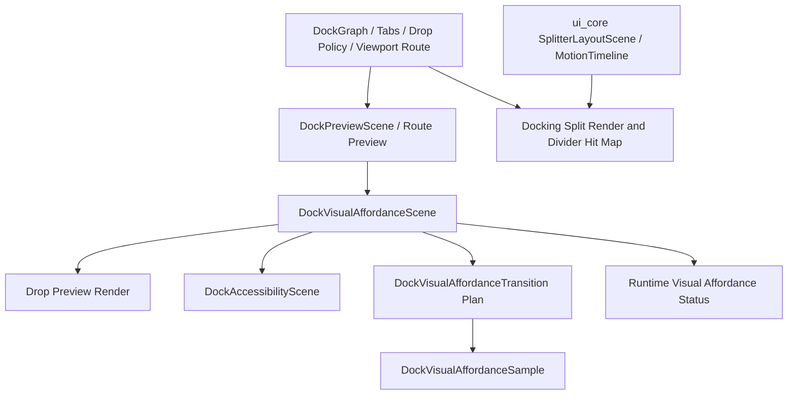

# Docking Affordance Authority Cleanup - Plan

## Goal Capsule

| Field | Value |
|---|---|
| Objective | Finish the partially migrated docking visual-feedback architecture by making visual affordance descriptors the main runtime contract for preview, motion, diagnostics, and split-motion cleanup. |
| Authority | This plan follows the user's explicit direction to allow breaking crate-private API, remove unnecessary code, and refactor aggressively before public release. |
| Execution profile | Deep cross-cutting Rust refactor across `open-gpui-docking`, `open-gpui-ui-core`, and the native docking example. |
| Stop conditions | Stop only for a product-scope contradiction, a public API break that cannot be resolved locally, or a verification failure that reveals a wrong architectural assumption. |
| Tail ownership | `ce-work` or goal-mode execution owns implementation, focused tests, simplification, review, commits, and final verification. |

---

## Product Contract

### Summary

Docking visual feedback has a new `DockVisualAffordanceScene`, but several runtime paths still route through older overlay and docking-local split abstractions.
This plan finishes the migration: target preview rendering should treat visual affordance as the semantic contract, motion APIs should use affordance naming, diagnostics should flow through runtime status, and split/motion duplicate geometry should be collapsed where it is already backed by `ui_core` primitives.

### Problem Frame

The current code works, but it carries two mental models at once.
`DockOverlayScene` is documented as a render adapter while still driving target drop-preview rendering and payload-tab layout.
Transition planning already receives `DockVisualAffordanceScene`, but the plan, executor, samples, debug regions, and tests still say overlay.
The native status panel reads `DockHost` handles directly for visual diagnostics instead of consuming the viewport runtime status surface.
Split and motion primitives exist in `ui_core`, but docking still repeats enough share, hit-map identity, and reveal interpolation logic that future animation work would extend the wrong layer.

### Requirements

**Affordance Authority**

- R1. Target drop-preview rendering must treat `DockVisualAffordanceScene` as the semantic source for body, guide, tab insertion, payload tab, payload ghost, route marker, and rejected-target feedback.
- R2. `DockOverlayScene` must either be removed or reduced to a narrow render adapter whose names and tests cannot be mistaken for the semantic preview contract.
- R3. Payload-tab layout must stop using overlay-named types so measured tab preview geometry belongs to preview or affordance rendering instead of overlay semantics.

**Motion and Diagnostics**

- R4. Visual-feedback motion APIs must use visual-affordance naming for transitions, samples, host facade methods, debug regions, and focused tests.
- R5. Native runtime diagnostics must expose visual affordance summary through `DockViewportRuntimeStatus` or a runtime-owned diagnostic snapshot rather than requiring the example panel to retain `DockHost` handles.
- R6. Public diagnostic API must have an intentional boundary: either runtime-owned diagnostics remain public, or host-local debug helpers are crate-private/test-only.

**Split and Animation Foundation**

- R7. Docking split rendering, divider hit mapping, and transition sampling must reuse existing `ui_core` split/motion primitives where they already model the same geometry or timeline concept.
- R8. The refactor must not move docking graph, tab insertion, viewport routing, drop-zone, focus, zoom, or policy semantics into `ui_core`.
- R9. Existing native UX behavior must remain stable: preview affordances, route markers, tab previews, reduced-motion semantics, and current-target drop behavior stay aligned with the already-tested behavior.

### Scope Boundaries

In scope:

- Breaking crate-private docking APIs, test helpers, and debug selectors when the new names express the correct model.
- Deleting adapter code and compatibility helpers once the render path no longer depends on them.
- Updating engineering memory and ADR/progress docs when the boundary changes.

Deferred to follow-up work:

- A broad public animation framework, compositor integration, springs, keyframes, or CoreAnimation/AppKit backends.
- Pixel-level parity with Dear ImGui, BonSplit, or SuperSplit.
- Moving docking graph, tab, route, viewport, or drop policy semantics into `ui_core`.
- Rewriting unrelated gallery, table, or general UI component architecture.

### Acceptance Examples

- AE1. When a tab is dragged over a center target, the rendered body, insertion slot, payload tabs, accessibility elements, and motion plan are all derived from one visual affordance descriptor path.
- AE2. When a route marker is shown for cross-viewport drag feedback, no overlay adapter is involved before motion/debug/accessibility sampling.
- AE3. When the native status panel renders, it reads runtime diagnostics without retaining or updating host window handles.
- AE4. When transition tests inspect focus rings, route markers, and payload ghosts, they use affordance transition/sample names rather than overlay names.
- AE5. When split rendering and divider hit mapping use shared split primitives, docking-specific graph and resize semantics remain local.

---

## Planning Contract

### Key Technical Decisions

- KTD1. Promote visual affordance from adapter output to render input. `DockVisualAffordanceScene` should own semantic layer identity and query helpers; rendering may still keep small style helpers, but they should consume affordance layers.
- KTD2. Split overlay cleanup into two tracks. First remove overlay from transition/motion naming, then collapse or rename `DockOverlayScene` only after target preview rendering no longer needs it as the primary descriptor.
- KTD3. Move visual diagnostics to runtime-owned status. The native example should display a runtime snapshot; host-local debug functions should become implementation detail unless they are intentionally exported through runtime diagnostics.
- KTD4. Keep `ui_core` primitive boundaries narrow. `ui_core` may own renderer-neutral split layout, hit maps, motion timeline, identity retargeting, and generic bounds sampling; docking owns graph semantics and visual-affordance meaning.
- KTD5. Prefer characterization tests before deleting old adapters. The current behavior is subtle and UI-facing, so each deletion or rename should first be locked by focused tests that assert descriptor equivalence or runtime status shape.

### High-Level Technical Design

The target state has one semantic path for visual feedback and one primitive path for renderer-neutral split/motion mechanics.
Render styling and docking policy remain local adapters, not new owners.

### Sequencing

1. Characterize and expose affordance-level drop-preview queries before deleting overlay-owned assumptions.
2. Rename transition/motion APIs after affordance identity is stable, because the rename is broad and should be behavior-preserving.
3. Move diagnostics into runtime status once motion naming is settled, so debug summaries no longer reference overlay executor state.
4. Collapse split/motion duplication after the feedback architecture is clean, because split cleanup depends on stable transition naming.
5. Update docs, engineering memory, and broad verification last.

### Assumptions

- The branch is still pre-release enough that crate-private API breaks and debug selector renames are acceptable.
- Public user-facing behavior should not regress even when internal names and adapters change.
- Existing focused docking nextest suites are the primary proof; native example manual dogfood remains useful but not the only gate.

### Alternative Approaches Considered

| Alternative | Decision |
|---|---|
| Keep overlay names because they work today. | Rejected. The old names now describe more than drop-preview overlays and would keep misleading future animation work. |
| Delete `DockOverlayScene` immediately. | Rejected as first step. Guide rendering and payload tab measurement still depend on render-specific details, so deletion should follow affordance query extraction. |
| Move all split and animation semantics into `ui_core`. | Rejected. `ui_core` should not know docking graph, tabs, viewport routing, or drop policy. |
| Focus only on native diagnostics and leave architecture residue. | Rejected. Diagnostics are a symptom of the same split authority problem. |

---

## Implementation Units

### U1. Make Target Preview Consume Visual Affordance

**Goal:** Move target drop-preview semantic rendering inputs from `DockOverlayScene` to `DockVisualAffordanceScene` and add affordance query helpers for body, guides, tab insertion, payload tabs, payload ghosts, and rejected targets.

**Requirements:** R1, R2, R3, R9; covers AE1 and AE2.

**Dependencies:** None.

**Files:**

- `crates/gpui_docking/src/visual_affordance_scene.rs`
- `crates/gpui_docking/src/overlay_scene.rs`
- `crates/gpui_docking/src/render.rs`
- `crates/gpui_docking/src/accessibility_scene.rs`
- `crates/gpui_docking/src/host_viewport_preview_visual_tests.rs`
- `crates/gpui_docking/src/host_render_tests.rs`
- `crates/gpui_docking/src/host_accessibility_tests.rs`

**Approach:** Add affordance-level query methods and measured payload preview layout types with neutral names.
Change `render_target_drop_preview` so it builds the visual affordance scene first, applies measured payload layout to that scene or a neutral preview-layout descriptor, then renders guides/body/tabs from affordance data.
Keep a small render adapter only if rendering still needs `DockPreviewDropBox` style metadata; do not let tests assert overlay layer order as the semantic contract.

**Execution note:** Start with characterization coverage that proves visual affordance queries produce the same body, guide, payload-tab, and accessibility geometry currently produced through overlay fixtures.

**Patterns to follow:**

- `DockVisualAffordanceScene::from_route_preview` as the direct route-marker path.
- `DockAccessibilityScene::visual_affordance_elements_for_render` as the completed consumer boundary.
- Existing payload-tab measured layout tests in `host_viewport_preview_visual_tests.rs`.

**Test scenarios:**

- Center drop with payload tabs produces active body, insertion slot, payload tab, and payload ghost affordance layers without requiring an overlay scene fixture.
- Edge/root drop suppresses tab insertion and payload tabs while preserving guide affordances.
- Rejected target produces a rejected-target affordance with stable bounds and accessibility label.
- Route preview continues to create route marker affordance layers without overlay involvement.
- Measured payload tab layout updates body, insertion, payload tab, and ghost bounds consistently.

**Verification:** Focused preview, render, and accessibility tests pass, and a code search shows target-preview semantic consumers no longer call `DockVisualAffordanceScene::from_overlay_scene` as their main path.

### U2. Rename Overlay Motion To Affordance Motion

**Goal:** Rename transition/motion types, fields, host facade methods, debug regions, and tests from overlay terminology to visual affordance terminology.

**Requirements:** R4, R9; covers AE4.

**Dependencies:** U1.

**Files:**

- `crates/gpui_docking/src/transition_geometry.rs`
- `crates/gpui_docking/src/transition_executor.rs`
- `crates/gpui_docking/src/host.rs`
- `crates/gpui_docking/src/presentation_commands.rs`
- `crates/gpui_docking/src/render.rs`
- `crates/gpui_docking/src/debug.rs`
- `crates/gpui_docking/src/host_transition_tests.rs`
- `crates/gpui_docking/src/host_zoom_focus_tests.rs`
- `crates/gpui_docking/src/host_interaction_tests.rs`
- `crates/gpui_docking/src/host_render_tests.rs`

**Approach:** Mechanically migrate `DockOverlayTransition`, `DockOverlayTransitionKind`, `DockOverlaySample`, `overlay_transitions`, `overlays`, and host facade methods to visual-affordance names.
Keep behavior identical and keep any remaining drop-preview render adapter names separate from motion API naming.
Update debug selectors only when tests and native tooling can follow the new name.

**Execution note:** Treat this as a behavior-preserving rename; run focused motion tests before and after to catch accidental semantic changes.

**Patterns to follow:**

- `DockTransitionPlan::from_visual_affordance_scene` already names the correct input.
- `DockVisualAffordanceDebugSummary` already names the diagnostic concept correctly.

**Test scenarios:**

- Transition plans created from target preview affordances include body, tab insertion, payload tab, and payload ghost affordance transitions.
- Focus-ring transitions are not described as overlay samples in tests or debug summaries.
- Route-marker and rejected-target transitions preserve reduced-motion and animated behavior after the rename.
- Replacement/retarget tests still match by stable visual affordance identity.

**Verification:** Focused transition, zoom/focus, interaction, and render tests pass, and `rg` finds no crate-local motion API residue named `DockOverlayTransition` or `DockOverlaySample`.

### U3. Move Visual Diagnostics Into Runtime Status

**Goal:** Make viewport runtime status the single diagnostics surface consumed by the native status panel for visual affordance summaries.

**Requirements:** R5, R6, R9; covers AE3.

**Dependencies:** U2.

**Files:**

- `crates/gpui_docking/src/debug.rs`
- `crates/gpui_docking/src/host_debug.rs`
- `crates/gpui_docking/src/host.rs`
- `crates/gpui_docking/src/render.rs`
- `crates/gpui_docking/src/viewport_runtime.rs`
- `crates/gpui_docking/src/viewport_runtime_handle.rs`
- `crates/gpui_docking/src/viewport_runtime_status.rs`
- `crates/gpui_docking/src/lib.rs`
- `examples/docking-native/src/main.rs`
- `crates/gpui_docking/src/host_viewport_lifecycle_tests.rs`
- `crates/gpui_docking/src/host_viewport_platform_capability_tests.rs`
- `crates/gpui_docking/src/host_debug.rs`

**Approach:** Add a runtime-owned visual affordance diagnostic record keyed by dock space and window id.
Have host rendering publish compact summaries to the runtime when the last visual affordance scene changes or clears.
Change `RuntimeStatusPanel` so it formats runtime status records instead of retaining `WindowHandle<DockHost>` values.
After the native example no longer needs direct host access, make `DockHost::visual_affordance_debug_summary` crate-private or test-only unless a public host-level debug API is intentionally retained.

**Execution note:** Add lifecycle tests before removing host-handle registration from the example; stale diagnostics after viewport close/reopen are the main regression risk.

**Patterns to follow:**

- Existing `DockViewportRuntimeStatus` last-route, last-drop, lifecycle, and platform-sync records.
- Existing native runtime status formatting helpers in `examples/docking-native/src/main.rs`.

**Test scenarios:**

- A rendered host with active affordance layers publishes a runtime status record for its space and window id.
- Clearing a drop preview clears or updates the runtime visual affordance record without stale active layers.
- Closing a viewport removes or marks the corresponding visual affordance record so the status panel does not query a missing window.
- Reopening a viewport publishes a fresh record rather than reusing a stale host handle.
- Native status formatting still shows compact active kind, scope, state, target node, zone, payload index, and motion state.

**Verification:** Runtime status tests and native example tests pass, and the example no longer stores `hosts: Vec<(DockSpaceId, WindowHandle<DockHost>)>` for diagnostics.

### U4. Collapse Split And Motion Geometry Duplication

**Goal:** Reduce docking-local split/motion duplication now that `ui_core` owns split layout scenes, hit maps, and motion timelines.

**Requirements:** R7, R8, R9; covers AE5.

**Dependencies:** U2.

**Files:**

- `crates/gpui_docking/src/split_geometry.rs`
- `crates/gpui_docking/src/render_split.rs`
- `crates/gpui_docking/src/divider_hit_map.rs`
- `crates/gpui_docking/src/presentation_scene.rs`
- `crates/gpui_docking/src/transition_geometry.rs`
- `crates/gpui_docking/src/transition_executor.rs`
- `crates/ui_core/src/split.rs`
- `crates/ui_core/src/motion.rs`
- `crates/gpui_docking/src/host_presentation_scene_tests.rs`
- `crates/gpui_docking/src/host_divider_hit_map_tests.rs`
- `crates/gpui_docking/src/host_render_geometry_parity_tests.rs`
- `crates/gpui_docking/src/host_transition_tests.rs`

**Approach:** Audit docking-local helpers against `ui_core` equivalents and delete duplicate share, handle-center, hit-map identity, preferred-edge, reveal, and bounds interpolation logic where a shared primitive already exists.
If a helper still encodes docking graph semantics, keep it in docking but rename it to make the ownership clear.
Avoid expanding `ui_core` with docking concepts; add only renderer-neutral helper surfaces that multiple adapters can reuse.

**Execution note:** This unit should be characterization-first because past split/render changes have relied on geometry parity tests.

**Patterns to follow:**

- `open_gpui_ui_core::SplitterLayoutScene` and `SplitterHitMap`.
- `open_gpui_ui_core::MotionTimeline` and `retarget_motion_snapshots`.
- Existing `host_render_geometry_parity_tests.rs` scene-vs-render parity coverage.

**Test scenarios:**

- Split render shares and handle centers match the presentation/core split scene for horizontal and vertical splits.
- Divider hit-map targets preserve single-handle and corner behavior without fake `"before"` / `"after"` identity leaking into docking code.
- Transition reveal and bounds interpolation still satisfy reduced-motion, retarget, entering, leaving, and moving pane cases.
- Zoom egress and focus transitions continue to use docking-owned semantics while sharing generic motion sampling.

**Verification:** `ui_core` split/motion tests and focused docking render geometry, divider hit-map, and transition tests pass, with deleted duplicate helpers confirmed by code search.

### U5. Update Contracts, Docs, And Broad Verification

**Goal:** Record the new architecture boundary and run the focused-to-broad verification tail.

**Requirements:** R1-R9.

**Dependencies:** U1, U2, U3, U4.

**Files:**

- `docs/adr/0010-docking-presentation-scene-motion-model.md`
- `docs/adr/0011-docking-split-motion-primitive-boundary.md`
- `docs/adr/0012-docking-runtime-capability-alignment.md`
- `docs/adr/0015-ui-motion-runtime-foundation.md`
- `docs/knowledge/engineering/current-state.md`
- `docs/knowledge/engineering/log.md`
- `docs/knowledge/engineering/progress/2026-07-03-docking-visual-affordance-runtime.md`
- `docs/verification.md`

**Approach:** Update only the docs that remain authoritative after the implementation.
Prefer amending current-state/progress docs over creating a parallel narrative.
If the refactor materially changes an ADR boundary, append a concise supersession note rather than rewriting history.

**Execution note:** Documentation should follow verified code, not lead it.

**Patterns to follow:**

- Existing engineering wiki progress entries under `docs/knowledge/engineering/progress/`.
- ADR 0015 for the established motion runtime boundary.

**Test scenarios:**

- Test expectation: none -- this unit is documentation and verification reporting, not runtime behavior.

**Verification:** Documentation references current type names and boundaries, engineering wiki validation passes, and the full verification contract below has been run or any skipped gate has a documented reason.

---

## Verification Contract

| Gate | Applies to | Done signal |
|---|---|---|
| Focused affordance preview tests | U1 | `open-gpui-docking` preview visual, render, and accessibility tests pass with affordance-level fixtures. |
| Focused motion tests | U2 | Transition, interaction, zoom/focus, and render transition tests pass after motion API rename. |
| Runtime diagnostics tests | U3 | Viewport lifecycle/status tests and native status panel tests pass without direct host-handle diagnostics. |
| Split/motion primitive tests | U4 | `open-gpui-ui-core` split/motion tests and docking geometry/divider/transition tests pass. |
| Package checks | U1-U5 | `cargo check` succeeds for docking, native docking example, and touched UI core crates. |
| Formatting and diff hygiene | U1-U5 | `cargo fmt --all -- --check` and `git diff --check` are clean. |
| Broad docking gate | U1-U5 | `cargo nextest run -p open-gpui-docking --no-fail-fast` passes or any non-deterministic local failure is isolated and documented. |
| Engineering memory | U5 | Engineering wiki validation passes after progress/current-state updates. |

---

## Definition of Done

- `DockVisualAffordanceScene` is the visual feedback semantic authority for target preview, route preview, accessibility, motion, and diagnostics.
- Overlay-named transition and sample APIs are gone from active docking motion code.
- Native docking runtime status panel consumes runtime diagnostics instead of host window handles.
- Duplicate split/motion helpers are deleted or renamed to express docking-owned semantics.
- Tests lock center tab preview, edge/root preview, route marker, rejected target, focus ring, reduced-motion, divider corner, and viewport lifecycle diagnostics behavior.
- Documentation and engineering memory explain the final boundary without preserving obsolete overlay-as-authority wording.
- The final diff contains no abandoned compatibility adapters, unused code, or stale tests kept only to satisfy old names.

---

## Risks And Mitigations

| Risk | Mitigation |
|---|---|
| Broad rename causes accidental behavior change. | Land motion rename as a behavior-preserving unit after affordance preview tests are stable. |
| Removing overlay fixtures weakens payload-tab preview coverage. | Replace order/index assertions with affordance semantic assertions plus focused render layout tests. |
| Runtime diagnostics update creates stale records across viewport lifecycle. | Add close/reopen lifecycle tests before deleting host-handle diagnostics. |
| Split primitive cleanup leaks docking semantics into `ui_core`. | Only move renderer-neutral math/timeline helpers; keep graph, tabs, routes, and drop policy local. |
| Full docking gate is expensive or flaky locally. | Run focused gates first, then broad package gate; document any isolated infrastructure failure with the focused pass evidence. |

---

## Sources And Research

- `docs/knowledge/engineering/progress/2026-07-03-docking-visual-affordance-runtime.md` records the current partial migration and notes `DockOverlayScene` as a remaining render adapter.
- `docs/knowledge/engineering/progress/2026-07-02-ui-motion-runtime-foundation.md` defines the shared motion runtime boundary: `ui_core` owns timing and identity matching, adapters own semantics and rendering.
- `docs/knowledge/engineering/progress/2026-06-30-docking-split-motion-primitives.md` records the intended split primitive boundary between `ui_core`, `ui_components`, and docking.
- Prior read-only subagent audits on this branch identified four remaining refactor lines: overlay/affordance authority, transition API naming, native diagnostics data flow, and split/motion primitive convergence.
- Current code references include `crates/gpui_docking/src/visual_affordance_scene.rs`, `crates/gpui_docking/src/overlay_scene.rs`, `crates/gpui_docking/src/transition_geometry.rs`, `crates/gpui_docking/src/transition_executor.rs`, `crates/gpui_docking/src/viewport_runtime_status.rs`, `crates/gpui_docking/src/render_split.rs`, and `crates/ui_core/src/split.rs`.
