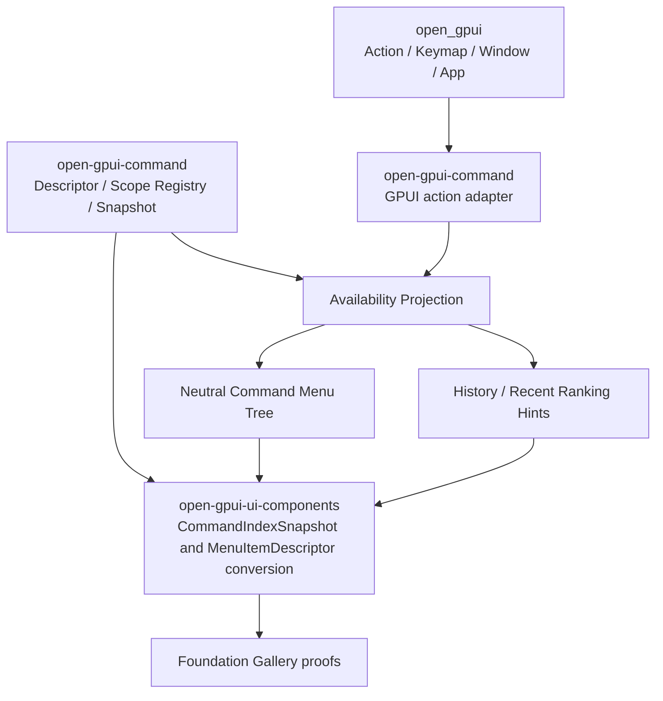

# Open GPUI Command Crate Extraction - Plan

## Goal Capsule

| Field | Plan |
|---|---|
| Objective | Promote the command ecosystem from UI-component helpers into a first-class `open-gpui-command` crate with scoped registration, availability projection, menu projection, usage history, and GPUI action dispatch glue. |
| Authority hierarchy | `open_gpui` owns `Action`, keymap/chord/context matching, and dispatch; `open-gpui-command` owns command metadata, scoped registry, availability, menu/history projection, and GPUI action mapping; `open-gpui-ui-components` owns palette/menu rendering and UI state. |
| Execution profile | Fearless refactor is allowed. Break public paths when they remove the wrong owner, delete obsolete `ui_core` command ownership, and update all first-party callers/tests/docs. |
| Stop conditions | Stop and re-plan if implementation requires a second keymap engine, a Vim mode engine, persistent storage in the core command crate, a Zed workspace/application architecture import, or `open-gpui-command` depending on `open-gpui-ui-components`. |

---

## Product Contract

### Summary

This plan extracts the command ecosystem into a reusable crate and deepens it into an app/plugin command infrastructure layer.
The UI crates keep rendering authority, while command metadata, scoped contribution management, availability, shortcut projection, dispatch, menu projection, and memory-backed history move behind a cleaner crate boundary.

### Problem Frame

The first command ecosystem slice proved the shape but left ownership split incorrectly: neutral metadata lives in `open_gpui_ui_core`, while GPUI action/keymap glue lives under `open_gpui_ui_components::gpui_adapter`.
That was acceptable as a proving slice, but it is now the wrong long-term architecture because command infrastructure is not a UI component contract and the adapter API already mixes command ids with `CommandIndexSnapshot` and `CommandSelection`.

Reference research reinforces the split.
Zed is useful because its command palette projects currently available actions from focus/context, displays shortcuts through the same keymap precedence, and records command/query history.
cmdk is useful because it treats stable `value` as selection identity and separates value, keywords, filtering, grouping, loading, and pre-ranked modes.
Neither should be copied wholesale: Open GPUI should not import Zed's workspace picker architecture, SQLite command-palette persistence, extension host, or a DOM-authoritative compound component model.

### Requirements

**Crate and ownership**

- R1. Add `open-gpui-command` as the canonical command ecosystem crate for metadata, registry, scoped projection, availability, history, menu projection, shortcut projection, and GPUI action dispatch adapters.
- R2. Remove command metadata ownership from `open-gpui-ui-core`; first-party crates should import command ecosystem types from `open-gpui-command` or intentional re-exports, not from `ui_core::command`.
- R3. Keep `open-gpui-command` independent of `open-gpui-ui-components`; no command crate API may mention `CommandIndexSnapshot`, `CommandSelection`, `Command`, `Menu`, or any UI component type.

**Scoped command ecosystem**

- R4. Support app/plugin/window/workspace/surface-like command scopes with deterministic registration, explicit unregister, snapshot projection for an active scope set, and duplicate/override diagnostics.
- R5. Preserve stable string command ids as the join key across metadata, shortcut projection, menu projection, palette selection, history, and dispatch.
- R6. Preserve GPUI as the input/runtime authority: command crate adapters may consume `Action`, `Keymap`, `Window`, and `App`, but must not parse keymap JSON, implement chord matching, or implement Vim/modal state.

**Availability, menu, and history**

- R7. Add one availability projection model that can mark commands available, disabled with optional reason, or hidden, while leaving `when` expression evaluation app-owned.
- R8. Ensure palette projection, menu projection, and dispatch can consume the same availability result so visible UI and execution do not drift.
- R9. Add neutral menu tree projection from command metadata and `menu_path`, leaving platform/OS menu integration to applications and GPUI platform layers.
- R10. Add memory-backed command usage and query history primitives that can boost ranking and navigate recent queries without storing persistence or async IO in the command crate.

**First-party integration**

- R11. Keep `open-gpui-ui-components::Command` and menu/context-menu renderers as UI owners, with conversions from `open-gpui-command` snapshots into component descriptors.
- R12. Update gallery samples, public-surface contracts, docs, engineering memory, and verification notes so no active docs claim `open_gpui_ui_core::CommandDescriptor` or `ui_components::gpui_adapter::GpuiCommandActionMap` as the long-term owner.

### Acceptance Examples

- AE1. Given a workspace contributes `workspace.open` globally and a plugin contributes `workspace.open` without override permission, registration reports a duplicate diagnostic and the snapshot keeps the existing command.
- AE2. Given a window scope is unregistered, commands that only came from that scope disappear from subsequent active-scope snapshots while global commands remain.
- AE3. Given a command is hidden by app-owned availability projection, it does not appear in palette/menu projections and dispatch returns a structured hidden result.
- AE4. Given two key bindings exist for one GPUI action, the projected shortcut label follows GPUI's current highest-precedence binding for the active keymap/window.
- AE5. Given a command with menu path `["File", "Open Recent"]`, the command menu projection produces a nested neutral menu node that UI components can convert without command crate depending on UI component types.
- AE6. Given a command is dispatched successfully through the GPUI adapter, memory history records usage and subsequent ranking hints prefer that command for related queries.

### Scope Boundaries

#### In Scope

- Move command metadata and registry ownership out of `open-gpui-ui-core`.
- Move GPUI command action/keymap adapter ownership out of `open-gpui-ui-components`.
- Break and update first-party public paths where they encode the wrong owner.
- Add deterministic scope, availability, menu, and memory-history models.
- Update tests, docs, and gallery examples to prove the new crate boundary.

#### Deferred to Follow-Up Work

- Persistent history storage such as SQLite, JSON files, or app settings integration.
- A declarative `when` expression DSL or parser.
- OS menu installation helpers.
- A hosted command/plugin marketplace.
- Extraction of all UI components into a separate headless crate.

#### Outside This Product's Identity

- Replacing `open_gpui::Action`, `open_gpui::Keymap`, or GPUI key dispatch.
- Reimplementing chord matching or Vim mode.
- Copying Zed's `Workspace`, `ModalView`, `PickerDelegate`, command palette UI, or extension host.
- Copying cmdk's DOM-authoritative compound component model.

---

## Planning Contract

### Key Technical Decisions

- KTD1. `open-gpui-command` becomes canonical; `ui_core::command` is deleted rather than kept as a second owner.
  The previous `ui_core` placement was a proving shortcut, but command infrastructure has plugin/runtime semantics that are not foundation UI vocabulary.
- KTD2. `open-gpui-command` may depend on `open_gpui`, but it must not depend on `open-gpui-ui-components`.
  This allows GPUI action/keymap dispatch adapters while preventing a command-infrastructure crate from pulling palette rendering into its core API.
- KTD3. UI projections stay one-way from command crate snapshots into UI descriptors.
  `CommandIndexSnapshot::from_registry_snapshot` and menu/context-menu conversion helpers live in `open-gpui-ui-components`, because `CommandIndexSnapshot`, `MenuItemDescriptor`, and `ContextMenu` are component contracts.
- KTD4. Scope projection uses explicit active scope ids and explicit override policy.
  Default duplicate ids are diagnostics; later-wins behavior must be opt-in so plugins cannot silently replace app commands.
- KTD5. Availability is a value projection, not a `when` DSL evaluator.
  Apps own context predicates and editor modes; the command crate carries `when` metadata and consumes caller-provided availability results.
- KTD6. History is trait-backed with an in-memory default store.
  This captures Zed's useful usage/query model without importing persistence, migrations, or application settings into the command crate.
- KTD7. Dispatch returns structured outcomes.
  A boolean cannot distinguish missing action, hidden command, disabled command, no focused window, or successful dispatch; structured results become the bridge for telemetry/history and better tests.

### High-Level Technical Design

The dependency direction is intentionally narrow: `open_gpui` can feed runtime facts into `open-gpui-command`, and `open-gpui-ui-components` can consume command crate snapshots, but the command crate never imports UI component types.

### Assumptions

- First-party crates can tolerate breaking imports during this refactor because the user explicitly authorized fearless breaking changes.
- `open-gpui-command` can use the existing workspace version/license/publish policy.
- The command crate's first history store is in-memory only; persistence is better shaped after app settings conventions settle.

### Sources and Research

- Current command ecosystem plan: `docs/plans/2026-07-03-001-feat-open-gpui-command-ecosystem-plan.md`.
- Current ecosystem docs: `docs/ui/command-ecosystem.md`.
- Existing neutral metadata owner to move: `crates/ui_core/src/command.rs`.
- Existing UI snapshot projection: `crates/ui_components/src/command/descriptor.rs`.
- Existing GPUI adapter to decouple: `crates/ui_components/src/command/gpui_adapter.rs`.
- Current menu one-item projection: `crates/ui_components/src/menu/descriptor.rs`, `crates/ui_components/src/menu/mod.rs`.
- Current gallery proof: `examples/ui-foundation-gallery/src/pages/components/samples/choice.rs`.
- Zed prior art: `repo-ref/zed/crates/command_palette/src/command_palette.rs`, `repo-ref/zed/crates/command_palette/src/persistence.rs`, `repo-ref/zed/crates/gpui/src/keymap.rs`, `repo-ref/zed/crates/gpui/src/key_dispatch.rs`, `repo-ref/zed/crates/zed/src/zed/app_menus.rs`.
- cmdk prior art: `repo-ref/cmdk/ARCHITECTURE.md`, `repo-ref/cmdk/README.md`.

---

## Implementation Units

### U1. Create `open-gpui-command` and move neutral command metadata

- **Goal:** Make `open-gpui-command` the canonical owner of descriptors, contributions, registry snapshots, and duplicate diagnostics.
- **Requirements:** R1, R2, R3, R5, R12.
- **Dependencies:** None.
- **Files:** `Cargo.toml`, `crates/open-gpui-command/Cargo.toml`, `crates/open-gpui-command/src/lib.rs`, `crates/open-gpui-command/src/descriptor.rs`, `crates/open-gpui-command/src/registry.rs`, `crates/ui_core/src/lib.rs`, `crates/ui_core/src/prelude.rs`, `crates/ui_core/src/command.rs`, `crates/ui_components/Cargo.toml`, `crates/ui_components/src/command/descriptor.rs`, `crates/ui_components/src/menu/descriptor.rs`, `crates/ui_components/tests/choice.rs`, `crates/ui_components/tests/overlay.rs`, `crates/ui_components/tests/public_surface/exports.rs`.
- **Approach:** Move `CommandDescriptor`, `CommandContribution`, `CommandRegistry`, `CommandRegistrySnapshot`, and `CommandRegistryError` into the new crate and update first-party callers to import from `open_gpui_command`.
  Delete `ui_core::command` as an owner instead of preserving a duplicate module.
  Keep `ui_components` default/prelude re-exports deliberate if they remain part of the component crate's convenience surface.
- **Execution note:** Start with compile failures after the move, then update imports and public-surface tests until there is one canonical owner.
- **Patterns to follow:** Workspace member shape in `crates/ui_core/Cargo.toml`; root/prelude re-export style in `crates/ui_components/src/public_api/default.rs`; current command tests in `crates/ui_core/src/command.rs`.
- **Test scenarios:**
  - Creating descriptors preserves id, label, group, keywords, shortcut, disabled, `when`, and menu path filtering.
  - Registering duplicate ids still reports the duplicated id and does not mutate the registry.
  - Registering many contributions stops at the first duplicate and leaves the registry unchanged.
  - First-party UI component tests compile using `open_gpui_command` as the command type owner.
- **Verification:** The new crate owns the moved tests, `ui_core` no longer exposes a `command` module, and UI components compile against the new crate.

### U2. Rehome GPUI action/keymap dispatch adapters without UI coupling

- **Goal:** Move command action mapping and shortcut projection into `open-gpui-command` while removing references to UI component selection/snapshot types from the adapter API.
- **Requirements:** R1, R3, R5, R6, R8, R11, R12.
- **Dependencies:** U1.
- **Files:** `crates/open-gpui-command/Cargo.toml`, `crates/open-gpui-command/src/gpui.rs`, `crates/open-gpui-command/src/lib.rs`, `crates/ui_components/src/command/gpui_adapter.rs`, `crates/ui_components/src/lib.rs`, `crates/ui_components/src/component_contract/rows.rs`, `crates/ui_components/src/component_contract/surfaces.rs`, `crates/ui_components/tests/public_surface/adapter.rs`, `examples/ui-foundation-gallery/src/pages/components/samples/choice.rs`.
- **Approach:** Move `GpuiCommandAction`, `GpuiCommandActionMap`, `command_shortcut_label`, and keymap/window shortcut projection into the command crate.
  Replace `dispatch_selection_*` with command-id based dispatch methods.
  Replace `command_index_snapshot_with_*` with registry snapshot projection that UI components can consume through `CommandIndexSnapshot::from_registry_snapshot`.
  Re-export only intentional command adapter APIs from `open_gpui_command`; remove or narrow `ui_components::gpui_adapter` command exports.
- **Execution note:** Preserve behavior with proof-first tests for shortcut precedence and app dispatch before deleting the old adapter module.
- **Patterns to follow:** `crates/ui_components/src/command/gpui_adapter.rs`; GPUI action tests in `crates/gpui/src/app.rs`; public adapter allowlist in `crates/ui_components/tests/public_surface/adapter.rs`.
- **Test scenarios:**
  - App-level keymap projection selects the final matching binding for an action.
  - Window-level shortcut projection preserves focused-window precedence.
  - Dispatch by existing command id invokes the registered GPUI action through `App`.
  - Dispatch by missing command id returns a structured missing-action result.
  - UI component public-surface tests no longer classify command adapter APIs as `ui_components` adapter-only surfaces.
- **Verification:** Command adapter tests live under `open-gpui-command`, UI component tests use command-id dispatch from selections, and no command crate code imports `open_gpui_ui_components`.

### U3. Add scoped registration, unregistration, and projection diagnostics

- **Goal:** Support deterministic command contribution layering for app, workspace, window, plugin, and surface scopes.
- **Requirements:** R4, R5, R8.
- **Dependencies:** U1.
- **Files:** `crates/open-gpui-command/src/scope.rs`, `crates/open-gpui-command/src/registry.rs`, `crates/open-gpui-command/src/lib.rs`, `crates/open-gpui-command/tests/scoped_registry.rs`.
- **Approach:** Introduce stable scope/source id newtypes, registration handles, explicit unregister APIs, and snapshot projection for a caller-provided active scope list.
  Duplicate ids within the projected scope set should produce diagnostics unless the later contribution opts into override.
  Snapshot order should remain deterministic: scope order first, contribution order within scope second, explicit overrides replacing the target without changing hidden owners.
- **Execution note:** Add scoped-registry tests before changing callers so override and unregister semantics are locked down.
- **Patterns to follow:** Existing deterministic registry behavior in `crates/ui_core/src/command.rs`; scoped owner vocabulary in `crates/gpui_docking/src/viewport_registry.rs` and `crates/gpui_docking/src/panel_registry.rs`.
- **Test scenarios:**
  - Global and workspace scopes project in caller-provided active-scope order.
  - Unregistering a scope removes only that scope's contributions from later snapshots.
  - Duplicate command ids across scopes produce diagnostics by default.
  - Explicit override allows a higher-precedence scope to replace a lower-precedence descriptor.
  - Reusing a stale registration handle is a no-op or a typed diagnostic, not a panic.
- **Verification:** Scoped registry tests prove add/remove/override behavior and no existing unscoped registry tests regress.

### U4. Add availability and `when` projection without implementing a DSL

- **Goal:** Provide one app-owned availability projection that palette, menu, and dispatch paths can share.
- **Requirements:** R7, R8, R6.
- **Dependencies:** U1, U3.
- **Files:** `crates/open-gpui-command/src/availability.rs`, `crates/open-gpui-command/src/registry.rs`, `crates/open-gpui-command/src/gpui.rs`, `crates/open-gpui-command/tests/availability.rs`, `crates/ui_components/src/command/descriptor.rs`, `crates/ui_components/src/command/model.rs`, `crates/ui_components/tests/choice.rs`.
- **Approach:** Add `CommandAvailability` with available, disabled reason, and hidden states.
  Add projection helpers that apply caller-provided availability facts to snapshots without evaluating `when`.
  Hidden commands should be omitted from UI projections; disabled commands should carry disabled metadata and optional reason for future UI display.
  Dispatch should reject hidden/disabled commands with structured outcomes when availability is supplied.
- **Execution note:** Characterize current disabled behavior in command snapshots before extending it with hidden and reason semantics.
- **Patterns to follow:** Current `disabled` and `when` fields in `CommandDescriptor`; command filtering behavior in `crates/ui_components/src/command/model.rs`.
- **Test scenarios:**
  - Available commands project unchanged.
  - Disabled commands remain visible with disabled metadata and optional reason.
  - Hidden commands are absent from projected palette/menu snapshots.
  - Dispatch returns disabled or hidden outcomes instead of invoking an action.
  - `when` metadata remains stored and readable without being parsed by the command crate.
- **Verification:** Command crate availability tests and UI component command tests agree on visible/disabled/hidden projection.

### U5. Add neutral menu projection and UI component conversion

- **Goal:** Build nested menu trees from command descriptors without making the command crate depend on UI menu components.
- **Requirements:** R9, R8, R11, R12.
- **Dependencies:** U1, U3, U4.
- **Files:** `crates/open-gpui-command/src/menu.rs`, `crates/open-gpui-command/src/lib.rs`, `crates/open-gpui-command/tests/menu_projection.rs`, `crates/ui_components/src/menu/descriptor.rs`, `crates/ui_components/src/menu/mod.rs`, `crates/ui_components/src/context_menu/mod.rs`, `crates/ui_components/tests/overlay.rs`, `crates/ui_components/tests/public_surface/exports.rs`.
- **Approach:** Add a neutral `CommandMenuTree` projection from descriptors with `menu_path`.
  The projection should build nested groups, preserve command ids, apply availability, and ignore empty paths.
  UI components should convert neutral command menu nodes into `MenuItemDescriptor` and context-menu items.
- **Execution note:** Use integration tests that assert the same command metadata can feed palette and menu projections.
- **Patterns to follow:** Existing one-item projection in `crates/ui_components/src/menu/descriptor.rs`; Zed app menu action projection in `repo-ref/zed/crates/zed/src/zed/app_menus.rs`.
- **Test scenarios:**
  - A one-segment menu path creates a top-level menu action.
  - A multi-segment menu path creates nested submenu nodes.
  - Empty menu paths are skipped from menu projection without affecting palette projection.
  - Hidden commands are omitted; disabled commands become disabled menu actions.
  - UI `MenuItemDescriptor` conversion preserves command id, label, shortcut, disabled state, and nested path.
- **Verification:** Command crate menu projection tests pass and existing menu/context-menu tests cover conversion from command metadata.

### U6. Add memory-backed usage and query history ranking hints

- **Goal:** Provide recent command and query primitives that apps can use to boost palette ordering without persistence in the core crate.
- **Requirements:** R10, R5, R11.
- **Dependencies:** U1, U4.
- **Files:** `crates/open-gpui-command/src/history.rs`, `crates/open-gpui-command/src/lib.rs`, `crates/open-gpui-command/tests/history.rs`, `crates/ui_components/src/command/descriptor.rs`, `crates/ui_components/src/command/model.rs`, `crates/ui_components/tests/choice.rs`.
- **Approach:** Add usage records keyed by command id and query, an in-memory bounded store, query history navigation, and ranking hint APIs that can transform a command snapshot into a pre-ranked snapshot.
  Keep persistence as a trait boundary or deferred store implementation; do not add async runtime or filesystem dependencies.
- **Execution note:** Test memory store behavior at capacity boundaries before connecting it to UI projections.
- **Patterns to follow:** Zed's usage/query history split in `repo-ref/zed/crates/command_palette/src/persistence.rs`; existing `CommandIndexSnapshotMode::PreRankedFilter` in `crates/ui_components/src/command/descriptor.rs`.
- **Test scenarios:**
  - Recording the same command increments or refreshes its usage rank.
  - The memory store evicts old entries when the configured cap is exceeded.
  - Query history navigation returns previous/next queries with prefix filtering.
  - Ranking hints prefer recently used matching commands without mutating descriptor metadata.
  - UI components can consume a history-ranked snapshot through pre-ranked filtering.
- **Verification:** History tests pass and command component tests prove pre-ranked snapshots still filter locally.

### U7. Update gallery proof, docs, and engineering memory

- **Goal:** Make the new command crate boundary visible in official samples and durable docs.
- **Requirements:** R11, R12, AE1, AE3, AE4, AE5, AE6.
- **Dependencies:** U2, U4, U5, U6.
- **Files:** `examples/ui-foundation-gallery/src/pages/components/samples/choice.rs`, `examples/ui-foundation-gallery/tests/foundation_gallery/component_sample_contracts.rs`, `docs/ui/command-ecosystem.md`, `docs/ui/component-contract.md`, `docs/verification.md`, `docs/knowledge/engineering/index.md`, `docs/knowledge/engineering/log.md`, `docs/knowledge/engineering/progress/2026-07-03-open-gpui-command-crate.md`, `docs/knowledge/engineering/verification/open-gpui-command-crate-20260703.md`.
- **Approach:** Expand the registry-backed gallery command sample to exercise scoped snapshot, availability, menu projection, shortcut projection, dispatch result, and memory usage metadata at the sample-contract level.
  Update docs so `open-gpui-command` is the named owner and stale `ui_core`/`ui_components::gpui_adapter` command ownership text is removed.
- **Execution note:** Treat docs as part of the API migration; stale ownership wording is a test failure even when code compiles.
- **Patterns to follow:** Existing command ecosystem docs in `docs/ui/command-ecosystem.md`; engineering memory entries for U1/U2 and U3/U5.
- **Test scenarios:**
  - Gallery contract exposes the new registry-backed sample using `open_gpui_command` types.
  - Gallery sample records hidden/disabled/menu/history proof metadata without rendering private internals.
  - Public docs mention `open-gpui-command` as owner and no longer claim `ui_core` owns command metadata.
  - Engineering memory validates as a minimal bundle.
- **Verification:** Gallery command sample tests and public-surface docs tests pass; engineering wiki validation passes.

### U8. Final verification, simplification, and shipping cleanup

- **Goal:** Remove dead code from abandoned command ownership paths, run focused and broad gates, review, commit, and leave the branch ready to merge.
- **Requirements:** R12.
- **Dependencies:** U1, U2, U3, U4, U5, U6, U7.
- **Files:** `Cargo.toml`, `crates/open-gpui-command/**`, `crates/ui_core/**`, `crates/ui_components/**`, `examples/ui-foundation-gallery/**`, `docs/**`.
- **Approach:** Search for stale ownership terms, delete compatibility shims that only preserve the old owner, and run focused gates before the broad workspace gate.
  Review the diff for dependency direction, public surface drift, obsolete docs, and behavior gaps.
  Commit in logical units when each cluster is green.
- **Execution note:** If full `xtask verify` fails for an unrelated environmental reason, capture the exact failure and preserve the focused command/ui gates that did pass.
- **Patterns to follow:** Existing verification guidance in `docs/verification.md`; public surface tests under `crates/ui_components/tests/public_surface/`.
- **Test scenarios:** Test expectation: none -- this is a verification and cleanup unit; behavior-bearing coverage is owned by U1-U7.
- **Verification:** All focused gates in the Verification Contract pass, the working tree has no uncommitted unrelated changes, and final commits are conventional and scoped.

---

## Verification Contract

| Gate | Applies to | Done signal |
|---|---|---|
| `cargo fmt -p open-gpui-command -p open-gpui-ui-core -p open-gpui-ui-components -p open-gpui-ui-foundation-gallery --check` | U1-U8 | Formatting is stable for touched Rust packages. |
| `cargo check -p open-gpui-command --tests` | U1-U6 | New command crate compiles with tests. |
| `cargo nextest run -p open-gpui-command --no-fail-fast` | U1-U6 | Descriptor, scoped registry, adapter, availability, menu, and history tests pass. |
| `cargo check -p open-gpui-ui-core --tests` | U1 | `ui_core` compiles after command ownership removal. |
| `cargo check -p open-gpui-ui-components --tests` | U1-U7 | Component crate compiles against `open-gpui-command`. |
| `cargo nextest run -p open-gpui-ui-components command menu context_menu --no-fail-fast` | U1-U7 | Command/menu UI projections still behave correctly. |
| `cargo nextest run -p open-gpui-ui-components --test public_surface --no-fail-fast` | U1-U7 | Root/prelude/default export and adapter-only contracts are updated. |
| `cargo check -p open-gpui-ui-foundation-gallery --tests` | U7 | Gallery compiles against new command crate APIs. |
| `cargo nextest run -p open-gpui-ui-foundation-gallery components_page_search_samples_expose_combobox_and_command_contracts components_gallery_smoke_focused_command_samples_cover_depth_behaviors --no-fail-fast` | U7 | Gallery command proof remains inspectable and rendered. |
| `python $HOME\.codex\skills\engineering-wiki-memory\scripts\wiki_memory.py validate --root docs\knowledge\engineering` | U7-U8 | Engineering memory remains valid. |
| `git diff --check` | U1-U8 | No whitespace errors. |
| `cargo run -p xtask -- verify` | U8 | Broad repo verification passes or any unrelated failure is documented with focused gates above. |

---

## Definition of Done

- `open-gpui-command` is a workspace member and canonical owner for command metadata, scoped registry, availability, history, menu projection, shortcut projection, and GPUI action dispatch adapters.
- `open-gpui-command` does not depend on `open-gpui-ui-components`.
- `open-gpui-ui-core` no longer owns command metadata.
- `open-gpui-ui-components` renders command/menu UI from command crate snapshots and conversions without owning command infrastructure.
- Scoped registration, unregister, override diagnostics, availability, menu projection, dispatch outcomes, and memory history have focused tests.
- Gallery samples prove a registry-backed command palette using the new crate boundary.
- Active docs and engineering memory name the correct owners and remove stale first-slice ownership language.
- Abandoned compatibility shims, duplicate command modules, and stale tests/docs are deleted.
- Focused command/ui/gallery gates pass, broad `xtask verify` passes or has a documented environment-only failure, and the branch has coherent conventional commits.
