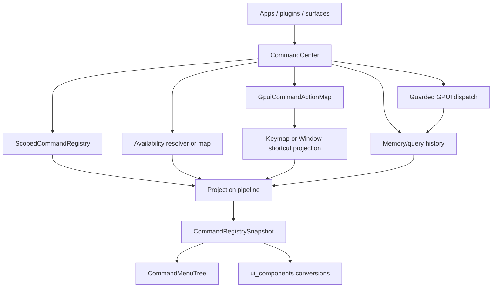

# Command Center Runtime - Plan

## Goal Capsule

| Field | Plan |
|---|---|
| Objective | Add a first-class `CommandCenter` runtime facade that turns the existing command primitives into one app/plugin-friendly command ecosystem path. |
| Authority hierarchy | `open_gpui` remains the action, keymap, chord, context, and dispatch authority; `open-gpui-command` owns command metadata, scope, availability, shortcut projection, menu projection, history, search/query hints, and center dispatch orchestration; `open-gpui-ui-components` owns rendered command/menu UI and UI-only navigation behavior. |
| Execution profile | Fearless refactor is allowed inside the command ecosystem. Break first-party APIs when the old shape forces callers to manually reproduce center-owned sequencing, but do not restore previous `ui_core` or `ui_components::gpui_adapter` command ownership. |
| Stop conditions | Stop and re-plan if implementation requires a second keymap engine, a `when` expression parser, persistent storage, async providers, a global singleton command registry, or `open-gpui-command` depending on `open-gpui-ui-components`. |

---

## Product Contract

### Summary

This plan promotes the current `open-gpui-command` primitives into a usable command runtime by adding `CommandCenter` as the recommended app/plugin entry point.
The center fixes the current shallow-composition problem: callers should not need to remember the order of scope projection, availability, shortcut projection, history ranking, menu projection, and guarded dispatch.

### Problem Frame

The command crate extraction has shipped: `CommandDescriptor`, `ScopedCommandRegistry`, `CommandAvailabilityMap`, `CommandMenuTree`, `MemoryCommandHistory`, and `GpuiCommandActionMap` already live in `open-gpui-command`.
Those types are useful but still require every application or gallery sample to hand-wire the same pipeline.
That creates drift risk: palette visibility can differ from menu visibility, dispatch can bypass hidden/disabled state, and successful dispatch may forget to record usage.

The next durable layer is a deep module that makes the correct path easy without becoming a singleton or a UI component.
`CommandCenter` should be owned by the app, workspace, plugin host, or surface that needs it; it should expose projections and dispatch outcomes that palette, menu, and agent/plugin code can share.

### Requirements

**Runtime facade**

- R1. Add `CommandCenter` as the recommended runtime facade over scoped registration, active scope projection, availability, shortcut projection, menu projection, history ranking, and dispatch.
- R2. Keep `CommandCenter` UI-neutral: no API in `open-gpui-command` may mention `CommandIndexSnapshot`, `CommandSelection`, `MenuItemDescriptor`, `Command`, or any `open-gpui-ui-components` type.
- R3. Preserve GPUI as the input/runtime authority: the center may consume `Action`, `Keymap`, `Window`, and `App`, but must not parse keymap JSON, implement chord matching, evaluate GPUI contexts, or implement modal editing state.

**Registration and lifecycle**

- R4. Let app/plugin/surface contributors register command contributions and GPUI actions through stable `CommandSourceId` and `CommandScopeId` values.
- R5. Provide explicit source/scope unregistration and a lightweight registration token or handle model that makes plugin teardown easy without forcing global shared ownership.
- R6. Preserve stable command ids as the join key across metadata, source provenance, shortcuts, menu entries, palette items, history, and dispatch.

**Projection and dispatch**

- R7. Centralize the default projection pipeline as `active scopes -> availability -> shortcuts -> history/search ranking -> snapshot`.
- R8. Ensure hidden commands are absent from palette/menu projections and cannot dispatch through the center.
- R9. Ensure disabled commands remain visible with disabled reason metadata and cannot dispatch through the center.
- R10. Record command usage only after successful center dispatch.
- R11. Expose menu tree projection and snapshot projection from the same center state so menus, palettes, and agent/plugin runtime views do not drift.

**UI integration and developer experience**

- R12. Carry disabled reasons from `open_gpui_command::CommandDescriptor` into command UI item/state projections so renderers and tests can inspect the reason.
- R13. Add command-query history and stronger search/ranking primitives in `open-gpui-command` while keeping `ui_components::Command` as the rendered UI owner.
- R14. Improve command UI keyboard ergonomics where it belongs in `open-gpui-ui-components`: loop navigation, group/edge navigation, optional vim-style navigation, and IME-safe key handling.
- R15. Update gallery samples and docs so the official example path uses `CommandCenter` rather than manually stitching the old primitives.

### Acceptance Examples

- AE1. Given global and editor scopes are active, a center snapshot uses the caller-provided active-scope order and emits duplicate diagnostics for overridden command ids.
- AE2. Given a plugin source is unregistered, its commands disappear from center snapshots, menu trees, and dispatch checks while other source contributions remain.
- AE3. Given a command is hidden by availability, center palette/menu projections omit it and center dispatch returns a hidden outcome.
- AE4. Given a command is disabled with a reason, center projections preserve that reason and center dispatch returns disabled without invoking a GPUI action.
- AE5. Given a focused window has a higher-precedence shortcut than the app keymap projection, the center's window snapshot shows the window shortcut.
- AE6. Given dispatch succeeds through the center, memory history records usage and later center snapshots can rank that command ahead of otherwise equal candidates.
- AE7. Given a command item is disabled because the workspace is read-only, the UI command state exposes the disabled reason for renderer/tooling use.
- AE8. Given command UI loop navigation is enabled, moving past the last enabled command lands on the first enabled command without selecting disabled rows.

### Scope Boundaries

#### In Scope

- Add `CommandCenter` and center-owned tests in `open-gpui-command`.
- Add source/scope lifecycle ergonomics without introducing mandatory global state.
- Add query/search ranking primitives that can feed pre-ranked command snapshots.
- Add UI command disabled-reason projection and focused navigation hardening.
- Update the registry-backed gallery command sample to use `CommandCenter`.
- Update command ecosystem docs, verification docs, and engineering memory.

#### Deferred to Follow-Up Work

- Async command providers and interceptors.
- Typed or parameterized commands.
- Persistent history storage through files, SQLite, app settings, or databases.
- Keybinding management UI.
- Agent-specific capability policy beyond sharing the same center projections and dispatch guards.
- Nested command pages as a first-class API.

#### Outside This Product's Identity

- Replacing `open_gpui::Action`, `Keymap`, `KeyBinding`, `Window`, or `App` dispatch.
- Reimplementing chord matching, Vim mode, or GPUI context predicates.
- Copying Zed's workspace/extension-host architecture.
- Copying cmdk's DOM compound component API.
- Reintroducing `open_gpui_ui_core::command` or command adapters under `open_gpui_ui_components::gpui_adapter`.

---

## Planning Contract

### Key Technical Decisions

- KTD1. `CommandCenter` is an app-owned facade, not a singleton.
  This preserves the existing library posture: apps, workspaces, plugin hosts, windows, and surfaces can choose their own center lifetime and scope model.
- KTD2. Center projection order is fixed.
  Active scopes come first because they decide which command facts exist; availability comes before UI and menu projections; shortcut projection comes before ranking so shortcut text can participate in search; history/search ranking is last because it is presentation order, not command identity.
- KTD3. Center dispatch always checks the center's projected command facts.
  Dispatch that bypasses visibility and disabled state would create parity gaps between palette, menu, plugin, and agent surfaces.
- KTD4. Registration lifecycle starts explicit and typed.
  A full RAII `Drop` handle would require shared mutable ownership decisions that are not necessary for the first durable center; a token plus explicit unregister can lock down semantics first.
- KTD5. Search/ranking belongs in `open-gpui-command`, rendering stays in `open-gpui-ui-components`.
  `Command` can consume pre-ranked snapshots while keeping local fallback ranking for simple callers.
- KTD6. UI navigation improvements stay UI-owned.
  Looping, group movement, and IME-safe key handling affect rendered interaction state, not command domain identity.

### High-Level Technical Design

The center is the only place where the default sequencing is encoded.
UI components still receive command crate snapshots and convert them into rendered item descriptors.

### System-Wide Impact

- Public command ergonomics improve because first-party samples can use one center-owned path instead of composing six separate primitives.
- Public-surface tests may need to export new command crate types through `open_gpui_ui_components::default` and prelude when those remain intentional convenience surfaces.
- Gallery command samples become a stronger proof surface because they can show center-backed visibility, shortcut, dispatch, and history facts together.
- Agent/plugin parity improves because a non-UI caller can enumerate the same projected commands and dispatch through the same guards as the palette.

### Assumptions

- The previous command crate extraction is the baseline and should not be repeated.
- The user has authorized breaking first-party APIs where the old shape forces incorrect ownership.
- Query/search improvements can stay memory-backed and synchronous in this plan.
- Browser dogfood is not required unless command UI changes create a visible layout regression; focused Rust tests and gallery smokes are the primary proof.

### Sources and Research

- Current command crate owner: `crates/open-gpui-command/src/lib.rs`.
- Scoped registration: `crates/open-gpui-command/src/scope.rs`.
- Availability projection: `crates/open-gpui-command/src/availability.rs`.
- GPUI adapter and dispatch outcomes: `crates/open-gpui-command/src/gpui.rs`.
- History projection: `crates/open-gpui-command/src/history.rs`.
- Menu projection: `crates/open-gpui-command/src/menu.rs`.
- UI command projection: `crates/ui_components/src/command/descriptor.rs`, `crates/ui_components/src/command/model.rs`, `crates/ui_components/src/command/runtime.rs`.
- Gallery command sample: `examples/ui-foundation-gallery/src/pages/components/samples/choice.rs`.
- Current command docs: `docs/ui/command-ecosystem.md`.
- Current-state baseline: `docs/knowledge/engineering/current-state.md`.
- Historical extraction plan: `docs/plans/2026-07-03-002-refactor-open-gpui-command-crate-plan.md`.

---

## Implementation Units

### U1. Add `CommandCenter` Core Facade

- **Goal:** Create the center module and lock down the default command projection pipeline.
- **Requirements:** R1, R2, R3, R6, R7, R11, AE1, AE3, AE4, AE5.
- **Dependencies:** None.
- **Files:** `crates/open-gpui-command/src/center.rs`, `crates/open-gpui-command/src/lib.rs`, `crates/open-gpui-command/src/scope.rs`, `crates/open-gpui-command/src/availability.rs`, `crates/open-gpui-command/src/gpui.rs`, `crates/open-gpui-command/src/history.rs`.
- **Approach:** Add `CommandCenter` as a composition facade over `ScopedCommandRegistry`, `GpuiCommandActionMap`, an availability map/resolver path, and memory history.
  It should expose active-scope setters, snapshot projection for app keymaps and focused windows, menu tree projection, and diagnostic access without importing UI component types.
- **Execution note:** Start with center tests that prove the desired pipeline fails to exist, then implement the facade by reusing existing primitives rather than duplicating their logic.
- **Patterns to follow:** `ScopedCommandRegistry::project_active_scopes` in `crates/open-gpui-command/src/scope.rs`; `GpuiCommandActionMap::registry_snapshot_with_window_shortcuts` in `crates/open-gpui-command/src/gpui.rs`; `CommandRegistrySnapshot::with_availability` in `crates/open-gpui-command/src/availability.rs`.
- **Test scenarios:**
  - Active scopes project in caller-provided order through the center.
  - Hidden commands are absent from center snapshots and menu trees.
  - Disabled commands remain visible in center snapshots with disabled reason metadata.
  - Keymap shortcut projection uses GPUI's last matching binding.
  - Window shortcut projection uses focused-window highest precedence.
  - Center menu projection is built from the same projected snapshot used by palette projection.
- **Verification:** `cargo nextest run -p open-gpui-command --no-fail-fast` includes center projection tests and `open-gpui-command` still has no UI component dependency.

### U2. Add Source Lifecycle and Registration Ergonomics

- **Goal:** Make plugin/surface registration and teardown easy without introducing a global singleton.
- **Requirements:** R4, R5, R6, AE2.
- **Dependencies:** U1.
- **Files:** `crates/open-gpui-command/src/center.rs`, `crates/open-gpui-command/src/scope.rs`, `crates/open-gpui-command/src/registry.rs`, `crates/open-gpui-command/src/lib.rs`.
- **Approach:** Add a typed registration token or handle value that records scope/source identity and supports explicit center unregister methods.
  Keep teardown deterministic and idempotent; do not require `Rc`, `Arc`, interior mutability, or a mandatory global center in the first version.
- **Execution note:** Treat stale or repeated unregister as a tested behavior, not an implementation accident.
- **Patterns to follow:** `CommandSourceId`, `CommandScopeId`, and `ScopedCommandRegistry::unregister_source`.
- **Test scenarios:**
  - Registering a source contributes commands into its scope.
  - Unregistering a source token removes only that source from later center snapshots.
  - Repeated unregister is a no-op with a stable result, not a panic.
  - Unregistering a scope removes all commands from that scope while preserving other scopes.
  - Duplicate command ids across active scopes produce diagnostics without losing source provenance.
- **Verification:** Lifecycle tests pass under `cargo nextest run -p open-gpui-command --no-fail-fast`.

### U3. Center Dispatch, History, Query History, and Search Ranking

- **Goal:** Ensure center dispatch, usage recording, query history, and search ranking share one command-id based model.
- **Requirements:** R7, R8, R9, R10, R13, AE3, AE4, AE6.
- **Dependencies:** U1, U2.
- **Files:** `crates/open-gpui-command/src/center.rs`, `crates/open-gpui-command/src/history.rs`, `crates/open-gpui-command/src/gpui.rs`, `crates/open-gpui-command/src/lib.rs`.
- **Approach:** Route app/window dispatch through center methods that check projected command facts and availability before invoking GPUI actions.
  Extend memory history with query navigation and a reusable ranking helper that can rank a snapshot without mutating command metadata.
- **Execution note:** Keep all history in memory and synchronous; persistence and async providers stay deferred.
- **Patterns to follow:** `MemoryCommandHistory::rank_registry_snapshot`; `GpuiCommandActionMap::dispatch_available_command_in_app_with_history`; current UI `CommandIndexSnapshotMode::PreRankedFilter`.
- **Test scenarios:**
  - Dispatching a missing command returns `MissingCommand`.
  - Dispatching an existing command without action returns `MissingAction`.
  - Hidden and disabled commands do not invoke GPUI actions.
  - Successful app dispatch records usage with the active query.
  - Failed dispatch does not record usage.
  - Query history returns previous and next queries with stable boundary behavior.
  - Ranking prefers recently used matching commands while preserving deterministic fallback order.
- **Verification:** Focused command crate tests pass and no filesystem, async runtime, or persistence dependency is added.

### U4. Bridge Center Snapshots into UI Command/Menu State

- **Goal:** Let UI components consume center projections without learning center internals, and expose disabled reason in command state.
- **Requirements:** R2, R9, R11, R12, R14, AE7, AE8.
- **Dependencies:** U1, U3.
- **Files:** `crates/ui_components/src/command/descriptor.rs`, `crates/ui_components/src/command/model.rs`, `crates/ui_components/src/command/render_plan.rs`, `crates/ui_components/src/command/runtime.rs`, `crates/ui_components/src/menu/descriptor.rs`, `crates/ui_components/tests/choice.rs`, `crates/ui_components/tests/overlay.rs`, `crates/ui_components/tests/public_surface/exports.rs`.
- **Approach:** Add disabled-reason fields and accessors to command item descriptors and resolved item state, preserving existing disabled behavior.
  Keep center-to-UI conversion one-way through registry snapshots.
  Add UI-owned keyboard navigation hardening for loop/group/vim-style movement and IME-safe handling only where it does not require command-domain policy.
- **Execution note:** Characterize the current disabled projection first, then extend it so existing disabled tests keep passing with richer metadata.
- **Patterns to follow:** `CommandItemDescriptor::from_command_descriptor`; `CommandState::activation_for_key`; command keyboard handling in `crates/ui_components/src/command/runtime.rs`; `MenuItemDescriptor::from_command_descriptor`.
- **Test scenarios:**
  - Disabled reason from `CommandDescriptor` reaches `CommandItemDescriptor`.
  - Disabled reason reaches `CommandItemState`.
  - Disabled item activation remains blocked.
  - Loop navigation skips disabled rows and wraps from last to first enabled item.
  - Group or edge navigation moves across resolved command groups without changing selection.
  - IME composing key events do not trigger command navigation shortcuts.
- **Verification:** `cargo nextest run -p open-gpui-ui-components command --no-fail-fast` covers disabled reason and navigation behavior.

### U5. Update Gallery Proofs and Public Documentation

- **Goal:** Make `CommandCenter` the official sample path and update durable docs/memory.
- **Requirements:** R15, AE1, AE3, AE4, AE5, AE6.
- **Dependencies:** U1, U2, U3, U4.
- **Files:** `examples/ui-foundation-gallery/src/pages/components/samples/choice.rs`, `examples/ui-foundation-gallery/tests/foundation_gallery/component_sample_contracts.rs`, `examples/ui-foundation-gallery/tests/foundation_gallery.rs`, `docs/ui/command-ecosystem.md`, `docs/ui/component-contract.md`, `docs/verification.md`, `docs/knowledge/engineering/current-state.md`, `docs/knowledge/engineering/progress/2026-07-03-open-gpui-command-center-runtime.md`, `docs/knowledge/engineering/verification/open-gpui-command-center-runtime-20260703.md`.
- **Approach:** Replace the gallery command registry sample's manual primitive stitching with a center-backed sample that exposes projected shortcuts, hidden/disabled metadata, successful dispatch id, and history/ranking evidence.
  Update docs so `CommandCenter` is the recommended entry point while the lower-level primitives remain documented as building blocks.
- **Execution note:** Treat stale ownership wording as a product bug; docs should no longer teach manual pipeline stitching as the default path.
- **Patterns to follow:** Existing `registry-dispatch` sample in `examples/ui-foundation-gallery/src/pages/components/samples/choice.rs`; command ecosystem docs in `docs/ui/command-ecosystem.md`; command verification entries in `docs/verification.md`.
- **Test scenarios:**
  - Gallery sample contracts expose a center-backed command sample with stable sample id.
  - Gallery metadata records center revision, projected shortcut, disabled/hidden proof facts, and dispatch/history evidence.
  - Docs name `CommandCenter` as the preferred facade without moving rendering ownership out of `open-gpui-ui-components`.
  - Engineering memory records actual verification results for the shipped center runtime.
- **Verification:** Gallery command sample contract tests and focused gallery command tests pass.

### U6. Final Simplification and Verification Sweep

- **Goal:** Remove obsolete helper paths, run focused gates, run review, and leave the branch merge-ready.
- **Requirements:** R1-R15.
- **Dependencies:** U1, U2, U3, U4, U5.
- **Files:** `crates/open-gpui-command/**`, `crates/ui_components/**`, `examples/ui-foundation-gallery/**`, `docs/**`.
- **Approach:** Search for stale command ownership language and manual pipeline helpers that should be replaced by `CommandCenter`.
  Simplify duplicated code introduced during the center and UI integration work before final verification.
- **Execution note:** If a broad workspace gate times out or fails for an unrelated environment reason, keep the focused command/ui/gallery evidence and document the exact broad-gate failure.
- **Patterns to follow:** `docs/verification.md`; public surface tests under `crates/ui_components/tests/public_surface/`.
- **Test scenarios:** Test expectation: none -- behavior-bearing coverage belongs to U1-U5.
- **Verification:** Focused command, UI command/menu, public-surface, gallery, docs, diff, and formatting gates pass or any unrelated broad-gate failure is documented.

---

## Verification Contract

| Gate | Applies to | Done signal |
|---|---|---|
| `cargo fmt -p open-gpui-command -p open-gpui-ui-components -p open-gpui-ui-foundation-gallery --check` | U1-U6 | Touched Rust packages are formatted. |
| `cargo check -p open-gpui-command --tests` | U1-U3 | Command crate compiles with center/search/history tests. |
| `cargo nextest run -p open-gpui-command --no-fail-fast` | U1-U3 | Center projection, lifecycle, dispatch, history, menu, and shortcut tests pass. |
| `cargo check -p open-gpui-ui-components --tests` | U4 | UI component crate compiles against richer command descriptors. |
| `cargo nextest run -p open-gpui-ui-components command --no-fail-fast` | U4 | Command disabled reason and navigation behavior pass. |
| `cargo nextest run -p open-gpui-ui-components menu context_menu --no-fail-fast` | U4 | Command-to-menu projection remains stable. |
| `cargo nextest run -p open-gpui-ui-components --test public_surface --no-fail-fast` | U4-U5 | Root/prelude/default exports and docs tokens remain intentional. |
| `cargo check -p open-gpui-ui-foundation-gallery --tests` | U5 | Gallery compiles against center-backed samples. |
| `cargo nextest run -p open-gpui-ui-foundation-gallery command --no-fail-fast` | U5 | Focused command gallery proofs pass. |
| `python $HOME/.codex/skills/engineering-wiki-memory/scripts/wiki_memory.py validate --root docs/knowledge/engineering` | U5-U6 | Engineering memory remains valid. |
| `git diff --check` | U1-U6 | No whitespace errors. |
| `cargo run -p xtask -- verify` | U6 | Broad verification passes, or an unrelated environmental failure is documented with focused gates above. |

---

## Definition of Done

- `CommandCenter` exists in `open-gpui-command` and is exported as the recommended facade.
- Center projection applies active scopes, availability, shortcut projection, and history/search ranking in one stable order.
- Center dispatch checks projected command facts, blocks hidden/disabled commands, distinguishes missing command from missing action, and records usage only after success.
- Source/scope lifecycle APIs support deterministic plugin/surface teardown.
- Query history and ranking primitives are available without adding persistence or async dependencies.
- `open-gpui-command` still has no dependency on `open-gpui-ui-components`.
- Command UI state exposes disabled reasons and keeps disabled activation blocked.
- Command UI navigation hardening is covered by focused tests.
- Gallery command samples use `CommandCenter` for the official registry-backed path.
- Docs and engineering memory describe the center boundary and remove stale manual-pipeline guidance as the default path.
- Focused verification gates pass; broad verification passes or has a documented unrelated failure.
