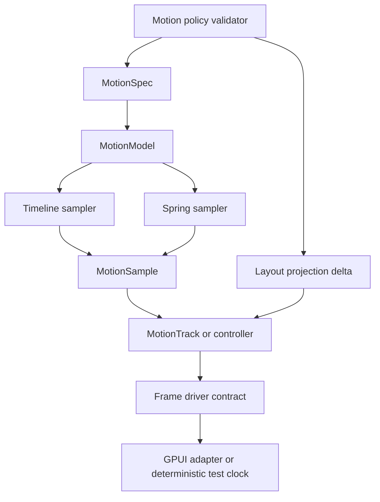
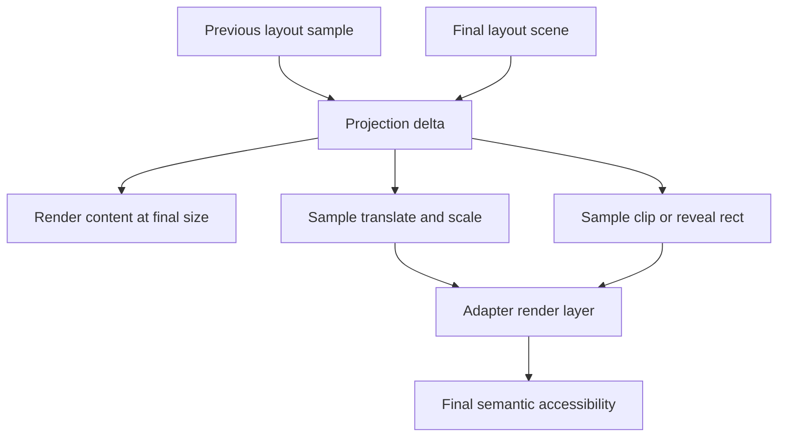
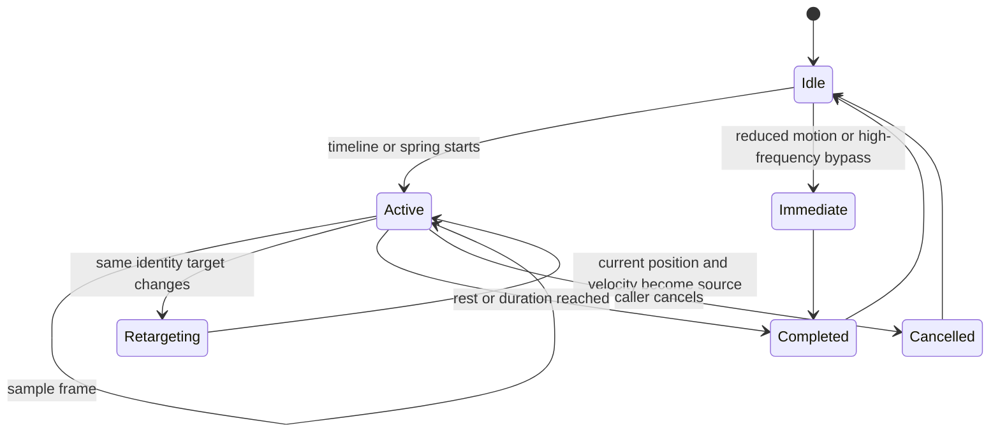

# UI Motion Spring Foundation - Plan

## Goal Capsule

| Field | Value |
| --- | --- |
| Objective | Add the next renderer-neutral motion layer for Open GPUI: spring sampling, velocity-aware retargeting, layout projection primitives, a frame-driver contract, and reviewable motion policy. |
| Authority | `open_gpui_ui_core` owns generic motion math and policy; adapters own GPUI frame scheduling and domain interpolation; docking keeps graph, tab, route, viewport, zoom, focus, and release semantics. |
| Execution profile | Fearless internal refactor with characterization tests first, then primitive extraction, adapter migration, and deletion of duplicated local motion scaffolding. |
| Stop condition | Timeline and spring motion share one contract, layout projection is available without importing React/Web concepts, docking and splitter prove the primitives, reduced-motion and high-frequency no-motion rules are testable, and obsolete local helpers are deleted. |

---

## Product Contract

### Summary

Open GPUI already has `MotionSpec`, `MotionTimeline`, deterministic sampling, stable-identity retargeting, real-content docking reveal, and programmatic splitter motion.
The next step is not "add animations everywhere"; it is a narrow Motion/Spring foundation that lets layout-like components express interruptible movement with velocity, projection, reduced-motion policy, and reviewable defaults.

The plan borrows capability ideas from Motion layout projection, React Spring controllers, BonSplit/SuperSplit split-layout notes, and the existing docking work.
It does not copy React APIs, DOM measurement, CSS strings, CoreAnimation backends, or pixel-perfect reference visuals.

### Problem Frame

The current runtime is duration/easing based.
That is enough for committed layout transitions, but it cannot represent spring velocity, physically interruptible follow behavior, grouped value controllers, or projection deltas that convert old layout to new layout without resizing content every frame.

Recent docking fixes also established a hard UX boundary: preview geometry must stay pinned to current semantic targets, pointer drag must remain direct, and keyboard/focus paths must not become sluggish.
Any new spring layer must make those rules harder to violate, not easier.

### Requirements

**Shared motion model**

- R1. The shared motion runtime must support both existing duration/easing timelines and spring-based deterministic sampling under one renderer-neutral contract.
- R2. Spring sampling must carry position, velocity, rest thresholds, cancellation, completion, and retarget state without depending on GPUI windows or render layers.
- R3. Motion presets must stay below the UI motion budget and encode reviewable defaults for affordance, committed layout, and continuity motion.
- R4. Reduced motion must keep final semantic state while removing large spatial movement.

**Layout projection and frame driving**

- R5. Layout-like components must be able to compute projection deltas from source and target geometry so content can render at final size and move by transform/clip-like samples.
- R6. Parent scale, scroll roots, and nested layout relationships must be represented as data, not hidden in adapter-local math.
- R7. A generic frame-driver contract must separate "motion still needs a frame" from how GPUI, tests, or future backends request that frame.
- R8. Deterministic test clocks must remain the default proof path for motion math.

**Adapter boundaries**

- R9. `ui_components::Splitter` must keep pointer drag immediate and use spring/timeline motion only for programmatic changes.
- R10. `gpui_docking` must keep release authority in current drop facts and use motion only for presentation samples.
- R11. Docking visual affordance previews must not interpolate across unrelated semantic targets; only lifecycle, opacity, or same-identity motion may animate.
- R12. Zoom, unzoom, pane transition, and divider motion may use spring/projection when stable identities exist and reduced motion reaches the same final scene.

**Policy, review, and cleanup**

- R13. The repo must expose a small motion policy validator that flags high-frequency animation, overlong UI motion, excessive bounce, spatial motion under reduced-motion, and missing deterministic tests.
- R14. Native proof surfaces must summarize whether spring, projection, retarget, reduced-motion, and high-frequency bypass rules are active.
- R15. Duplicate local interpolation, timing, or retarget scaffolding must be deleted once shared primitives replace it.

### Acceptance Examples

- AE1. Given a spring spec with an initial velocity, when sampled at deterministic elapsed times, then samples expose monotonic elapsed time, current position, current velocity, active/completed state, and final rest completion.
- AE2. Given an active spring that is retargeted mid-flight, when the new target is sampled, then it starts from the current position and velocity rather than restarting from the original source.
- AE3. Given a layout projection from one pane rect to another, when sampled at 50%, then the sample describes transform/projection data against final-size content instead of changing semantic layout fractions.
- AE4. Given pointer dragging a splitter or docking tab, when motion policy is applied, then the dragged geometry remains immediate and no spring smoothing is inserted between pointer and target.
- AE5. Given a keyboard focus change or high-frequency focus command, when motion policy is applied, then any focus feedback is immediate or non-spatial.
- AE6. Given a docking visual affordance moves from one semantic target to another unrelated target, when the preview updates, then the preview snaps to the current target geometry while presence affordance may animate.
- AE7. Given reduced motion, when a spring or projection transition is requested, then the final scene, accessibility descriptors, and completion callbacks match animated mode without large spatial movement.

### Scope Boundaries

#### In Scope

- Renderer-neutral spring spec, spring sampler, velocity/rest state, and deterministic tests in `ui_core`.
- A unified motion model that lets existing timelines and new springs share scheduling and completion semantics.
- Layout projection primitives for rect deltas, transform-like samples, scale correction data, and final-size content guidance.
- A generic frame-driver/controller contract that adapters can use without moving GPUI frame scheduling into `ui_core`.
- Splitter and docking migrations that prove the primitive boundaries.
- Motion policy validation based on the repo's animation craft bar.
- ADR or ADR-supersession documentation if the `ui_core` motion boundary changes.

#### Deferred to Follow-Up Work

- Native compositor, CoreAnimation, Web Animation API, or platform-specific animation backends.
- Public animation builders for arbitrary GPUI elements.
- Keyframe timelines, stagger orchestration, decorative animation, or marketing/demo motion.
- Screenshot/pixel baselines as the primary motion verification strategy.
- Trigger-anchored measured overlay runtime beyond explicit placement/projection data.

#### Outside This Plan

- Replacing `DockGraph` with a flat grid.
- Making transition samples or preview scenes authorize docking releases.
- Pixel-perfect matching with Motion, React Spring, ImGui, BonSplit, SuperSplit, or macOS.
- Adding animation to pointer-coupled drag or high-frequency keyboard workflows by default.

---

## Planning Contract

### Existing Evidence

| Evidence | Path | Planning impact |
| --- | --- | --- |
| Shared duration/easing runtime exists. | `crates/ui_core/src/motion.rs`, `crates/ui_core/src/motion_runtime.rs` | This plan extends the runtime instead of replacing `MotionTimeline`. |
| Splitter already consumes shared timelines for programmatic motion. | `crates/ui_components/src/splitter.rs` | Pointer drag bypass is a preserved contract, not a new decision. |
| Docking already consumes shared timelines and stable retargeting. | `crates/gpui_docking/src/transition_executor.rs` | Spring/projection must plug into existing transition sampling. |
| ADR 0015 rejects broad animation execution but accepts narrow runtime primitives. | `docs/adr/0015-ui-motion-runtime-foundation.md` | Spring changes need an ADR update because they add a new motion model. |
| Motion prior art uses projection nodes and transform deltas. | `repo-ref/motion/packages/motion-dom/src/projection/node/create-projection-node.ts` | Open GPUI should borrow projection math, not DOM tree ownership. |
| Motion spring generator distinguishes physics and duration/bounce models. | `repo-ref/motion/packages/motion-dom/src/animation/generators/spring.ts` | Defaults should be reviewable presets, with bounce controlled and rest thresholds explicit. |
| React Spring separates value/controller/frame-loop concerns. | `repo-ref/react-spring/packages/core/src/SpringValue.ts`, `repo-ref/react-spring/packages/core/src/Controller.ts`, `repo-ref/react-spring/packages/rafz/src/index.ts` | Open GPUI should expose small controller/driver contracts without promise-heavy React APIs. |
| Engineering memory says drop-preview geometry must stay pinned to current semantic target. | `docs/knowledge/engineering/progress/2026-07-02-ui-motion-runtime-foundation.md` | The plan forbids spring interpolation across unrelated preview targets. |

### Key Technical Decisions

- KTD1. Add spring as a second motion model, not as a replacement for timeline easing. Existing timeline users keep deterministic duration behavior; spring users opt into velocity and rest-state semantics.
- KTD2. Keep spring math in `ui_core` and frame scheduling in adapters. `ui_core` samples; GPUI windows and host runtimes request frames.
- KTD3. Prefer duration/bounce presets for product defaults and physics parameters for advanced internal tests. This keeps UI motion reviewable while retaining enough control for gesture-derived velocity.
- KTD4. Model layout projection as geometry data, not DOM strings. Projection samples describe translate, scale, clip, opacity, and correction factors that GPUI renderers can consume.
- KTD5. Treat high-frequency interaction as a policy failure. Pointer drag and keyboard focus remain immediate unless a future plan names a low-frequency, user-visible exception.
- KTD6. Use current semantic target identity as the retarget gate. Same identity can retarget from current sample; unrelated preview targets snap to semantic geometry.
- KTD7. Add policy validators before broad migration. Motion craft rules should be testable so future components do not reintroduce sluggish, over-bouncy, or reduced-motion-hostile behavior.

### High-Level Technical Design

### Priority Model

| Priority | Capability | Rationale |
| --- | --- | --- |
| P0 | Spring sampler and unified motion model | This is the foundational gap ADR 0015 left open. |
| P0 | Motion policy validator | Without policy, adding spring increases the risk of animating the wrong things. |
| P0 | Deterministic spring and retarget tests | Spring is easy to make flaky without explicit test clocks and rest thresholds. |
| P1 | Layout projection primitives | Projection unlocks final-size content motion and future shared layout work. |
| P1 | Frame-driver/controller contract | Grouped values and demand-driven frames need one vocabulary before more adapters copy local loops. |
| P1 | Docking and splitter migration proof | The primitive is only valuable if two existing consumers can use it cleanly. |
| P2 | Native proof polish and docs | Useful after behavior is real, not before. |

### External Research Impact

- Motion layout animations show the value of projection and grouped layout synchronization, but Open GPUI should not copy DOM measurement, React hooks, or View Transition snapshot semantics.
- Motion and React Spring both support spring/follow behavior with velocity and rest thresholds; Open GPUI should borrow deterministic physics sampling and controller separation.
- React Spring's frame loop demonstrates demand-mode host callbacks and test advancement; Open GPUI should adapt that as a trait or adapter contract rather than importing a global runtime.
- The `review-animations` craft bar pushes this plan toward deletion/reduction first, sub-300ms UI motion, reduced-motion support, interruptibility, and transform/opacity-style projection rather than layout-property animation.

### Assumptions

- This plan targets internal/private Open GPUI APIs first; public animation APIs remain deferred.
- The first spring implementation can support numeric and rect-derived samples before arbitrary colors, strings, or custom value interpolation.
- GPUI render primitives can represent the needed transform/clip-like samples, or adapters can fall back to existing final-size reveal paths while the primitive matures.

---

## Implementation Units

### U1. Record the Motion/Spring Boundary Decision

**Goal:** Add the architectural decision that supersedes ADR 0015's "no spring yet" boundary with a narrow accepted spring/projection primitive.

**Requirements:** R1, R2, R4, R13, R15.

**Dependencies:** None.

**Files:**

- `docs/adr/0016-ui-motion-spring-foundation.md`
- `docs/adr/0015-ui-motion-runtime-foundation.md`
- `docs/knowledge/engineering/progress/2026-07-03-ui-motion-spring-foundation-plan.md`

**Approach:** State that `ui_core` owns renderer-neutral spring sampling, projection deltas, and policy validation while adapters own frame requests and domain interpolation. Record rejected alternatives: broad animation framework, compositor backend now, DOM/React API copying, and animation on pointer/keyboard high-frequency paths.

**Patterns to follow:** `docs/adr/0015-ui-motion-runtime-foundation.md`, `docs/knowledge/engineering/progress/2026-07-02-ui-motion-runtime-foundation.md`.

**Test scenarios:** Test expectation: none -- documentation-only boundary record.

**Verification:** ADR and progress note consistently describe the same ownership boundary and do not claim compositor or public API support.

### U2. Add Spring Sampling to `ui_core`

**Goal:** Introduce deterministic spring sampling that can be used by layout-like components without GPUI dependencies.

**Requirements:** R1, R2, R3, R4, AE1, AE2, AE7.

**Dependencies:** U1.

**Files:**

- `crates/ui_core/src/motion.rs`
- `crates/ui_core/src/motion_runtime.rs`
- `crates/ui_core/src/motion_spring.rs`
- `crates/ui_core/src/lib.rs`
- `crates/ui_core/src/prelude.rs`

**Approach:** Add a `MotionModel` or equivalent internal contract that can wrap the existing timeline model and a new spring model. Spring specs should support a small preset surface plus explicit physics parameters for internal use. Sampling must return position, velocity, elapsed time, terminal state, and reduced-motion final state. Retargeting must preserve sampled velocity when the identity matches.

**Execution note:** Start with deterministic unit tests for spring samples before adapting any UI consumer.

**Patterns to follow:** Existing `MotionTimeline::sample_elapsed`, `MotionTimelineState`, `MotionSnapshot`, and the rest threshold ideas in `repo-ref/motion/packages/motion-dom/src/animation/generators/spring.ts`.

**Test scenarios:**

- Happy path: a default layout spring samples active values at elapsed 0ms and midpoint, then reaches the exact target at rest.
- Edge case: tiny deltas use tighter rest thresholds and do not oscillate forever.
- Edge case: bounce defaults are subtle and can be clamped for professional UI presets.
- Retarget path: an interrupted spring retargets from current position and velocity to a new target.
- Reduced-motion path: a spring spec under reduced motion returns one final semantic sample without active frames.
- Failure path: invalid physics parameters are clamped or rejected deterministically instead of producing `NaN`.

**Verification:** `open-gpui-ui-core` exposes spring samples through its prelude only if they are intended as shared primitives, and tests cover deterministic elapsed sampling without sleeping.

### U3. Add Layout Projection Primitives

**Goal:** Provide renderer-neutral projection data for final-size layout motion without introducing DOM, CSS, or renderer-specific strings.

**Requirements:** R5, R6, R8, AE3, AE7.

**Dependencies:** U2.

**Files:**

- `crates/ui_core/src/motion_projection.rs`
- `crates/ui_core/src/motion_runtime.rs`
- `crates/ui_core/src/lib.rs`
- `crates/ui_core/src/prelude.rs`

**Approach:** Add rect-to-rect projection deltas with translate, scale, origin, tree-scale correction, source/target rects, and clip/reveal helpers. Keep the output as `UiRect` and numeric transform data so GPUI renderers decide how to apply it. Do not add DOM concepts such as layout roots, scroll element observers, or CSS transform strings.

**Patterns to follow:** Existing `lerp_rect`, `motion_source_rect`, `reveal_rect_from_edge`, plus projection delta concepts from `repo-ref/motion/packages/motion-dom/src/projection/geometry/delta-calc.ts` and `repo-ref/motion/packages/motion-dom/src/projection/styles/transform.ts`.

**Test scenarios:**

- Happy path: projection from one rect to another returns expected translate and scale with no semantic layout mutation.
- Edge case: near-identity scale and translate snap to neutral values under epsilon thresholds.
- Edge case: nested parent scale produces corrected child projection data rather than double-scaling.
- Reduced-motion path: projection can produce final-state data without spatial movement.
- Integration scenario: a projection sample can be consumed by a final-size content reveal without changing the target rect.

**Verification:** Projection tests run in `ui_core` and do not import GPUI, docking, web, or platform modules.

### U4. Add a Motion Controller and Frame-Driver Contract

**Goal:** Give adapters a shared way to advance grouped motion values while keeping frame scheduling outside `ui_core`.

**Requirements:** R7, R8, R9, R12, R14, AE2, AE7.

**Dependencies:** U2, U3.

**Files:**

- `crates/ui_core/src/motion_controller.rs`
- `crates/ui_core/src/motion_runtime.rs`
- `crates/ui_core/src/lib.rs`
- `crates/ui_core/src/prelude.rs`
- `crates/ui_components/src/splitter.rs`
- `crates/gpui_docking/src/transition_executor.rs`

**Approach:** Add a small controller or track abstraction for keyed motion values: start, set immediate, retarget, cancel, sample, and needs-frame. The frame driver should be a data contract or trait that reports demand for another frame; adapters still call `window.request_animation_frame()` or deterministic test clocks.

**Patterns to follow:** React Spring's separation between `SpringValue`, `Controller`, and `rafz` demand callbacks in `repo-ref/react-spring/packages/core/src/SpringValue.ts`, `repo-ref/react-spring/packages/core/src/Controller.ts`, and `repo-ref/react-spring/packages/rafz/src/index.ts`.

**Test scenarios:**

- Happy path: grouped values start and complete together under deterministic time.
- Retarget path: one value retargets while another completes, and the group reports active until all required values finish.
- Cancel path: cancelling marks the controller terminal without reporting final semantic completion.
- Driver path: active samples request another frame; immediate or completed samples do not.
- Integration scenario: `Splitter` can use the controller for programmatic fractions while pointer drag cancels or bypasses active motion.

**Verification:** Adapters keep their own frame request code and no GPUI window type appears in the shared controller module.

### U5. Enforce Motion Policy and Review Gates

**Goal:** Make motion quality rules testable so new spring capability does not create sluggish or inaccessible UI.

**Requirements:** R3, R4, R11, R13, AE4, AE5, AE6, AE7.

**Dependencies:** U2.

**Files:**

- `crates/ui_core/src/motion_policy.rs`
- `crates/ui_core/src/motion.rs`
- `crates/ui_core/src/lib.rs`
- `crates/ui_core/src/prelude.rs`
- `crates/gpui_docking/src/transition_geometry.rs`
- `crates/gpui_docking/src/visual_affordance_scene.rs`
- `crates/ui_components/src/splitter.rs`

**Approach:** Add policy vocabulary for motion context such as pointer drag, keyboard/high-frequency focus, affordance presence, committed layout, continuity, and decorative. Validators should flag spatial motion where policy forbids it, long UI duration, excessive bounce, missing reduced-motion branch, and unrelated-target preview interpolation. This is a validator and test helper, not a runtime permission system for every frame.

**Patterns to follow:** `review-animations` standards: no high-frequency animation, sub-300ms UI motion, interruptible gesture motion, transform/opacity-style movement, and reduced-motion support.

**Test scenarios:**

- Happy path: committed layout motion under the default preset passes policy.
- Failure path: pointer-drag spatial smoothing is rejected.
- Failure path: keyboard focus spatial motion is rejected unless explicitly immediate or non-spatial.
- Failure path: a UI preset over 300ms without a continuity reason is rejected.
- Failure path: a spring preset with excessive bounce fails professional UI policy.
- Reduced-motion path: validators accept semantic completion with no large spatial movement.

**Verification:** Policy failures are deterministic assertions in `ui_core` or adapter tests, not manual review comments only.

### U6. Migrate Splitter and Docking to the New Motion Model

**Goal:** Prove the new primitives by migrating existing consumers without regressing current docking and splitter behavior.

**Requirements:** R9, R10, R11, R12, R15, AE2, AE3, AE4, AE6, AE7.

**Dependencies:** U2, U3, U4, U5.

**Files:**

- `crates/ui_components/src/splitter.rs`
- `crates/gpui_docking/src/transition_executor.rs`
- `crates/gpui_docking/src/transition_geometry.rs`
- `crates/gpui_docking/src/render.rs`
- `crates/gpui_docking/src/presentation_commands.rs`
- `crates/gpui_docking/src/host_transition_tests.rs`
- `crates/gpui_docking/src/host_render_tests.rs`
- `crates/gpui_docking/src/host_zoom_focus_tests.rs`
- `crates/gpui_docking/src/host_interaction_tests.rs`

**Approach:** Keep existing timeline behavior where it is already correct. Use spring/projection only where it improves continuity: programmatic splitter changes, stable-identity pane/divider/zoom transitions, and same-identity retargets. Visual affordance preview geometry for unrelated targets must remain pinned to the current target. Delete adapter-local interpolation, duplicated rest logic, or temporary compatibility branches only after tests prove equivalent or improved behavior.

**Execution note:** Characterize current immediate-drag and pinned-preview behavior before switching any adapter to spring.

**Patterns to follow:** `DockTransitionExecutor` current use of `MotionTimeline`, `retarget_motion_snapshots`, and the ImGui-aligned current-target preview behavior recorded in `docs/knowledge/engineering/progress/2026-07-02-ui-motion-runtime-foundation.md`.

**Test scenarios:**

- Splitter happy path: programmatic collapse or resize can animate with the new model.
- Splitter bypass path: pointer drag updates fractions immediately and cancels any active programmatic motion.
- Docking retarget path: a stable pane transition retargets from current position and velocity.
- Docking preview path: a tab dragged over a new unrelated target snaps preview geometry to the new semantic target instead of springing across panes.
- Docking reduced path: zoom/unzoom and pane transitions expose final accessibility semantics under reduced motion.
- Integration path: cross-window docking previews keep source route markers separate from target affordance samples.

**Verification:** Existing docking nextest coverage remains green, and new focused tests prove spring/projection behavior without relying on wall-clock timing.

### U7. Add Motion Proof Surface, Docs, and Cleanup

**Goal:** Make the new capability inspectable and remove stale scaffolding so future agents do not maintain two motion systems.

**Requirements:** R14, R15.

**Dependencies:** U6.

**Files:**

- `examples/docking-native/src/main.rs`
- `docs/verification.md`
- `docs/knowledge/engineering/verification/ui-motion-spring-foundation-20260703.md`
- `docs/knowledge/engineering/progress/2026-07-03-ui-motion-spring-foundation.md`
- Any adapter files left with duplicate motion helpers after U6.

**Approach:** Extend the native proof summary to report spring, projection, velocity-retarget, reduced-motion, high-frequency bypass, and policy validation. Update verification notes with manual dogfood scenarios. Remove obsolete local helper names and compatibility comments once the shared model owns them.

**Patterns to follow:** `examples/docking-native/src/main.rs` existing motion proof summary and `docs/knowledge/engineering/verification/docking-flat-motion-runtime-20260702.md`.

**Test scenarios:**

- Happy path: native proof summary includes spring/projection/policy capabilities.
- Cleanup path: no adapter-local spring/timeline duplicate remains after migration.
- Documentation path: verification note lists manual checks for splitter programmatic motion, docking zoom/unzoom, stable preview targets, and reduced motion.

**Verification:** The native example builds, proof-summary tests pass, and `rg` finds no stale compatibility names introduced by earlier local motion implementations.

---

## Verification Contract

| Gate | Applies to | Expected signal |
| --- | --- | --- |
| `cargo nextest run -p open-gpui-ui-core motion spring projection --no-fail-fast` | U2, U3, U4, U5 | Deterministic core motion math and policy tests pass. |
| `cargo nextest run -p open-gpui-ui-components splitter --no-fail-fast` | U4, U6 | Splitter programmatic motion and pointer-drag bypass pass. |
| `cargo nextest run -p open-gpui-docking host_transition_tests host_render_tests host_zoom_focus_tests host_interaction_tests --no-fail-fast` | U6 | Docking transition, preview, zoom/focus, and interaction regressions pass. |
| `cargo nextest run -p open-gpui-docking --no-fail-fast` | U6, U7 | Broad docking regression suite passes. |
| `cargo check -p open-gpui-docking-native --bin open-gpui-docking-native` | U7 | Native proof surface builds. |
| `cargo fmt --all -- --check` | All units | Formatting is stable. |
| `git diff --check` | All units | No whitespace errors remain. |

Manual dogfood should cover:

- Programmatic splitter collapse/expand animates while pointer drag remains direct.
- Docking tab drag preview stays pinned when moving between unrelated targets.
- Docking pane or zoom transition can retarget mid-flight without snapping back to the original source.
- Reduced motion reaches the same final layout and accessibility state without large spatial movement.
- Native status panel reports spring/projection/policy proof without claiming compositor or pixel-perfect parity.

---

## Definition of Done

- ADR 0016 or an ADR 0015 supersession note records the accepted Motion/Spring boundary.
- `ui_core` supports deterministic timeline and spring sampling under one motion contract.
- Spring samples expose velocity, rest, cancellation, completion, and reduced-motion semantics.
- Layout projection primitives describe transform/clip-like geometry data without renderer-specific strings.
- A shared controller or frame-driver contract exists without importing GPUI window types into `ui_core`.
- Motion policy tests reject high-frequency spatial motion, overlong UI motion, excessive bounce, and reduced-motion violations.
- `ui_components::Splitter` and `gpui_docking` prove the new primitives while preserving immediate pointer drag and pinned current-target previews.
- Obsolete duplicate local motion helpers and compatibility scaffolding are removed.
- Verification gates pass with `cargo nextest`, `cargo check`, `cargo fmt`, and `git diff --check`.
- Engineering memory records what shipped and what remains deferred.

---

## Appendix

### Sources and Research Notes

- `docs/adr/0015-ui-motion-runtime-foundation.md` establishes the current accepted narrow runtime boundary and explicitly leaves springs, keyframes, compositor backends, and public animation builders for later decisions.
- `docs/knowledge/engineering/progress/2026-07-02-ui-motion-runtime-foundation.md` records that drop-preview geometry should stay pinned to the current semantic target rather than interpolating from previous preview bounds.
- `repo-ref/motion/packages/motion-dom/src/projection/node/create-projection-node.ts` and `repo-ref/motion/packages/motion-dom/src/projection/geometry/delta-calc.ts` show layout projection as snapshot/target geometry plus transform delta calculation.
- `repo-ref/motion/packages/motion-dom/src/animation/generators/spring.ts` shows spring defaults, duration/bounce resolution, velocity handling, and rest threshold behavior.
- `repo-ref/react-spring/packages/core/src/SpringValue.ts` and `repo-ref/react-spring/packages/core/src/Controller.ts` show value/controller separation, pause/resume/cancel, velocity, and grouped completion semantics.
- `repo-ref/react-spring/packages/rafz/src/index.ts` shows demand-mode frame-loop callbacks and deterministic advancement concepts that can inform a GPUI adapter contract.
- `https://motion.dev/docs/react-layout-animations` frames layout animation around transform-based layout changes, grouped layout synchronization, and limitations of snapshot-like View Transitions.
