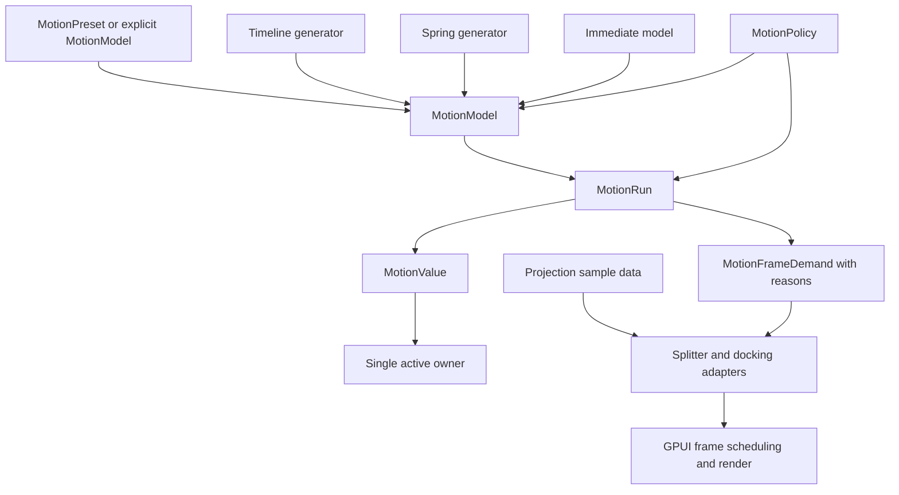
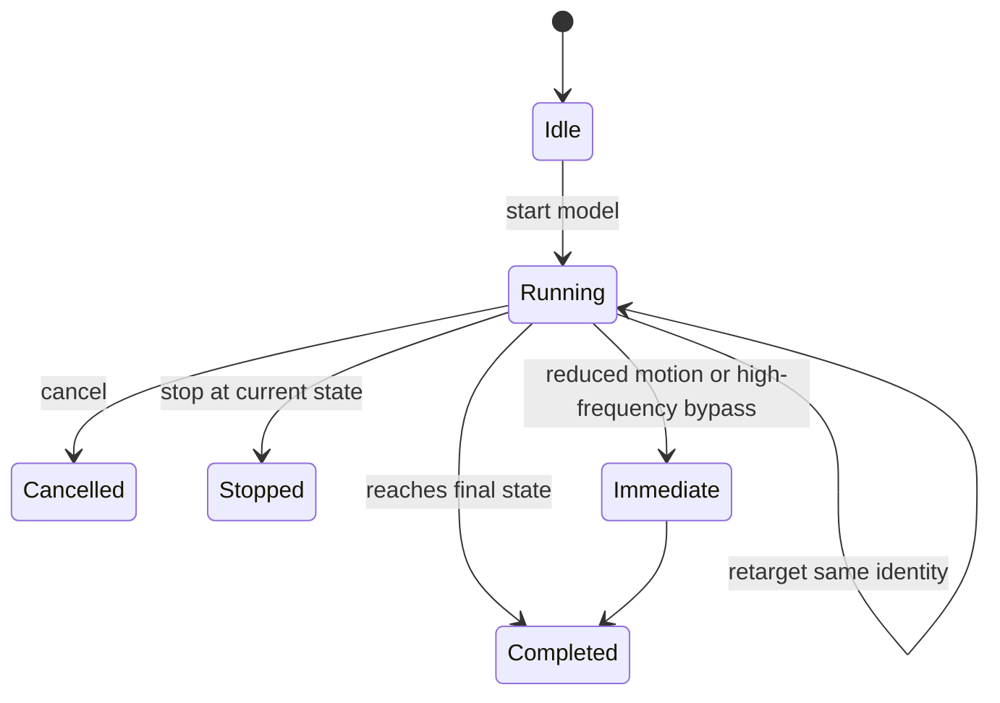

# UI Motion Value Foundation - Plan

## Goal Capsule

| Field | Decision |
|---|---|
| Objective | Move Open GPUI motion from sampler primitives to a renderer-neutral value, explicit-model, and frame-coordination foundation that can support real Splitter and docking layout motion without becoming a DOM/React animation framework. |
| Authority | `open_gpui_ui_core` owns value state, deterministic timeline/spring models, minimal run contracts, policy validation, and renderer-neutral projection data; adapters own GPUI frame requests, live measurement, cursor state, platform windows, and product semantics. |
| Execution profile | Fearless internal refactor. Breaking API changes and deletion are allowed when they remove misleading or unused motion surfaces. |
| Stop condition | Motion value/control/frame APIs are explicit and either consumed by Splitter/docking or kept private; policy runs through real construction or execution paths; Splitter and docking no longer rely on hidden `MotionSpec` remapping or duplicate local interpolation; focused motion/docking gates pass. |
| Tail ownership | Implement on a feature branch, commit logical units, then merge back to local `main` and push once verification is green. |

---

## Product Contract

### Summary

This plan deepens the motion foundation around the parts of `repo-ref/motion` that fit a native Rust UI framework now: value state, explicit model resolution, minimal run state, frame demand, policy gates, and projection data.
It does not chase full Motion parity, React hooks, DOM measurement, CSS/WAAPI behavior, or pixel-level reference matching.

### Problem Frame

The current branch already shipped the ADR 0016 spring/projection foundation: `MotionTimeline`, deterministic springs, scalar tracks, layout projection samples, and a policy validator exist.
That is a useful base, but it is not yet an animation engine or a complete motion substrate.

The structural gap is now clearer after comparing `repo-ref/motion`: Motion's center is `MotionValue` plus playback controls and a staged frame loop, while Open GPUI currently has stateless samplers and small adapter-local controllers.
This leaves several misleading seams: `MotionSpec` can silently become a spring and drop fields, `MotionPolicy` is mostly test-only, `SplitterLayoutTransition` is public but not consumed by the runtime, reduced-motion preference is not wired through public paths, and projection data can be converted back into old bounds interpolation.

### Requirements

**Core motion model**

- R1. `ui_core` must provide a renderer-neutral scalar value primitive with current value, previous value, previous-frame value, velocity, jump semantics, cancellation, and single active animation ownership. Public subscribers, dependent values, and derived-value graphs are deferred until a real adapter consumes them.
- R2. `ui_core` must expose deterministic model/run contracts for timeline, spring, and immediate scalar motion without React, DOM, CSS strings, or platform compositor APIs. Keyframes, repeat, seek/speed, and group controls are deferred.
- R3. Motion run state naming must stop pretending every sample is a timeline sample once timeline, spring, immediate, and future models share it.
- R4. Callers must pass an explicit `MotionModel` or `MotionPreset` when runtime behavior may use a spring; `MotionSpec` must not be a hidden spring request that discards unrelated fields.

**Frame and policy**

- R5. Frame demand must carry enough reason vocabulary for adapters to distinguish active update/render work from idle or immediate completion while keeping GPUI `request_animation_frame`, measurement/read, and post-render lifecycle outside `ui_core`.
- R6. Motion policy must be enforceable through real model construction or execution paths, not only by hand-written tests.
- R7. Reduced-motion preference must flow through public Splitter and docking paths without hardcoded `Animated` defaults where the caller has a preference.

**Adapter convergence**

- R8. `SplitterLayoutTransition` must either drive the real Splitter runtime for stable-id insert, remove, collapse, and expand behavior, or be deleted from the public surface if it is not part of the product contract.
- R9. Docking and Splitter must share model/policy/projection vocabulary instead of maintaining parallel transition concepts for equivalent from/to/kind/sample behavior.
- R10. Projection data must either be consumed as final-size transform/clip/reveal evidence or be narrowed so the code does not claim projection-tree capability it does not use.

**UX guardrails**

- R11. Pointer-coupled drag and high-frequency keyboard focus must remain immediate; no trailing smoothing may be introduced by the new value foundation.
- R12. Docking preview geometry must remain pinned to the current semantic target when target identity changes; only same-identity retarget may preserve velocity.
- R13. Verification must prove capability alignment with deterministic tests and semantic render facts, not screenshots or pixel-perfect Motion parity.

### Acceptance Examples

- AE1. Given a motion value at `0.0`, when it is set, jumped, and retargeted, then it reports current value, previous value, previous-frame velocity, cancellation state, and active-owner replacement deterministically.
- AE2. Given a timeline or spring run sampled at deterministic elapsed times, when it reaches final state or is cancelled, then it reports expected value, completion state, and frame demand without a platform clock.
- AE3. Given a caller that requests a custom timeline, when Splitter or docking executes motion, then the custom timeline remains a timeline instead of being implicitly converted to a spring.
- AE4. Given a default committed-layout preset, when Splitter or docking executes motion, then the resolved model is explicit and policy-validated.
- AE5. Given reduced motion through a public Splitter or docking path, when motion is requested, then the final semantic state and accessibility/render descriptors match animated mode without large spatial movement.
- AE6. Given a pointer drag or high-frequency focus transition, when the policy gate evaluates it, then spatial spring smoothing is rejected or bypassed before runtime sampling.
- AE7. Given unrelated docking preview targets, when a preview replacement occurs, then geometry snaps to the current target while same-identity layers may retarget from the sampled value.
- AE8. Given `SplitterLayoutTransition` remains public, when panel identity changes are resolved, then insert/remove/collapse/expand behavior is either animated through the shared runtime or explicitly documented and tested as immediate.

### Scope Boundaries

In scope:

- Renderer-neutral motion value, model/run, frame-demand, and policy contracts in `open_gpui_ui_core`.
- Breaking cleanup of misleading motion names, hidden model conversions, unused public transition descriptors, and duplicated bounds/projection helpers.
- Migration of Splitter and docking transition execution to explicit model/policy contracts.
- Focused verification and documentation updates for capability alignment.

Deferred to follow-up work:

- Native compositor/CoreAnimation/WAAPI-like backend.
- Public application-facing animation builder DSL.
- Scalar keyframes, repeat policy, seek/speed controls, grouped playback controls, public subscribers, and dependent/derived value graphs.
- Gesture inertia, drag constraints, snap/elastic behavior, scroll-linked animation, and in-view observers.
- Platform accessibility announcements for animated layout changes.
- Screenshot or pixel baselines as the primary motion proof.

Outside this product's identity:

- React hooks, variants, `VisualElement`, CSS variable/computed-style parsing, DOM `HTMLElement` measurement, `IntersectionObserver`, `ScrollTimeline`, or browser-only native animation APIs.
- Pixel-perfect matching with Motion, Framer Motion, ImGui, BonSplit, SuperSplit, or macOS.

---

## Planning Contract

### Key Technical Decisions

- KTD1. Build a proof-gated MotionValue-like core, not a React-like API. The useful prior art for this round is state, velocity, jump/cancel semantics, and one active animation owner; public subscribers and dependent values stay deferred until Splitter or docking needs them.
- KTD2. Promote `MotionModel` or a new `MotionPreset` to the runtime input. `MotionSpec` remains the duration/easing timeline contract; spring defaults should be explicit so custom timeline fields are never silently ignored.
- KTD3. Rename shared sample state before adding more models. A name such as `MotionSampleState` or `MotionRunState` fits timeline, spring, immediate completion, cancellation, and future models better than `MotionTimelineState`.
- KTD4. Defer keyframes until timeline/spring consumers prove the value/run boundary. Scalar keyframes can be added later as another deterministic generator; colors, CSS strings, repeat, and group controls are not part of this round.
- KTD5. Add only the run state needed by current consumers. Start/sample/retarget/cancel/complete/frame-demand is enough for this plan; pause, seek, speed, and grouped controls are follow-up work.
- KTD6. Keep frame scheduling adapter-owned but reason-aware. `ui_core` can define demand reasons and deterministic clocks; GPUI windows, request cadence, measurement/read phases, and render lifecycle remain in adapters.
- KTD7. Make policy a construction/execution gate. Tests should still assert policies directly, but Splitter and docking should validate the actual models they run.
- KTD8. Treat projection honestly. If adapters consume projection samples, render paths should prove final-size content plus transform/clip/reveal semantics; if not, delete or narrow unused projection claims.

### High-Level Technical Design

### Assumptions

- A small Open GPUI motion engine is valuable, but full Motion parity is not the target for this plan.
- Existing spring/projection math is kept unless implementation proves a smaller replacement is clearer.
- Breaking internal exports is acceptable because this code has not shipped as a stable public API.
- Subagents may review units, but the orchestrator owns final staging, tests, commits, and merging.

### Sources and Research

- `repo-ref/motion/packages/motion-dom/src/value/index.ts` shows `MotionValue` owning current/previous value, previous-frame velocity, active animation ownership, and a richer subscriber/dependent model. This plan borrows the state/ownership core and defers the richer notification graph.
- `repo-ref/motion/packages/motion-dom/src/frameloop/batcher.ts` and `repo-ref/motion/packages/motion-dom/src/frameloop/order.ts` show staged frame processing that separates setup/read/update/render/post-render work. This plan borrows only the reason vocabulary needed by current adapters.
- `repo-ref/motion/packages/motion-dom/src/animation/types.ts` and `repo-ref/motion/packages/motion-dom/src/animation/JSAnimation.ts` show generator/playback boundaries. This plan keeps group controls, pause/seek/speed, and promise-like lifecycle out of scope.
- `repo-ref/motion/packages/motion-dom/src/animation/generators/keyframes.ts` and `repo-ref/motion/packages/motion-dom/src/animation/generators/spring.ts` show deterministic generators as the reusable core beneath UI frameworks. This plan consumes the spring/timeline shape now and defers keyframes.
- `repo-ref/motion/packages/motion-dom/src/projection/node/create-projection-node.ts` and `repo-ref/motion/packages/motion-dom/src/projection/geometry/delta-calc.ts` show projection-tree and scale-correction prior art that should be borrowed as a data model, not as DOM code.
- `docs/adr/0015-ui-motion-runtime-foundation.md` and `docs/adr/0016-ui-motion-spring-foundation.md` define the adapter-owned scheduling and renderer-neutral math boundary.
- `docs/knowledge/engineering/progress/2026-07-03-ui-motion-spring-foundation.md` confirms spring, projection, scalar controller, and policy primitives already shipped.

### Risks & Mitigations

| Risk | Mitigation |
|---|---|
| The refactor grows into a general animation framework. | Keep React/DOM/compositor/gesture APIs out of scope and require every new public API to have a Splitter or docking consumer proof. |
| `MotionValue` introduces unused lifecycle complexity. | Keep v1 to current/previous/previous-frame value, velocity, jump/cancel, and one active owner; defer subscribers/dependents until a real adapter needs them. |
| Policy enforcement makes adapters verbose. | Centralize validation helpers in `ui_core` and add adapter-level tests that exercise real model construction. |
| Projection cleanup breaks docking visual continuity. | Characterize current transition/render facts before deletion and keep semantic target pinning as the authority. |
| Reduced-motion wiring changes user-visible behavior. | Assert final semantic scene/accessibility parity between animated and reduced paths. |

### System-Wide Impact

- `open_gpui_ui_core` becomes the owner of reusable motion value/control contracts, so its public exports and prelude will change.
- `open_gpui_ui_components::Splitter` may lose unused public transition descriptors or start consuming them through a real runtime path.
- `open_gpui_docking` transition execution and render sampling will stop hiding model decisions inside local helpers.
- Native examples and `docs/verification.md` will report capability proof without claiming compositor or pixel parity.

---

## Implementation Units

### U1. Record the Value/Foundation Boundary

**Goal:** Add the ADR and engineering memory entry that supersede ADR 0016 for value/run/frame contracts while preserving its renderer-neutral boundary.

**Requirements:** R13. This unit records the R1-R12 boundary but does not implement behavior.

**Dependencies:** None.

**Files:**

- `docs/adr/0017-ui-motion-value-foundation.md`
- `docs/knowledge/engineering/progress/2026-07-04-ui-motion-value-foundation-plan.md`
- `docs/adr/README.md`
- `docs/knowledge/engineering/log.md`

**Approach:** State that Open GPUI is adding a small value/run/frame substrate, not a full Motion clone. Record rejected alternatives: copying React hooks, moving GPUI frame scheduling into `ui_core`, keeping `MotionSpec` as an implicit spring selector, adding keyframes before consumers exist, and keeping unused public transition descriptors.

**Patterns to follow:** `docs/adr/0015-ui-motion-runtime-foundation.md`, `docs/adr/0016-ui-motion-spring-foundation.md`.

**Test scenarios:**

- Test expectation: none -- documentation-only boundary unit.

**Verification:** A future reader can tell which Motion capabilities are accepted, deferred, or rejected before opening code.

### U2. Normalize Motion Model, State, and Preset Semantics

**Goal:** Remove misleading model/state vocabulary, stop hidden `MotionSpec` to spring conversion, and make the projection consume-vs-narrow decision explicit before broader refactors depend on it.

**Requirements:** R2, R3, R4, R6, R10, AE2, AE3, AE4.

**Dependencies:** U1.

**Files:**

- `crates/ui_core/src/motion.rs`
- `crates/ui_core/src/motion_runtime.rs`
- `crates/ui_core/src/motion_spring.rs`
- `crates/ui_core/src/motion_controller.rs`
- `crates/ui_core/src/motion_projection.rs`
- `crates/ui_core/src/motion_policy.rs`
- `crates/ui_core/src/lib.rs`
- `crates/ui_core/src/prelude.rs`
- `crates/ui_components/src/splitter.rs`
- `crates/gpui_docking/src/transition_executor.rs`
- `crates/gpui_docking/src/host_transition_tests.rs`

**Approach:** Introduce explicit model or preset resolution so callers choose timeline, spring, or immediate behavior knowingly. Rename shared sample state away from timeline-specific language, keep compatibility only if it prevents a needless broad break, and update tests to assert that custom timelines remain timelines. Characterize current projection conversion early and choose whether U6 consumes projection samples or narrows projection claims.

**Execution note:** Add characterization tests for custom timeline behavior and projection output before renaming or changing the runtime input shape.

**Patterns to follow:** Existing `MotionModel::{Timeline, Spring}` tests in `crates/ui_core/src/motion_spring.rs` and transition executor custom-spec tests in `crates/gpui_docking/src/host_transition_tests.rs`.

**Test scenarios:**

- Custom timeline path: a custom duration/easing model remains timeline-backed through Splitter and docking execution.
- Default committed-layout path: default layout/continuity presets resolve to explicit spring models and expose review duration/bounce metadata without claiming those metadata alter spring physics unless they actually do.
- Rename compatibility path: shared state reports immediate, active, completed, and cancelled for timeline and spring models.
- Policy path: the actual resolved model is the model passed to policy validation.
- Projection decision path: tests prove whether the adapter consumes final-size projection data or intentionally narrows back to bounds/reveal semantics.

**Verification:** There is no helper whose behavior silently converts arbitrary `MotionSpec` values into springs while losing fields.

### U3. Add Proof-Gated Motion Values and Minimal Runs

**Goal:** Add only the renderer-neutral scalar value/run primitive current consumers need, with deterministic velocity and active-owner replacement.

**Requirements:** R1, R2, R11, AE1, AE2, AE6.

**Dependencies:** U2.

**Files:**

- `crates/ui_core/src/motion_value.rs`
- `crates/ui_core/src/motion_controller.rs`
- `crates/ui_core/src/lib.rs`
- `crates/ui_core/src/prelude.rs`

**Current consumer/proof:** U5 or U6 must consume the value/run primitive through Splitter or docking before it is exported in public preludes. If neither adapter needs it after U5/U6, keep it crate-private or delete it.

**Approach:** Start with scalar values. Store current, previous, previous-frame value, update times, and optional active owner/run state in a renderer-neutral form. Use explicit deterministic clock input rather than reading platform time inside `ui_core`. Do not add subscribers, derived/dependent values, pause/seek/speed, or group controls in this unit.

**Execution note:** Implement proof-first with focused `ui_core` tests for set, jump, velocity, cancellation, active-owner replacement, and high-frequency immediate set behavior.

**Patterns to follow:** `repo-ref/motion/packages/motion-dom/src/value/index.ts`, adapted to Rust ownership and deterministic clocks rather than React/browser lifecycle.

**Test scenarios:**

- Happy path: setting a scalar value updates current/previous values and records deterministic change state.
- Velocity path: previous-frame velocity is zero when stale and non-zero when updates occur inside the velocity window.
- Jump path: jump sets current and previous consistently and clears active animation ownership.
- Animation ownership path: starting a new run cancels or replaces the old owner and emits a deterministic cancellation/completion state.
- High-frequency path: pointer-drag context can set values immediately without scheduling a spring.

**Verification:** Motion values can be tested without GPUI windows, sleeps, or global clocks, and no public API is exported without a Splitter or docking consumer proof.

### U4. Add Frame-Demand Reasons and Production Policy Gates

**Goal:** Make frame demand and policy validation first-class contracts for adapters without copying Motion's whole staged frame loop.

**Requirements:** R5, R6, R7, R11, R12, AE4, AE5, AE6, AE7.

**Dependencies:** U2. U3 only if the chosen adapter consumer needs value/run state.

**Files:**

- `crates/ui_core/src/motion_controller.rs`
- `crates/ui_core/src/motion_policy.rs`
- `crates/ui_core/src/lib.rs`
- `crates/ui_core/src/prelude.rs`
- `crates/ui_components/src/splitter.rs`
- `crates/gpui_docking/src/transition_executor.rs`

**Approach:** Extend existing `MotionFrameDemand` in `motion_controller.rs` with minimal reason data instead of adding a separate scheduling subsystem. Add policy helpers that production Splitter and docking paths call on the resolved model. Policy failures must resolve to an explicit immediate/no-motion model, a rejected construction result, or a test/debug assertion documented at the call site; debug assertions alone are not sufficient for reduced-motion or caller-preference paths.

**Patterns to follow:** Motion's staged frame loop in `repo-ref/motion/packages/motion-dom/src/frameloop/batcher.ts`, borrowed only as vocabulary while host scheduling stays outside `ui_core`.

**Test scenarios:**

- Demand path: active runs request a frame with an update/render reason; completed, cancelled, or immediate runs stay idle.
- Policy path: real Splitter and docking resolved models pass committed-layout and continuity policy checks.
- Failure path: pointer drag spatial spring and unrelated preview interpolation are rejected or bypassed by the same helper adapters use.
- Reduced-motion path: reduced models report immediate final semantics and do not request spatial frames.

**Verification:** Policy tests no longer validate a different model than the one production code executes.

### U5. Converge Splitter Runtime and Public Transition Surface

**Goal:** Resolve the mismatch between public split transition descriptors and the real Splitter runtime.

**Requirements:** R7, R8, R11, R13, AE5, AE6, AE8.

**Dependencies:** U2, U4. U3 if shared value/run state is consumed.

**Files:**

- `crates/ui_core/src/split.rs`
- `crates/ui_core/src/lib.rs`
- `crates/ui_core/src/prelude.rs`
- `crates/ui_components/src/splitter.rs`
- `crates/ui_components/src/public_api/default.rs`
- `crates/ui_components/src/component_contract/api_inventory.rs`
- `crates/ui_components/src/component_contract/projections.rs`
- `crates/ui_components/src/component_contract/rows.rs`
- `crates/ui_components/tests/public_surface/inventory.rs`

**Approach:** Choose the smallest honest API: either wire `SplitterLayoutTransition` into programmatic insert/remove/collapse/expand with stable IDs and shared runtime semantics, or remove it from public exports and tests if runtime support is not part of current product behavior. Keep pointer drag direct.

**Execution note:** Characterize current panel id/quantity changes before deletion or migration so the final behavior is intentional. If reduced motion needs a public entry point, prefer an explicit `Splitter` option such as `motion_preference`/`motion_policy` over another hidden global default.

**Patterns to follow:** Existing `SplitterRuntime` tests in `crates/ui_components/src/splitter.rs`, split state contracts in `crates/ui_core/src/split.rs`, and public surface inventory tests.

**Test scenarios:**

- Existing programmatic resize path: same panel identities animate through shared runtime semantics or snap by an explicit contract.
- Panel identity path: panel insertion/removal/collapse/expand either animates through stable IDs or snaps with an explicit contract test.
- Drag path: pointer drag cancels active runtime motion and applies immediate fractions.
- Reduced-motion path: public Splitter construction can complete final fractions immediately under reduced motion.
- Contract inventory path: exported Splitter APIs match the chosen transition surface.

**Verification:** No public Splitter transition descriptor claims behavior that the adapter cannot execute.

### U6. Converge Docking Transition, Projection, and Policy Runtime

**Goal:** Remove duplicated docking-local motion decisions and make projection/policy/reduced-motion behavior explicit.

**Requirements:** R4, R6, R7, R9, R10, R11, R12, R13, AE3, AE4, AE5, AE7.

**Dependencies:** U2, U4. U3 if shared value/run state is consumed.

**Files:**

- `crates/gpui_docking/src/transition_executor.rs`
- `crates/gpui_docking/src/transition_geometry.rs`
- `crates/gpui_docking/src/render.rs`
- `crates/gpui_docking/src/host_transition_tests.rs`
- `crates/gpui_docking/src/host_render_tests.rs`
- `crates/gpui_docking/src/host_zoom_focus_tests.rs`
- `crates/gpui_docking/src/host_viewport_preview_visual_tests.rs`
- `crates/gpui_docking/src/host_accessibility_tests.rs`

**Approach:** Replace local model-choice helpers with explicit resolved models, add adapter-level production policy checks, and implement the U2 projection decision. Delete local `projected_bounds`/old interpolation helpers only after semantic render facts prove equivalent or stronger behavior.

**Execution note:** Start with characterization tests around transition samples and render consumption, then delete duplicated helpers after the new path is green.

**Patterns to follow:** Current `DockTransitionExecutor` tests, `DockVisualAffordanceScene` target identity rules, render-authority tests, and accessibility fact tests.

**Test scenarios:**

- Custom timeline path: custom duration/easing remains intact through docking execution.
- Continuity spring path: default continuity model passes policy and retargets same-identity samples from current value/velocity.
- Projection path: moving/resizing pane samples either render through projection/final-size data or the projection layer is narrowed with tests proving the chosen bounds/reveal contract.
- Preview target path: unrelated preview target replacement snaps to the current semantic target.
- Reduced-motion path: final scene, pane clips, dividers, visual affordances, zoom/focus descriptors, and accessibility facts match animated final state.
- Cleanup path: deleted local helpers are not referenced by transition or render tests.

**Verification:** Docking release authority remains current drop facts, while motion only produces presentation samples.

### U7. Update Proof Surfaces, Verification, and Cleanup

**Goal:** Keep the repository's proof and memory aligned with the new motion foundation.

**Requirements:** R13.

**Dependencies:** U1, U2, U3, U4, U5, U6.

**Files:**

- `docs/verification.md`
- `docs/knowledge/engineering/verification/ui-motion-value-foundation-20260704.md`
- `docs/knowledge/engineering/progress/2026-07-04-ui-motion-value-foundation.md`
- `examples/docking-native/src/main.rs`
- `crates/gpui_docking/src/debug.rs`
- `crates/gpui_docking/src/viewport_runtime_status.rs`

**Approach:** Update proof strings and debug/status output to report value/run/frame/policy capabilities. Remove obsolete docs or compatibility notes that would tell future agents to use deleted APIs.

**Patterns to follow:** `docs/knowledge/engineering/verification/ui-motion-spring-foundation-20260703.md`, current native runtime panel proof summary.

**Test scenarios:**

- Native proof path: runtime/status output reports value foundation capabilities without claiming compositor parity.
- Verification doc path: focused commands cover `ui_core` motion value/run, Splitter, and docking transition/render behavior.
- Memory path: progress and verification entries cite commits and focused gates after implementation lands.

**Verification:** Future work can discover the new boundary from ADR, verification docs, and engineering memory.

---

## Verification Contract

| Gate | Applies to | Done signal |
|---|---|---|
| `cargo fmt --all -- --check` | All units | Formatting is stable across the workspace. |
| `cargo nextest run -p open-gpui-ui-core motion value run projection policy --no-fail-fast` | U2, U3, U4 | Core motion model, value/run, projection, and policy tests pass. |
| `cargo nextest run -p open-gpui-ui-components splitter component_api_inventory --no-fail-fast` | U5 | Splitter runtime and public API inventory match the chosen transition surface. |
| `cargo nextest run -p open-gpui-docking host_transition_tests host_render_tests host_zoom_focus_tests host_viewport_preview_visual_tests host_accessibility_tests --no-fail-fast` | U6 | Docking transition/render/preview/reduced-motion semantics remain correct. |
| `cargo check -p open-gpui-docking-native --bin open-gpui-docking-native` | U7 | Native proof surface still compiles. |
| `python "$HOME/.codex/skills/engineering-wiki-memory/scripts/wiki_memory.py" validate --root docs/knowledge/engineering` | U1, U7 | Engineering memory files are valid. |
| `git diff --check` | All units | No whitespace or conflict-marker issues remain. |

---

## Definition of Done

- Every implementation unit is either shipped or explicitly removed from scope with a documented reason before final merge.
- `ui_core` exposes value/run/frame/model APIs that are deterministic, renderer-neutral, and proof-gated by real Splitter or docking consumption.
- Splitter and docking use explicit model/policy contracts rather than hidden `MotionSpec` remapping.
- Pointer drag, high-frequency focus, reduced motion, and unrelated preview-target behavior are locked by tests.
- Misleading unused public APIs and duplicated local interpolation helpers are deleted or narrowed.
- ADR, verification docs, and engineering memory describe the new boundary and the rejected Motion capabilities.
- Focused verification gates in the Verification Contract pass on the feature branch before merging back to `main`.
