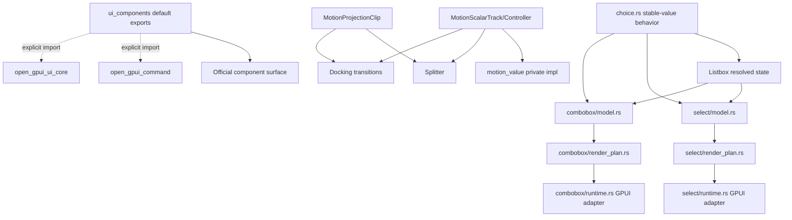

# UI Framework Non-Overlay Depth - Plan

## Goal Capsule

| Field | Decision |
|---|---|
| Objective | Finish the non-overlay UI framework deepening pass: split choice/search components into deeper modules, tighten the shared choice behavior seam, narrow misleading default exports, and make the motion public surface match real Splitter/docking consumption. |
| Authority | User request to exclude overlay adapter work, ADR 0004, ADR 0005, ADR 0007, ADR 0015-0017, `docs/architecture/native-ui-framework-strategy.md`, `docs/ui/component-contract.md`, and current component contract/public-surface tests. |
| Execution profile | Fearless refactor. Breaking API changes, file moves, and deletion are allowed when they remove shallow ownership, registry-era leftovers, misleading default exports, or public APIs with no real consumer. |
| Product boundary | Keep `open-gpui-ui-core`, `open-gpui-ui-components`, `open_gpui_command`, and the foundation gallery as the product boundary. Do not create a standalone headless crate. |
| Stop conditions | Stop and re-plan if implementation requires touching overlay adapter/runtime ownership, creating a headless crate, copying Fret/Motion wholesale, or weakening existing component contract drift gates. |
| Tail ownership | This session owns implementation, verification, simplification, review, and commits unless a genuine blocker changes scope. |

---

## Product Contract

### Summary

This plan targets the remaining high-value UI framework architecture work after the theme, command, row-window, gallery story, and motion foundation slices already landed.
The active scope is non-overlay: choice/search component module depth, default public API boundaries, motion surface honesty, non-overlay gallery evidence, and docs/tests that keep those decisions from drifting.

The work ships in diagnostic tranches rather than as one undifferentiated rewrite:
1. characterize and split choice-family components;
2. clean motion public surface;
3. narrow component default exports, gallery evidence, docs, and verification.

### Problem Frame

The UI library now has strong deep-module examples: `menu`, `command`, `tree`, `table/behavior`, `theme`, `component_contract`, and `open_gpui_command`.
The remaining friction is concentrated in places where the default API surface and large single-file components still hide ownership boundaries.

`Select` and `Combobox` are useful official components, but their current files mix descriptors, resolved state, filtering, runtime state, keyboard actions, overlay glue, rendering, and tests.
`Listbox` and `choice.rs` already own most stable-value semantics, yet the boundary is under-documented and not fully reflected in module shape.
`open_gpui_ui_components::default` currently re-exports the full command runtime and broad `ui_core` table/virtualizer types, making the component crate look like the owner of infrastructure it should only consume.
`motion_value` is public as a module even though its only production consumer is `MotionScalarTrack`, while `MotionProjectionClip`, `MotionModel`, `MotionPreset`, and controller types are genuinely consumed by Splitter and docking.

### Requirements

**Component module depth**

- R1. `Select` must keep the existing public component contract while its internal descriptor/state/runtime/render responsibilities move into a split module shape that mirrors the established `menu` and `command` pattern.
- R2. `Combobox` must keep query filtering, selected-value preservation, keyboard action, and nested `ListboxState` semantics while separating model, render-plan, runtime, and style ownership.
- R3. `Listbox`, `Select`, `Combobox`, and command-adjacent choice tests must prove shared stable-value rules through `choice.rs` instead of re-implementing traversal, typeahead, or selected/active resolution in component files.

**Public API boundary**

- R4. The root/prelude default export must represent the official component application surface, not the full infrastructure surface of `open_gpui_command` or broad `open_gpui_ui_core` internals.
- R5. Infrastructure owners remain explicit: command-runtime types are imported from `open_gpui_command`; table/virtualizer primitives are imported from `open_gpui_ui_core`; GPUI-only helpers stay under `gpui_adapter`.
- R6. Component contract rows, source mapping, docs vocabulary, and public-surface tests must agree on any split files or export narrowing.

**Motion surface honesty**

- R7. `MotionValue` and run-owner details must not be presented as a public motion framework API unless a real adapter consumes them directly; internal use by `MotionScalarTrack` is enough to keep the implementation, not enough to keep a public module.
- R8. Motion types with real consumers must remain exported and documented by evidence: `MotionModel`, `MotionPreset`, `MotionScalarTrack`, `MotionScalarController`, `MotionFrameDemand`, `MotionProjectionClip`, Splitter, and docking.
- R9. No React/Motion-DOM playback, subscriber graph, frameloop, projection-tree, keyframe, or presence API is introduced in this slice.

**Gallery and docs**

- R10. Foundation gallery conformance must strengthen non-overlay choice/search/component evidence without changing overlay adapter behavior.
- R11. Docs and engineering memory must describe the new ownership boundaries and remove stale text that implies generated registry manifests, broad default infrastructure exports, or immediate headless extraction.

### Scope Boundaries

#### In Scope

- Splitting `select.rs` and `combobox.rs` into component directories.
- Strengthening `choice.rs`/`listbox.rs` behavior tests and public-surface source mappings.
- Narrowing `public_api/default.rs`, root exports, prelude exports, and tests/docs that currently expect broad infrastructure re-exports.
- Making `motion_value` private or otherwise deleting its public API surface while preserving controller behavior.
- Non-overlay foundation gallery contract tests for choice/search samples.
- Documentation and memory updates that reflect the new non-overlay boundaries.

#### Deferred to Follow-Up Work

- Overlay adapter/runtime/host changes, including placement host mechanics, outside-press runtime, Escape/focus restore host refactors, and overlay sample behavior changes.
- A standalone `open-gpui-ui-headless` crate.
- Full public `MotionValue` subscriber/dependent graph, playback controls, repeat/keyframes, presence transitions, or a Motion-style frameloop.
- Generated component registry manifests, scaffold recipe metadata, hosted registries, or `gpui add`.
- Broad visual redesign of the gallery.

#### Out of Scope

- Copying Fret, shadcn, `gpui-components`, or Motion architecture wholesale.
- Moving command ownership back into `ui_components`.
- Rewriting GPUI runtime architecture or docking product behavior outside motion compile fallout.

---

## Planning Contract

### Key Technical Decisions

- KTD1. Split by responsibility, not by file size. `select` and `combobox` should gain module depth only where it clarifies descriptor/model/render/runtime/style ownership.
- KTD2. Keep `choice.rs` internal. The behavior seam already has real leverage across Listbox, Toolbar, ToggleGroup, Command, Select, and Combobox, but it is not yet a public crate contract.
- KTD3. Break default exports to restore ownership. Apps should import command runtime from `open_gpui_command` and renderer-neutral foundation types from `open_gpui_ui_core`; `open_gpui_ui_components` root/prelude should prioritize official UI components and state contracts.
- KTD4. Make motion public APIs evidence-based. `MotionValue` remains an implementation detail until more than one adapter needs it directly; consumed controller/model/projection types stay public.
- KTD5. Gallery is evidence, not authority. Gallery selectors and probes can prove choice/search behavior, but typed component contract rows remain the component product metadata owner.
- KTD6. Overlay adapter work is excluded even when touched files mention overlay helpers. Select/Combobox may keep existing overlay calls, but this plan must not redesign overlay host behavior; import-only fallout in overlay files is allowed only if public export contraction makes it unavoidable, and such fallout must not change behavior.
- KTD7. Public API deletion is classified before editing. A symbol can be removed outright only when it is accidental public surface; supported public API needs a migration path, deprecation note, compatibility shim, or explicit breaking-change record in this plan.

### Delivery Tranches

| Tranche | Units | Exit Boundary |
|---|---|---|
| T1 Choice/search component depth | U1, U2, U3, U4 | Choice tests pass before and after movement, Select/Combobox keyboard and overlay-consumption characterization remains green, and overlay modules have no behavior diff. |
| T2 Public API and motion surface | U5, U6 | Public exports are classified before removal, first-party callers migrate to owner crates, and motion public/private decisions are proven by Splitter/docking/core tests. |
| T3 Gallery/docs finalization | U7, U8 | Gallery non-overlay story/sample contracts and docs match the shipped source boundaries. |

T1 can ship independently if later public API or motion cleanup uncovers a blocker.
T2 can ship independently if gallery/docs cleanup needs a follow-up review.
T3 documents and proves the code-owning tranches rather than changing the architecture alone.

### High-Level Technical Design

### Assumptions

- The user has already authorized fearless refactor, breaking API changes, deletion, subagents, and intermediate commits.
- Scoping confirmation is intentionally skipped because the request asked to set a goal and begin execution now.
- The existing `refactor/ui-framework-non-overlay-depth` branch is the working branch for this plan.
- `repo-ref/gpui-components` is unavailable in the repo; `repo-ref/fret` and `repo-ref/motion` are local prior-art inputs.
- Existing overlay imports in Select/Combobox may remain, but overlay adapter behavior is not changed by this plan.

### System-Wide Impact

- Downstream apps using `open_gpui_ui_components::*` for command infrastructure or table/virtualizer core types will need explicit owner-crate imports.
- Component contract and source mapping tests become stricter because `Select` and `Combobox` move from single-file sources to split module directories.
- Motion consumers keep their runtime behavior, but external code importing `open_gpui_ui_core::motion_value::*` will break unless it moves to controller/model APIs.

### Risks & Dependencies

| Risk | Mitigation |
|---|---|
| Public export narrowing creates a broad compile fallout. | Update first-party tests/docs in the same unit and keep compatibility only where the owner boundary still makes sense. |
| Splitting Select/Combobox changes behavior accidentally. | Add characterization tests around state resolution, filtering, keyboard actions, and source mapping before moving code. |
| Motion private-module change breaks hidden downstream usage. | Treat this as an intentional break; first-party code must import consumed public controller/model APIs instead. |
| Overlay behavior slips into scope because Select/Combobox render popups. | Leave overlay helper calls intact and limit changes to component-local organization and tests. |
| Public-surface tests are currently large and brittle. | Convert them from broad infrastructure examples to ownership assertions, not one-off compilation fixtures for every command type. |

### Sources & Research

- `docs/architecture/native-ui-framework-strategy.md` rejects generated registry/scaffold APIs and keeps `component_contract` as internal verification authority.
- `docs/adr/0007-open-gpui-ui-headless-boundary-design.md` identifies Listbox navigation/typeahead as a headless extraction candidate but not a crate split trigger.
- `docs/adr/0017-ui-motion-value-foundation.md` allows MotionValue-like internals while deferring public subscriber/playback APIs.
- `docs/plans/2026-07-02-003-refactor-ui-framework-deep-modules-plan.md` is stale for this slice because theme, command extraction, row-window, gallery story contracts, and overlay placement have already landed or are excluded.
- `repo-ref/fret/ecosystem/fret-ui-shadcn/tests/select_keyboard_navigation.rs` and `combobox_keyboard_navigation.rs` support strengthening behavior conformance around choice/search, not copying crate shape.
- `repo-ref/motion/packages/motion-dom/src/value` informs internal value-state vocabulary; its subscriber/dependent graph is out of scope for Open GPUI now.

---

## Implementation Units

### U1. Characterize Choice/Search Behavior Before Moving Files

- **Goal:** Lock current non-overlay Listbox, Select, and Combobox behavior before structural edits.
- **Requirements:** R1, R2, R3, R10
- **Dependencies:** none
- **Files:** `crates/ui_components/tests/choice.rs`, `crates/ui_components/src/choice.rs`, `crates/ui_components/src/listbox.rs`, `crates/ui_components/src/select.rs`, `crates/ui_components/src/combobox.rs`
- **Approach:** Add or strengthen focused tests for selected versus active value, disabled skipping, separator handling, typeahead normalization, Combobox filtering without clearing selected value, Select trigger label fallback, and keyboard action resolution. Prefer tests through public `State`/snapshot APIs so later file movement can prove behavior preservation.
- **Execution note:** Characterization-first. Observe the tests passing on the current implementation before moving production code.
- **Patterns to follow:** Existing `crates/ui_components/tests/choice.rs` choice/listbox/command coverage; `combobox_keyboard_action` unit tests; `docs/adr/0007-open-gpui-ui-headless-boundary-design.md`.
- **Test scenarios:**
  - A grouped Listbox with separators and disabled rows skips non-focusable rows for Up/Down/Home/End while preserving position-in-set and size-of-set.
  - A Select with a selected value opens with the nested Listbox active value aligned to the selected option and uses the placeholder when selection is absent.
  - A Combobox query filters standalone and grouped options by label, value, and keyword without dropping the stored selected value when it is hidden by the query.
  - Select and Combobox keyboard lifecycle covers ArrowUp/ArrowDown/Home/End navigation, typeahead, Enter and Space activation, Escape close, disabled input ignore, and focus restore after close.
  - Enter/Space on an open Combobox selects the active filtered option; Escape closes only when open; disabled Combobox ignores all keyboard actions.
  - Select and Combobox overlay consumption covers open/close, outside press, Escape, placement policy input, deferred layer use, and focus restore through component-local tests without changing overlay modules.
- **Verification:** Focused choice tests pass before and after the refactor, proving structural movement preserved behavior.

### U2. Split Select Into Model, Render Plan, Runtime, And Style Owners

- **Goal:** Replace single-file `select.rs` with a split `select/` module whose public API remains coherent and whose internal responsibilities are easier to navigate.
- **Requirements:** R1, R3, R6, R10
- **Dependencies:** U1
- **Files:** `crates/ui_components/src/select.rs`, `crates/ui_components/src/select/mod.rs`, `crates/ui_components/src/select/model.rs`, `crates/ui_components/src/select/render_plan.rs`, `crates/ui_components/src/select/runtime.rs`, `crates/ui_components/src/select/style.rs`, `crates/ui_components/src/component_contract/rows.rs`, `crates/ui_components/tests/public_surface/source_mapping.rs`, `docs/ui/component-contract.md`
- **Approach:** Move `SelectState`, `SelectSelection`, open-mode resolution, metrics/colors, and descriptor-facing helpers into model/style owners. Keep GPUI `RenderOnce`, keyed runtime state, handlers, and overlay helper calls in runtime. Add a render-plan owner only for reusable pre-render decisions such as ids, placement input, content metrics, and behavior snapshots; do not move overlay adapter policy.
- **Migration note:** Use a legal Rust module migration: first move `crates/ui_components/src/select.rs` to `crates/ui_components/src/select/mod.rs`, then add child modules. Do not keep `select.rs` and `select/mod.rs` as simultaneous module roots.
- **Execution note:** Commit after this unit once checks pass because it is a mechanical file move with behavior risk.
- **Patterns to follow:** `crates/ui_components/src/menu/{mod.rs,model.rs,render_plan.rs,runtime.rs,style.rs}` and `crates/ui_components/tests/public_surface/source_mapping.rs`.
- **Test scenarios:**
  - Public imports for `Select`, `SelectState`, `SelectSelection`, `SelectOpenMode`, `SelectColors`, and `SelectMetrics` still compile through the intended component surface.
  - Component source mapping reports the split Select owner files and rejects reintroducing `select.rs` as the implementation home.
  - Select keeps trigger label, disabled state, expanded/open state, nested listbox role, active/selected option metadata, initial focus intent, and focus restore intent.
  - Select state characterization tests from U1 remain green after the move.
- **Verification:** Select-focused choice tests, public-surface source-mapping tests, and `cargo check -p open-gpui-ui-components --tests` pass.

### U3. Split Combobox Into Model, Render Plan, Runtime, And Style Owners

- **Goal:** Give Combobox the same module depth as Select while preserving query, text-input, filtering, and keyboard semantics.
- **Requirements:** R2, R3, R6, R10
- **Dependencies:** U1, U2
- **Files:** `crates/ui_components/src/combobox.rs`, `crates/ui_components/src/combobox/mod.rs`, `crates/ui_components/src/combobox/model.rs`, `crates/ui_components/src/combobox/render_plan.rs`, `crates/ui_components/src/combobox/runtime.rs`, `crates/ui_components/src/combobox/style.rs`, `crates/ui_components/src/component_contract/rows.rs`, `crates/ui_components/tests/public_surface/source_mapping.rs`, `docs/ui/component-contract.md`
- **Approach:** Move descriptors, filtering helpers, `ComboboxState`, selection payload, open-mode resolution, keyboard action model, metrics, and colors out of the runtime file. Keep `TextInputController`, GPUI event binding, overlay helper calls, and input-controller mutation in runtime. Share naming and layout with Select where it reduces navigation cost.
- **Migration note:** Use the same legal module migration as Select: first move `combobox.rs` to `combobox/mod.rs`, then add child modules. Do not keep `combobox.rs` and `combobox/mod.rs` as simultaneous module roots.
- **Execution note:** Characterization tests from U1 must remain green before any behavior simplification is attempted.
- **Patterns to follow:** Split Select from U2; `crates/ui_components/src/command/{descriptor.rs,model.rs,render_plan.rs,runtime.rs,style.rs}`.
- **Test scenarios:**
  - Public imports for `Combobox`, descriptors, groups, options, state, selection, metrics, colors, and open mode still compile through the intended component surface.
  - Component source mapping reports split Combobox owner files and rejects reintroducing `combobox.rs` as the implementation home.
  - Combobox keeps input label, disabled state, expanded/open state, nested listbox role, active/selected option metadata, initial focus intent, and focus restore intent.
  - Query normalization, keyword matching, grouped filtering, keyboard navigation, and selection tests remain green after the move.
- **Verification:** Combobox-focused choice tests, public-surface source-mapping tests, and `cargo check -p open-gpui-ui-components --tests` pass.

### U4. Tighten The Choice/Listbox Deep Module Boundary

- **Goal:** Make `choice.rs` the single internal owner for stable-value selection, active movement, typeahead, dedupe, and selection-cardinality policy.
- **Requirements:** R3, R6, R10
- **Dependencies:** U1, U2, U3
- **Files:** `crates/ui_components/src/choice.rs`, `crates/ui_components/src/listbox.rs`, `crates/ui_components/src/toggle_group.rs`, `crates/ui_components/src/toolbar.rs`, `crates/ui_components/src/command/descriptor.rs`, `crates/ui_components/tests/choice.rs`, `docs/ui/component-contract.md`
- **Approach:** First run a choice-consumer inventory across `ui_components` so helper narrowing accounts for Listbox, Select, Combobox, Toolbar, ToggleGroup, and Command. Then remove duplicate or near-duplicate choice helpers from component modules when the internal choice collection can own them. Keep component-specific rendering, query scoring, command ranking, and payload types outside `choice.rs`. Add tests for each policy mode that has a real consumer.
- **Patterns to follow:** Existing `ChoiceInteractionPolicy::{listbox,roving,single_required,multiple}` and `ChoiceCollection::resolve`.
- **Test scenarios:**
  - Single optional, single required, multi-select, and roving policies resolve selected and active indexes deterministically.
  - Typeahead honors normalized text values and skips disabled rows under listbox policy.
  - Command-specific ranking stays in command descriptors and does not affect Select/Combobox base choice semantics.
- **Verification:** `open-gpui-ui-components` choice tests pass with no duplicated traversal implementation in moved component files.

### U5. Narrow Default Public Exports To Component Surface

- **Goal:** Make the root/prelude default API express UI component ownership and require explicit imports for command runtime and broad core infrastructure.
- **Requirements:** R4, R5, R6, R11
- **Dependencies:** U2, U3
- **Files:** `crates/ui_components/src/public_api/default.rs`, `crates/ui_components/src/prelude.rs`, `crates/ui_components/src/lib.rs`, `crates/ui_components/tests/public_surface/exports.rs`, `crates/ui_components/tests/public_surface/manifest.rs`, `crates/ui_components/tests/support/public_surface/mod.rs`, `docs/ui/component-contract.md`, `docs/ui/command-ecosystem.md`
- **Approach:** Classify each current default export as component-owned, component-facing dependency, owner-crate infrastructure, or accidental public surface before deleting it. Remove broad `pub use open_gpui_command::{...}` and broad `pub use open_gpui_ui_core::{...}` from the default surface unless a type is an official component state dependency that the component crate is documented to expose. Keep component-specific command UI types such as `Command`, `CommandState`, `CommandPaletteController`, and palette projections under `ui_components`; direct command registry/center/keybinding/runtime examples should import from `open_gpui_command`. Keep table/virtualizer core examples importing from `open_gpui_ui_core`.
- **Execution note:** This is an intentional breaking change. Update first-party tests to prove the new owner boundary rather than preserving the old broad import convenience.
- **Patterns to follow:** `docs/architecture/native-ui-framework-strategy.md`; `docs/ui/command-ecosystem.md`; existing `gpui_adapter` namespace pattern.
- **Test scenarios:**
  - Root/prelude export tests still cover official components and component-owned state contracts.
  - Command runtime examples compile by importing `open_gpui_command` directly, not through `open_gpui_ui_components`.
  - Core table/virtualizer foundation examples compile by importing `open_gpui_ui_core` directly.
  - Adapter-only helper tests continue to prove GPUI-specific helpers live under `gpui_adapter`.
- **Verification:** Public-surface tests pass and docs no longer claim the default component surface owns command/core infrastructure.

### U6. Privatize Or Delete Unproven Motion Value Public Surface

- **Goal:** Keep motion internals useful while making public motion APIs match real adapter consumption.
- **Requirements:** R7, R8, R9
- **Dependencies:** none
- **Files:** `crates/ui_core/src/lib.rs`, `crates/ui_core/src/prelude.rs`, `crates/ui_core/src/motion_value.rs`, `crates/ui_core/src/motion_controller.rs`, `crates/ui_core/src/motion_policy.rs`, `crates/ui_core/src/motion_projection.rs`, `crates/ui_components/src/splitter.rs`, `crates/gpui_docking/src/transition_executor.rs`, `docs/adr/0017-ui-motion-value-foundation.md`, `docs/ui/component-contract.md`
- **Approach:** Change `motion_value` from `pub mod` to a private module if first-party code only consumes it through `MotionScalarTrack`. Keep tests in the private module. Keep public controller/model/projection APIs that Splitter and docking use. Add or adjust compile tests so consumers cannot accidentally rely on `MotionValue` as a public framework primitive.
- **Execution note:** Do this as a narrow public-surface break, not a motion runtime rewrite.
- **Patterns to follow:** `MotionScalarTrack` as the public value-running contract; Splitter and docking transition executor current imports.
- **Test scenarios:**
  - `open_gpui_ui_core::motion_value::MotionValue` is no longer part of the public API surface.
  - `MotionScalarTrack`, `MotionScalarController`, `MotionFrameDemand`, `MotionModel`, `MotionPreset`, and `MotionProjectionClip` remain importable and used by first-party Splitter/docking code.
  - Motion controller tests still cover value velocity, retargeting, cancellation, and frame demand through public controller APIs.
- **Verification:** `open-gpui-ui-core` motion tests, Splitter tests, and docking transition checks pass.

### U7. Strengthen Non-Overlay Gallery Evidence

- **Goal:** Make the gallery prove the new component and export boundaries without touching overlay adapter behavior.
- **Requirements:** R10, R11
- **Dependencies:** U2, U3, U5
- **Files:** `examples/ui-foundation-gallery/src/story.rs`, `examples/ui-foundation-gallery/src/pages/components.rs`, `examples/ui-foundation-gallery/src/pages/components/catalog.rs`, `examples/ui-foundation-gallery/src/pages/components/samples/choice.rs`, `examples/ui-foundation-gallery/tests/foundation_gallery`, `crates/ui_components/src/component_contract/evidence.rs`
- **Approach:** Add non-overlay story/contract assertions for Listbox, Select, Combobox, and Command choice/search samples that prove selectors, state readouts, sample metadata, and component contract rows remain aligned. Avoid new overlay smoke behavior; if existing tests include overlay categories, keep them unchanged.
- **Patterns to follow:** Existing `component_story_contracts_for_focus(mode)`, `components_page_choice_samples_expose_listbox_and_select_contracts`, and `components_page_search_samples_expose_combobox_and_command_contracts`.
- **Test scenarios:**
  - Choice/search gallery samples expose component metadata and state readouts for Listbox, Select, Combobox, and Command.
  - Story contract selectors reference component contract rows for non-overlay components.
  - Choice/search stories declare and verify probe operations for Open, Select, Focus, and ReadPublicPayload.
  - Focused gallery mode can enumerate choice/search stories without relying on overlay adapter changes.
- **Verification:** Foundation gallery component contract tests pass for choice/search-focused scenarios.

### U8. Documentation, Memory, Formatting, And Final Verification

- **Goal:** Align docs, memory, and verification artifacts with the shipped non-overlay architecture.
- **Requirements:** R6, R9, R11
- **Dependencies:** U1, U2, U3, U4, U5, U6, U7
- **Files:** `docs/ui/component-contract.md`, `docs/ui/command-ecosystem.md`, `docs/architecture/native-ui-framework-strategy.md`, `docs/verification.md`, `docs/knowledge/engineering/current-state.md`, `docs/knowledge/engineering/log.md`, `docs/knowledge/engineering/progress/2026-07-04-ui-framework-non-overlay-depth.md`, `docs/knowledge/engineering/verification/open-gpui-ui-framework-non-overlay-depth-20260704.md`
- **Approach:** Update docs after code settles. Record what changed, what stayed out of scope, which checks ran, and why the headless crate remains deferred. Remove stale wording that says default exports own command/core infrastructure.
- **Test scenarios:** Test expectation: none -- documentation-only, but docs drift tests and wiki validation should cover durable references.
- **Verification:** Formatting, focused crate checks, public-surface tests, gallery tests, `xtask` drift scans, and engineering memory validation pass or have documented non-applicability.

---

## Verification Contract

| Gate | Applies To | Done Signal |
|---|---|---|
| `cargo check -p open-gpui-ui-components --tests` | U1-U5 | Component crate compiles after module splits and export narrowing. |
| `cargo nextest run -p open-gpui-ui-components --test choice --no-fail-fast` | U1-U4 | Choice/Listbox/Select/Combobox/Command behavior remains stable. |
| `cargo nextest run -p open-gpui-ui-components --test public_surface --no-fail-fast` | U2, U3, U5 | Source mapping and default export ownership match the new boundary. |
| `cargo check -p open-gpui-ui-core --tests` | U6 | Motion private/public surface compiles. |
| `cargo nextest run -p open-gpui-ui-core motion motion_controller motion_value motion_policy motion_projection --no-fail-fast` | U6 | Motion internals and consumed public APIs retain behavior. |
| `cargo nextest run -p open-gpui-ui-components splitter --no-fail-fast` | U6 | Splitter keeps consumed motion behavior. |
| `cargo nextest run -p open-gpui-docking host_transition_tests --no-fail-fast` | U6 | Docking transition consumption remains valid. |
| `cargo nextest run -p open-gpui-docking host_zoom_focus --no-fail-fast` | U6 | Docking zoom/focus motion consumers remain valid. |
| `cargo nextest run -p open-gpui-ui-foundation-gallery component --no-fail-fast` | U7 | Non-overlay gallery contract evidence remains aligned. |
| `cargo run -p xtask -- scan-ui-contract` | U5, U7, U8 | Component contract drift gate accepts new source/export ownership. |
| `cargo fmt --all -- --check` | All | Rust formatting is clean. |
| `python $HOME/.codex/skills/engineering-wiki-memory/scripts/wiki_memory.py validate --root docs/knowledge/engineering` | U8 | Engineering memory remains valid. |

---

## Definition of Done

- D1. Overlay adapter/runtime behavior is untouched except for unchanged calls from moved Select/Combobox runtime code; import-only overlay-adjacent fallout is allowed only when public export contraction requires it and the diff is behavior-neutral.
- D2. `select.rs` and `combobox.rs` no longer own full single-file implementations; source mappings and docs point at split module directories.
- D3. Choice/search behavior tests pass before and after structural movement, with added coverage for selected/active/query/typeahead edge cases.
- D4. Default root/prelude exports no longer present `open_gpui_command` or broad `open_gpui_ui_core` infrastructure as component-owned API.
- D5. `motion_value` is private or otherwise removed from the public framework surface, while consumed motion controller/model/projection APIs remain public and verified.
- D6. Gallery non-overlay choice/search contracts prove component metadata, selectors, and state readouts without relying on overlay adapter changes.
- D7. Docs and engineering memory explain the new boundaries and the explicit deferrals.
- D8. Required verification gates pass, or any not-applicable gate is documented with a concrete reason.
- D9. Dead-end code, stale compatibility scaffolding, and experimental artifacts from the refactor are removed before declaring the goal complete.
