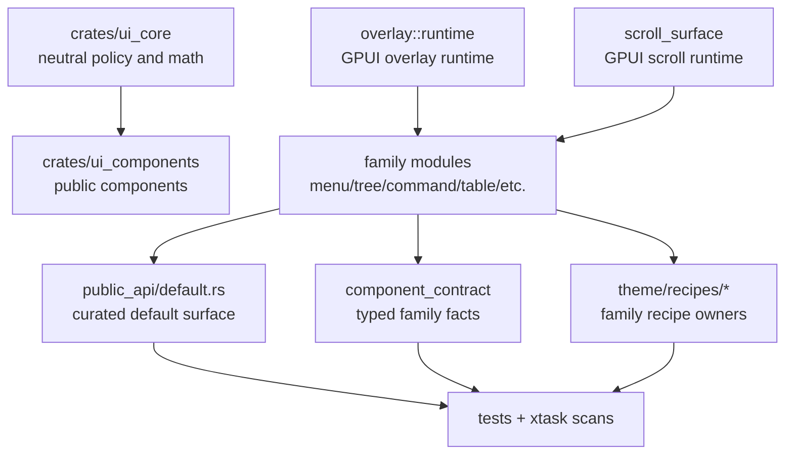

# UI Runtime Surface Deepening - Plan

## Goal Capsule

| Field | Decision |
|---|---|
| Objective | Deepen the Open GPUI component library into a more durable general UI framework by moving repeated GPUI adapter mechanics behind family-owned runtime modules, narrowing the default public surface, and keeping neutral contracts testable. |
| Authority | The current product boundary is `crates/ui_core` plus `crates/ui_components`; ADR 0008 and `docs/ui/component-contract.md` override older headless-extraction plans. |
| Execution profile | Breaking changes are allowed; obsolete compatibility exports and duplicated adapter code should be removed when the new owning module is in place. |
| Priority order | Overlay runtime first, scroll runtime second, public surface third, contract/theme ownership after the behavior seams are stable. |
| Stop conditions | Stop only for a blocker that contradicts the current product boundary, requires a new crate, or would force deleting user work outside this refactor. |
| Tail ownership | `ce-work` owns implementation, focused verification, simplification, code review, and logical conventional commits. |

---

## Product Contract

### Summary

Open GPUI's UI component library is already usable as a desktop-first GPUI framework, but several framework mechanics are still exposed as repeated component-local code.
The refactor should make overlay and scroll behavior deep modules, make default imports predictable for application authors, and keep source-owned contracts authoritative without reintroducing generated registries or a standalone headless crate.

### Problem Frame

The current UI library has many official components and strong resolved-state contracts, but the hardest behavior is still implemented in several adapters at once.
Overlay components repeat open-state, focus, dismissal, and deferred layer wiring.
Scroll-heavy surfaces repeat `ScrollHandle` lifetime, wheel containment, reset, and reveal-to-active rules.
`public_api/default.rs` re-exports almost every component type plus command and UI-core internals, which makes the default import surface look like a dumping ground rather than a framework API.
The component contract and theme recipes are source-owned, but their current central modules are becoming coordination hot spots.

### Requirements

**Overlay runtime**

- R1. Overlay components use one GPUI runtime owner for controlled/uncontrolled open state, Escape and outside-press dismissal, focus handle lifetime, focus restoration, and deferred layer mounting decisions.
- R2. Renderer-neutral overlay facts remain in `open_gpui_ui_core`; GPUI `Window`, `App`, `FocusHandle`, callbacks, `ElementId`, and concrete elements stay in `open_gpui_ui_components`.
- R3. Tooltip, HoverCard, Popover, Dialog, AlertDialog, Sheet, Menu, ContextMenu, Select, Combobox, and Command keep their public behavior while deleting duplicated adapter-local overlay mechanics.

**Scroll runtime**

- R4. ScrollArea, VirtualizedList, Tree, and Table consume one GPUI scroll surface owner for handle lifetime, reset-on-key-change, wheel containment, scroll-to-active, and nested viewport policy.
- R5. Virtualizer and row-window math remain renderer-neutral in `open_gpui_ui_core`; GPUI scroll handles and event suppression remain adapter-owned.

**Public framework surface**

- R6. `open_gpui_ui_components::prelude` and the crate root expose a curated application-facing component API, not every command runtime, registry, core table, or adapter helper type.
- R7. Advanced command, table-core, theme-runtime, and GPUI adapter APIs remain importable from their owning modules when they are still intentional public APIs.
- R8. Compatibility re-exports may be deleted instead of deprecated when they obscure the intended ownership boundary and focused tests are updated.

**Contract and theme ownership**

- R9. Component contract facts stay source-owned and typed under `crates/ui_components/src/component_contract/`, but family-local rows and projections replace one growing central authority where practical.
- R10. Theme recipe resolution keeps the existing `ThemeResolver` call surface while moving recipe implementations into family-owned modules that match component ownership.
- R11. No generated component registry, scaffold manifest, or standalone `open-gpui-ui-headless` crate is introduced in this refactor.

### Scope Boundaries

- In scope: refactoring current crates, changing public exports, moving code between modules, deleting obsolete compatibility shims, strengthening tests, and updating docs/gallery contracts.
- In scope: breaking import paths for callers that depended on default-surface internals.
- Out of scope: creating a new UI crate, copying `repo-ref/fret` or `repo-ref/gpui-component` wholesale, adding a generated component registry, native OS menu integration, and broad visual redesign.
- Deferred: a future headless crate can use the resulting neutral contracts as evidence, but this plan does not create it.

### Acceptance Examples

- AE1. A Popover and a Select dismiss through the same runtime path for Escape and outside press, while their public `*State` types still contain only neutral overlay facts.
- AE2. A VirtualizedList and a Tree reveal their active row through the same scroll surface helper, while their selection and hierarchy behavior remain component-owned.
- AE3. A caller importing the prelude gets official components and stable state types, while command registry and table-core internals require explicit module imports.
- AE4. `cargo run -p xtask -- scan-ui-contract` fails when contract rows, docs tokens, gallery status, default exports, a11y evidence, or theme schema ownership drift.

### Sources

- `docs/ui/component-contract.md`
- `docs/ui/command-ecosystem.md`
- `docs/adr/0008-open-gpui-ui-component-productization-roadmap.md`
- `docs/plans/2026-07-02-003-refactor-ui-framework-deep-modules-plan.md`
- `docs/plans/2026-07-01-005-refactor-ui-contract-a11y-theme-plan.md`
- `repo-ref/gpui-component/crates/ui/src/lib.rs`
- `repo-ref/fret/ecosystem/fret-ui-kit/src/lib.rs`

---

## Planning Contract

### Key Technical Decisions

- KTD1. Keep `ui_core` neutral and push concrete GPUI runtime ownership into `ui_components`.
  This matches the current crate boundary and prevents a premature headless extraction from dictating today's API.
- KTD2. Build deep runtime seams before shrinking the public surface.
  Overlay and scroll runtime moves clarify which types are framework APIs and which are adapter internals.
- KTD3. Use family modules as the ownership unit.
  `menu`, `tree`, and `command` already show the desired split between descriptors, model, render plan, runtime, and style.
- KTD4. Delete compatibility exports when they preserve the wrong abstraction.
  The user explicitly allows breaking changes, so compatibility only stays when it helps real callers without hiding ownership.
- KTD5. Keep contract data typed and source-owned.
  The removed hybrid registry should not return as generated JSON; scans and tests should inspect typed source facts.
- KTD6. Keep `ThemeResolver` stable while splitting implementation files.
  Application code should not learn new theme APIs just because recipe functions move to family modules.

### High-Level Technical Design

### Sequencing

Overlay runtime lands first because it is the highest-risk repeated adapter behavior and touches focus, dismissal, and layer ordering.
Scroll runtime lands second because it is similarly repeated but easier to validate through behavior snapshots and focused scroll tests.
Public-surface narrowing follows those behavior moves so exports point to the new owners.
Contract and theme ownership changes land after the new owners exist, reducing churn in scans and docs.

### System-Wide Impact

- Application import paths may break for command registry, UI-core table, virtualizer, and adapter helper types that were previously re-exported by default.
- Gallery and contract tests become stricter because they should validate owner modules rather than a monolithic default export list.
- Overlay and scroll bugs can regress user-facing desktop interactions, so each runtime unit needs behavior evidence before broad cleanup.
- Docs must describe the current product boundary, not old extraction plans.

### Risks and Mitigations

| Risk | Mitigation |
|---|---|
| Overlay runtime centralization accidentally changes dismissal ordering. | Characterize current Escape/outside behavior in `crates/ui_components/tests/overlay.rs` before changing adapters. |
| Scroll surface centralization changes nested wheel behavior. | Add focused assertions for wheel containment and reveal-to-active paths in `crates/ui_components/tests/layout.rs`, `crates/ui_components/tests/table.rs`, and component-local tests. |
| Public-surface breakage hides real downstream dependencies. | Run crate checks for `open-gpui-ui-components` and `open-gpui-ui-foundation-gallery`; update imports and contract ownership deliberately rather than restoring broad exports. |
| Theme recipe splitting creates circular module dependencies. | Keep recipe modules private under `theme/recipes/` and expose only `ThemeResolver` methods. |
| Contract sharding creates duplicate truth. | Keep one public `component_contract` facade and use scans to assert row/projection parity. |

---

## Implementation Units

### U1. Baseline Characterization and Ownership Map

- **Goal:** Establish the current failing/passing baseline for the surfaces this refactor will touch.
- **Requirements:** R1-R11.
- **Files:** `crates/ui_components/src/overlay.rs`, `crates/ui_components/src/scroll_area.rs`, `crates/ui_components/src/virtualized_list.rs`, `crates/ui_components/src/table/body/scroll.rs`, `crates/ui_components/src/tree/runtime.rs`, `crates/ui_components/src/public_api/default.rs`, `crates/ui_components/src/component_contract/`, `crates/ui_components/src/theme/recipes.rs`, `crates/ui_components/tests/overlay.rs`, `crates/ui_components/tests/layout.rs`, `crates/ui_components/tests/navigation.rs`, `crates/ui_components/tests/table.rs`, `crates/ui_components/tests/public_surface.rs`, `crates/ui_components/tests/public_surface/`, `crates/ui_components/tests/theme.rs`, `examples/ui-foundation-gallery/tests/foundation_gallery/`, `docs/ui/component-contract.md`.
- **Patterns:** `crates/ui_components/src/menu/runtime.rs`, `crates/ui_components/src/command/runtime.rs`, `crates/ui_components/src/tree/runtime.rs`.
- **Approach:** Run focused inventory commands and tests, record missing tests as code changes in the relevant test files rather than writing progress into this plan.
- **Test Scenarios:** Existing overlay policy tests pass; public surface tests identify current default export expectations; contract scan reports current source ownership; theme schema scan reports current recipe/schema state.
- **Verification:** Focused baseline commands from the Verification Contract have observed results before U2 starts.

### U2. Overlay Runtime Owner

- **Goal:** Replace loose overlay adapter helpers with a GPUI overlay runtime module that owns repeated open/focus/dismiss/layer mechanics.
- **Requirements:** R1, R2.
- **Files:** `crates/ui_components/src/overlay.rs`, `crates/ui_components/src/overlay/runtime.rs`, `crates/ui_components/src/lib.rs`, `crates/ui_components/tests/overlay.rs`.
- **Patterns:** `crates/ui_components/src/menu/runtime.rs`, `crates/ui_components/src/command/runtime.rs`, `crates/ui_core/src/overlay.rs`.
- **Approach:** Split `overlay.rs` into a facade plus runtime/placement/policy helpers where needed; keep public neutral re-exports minimal; move controlled/uncontrolled runtime state, callback emission, focus restoration, Escape, outside press, and deferred layer helpers behind one adapter owner.
- **Test Scenarios:** Controlled open sync updates runtime state without duplicate callbacks; uncontrolled dismissal mutates adapter state before callback; Escape dismisses only interactive overlays; outside pass-through dismissal preserves underlay dispatch intent; focus restore applies only when the policy requests trigger restoration.
- **Verification:** `cargo nextest run -p open-gpui-ui-components --test overlay --no-fail-fast`.

### U3. Overlay Family Migration

- **Goal:** Make overlay-bearing components consume the new runtime owner and delete their duplicated GPUI mechanics.
- **Requirements:** R1-R3.
- **Files:** `crates/ui_components/src/tooltip.rs`, `crates/ui_components/src/hover_card.rs`, `crates/ui_components/src/popover.rs`, `crates/ui_components/src/dialog.rs`, `crates/ui_components/src/alert_dialog.rs`, `crates/ui_components/src/sheet.rs`, `crates/ui_components/src/menu/`, `crates/ui_components/src/context_menu/`, `crates/ui_components/src/select.rs`, `crates/ui_components/src/combobox.rs`, `crates/ui_components/src/command/`, `examples/ui-foundation-gallery/src/pages/overlay.rs`, `examples/ui-foundation-gallery/src/shell/overlay.rs`.
- **Patterns:** `crates/ui_components/src/menu/runtime.rs`, `crates/ui_components/src/context_menu/model.rs`, `crates/ui_components/src/command/runtime.rs`.
- **Approach:** Migrate in serial sub-batches: anchored descriptive/non-modal overlays, modal overlays, then choice/command/menu overlays. Remove old local open/focus/dismiss helpers after each sub-batch compiles, and keep resolved-state semantics unchanged unless the previous behavior contradicts the shared policy.
- **Test Scenarios:** Popover, Select, Combobox, and Command still open and dismiss through their public callbacks; Dialog, AlertDialog, and Sheet keep modal barrier behavior; Menu and ContextMenu keep submenu and point-anchor placement behavior; Tooltip stays descriptive and non-interactive.
- **Verification:** `cargo nextest run -p open-gpui-ui-components --test overlay --no-fail-fast`; `cargo nextest run -p open-gpui-ui-components --test choice --no-fail-fast`; `cargo check -p open-gpui-ui-foundation-gallery --tests`.

### U4. Scroll Surface Runtime Owner

- **Goal:** Create one GPUI scroll surface owner for handle lifetime, reset, wheel containment, and reveal-to-active behavior.
- **Requirements:** R4, R5.
- **Files:** `crates/ui_components/src/scroll_area.rs`, `crates/ui_components/src/scroll_surface.rs`, `crates/ui_components/src/lib.rs`, `crates/ui_components/tests/layout.rs`, `crates/ui_components/tests/table.rs`, `crates/ui_components/tests/navigation.rs`.
- **Patterns:** `crates/ui_components/src/tree/runtime.rs`, `crates/ui_components/src/table/body/scroll.rs`, `crates/ui_components/src/virtualized_list.rs`, `crates/ui_core/src/virtualizer.rs`, `crates/ui_core/src/grid_viewport.rs`.
- **Approach:** Introduce a crate-private scroll runtime API that can produce persistent handles, reset decisions, wheel containment handlers, and fixed-row reveal targets without moving neutral range math out of `ui_core`.
- **Test Scenarios:** ScrollArea preserves its keyed runtime handle by default; reset-on-key-change resets only after the key changes; wheel containment prevents page scroll leakage for nested viewports; reveal-to-active clamps empty and out-of-range targets; helper math matches existing virtualized-list scroll target behavior.
- **Verification:** `cargo nextest run -p open-gpui-ui-components --test layout --no-fail-fast`; `cargo nextest run -p open-gpui-ui-components --test table --no-fail-fast`.

### U5. Scroll Family Migration

- **Goal:** Move VirtualizedList, Tree, and Table scroll-heavy adapters onto the shared scroll surface owner.
- **Requirements:** R4, R5.
- **Files:** `crates/ui_components/src/virtualized_list.rs`, `crates/ui_components/src/tree/runtime.rs`, `crates/ui_components/src/tree/mod.rs`, `crates/ui_components/src/table/body/scroll.rs`, `crates/ui_components/src/table/runtime.rs`, `examples/ui-foundation-gallery/src/pages/components/runtime/virtualized_list.rs`, `examples/ui-foundation-gallery/src/pages/components/runtime/tree.rs`, `examples/ui-foundation-gallery/src/pages/components/runtime/table.rs`.
- **Patterns:** `crates/ui_components/src/scroll_area.rs`, `crates/ui_components/src/table/body/layout.rs`, `crates/ui_components/src/tree/render_plan.rs`.
- **Approach:** Replace local scroll handle state and reveal helpers with the shared scroll surface API, preserving component-owned selection, row-window, and hierarchy behavior.
- **Test Scenarios:** VirtualizedList keyboard navigation reveals active rows; Tree typeahead and keyboard focus reveal focused rows without selecting them; Table center row virtualization keeps top/bottom pinned rows outside the center viewport; gallery runtime readouts still identify component viewports.
- **Verification:** `cargo nextest run -p open-gpui-ui-components --test navigation --no-fail-fast`; `cargo nextest run -p open-gpui-ui-components --test table --no-fail-fast`; `cargo check -p open-gpui-ui-foundation-gallery --tests`.

### U6. Curated Default Public Surface

- **Goal:** Shrink the default public API to official component-facing types and move advanced internals back to owner modules.
- **Requirements:** R6-R8.
- **Files:** `crates/ui_components/src/public_api/default.rs`, `crates/ui_components/src/public_api/mod.rs`, `crates/ui_components/src/prelude.rs`, `crates/ui_components/src/lib.rs`, `crates/ui_components/src/component_contract/surfaces.rs`, `crates/ui_components/src/component_contract/projections.rs`, `crates/ui_components/tests/public_surface.rs`, `crates/ui_components/tests/public_surface/`, `docs/ui/component-contract.md`, `docs/ui/command-ecosystem.md`.
- **Patterns:** `repo-ref/gpui-component/crates/ui/src/lib.rs`, `repo-ref/fret/ecosystem/fret-ui-kit/src/lib.rs`, `crates/ui_components/src/component_contract/surfaces.rs`.
- **Approach:** Define the default surface as official components, stable resolved states, and app-facing helpers; update contract projection/default-export intent in the same unit; remove default re-exports for command registry runtime, table-core internals, adapter helpers, and raw virtualizer/core types unless a component API requires them directly.
- **Test Scenarios:** Official component/state exports remain available through prelude and crate root; adapter-only helpers are available through `open_gpui_ui_components::gpui_adapter`; command registry types are imported from `open_gpui_command`; UI-core table and virtualizer types are imported from `open_gpui_ui_core`; public surface tests fail on accidental broad re-export.
- **Verification:** `cargo nextest run -p open-gpui-ui-components --test public_surface --no-fail-fast`; `cargo check -p open-gpui-ui-components --tests`; `cargo check -p open-gpui-ui-foundation-gallery --tests`.

### U7. Family-Owned Component Contract

- **Goal:** Move contract row ownership toward families while keeping one typed facade and one scan entry point.
- **Requirements:** R9, R11.
- **Files:** `crates/ui_components/src/component_contract/`, especially `crates/ui_components/src/component_contract/mod.rs`, `crates/ui_components/src/component_contract/rows.rs`, `crates/ui_components/src/component_contract/surfaces.rs`, `crates/ui_components/src/component_contract/projections.rs`, `crates/ui_components/src/component_contract/evidence.rs`, `crates/ui_components/src/component_contract/types.rs`, `crates/ui_components/src/component_contract/api_inventory.rs`, `crates/ui_components/src/component_contract/source_mapping.rs`, `crates/ui_components/tests/public_surface/`, `xtask/src/ui_contract.rs`, `docs/ui/component-contract.md`.
- **Patterns:** `crates/ui_components/src/menu/`, `crates/ui_components/src/tree/`, `crates/ui_components/src/command/`.
- **Approach:** Split contract sources by family or concern under `component_contract/` while preserving existing public constants/functions from `component_contract::mod`; update scans to inspect the facade and enforce no generated registry artifacts.
- **Test Scenarios:** Contract rows still cover every official component; default export intent matches U6; docs and gallery tokens match rows; a11y evidence remains aligned with `ComponentA11yContract`; no registry JSON/schema artifact is required.
- **Verification:** `cargo run -p xtask -- scan-ui-contract`; `cargo nextest run -p open-gpui-ui-components --test public_surface --no-fail-fast`.

### U8. Family-Owned Theme Recipes

- **Goal:** Split recipe implementations by component family while preserving `ThemeResolver` as the call surface.
- **Requirements:** R10, R11.
- **Files:** `crates/ui_components/src/theme/recipes.rs`, `crates/ui_components/src/theme/recipes/`, `crates/ui_components/src/theme/resolver.rs`, `crates/ui_components/src/theme/schema.rs`, `crates/ui_components/tests/theme.rs`, `xtask/src/theme_schema.rs`, `docs/ui/component-contract.md`.
- **Patterns:** `crates/ui_components/src/theme/palette.rs`, `crates/ui_components/src/theme/registry.rs`, `crates/ui_components/src/theme/runtime.rs`.
- **Approach:** Move recipe bodies into private family modules such as `action`, `form`, `overlay`, `data`, and `feedback`; keep `impl ThemeResolver` methods stable or re-exported through a private facade; update the recipe catalog and theme schema scan.
- **Test Scenarios:** Existing light/dark/high-contrast snapshots produce the same component color intents; schema generation includes the same public theme fields; new recipe modules do not create circular component dependencies.
- **Verification:** `cargo nextest run -p open-gpui-ui-components --test theme --no-fail-fast`; `cargo run -p xtask -- scan-theme-schema`.

### U9. Documentation, Gallery, and Final Simplification

- **Goal:** Align docs, gallery story contracts, and final code shape with the new runtime owners and curated surface.
- **Requirements:** R1-R11.
- **Files:** `docs/ui/component-contract.md`, `docs/ui/command-ecosystem.md`, `examples/ui-foundation-gallery/src/pages/components/`, `examples/ui-foundation-gallery/src/pages/overlay.rs`, `crates/ui_components/tests/`, changed runtime modules.
- **Patterns:** `examples/ui-foundation-gallery/src/pages/components/runtime/`, `examples/ui-foundation-gallery/src/pages/components/conformance.rs`.
- **Approach:** Remove stale references to old adapter helper ownership, update gallery imports and story contracts for new paths, run a simplification pass across recently changed files, and delete dead helpers introduced or made obsolete by U2-U8.
- **Test Scenarios:** Gallery still compiles; story contract selectors still cover overlay, scroll, focus, select, edit, activate, and public payload probes; docs name current owners and do not imply an active headless extraction or generated registry.
- **Verification:** `cargo check -p open-gpui-ui-foundation-gallery --tests`; `cargo fmt --all -- --check`; `git diff --check`.

---

## Verification Contract

| Gate | Command | Applies To | Done Signal |
|---|---|---|---|
| Formatting | `cargo fmt --all -- --check` | All units | No formatting diff required. |
| UI components compile | `cargo check -p open-gpui-ui-components --tests` | U2-U8 | Package and tests compile after breaking API changes. |
| Gallery compile | `cargo check -p open-gpui-ui-foundation-gallery --tests` | U3, U5, U9 | Gallery imports and story contracts compile. |
| Command crate compile | `cargo check -p open-gpui-command --tests` | U6 | Command crate remains independent from UI surface changes. |
| Overlay behavior | `cargo nextest run -p open-gpui-ui-components --test overlay --no-fail-fast` | U2, U3 | Shared overlay runtime behavior is covered. |
| Choice overlays | `cargo nextest run -p open-gpui-ui-components --test choice --no-fail-fast` | U3 | Select, Combobox, Command choice semantics still pass. |
| Scroll/layout behavior | `cargo nextest run -p open-gpui-ui-components --test layout --no-fail-fast` | U4 | ScrollArea and layout contracts pass. |
| Navigation behavior | `cargo nextest run -p open-gpui-ui-components --test navigation --no-fail-fast` | U5 | Tree, toolbar, sidebar, and virtualized navigation pass. |
| Table behavior | `cargo nextest run -p open-gpui-ui-components --test table --no-fail-fast` | U4, U5 | Table body scroll and virtualization contracts pass. |
| Public surface | `cargo nextest run -p open-gpui-ui-components --test public_surface --no-fail-fast` | U6, U7 | Default exports and contract rows match intended owners. |
| Theme behavior | `cargo nextest run -p open-gpui-ui-components --test theme --no-fail-fast` | U8 | Theme recipe behavior remains stable. |
| Contract scan | `cargo run -p xtask -- scan-ui-contract` | U7, U9 | Source-owned contract facts, docs, gallery, a11y, and default export intent align. |
| Theme schema scan | `cargo run -p xtask -- scan-theme-schema` | U8, U9 | Theme schema artifact matches source definitions. |
| Diff hygiene | `git diff --check` | All units | No whitespace or conflict-marker issues. |

---

## Definition of Done

- U1-U9 are implemented or a genuine blocker is documented with the exact contradiction.
- Overlay-bearing components consume the shared GPUI overlay runtime owner, and obsolete local overlay helpers are removed.
- Scroll-heavy components consume the shared GPUI scroll surface owner, and obsolete local scroll handle/reveal/reset helpers are removed.
- The default public surface is curated and focused; advanced command, UI-core, theme-runtime, and GPUI adapter types are imported from owner modules.
- Component contract facts are still typed and source-owned, with family-local ownership where practical and no generated registry artifact.
- Theme recipe implementations are family-owned while preserving `ThemeResolver` as the application-facing call surface.
- `docs/ui/component-contract.md` and `docs/ui/command-ecosystem.md` describe the new ownership boundaries.
- Verification Contract gates pass, or any unavailable gate is recorded with the command, failure mode, and replacement evidence.
- Dead-end experimental code and compatibility shims made obsolete by this refactor are removed from the diff.
- Logical completed units are committed with conventional commit messages, staging only files changed for this work.
