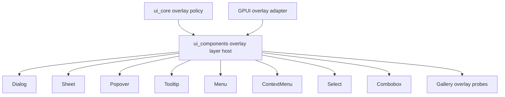
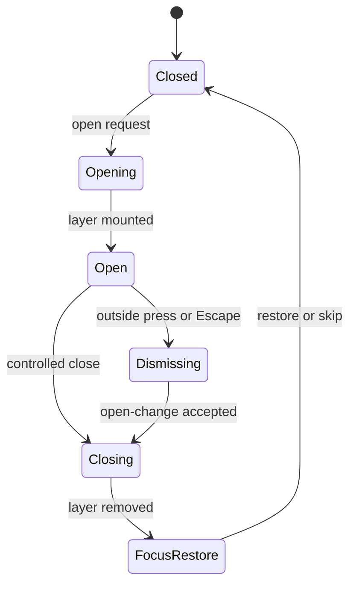
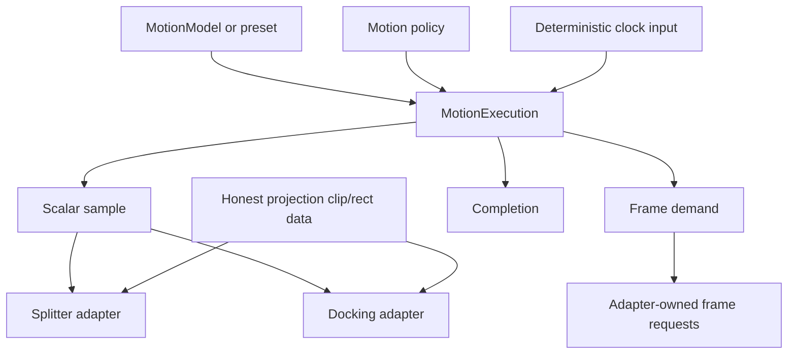
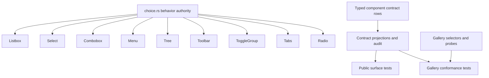

# UI Framework Layer Motion Conformance - Plan

## Goal Capsule

| Field | Decision |
|---|---|
| Objective | Deepen the official Open GPUI UI framework around overlay layer hosting, motion execution, choice navigation, component contract locality, gallery conformance, and public API honesty. |
| Authority | ADR 0004, ADR 0005, ADR 0007, ADR 0008, ADR 0014, ADR 0017, the current `refactor/ui-framework-non-overlay-depth` branch, and the architecture report generated from local source and `repo-ref/fret` / `repo-ref/motion` comparison. |
| Execution profile | Fearless refactor. Breaking API changes, file moves, internal module reshaping, and deletion are allowed when they remove duplicate ownership, shallow public surface, or unsupported framework promises. |
| Product boundary | Keep `open-gpui-ui-core`, `open-gpui-ui-components`, `open_gpui_command`, `open-gpui-docking`, and `examples/ui-foundation-gallery` as the active product boundary. Do not create a standalone headless crate or generated component registry. |
| Stop conditions | Stop and re-plan if implementation requires copying Motion DOM/React runtime, rebuilding the removed native UI registry manifest, moving application-level editor/chart/webview surfaces into the base component crate, or weakening existing contract drift gates. |
| Tail ownership | The goal execution owns implementation, focused verification, cleanup of abandoned attempts, code review, logical commits, and the landing path allowed by repo conventions and user preference. |

---

## Product Contract

### Summary

This plan turns the architecture audit into implementation work for the next official component-library layer.
It prioritizes an overlay layer host first, then motion execution and projection honesty, then choice/navigation and contract/gallery locality so the component library becomes more useful without becoming an all-in-one application UI crate.

### Problem Frame

Open GPUI already has strong foundation modules: `ui_core` owns neutral overlay policy, motion math, sizing, split/table/virtualizer state, and behavior primitives; `ui_components` owns GPUI adapters and styled components; the gallery and typed component contract rows provide drift evidence.
The remaining architecture risk is not lack of code, but repeated orchestration logic and public surfaces that overpromise what the framework owns.

Overlay policy exists in `crates/ui_core/src/overlay.rs`, and GPUI overlay helpers exist in `crates/ui_components/src/overlay/`.
However, components such as Sheet, Popover, ContextMenu, Menu, Dialog, and Tooltip still assemble open-change callbacks, outside-press behavior, Escape handling, focus restore, deferred layer wiring, and placement/layer rendering locally.
That spreads the same lifecycle rules across leaf components instead of giving the component library a single layer-host module.

Motion is in a similar second-stage state.
The current branch already made `motion_value` private and kept public motion APIs evidence-based, but Splitter and docking still own their own execution lifecycle around policy validation, start time, sampling, completion, frame demand, and projection conversion.
The next value is a renderer-neutral execution module and a narrower projection contract, not a public Motion clone.

Choice/search components were recently split and should not be reworked again for file-size reasons.
The next change is to make the shared navigation and typeahead behavior the internal authority across Listbox, Select, Combobox, Menu, Tree, Toolbar, ToggleGroup, Tabs, and Radio without creating a new headless crate.

The component contract and gallery are useful but still require too much cross-file knowledge for audit work.
The typed contract rows should remain the local product metadata authority, while gallery-owned selectors, probes, and readouts should become easier to verify without rebuilding the removed generated registry.

### Requirements

**Overlay layer host**

- R1. `ui_core` keeps renderer-neutral overlay policy, presence, stack arbitration, focus intent, dismissal reasons, and placement input; it must not import GPUI runtime types.
- R2. `ui_components` gains a deeper overlay layer host module that owns GPUI overlay lifecycle glue for open-change emission, outside-press requests, Escape requests, focus restore, deferred layer rendering, and placement conversion.
- R3. Dialog, AlertDialog, Sheet, Popover, HoverCard, Menu, ContextMenu, Select, Combobox, and Command consume the shared overlay host where they repeat layer lifecycle behavior, while their component-specific state and styling remain local. Tooltip may consume only the non-interactive layer/placement path because it does not own dismissal or focus-restore lifecycle.
- R4. Overlay migration must preserve modal/non-modal behavior, pass-through versus consume semantics, initial focus, focus restore, placement fit, and component gallery overlay proofs.

**Motion execution**

- R5. `ui_core` gains a renderer-neutral motion execution boundary that extends or consolidates the existing `MotionScalarTrack` / `MotionScalarController` owner for explicit `MotionModel`, policy validation, deterministic clock input, scalar sampling, completion, and frame demand without owning GPUI frame scheduling or creating a second run owner.
- R6. Splitter and docking migrate from adapter-local execution loops to the shared execution contract where it reduces duplication; pointer-coupled drag and high-frequency focus changes stay immediate.
- R7. Projection APIs are narrowed or consumed honestly so public exports do not imply transform-tree, scale-correction, or DOM-like projection capability that current GPUI adapters do not use.

**Choice navigation**

- R8. Shared choice navigation and typeahead behavior becomes the internal authority for all first-party choice-like components, including Listbox, Select, Combobox, Menu, Tree, Toolbar, ToggleGroup, Tabs, and Radio.
- R9. `roving_focus.rs` may remain as a compatibility or low-level adapter only if it no longer acts as a competing behavior owner for stable-value selection, disabled-skip, wrap, and typeahead rules.

**Contract and gallery locality**

- R10. `component_contract` rows, projections, inventory, evidence, source mapping, docs status, and gallery status stay typed Rust facts, but audit logic should be deepened so a contributor can update a component surface without editing unrelated fact owners.
- R11. Gallery conformance keeps gallery-owned selectors and runtime probes local to the gallery, while tests consume typed component contract facts instead of duplicating registry-like metadata.
- R12. No generated registry manifest, JSON/schema artifact, scaffold metadata, hosted component registry, or `gpui add` surface is introduced in this plan. Existing typed Rust public-surface owner maps and manifest tests are drift gates and must be preserved.

**Public API and deletion**

- R13. Public exports must represent supported owner boundaries: component APIs from `open_gpui_ui_components`, neutral foundation APIs from `open_gpui_ui_core`, command APIs from `open_gpui_command`, and adapter-only helpers under `gpui_adapter`.
- R14. Unsupported public surfaces, duplicate helpers, stale docs, and dead code should be deleted rather than kept behind compatibility shims unless first-party usage or documented migration needs justify keeping them.

### Acceptance Examples

- AE1. Given a Popover, Sheet, and ContextMenu with equivalent dismissal policy, when outside press or Escape is resolved, then the decision and open-change callback path are produced by the shared overlay layer host rather than component-local copies.
- AE2. Given a modal Sheet and a non-modal Popover, when each closes, then focus restore honors the component's configured intent and pass-through policy exactly as before the host migration.
- AE3. Given Splitter and docking transitions using the same motion model and policy context, when sampled under deterministic time, then both use the shared execution lifecycle and request frames only while active.
- AE4. Given reduced motion, pointer drag, or high-frequency focus movement, when motion execution evaluates policy, then final semantic state is correct and no spatial smoothing is introduced where policy forbids it.
- AE5. Given a Listbox-like component with disabled rows, separators, grouping, selection, active item, wrap, and typeahead, when navigation is resolved, then all first-party choice-like surfaces use the same internal behavior authority.
- AE6. Given a component public-surface change, when contract and gallery gates run, then typed contract rows, source mapping, docs status, gallery status, and rendered gallery probes agree without a generated registry artifact.

### Scope Boundaries

#### In Scope

- Overlay layer-host module design and migration for first-party overlay consumers.
- Motion execution lifecycle and projection/public-surface honesty for Splitter and docking.
- Internal choice navigation consolidation without a new crate.
- Component contract audit locality and gallery conformance simplification.
- Public API cleanup, stale doc cleanup, and deletion of unused or misleading code.
- Focused verification with `nextest`, `cargo fmt`, `cargo check`, contract scans, and gallery smoke/contract tests.

#### Deferred to Follow-Up Work

- Standalone `open-gpui-ui-headless` crate creation.
- Full public animation builder DSL, keyframes, repeat, pause/seek/speed, subscribers, dependent value graphs, scroll-linked animation, or compositor-backed motion.
- Native platform overlay manager across multiple windows.
- Hosted registry, source-copy recipes, marketplace, `gpui add`, or generated registry manifests.
- Optional icon/assets crate unless implementation discovers it is required for this refactor.
- Visual redesign of gallery pages beyond what conformance controls require.

#### Outside This Product's Identity

- Copying `gpui-component` as an all-in-one component crate.
- Copying Motion's React hooks, DOM measurement, CSS/WAAPI runtime, global frameloop, browser observers, or promise/event playback model.
- Moving editor, markdown/HTML rendering, charts, LSP, webview, or application shell settings into the base UI component crate.

---

## Planning Contract

### Key Technical Decisions

- KTD1. Build `OverlayLayerHost` as a deep GPUI adapter facade, not a new runtime layer in `ui_core`. Neutral policy stays in `ui_core`; the host composes existing `overlay/runtime.rs`, `overlay/adapter.rs`, and `overlay/placement.rs` rather than reimplementing outside/Escape/focus policy.
- KTD2. Migrate overlay consumers by lifecycle duplication, not by component category. A component should move to the host when it repeats dismiss/focus/layer orchestration; component-specific layout, visual styling, and builder state stay local.
- KTD3. Add or deepen motion execution as the single renderer-neutral run boundary with adapter-owned scheduling. Prefer extending/consolidating the existing `motion_controller` owner; if a new `motion_execution.rs` module is introduced, it must delete, privatize, or re-export the old path without leaving two public execution owners. GPUI windows still decide when to request animation frames.
- KTD4. Make projection honest before widening motion. Keep `MotionProjectionClip`-style final-content/visible-bounds evidence if that is what adapters consume; delete or privatize projection sample fields that claim unused transform-tree capability.
- KTD5. Treat `choice.rs` as the internal behavior owner. `roving_focus.rs` can survive as a low-level helper only if the higher-level choice collection remains the source of stable-value, disabled, wrap, activation, and typeahead semantics.
- KTD6. Keep `component_contract` typed and local. ADR 0014 removed generated registries because they duplicated source facts; this plan deepens the typed contract modules instead of restoring a manifest under a new name.
- KTD7. Gallery evidence supports the contract, it does not become a second metadata owner. Gallery selectors, story probes, typed public-surface owner maps, and manifest tests stay drift gates validated against typed contract facts.
- KTD8. Delete misleading public surface aggressively. When a symbol has no supported owner or first-party proof, remove it and update first-party callers; keep compatibility only when the owner boundary remains coherent.

### High-Level Technical Design

### Assumptions

- The user has authorized a broad fearless refactor, breaking changes, deletion of unneeded code, subagent assistance, and logical commits.
- The current branch `refactor/ui-framework-non-overlay-depth` is the active work branch for this plan.
- `repo-ref/gpui-components` / `repo-ref/gpui-component` source is not present locally, so `gpui-component` input comes from existing ADRs and research artifacts; `repo-ref/fret` and `repo-ref/motion` are available local references.
- Existing Select and Combobox split-module work is treated as completed baseline, not repeated work.
- Existing `motion_value` privacy is treated as completed baseline; this plan starts from the current private implementation.

### Phased Delivery

| Phase | Units | Exit Boundary |
|---|---|---|
| P1 Overlay host | U1, U2 | Overlay behavior is characterized, shared host owns repeated lifecycle glue, and overlay consumers still pass focused component/gallery tests. |
| P2 Motion execution | U3, U4 | Splitter and docking share execution vocabulary, policy gates run through real paths, and projection exports only claim consumed capability. |
| P3 Choice and conformance | U5, U6 | Choice navigation ownership is unified through independently reviewable family slices, contract audit locality improves, and gallery conformance is easier to update without duplicate facts. |
| P4 Cleanup and landing | U7 | Public exports, docs, memory, and verification match the shipped ownership boundaries. |

### System-Wide Impact

- Downstream code using accidental component-root exports may break and must import from the owning crate instead.
- Overlay components will share a deeper runtime module, so behavior bugs in dismissal or focus restore become centralized and more visible.
- Motion API cleanup can break code that imports projection sample details directly; that is acceptable when the public claim has no first-party adapter proof.
- Gallery tests may become stricter because component contract facts and gallery probes will be cross-checked more directly.

### Risks & Mitigations

| Risk | Mitigation |
|---|---|
| Overlay migration changes focus or dismissal behavior. | Characterize current modal/non-modal, outside-press, Escape, focus restore, placement behavior, and consumer inventory/disposition before moving consumers. |
| Shared overlay host becomes a shallow wrapper around existing duplication. | Require at least Sheet, Popover, ContextMenu/Menu, and one selection popup to consume the shared lifecycle path before considering the unit done. |
| Motion execution expands into a general animation framework. | Keep keyframes, subscribers, group playback, global frameloop, and compositor APIs out of scope until another plan accepts them. |
| Projection cleanup breaks Splitter or docking visual continuity. | Characterize current samples first, then narrow only fields not consumed by adapters or tests. |
| Choice consolidation reopens recently completed Select/Combobox structure. | Limit work to behavior ownership and tests; do not split files again for file-size reasons. |
| Contract/gallery cleanup recreates the removed registry. | Keep all durable facts in typed Rust rows and tests; do not emit JSON/schema/scaffold artifacts. |
| Autonomous execution accumulates abandoned experimental code. | Definition of Done requires removal of abandoned attempts and no dead compatibility paths. |

### Sources & Research

- `docs/adr/0004-open-gpui-component-library-strategy.md` accepts a layered official component ecosystem and rejects the `gpui-component` all-in-one crate shape.
- `docs/adr/0005-open-gpui-official-component-architecture.md` defines adapter-first, headless-ready components with resolved state separated from GPUI render responsibilities.
- `docs/adr/0007-open-gpui-ui-headless-boundary-design.md` names overlay policy, roving focus, listbox navigation, scroll viewport, and splitter constraints as extractable behavior candidates while keeping GPUI handles and rendering adapter-owned.
- `docs/adr/0008-open-gpui-ui-component-productization-roadmap.md` keeps the current UI crates as the active product boundary and prioritizes contract, accessibility, theme, and gallery productization before standalone headless extraction.
- `docs/adr/0014-remove-native-ui-hybrid-registry.md` removes generated registry/schema/scaffold surfaces and keeps typed `component_contract` rows as the local authority.
- `docs/adr/0017-ui-motion-value-foundation.md` accepts explicit motion model/run/policy/projection contracts while rejecting Motion DOM/React/global-runtime parity.
- `docs/plans/2026-07-04-002-refactor-ui-framework-non-overlay-depth-plan.md` is the current baseline for completed Select/Combobox split, choice boundary, default export narrowing, and `motion_value` privacy.
- `repo-ref/fret/ecosystem/fret-ui-kit/src/overlay_controller.rs` supports a stable facade over window overlay stacks and arbitration snapshots.
- `repo-ref/fret/ecosystem/fret-ui-headless/src/roving_focus.rs` supports small deterministic behavior modules without moving render adapters.
- `repo-ref/motion/packages/motion-dom/src/animation/JSAnimation.ts`, `repo-ref/motion/packages/motion-dom/src/value/index.ts`, and `repo-ref/motion/packages/motion-dom/src/frameloop/batcher.ts` inform execution/value/frame separation but are not implementation targets.

---

## Implementation Units

### U1. Characterize Overlay Layer Lifecycle

- **Goal:** Lock current overlay behavior before moving lifecycle logic into a host.
- **Requirements:** R1, R2, R3, R4, AE1, AE2.
- **Dependencies:** None.
- **Files:** `crates/ui_core/src/overlay.rs`, `crates/ui_components/src/overlay/runtime.rs`, `crates/ui_components/src/overlay/adapter.rs`, `crates/ui_components/src/overlay/placement.rs`, `crates/ui_components/src/sheet.rs`, `crates/ui_components/src/popover.rs`, `crates/ui_components/src/context_menu/mod.rs`, `crates/ui_components/src/menu/runtime.rs`, `crates/ui_components/src/dialog.rs`, `crates/ui_components/src/alert_dialog.rs`, `crates/ui_components/src/hover_card.rs`, `crates/ui_components/src/command/mod.rs`, `crates/ui_components/src/command/runtime.rs`, `crates/ui_components/src/tooltip.rs`, `crates/ui_components/tests/overlay.rs`, `examples/ui-foundation-gallery/tests/foundation_gallery/overlay_contracts.rs`, `examples/ui-foundation-gallery/tests/foundation_gallery/overlay_smoke.rs`.
- **Approach:** Add or strengthen characterization tests and a consumer inventory/disposition for open-change emission, modal and non-modal outside press, pass-through versus consume behavior, Escape dismissal, focus restore intent, deferred layer rendering, and placement fit. Prefer tests that exercise component-facing runtime helpers so the later host migration proves behavior preservation.
- **Execution note:** Characterization-first. Observe the focused overlay tests passing on the current implementation before moving production code.
- **Patterns to follow:** Existing `overlay_open_change_helpers_match_core_policies`, overlay adapter config tests, Sheet/Popover state tests, and gallery overlay contract probes.
- **Test scenarios:**
  - Modal Sheet outside press produces dismiss-and-consume and restores focus according to configured intent.
  - Non-modal Popover outside press produces dismiss-and-pass-through and does not consume lower-layer interaction when policy says pass-through.
  - ContextMenu/Menu Escape closes only the top interactive layer and emits a single open-change callback.
  - Tooltip or non-interactive overlay is ignored by interactive outside-press and Escape resolution.
  - Placement resolution preserves preferred side, fallback side, alignment, snap margin, and constrained fit metadata.
  - Deferred layer rendering preserves focus restore behavior for close paths that cannot focus immediately.
- **Verification:** Focused overlay component and gallery tests pass before and after U2, proving the migration is behavior-preserving.

### U2. Add Overlay Layer Host And Migrate Consumers

- **Goal:** Centralize GPUI overlay lifecycle glue in a deep `ui_components` host module and migrate repeated component logic to it.
- **Requirements:** R1, R2, R3, R4, R13, R14, AE1, AE2.
- **Dependencies:** U1.
- **Files:** `crates/ui_components/src/overlay.rs`, `crates/ui_components/src/overlay/runtime.rs`, `crates/ui_components/src/overlay/adapter.rs`, `crates/ui_components/src/overlay/placement.rs`, `crates/ui_components/src/overlay/host.rs`, `crates/ui_components/src/sheet.rs`, `crates/ui_components/src/popover.rs`, `crates/ui_components/src/context_menu/mod.rs`, `crates/ui_components/src/menu/runtime.rs`, `crates/ui_components/src/dialog.rs`, `crates/ui_components/src/alert_dialog.rs`, `crates/ui_components/src/hover_card.rs`, `crates/ui_components/src/command/mod.rs`, `crates/ui_components/src/command/runtime.rs`, `crates/ui_components/src/tooltip.rs`, `crates/ui_components/src/select/runtime.rs`, `crates/ui_components/src/combobox/runtime.rs`, `crates/ui_components/tests/overlay.rs`, `crates/ui_components/tests/public_surface/adapter.rs`.
- **Approach:** Introduce a host/facade module that composes existing runtime, adapter, and placement helpers around resolved neutral policy, GPUI adapter state, trigger/focus information, placement input, and component-local open-change handlers. Migrate the highest-duplication consumers first: Sheet, Popover, ContextMenu/Menu, then one selection popup. Continue through Dialog, AlertDialog, HoverCard, Command, Select, and Combobox according to the inventory. Tooltip should only share non-interactive layer/placement plumbing unless characterization finds real dismissal lifecycle ownership.
- **Execution note:** Keep the first migration batch small enough to review. Do not consider U2 done until Sheet, Popover, ContextMenu/Menu, one selection popup, and every inventory-confirmed duplicate lifecycle consumer either uses the host path or has a recorded no-migration rationale. Host must not add a second outside/Escape/focus policy owner.
- **Patterns to follow:** `repo-ref/fret/ecosystem/fret-ui-kit/src/overlay_controller.rs`, existing `OverlayOpenRuntimeRequest` / `OverlayCloseRuntimeRequest`, and `GpuiOverlayAdapterConfig`.
- **Test scenarios:**
  - Sheet, Popover, and ContextMenu use the same close request path for outside press and Escape while preserving their public callbacks.
  - Menu and ContextMenu top-layer arbitration keeps submenu/menu ordering behavior stable.
  - Select and Combobox continue to open, close, restore focus, and render their popup listbox through existing public behavior after adopting the host path.
  - Public `gpui_adapter` exports expose only intentional overlay adapter helpers and do not leak host internals as a public component API.
  - Removing component-local helper code does not reduce coverage of U1 characterization cases.
- **Verification:** Overlay tests, affected choice/search tests, public adapter-surface tests, and gallery overlay smoke tests pass.

### U3. Introduce Motion Execution And Migrate Runtime Sampling

- **Goal:** Replace duplicated Splitter and docking motion lifecycle code with a renderer-neutral execution module.
- **Requirements:** R5, R6, R13, R14, AE3, AE4.
- **Dependencies:** None.
- **Files:** `crates/ui_core/src/motion_execution.rs`, `crates/ui_core/src/motion_controller.rs`, `crates/ui_core/src/motion_policy.rs`, `crates/ui_core/src/motion_runtime.rs`, `crates/ui_core/src/lib.rs`, `crates/ui_core/src/prelude.rs`, `crates/ui_components/src/splitter.rs`, `crates/gpui_docking/src/transition_executor.rs`, `crates/gpui_docking/src/host_transition_tests.rs`, `crates/ui_core/tests/headless_contracts.rs`.
- **Approach:** Deepen the existing motion controller/execution owner so it combines model, policy input, deterministic elapsed time, scalar sample, completion, and frame demand behind one public boundary. Migrate Splitter and docking to construct execution state through this boundary while keeping window frame requests, pointer drag, cursor state, live measurement, and semantic target ownership in adapters.
- **Execution note:** Proof-first. Add focused `ui_core` execution tests before migrating adapters, then migrate Splitter and docking one at a time.
- **Patterns to follow:** `MotionScalarTrack`, `MotionScalarController`, `MotionPolicyInput`, Splitter runtime tests, docking transition executor tests, and Motion's JSAnimation boundary only as execution/value separation prior art.
- **Test scenarios:**
  - A timeline execution reports active samples and frame demand until completion, then reports final state without requesting another frame.
  - A spring execution preserves sampled value and velocity when retargeted for the same semantic identity.
  - Reduced-motion execution reaches the final semantic state immediately and reports no spatial frame demand.
  - Splitter programmatic layout change uses the shared execution path and still cancels or bypasses motion for pointer drag.
  - Docking transition execution keeps semantic target pinning and requests adapter frames only while the shared execution reports active demand.
  - Policy input is validated during real construction or execution for Splitter and docking, not only in direct policy tests.
- **Verification:** `ui_core` motion tests, Splitter motion tests, and docking transition tests pass with no adapter-local duplicate execution loop left behind.

### U4. Narrow Projection And Motion Public Surface To Consumed Capability

- **Goal:** Make projection exports and public motion APIs describe what GPUI adapters really consume.
- **Requirements:** R7, R13, R14, AE3, AE4.
- **Dependencies:** U3.
- **Files:** `crates/ui_core/src/motion_projection.rs`, `crates/ui_core/src/split.rs`, `crates/ui_core/src/lib.rs`, `crates/ui_core/src/prelude.rs`, `crates/ui_components/src/splitter.rs`, `crates/gpui_docking/src/transition_executor.rs`, `crates/ui_components/src/component_contract/api_inventory.rs`, `crates/ui_components/tests/public_surface/exports.rs`, `crates/ui_core/tests/headless_contracts.rs`, `docs/adr/0017-ui-motion-value-foundation.md`.
- **Approach:** Audit each public projection type and accessor against Splitter and docking consumers. Keep final-content, visible-bounds, reveal, and reduced-motion final semantics that are consumed. Privatize, rename, or delete projection-tree and scale-correction claims if no GPUI adapter uses them. Update public-surface tests and docs to match the consumed contract.
- **Execution note:** Characterize current Splitter/docking projection samples before deletion so public narrowing does not hide a behavior regression.
- **Patterns to follow:** ADR 0017 projection honesty rule, `MotionProjectionClip` tests, and `crates/ui_core/tests/headless_contracts.rs`.
- **Test scenarios:**
  - Public exports still include consumed `MotionModel`, `MotionPreset`, `MotionScalarTrack`, `MotionScalarController`, `MotionFrameDemand`, and consumed projection clip/rect data.
  - Public exports no longer include projection sample fields that only imply unused transform-tree or scale-correction behavior.
  - Splitter layout transition still renders final-size content and sampled visible bounds for insert/remove/collapse/expand behavior.
  - Docking pane clip/reveal samples preserve current semantic bounds and visual continuity after API narrowing.
  - Reduced-motion projection samples complete at final semantic geometry without spatial movement.
- **Verification:** Public-surface tests, `ui_core` headless contract tests, Splitter tests, and docking transition tests pass after any public export deletion.

### U5. Consolidate Choice Navigation Ownership In Slices

- **Goal:** Make shared choice behavior the internal authority for stable-value navigation, selection, disabled-skip, wrap, activation, and typeahead.
- **Requirements:** R8, R9, R13, R14, AE5.
- **Dependencies:** None for model/navigation inventory and non-overlay component families; U2 only for overlay-coupled Select, Combobox, Menu, and ContextMenu runtime cleanup.
- **Files:** `crates/ui_components/src/choice.rs`, `crates/ui_components/src/roving_focus.rs`, `crates/ui_components/src/listbox.rs`, `crates/ui_components/src/select/model.rs`, `crates/ui_components/src/combobox/descriptor.rs`, `crates/ui_components/src/combobox/runtime.rs`, `crates/ui_components/src/menu/descriptor.rs`, `crates/ui_components/src/menu/model.rs`, `crates/ui_components/src/tree/model.rs`, `crates/ui_components/src/toolbar.rs`, `crates/ui_components/src/toggle_group.rs`, `crates/ui_components/src/tabs.rs`, `crates/ui_components/src/radio.rs`, `crates/ui_components/tests/choice.rs`, `crates/ui_components/tests/navigation.rs`.
- **Approach:** Start with a current-state inventory. First migrate components that still directly own roving/typeahead behavior, especially Menu/ContextMenu model paths; then handle Tree hierarchy-specific behavior; finally run conformance and cleanup on already-ChoiceCollection-backed Listbox, Select, Combobox, Toolbar, ToggleGroup, Tabs, and Radio. Keep GPUI focus handles, event binding, and rendering local to adapters. Delete or privatize `roving_focus` helpers that become duplicate behavior owners, keeping only the low-level helpers still needed by non-value roving surfaces.
- **Execution note:** Characterization-first for each migrated component family. Do not reopen Select/Combobox file splitting except where behavior ownership imports need cleanup.
- **Patterns to follow:** Existing `ChoiceInteractionPolicy`, `ChoiceCollection`, Listbox state resolution, and ADR 0007 listbox/roving focus ownership matrix.
- **Test scenarios:**
  - Listbox, Select, and Combobox share the same disabled-skip, selected-to-active fallback, separator ignore, wrap, and typeahead behavior.
  - Menu and ContextMenu use shared choice navigation for focusable item traversal while keeping submenu-specific render/runtime behavior.
  - Tree navigation keeps its tree-specific expansion and hierarchy rules while delegating stable-value active selection where appropriate.
  - Toolbar, ToggleGroup, Tabs, and Radio continue to expose correct active/selected/tab-stop metadata after lower-level roving helpers are narrowed.
  - Direct `roving_focus` tests either move under choice behavior or prove the remaining helper is intentionally low-level.
- **Verification:** Choice and navigation tests pass, and no first-party component has a second independent disabled-skip/typeahead implementation when `ChoiceCollection` can express it.

### U6. Deepen Component Contract And Gallery Conformance Locality

- **Goal:** Make component contract audit work and gallery conformance updates local, typed, and registry-free.
- **Requirements:** R10, R11, R12, R13, R14, AE6.
- **Dependencies:** Baseline contract/gallery locality can proceed independently; final inventory/docs synchronization depends on the completed overlay, motion, and choice slices.
- **Files:** `crates/ui_components/src/component_contract/mod.rs`, `crates/ui_components/src/component_contract/rows.rs`, `crates/ui_components/src/component_contract/rows/catalog.rs`, `crates/ui_components/src/component_contract/rows/lists.rs`, `crates/ui_components/src/component_contract/projections.rs`, `crates/ui_components/src/component_contract/api_inventory.rs`, `crates/ui_components/src/component_contract/evidence.rs`, `crates/ui_components/src/component_contract/source_mapping.rs`, `crates/ui_components/tests/public_surface/inventory.rs`, `crates/ui_components/tests/public_surface/source_mapping.rs`, `examples/ui-foundation-gallery/src/story.rs`, `examples/ui-foundation-gallery/src/pages/components.rs`, `examples/ui-foundation-gallery/tests/foundation_gallery/component_catalog_contracts.rs`, `examples/ui-foundation-gallery/tests/foundation_gallery/component_sample_contracts.rs`, `docs/ui/component-contract.md`.
- **Approach:** Split audit responsibilities inside `component_contract` only when it reduces cross-file updates: rows remain the fact owner, projections derive query views, source mapping owns file ownership, evidence owns gallery/docs/verification alignment, and inventory owns public API classification. Preserve typed Rust `PUBLIC_SURFACE_OWNER_MAP` and public-surface manifest tests as drift gates. Make gallery tests consume these projections instead of duplicating metadata. Do not create external JSON/schema output.
- **Execution note:** Treat this as refactor plus drift-gate hardening. If a new abstraction only moves names without reducing update locality, delete it before commit.
- **Patterns to follow:** ADR 0014, existing `component_contract` projections, and gallery `StoryContract` / `StoryProbeOperation` tests.
- **Test scenarios:**
  - Adding or changing an overlay component source home requires one typed row/source-mapping update and the tests report the exact missing fact.
  - Gallery component catalog and sample contracts derive expected component names, families, docs status, and gallery status from typed contract facts.
  - Overlay, motion, and choice public-surface changes are reflected in inventory classification without regenerating a manifest.
  - `scan-ui-contract` continues to catch docs token, source home, default export, adapter-only, and gallery-status drift.
  - No committed registry JSON/schema/scaffold artifacts are introduced.
- **Verification:** Public-surface tests, gallery component contract tests, and `xtask` component contract scan pass.

### U7. Final Public API, Docs, Verification, And Dead-Code Cleanup

- **Goal:** Align exported APIs, docs, engineering memory, and verification with the new ownership boundaries.
- **Requirements:** R12, R13, R14, AE6.
- **Dependencies:** U1, U2, U3, U4, U5, U6.
- **Files:** `crates/ui_core/src/lib.rs`, `crates/ui_core/src/prelude.rs`, `crates/ui_components/src/lib.rs`, `crates/ui_components/src/public_api/default.rs`, `crates/ui_components/tests/public_surface/exports.rs`, `crates/ui_components/tests/public_surface/adapter.rs`, `docs/ui/component-contract.md`, `docs/verification.md`, `docs/adr/README.md`, `docs/knowledge/engineering/log.md`, `docs/knowledge/engineering/progress/`, `docs/knowledge/engineering/verification/`.
- **Approach:** Remove stale exports, update docs to name the new overlay host and motion execution boundaries, record the no-registry/no-headless/no-Motion-clone constraints, and delete abandoned compatibility code created during implementation. Preserve clear imports for owner crates and adapter-only helpers.
- **Execution note:** Run cleanup after all behavior units. Do not use `git add .`; stage only files that belong to the final cleanup commit.
- **Patterns to follow:** Existing verification notes under `docs/knowledge/engineering/verification/`, public surface tests, and ADR README indexing.
- **Test scenarios:**
  - Root and prelude exports expose only supported component and foundation APIs after the refactor.
  - `gpui_adapter` exports remain GPUI helper APIs and do not expose internal host/execution machinery as public product API.
  - Documentation no longer claims generated registry artifacts, immediate headless extraction, public MotionValue, or Motion DOM parity.
  - Engineering memory and verification notes record the final gates run and any environment-only failures.
  - Dead code and abandoned compatibility shims from unsuccessful approaches are absent from the final diff.
- **Verification:** Full verification contract passes or any failure is documented as environment-only with focused gates green.

---

## Verification Contract

| Gate | Covers | Done Signal |
|---|---|---|
| `cargo fmt --all --check` | U1-U7 | Rust formatting is stable. |
| `cargo check -p open-gpui-ui-core --tests` | U3, U4, U7 | Foundation motion/overlay exports compile with tests. |
| `cargo check -p open-gpui-ui-components --tests` | U1, U2, U5, U6, U7 | Component crate compiles after overlay, choice, contract, and public API changes. |
| `cargo check -p open-gpui-docking --tests` | U3, U4 | Docking compiles against shared motion execution and narrowed projection APIs. |
| `cargo check -p open-gpui-ui-foundation-gallery --tests` | U1, U2, U6, U7 | Gallery compiles against updated contract and overlay APIs. |
| `cargo nextest run -p open-gpui-ui-core overlay motion --no-fail-fast` | U1, U3, U4 | Neutral overlay and motion execution/projection tests pass. |
| `cargo nextest run -p open-gpui-ui-components overlay choice navigation public_surface --no-fail-fast` | U1, U2, U5, U6, U7 | Component overlay, choice/navigation, and public surface contracts pass. |
| `cargo nextest run -p open-gpui-docking transition host_transition --no-fail-fast` | U3, U4 | Docking transition execution remains semantically correct. |
| `cargo nextest run -p open-gpui-ui-foundation-gallery --test foundation_gallery overlay component --no-fail-fast` | U1, U2, U6 | Gallery overlay and component conformance tests pass. |
| `cargo run -p xtask -- scan-ui-contract` | U6, U7 | Typed component contract, docs, source mapping, inventory, and gallery status are in sync. |
| Broad repo verification from `docs/verification.md` when feasible | U1-U7 | The branch is not locally known to break unrelated workspace behavior. |

If a broad gate fails for an environmental reason, record the exact failure and keep the focused gates above green.

---

## Definition of Done

- Overlay lifecycle duplication is removed from migrated components; Sheet, Popover, ContextMenu/Menu, one selection popup, and every inventory-confirmed duplicate lifecycle consumer either consume the shared host path or have a documented no-migration rationale.
- Splitter and docking use one shared motion execution boundary where it reduces duplicated policy/start/sample/frame/completion lifecycle code; no second public motion execution owner remains.
- Projection public APIs describe consumed GPUI capability and do not overpromise transform-tree or DOM-like behavior.
- Choice-like components route stable-value navigation and typeahead through the shared choice behavior owner where applicable.
- Component contract and gallery conformance updates are local, typed, and registry-free.
- Public exports and docs name the owning crate or adapter boundary correctly.
- Unsupported public APIs, stale helper branches, generated-registry remnants, and abandoned experimental code are deleted.
- Focused tests, formatting, component contract scan, and documented verification gates pass.
- Logical conventional commits exist for the shipped units, with only files intentionally changed for this plan staged in each commit.
