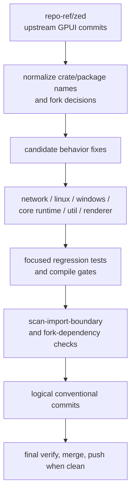

# Zed GPUI Upstream Sync - Plan

## Goal Capsule

| Field | Decision |
|---|---|
| Objective | Bring Open GPUI's extracted GPUI framework closure forward with the highest-value Zed GPUI fixes while preserving the Open GPUI package, license, and dependency boundary. |
| Authority | `docs/imports/zed-gpui-import.md`, `docs/imports/zed-fork-dependency-audit.md`, and ADR 0001 define the import boundary. `repo-ref/zed` is reference input, not a source tree to overwrite from. |
| Execution profile | Breaking changes are allowed when they simplify the framework API or delete obsolete compatibility code. Do not preserve dead fork shims, stale TODO stubs, or Zed-product assumptions when a cleaner Open GPUI boundary exists. |
| Priority order | Correctness fixes first: HTTP request bodies, Linux clipboard/IME/headless behavior, Windows platform correctness, core runtime leaks and scroll state, then renderer/dependency updates. |
| Stop conditions | Stop only for a blocker that contradicts the import boundary, needs product scope beyond GPUI framework behavior, requires a platform runtime that cannot be approximated locally, or would require deleting unrelated user work. |
| Tail ownership | `ce-work` owns implementation, focused verification, simplification, review, logical conventional commits, and final integration. |

---

## Product Contract

### Summary

Open GPUI is a source fork of Zed's GPUI framework closure, but it is now an independent workspace with renamed packages, Open GPUI-owned fork dependencies, and additional framework/product crates.
The next sync should not attempt a monorepo merge.
It should port targeted upstream GPUI fixes by semantic change, preserve Open GPUI's independent crate graph, and delete obsolete local compatibility surfaces when upstream fixes make them unnecessary.

### Problem Frame

The current workspace already absorbed many high-level GPUI updates and resolved major fork dependency debt, including public `reqwest`, Open GPUI-owned `font-kit`, Open GPUI-owned `scap`, and crates.io `wgpu`.
The remaining upstream gap is concentrated in bug-fix commits that are easy to miss with file-level diffing because Open GPUI renamed packages and deliberately excluded Zed editor crates.

The plan must therefore compare behavior, not just filenames.
Each migration unit should start from the upstream commit intent, map Zed crate names back to Open GPUI package names, keep local fork decisions intact, and add or adapt tests that prove the behavior inside this workspace.

### Requirements

**Import boundary**

- R1. Only port code from the Apache-2.0 GPUI framework closure that belongs in this workspace's imported crate set.
- R2. Do not import Zed editor, assistant, project, telemetry, GPL tracing, or product-specific crates as dependencies.
- R3. Preserve Open GPUI package names, workspace dependency aliases, `open-gpui-scap`, the Open GPUI-owned `font-kit` fork, and the crates.io `wgpu` migration unless a focused behavior test proves a replacement is necessary.

**Correctness ports**

- R4. HTTP request streaming must not truncate bodies when the producer returns `Poll::Pending`, and the reqwest client should include upstream keepalive and stale-connection handling that reduces failed reused connections.
- R5. Linux platform behavior must include upstream fixes for Wayland clipboard reads that can stall, IME candidate positioning during composition, headless window creation, and actionable errors for missing Linux feature combinations.
- R6. Windows platform behavior must include upstream fixes for caption-button hit testing on immovable windows and Credential Manager blob-size prechecks.
- R7. System wake notifications must be exposed as a coherent GPUI framework API, with Windows OS event plumbing and deterministic test-platform coverage.
- R8. Utility process and command behavior must include upstream Windows Job Object process-tree cleanup and macOS custom `PATH` resolution where those APIs exist in the extracted `util` crate.
- R9. GPUI runtime state must include upstream fixes for pending `ListState` scroll rebasing and scheduler dedicated-task leak cleanup.
- R10. Renderer/dependency updates such as `resvg`/`usvg` should be adopted only with the upstream regression tests or equivalent Open GPUI tests that prove the bug being fixed.

**Refactor posture**

- R11. Delete or replace local TODO stubs, unreachable branches, compatibility helpers, and duplicated adapter code when an upstream implementation provides the correct owner.
- R12. Keep public API breakage intentional: if a trait or crate API changes, update all local backends and examples in the same unit.
- R13. Record verification evidence in code, tests, or existing verification docs when a platform cannot be exercised on the current host.

**Delivery**

- R14. Make logical conventional commits after coherent slices pass their focused gates, staging only files changed by this work.
- R15. Run the final import-boundary scan and broad verification gate before merging or pushing to `main`.

### Scope Boundaries

- In scope: `collections`, `gpui`, `gpui_linux`, `gpui_macos`, `gpui_platform`, `gpui_web`, `gpui_wgpu`, `gpui_windows`, `http_client`, `reqwest_client`, `scheduler`, `sum_tree`, `util`, import-boundary tooling, tests, and verification docs directly affected by the sync.
- In scope: trait/API changes inside Open GPUI's framework crates when required by upstream behavior.
- In scope: deleting stale compatibility code that exists only because an upstream fix was missing locally.
- Out of scope: wholesale Zed monorepo merging, Zed editor UI/application crates, Zed product-specific assets, unrelated Open GPUI UI component productization, and a blanket dependency bump sweep.
- Deferred: upstream feature families that are not primarily bug fixes, such as broad renderer architecture rewrites, `gpui_tokio` adoption, or new Zed editor-facing abstractions.

### Acceptance Examples

- AE1. A streamed request body that temporarily returns `Poll::Pending` still uploads all chunks in order and reports the correct frame size.
- AE2. A Wayland clipboard pipe that never completes returns a timeout error instead of blocking the platform forever, while normally chunked clipboard data still reads successfully.
- AE3. An immovable Windows window still exposes hit targets for close, maximize, minimize, and system menu behavior without allowing frame drag hit tests.
- AE4. A `ListState` pending scroll survives a remeasure/rebase cycle without snapping back to an obsolete logical offset.
- AE5. Linux headless mode can create a platform window and drive the same headless scene path that tests expect instead of returning an unconditional unsupported error.
- AE6. Dropping a scheduler before a dedicated task is first polled does not leave the dedicated worker parked forever.
- AE7. The SVG renderer includes the upstream text split-glyph regression or an equivalent test before the `resvg`/`usvg` update is considered complete.
- AE8. A macOS command launched with a custom `PATH` resolves the program through that supplied path instead of silently falling back to the process environment.
- AE9. Oversized Windows Credential Manager failures report safe metadata such as byte length and limit, without logging or returning credential contents.
- AE10. `scan-import-boundary` rejects any attempt to reintroduce retired Zed fork dependencies or GPL tracing stack dependencies.

### Sources

- `docs/imports/zed-gpui-import.md`
- `docs/imports/zed-fork-dependency-audit.md`
- `docs/verification.md`
- `repo-ref/zed/crates/gpui`
- `repo-ref/zed/crates/gpui_linux`
- `repo-ref/zed/crates/gpui_windows`
- `repo-ref/zed/crates/reqwest_client`
- `repo-ref/zed/crates/scheduler`
- `repo-ref/zed/crates/util`

---

## Planning Contract

### Key Technical Decisions

- KTD1. Port by upstream commit intent, not by directory overwrite.
  Open GPUI has package renames, local fork decisions, and additional crates, so raw file copying would reintroduce old dependency and naming debt.
- KTD2. Treat tests as the migration boundary.
  Every behavior port should add or adapt the upstream regression test when possible; platform-only changes need at least compile coverage and documented runtime limits.
- KTD3. Batch by failure domain.
  Network, Linux, Windows, core runtime, process utilities, and renderer dependencies have different owners and verification gates, so they should land as separate reviewable slices.
- KTD4. Let upstream fixes replace local stubs.
  Windows process-tree cleanup, Linux headless windows, missing feature diagnostics, and other previously stubbed paths should become owned implementations or be deleted if the public surface no longer needs them.
- KTD5. Keep dependency updates behavior-gated.
  `resvg`, `usvg`, Windows API features, and platform crates should move only when the migrated code or tests require them.
- KTD6. Do not use `repo-ref/zed` as a dependency source.
  It is a comparison fixture. The workspace must keep `repo-ref/*` excluded and keep source-of-truth files under Open GPUI crates.
- KTD7. Prefer focused platform checks over broad cross-target claims.
  This run is hosted on Windows. Linux behavior needs WSL, CI, or a Linux host with the required system headers; macOS behavior needs a macOS runner or an explicit host-limited note. A Windows-host `cargo check --workspace` is not evidence that target-gated Linux, macOS, or Web backend code compiled.
- KTD8. Freeze the upstream candidate list before implementation.
  U1 must record the `repo-ref/zed` SHA, upstream commit SHAs, touched files, Open GPUI mappings, and accept/reject/defer decisions. U2-U8 consume that list instead of expanding scope opportunistically.

### High-Level Technical Design

### Sequencing

Start with network correctness because it is cross-platform, high impact, and low dependency on platform backends.
Then move through Linux platform fixes and Windows window/credential fixes.
System wake owns the shared platform trait/API as one unit, while utility process and command behavior owns Windows Job Object cleanup and Darwin command resolution.
Core runtime fixes follow once platform edits settle, then renderer dependency updates.
Finish with import-boundary scans, broad verification, and documentation updates.

### System-Wide Impact

- `Platform` trait additions for wake notifications require every backend and test platform to implement the new hook.
- Linux headless window support may change assumptions in visual tests that previously used an unsupported backend as a guard.
- Windows process management may add Windows API feature requirements in `Cargo.toml` and lockfile changes.
- Reqwest body streaming changes affect all HTTP callers and upload paths, including redirected requests that use the local client cache.
- Renderer dependency changes can alter SVG parsing and text behavior, so the migration must be paired with concrete renderer tests.
- Web backend trait changes require explicit `wasm32-unknown-unknown` compile coverage or an implementation note that the target is unavailable locally.
- Import-boundary tooling must continue to reject retired Zed dependencies after any manifest or lockfile churn.

### Risks and Mitigations

| Risk | Mitigation |
|---|---|
| Upstream code depends on Zed-only crates or package names. | Normalize imports to Open GPUI workspace dependencies and run `scan-import-boundary` after every manifest-changing unit. |
| Platform code appears to pass on Windows while target-gated Linux, macOS, or Web code did not compile. | Use WSL/Linux, macOS CI, and wasm target gates where available; otherwise document the exact unavailable target instead of implying coverage. |
| A broad dependency bump hides behavior changes. | Keep renderer/dependency work as its own unit and require a bug-specific regression test before accepting the bump. |
| Public API breakage leaks into examples or UI crates late. | Run workspace checks after trait-level changes and update examples in the same unit as the API change. |
| Concurrent user edits overlap with migrated files. | Inspect `git status` before each commit, stage only this work, and stop before any action that would discard unrelated changes. |

---

## Implementation Units

### U1. Baseline Diff and Candidate Lock-In

- **Goal:** Reconfirm the upstream candidate set against the current worktree and prevent broad, accidental Zed imports.
- **Requirements:** R1-R3, R14, R15.
- **Files:** `docs/imports/zed-gpui-import.md`, `docs/imports/zed-fork-dependency-audit.md`, `docs/imports/zed-gpui-upstream-sync-candidates.md`, `docs/verification.md`, `xtask/src/import_boundary.rs`, `Cargo.toml`, `Cargo.lock`.
- **Patterns:** Existing import-boundary scan and fork-dependency audit evidence.
- **Approach:** Re-run a normalized diff and commit-log pass over the imported GPUI closure, then write an immutable candidate list with the current `repo-ref/zed` SHA, upstream commit SHAs, touched files, Open GPUI mappings, accept/reject/defer decisions, and test-source notes. Newly discovered upstream commits are classified into that list; they do not enter U2-U8 unless they map to R4-R10 and the plan is explicitly updated.
- **Test Scenarios:** Import-boundary scan still passes before code migration; candidate list excludes Zed editor crates and already-retired fork dependencies; package-name normalization maps Zed crate names to Open GPUI workspace aliases; every accepted candidate has a target unit and every rejected/deferred candidate has a reason.
- **Verification:** `cargo run -p xtask -- scan-import-boundary`; `git diff --check`.

### U2. Reqwest Client Streaming and Connection Correctness

- **Goal:** Port upstream HTTP streaming fixes and client connection configuration without disturbing Open GPUI's public `reqwest` migration.
- **Requirements:** R3, R4, R14.
- **Files:** `crates/reqwest_client/src/reqwest_client.rs`, `crates/reqwest_client/Cargo.toml`, `Cargo.toml`, `Cargo.lock`.
- **Patterns:** Local redirect-policy client cache, upstream streamed-body regression tests, and existing `open-gpui-reqwest-client` package structure.
- **Approach:** Adapt the upstream `AsyncBody` polling behavior so pending reads preserve buffered data and later chunks. Add keepalive/stale connection configuration only through APIs available in the public `reqwest` line already chosen by Open GPUI.
- **Test Scenarios:** A pending-first stream uploads full content; interleaved pending/chunk reads do not truncate frame sizes; redirect-policy clients still reuse equivalent cached clients; default client construction includes the intended connection settings; non-replayable streamed bodies are not resent after partial consumption; sensitive bodies and auth-related headers are not forwarded to a different origin unless the configured redirect policy explicitly permits it.
- **Verification:** `cargo nextest run -p open-gpui-reqwest-client`; `cargo check -p open-gpui-reqwest-client`; `cargo run -p xtask -- scan-import-boundary` if manifests or lockfile change.

### U3. Linux Clipboard, IME, Headless Window, and Feature Diagnostics

- **Goal:** Port Linux platform fixes for blocking clipboard reads, Wayland IME candidate placement, headless window creation, and clearer missing-feature errors.
- **Requirements:** R5, R11, R13, R14.
- **Files:** `crates/gpui_linux/src/linux/platform.rs`, `crates/gpui_linux/src/linux/wayland/client.rs`, `crates/gpui_linux/src/linux/wayland/clipboard.rs`, `crates/gpui_linux/src/linux/headless.rs`, `crates/gpui_linux/src/linux/headless/client.rs`, `crates/gpui_linux/src/linux/headless/window.rs`, `crates/gpui_linux/src/linux.rs`, `crates/gpui_linux/Cargo.toml`, `docs/verification.md`.
- **Patterns:** Upstream Linux headless `PlatformWindow` implementation, existing Wayland clipboard pipe helpers, and local feature-gated backend selection.
- **Approach:** Replace blocking pipe reads with a timeout-aware read path that still accepts slow valid data, move candidate-window positioning to the upstream composing-aware path, add a real headless window backend, and replace unreachable feature branches with actionable errors.
- **Test Scenarios:** A stalled clipboard read times out; chunked clipboard data succeeds; IME candidate position updates while composing; headless `open_window` returns a usable platform window; missing Linux backend features produce a named error under no-default, Wayland-only, X11-only, default, and all-feature combinations.
- **Verification:** On Linux, WSL, or CI with the required Wayland, X11, fontconfig, freetype, and pkg-config headers, run the `open-gpui-linux` feature matrix: `--no-default-features`, `--features wayland`, `--features x11`, default features, and `--all-features --locked`. If this host cannot run that matrix, record the exact unavailable target/runtime gate in `docs/verification.md`.

### U4. Windows Window and Credential Correctness

- **Goal:** Port upstream Windows fixes for non-movable window caption hit testing and Credential Manager blob-size prechecks.
- **Requirements:** R6, R11, R13, R14.
- **Files:** `crates/gpui_windows/src/events.rs`, `crates/gpui_windows/src/platform.rs`, `crates/gpui_windows/Cargo.toml`, `Cargo.toml`, `Cargo.lock`.
- **Patterns:** Upstream Windows message handling and existing Windows credential storage helpers.
- **Approach:** Split immovable-window drag suppression from caption-button hit testing, and preflight credential blobs before calling Windows Credential Manager. Keep system wake plumbing in U5 and process-tree cleanup in U7.
- **Test Scenarios:** Immoveable windows still hit titlebar buttons; oversized credentials fail before unsafe platform calls; credential-size failures report only safe metadata such as byte length and limit and never include passwords, tokens, credential blob contents, or raw secret bytes in errors or logs.
- **Verification:** `cargo check -p open-gpui-windows --all-features --locked`; `cargo run -p xtask -- scan-import-boundary` if manifests or lockfile change.

### U5. Cross-Platform Wake Callback Integration

- **Goal:** Make the system wake callback a coherent GPUI framework API across all platform backends.
- **Requirements:** R7, R12-R14.
- **Files:** `crates/gpui/src/app.rs`, `crates/gpui/src/platform.rs`, `crates/gpui/src/platform/test/platform.rs`, `crates/gpui/src/platform/visual_test.rs`, `crates/gpui/Cargo.toml`, `crates/gpui_linux/src/linux/platform.rs`, `crates/gpui_linux/src/linux/headless/client.rs`, `crates/gpui_linux/src/linux/wayland/client.rs`, `crates/gpui_linux/src/linux/x11/client.rs`, `crates/gpui_macos/src/platform.rs`, `crates/gpui_web/src/platform.rs`, `crates/gpui_windows/src/platform.rs`, `crates/gpui_windows/Cargo.toml`, `Cargo.toml`, `Cargo.lock`, `docs/verification.md`.
- **Patterns:** Existing `Platform` lifecycle callback methods and test platform callback storage.
- **Approach:** Add the shared callback method once, implement no-op or platform-specific behavior in every backend, and test through the deterministic test platform before relying on OS-specific events. Windows owns the OS wake event registration in this unit because the shared callback is the public GPUI API being exercised.
- **Test Scenarios:** Multiple wake callbacks can be registered and cleared with application lifetime; the test platform can trigger wake notifications; Windows power events route into the shared callback; platform backends compile after implementing the trait method.
- **Verification:** `cargo nextest run -p open-gpui on_system_wake`; `cargo check -p open-gpui-windows --all-features --locked`; Linux, macOS, and Web backend compile gates are run on their target platforms or recorded as unavailable in `docs/verification.md`; `cargo run -p xtask -- scan-import-boundary` if manifests or lockfile change.

### U6. Core Runtime Scroll and Scheduler Fixes

- **Goal:** Port upstream fixes for `ListState` pending-scroll rebasing and dedicated scheduler task leaks.
- **Requirements:** R9, R11, R14.
- **Files:** `crates/gpui/src/elements/list.rs`, `crates/scheduler/src/test_scheduler.rs`.
- **Patterns:** Existing list measurement tests, upstream `rebase_pending_scroll` behavior, and scheduler test harness leak checks.
- **Approach:** Make pending scroll state resilient to item height and viewport remeasurement, then update scheduler dedicated-task lifecycle so an unpolled dedicated task does not hold scheduler resources indefinitely.
- **Test Scenarios:** Pending scroll rebases after rows before the anchor change height; shrinking content clamps scroll without restoring stale offsets; dropped schedulers clean up dedicated tasks before first poll; existing scheduler concurrency tests still pass.
- **Verification:** `cargo nextest run -p open-gpui list`; `cargo nextest run -p open-gpui-scheduler`.

### U7. Utility Process and macOS Command Behavior

- **Goal:** Port upstream utility fixes that belong to the extracted framework closure without forcing untestable platform promises.
- **Requirements:** R8, R11, R13, R14.
- **Files:** `crates/util/src/process.rs`, `crates/util/src/command/darwin.rs`, `crates/util/Cargo.toml`, `Cargo.toml`, `Cargo.lock`, `docs/verification.md`.
- **Patterns:** Existing local process wrapper, upstream Windows Job Object process management, and upstream Darwin `PATH` resolution around `posix_spawnp`.
- **Approach:** Keep Windows process-tree behavior in `util` because the public process API owns child-process lifetime, and port the Darwin command-path resolution logic as a separate platform-specific utility fix. Do not duplicate process-tree work in U4.
- **Test Scenarios:** Windows process wrapper cleans up child trees when the owner exits; the job handle is not inheritable or leaked; grandchildren remain inside the owned job; cleanup targets only spawned descendants and does not affect unrelated processes; Darwin command resolution uses the intended custom `PATH` behavior by construction; non-Darwin command behavior is unchanged.
- **Verification:** `cargo nextest run -p open-gpui-util`; `cargo check -p open-gpui-util`; `cargo run -p xtask -- scan-import-boundary` if manifests or lockfile change; macOS runtime verification is documented as unavailable on this host unless a macOS runner is used.

### U8. SVG Renderer and Dependency Regression Gate

- **Goal:** Adopt renderer dependency updates only where they close a known upstream GPUI regression and keep Open GPUI's fork-dependency decisions intact.
- **Requirements:** R3, R10, R13-R15.
- **Files:** `Cargo.toml`, `Cargo.lock`, `crates/gpui/Cargo.toml`, `crates/gpui/src/svg_renderer.rs`, `crates/gpui_wgpu/Cargo.toml`, `crates/gpui_wgpu/src/wgpu_renderer.rs`.
- **Patterns:** Existing renderer smoke gate and upstream SVG text split-glyph regression test.
- **Approach:** The current workspace uses `resvg`/`usvg` 0.45.0 and `repo-ref/zed` uses 0.46.0. Upgrade to 0.46.0 only if the split-glyph regression or required upstream code needs it, and limit lockfile churn to necessary dependencies. If the regression can be fixed on 0.45.0, keep 0.45.0 and record the rationale.
- **Test Scenarios:** Mixed-font SVG text with split glyph clusters does not panic; existing SVG renderer tests still pass; native renderer smoke still creates core pipelines; import-boundary scan still rejects retired forks; dependency advisory/license scan or an equivalent review is recorded for any renderer dependency change.
- **Verification:** `cargo nextest run -p open-gpui svg_renderer`; `cargo run -p xtask -- renderer-smoke`; `cargo run -p xtask -- scan-import-boundary`; run `cargo audit`, `cargo deny`, or a documented equivalent advisory/license review when dependency versions change.

### U9. Final Boundary Cleanup and Integration

- **Goal:** Finish the upstream sync with a clean Open GPUI boundary, coherent docs, and broad verification evidence.
- **Requirements:** R1-R15.
- **Files:** `docs/imports/zed-gpui-import.md`, `docs/imports/zed-fork-dependency-audit.md`, `docs/verification.md`, `xtask/src/import_boundary.rs`, all files touched by U2-U8.
- **Patterns:** Existing verification documentation and import-boundary scan diagnostics.
- **Approach:** Remove any temporary compatibility helpers, stale comments, or Zed naming residue introduced during migration. Update verification docs only with durable gates and platform limitations, then run the final gate before merging or pushing.
- **Test Scenarios:** No retired Zed fork dependencies appear in manifests or lockfile; no Zed GPL tracing stack appears in dependencies; all touched crates pass focused tests; broad workspace verification passes or has an explicitly unrelated environment-only failure.
- **Verification:** `cargo fmt --all -- --check`; `cargo run -p xtask -- verify`; `git diff --check`.

---

## Verification Contract

Unit-level `Verification` entries remain required even when this table lists a broader aggregate gate.
Any unit that changes `Cargo.toml` or `Cargo.lock` must run `cargo run -p xtask -- scan-import-boundary` before its commit.
Platform-gated checks must name the target host or target triple; a Windows-host check is not evidence for Linux, macOS, or Web target-gated backend code.

| Gate | Units | Evidence |
|---|---|---|
| `cargo run -p xtask -- scan-import-boundary` | U1, U2, U4, U5, U7, U8, U9 when manifests or lockfile change | Open GPUI does not reintroduce retired Zed forks, GPL tracing stack dependencies, or Zed monorepo Cargo sources. |
| `cargo nextest run -p open-gpui-reqwest-client` | U2 | Streamed body and client-cache behavior remain correct. |
| Linux/WSL/CI `open-gpui-linux` feature matrix | U3 | No-default, Wayland-only, X11-only, default, and all-feature Linux backend combinations compile and missing-feature diagnostics are exercised. |
| `cargo check -p open-gpui-windows --all-features --locked` | U4 | Windows platform changes compile with the locked dependency graph. |
| `cargo nextest run -p open-gpui on_system_wake` | U5 | Shared wake callback registration and test-platform triggering pass. |
| `cargo check -p open-gpui-web --target wasm32-unknown-unknown` | U5 | Web backend trait implementation compiles after platform API changes, or the unavailable target is recorded. |
| `cargo check -p open-gpui-macos --features font-kit --locked` | U5, U7 | macOS backend and Darwin utility changes compile on a macOS runner, or the unavailable target is recorded. |
| `cargo nextest run -p open-gpui` | U5, U6, U8 | Core GPUI tests, including platform/test-platform and list behavior, pass. |
| `cargo nextest run -p open-gpui-scheduler` | U6 | Dedicated scheduler lifecycle fixes are covered. |
| `cargo nextest run -p open-gpui-util` | U7 | Process and command utility changes preserve local behavior. |
| `cargo run -p xtask -- renderer-smoke` | U8 | Native WGPU renderer can still create core pipelines on the local host. |
| `cargo audit`, `cargo deny`, or documented equivalent | U8, U9 when dependency versions change | Dependency advisory and license posture are reviewed alongside renderer dependency churn. |
| `cargo run -p xtask -- verify` | U9 | Workspace formatting, checks, UI gates, theme scans, import-boundary scan, and component contract scan pass together. |
| `git diff --check` | U1-U9 | No whitespace or patch-format drift remains. |

---

## Definition of Done

- All accepted upstream candidates are either ported, explicitly rejected with repo-grounded rationale, or moved to a documented deferred follow-up.
- Focused regression tests exist for behavior changes that can be tested on the host.
- Platform-only changes at least compile locally, and unavailable runtime checks are documented rather than implied.
- No retired Zed dependency, GPL tracing stack dependency, or Zed monorepo Cargo source appears in `Cargo.toml`, `Cargo.lock`, or crate manifests.
- Stale TODO stubs and compatibility helpers touched by this work are removed when superseded by real implementations.
- Logical conventional commits exist for the implemented slices, with only this work staged.
- Final broad verification passes, or any failure is recorded with exact unrelated/environmental evidence and all focused gates for this plan pass.
