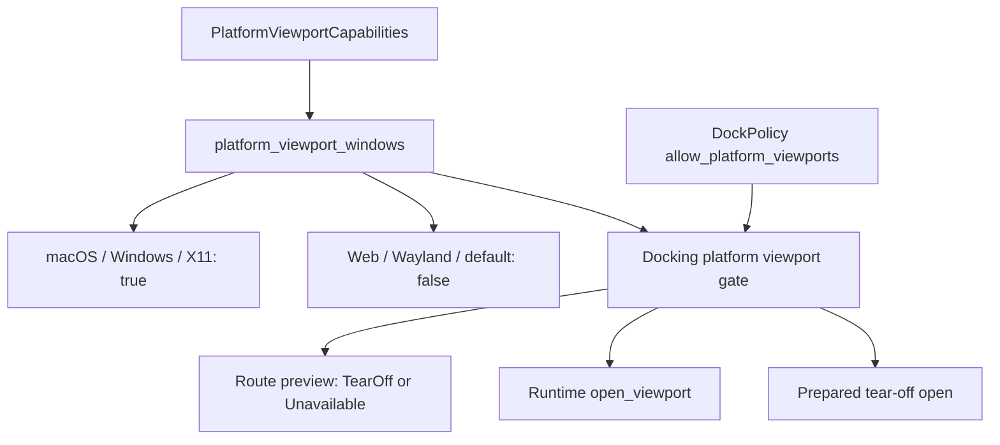
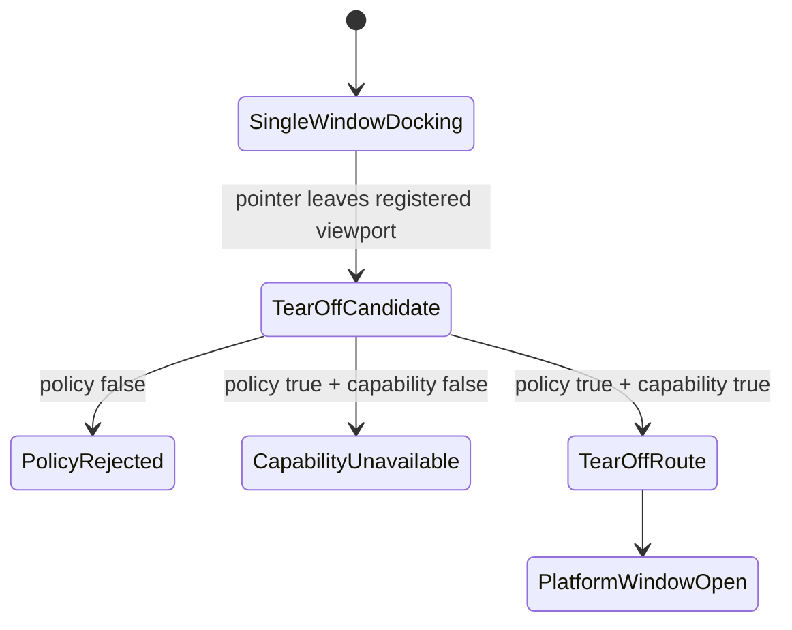

# Web Docking Viewport Capability Gates - Plan

## Goal Capsule

| Field | Decision |
|---|---|
| Objective | Make the stable web backend CI-checkable and make docking multi-viewport support fail closed on platforms that cannot provide independent platform viewport windows. |
| Authority | Current `main`, prior wasm dependency-upgrade verification, `PlatformViewportCapabilities`, `DockPolicy::allow_platform_viewports`, and docking runtime route/status tests. |
| Execution profile | Fearless refactor. Breaking internal APIs, typed diagnostic additions, test rewrites, and deletion of misleading paths are allowed when they remove unsupported web or docking behavior. |
| Product boundary | Preserve single-window docking on web. Gate only platform-window tear-off and explicit secondary viewport windows. Do not introduce browser popout support in this plan. |
| Stop conditions | Stop and re-plan if the implementation requires a real browser popout/window manager, reintroducing nightly-only wasm as the stable CI gate, or disabling docking entirely on wasm. |
| Tail ownership | The goal execution owns implementation, focused verification, review, logical commits, merge back to local `main`, and remote push when verification stays green. |

---

## Product Contract

### Summary

Open GPUI now has stable wasm checks for the core web backend packages, but CI does not enforce them yet.
Docking also has an app-level policy gate for platform viewports, but it does not distinguish "the application allows tear-off" from "the current backend can actually create independent platform viewport windows".

This plan adds a backend capability bit, teaches docking preview/runtime paths to fail closed when that bit is false, keeps web single-window docking usable, and promotes stable wasm checks into CI.

### Problem Frame

The current platform capability contract describes facts like global window bounds, window stack, DPI scale, live window movement, and no-input windows.
Those facts are useful for routing between already-open platform windows, but none of them explicitly says that opening an independent platform viewport window is supported.

That gap matters most on web.
`open-gpui-web` can mount canvases into the document, but it does not provide browser popout windows or native application windows.
If docking only checks `DockPolicy::allow_platform_viewports`, a web app can accidentally enable tear-off previews or runtime opens that look supported while the backend cannot provide the intended platform behavior.

The fix should be explicit rather than conditional compilation.
Docking is a general crate and should keep its single-window behavior available on wasm.
Only platform-window features need a capability gate.

### Requirements

- R1. `PlatformViewportCapabilities` must expose an explicit `platform_viewport_windows` capability for independent application viewport windows suitable for docking tear-off and secondary viewport hosts.
- R2. The capability must default to `false` so new or minimal backends fail closed until they opt in.
- R3. macOS, Windows, and X11 should opt in because their backends already expose native application windows for GPUI; Wayland and Web should remain false.
- R4. Test platform defaults should preserve existing multi-window docking tests, while tests can explicitly set unsupported capabilities to exercise fail-closed paths.
- R5. Docking route preview must not advertise a tear-off route when app policy allows platform viewports but the backend capability is false.
- R6. Docking runtime `open_viewport` and tear-off open paths must reject before creating a platform window when the backend capability is false.
- R7. Single-window docking, in-window splitting, center merges, floating-in-window interactions, and web wasm checks must remain available.
- R8. Diagnostics must make the distinction visible: app policy disabled is a policy rejection; backend unsupported is a platform capability limitation.
- R9. GitHub Actions must install `wasm32-unknown-unknown` and run stable `cargo check --locked` gates for `open-gpui-web`, `open-gpui-platform`, and `open-gpui-wgpu`.
- R10. Documentation and engineering memory must describe the platform policy/capability split and the stable wasm CI contract.

### Acceptance Examples

- AE1. Given a web backend with default viewport capabilities and a workspace policy that allows platform viewports, when a drag release leaves registered viewports, then docking does not produce a tear-off route.
- AE2. Given a backend with `platform_viewport_windows = false`, when code calls `DockViewportRuntimeHandle::open_viewport`, then it returns an error before `cx.open_window`.
- AE3. Given a backend with `platform_viewport_windows = false`, when a prepared tear-off is opened, then the transaction is cancelled/failed without registering a platform viewport window.
- AE4. Given a native-capable backend and policy enabled, when the same route/runtime paths run, then existing tear-off and secondary viewport tests continue to pass.
- AE5. Given CI on Linux, when `verify.yml` runs, then stable wasm checks cover `open-gpui-web`, `open-gpui-platform`, and `open-gpui-wgpu` with `--locked`.

### Scope Boundaries

#### In Scope

- `PlatformViewportCapabilities` schema and backend opt-ins.
- Docking platform signal/request propagation for platform-window support.
- Docking route/runtime fail-closed behavior and tests.
- Stable wasm CI gates in `.github/workflows/verify.yml`.
- Verification docs and engineering-state updates.

#### Deferred to Follow-Up Work

- Browser popout windows or multi-tab web viewport support.
- A `web-popout-viewports` experimental feature.
- Playwright/browser smoke for web rendering.
- Nightly atomics/threading CI for `hello_web` multithreaded examples.
- Any redesign of docking visuals or component gallery pages.

#### Outside This Product's Identity

- Treating web canvas instances as native platform viewport windows.
- Gating all docking code out of wasm.
- Using app policy as a substitute for backend capability facts.

---

## Planning Contract

### Key Technical Decisions

- KTD1. Add `PlatformViewportCapabilities::platform_viewport_windows` instead of using a cargo feature gate on `open-gpui-docking`; capability facts are runtime platform facts, while cargo features are build topology.
- KTD2. Keep `DockPolicy::allow_platform_viewports` as the product/app opt-in. A platform viewport opens only when both policy and capability allow it.
- KTD3. Represent backend unsupported as route unavailable, not policy rejected. Policy disabled remains `DockPolicyError::PlatformViewportsDisabled`; capability false is a platform limitation diagnostic.
- KTD4. Gate all window-creating docking runtime paths before `cx.open_window`, including explicit `open_viewport` and prepared tear-off completion.
- KTD5. Preserve test platform's existing multi-window behavior by opting its default capability in; unsupported tests must override the capability explicitly.
- KTD6. Put stable wasm checks in the existing `Verify` workflow under the Linux matrix. This gives one stable CI owner without multiplying Windows/macOS work.
- KTD7. Keep `hello_web` multithreaded/nightly atomics as documented optional verification, not a stable CI gate.

### High-Level Technical Design

### Assumptions

- User has authorized breaking changes, deletion of unsupported paths, subagents, logical commits, local-main merge, and remote-main push when verification is clean.
- The branch `refactor/web-docking-capability-gates` starts from local `main`, which already contains the stable wasm backend fixes and dependency upgrade verification.
- Web does not yet provide real independent browser popout windows for GPUI viewport hosts.
- Wayland stays conservative until backend-specific evidence proves independent docking viewport windows are reliable enough for this contract.
- Stable wasm CI should avoid nightly atomics/multithreaded example requirements.

### Risks & Mitigations

| Risk | Mitigation |
|---|---|
| Existing docking tests assume every TestPlatform can open platform viewport windows. | Opt in TestPlatform default and add explicit unsupported test capability overrides. |
| Route preview and runtime open disagree. | Use the same capability fact from platform signals/runtime app context and test both paths. |
| Unsupported backend is reported as an app-policy rejection. | Add a separate unavailable/diagnostic reason and preserve existing `DockPolicyError::PlatformViewportsDisabled` behavior. |
| CI wasm checks pull native-only dependencies. | Check only the stable wasm-capable packages that were already verified locally. |
| Web users interpret the gate as docking unavailable. | Docs state that single-window docking remains available and only platform tear-off/multi-viewport is gated. |

---

## Implementation Units

### U1. Platform Viewport Window Capability Contract

- **Goal:** Add an explicit platform-window capability bit and expose it through runtime diagnostics.
- **Requirements:** R1, R2, R3, R4, R8.
- **Dependencies:** None.
- **Files:** `crates/gpui/src/platform.rs`, `crates/gpui/src/platform/test/platform.rs`, `crates/gpui/src/platform/visual_test.rs`, `crates/gpui_macos/src/platform.rs`, `crates/gpui_windows/src/platform.rs`, `crates/gpui_linux/src/linux/x11/client.rs`, `crates/gpui_linux/src/linux/wayland/client.rs`, `crates/gpui_web/src/platform.rs`, `crates/gpui_docking/src/viewport_runtime_status.rs`, `examples/docking-native/src/main.rs`.
- **Approach:** Extend `PlatformViewportCapabilities` with `platform_viewport_windows`, default it to `false`, and set it to `true` only for backends that support independent GPUI application windows for docking viewport hosts. Keep Web and Wayland closed. Mirror the new field into `DockViewportPlatformCapabilityRecord` and the native runtime status text.
- **Execution note:** Start by updating the status/capability tests so the missing field fails before implementation.
- **Patterns to follow:** Existing capability fields in `crates/gpui/src/platform.rs`; native status formatting in `examples/docking-native/src/main.rs`; capability snapshot tests in `crates/gpui_docking/src/viewport_runtime_status.rs`.
- **Test scenarios:**
  - Covers R3/R4. A native/test backend capability snapshot reports `platform_viewport_windows = true` while existing route facts remain unchanged.
  - Covers R2/R4. A default/minimal capability snapshot reports `platform_viewport_windows = false`.
  - Status formatting includes the platform-window capability so app-policy and backend support can be diagnosed separately.
  - Web remains default-closed without adding web-specific conditional compilation to docking.
- **Verification:** Capability/status tests pass and no backend capability literal silently omits the new field.

### U2. Docking Route And Runtime Fail-Closed Gate

- **Goal:** Require both app policy and backend capability before docking advertises or opens platform viewport windows.
- **Requirements:** R5, R6, R7, R8.
- **Dependencies:** U1.
- **Files:** `crates/gpui_docking/src/viewport_platform_signals.rs`, `crates/gpui_docking/src/viewport_drop_route.rs`, `crates/gpui_docking/src/viewport_runtime_handle.rs`, `crates/gpui_docking/src/viewport_runtime.rs`, `crates/gpui_docking/src/viewport_tear_off_move.rs`, `crates/gpui_docking/src/viewport_runtime_status.rs`, `crates/gpui_docking/src/drop_preview.rs`, `crates/gpui_docking/src/drop_target.rs`, `crates/gpui_docking/src/host_viewport_route_tests.rs`, `crates/gpui_docking/src/host_viewport_lifecycle_tests.rs`, `crates/gpui_docking/src/host_viewport_platform_capability_tests.rs`.
- **Approach:** Carry `platform_viewport_windows` through platform-signal snapshots and route resolution. Keep `DockPolicyError::PlatformViewportsDisabled` for app-policy rejection, add a platform-capability unavailable path for backend false, and gate `open_viewport` plus prepared tear-off completion before `cx.open_window`. Cancelling a prepared tear-off on unsupported platforms must leave the graph and runtime registry unchanged.
- **Execution note:** Characterize route rejection first, then implement runtime open preflight so no test relies on failed `cx.open_window` as the gate.
- **Patterns to follow:** `DockViewportDropRouteUnavailableReason` for unavailable route facts, `preflight_tear_off_move` for graph-safe preflight, platform sync unsupported records in `crates/gpui_docking/src/viewport_platform_sync.rs`, and existing `PlatformViewportsDisabled` tests for policy-disabled behavior.
- **Test scenarios:**
  - Covers AE1. With policy enabled and `platform_viewport_windows = false`, an outside registered viewport release resolves to unavailable or capability-limited status, not `TearOff`.
  - Policy disabled still returns `DockPolicyError::PlatformViewportsDisabled` even if the backend supports platform windows.
  - Covers AE2. `DockViewportRuntimeHandle::open_viewport` returns an error before registering a window when backend capability is false.
  - Covers AE3. Prepared tear-off open is cancelled or rejected before `cx.open_window`, and the source graph, target space, and runtime registry remain unchanged.
  - Covers AE4. With policy enabled and backend capability true, existing native/test route, tear-off, reuse, close, and lifecycle tests continue to pass.
  - Covers R7. In-window center merge, edge split, floating, and splitter behaviors do not depend on `platform_viewport_windows`.
- **Verification:** Focused docking route, lifecycle, and platform capability nextest gates pass.

### U3. Stable Wasm CI Gates

- **Goal:** Move the already-proven stable wasm compile checks into GitHub Actions.
- **Requirements:** R9.
- **Dependencies:** None.
- **Files:** `.github/workflows/verify.yml`.
- **Approach:** Add a Linux-only CI step or job that installs `wasm32-unknown-unknown` and checks `open-gpui-web`, `open-gpui-platform`, and `open-gpui-wgpu` with stable Rust and `--locked`. Keep nightly atomics and `hello_web` multithreaded example checks documented but outside the default CI gate.
- **Execution note:** This is packaging/config proof; prefer local compile smoke verification over unit tests.
- **Patterns to follow:** Existing `Verify` workflow matrix, current dependency-upgrade verification in `docs/knowledge/engineering/verification/dependency-upgrade-verification-20260705.md`.
- **Test scenarios:**
  - Covers AE5. Linux CI installs the wasm target before running any wasm checks.
  - The stable wasm gate does not enable `open-gpui-web/multithreaded`.
  - Windows and macOS native checks remain scoped to their existing platform-surface jobs.
- **Verification:** Local stable wasm checks pass; workflow syntax remains valid by inspection and `git diff --check`.

### U4. Verification, Documentation, Review, And Landing

- **Goal:** Record the policy/capability split, verify the whole slice, commit logically, merge back to local `main`, and push when clean.
- **Requirements:** R10.
- **Dependencies:** U1, U2, U3.
- **Files:** `docs/verification.md`, `docs/knowledge/engineering/current-state.md`, `docs/knowledge/engineering/verification/web-docking-viewport-capability-gates-20260705.md`, `docs/plans/2026-07-05-002-refactor-web-docking-viewport-capability-gates-plan.md`.
- **Approach:** Update public verification and engineering memory with the web behavior contract: single-window docking remains available, platform tear-off requires both policy and backend support, and stable wasm CI covers compile-time package health. Run focused cargo gates, diff checks, and code review before landing.
- **Execution note:** Treat documentation drift as a correctness issue because future agents use these files for planning and verification.
- **Patterns to follow:** Existing verification notes under `docs/knowledge/engineering/verification`, ADR 0012's runtime capability boundary, and the dependency-upgrade wasm verification note.
- **Test scenarios:** Test expectation: none for docs-only changes beyond validating rendered markdown structure and engineering wiki consistency.
- **Verification:** Required local gates pass; review findings are fixed or explicitly residual; commits are conventional and scoped; local `main` receives the branch and pushes cleanly.

---

## Verification Contract

| Gate | Applies to | Done Signal |
|---|---|---|
| `cargo fmt --all --check` | U1-U4 | Formatting is stable across Rust and docs-adjacent generated changes. |
| `cargo check -p open-gpui-docking --tests --locked` | U1-U2 | Docking crate and tests compile after capability API changes. |
| `cargo nextest run -p open-gpui-docking host_viewport_route --no-fail-fast` | U2 | Route policy and platform-capability behavior remains coherent. |
| `cargo nextest run -p open-gpui-docking host_viewport_platform_capability --no-fail-fast` | U1-U2 | Capability and platform sync diagnostics pass. |
| `cargo nextest run -p open-gpui-docking host_viewport_lifecycle --no-fail-fast` | U2 | Open/reuse/tear-off lifecycle behavior stays intact. |
| `cargo check -p open-gpui-web --target wasm32-unknown-unknown --locked -j 1` | U3 | Stable web crate wasm compile gate passes. |
| `cargo check -p open-gpui-platform --target wasm32-unknown-unknown --locked -j 1` | U3 | Stable platform facade wasm compile gate passes. |
| `cargo check -p open-gpui-wgpu --target wasm32-unknown-unknown --locked -j 1` | U3 | Stable WGPU wasm compile gate passes. |
| `git diff --check` | U1-U4 | No whitespace or patch-format issues remain. |

### Optional/Deferred Gates

- `cd crates/gpui_web/examples/hello_web && cargo check --target wasm32-unknown-unknown -j 1` on nightly-capable toolchains.
- Browser smoke for `hello_web` after a separate web runtime/playwright plan.

---

## Definition of Done

- Platform capability contract exists, defaults closed, and has explicit native/test opt-ins.
- Web and Wayland do not advertise independent platform viewport windows.
- Docking route preview and runtime open paths fail before platform window creation when unsupported.
- Existing native/test supported docking viewport behavior remains green.
- Stable wasm package checks run locally and are encoded in CI.
- Docs explain policy versus capability and web behavior.
- Code review is complete, abandoned attempts are removed, and the diff contains only the planned slice.
- Work is committed in logical units, merged back to local `main`, and pushed to remote `main` if final verification is clean.
