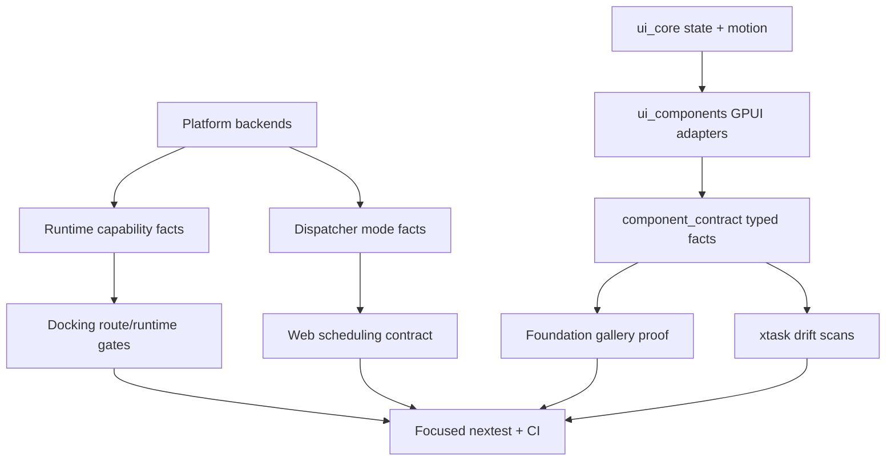
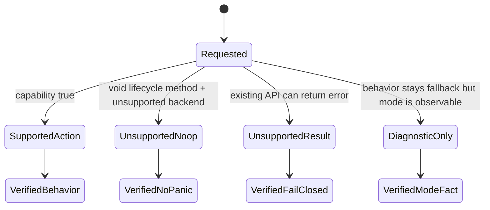
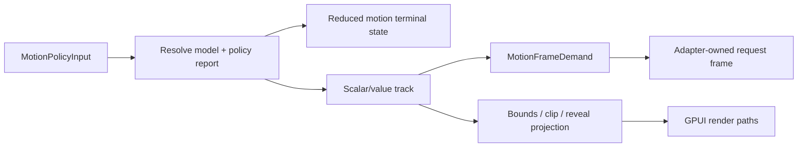

# Runtime UI Hardening - Plan

## Goal Capsule

| Field | Decision |
|---|---|
| Objective | Finish the next hardening layer for Open GPUI's platform runtime, web dispatcher, docking capability boundaries, motion runtime, and UI component contract surface. |
| Authority | Current `main`, `docs/plans/2026-07-05-001-refactor-ui-framework-layer-motion-conformance-plan.md`, `docs/plans/2026-07-05-002-refactor-web-docking-viewport-capability-gates-plan.md`, `docs/verification.md`, `docs/knowledge/engineering/current-state.md`, and local reference repos under `repo-ref/`. |
| Execution profile | Fearless refactor. Breaking internal APIs, deleting unsupported paths, tightening public exports, and replacing misleading behavior with explicit unsupported/no-op contracts are allowed when tests and docs are updated. |
| Product boundary | Preserve the existing native UI framework direction: `ui_core` owns renderer-neutral state/motion, `ui_components` owns GPUI adapters and styled components, gallery tests prove the contract, and platform backends publish capability facts. |
| Stop conditions | Stop and re-plan only if the work requires browser popout windows, a full Framer Motion DOM/WAAPI clone, a generated component registry revival, or changing the public `Platform` trait to return `Result` for existing lifecycle methods. |
| Tail ownership | The goal execution owns implementation, focused verification, simplification/review, logical commits, merge back to local `main`, push after required local pre-push gates are clean or platform delegation is documented, and post-push GitHub Actions confirmation on `main`. |

---

## Product Contract

### Summary

This plan turns the current UI/runtime architecture into a stricter contract: unsupported platform behavior must not panic, web scheduling must publish honest mode facts, docking must keep web single-window behavior while failing closed for platform-window features, motion must stay renderer-neutral, and the component library must keep one typed contract source for exports, docs, and gallery evidence.

### Problem Frame

The project has already completed several important foundation slices: `PlatformViewportCapabilities::platform_viewport_windows` gates docking tear-off, web wasm packages have stable compile gates, overlay and choice runtime contracts have moved into deeper owners, and the motion runtime now has deterministic controller, policy, projection, and value primitives.

The remaining risk is not lack of ambition; it is contract drift. Windows still has lifecycle methods that call `unimplemented!()`. The web dispatcher has TODOs around main-thread mailbox semantics, worker blocking, realtime tasks, and priority scheduling. Component rows, public API inventory, source mapping, docs, and gallery probes are strong but still spread across several files. Motion is now capable enough for GPUI's current needs, but the public contract must make that boundary explicit so future work does not import DOM-specific projection or CSS parser concepts.

Reference repos support the same direction. `repo-ref/fret` is useful for layering and proof-surface separation, not for copying app demos. `repo-ref/motion` is useful for frame-phase and MotionValue semantics, not for DOM projection. `repo-ref/iced` supports explicit platform action/capability contracts. `repo-ref/egui_tiles` supports stable docking layout/tree normalization concepts. `repo-ref/gpui-components` is not present locally, so it is not an authority for this plan.

### Requirements

- R1. Normal platform lifecycle methods must never panic on supported crate builds. Unsupported operations should become no-op, diagnostic, or explicit unsupported results depending on the existing trait shape.
- R2. Windows `hide_other_apps` and `unhide_other_apps` must stop using `unimplemented!()` and must be covered by a focused regression check or a compile-time fallback proof.
- R3. Web dispatcher runtime mode must be observable enough to distinguish stable single-threaded fallback from multithreaded shared-memory mode.
- R4. Web dispatcher TODOs around main-thread mailbox, realtime work, worker blocking, and priority scheduling must either be resolved in code or converted into named contract limitations with tests/docs.
- R5. Web docking remains single-window capable; platform-window docking, tear-off, and independent viewport windows continue to require both app policy and backend capability.
- R6. Motion remains a renderer-neutral GPUI runtime: deterministic scalar tracks, policy resolution, frame demand, projection bounds/clip/reveal, reduced-motion completion, and adapter-owned scheduling.
- R7. The motion public surface must not imply DOM `VisualElement`, WAAPI acceleration, CSS value parsing, transform-tree scale correction, or browser layout projection support.
- R8. UI component product facts must continue to flow from typed `component_contract` rows/projections into public exports, docs, gallery selectors, and proof tests without restoring a generated registry.
- R9. Adding or changing a component must have a clear failure mode when rows, public export intent, source mapping, docs tokens, gallery evidence, or sample selectors drift.
- R10. Verification must cover Linux/macOS/Windows native checks where CI owns them, stable wasm package checks, focused UI/motion/docking nextest gates, and docs/engineering memory updates.

### Acceptance Examples

- AE1. Given a Windows build, when an app calls `hide_other_apps` or `unhide_other_apps`, then the operation does not panic even if Windows has no equivalent app-level hide-other-apps behavior.
- AE2. Given a web build without multithreaded support, when a background dispatch is requested, then the dispatcher reports or exposes single-threaded fallback instead of implying worker execution.
- AE3. Given a web dispatcher with multithreaded support disabled or unavailable, when realtime work is posted from the main thread, then the scheduling path is deterministic and documented as main-thread execution.
- AE4. Given docking policy enabled but backend platform viewport windows unsupported, when web or Wayland docking computes an outside-window route, then single-window interactions remain available and platform-window routes fail closed before creating a GPUI window.
- AE5. Given a motion policy that resolves to reduced motion, when Splitter or docking transition execution samples it, then the terminal visual state is published immediately and no spatial smoothing is required.
- AE6. Given a component API change, when the public-surface and gallery contract tests run, then missing export/docs/source/evidence updates fail with actionable component names.

### Scope Boundaries

#### In Scope

- Windows lifecycle fallback hardening and Web dispatcher scheduling surfaces.
- Web dispatcher mode facts, mailbox comments/contracts, and stable wasm validation.
- Docking capability documentation and any missing fail-closed parity around preview/runtime diagnostics.
- Motion runtime contract tightening and focused tests for policy/report/projection semantics.
- UI component contract drift checks, public surface tests, gallery proof alignment, and documentation.
- CI/verification documentation updates and engineering memory refresh.

#### Deferred to Follow-Up Work

- Browser popout, multi-tab, or true independent web viewport windows.
- Full Framer Motion DOM/React API compatibility.
- A generated component registry or JSON manifest revival.
- Native OS menu bridge redesign or command registry expansion beyond existing command crate boundaries.
- Large visual redesign of the foundation gallery.

#### Outside This Product's Identity

- Treating unsupported platform behavior as a runtime panic.
- Treating cargo features as a substitute for runtime capability facts.
- Letting gallery samples define component API truth.
- Copying DOM layout projection or CSS parser concepts into `open_gpui_ui_core`.

---

## Planning Contract

### Key Technical Decisions

- KTD1. Unsupported platform behavior becomes explicit contract, not `unimplemented!()`. The `Platform` trait currently has void lifecycle methods, so Windows lifecycle gaps should be no-op plus diagnostic where useful rather than changing trait signatures in this slice.
- KTD2. Web threading is a runtime mode fact owned by the web backend, not the generic dispatcher trait. Stable builds should expose single-threaded behavior honestly; multithreaded shared-memory behavior remains optional and gated by feature plus browser support.
- KTD3. Docking platform-window behavior stays capability-driven. Web gets split/merge/floating-in-window docking; independent viewport windows require `DockPolicy::allow_platform_viewports` and `PlatformViewportCapabilities::platform_viewport_windows`.
- KTD4. Motion deepens the existing GPUI runtime instead of cloning Motion DOM. Frame demand, policy reports, scalar/value tracks, projection bounds, clips, and reduced-motion completion are the boundary for this plan.
- KTD5. Component contract remains typed Rust authority. Public exports, API inventory, source mapping, docs tokens, a11y/theme evidence, gallery catalog, and story selectors must be derived from or checked against `component_contract`, not a generated registry.
- KTD6. Reference repos are architectural inputs, not implementation sources. Use Fret's layer split, Motion's frame/value vocabulary, Iced's action/capability discipline, and egui_tiles' stable tree ideas; do not import their app shell, DOM runtime, or immediate-mode UI model.
- KTD7. Verification is part of architecture. If a runtime fact exists only in prose and cannot be asserted by a focused unit, compile, scan, or gallery test, it is not stable enough for the component library contract.

### Assumptions

- The user has explicitly authorized breaking changes, deletion of unsupported code, subagents, logical commits, direct main work, merge to local `main`, and push to remote `main` when gates are green.
- Current `main` already contains the 2026-07-05 web docking viewport capability gate work and dependency/Windows fixes.
- `repo-ref/gpui-components` is unavailable locally; absence is treated as an input gap rather than a blocker.
- Stable wasm CI should continue to check `open-gpui-web`, `open-gpui-platform`, and `open-gpui-wgpu`; nightly atomics/multithreaded examples remain optional.
- Wayland remains conservative for platform viewport windows until backend evidence proves otherwise.

### High-Level Technical Design

### Risks & Mitigations

| Risk | Mitigation |
|---|---|
| Windows no-op lifecycle behavior hides a missing feature. | Document the platform gap and add focused no-panic coverage; do not advertise hide-other-apps as supported on Windows. |
| Web dispatcher diagnostics become another unchecked string. | Prefer typed mode/fact helpers and tests over free-form logging. |
| Capability gates regress web docking. | Keep tests and docs explicitly proving single-window docking remains available when platform-window capability is false. |
| Motion scope grows into DOM compatibility. | Add tests/docs that name GPUI-owned motion concepts and explicitly exclude DOM projection/WAAPI/CSS parser ownership. |
| Component contract checks become noisy or duplicated. | Strengthen existing `component_contract` facades and `xtask scan-ui-contract` rather than adding another registry source. |
| CI time grows too much. | Keep PR/CI gates tiered: focused nextest for changed crates, stable wasm compile checks, full `xtask verify` before push where local platform support allows it, and GitHub Actions confirmation after push. |

---

## System-Wide Impact

- `open_gpui::Platform` implementations become less crash-prone and more capability-honest without changing the trait signature in this slice.
- `open-gpui-web` gains clearer dispatcher mode semantics and documentation for single-threaded versus multithreaded behavior.
- `open-gpui-docking` continues to consume backend capability facts and should not depend on web-specific conditional compilation for route decisions.
- `open_gpui_ui_core` remains the shared owner for renderer-neutral motion and state contracts.
- `open_gpui_ui_components` remains the public component library surface, with `component_contract` as the typed authority for rows, projections, evidence, and public export intent.
- `examples/ui-foundation-gallery` stays a proof harness and dogfood shell; it must not become the source of component API truth.
- `.github/workflows/verify.yml`, `docs/verification.md`, and `docs/knowledge/engineering/current-state.md` stay aligned with the actual platform and wasm gates.

---

## Execution Slices

| Slice | Priority | Units | Commit Boundary |
|---|---|---|---|
| S1. Platform/Web runtime honesty | P0 | U1 plus the minimal U2 dispatcher mode fact and non-misleading worker contract | Can commit once U1/U2 focused verification passes and platform-only gaps are assigned to CI. |
| S2. Docking capability parity | P1 | U3 | Can commit independently after the docking parity audit either adds missing tests/docs or records no code change needed. |
| S3. Motion boundary proof | P1 | U4 | Audit-first. Code changes are required only when tests/docs reveal the current motion boundary is implicit or misleading. |
| S4. Component contract drift hardening | P2 | U5 | Audit-first. Tighten tests/docs/error messages for discovered drift; do not rewrite component families just to touch the contract surface. |
| S5. Landing and memory | P0 for completed slices | U6 | Runs after each completed slice for docs/verification updates, and again at final landing before push. |

Each slice may be committed independently with a Conventional Commit message once its per-unit verification passes. The full goal remains active until all non-deferred slices are complete, local pre-push gates are clean or delegated, and post-push CI is confirmed.

---

## Implementation Units

### U1. Windows Platform Lifecycle No-Panic Hardening

- **Goal:** Remove runtime panic paths from normal Windows `Platform` lifecycle methods.
- **Requirements:** R1, R2.
- **Dependencies:** None.
- **Files:** `crates/gpui_windows/src/platform.rs`, optional Windows-focused test or compile-test support near `crates/gpui_windows`, `docs/verification.md`.
- **Approach:** Replace `hide_other_apps` and `unhide_other_apps` `unimplemented!()` bodies with behavior that matches the current trait shape. Because the trait returns `()`, use no-op plus debug/log diagnostic rather than broad trait surgery. Keep `activate` and `hide` semantics unchanged unless investigation proves a shared helper is warranted.
- **Patterns to follow:** Existing default/no-op platform behavior in minimal backends, current Windows logging style, and the previously fixed Windows dispatcher compatibility changes.
- **Test scenarios:**
  - Covers AE1. Calling Windows `hide_other_apps` and `unhide_other_apps` cannot panic.
  - A Windows all-features compile check proves the backend still implements `Platform`.
  - Documentation does not claim Windows supports macOS-style hide-other-apps behavior.
- **Verification:** `cargo check -p open-gpui-windows --all-features --locked` on Windows CI or local Windows host; local non-Windows work must at least keep workspace and targeted docs checks clean.

### U2. Web Dispatcher Mode And Scheduling Contract

- **Goal:** Make the web dispatcher's threading and main-thread scheduling behavior explicit, testable, and documented.
- **Requirements:** R3, R4.
- **Dependencies:** None.
- **Files:** `crates/gpui_web/src/dispatcher.rs`, `crates/gpui_web/src/platform.rs`, optional `crates/gpui_web/tests/` or cfg-test module, `docs/verification.md`, `docs/knowledge/engineering/current-state.md`.
- **Approach:** Add a web-crate-local dispatcher mode fact, owned by `WebDispatcher` and cached/exposed by `WebPlatform` for web diagnostics/tests; do not change the generic `PlatformDispatcher` trait in this slice. The required scope is a typed single-threaded fallback versus multithreaded shared-memory mode, stable fallback proof, non-panicking worker startup fallback, and replacement of loose TODOs with named limitations. Actual priority queue redesign or worker-blocking behavior changes move to a follow-up unless a minimal helper already exists and can be tested without scheduler redesign. Preserve main-thread access rules for `web_sys::Window`.
- **Patterns to follow:** `PlatformViewportCapabilities` for capability truth, Fret's web runner destroy/fallback honesty, and Iced's explicit unsupported-platform action model.
- **Test scenarios:**
  - Covers AE2. A non-multithreaded build exposes single-threaded fallback through the web-owned mode fact rather than implying worker dispatch.
  - Covers AE3. Main-thread realtime scheduling is deterministic and remains on the main thread when no worker support exists.
  - Feature-enabled worker startup failure reports `SingleThreaded { reason: WorkerStartupFailed }` instead of panicking.
  - Multithreaded shared-memory support remains gated by feature and runtime browser support.
  - The mode fact has at least one consumer: a stable wasm/native-testable assertion, a web runtime diagnostic, or verification docs generated from the typed fact. If no real consumer exists, keep it private to tests.
  - Priority scheduling and long-running worker-blocking concerns are named limitations unless the implementation can prove a narrow fix without redesign.
- **Verification:** Stable wasm checks for `open-gpui-web`, `open-gpui-platform`, and `open-gpui-wgpu`; focused Rust tests if a host-testable helper is added.

### U3. Docking Web Capability Parity Sweep

- **Goal:** Ensure the completed platform viewport capability gate has no remaining preview/runtime/documentation gaps.
- **Requirements:** R5.
- **Dependencies:** U2 only if dispatcher facts are referenced from web docs; otherwise none.
- **Files:** `crates/gpui_docking/src/host_viewport_route_tests.rs`, `crates/gpui_docking/src/host_viewport_platform_capability_tests.rs`, `crates/gpui_docking/src/viewport_runtime_status.rs`, `crates/gpui_docking/src/viewport_platform_signals.rs`, `docs/verification.md`, `docs/knowledge/engineering/verification/web-docking-viewport-capability-gates-20260705.md`.
- **Approach:** Audit route preview, prepared tear-off, explicit `open_viewport`, runtime status, and docs for a consistent policy/capability split. Add or tighten only missing parity tests; do not rework the already-merged capability model unless the audit finds a real contradiction. For this slice, unsupported platform-window feedback is developer/runtime diagnostic only: no platform-window preview, reason exposed through `viewport_runtime_status` and existing debug/test selectors, and no user-facing toast or inline message unless a later UX plan chooses one.
- **Patterns to follow:** Existing `PlatformViewportWindowsUnsupported` route/runtime tests and runtime status records.
- **Test scenarios:**
  - Covers AE4. Backend capability false blocks platform-window routes before window creation while preserving in-window docking.
  - Policy-disabled and backend-unsupported diagnostics remain distinct.
  - Runtime status exposes the latest capability snapshot and unsupported request reason.
  - Unsupported web/Wayland platform-window attempts expose developer diagnostics without adding a new user-facing feedback pattern.
- **Verification:** `cargo nextest run -p open-gpui-docking host_viewport_route host_viewport_platform_capability viewport_runtime --no-fail-fast`.

### U4. Motion Runtime Boundary And Policy Proof

- **Goal:** Make the current motion runtime "enough" for GPUI and guard it against DOM-runtime scope creep.
- **Requirements:** R6, R7.
- **Dependencies:** None.
- **Files:** `crates/ui_core/src/motion.rs`, `crates/ui_core/src/motion_controller.rs`, `crates/ui_core/src/motion_policy.rs`, `crates/ui_core/src/motion_projection.rs`, `crates/ui_core/src/motion_runtime.rs`, `crates/ui_core/src/motion_value.rs`, `crates/ui_components/src/splitter.rs`, `crates/gpui_docking/src/transition_executor.rs`, `docs/adr/0017-ui-motion-value-foundation.md`, `docs/ui/component-contract.md`, `docs/verification.md`.
- **Approach:** Audit motion APIs and tests for renderer-neutral terms: policy resolution, scalar/value tracks, frame demand, projection bounds/clip/reveal, and reduced-motion terminal behavior. Add focused tests or docs where the boundary is implicit. Do not introduce DOM projection tree, WAAPI, or CSS parser concepts.
- **Patterns to follow:** Existing `MotionExecutionPlan`, `MotionFrameDemand`, `MotionProjectionClip`, and reference repo `motion-dom` frame/value vocabulary only at the concept level.
- **Test scenarios:**
  - Covers AE5. Reduced-motion policy produces terminal state without spatial smoothing.
  - Frame demand reasons are preserved through Splitter or docking adapters.
  - Projection helpers cover visible bounds, clips, and reveal geometry without DOM transform-tree language.
  - Docs name the GPUI-owned motion boundary and explicitly exclude DOM-specific runtime responsibilities.
- **Verification:** `cargo nextest run -p open-gpui-ui-core motion spring projection policy --no-fail-fast`; focused docking transition tests that consume motion projection.

### U5. Component Contract And Gallery Drift Hardening

- **Goal:** Tighten the component library workflow so component rows, public exports, docs, source mapping, gallery samples, and evidence fail together when they drift.
- **Requirements:** R8, R9.
- **Dependencies:** None.
- **Files:** `crates/ui_components/src/component_contract/`, `crates/ui_components/src/public_api/`, `crates/ui_components/src/prelude.rs`, `crates/ui_components/tests/public_surface/`, `xtask/src/ui_contract.rs`, `examples/ui-foundation-gallery/src/pages/components/`, `examples/ui-foundation-gallery/tests/foundation_gallery/`, `docs/ui/component-contract.md`.
- **Approach:** Strengthen existing typed `component_contract` facades and scans instead of reintroducing generated registry artifacts. Prefer better error messages, row/projection locality, and gallery-proof alignment over broad component rewrites. Add a compact interaction-state evidence taxonomy by component kind before widening enforcement: interactive components need focus and keyboard proof; selectable components need selected/unselected and disabled proof; disclosure/overlay components need open/closed, escape, outside press, and focus-return proof; form inputs need empty/error/disabled proof where applicable. If duplicated facts are found, delete the weaker duplicate and route through the contract owner.
- **Patterns to follow:** `component_contract/rows/catalog.rs`, `api_inventory.rs`, `source_mapping.rs`, public-surface tests, and Fret's proof-surface versus gallery-shell separation.
- **Test scenarios:**
  - Covers AE6. A component with a contract row but missing export intent, source mapping, docs token, gallery selector, or evidence fails with the component name.
  - Contract evidence taxonomy classifies interactive, selectable, disclosure/overlay, and form-input state proof without becoming a visual redesign.
  - Gallery catalog entries consume typed component rows rather than hard-coded product facts.
  - Public API inventory and docs vocabulary stay aligned after any builder rename or export change.
  - No generated registry file becomes required for the default component workflow.
- **Verification:** `cargo nextest run -p open-gpui-ui-components --test public_surface --no-fail-fast`; `cargo nextest run -p open-gpui-ui-foundation-gallery component overlay --no-fail-fast`; `cargo run -p xtask -- scan-ui-contract`.

### U6. CI, Verification Docs, Engineering Memory, And Landing

- **Goal:** Make the hardened contracts visible to maintainers and CI, then land the work cleanly.
- **Requirements:** R10.
- **Dependencies:** U1, U2, U3, U4, U5.
- **Files:** `.github/workflows/verify.yml`, `docs/verification.md`, `docs/knowledge/engineering/current-state.md`, `docs/knowledge/engineering/log.md`, optional focused verification note under `docs/knowledge/engineering/verification/`.
- **Approach:** Keep CI aligned with real platform ownership: Linux owns stable wasm compile gates, Windows owns `open-gpui-windows --all-features`, macOS/Linux own their native checks, and focused UI/docking/motion gates stay documented for local work. Record what changed and which future work remains.
- **Patterns to follow:** Existing verification notes and current `Verify` workflow matrix.
- **Test scenarios:** Test expectation: docs/config-only updates are validated through workflow inspection, markdown consistency, `xtask` scans, and the required cargo gates.
- **Verification:** Full required Verification Contract passes or any platform-only gap is documented with the CI job that covers it.

---

## Verification Contract

| Gate | Applies to | Done Signal |
|---|---|---|
| `cargo fmt --all --check` | All units | Formatting is stable. |
| `cargo check --workspace --locked` | All units | Workspace typechecks on the local host. |
| `cargo check -p open-gpui-windows --all-features --locked` | U1 | Windows backend compiles with the lifecycle fallback. Run on Windows CI/host when local macOS cannot execute it. |
| `cargo check -p open-gpui-web --target wasm32-unknown-unknown --tests --locked -j 1` | U2 | Stable web package test target compiles dispatcher mode-selection regressions for wasm. |
| `cargo check -p open-gpui-web --target wasm32-unknown-unknown --locked -j 1` | U2 | Stable web package compiles for wasm. |
| `cargo check -p open-gpui-platform --target wasm32-unknown-unknown --locked -j 1` | U2 | Shared platform package remains wasm-checkable. |
| `cargo check -p open-gpui-wgpu --target wasm32-unknown-unknown --locked -j 1` | U2 | WGPU package remains wasm-checkable. |
| `cargo nextest run -p open-gpui-docking host_viewport_route host_viewport_platform_capability viewport_runtime --no-fail-fast` | U3 | Docking policy/capability behavior remains fail-closed and single-window behavior remains available. |
| `cargo nextest run -p open-gpui-ui-core motion spring projection policy --no-fail-fast` | U4 | Motion runtime policy/projection/value contracts remain deterministic. |
| `cargo nextest run -p open-gpui-ui-components --test public_surface --no-fail-fast` | U5 | Public component exports, API inventory, source mapping, and docs vocabulary remain aligned. |
| `cargo nextest run -p open-gpui-ui-foundation-gallery component overlay --no-fail-fast` | U5 | Gallery proof still consumes component contract facts. |
| `cargo run -p xtask -- scan-ui-contract` | U5-U6 | Component contract/docs/gallery drift scan passes. |
| `cargo run -p xtask -- scan-import-boundary` | U4-U6 | UI crate boundaries remain clean. |
| `cargo run -p xtask -- verify` | U6 | Repo verification harness passes on the local host or a platform-only failure is mapped to CI. |
| GitHub Actions `Verify` on `main` | U1-U6 | Post-push landing check: Linux/macOS/Windows/wasm CI remains green on `main`, or failures are fixed in a follow-up commit before declaring done. |

---

## Definition of Done

- Windows normal platform lifecycle calls covered by this plan do not contain `unimplemented!()` panic paths.
- Web dispatcher mode and scheduling limitations are explicit in code, tests, or verification docs.
- Docking web/native capability behavior remains policy-plus-capability gated and does not regress single-window docking.
- Motion docs/tests describe the GPUI-owned runtime boundary and do not imply DOM/WAAPI/CSS ownership.
- Component contract drift checks still make typed rows the source of truth and produce actionable failures.
- Required local verification gates pass, or platform-specific gates are delegated to their CI owner with a recorded reason.
- Engineering memory and verification docs reflect the new contract.
- Review/simplification has run where the diff warrants it, eligible fixes are applied, and residual findings are documented.
- Work is committed with Conventional Commit messages and pushed to `origin/main` after required local pre-push gates pass or platform-only gates are explicitly delegated to CI; after push, GitHub Actions `Verify` on `main` is checked and any failure is fixed before declaring done.

---

## Sources & References

- `docs/plans/2026-07-05-001-refactor-ui-framework-layer-motion-conformance-plan.md`
- `docs/plans/2026-07-05-002-refactor-web-docking-viewport-capability-gates-plan.md`
- `docs/plans/2026-07-04-001-refactor-ui-motion-value-foundation-plan.md`
- `docs/plans/2026-07-04-002-refactor-ui-framework-non-overlay-depth-plan.md`
- `docs/verification.md`
- `docs/knowledge/engineering/current-state.md`
- `docs/ui/component-contract.md`
- `docs/adr/0017-ui-motion-value-foundation.md`
- `repo-ref/fret`
- `repo-ref/motion`
- `repo-ref/iced`
- `repo-ref/egui_tiles`

---

## Open Questions

### Resolved During Planning

- Web docking does not get browser popout or multi-tab viewport support in this plan; it remains single-window docking plus explicit platform-window unsupported diagnostics.
- Motion does not attempt DOM/React feature parity; current GPUI runtime concepts are enough for this slice.
- The absent `repo-ref/gpui-components` repository is not a blocker; available reference repos and current code are sufficient authority.

### Deferred to Implementation

- Exact Web dispatcher test shape depends on whether host-testable helpers can be extracted without pulling `web_sys::Window` into native tests.
- Windows lifecycle no-op diagnostics should be minimal unless existing logging conventions make a clear user-facing message appropriate.
- Component contract hardening should be scoped to real drift discovered during U5; do not rewrite every component family just to touch the registry.
