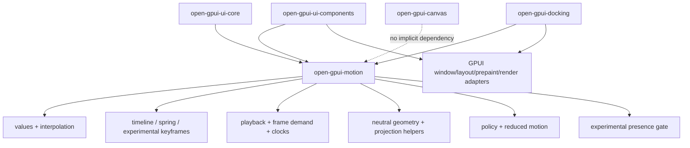
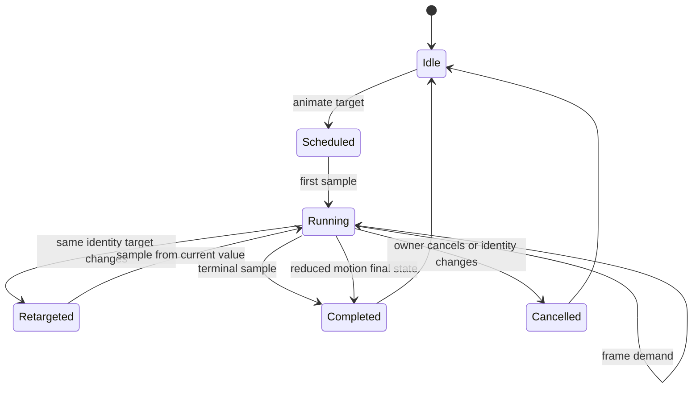
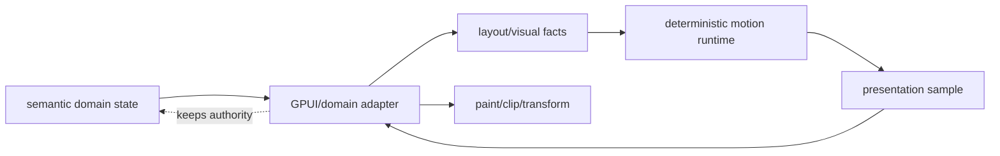

# Open GPUI Motion System Foundation - Plan

## Goal Capsule

| Field | Decision |
|---|---|
| Objective | Refactor the current `ui_core` motion primitives into an independent Open GPUI motion foundation that can grow into a general animation and motion system without a later crate/API migration. |
| Authority | Current `main`, `docs/adr/0015-ui-motion-runtime-foundation.md`, `docs/adr/0016-ui-motion-spring-foundation.md`, `docs/adr/0017-ui-motion-value-foundation.md`, `docs/research/2026-07-06-open-gpui-motion-system/outline.yaml`, local reference repos under `repo-ref/`, and existing Splitter/docking motion tests. |
| Execution profile | Fearless refactor. Breaking motion import paths, moving modules, deleting old `ui_core` motion code, and rewriting first-party imports are allowed because no released Open GPUI version has promised a stable motion surface. |
| Product boundary | Motion core owns deterministic runtime, current-consumer value/generator/playback contracts, policy, neutral geometry, projection helpers, and frame-demand primitives. Presence and richer playback/value APIs start experimental or crate-private until a first-party consumer proves them. GPUI adapters own windows, frame requests, layout/prepaint timing, hit testing, accessibility facts, and domain semantics. |
| Stop conditions | Stop and re-plan if the work requires DOM/React API compatibility, browser WAAPI as the primary runtime, full shared-layout projection, a DnD engine inside motion core, changing GPUI's window/render lifecycle contract, leaking GPUI/domain/window state into `open-gpui-motion`, failing terminal-geometry equivalence after neutral-geometry extraction, or expanding the stable public API beyond current-consumer-proven contracts. |
| Tail ownership | Implementation owns extraction, first-party migration, docs, focused verification, simplification/review, and logical commits after user confirmation. Existing unrelated release-prep working-tree changes remain untouched. |

---

## Product Contract

### Summary

This plan changes the motion posture from "renderer-neutral primitives inside `ui_core`" to "a first-class Open GPUI motion crate with stable runtime boundaries." The first implementation must extract the existing proven timeline/spring/policy/projection pieces, add the missing general animation seams, and migrate Splitter/docking to prove the crate is usable without pulling GPUI window or domain ownership into the core.

### Problem Frame

Open GPUI already has useful motion foundations in `ui_core`: deterministic timelines, explicit models, scalar tracks, spring sampling, policy gates, projection clips, retargeting, reduced-motion final-state semantics, Splitter integration, and docking transitions. That work is now valuable enough that keeping it embedded in `ui_core` is becoming the wrong dependency shape. A general animation system will need values, generators, playback controls, frame demand, presence, projection, and typed geometry that can serve components, docking, overlay transitions, and future web/native adapters.

The main architectural risk is a delayed extraction. If new public animation APIs are added under `open_gpui_ui_core`, the project will later need a breaking migration across `ui_core`, `ui_components`, `gpui_docking`, examples, docs, and external users. The better break is now: define `open-gpui-motion` as the neutral motion authority, migrate first-party consumers, and delete the old `ui_core` motion modules/exports instead of preserving compatibility paths that never shipped in a release.

| Extraction signal | Current evidence | Plan response |
|---|---|---|
| Existing public surface | `ui_core` currently exports motion spec/model/runtime/policy/projection contracts, but those are unreleased. | Move implementations now and remove the old `ui_core` motion exports instead of deprecating them. |
| Existing consumers | Splitter and docking already consume timelines, springs, policy, retargeting, and projection clips. | Migrate those consumers in the same work so the crate is proven by current behavior. |
| Future migration cost | Adding general animation APIs under `ui_core` would later require changing first-party imports, docs, examples, and external import paths. | Put new public motion APIs in `open-gpui-motion` from the start. |
| Current refactor cost | Geometry extraction is the hardest dependency break because current helpers use `UiRect`/`UiPx`. | Define neutral geometry before moving rect/projection helpers. |

Reference work points in the same direction. `repo-ref/motion` and `repo-ref/react-spring` show that animated values, generator sampling, playback controls, frame loops, presence, and layout projection are separate layers. `repo-ref/fret` and `repo-ref/iced` are closer to GPUI's Rust architecture: deterministic frame ids, explicit redraw/frame demand, adapter-owned scheduling, reduced motion, and semantic state authority. `repo-ref/egui_tiles` supports a lightweight `AnimatedRect`/projection-lite start for docking preview instead of copying full shared layout immediately.

### Requirements

- R1. Create an independent motion package with no dependency on `ui_core`, `ui_components`, docking, platform windows, DOM, React, CSS, or browser WAAPI.
- R2. Move or replace current `ui_core` motion implementations so the new crate owns `MotionPreference`, `MotionDuration`, `MotionEasing`, `MotionSpec`, `MotionModel`, presets, timeline/run state, scalar tracks, springs, policy gates, retarget helpers, and reduced-motion final-state semantics.
- R3. Define neutral motion geometry in the motion crate so projection, rect reveal, clip, and retarget APIs do not depend on `UiRect`/`UiPx` and do not create a dependency cycle.
- R4. Provide a general-animation foundation with a stable public minimum for current consumers and an experimental or crate-private incubation path for richer animated values, subscriptions, keyframes, repeat/reverse/speed controls, and builders until a first-party consumer proves them.
- R5. Keep GPUI frame scheduling adapter-owned. The motion crate may emit frame demand, clock requirements, and completion state, but it must not call `Window::request_animation_frame()` or own GPUI lifecycle phases.
- R6. Migrate first-party Splitter and docking transition code to the new crate boundary, proving programmatic motion, retargeting, projection clips, and reduced motion still work.
- R7. Preserve domain authority: pointer drag, splitter fractions, docking graph mutations, viewport release authority, focus, accessibility, and canvas pan/zoom semantics remain owned by their current crates.
- R8. Add projection helpers needed by current Splitter/docking consumers now. Presence and higher-level projection-lite may enter only as experimental/crate-private foundations unless this slice adds a real first-party consumer such as overlay or collapsible; full shared-layout trees, variants/stagger DSLs, DnD engines, scroll-linked animation, asset animation, and compositor backends stay deferred.
- R9. Update public docs and crate READMEs so users can discover the motion crate, understand the core/adapter split, and avoid assuming DOM/Framer API compatibility.
- R10. Verification must prove deterministic motion behavior in the new crate, deliberate removal of old `ui_core` motion paths, and unchanged Splitter/docking/canvas semantics.

### Acceptance Examples

- AE1. Given code that uses motion timelines or springs without any GPUI window, when `open-gpui-motion` tests run under nextest, then sampling, reduced motion, retargeting, and policy resolution are deterministic.
- AE2. Given `ui_core` builds after extraction, when code tries to use old `open_gpui_ui_core` motion paths, then those paths are gone and first-party code imports `open_gpui_motion` directly.
- AE3. Given Splitter programmatic fraction animation, when the target changes mid-flight, then the runtime retargets from the sampled current fraction and pointer drag remains immediate.
- AE4. Given docking pane/divider/affordance transitions, when a transition is replaced or reduced motion is active, then sampled projection and terminal visual state match current behavior.
- AE5. Given a canvas viewport pan or zoom action, when motion extraction is complete, then canvas coordinate conversion and hit testing remain immediate unless a future canvas API explicitly opts into motion.
- AE6. Given documentation for the motion crate, when a user looks for DOM, React, WAAPI, CSS parser, DnD, or full shared-layout support, then the docs clearly mark those as adapter/future scope rather than core promises.
- AE7. Given a developer reads the motion README, when they copy the minimal scalar or rect animation example, then it compiles as a doc test or is explicitly marked illustrative/experimental.

### Scope Boundaries

#### In Scope

- New `open-gpui-motion` package and workspace wiring.
- Neutral geometry/value/runtime modules required to break the `ui_core` dependency cycle.
- Migration of existing pure motion code out of `ui_core`.
- First-party import migration in `ui_core`, `ui_components`, and `gpui_docking`.
- Removal of old `ui_core` motion modules/exports, plus public-surface tests that prove first-party code moved to `open_gpui_motion`.
- Deterministic test utilities for motion sampling and frame-demand behavior.
- Motion crate README plus updates to root/crate documentation and ADR follow-up notes.

#### Deferred to Follow-Up Work

- Complete Framer-style variants, stagger orchestration, and nested animation-state priority trees.
- Full shared-layout/cross-tree projection with lead/follow stacks and scale correction.
- General DnD/gesture engine, scroll-linked animation, and viewport kinetic scrolling.
- Native compositor, CoreAnimation, WinUI Composition, browser WAAPI, or worklet backends.
- Lottie/Rive/SVG path morphing or asset-driven animation pipeline.
- Automatic animation of every component state change in the component library.
- Stable public presence, high-level builders, public value subscriptions, and repeat/reverse/speed controls unless this slice includes a first-party consumer proving them.

#### Outside This Product's Identity

- Treating motion as a DOM compatibility layer.
- Letting animation state mutate domain layout or docking graph authority.
- Advancing animations by render-call count instead of elapsed time/frame id.
- Hiding unsupported platform/backend behavior behind optimistic public API names.
- Making canvas, docking, or component adapters depend on a global mutable animation singleton.

---

## Planning Contract

### Key Technical Decisions

- KTD1. Extract now, not later. The plan creates `open-gpui-motion` before adding general animation APIs so the public surface starts in the correct crate.
- KTD2. Motion owns neutral geometry. `MotionPoint`, `MotionSize`, `MotionRect`, and projection/clip types live in the motion crate; `ui_core` and docking convert to and from `UiRect`/`Bounds<Pixels>`.
- KTD3. Core sampling is deterministic and host-neutral. Generators and controllers sample by elapsed time and explicit clocks; adapter code owns real frame scheduling.
- KTD4. Stable public animation APIs start as the minimum low-level typed surface proven by current consumers. Richer `MotionValue` subscriptions, keyframes, repeat/reverse/speed, and builders stay crate-private or behind an explicit experimental feature until a first-party consumer or doc-tested adapter proves them.
- KTD5. Projection helpers needed by current consumers are stable. Presence starts as a host-neutral retention/exit state machine only if it has a first consumer or remains experimental/crate-private; full shared-layout and DnD are explicitly deferred.
- KTD6. First-party users move to the new crate in the same work. `ui_core` deletes the old motion modules/exports because there is no released compatibility burden.
- KTD7. Reduced motion remains final-state semantic completion. It is not just "duration zero" and must continue to update layout, focus, and accessibility facts through adapters.
- KTD8. Motion emits presentation evidence only. By default animated overlays/projections affect paint, clip, and transform, not hit testing, focus order, or accessibility exposure. Adapters may opt a preview/affordance into interaction explicitly; semantic layout remains the hit-test/focus/a11y authority otherwise.
- KTD9. Frame demand is a core protocol, not a scheduler. The motion crate defines demand lifecycle, idempotence, cancellation/completion ordering, reduced-motion completion ordering, monotonic clock expectations, and multi-controller aggregation inputs; adapters own the real request-frame call.

### Assumptions

- The user has explicitly authorized breaking refactors and deletion of misleading code when this avoids a future large migration.
- Existing release-prep changes in `.github/workflows/publish-check.yml`, `CHANGELOG.md`, `Cargo.lock`, `Cargo.toml`, and `README.md` are unrelated to this plan and should not be touched unless the user asks to merge release work with motion work.
- `repo-ref/gpui-components` is not present locally; this plan uses `repo-ref/ui`, `repo-ref/fret`, `repo-ref/motion`, `repo-ref/react-spring`, `repo-ref/iced`, and `repo-ref/egui_tiles` as available prior art.
- `open-gpui-motion` should be publishable as a normal workspace crate, but crate publication metadata can follow the repository's current release-prep conventions.
- Web/wasm should compile with the motion crate, but browser-native animation acceleration is not part of this slice.
- `Cargo.toml` and `Cargo.lock` currently have unrelated release-prep changes in the working tree. Motion implementation may update those files only for motion-related hunks and must keep release-prep hunks unstaged unless the user explicitly combines the work.

### High-Level Technical Design

### Risks & Mitigations

| Risk | Mitigation |
|---|---|
| New motion crate accidentally depends on `ui_core` geometry and creates a cycle. | Define neutral motion geometry first and convert at crate boundaries. Add import-boundary or compile checks that fail if `open-gpui-motion` depends on UI crates. |
| Public API freezes too much too early. | Keep the first general API low-level, typed, and deterministic; mark high-level builders and adapters as crate-local or experimental until first-party consumers prove them. |
| Extraction breaks existing callers unexpectedly. | Treat this as an intentional pre-release break: remove old `ui_core` motion paths, update public-surface tests, and document that `open-gpui-motion` is the only motion import path. |
| Presence/projection scope expands into full Framer Motion. | Implement only current-consumer projection helpers as stable. Keep presence experimental or crate-private unless a first-party consumer proves the public contract. Defer shared-layout trees and variants. |
| Frame scheduling leaks into core. | The motion crate returns frame demand and samples against provided clocks; adapters own request-frame APIs and lifecycle timing. |
| Canvas behavior changes by accident. | Keep canvas out of first-party migration and run focused pan/zoom tests as a guard. |
| Docking transition authority regresses. | Keep docking graph/release/focus authority in docking and only migrate motion sampling/projection helpers. |
| Neutral geometry drifts from terminal UI geometry. | Define logical-pixel scalar semantics, adapter-only device snapping, allowed epsilon, and round-trip/property tests before migrating projection helpers. |

---

## System-Wide Impact

- `open-gpui-motion` becomes the motion authority for the workspace.
- `open_gpui_ui_core` stops owning pure motion implementation and no longer exports motion contracts.
- `open_gpui_ui_components::Splitter` proves component-level animation can consume the new crate directly while preserving pointer immediacy.
- `open_gpui_docking` proves domain-level layout transitions can consume the new crate directly while preserving graph and viewport authority.
- `open_gpui_canvas` remains intentionally immediate and unaffected by the extraction.
- `docs/adr/0017-ui-motion-value-foundation.md` remains historical context but needs a follow-up ADR or note saying the new product ambition supersedes the "defer public value graph" decision.
- Crate READMEs and root docs gain a discoverable story for motion, docking, and components as separate public packages.

---

## Execution Slices

| Slice | Priority | Units | Commit Boundary |
|---|---|---|---|
| S1. Crate extraction and neutral geometry | P0 | U1, U2 | Commit when `open-gpui-motion` compiles, owns pure motion primitives, and `ui_core` compiles after old motion exports are removed. |
| S2. Minimum general animation core | P0 | U3 | Commit when current-consumer value/generator/playback/frame-demand APIs have deterministic tests and no GPUI dependency. |
| S3. First-party migration | P0 | U4, U5 | Commit when Splitter and docking consume the new crate directly and focused behavior tests pass. |
| S4. Experimental presence/projection-lite gate | P1 | U6 | Commit when projection-lite additions are non-overlapping with U2 and any presence surface is either consumed by a first-party adapter or clearly experimental/crate-private. |
| S5. API/docs/release hardening | P1 | U7, U8 | Commit when docs, import boundaries, and verification gates are updated. |

Each slice may be implemented and committed independently after user confirmation. Avoid staging unrelated release-prep files unless the user explicitly merges release work into this motion refactor.

---

## Implementation Units

### U1. Create `open-gpui-motion`, Lockfile Wiring, And Extraction Skeleton

- **Goal:** Add a standalone motion crate and move the pure non-geometry motion surface without creating a dependency cycle or preserving old `ui_core` motion paths.
- **Requirements:** R1, R2, R5.
- **Dependencies:** None.
- **Files:** `Cargo.toml`, `Cargo.lock`, `crates/motion/Cargo.toml`, `crates/motion/src/lib.rs`, `crates/motion/src/motion.rs`, `crates/motion/src/runtime.rs`, `crates/motion/src/spring.rs`, `crates/motion/src/controller.rs`, `crates/motion/src/policy.rs`, `crates/motion/src/value.rs`, `crates/motion/src/geometry.rs`, `crates/ui_core/Cargo.toml`, `crates/ui_core/src/lib.rs`, `crates/ui_core/src/prelude.rs`, `crates/ui_core/src/motion.rs`, `crates/ui_core/src/motion_runtime.rs`, `crates/ui_core/src/motion_spring.rs`, `crates/ui_core/src/motion_controller.rs`, `crates/ui_core/src/motion_policy.rs`, `crates/ui_core/src/motion_projection.rs`, `crates/ui_core/src/motion_value.rs`.
- **Approach:** Create the package as `open-gpui-motion`, add it to the workspace, and update `Cargo.lock` before running `--locked` gates. Move renderer-neutral contracts into it, starting with the non-rect timeline/spring/policy/controller surface and a minimal neutral geometry shell needed to compile. Rect reveal/projection helpers that still depend on full `UiRect` semantics may temporarily remain in `ui_core` until U2 only if needed for a compiling intermediate state; do not copy implementations into both crates. Remove old `ui_core` motion modules and exports as soon as their consumers are migrated.
- **Patterns to follow:** Existing ADR 0015-0017 deterministic sampling behavior, current workspace public export conventions, Rust crate naming used by `open-gpui-ui-core` and `open-gpui-docking`.
- **Test scenarios:**
  - Covers AE1. Timeline, spring, policy, retarget, and reduced-motion tests run in `open-gpui-motion` without GPUI.
  - Covers AE2. `ui_core` no longer exports old motion paths, and first-party code imports the new crate directly.
  - The new crate does not import `open_gpui`, `open_gpui_ui_core`, `open_gpui_ui_components`, or `open_gpui_docking`.
  - `Cargo.lock` contains the new package before any `--locked` verification command runs, and only motion-related hunks are staged from dirty workspace metadata files.
- **Verification:** `cargo check -p open-gpui-motion --tests --locked`; `cargo nextest run -p open-gpui-motion --no-fail-fast`; `cargo check -p open-gpui-ui-core --tests --locked`.

### U2. Introduce Neutral Motion Geometry And Conversion Boundaries

- **Goal:** Break the `ui_core` geometry dependency before projection APIs harden.
- **Requirements:** R3, R6, R7.
- **Dependencies:** U1.
- **Files:** `crates/motion/src/geometry.rs`, `crates/motion/src/projection.rs`, `crates/motion/src/runtime.rs`, `crates/ui_core/src/geometry.rs`, `crates/ui_core/src/split.rs`, `crates/gpui_docking/src/transition_geometry.rs`, `crates/gpui_docking/src/transition_executor.rs`.
- **Approach:** Define motion-owned point, size, rect, edge, and projection/clip types using logical-pixel `f32` scalar units that round-trip from `UiPx` and `Bounds<Pixels>` through explicit conversions. Core geometry may normalize near-zero translation and identity scale for deterministic samples, but device-pixel snapping stays adapter-owned. Move reveal/source/lerp helpers into the motion crate after fractional, negative, zero-size, and large-rect behavior is covered. Keep adapters responsible for domain-specific bounds selection.
- **Patterns to follow:** Current `MotionProjectionClip` final-size content semantics, docking transition geometry helpers, and `egui_tiles`-style local rect smoothing rather than full tree projection.
- **Test scenarios:**
  - Projection clip/reveal helpers produce the same values as current `ui_core` tests for equivalent rectangles.
  - Docking pane/divider projection conversions preserve final visual bounds and occlusion bounds.
  - `open-gpui-motion` stays independent of `UiRect`, `UiPx`, and GPUI pixel types.
  - Round-trip/property tests cover fractional, negative, zero-size, and large rectangles within the documented epsilon.
- **Verification:** `cargo nextest run -p open-gpui-motion projection geometry --no-fail-fast`; `cargo nextest run -p open-gpui-ui-core split motion_projection --no-fail-fast`; focused docking transition tests listed in U5.

### U3. Stabilize Value, Generator, Playback, And Frame-Demand Core

- **Goal:** Make the new crate a real general animation foundation while stabilizing only the surface current consumers can prove.
- **Requirements:** R4, R5, R10.
- **Dependencies:** U1.
- **Files:** `crates/motion/src/value.rs`, `crates/motion/src/interpolate.rs`, `crates/motion/src/easing.rs`, `crates/motion/src/generator.rs`, `crates/motion/src/timeline.rs`, `crates/motion/src/playback.rs`, `crates/motion/src/clock.rs`, `crates/motion/src/frame_demand.rs`, `crates/motion/src/test_clock.rs`, `crates/motion/tests/`.
- **Approach:** Preserve and generalize the minimum surface proven by Splitter and docking: current/previous scalar sampling, explicit clocks, timeline and spring generators, cancel/finish completion, reduced-motion final-state completion, retargeting, and frame-demand reporting. Richer `MotionValue<T>` subscriptions, public keyframes, repeat/reverse/speed/delay controls, and high-level builders remain crate-private or behind an explicit experimental feature until U4/U5 or a new first-party adapter consumes them. Define `FrameDemand` lifecycle, idempotence, multi-controller aggregation inputs, cancellation/completion/reduced-motion ordering, and monotonic-clock expectations.
- **Patterns to follow:** `repo-ref/motion` generator and playback split, `repo-ref/react-spring` value/controller split, `repo-ref/fret` frame-id determinism, and current `MotionScalarController` retarget behavior.
- **Test scenarios:**
  - Stable scalar values retain previous value and compute velocity deterministically where exposed.
  - Timeline and spring generators sample by elapsed time and produce stable terminal samples; keyframes and richer playback remain experimental unless consumed.
  - Playback cancel/finish behavior and experimental pause/resume/repeat behavior do not depend on render-call count.
  - Multiple controller frame demands can be aggregated by an adapter without duplicate completion or missed cancellation.
  - Reduced-motion policy can force final semantic state through the same completion pathway.
- **Verification:** `cargo nextest run -p open-gpui-motion value generator playback clock --no-fail-fast`; `cargo test -p open-gpui-motion --doc`.

### U4. Migrate `ui_core` And `ui_components::Splitter`

- **Goal:** Prove component-level motion uses the new crate while preserving public Splitter behavior.
- **Requirements:** R2, R5, R6, R7, R10.
- **Dependencies:** U1, U2, U3.
- **Files:** `crates/ui_core/src/lib.rs`, `crates/ui_core/src/prelude.rs`, `crates/ui_core/src/split.rs`, `crates/ui_core/tests/headless_contracts.rs`, `crates/ui_components/Cargo.toml`, `crates/ui_components/src/splitter.rs`, `crates/ui_components/tests/public_surface/`, `docs/ui/component-contract.md`.
- **Approach:** Replace implementation imports with `open_gpui_motion` imports, remove old `ui_core` motion exports, and update source-string/private-module assertions so `MotionValue` privacy or experimental status is tested in the owning crate. Splitter must keep programmatic animation, layout-transition overlay, reduced-motion immediate completion, and pointer drag bypass. Splitter transition overlays remain paint/projection evidence only and are pointer-transparent unless a future adapter explicitly opts into interaction.
- **Patterns to follow:** Current Splitter runtime tests, component contract public-surface tests, and adapter-owned request-frame behavior.
- **Test scenarios:**
  - Covers AE3. Retargeting starts from the sampled current fraction.
  - Pointer drag synchronizes immediately and does not pass through spatial animation policy.
  - Reduced motion completes without leaving transition overlay state active.
  - Public-surface inventory reflects removal of old `ui_core` motion paths plus direct first-party imports.
  - Splitter transition overlays do not steal hit testing, focus, or accessibility exposure from the committed semantic layout.
- **Verification:** `cargo check -p open-gpui-ui-components --tests --locked`; `cargo nextest run -p open-gpui-ui-components splitter public_surface --no-fail-fast`; `cargo nextest run -p open-gpui-ui-core headless_contracts split --no-fail-fast`.

### U5. Migrate Docking Transition And Affordance Runtime

- **Goal:** Prove domain-level layout motion uses the new crate while preserving docking authority.
- **Requirements:** R3, R5, R6, R7, R10.
- **Dependencies:** U1, U2, U3.
- **Files:** `crates/gpui_docking/Cargo.toml`, `crates/gpui_docking/src/transition_executor.rs`, `crates/gpui_docking/src/transition_geometry.rs`, `crates/gpui_docking/src/presentation_commands.rs`, `crates/gpui_docking/src/render.rs`, `crates/gpui_docking/src/visual_affordance_scene.rs`, `crates/gpui_docking/src/host_transition_tests.rs`, `crates/gpui_docking/src/host_zoom_focus_tests.rs`, `crates/gpui_docking/src/host_render_tests.rs`, `crates/gpui_docking/src/host_viewport_preview_visual_tests.rs`.
- **Approach:** Move docking imports to `open_gpui_motion`, centralize bounds conversions, and delete duplicated adapter helpers that now belong to the motion geometry boundary. Keep docking responsible for graph transitions, route decisions, viewport capability gates, release authority, focus, hit testing, and accessibility facts. Projection and affordance samples are paint evidence unless the docking adapter explicitly declares a preview or affordance as an interaction target.
- **Patterns to follow:** Existing transition executor tests, visual affordance scene runtime, and capability-driven docking platform boundaries.
- **Test scenarios:**
  - Covers AE4. Custom timeline/spring specs remain timeline-backed or spring-backed as selected by explicit models.
  - Replacing an active transition retargets from current sampled geometry.
  - Reduced-motion transitions publish final pane/divider/affordance geometry immediately.
  - Focus/unzoom feedback remains immediate where the docking policy requires it.
  - Reduced-motion transitions move visual state, semantic layout, focus facts, accessibility facts, and completion state to terminal state exactly once.
  - Docking projection/affordance samples do not change hit testing or accessibility exposure unless the adapter explicitly opts in.
- **Verification:** `cargo check -p open-gpui-docking --tests --locked`; `cargo nextest run -p open-gpui-docking transition zoom focus visual_affordance --no-fail-fast`.

### U6. Gate Projection-Lite Additions And Experimental Presence

- **Goal:** Add only non-overlapping projection-lite helpers and keep presence experimental unless a real first-party consumer proves the API.
- **Requirements:** R4, R5, R8, R10.
- **Dependencies:** U2, U3.
- **Files:** `crates/motion/src/presence.rs`, `crates/motion/src/projection.rs`, `crates/motion/src/animated_rect.rs`, `crates/motion/tests/presence.rs`, `crates/motion/tests/projection_lite.rs`, required first-party consumer if stabilizing presence such as `crates/ui_components/src/overlay/` or `crates/ui_components/src/collapsible.rs`.
- **Approach:** Keep U2 responsible for stable current-consumer rect, clip, reveal, and projection helpers. U6 may add `AnimatedRect` or higher-level projection-lite helpers only when they do not overlap U2 and have a clear first consumer or experimental status. Presence is a host-neutral retention/exit state machine with completion and re-entry cancellation only; it must not decide component removal, focus, accessibility exposure, hit testing, or domain state. If no first-party consumer is added, keep presence crate-private or behind an explicit experimental feature and do not document it as stable public API.
- **Patterns to follow:** `repo-ref/motion` AnimatePresence lifecycle, `repo-ref/react-spring` keyed transition retention, `repo-ref/egui_tiles` smooth preview rect, and current docking visual affordance projection.
- **Test scenarios:**
  - Experimental exiting items retain visual presence until all exit handles complete.
  - Re-entry cancels pending removal and restores semantic ownership through the adapter.
  - Presence states define visual presence, semantic presence, input acceptance, and accessibility exposure, with exiting defaulting to paint-only unless an adapter opts in.
  - Projection-lite computes before/after deltas and terminal state deterministically.
  - Reduced motion completes experimental presence/projection immediately while firing completion once and leaving no stale hit-test or accessibility exposure.
- **Verification:** `cargo nextest run -p open-gpui-motion presence projection_lite animated_rect --no-fail-fast`.

### U7. Documentation, README, And ADR Follow-Up

- **Goal:** Make the new motion system discoverable and prevent users from assuming unsupported DOM/Framer behavior.
- **Requirements:** R8, R9.
- **Dependencies:** U1-U6 as applicable.
- **Files:** `crates/motion/README.md`, `crates/ui_core/README.md`, `crates/ui_components/README.md`, `crates/gpui_docking/README.md`, `README.md`, `docs/adr/`, `CHANGELOG.md` if release notes are in scope for the final branch.
- **Approach:** Add a motion crate README covering core concepts, dependency boundaries, example low-level usage, reduced motion, testing, and deferred features. Add short READMEs or docs pointers for component/docking consumers if missing. Add a follow-up ADR noting that general motion ambition supersedes ADR 0017's "defer public value graph" decision.
- **Patterns to follow:** Existing ADR format and crate README style.
- **Test scenarios:**
  - Covers AE6. Docs state that DOM, React hooks, CSS parser, WAAPI, full shared layout, DnD, and asset animation are not core promises.
  - Covers AE7. README examples compile as doc tests where practical or remain clearly marked as illustrative or experimental.
  - Public crate list includes motion beside components, docking, canvas, and command crates.
- **Verification:** `cargo test -p open-gpui-motion --doc`; `rg "open-gpui-motion|MotionValue|reduced motion|shared layout|WAAPI" README.md crates docs`.

### U8. Import Boundary, CI, And Release Surface Hardening

- **Goal:** Add guards so the new architecture does not drift back into `ui_core` ownership or platform-specific assumptions.
- **Requirements:** R1, R5, R9, R10.
- **Dependencies:** U1-U7.
- **Files:** `xtask/src/`, `docs/imports/`, `docs/verification.md`, `.github/workflows/`, `Cargo.toml`, `Cargo.lock`.
- **Approach:** Extend existing import-boundary or verification tooling to assert that `open-gpui-motion` has no UI/domain/platform dependencies and that first-party crates import motion directly where intended. Update CI docs and workflow package lists only if the new crate is omitted from existing workspace gates.
- **Patterns to follow:** Current `xtask verify`, import-boundary checks, and publish-check workflow conventions.
- **Test scenarios:**
  - Workspace metadata includes `open-gpui-motion` with correct package name and publish metadata.
  - Import boundary fails if motion depends on `ui_core`, docking, components, GPUI platform, or web-specific crates.
  - CI/package checks include the new crate without accidentally staging unrelated release-prep changes.
  - Wasm metadata or check gates cover `open-gpui-motion` without relying on browser-native animation acceleration.
- **Verification:** `cargo metadata --format-version 1 --no-deps --locked`; `cargo run -p xtask -- verify` when local platform prerequisites allow it; otherwise run the focused gates and document CI-owned Windows/Linux/wasm checks.

---

## Verification Contract

### Required Local Gates

| Gate | Command |
|---|---|
| Formatting | `cargo fmt --all --check` |
| New motion crate | `cargo check -p open-gpui-motion --tests --locked` |
| Motion unit/doc tests | `cargo nextest run -p open-gpui-motion --no-fail-fast` and `cargo test -p open-gpui-motion --doc` |
| Motion wasm compile | `cargo check -p open-gpui-motion --target wasm32-unknown-unknown --tests --locked` when the local Rust target is installed; otherwise delegate to CI and document the gap. |
| UI core break check | `cargo check -p open-gpui-ui-core --tests --locked` |
| Component migration | `cargo check -p open-gpui-ui-components --tests --locked` and focused Splitter/public-surface nextest gates |
| Docking migration | `cargo check -p open-gpui-docking --tests --locked` and focused transition/zoom/focus/affordance nextest gates |
| Canvas guard | `cargo nextest run -p open-gpui-canvas zooms_around_view_point_without_moving_document_anchor pan_tool_moves_viewport --no-fail-fast` |
| Workspace metadata | `cargo metadata --format-version 1 --no-deps --locked` |

### CI-Owned Or Platform-Specific Gates

- Windows: `cargo check --workspace --locked` or `xtask verify` through GitHub Actions after Windows dependency compatibility is clean.
- Linux: full workspace check/nextest through GitHub Actions if local macOS cannot reproduce Linux-only platform behavior.
- Wasm/web: stable package checks for `open-gpui-web`, `open-gpui-platform`, `open-gpui-wgpu`, and `open-gpui-motion`; nightly atomics/multithreaded checks remain optional unless current CI already requires them.

### Review Gates

- Run a diff-scoped review after U1-U5 because this is a crate-boundary refactor with high blast radius.
- Run a motion-specific review against animation craft/API risks after U3 and U6.
- Confirm `git status --short` before staging so unrelated release-prep changes are not included in motion commits.

---

## Definition Of Done

- `open-gpui-motion` exists, compiles independently, and owns pure motion runtime/value/generator/policy/frame-demand/neutral-geometry foundations.
- `ui_core` no longer contains duplicate pure motion implementations and no longer exports motion contracts; any remaining code is adapter-local conversion only.
- Splitter and docking consume the new motion crate directly and pass focused regression tests.
- Motion geometry no longer depends on `UiRect`/`UiPx`; logical-pixel scalar semantics, epsilon behavior, and adapter-only device snapping are documented and tested.
- Stable projection helpers cover current Splitter/docking consumers; any presence or richer projection-lite surface is either consumed by a first-party adapter or explicitly experimental/crate-private.
- Stable public APIs are limited to current-consumer-proven contracts; richer value subscriptions, keyframes, repeat/reverse/speed controls, and builders remain experimental unless consumed and documented.
- Reduced-motion final-state semantics remain covered in motion, Splitter, docking, hit-test/focus, and accessibility tests.
- Canvas pan/zoom tests pass, proving no accidental implicit motion was introduced.
- README/ADR/verification docs explain the new crate, boundaries, deferred features, and migration posture.
- Import-boundary or equivalent checks prevent the motion crate from depending on UI/domain/platform crates.
- Work is split into logical commits only after user confirmation, with unrelated current working-tree changes excluded unless explicitly requested.

---

## Open Questions

- Which richer value/playback APIs should graduate from experimental after the first implementation: public subscriptions, keyframes, repeat/reverse/speed controls, or builders?
- If presence graduates from experimental in this slice, which first-party consumer should prove it first: overlay, collapsible, docking affordance, or another component?
- Should inertial motion ship behind an `inertia` feature until drag/scroll consumers exist, or stay fully deferred?
