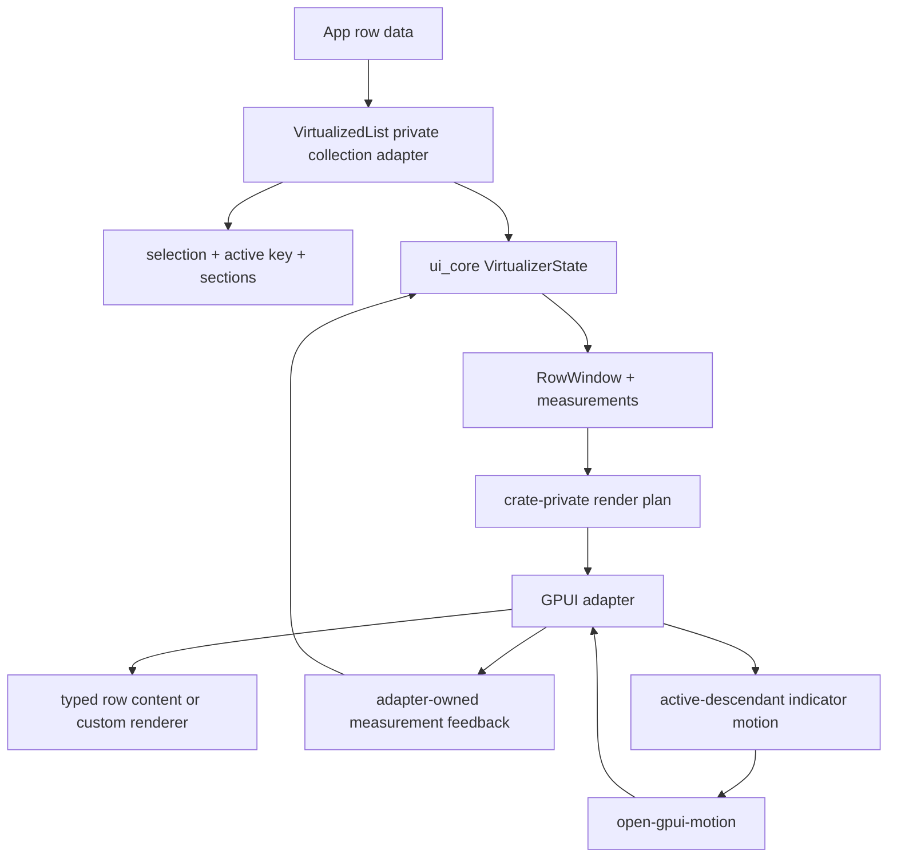
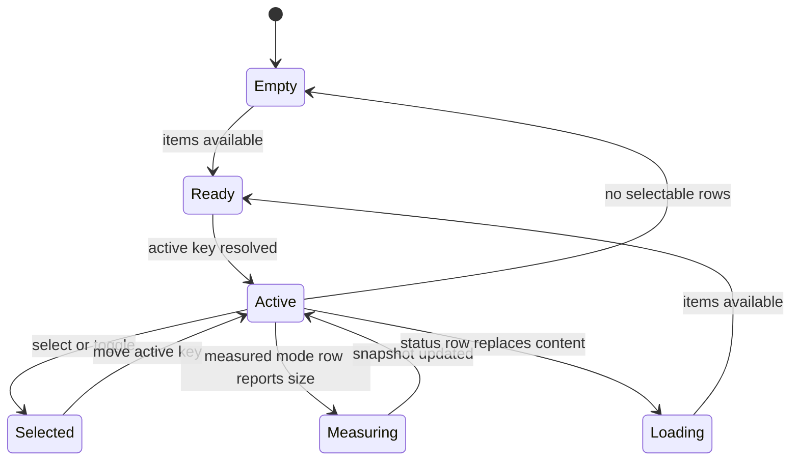
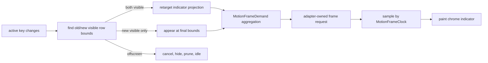

# VirtualizedList And Motion v0.2.0 Foundation - Plan

## Goal Capsule

| Field | Decision |
|---|---|
| Objective | Break and rebuild `VirtualizedList` into a durable collection-backed component before v0.2.0, while strengthening `open-gpui-motion` only where deterministic tests and a first-party component prove the runtime contract. |
| Authority | User request for a fearless v0.2.0 pre-release refactor, `docs/research/2026-07-06-open-gpui-virtualized-list-motion-v020/outline.yaml`, `docs/research/2026-07-06-open-gpui-virtualized-list-motion-v020/fields.yaml`, `docs/adr/0018-open-gpui-motion-crate-boundary.md`, existing `VirtualizerState` and `ChoiceCollection` code, and reference repos under `repo-ref/`. |
| Execution profile | Fearless refactor. Breaking `VirtualizedList` constructors, descriptors, activation payloads, selection state, snapshot names, and docs is allowed because v0.2.0 should ship the durable component-library shape rather than preserving the current text-label-only API. |
| Product boundary | `open-gpui-ui-core` keeps the renderer-neutral virtualizer math. `open-gpui-ui-components` owns collection semantics and GPUI rendering. `open-gpui-motion` owns deterministic motion sampling, clock/demand contracts, and projection evidence. No crate may take over domain state, focus authority, or GPUI frame scheduling. |
| Stop conditions | Stop and re-plan if the implementation requires a new virtualization engine, global animation loop, public MotionValue subscription graph, stable presence API, full shared-layout projection, row recycling pools, changing GPUI window lifecycle, or weakening existing Table/Tree/Command virtualization contracts. |
| Tail ownership | The implementation session owns refactor, docs, focused verification, review, and commits when asked. Existing unrelated changes stay unstaged unless the user explicitly combines them. |

---

## Product Contract

### Summary

This plan makes `VirtualizedList` a real component-library primitive instead of a fixed-height label renderer. The new surface is key-based, collection-aware, renderer-extensible, proof-gated for measured rows, and motion-ready. Motion work is limited to runtime contracts the list can prove: explicit clocks, frame-demand aggregation, finish/cancel semantics, doctested examples, and an active-descendant indicator that animates component chrome without animating virtualized row layout.

### Problem Frame

`VirtualizedList` currently exposes `VirtualizedListItemDescriptor { key, label, disabled }`, stores active/selected state by index, returns index-only activation, and renders each row as `row.label().to_owned()`. That is enough for a gallery smoke sample, but it is too shallow for a component library: real consumers need stable row identity across filtering/reordering, richer row content, selection payloads that do not become stale, group/section semantics, measured rows where content dictates height, empty/loading/error states, and row-level accessibility metadata.

The repository already has stronger ingredients than the public `VirtualizedList` surface suggests. `open_gpui_ui_core::VirtualizerState` owns stable keys, measurement caches, snapshots, fixed-window and known-size windows, total size, ranges, and overscan. `choice.rs` and `ListboxState` already model stable values, disabled-item skipping, typeahead, active value, and selection. `Command`, `Tree`, and `Table` have more mature render-plan and runtime patterns than `VirtualizedList` itself.

Prior art reinforces the same split. TanStack Virtual keeps virtualization headless around count, keys, measurement, overscan, and scroll-to-index. react-window separates row rendering from window math and treats dynamic height as a heavier path. virtua offers higher-level list affordances on top of a configurable virtualizer. React Spectrum keeps collection/listbox state above the virtualizer. The durable Open GPUI move is to converge on that layered model in Rust/GPUI terms.

Motion should be validated through this work, not expanded ahead of it. The current `open-gpui-motion` crate already owns scalar tracks, policy, projection, reduced-motion semantics, and import boundaries. The missing v0.2.0 contract is frame demand and clock/lifecycle behavior across real component adapters. A `VirtualizedList` active-descendant indicator is a good first consumer because it can animate one chrome layer by stable key without animating every row mount/unmount or disturbing scroll layout.

### Requirements

**VirtualizedList product shape**

- R1. `VirtualizedList` must use stable item keys as the primary public identity for active, selected, activation, scroll, and snapshot behavior; index remains diagnostic and positional only.
- R2. The item model must support typed row content beyond a single label: primary text, optional secondary text, leading/trailing affordances, badges/metadata, disabled reason, and explicit text value for typeahead/accessibility.
- R3. The rendered component must support a controlled custom row renderer with a constrained row context, while preserving a simple typed-content path for common list cases.
- R4. The state model must support single and multi-selection, active descendant, disabled rows, empty/loading/error rows, and section/group rows without duplicating `Listbox` or `Command` logic.
- R5. The virtualized layout contract must keep fixed-height rows fast and run a measured-row proof gate against existing `VirtualizerState` snapshots before exposing public measured-row support; if that proof gate fails, stop and re-plan instead of silently shipping a reduced measured-row scope.
- R6. Programmatic reveal must support key-based scroll targets with nearest/top/center/bottom alignment and deterministic behavior when the key is absent, disabled, filtered out, or currently offscreen.
- R7. Behavior snapshots and gallery samples must expose the new row identity, section, selection, measurement, empty/loading/error, and custom-renderer contracts without making crate-private render plans public.

**Motion product shape**

- R8. `open-gpui-motion` must define public frame-demand aggregation and a deterministic frame clock vocabulary so multiple tracks/controllers can drive one adapter-owned frame request without starving or over-requesting.
- R9. `open-gpui-motion` must clarify lifecycle semantics for sample, retarget, cancel, finish, reduced-motion completion, terminal pruning, and monotonic elapsed-time sampling.
- R10. `VirtualizedList` must consume motion through a stable-key active-descendant indicator projection that animates component chrome only; selected rows remain static semantic row state, and row layout, scroll offsets, selection semantics, focus, and accessibility stay authoritative without motion.
- R11. `open-gpui-motion` README, crate docs, and doctests must show the supported low-level contracts and mark MotionValue subscriptions, keyframes, repeat/reverse/speed, public presence, WAAPI, and shared-layout orchestration as deferred.

**Release and boundary**

- R12. The refactor must update public API inventory, component contract docs, gallery metadata, verification docs, and import-boundary checks so v0.2.0 presents one coherent story.
- R13. The plan must not introduce a new virtualizer crate, a headless UI crate, a global animation scheduler, or a stable presence API.

### Acceptance Examples

- AE1. Given a list whose items are reordered after selection, when state resolves again, then the selected key remains selected even though its index changed.
- AE2. Given duplicate or missing keys, when behavior snapshots resolve, then diagnostics identify fallback render keys without treating index as the semantic identity.
- AE3. Given a custom row renderer in fixed-height mode, when the renderer attempts to imply a different row height, then tests keep layout height governed by `VirtualizedListMetrics` and document measured mode as unavailable until the U4 proof gate passes.
- AE4. Given the measured-row proof gate passes, when a viewport resolves after rows change size, then `VirtualizerState` restores key-matched measurements and invalidates stale keys without full-list materialization.
- AE5. Given a sectioned virtualized list, when navigation skips a disabled item and lands in another section, then active/selected metadata, `aria-posinset`, `aria-setsize`, and section labels remain correct.
- AE6. Given multi-select mode, when a row is toggled by Space or click, then the selection callback returns the changed row key and full selected-key set; Enter activates the active row key without relying on index-only state.
- AE7. Given active key movement from one visible row to another, when reduced motion is disabled, then the indicator retargets from old bounds to new bounds and requests frames until terminal.
- AE8. Given reduced motion is enabled, when active key movement occurs, then the indicator publishes final bounds immediately, emits no continuing frame demand, and selection/focus metadata stays correct.
- AE9. Given the active key scrolls out of the render window, when the list samples the indicator, then the controller cancels, hides the indicator, prunes terminal state, and does not keep requesting frames forever.
- AE10. Given a user reads v0.2.0 docs, when they look for row animation/presence/keyframes, then docs explain the supported active-indicator chrome motion and defer row enter/exit animation, public presence, keyframes, repeat/reverse/speed, and MotionValue subscriptions.

### Scope Boundaries

#### In Scope

- Breaking `VirtualizedListItemDescriptor`, `VirtualizedListState`, `VirtualizedListActivation`, builder methods, behavior snapshots, and gallery sample APIs.
- Adding a `VirtualizedList`-private collection/row adapter inside `open-gpui-ui-components`, reusing existing `choice.rs` and `VirtualizerState` semantics where possible without changing shared helper semantics ahead of a second component consumer.
- Splitting `virtualized_list.rs` into deeper modules if implementation confirms ownership boundaries need it.
- Key-based active/selected/default state, multi-selection, section/group rows, typed row content, constrained custom renderer, and status rows.
- Proof-gated measured-row support through existing virtualizer measurement snapshots and adapter-owned row measurement.
- Motion clock/demand/lifecycle strengthening in `open-gpui-motion`.
- `VirtualizedList` active-descendant indicator motion as the first new component consumer.
- Gallery, docs, component contract registry, public surface tests, and verification updates.

#### Deferred to Follow-Up Work

- Full variable-size list engine beyond what `VirtualizerState` already supports.
- Row recycling pools, masonry, chat prepend anchoring, bidirectional infinite loading, and item reuse.
- Full table/tree/command rewrites on top of the new `VirtualizedList` collection model. This plan may update them only for shared type fallout or documentation.
- Public stable presence, row enter/exit animations, keyframes, repeat/reverse/speed, timeline DSLs, and MotionValue subscription graphs.
- Full shared-layout projection, viewport-transition trees, DnD engines, browser WAAPI, and native compositor backends.
- A standalone `open-gpui-ui-headless` crate.

#### Outside This Product's Identity

- Treating virtualized row index as stable semantic identity.
- Letting custom row rendering own virtualization geometry in fixed-height mode.
- Animating every mounted/unmounted virtualized row by default.
- Letting motion change selection, focus order, hit testing, accessibility roles, or scroll offsets.
- Copying React hook or DOM attribute API shapes into Rust/GPUI public API.

---

## Planning Contract

### Key Technical Decisions

- KTD1. Stable keys replace index as the public state axis. Index remains useful for render windows and diagnostics, but selected/active/activation/scroll state must round-trip by key.
- KTD2. Reuse existing primitives before adding new ones, but do not broaden shared helper semantics without a second in-plan consumer. `VirtualizerState`, `RowWindow`, `ChoiceCollection`, `ListboxState`, Command render plans, Tree render plans, and Table measurement runtime are local patterns; this plan starts with a `VirtualizedList`-private adapter around them.
- KTD3. `VirtualizedList` becomes layered. The `VirtualizedList`-private collection adapter owns item/section/selection/navigation semantics; the virtualizer owns ranges/measurements; the GPUI adapter owns focus, scroll handles, row rendering, measurement feedback, and frame requests.
- KTD4. Typed row content is the default public path. Custom rendering is supported through a constrained context, but the simple descriptor path remains first-class for command/search/listbox-like uses.
- KTD5. Measured rows are opt-in only after the U4 proof gate passes. Fixed rows stay the default and keep the hot path allocation- and measurement-light. Measured mode uses key-based snapshots and explicit invalidation only if the proof gate shows the existing virtualizer can support it without full-list materialization.
- KTD6. Motion validates active-descendant chrome projection, not row layout animation. The first consumer is an active indicator that animates between visible row bounds by stable key; selected rows stay static semantic state.
- KTD7. Frame demand is aggregated in motion and scheduled by adapters. `open-gpui-motion` exposes demand state and combination rules; `VirtualizedList` proves a single GPUI adapter can consume that demand for active-indicator motion, while cross-component or cross-adapter scheduling claims stay undocumented until separately proven.
- KTD8. Rich animation APIs stay deferred. Do not stabilize public presence, keyframes, repeat/reverse/speed, timeline DSLs, or MotionValue subscriptions in this plan.
- KTD9. Documentation and tests are part of the break. A v0.2.0 user should discover the new import/API shape from README, component contract docs, migration examples, component-selection guidance, gallery examples, and public surface tests.
- KTD10. Public API migration is atomic at release quality. Intermediate commits may exist on the refactor branch, but v0.2.0 docs, gallery, public-surface inventory, and verification gates become authoritative only when U8 lands.

### High-Level Technical Design

### Assumptions

- The branch starts from the current `refactor/open-gpui-motion` state, where `open-gpui-motion` already exists and old `ui_core` motion exports are gone.
- The user wants v0.2.0 quality over compatibility; no deprecated `VirtualizedList` aliases are required.
- `repo-ref/react-spectrum` is sparse and mainly useful for public architecture signals, not implementation details.
- First-party examples and tests can break and be updated with the new API in the same plan.
- Public measured-row support remains in scope only if the U4 proof gate passes. If it fails, stop and re-plan R5, AE4, U4, gallery coverage, and the Definition of Done before continuing.

### Risks & Mitigations

| Risk | Mitigation |
|---|---|
| `VirtualizedList` grows into a second Command/Listbox/Tree implementation. | Keep the new adapter `VirtualizedList`-private first, reuse existing `ChoiceCollection`/Listbox behavior through compatibility checks, and avoid changing shared helper semantics without a second in-plan consumer. |
| Custom row rendering weakens virtualization invariants. | Require row renderer context to carry fixed/estimated size, roles, active/selected/disabled flags, and documented sizing mode. Add tests that fixed mode ignores accidental renderer size. |
| Measured rows create scroll jumps or stale caches. | Make measured rows pass a proof gate before public exposure: key-snapshot restore, window-level materialization, removed-key invalidation, and measured scroll targets must all pass first. Keep fixed mode default. |
| API breaks cascade through gallery and docs. | Update samples, component contract rows, public surface inventory, and verification docs in the same units. |
| Motion work expands into a full animation framework. | Limit stable motion additions to clock, frame-demand aggregation, lifecycle semantics, doctests, and the `VirtualizedList` active-indicator consumer. |
| Indicator motion becomes layout-authoritative. | Paint it as chrome over final row layout; selection, focus, hit testing, and a11y use semantic state, not sampled motion state. |
| Frame demand over-requests or starves animation. | Add demand-host tests that simulate frame requests only when demand is returned and ensure terminal/reduced-motion states go idle. |

### Sources & Research

- `docs/research/2026-07-06-open-gpui-virtualized-list-motion-v020/outline.yaml` and `fields.yaml` capture the combined research scope.
- `crates/ui_components/src/virtualized_list.rs` shows the current `key/label/disabled` descriptor and direct label row rendering that this plan breaks.
- `crates/ui_core/src/virtualizer.rs` already provides key-based measurement, fixed-window, known-size-window, and snapshot contracts.
- `crates/ui_components/src/listbox.rs` and `crates/ui_components/src/choice.rs` provide stable-value selection, grouping, disabled-item skipping, and typeahead patterns.
- `crates/ui_components/src/command/render_plan.rs`, `crates/ui_components/src/table/virtualization.rs`, and `crates/ui_components/src/tree/render_plan.rs` provide local render-plan and virtualized-window patterns.
- `crates/motion/src/controller.rs`, `crates/motion/src/runtime.rs`, and `crates/motion/README.md` define the current motion runtime and frame-demand surface.
- `repo-ref/tanstack-virtual/packages/virtual-core/src/index.ts` supports a headless virtualizer contract around keys, estimates, measurement, overscan, range extraction, and scroll-to-index.
- `repo-ref/react-window/lib/components/list/types.ts` and `List.tsx` support row-renderer separation and fixed-height-first design.
- `repo-ref/virtua/src/react/Virtualizer.tsx` supports high-level list affordances over configurable virtualizer primitives.
- `repo-ref/motion`, `repo-ref/react-spring`, and `repo-ref/fret` support demand-driven clocks and lifecycle semantics without copying React/DOM-specific APIs.
- External references: https://tanstack.com/virtual/latest/docs/api/virtualizer, https://react-window.vercel.app/, https://github.com/inokawa/virtua, https://react-spectrum.adobe.com/react-aria/useListBox.html, https://www.w3.org/WAI/ARIA/apg/patterns/listbox/.

---

## System-Wide Impact

- `VirtualizedList` becomes a breaking public component API for v0.2.0.
- Gallery and public-surface tests that mention `VirtualizedListItemDescriptor`, `VirtualizedListState`, or `VirtualizedListActivation` must update to key-based vocabulary.
- The new collection logic starts as a `VirtualizedList`-private adapter. Shared collection helpers may become stronger later only after a second component migrates and proves the shared semantics.
- `open-gpui-motion` gains stronger runtime contracts that other components can later consume without changing GPUI frame ownership.
- Docs must make the new scope clear: `VirtualizedList` is a collection component with virtualized rendering, `Listbox`/`Command`/`Table`/`Tree` remain the richer domain components for their workflows, and `VirtualizerState` remains the lower-level math primitive.

---

## Implementation Units

### U1. Introduce Key-Based Collection State For VirtualizedList

- **Goal:** Replace index-primary active/selected/activation state with stable key-based collection semantics while preserving index diagnostics.
- **Requirements:** R1, R4, R6.
- **Dependencies:** None.
- **Files:** `crates/ui_components/src/virtualized_list.rs`, optional new `crates/ui_components/src/virtualized_list/model.rs`, `crates/ui_components/src/choice.rs`, `crates/ui_components/src/listbox.rs`, `crates/ui_components/tests/choice.rs`, `examples/ui-foundation-gallery/src/pages/components/samples/virtualized_list.rs`.
- **Approach:** Define key/value types and state resolution so active, selected, default active, default selected, navigation, activation, and scroll targets are keyed. Start with a `VirtualizedList`-private collection adapter that reuses `ChoiceCollection` stable value and traversal behavior through compatibility tests, not by changing shared helper semantics first. Keep index in snapshots as the resolved render position. Activation payloads should include key, index, disabled state, selected state, and text value.
- **Compatibility matrix:** Before modifying shared helpers, record item, section, separator, empty/loading/error, disabled, single-select, multi-select, typeahead, activation, and reveal semantics for `VirtualizedList`, `Listbox`, `Command`, `Select`, and `Combobox`. Only extract or modify shared helper behavior when at least two current call sites use the same semantics in this plan.
- **Selection contract:** Add `VirtualizedListSelectionMode` with single as default and multiple as opt-in. Arrow keys and typeahead move active key only. In single mode, click, Enter, and Space select and activate the target row. In multi-select mode, click and Space toggle the row and emit `on_selected_keys_change` with the changed key plus the complete selected-key set; Enter emits activation for the active key without changing selection. Disabled, section, separator, and status rows do not select or activate.
- **Programmatic reveal contract:** Add `scroll_to_key` or equivalent with result values for `Revealed`, `Estimated`, `NotFound`, and `NotSelectable`. Present enabled and disabled item rows may be revealed without changing active or selected state. Filtered-out or absent keys are no-ops with `NotFound`. Missing measurements use estimated size and return `Estimated`. Status, separator, and section rows do not become active through reveal.
- **Execution note:** Add characterization coverage for the current label list before replacing state APIs so behavior changes are intentional and visible.
- **Patterns to follow:** `ListboxState::resolve`, `ChoiceCollection::resolve`, `CommandState` selected-values handling, `TreeState` focused/selected value vocabulary.
- **Test scenarios:**
  - Resolving with `default_active_key` and `default_selected_key` selects matching rows after reorder.
  - Unknown active/selected keys fall back to the first enabled selectable row or `None` according to disabled/empty state.
  - Disabled rows cannot become active through navigation and cannot emit activation.
  - Single mode click, Enter, and Space select and activate the row key.
  - Multi-select Space and click toggle selected keys and Enter activates without mutating selection.
  - `scroll_to_key` returns deterministic results for absent, filtered, disabled, offscreen, and missing-measurement targets.
  - Duplicate keys produce diagnostics or deterministic fallback render keys while semantic state rejects ambiguous key selection.
- **Verification:** Behavior snapshots and state tests prove no public callback relies on index alone.

### U2. Add Typed Row Content, Status Rows, And Section Rows

- **Goal:** Replace label-only descriptors with row anatomy suitable for component-library lists.
- **Requirements:** R2, R4, R7.
- **Dependencies:** U1.
- **Files:** `crates/ui_components/src/virtualized_list.rs`, optional `crates/ui_components/src/virtualized_list/descriptor.rs`, optional `crates/ui_components/src/virtualized_list/model.rs`, `crates/ui_components/src/component_contract/rows/catalog.rs`, `crates/ui_components/src/component_contract/surfaces.rs`, `docs/ui/component-contract.md`.
- **Approach:** Introduce row descriptors for item, section, separator, loading, empty, and error rows. Item rows carry primary text, secondary text, text value, disabled reason, leading/trailing metadata, and optional badge/status fields. Keep a simple constructor for primary-label-only rows. Section rows group following items but do not select by default. Status rows replace collection content for loading, empty, or error states; the list root remains focusable when the component is enabled, resolved active descendant becomes `None`, prior requested keys remain stored for later ready state, and keyboard navigation/activation is a no-op until selectable rows return.
- **Status-row a11y contract:** Loading rows expose a progress/status semantic, empty rows expose a note/empty semantic, and error rows expose an alert/error semantic in behavior snapshots. Status rows are never counted as selectable options for `aria-posinset`/`aria-setsize`.
- **Patterns to follow:** `ListboxOptionDescriptor`, `ListboxGroupDescriptor`, `CommandItemDescriptor`, `CommandGroupDescriptor`, `TreeItemDescriptor`, `StatusCue`, `EmptyState`.
- **Test scenarios:**
  - Primary-only descriptors render the same semantic text as the old label path.
  - Secondary text and metadata appear in behavior snapshots without changing key identity.
  - Section rows do not become selected and expose group metadata to following items.
  - Loading, empty, and error rows suppress activation and expose appropriate roles/state in snapshots.
  - Typeahead uses explicit text value when present and primary text otherwise.
- **Verification:** Component contract rows document the new descriptor model and gallery metadata exposes at least one typed-content sample.

### U3. Prepare VirtualizedList Module Boundaries As Needed

- **Goal:** Keep the public facade stable while allowing local extraction only where the implementation proves ownership boundaries.
- **Requirements:** R3, R5, R7, R12.
- **Dependencies:** U1, U2.
- **Files:** `crates/ui_components/src/virtualized_list.rs`, optional directory module `crates/ui_components/src/virtualized_list/mod.rs`, optional `descriptor.rs`, optional `model.rs`, optional `render_plan.rs`, optional `runtime.rs`, optional `style.rs`, `crates/ui_components/src/lib.rs`, `crates/ui_components/src/public_api/default.rs`, `crates/ui_components/tests/public_surface/docs.rs`.
- **Approach:** Keep `VirtualizedList` as the public render facade. Do the smallest local extraction needed by U1/U2/U4/U5/U7. If the component moves to a directory module, move `crates/ui_components/src/virtualized_list.rs` to `crates/ui_components/src/virtualized_list/mod.rs` and do not keep the old root file, because Rust cannot compile both module sources for `pub mod virtualized_list;`. Extract pure descriptors/state into descriptor/model, crate-private row window assembly into render_plan, GPUI focus/scroll/measurement/frame runtime into runtime, and colors/metrics into style only after those boundaries become load-bearing.
- **Patterns to follow:** `command/mod.rs`, `tree/mod.rs`, `menu/mod.rs`, `table/render_plan`, `component_contract/source_mapping.rs`.
- **Test scenarios:**
  - Public exports remain explicit whether the component stays in one file or moves to a directory module.
  - Source mapping and public docs tests point to the new module owners.
  - Behavior snapshots before and after any extraction remain equivalent for a simple keyed list.
  - Runtime-owned state does not leak into pure model tests.
- **Verification:** Public-surface and source-mapping tests prove the facade and any chosen module owners are reflected in inventory.

### U4. Add Fixed And Measured Row Layout Modes

- **Goal:** Keep the fixed-row hot path fast and prove measured rows can be public without changing the virtualizer architecture.
- **Requirements:** R5, R6, R7.
- **Dependencies:** U1, U2.
- **Files:** `crates/ui_components/src/virtualized_list/model.rs`, `crates/ui_components/src/virtualized_list/render_plan.rs`, `crates/ui_components/src/virtualized_list/runtime.rs`, `crates/ui_components/src/virtualized_list/style.rs`, `crates/ui_core/src/virtualizer.rs`, `crates/ui_core/src/grid_viewport.rs`, `crates/ui_components/src/table/virtualization.rs`, `crates/ui_components/tests/choice.rs`.
- **Approach:** Start with a measured-mode proof gate before adding public measured-row API. The gate must prove key-snapshot restore, window-level materialization, removed-key invalidation, and measured scroll targets using existing `VirtualizerState` behavior. If it passes, add a row sizing mode with fixed as default and measured as opt-in. Fixed mode resolves with `resolve_fixed_window`. Measured mode seeds `VirtualizerState` with key-based snapshots and lets the GPUI adapter update row measurements. Missing measurements use an estimated row height. Removed keys invalidate cached measurements; unchanged keys preserve measured heights across reorder.
- **Patterns to follow:** `TableRuntime::set_row_measurement`, `Table::virtualizer_snapshot`, `VirtualizerState::with_snapshot`, TanStack Virtual measurement cache, react-window dynamic row-height warning.
- **Test scenarios:**
  - Fixed mode materializes only rendered rows and keeps total size deterministic.
  - The proof gate restores key-matched measurements after reorder without full-list materialization.
  - Removed keys drop stale measurements from the resolved snapshot.
  - A zero or negative measured height is clamped and does not corrupt total size.
  - `scroll_to_key` resolves nearest/top/center/bottom offsets using measured sizes when available, or estimated sizes when measurements are missing.
- **Verification:** The measured-mode proof gate must pass before public measured-row support is documented. If it fails, stop and re-plan R5, AE4, U4, U5 gallery measured rows, U8 docs, and the Definition of Done.

### U5. Implement Constrained Custom Row Rendering And Gallery Coverage

- **Goal:** Let applications render rich rows without bypassing collection, a11y, selection, and virtualization invariants.
- **Requirements:** R2, R3, R7, R12.
- **Dependencies:** U1, U2, U4.
- **Files:** `crates/ui_components/src/virtualized_list/mod.rs`, `crates/ui_components/src/virtualized_list/render_plan.rs`, `crates/ui_components/src/virtualized_list/runtime.rs`, `examples/ui-foundation-gallery/src/pages/components/samples/virtualized_list.rs`, `examples/ui-foundation-gallery/src/pages/components/render`, `examples/ui-foundation-gallery/tests` or existing gallery smoke tests, `docs/verification.md`.
- **Approach:** Expose a renderer hook that receives a row context with key, index, row kind, role, active, selected, disabled, section metadata, virtual start/size, and sizing mode. The default renderer uses typed row content. The hook cannot mutate collection state directly; it emits elements and uses callback payloads for actions. Gallery samples should include primary-only, rich typed row, sectioned row, status row, and custom-renderer variants; include measured-row samples only after the U4 proof gate passes.
- **Patterns to follow:** `Table` custom body cell rendering patterns, `Command` row render plan, gallery sample contract style, existing debug selector conventions.
- **Test scenarios:**
  - Custom renderer receives row context for every rendered overscan row.
  - Fixed mode custom renderer cannot alter resolved virtual size.
  - If the U4 proof gate passes, measured mode custom renderer can report a changed row size and update the next snapshot.
  - Section/status rows use custom rendering without becoming selectable.
  - Gallery smoke proves list wheel containment, keyboard reveal, key-based activation, and custom row content.
- **Verification:** Focused component tests plus gallery smoke prove custom rows work without page scroll leakage or broken keyboard navigation.

### U6. Strengthen Motion Clock, Frame Demand, And Lifecycle Contracts

- **Goal:** Make `open-gpui-motion` robust enough for multiple motion sources in an adapter without introducing a scheduler.
- **Requirements:** R8, R9, R11.
- **Dependencies:** None.
- **Files:** `crates/motion/src/controller.rs`, `crates/motion/src/runtime.rs`, `crates/motion/src/motion.rs`, `crates/motion/src/lib.rs`, `crates/motion/tests/public_contracts.rs`, `crates/motion/README.md`, `docs/adr/0018-open-gpui-motion-crate-boundary.md`.
- **Approach:** Add a public frame-demand aggregation type or public combine API, explicit demand reasons, and documented lifecycle ordering for start, continue, final publish, cancel, finish, reduced motion, and terminal pruning. Introduce a small clock sample vocabulary that keeps deterministic `Duration` sampling central while allowing adapters to map from `Instant`. Keep GPUI request-frame calls out of the crate and document v0.2.0's stable proof scope as crate-level multi-controller aggregation plus the `VirtualizedList` adapter consumer, not arbitrary cross-component scheduling.
- **Patterns to follow:** Existing `MotionScalarController::sample_at`, `MotionScalarExecution::sample_at`, Fret frame-clock ADRs, react-spring demand frame tests, Motion DOM frame-step vocabulary without its global loop.
- **Test scenarios:**
  - Combining idle and active demands yields one active request with stable reason ordering.
  - Two active controllers aggregate into one request and become idle only after both terminal samples.
  - Reduced-motion execution publishes final state and returns idle demand.
  - Cancel freezes or terminates according to documented semantics and stops continuing demand.
  - Finish jumps to target, marks semantic completion, and returns idle demand.
  - Sampling rejects or clamps non-monotonic elapsed time according to the documented policy.
- **Verification:** `open-gpui-motion` unit/integration/doc tests prove demand host behavior without any GPUI dependency.

### U7. Add VirtualizedList Active Indicator Motion As The First New Consumer

- **Goal:** Use real component behavior to validate motion demand, clock, projection, retargeting, and reduced-motion semantics.
- **Requirements:** R8, R9, R10.
- **Dependencies:** U1, U2, U4, U6.
- **Files:** `crates/ui_components/Cargo.toml`, `crates/ui_components/src/virtualized_list/runtime.rs`, `crates/ui_components/src/virtualized_list/render_plan.rs`, `crates/ui_components/src/virtualized_list/style.rs`, `crates/ui_components/src/virtualized_list/mod.rs`, `crates/motion/src/controller.rs`, `crates/motion/src/projection.rs`, `crates/ui_components/tests/choice.rs`, `examples/ui-foundation-gallery/src/pages/components/samples/virtualized_list.rs`.
- **Approach:** Add an animated active-descendant indicator layer that samples from old visible row bounds to new visible row bounds. Track indicator identity by row key. Selected rows use static per-row selected state and do not share the moving indicator, including in multi-select mode. Retarget on visible-to-visible active-key movement, cancel and hide when the target is offscreen, and publish final bounds immediately for reduced motion. The indicator is paint-only chrome and must not change row layout, scroll offset, hit testing, focus, selection, or a11y metadata.
- **Offscreen lifecycle table:** visible-to-visible retargets from previous sampled bounds to new visible bounds; visible-to-offscreen cancels, hides, prunes terminal controller state, and emits idle demand; offscreen-to-visible appears at final visible bounds without travel from stale bounds; reorder-same-key while visible retargets from previous sampled bounds; reduced motion publishes final visible bounds and returns idle demand.
- **Aggregation proof:** U6 tests must prove multiple controllers aggregate into one demand result. U7 must prove the GPUI adapter can consume the active indicator projection demand through one frame request. Do not document cross-component or cross-adapter aggregation as stable in v0.2.0.
- **Patterns to follow:** Existing Splitter/docking projection usage, `MotionProjectionClip`, `MotionScalarController`, gallery runtime-log sample style.
- **Test scenarios:**
  - Moving active key between two visible rows retargets indicator bounds and requests frames until terminal.
  - Moving active key to an offscreen row cancels, hides, prunes terminal state, and does not leave a live controller requesting frames forever.
  - Reduced motion publishes final indicator bounds immediately.
  - Reordering rows with the same active key animates from previous sampled bounds to the new bounds.
  - Disabled, selected, and status rows do not get moving-indicator state unless they are the resolved active item under supported rules.
- **Verification:** Behavior tests inspect indicator motion state and gallery smoke confirms no wheel/key/focus regressions.

### U8. Update Docs, Public Surface, Verification, And Deferred Motion Boundaries

- **Goal:** Make the v0.2.0 public story explicit and prevent the old shallow API from reappearing.
- **Requirements:** R11, R12, R13.
- **Dependencies:** U1, U2, U3, U4, U5, U6, U7.
- **Files:** `README.md`, `CHANGELOG.md`, `crates/motion/README.md`, `docs/ui/component-contract.md`, `docs/verification.md`, `docs/adr/README.md`, optional new ADR under `docs/adr/`, `crates/ui_components/src/component_contract/rows/catalog.rs`, `crates/ui_components/src/component_contract/surfaces.rs`, `xtask/src/import_boundary.rs`, `xtask/src/commands.rs`, `docs/research/2026-07-06-open-gpui-virtualized-list-motion-v020/outline.yaml`, `docs/research/2026-07-06-open-gpui-virtualized-list-motion-v020/fields.yaml`.
- **Approach:** Document the new `VirtualizedList` API, the relationship between collection state and `VirtualizerState`, the measured-row proof gate, the custom-renderer boundary, and motion's frame-demand/clock contract. Add or update ADR notes if the public component model or motion lifecycle contract materially changes architectural ownership. Add a migration guide mapping old `VirtualizedListItemDescriptor`, `VirtualizedListState`, `VirtualizedListActivation`, builders, callbacks, and snapshot names to the new key-based API, with at least one before/after code example. Add a component-selection guide that explains when to use `VirtualizedList`, `Listbox`, `Command`, `Table`, `Tree`, or low-level `VirtualizerState`. Keep public presence, keyframes, repeat/reverse/speed, timeline DSLs, row enter/exit animation, WAAPI, shared-layout orchestration, and MotionValue subscriptions explicitly deferred in this plan.
- **Doctest note:** Include `crates/motion/README.md` in crate docs with `#![doc = include_str!("../README.md")]` or an equivalent rustdoc path so `cargo test -p open-gpui-motion --doc` actually checks README examples. Mark non-copyable snippets as `text` or `ignore`.
- **Patterns to follow:** ADR 0018 boundary style, `docs/verification.md` focused-gate sections, component contract source mapping tests, root README crate overview.
- **Test scenarios:**
  - Public surface tests fail if old index-only `VirtualizedListActivation` is still the only activation API.
  - Docs/source mapping tests identify the new virtualized_list module owners.
  - Migration docs include old-to-new API mapping and a before/after code example.
  - Component docs include a selection guide for `VirtualizedList`, `Listbox`, `Command`, `Table`, `Tree`, and `VirtualizerState`.
  - Motion README examples compile through the crate doctest gate or are explicitly marked non-copyable.
  - Import-boundary scan still prevents `open-gpui-motion` from depending on UI/domain/platform crates.
  - `xtask verify` runs motion tests and focused component/galleries that cover the new behavior.
- **Verification:** Docs and gates describe the shipped API and mark deferred animation/virtualization features honestly.

---

## Verification Contract

| Gate | Applies To | Done Signal |
|---|---|---|
| `cargo check -p open-gpui-motion --tests --locked` | U6-U8 | Motion crate public contracts compile without UI dependencies. |
| `cargo nextest run -p open-gpui-motion --no-fail-fast` | U6-U8 | Motion demand, lifecycle, projection, and reduced-motion tests pass. |
| `cargo test -p open-gpui-motion --doc` | U6, U8 | Motion crate docs include README examples, and copyable examples compile or are intentionally marked non-copyable. |
| `cargo check -p open-gpui-ui-components --tests --locked` | U1-U8 | Component crate compiles with the new VirtualizedList API. |
| `cargo nextest run -p open-gpui-ui-components virtualized_list choice listbox command --no-fail-fast` | U1-U7 | Collection, listbox/choice fallout, command virtualization, and VirtualizedList behavior remain coherent. |
| `cargo nextest run -p open-gpui-ui-components public_surface --no-fail-fast` | U3, U8 | Public inventory, docs, and source mappings reflect the facade and any chosen module owners. |
| `cargo nextest run -p open-gpui-ui-foundation-gallery virtualized_list components_gallery_smoke_virtualized_list --no-fail-fast` | U5, U7, U8 | Gallery samples prove containment, keyboard reveal, activation, rich rows, proof-gated measured rows, and active-indicator motion. |
| `cargo run -p xtask -- scan-import-boundary` | U6, U8 | Motion import boundary stays below UI/domain/platform crates. |
| `cargo run -p xtask -- scan-ui-contract` | U3, U8 | Component contract ownership and gallery evidence stay synchronized. |
| `cargo fmt --all --check` | All units | Rust formatting is clean. |
| `git diff --check` | All units | No whitespace or conflict-marker artifacts remain. |

If local macOS test binary listing hangs, use the existing repository practice of diagnosing the specific test binary and rerunning the focused gate rather than weakening the verification set.

---

## Definition of Done

- `VirtualizedList` no longer exposes label-only/index-only as its only public contract.
- Active, selected, activation, selection-change, and scroll targets can be resolved by stable key.
- Typed row content, sections, status rows, single selection, multi-selection, disabled rows, programmatic reveal, and custom rendering have focused tests and gallery evidence.
- Fixed row virtualization remains the fast default; measured row support is public only after the U4 proof gate passes, using `VirtualizerState` snapshots and key-based invalidation.
- `open-gpui-motion` exposes explicit frame-demand aggregation, clock/lifecycle semantics, and doctested examples without owning frame scheduling.
- `VirtualizedList` consumes motion for active-descendant chrome projection and proves reduced-motion/offscreen/retarget behavior.
- Public docs, migration guide, component-selection guide, component contract inventory, verification docs, and changelog entries describe the new v0.2.0 API shape and deferred features.
- No new stable public presence, keyframes, repeat/reverse/speed, timeline DSL, MotionValue subscription graph, row recycling pool, shared-layout orchestration, WAAPI backend, or global animation loop is introduced in this plan.
- Focused verification gates in the Verification Contract pass, or any skipped gate is documented with the concrete blocker.
- Experimental or abandoned implementation attempts are removed before completion; only the selected architecture remains in the diff.
