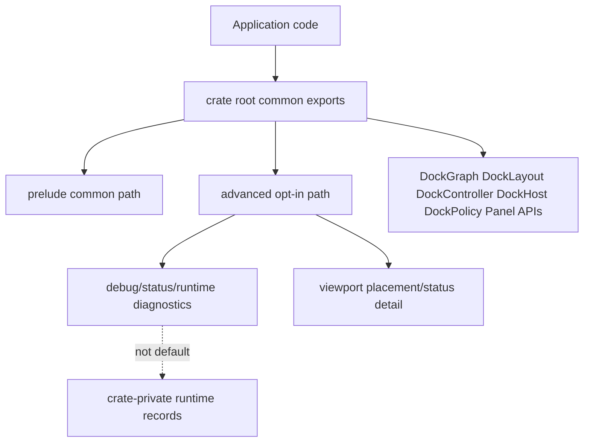
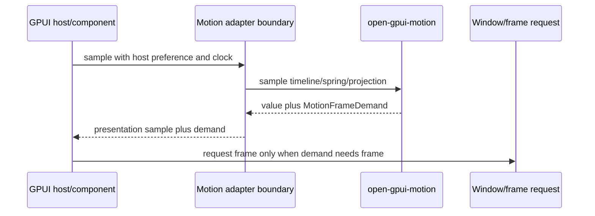
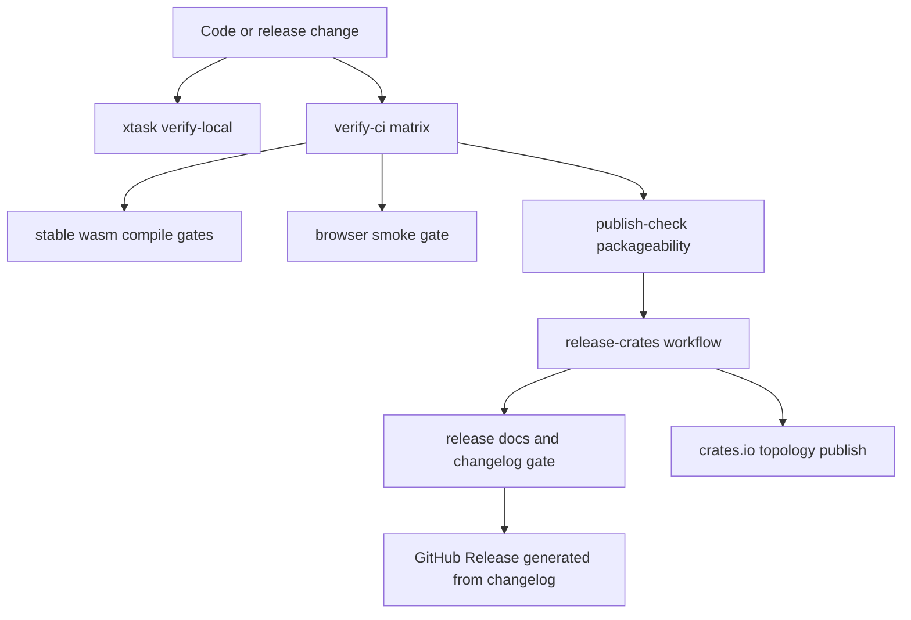

# Post-v0.2.0 Stabilization - Plan

## Goal Capsule

| Field | Decision |
|---|---|
| Objective | Stabilize Open GPUI after v0.2.0 by narrowing public API surfaces, deepening the virtualized list component, converging motion frame ownership, adding real web browser smoke proof, turning release/docs/dependency checks into machine gates, and keeping engineering memory aligned with current reality. |
| Authority | User-approved scope from the post-v0.2.0 architecture review, read-only subagent findings for components, motion, docking/web, and release engineering, plus codebase evidence observed from `main` at `495d6bc` before this plan was written. |
| Release state | v0.2.0 has already been published; this plan targets the next pre-1.0 breaking stabilization release. Compatibility shims are not required, but every public API break needs inventory, replacement-path guidance, and release-note coverage. |
| Execution profile | Fearless pre-1.0 refactor. Breaking APIs, deleting misleading public exports, and replacing weak internal seams are allowed when they reduce future migration cost. |
| Product boundary | Open GPUI should feel like a reusable native/web UI framework foundation, not a collection of demos. Motion remains a renderer-neutral layout-like motion foundation, docking remains capability-gated, and component state remains key-first and contract-tested. |
| Stop conditions | Stop and re-plan if implementation requires a global animation scheduler, public GSAP/Framer compatibility, optimistic web multi-window support, a full Table/Tree rewrite, a replacement release system that discards the existing publish order logic, or a stable 1.0 API promise. |
| Tail ownership | `ce-work` owns implementation, focused verification, code review, logical commits, and push to `main` when gates pass or when the user explicitly accepts a partial landing. |

---

## Product Contract

### Summary

Open GPUI has working foundations for components, motion, docking, web compile gates, and crates.io publishing, but the next risk is accidental API cementing after v0.2.0. This plan intentionally breaks and deletes pre-1.0 leftovers while downstream blast radius is still small, and it treats each public break as release-facing work that needs inventory and migration notes. The work prioritizes public-surface honesty, deeper module boundaries, real browser proof, and release automation over adding new feature families.

### Problem Frame

The post-v0.2.0 repo is functionally ahead of its public contract. `open-gpui-docking` has a capable retained layout/runtime model, but its crate root exposes diagnostic and runtime internals. `VirtualizedList` has moved beyond label rendering, but its implementation is still a large mixed-responsibility module. `open-gpui-motion` has the right neutral primitives, but first-party consumers still vary in how they own time, reduced motion, and frame demand. CI and publishing are credible, but release notes, docs drift, MSRV, and browser behavior proof still depend on human memory.

### Requirements

- R1. Docking public exports must separate common application APIs from advanced or internal diagnostics so pre-1.0 internals do not look stable.
- R2. Docking capability gates must remain fail-closed for web and unsupported platform backends; no new cargo feature should imply platform viewport availability without runtime backend facts.
- R3. `VirtualizedList` must be split into model, descriptor, render-plan, runtime, render, style, and motion responsibilities without changing its key-first semantic contract.
- R4. `VirtualizedList` public API must treat stable keys as semantic identity and keep index values as diagnostics or render-position facts.
- R5. `VirtualizedList` must gain the minimum product-grade list contracts needed for stabilization: explicit async/infinite status semantics, prepend/reveal anchoring around stable keys, sticky section overlay proof, and theme-backed styling.
- R6. First-party motion consumers must use a shared adapter-facing frame-demand protocol, with reduced-motion preference injected from host/component policy rather than hardcoded at leaf render sites.
- R7. `open-gpui-motion` must not expand into a public full animation engine until first-party consumers prove presence, keyframes, repeat/reverse, and value subscriptions.
- R8. Web verification must prove at least one real browser path for canvas initialization, focus/input delivery, and single-window docking or equivalent shell behavior, in addition to wasm compile gates.
- R9. Release automation must create or update GitHub Release notes from `CHANGELOG.md` and must fail when changelog, tag, workspace version, README versions, or publish metadata drift.
- R10. Docs checks must catch relative-link breakage, stale user-facing version snippets, and missing README coverage for public crates.
- R11. Dependency health must be explicit through MSRV declaration, advisory checks, and duplicate dependency allowlisting.
- R12. User entry points must include minimal examples and crate READMEs that describe supported behavior and non-goals without depending on historical plans.
- R13. Engineering memory must stop misleading future agents with stale branch state or release-flow instructions that have been superseded by ADRs, READMEs, changelog, or workflows.
- R14. Every moved, hidden, or deleted public export must appear in a breaking-change inventory with old path, new path or no-replacement reason, changelog/release-note text, and README or example updates where users would otherwise hit the break.

### Scope Boundaries

#### In Scope

- Breaking public exports in `open-gpui-docking` and `open-gpui-ui-components` when they expose implementation details as default API.
- Building the breaking-change inventory and release-note coverage required by those public export changes.
- Reorganizing `VirtualizedList` internals and tests while preserving the existing user-facing key-based behavior unless the public shape is misleading.
- Converging motion frame demand, UI frame clock sampling, and reduced-motion policy across docking, Splitter, and VirtualizedList.
- Adding a lightweight browser smoke harness for stable web behavior proof.
- Extending `xtask` and workflows for release notes, docs drift, MSRV, dependency health, and verification profiles.
- Updating public crate READMEs, user examples, and engineering memory to match current reality.

#### Deferred to Follow-Up Work

- A full public presence/enter-exit API for motion.
- Keyframes, repeat/reverse/speed controls, public value subscriptions, or a global animation scheduler.
- Browser platform viewport windows or popout docking.
- Full Table and Tree rewrites on top of the split virtualized list modules.
- Pixel-perfect browser visual testing across all gallery components.
- Replacing the custom crates publish workflow with `cargo-release` or `release-plz`.

#### Outside This Product Identity

- Treating Open GPUI motion as a DOM/WAAPI/GSAP compatibility layer.
- Letting animation mutate semantic selection, focus order, hit testing, accessibility roles, or durable layout state.
- Advertising platform-window docking as available on unsupported web or Wayland paths.
- Keeping pre-1.0 compatibility exports that hide ownership boundaries.

---

## Planning Contract

### Key Technical Decisions

- KTD1. API narrowing comes before feature expansion. `open-gpui-docking` and `open-gpui-ui-components` should expose fewer default types before new users build against diagnostic internals.
- KTD2. `prelude` and `advanced` are the public API tiers, but `advanced` is not a dumping ground for internals. The default for diagnostics, runtime records, and low-level transition types is crate-private; a type enters `advanced` only when it has a concrete external debugging use case, README/API-inventory coverage, a stability/non-stability statement, and public-surface tests.
- KTD3. `VirtualizedList` stays key-first. Any index-based constructor, navigation helper, or scroll helper that leaks into the default public surface must become diagnostic, internal, or narrowly namespaced.
- KTD4. `MotionFrameDemand` is the shared frame contract. Adapters request GPUI frames after observing demand; low-level motion samplers do not own platform scheduling.
- KTD5. Reduced motion is a host/component policy input. Hardcoded `Animated` defaults in render or transition paths are bugs unless the call site is a test or an explicit preview-only fixture.
- KTD6. Web browser proof starts narrow and separates required assertions from optional backend capability assertions. App readiness, DOM/canvas initialization, focus/input delivery, and a single-window docking or shell interaction must pass; WebGPU-specific and platform-window tear-off assertions may report explicit unsupported capability without hiding required-path failures.
- KTD7. Release automation extends the current workflow. The existing topology-aware crates publish logic stays; this plan adds release-note generation and release-doc gates around it.
- KTD8. Docs checks have strict and advisory zones. Public README, crate metadata, changelog, workflows, and verification docs should be strict; historical plans and engineering logs should be link-checked only after they are indexed or archived.
- KTD9. MSRV follows the dependency floor and must be falsifiable. Local registry evidence shows `wgpu 30.0.0` declares `rust-version = "1.87.0"` and related `wgpu-core`, `wgpu-types`, and `naga` crates declare `1.87`, so Rust 1.87.0 is the candidate floor; implementation must revalidate the full dependency chain before declaring it.
- KTD10. Engineering memory is not a release artifact. Current state docs should summarize live facts and next actions; historical detail belongs in ADRs, plans, changelog, or archived progress notes.

### High-Level Technical Design

The public API topology keeps normal application code short while making advanced ownership explicit. Implementation should delete or hide exports that do not pass the normal application use test.

Motion owns deterministic samples and frame demand. Hosts own semantic state, reduced-motion source, and concrete frame requests.

The release path should fail before publishing if user-facing documentation or verification evidence is stale.

### Assumptions

- The user has explicitly approved a broad fearless refactor, including breaking APIs, deleting misleading code, using subagents, making commits, and pushing when gates pass.
- Previous read-only subagent findings are accepted as local planning research for components, motion, docking/web, and release engineering.
- The plan was authored from `main` at `495d6bc`; execution should begin from a synchronized `main` and treat the plan commit itself as part of the working baseline.
- Browser smoke may require adding a stable runner dependency or reusing `trunk`; the implementer should choose the smallest reliable path during execution.
- Historical docs may contain stale links. The strict docs gate should start with public/user-facing docs and expand after the knowledge base is cleaned.

### Minimum Shippable Slice

The full target is U1 through U8. If a late gate blocks and the user explicitly accepts a partial landing, the smallest acceptable stabilization slice is U1, U2, U3, U5, U6, U7, and the public-doc portion of U8. U4 may only partially defer product behavior when the split `VirtualizedList` modules remain contract-tested and the deferred behavior is documented as not shipped; no partial U4 landing may leave ambiguous async status, sticky overlay, or accessibility semantics in public API. Engineering-memory cleanup blocks completion only for current-state entries that would mislead future agents about the active branch, release flow, or verification gates; broad archival of old logs and plans can defer after public docs and examples are correct.

### Sequencing

The implementation should land in dependency order. API tiering, motion frame convergence, and VirtualizedList splitting are independent enough to be worked by separate agents after the plan is read, but integration must serialize commits around shared public API inventory and verification docs. Release/docs machine gates can begin in parallel with code refactors, but the final docs pass should happen after public surfaces settle.

---

## Implementation Units

### U1. Narrow Docking Public API

- **Goal:** Move `open-gpui-docking` from a broad crate-root export set to a tiered public surface that distinguishes normal app APIs from advanced diagnostics and runtime internals.
- **Requirements:** R1, R2, R12, R14.
- **Dependencies:** None.
- **Files:** `crates/gpui_docking/src/lib.rs`, `crates/gpui_docking/src/prelude.rs`, `crates/gpui_docking/src/advanced.rs`, `crates/gpui_docking/src/debug.rs`, `crates/gpui_docking/src/viewport_runtime_status.rs`, `crates/gpui_docking/src/viewport_placement.rs`, `crates/gpui_docking/src/transition_executor.rs`, `crates/gpui_docking/src/transition_geometry.rs`, `crates/gpui_docking/README.md`, `crates/gpui_docking/src/public_surface_tests.rs`.
- **Approach:** Keep common exports such as graph, layout, controller, host, policy, panel registry/catalog, workspace, and viewport runtime handle discoverable. Move debug summaries, low-level transition states, runtime records, and placement validation details to `advanced` only when they pass the admission rule from KTD2; otherwise make them crate-private. Update README examples to import from the new common path. Preserve capability gate semantics while removing any public type that lets callers bypass runtime handles. Emit a breaking-change inventory for every export that moves, disappears, or changes import path.
- **Execution note:** Start with public-surface characterization tests that compile representative common imports and reject known diagnostic exports from the default path.
- **Patterns to follow:** `crates/ui_components/src/public_api/default.rs` for curated public surface discipline; `crates/gpui_docking/README.md` for current user story; `docs/adr/0012-docking-runtime-capability-alignment.md` for fail-closed capability language.
- **Test scenarios:** Common application imports compile through crate root or prelude; advanced diagnostics require an explicit advanced import and are covered by an advanced export inventory; private diagnostics are absent from root, prelude, and advanced; platform viewport open paths still require both app policy and backend capability; web/unsupported capability facts still return unsupported status instead of constructing partial runtime state; README minimal shape still compiles after import updates; breaking-change inventory names old path, new path or no replacement, and release-note text for each public break.
- **Verification:** Public-surface tests prove the tier split, docking tests prove capability behavior remains fail-closed, and docs build without exposing private diagnostics as common API.

### U2. Converge Motion Frame Ownership

- **Goal:** Make first-party motion consumers use one adapter-facing frame-demand and reduced-motion ownership protocol.
- **Requirements:** R6, R7.
- **Dependencies:** None.
- **Files:** `crates/motion/src/frame_host.rs`, `crates/motion/src/controller.rs`, `crates/motion/src/policy.rs`, `crates/motion/tests/public_contracts.rs`, `crates/ui_components/src/splitter.rs`, `crates/ui_components/src/virtualized_list/mod.rs`, `crates/gpui_docking/src/transition_executor.rs`, `crates/gpui_docking/src/presentation_commands.rs`, `crates/gpui_docking/src/render.rs`, `crates/gpui_docking/src/host_transition_tests.rs`, `crates/ui_components/tests/layout.rs`, `docs/adr/0018-open-gpui-motion-crate-boundary.md`, `crates/motion/README.md`.
- **Approach:** Remove duplicate demand fields such as boolean `needs_frame` when the sample already carries `MotionFrameDemand`. Add explicit epoch/reset guidance to `MotionFrameHost` when a consumer retargets, cancels, finishes, prunes terminal state, or changes motion identity. Route Splitter and docking through adapter-owned frame requests and inject reduced-motion preference from host/component state before constructing specs.
- **Execution note:** Treat this as behavior-bearing infrastructure. Add or strengthen tests before changing call chains so stale frame demand and reduced-motion behavior are observable.
- **Patterns to follow:** `MotionFrameHost::observe` and `MotionFrameHost::sample_elapsed` in `crates/motion/src/frame_host.rs`; `VirtualizedList` active-indicator frame demand; docking transition tests that already assert frame demand.
- **Test scenarios:** Active timeline and spring samples request frames until terminal; reduced-motion samples publish final state without frame demand; retargeting starts from sampled geometry without stale elapsed time; cancellation freezes sampled presentation without reaching semantic final state; Splitter pointer drag stays immediate and does not schedule programmatic animation; docking visual affordance render paths do not hardcode `Animated` when host preference is reduced.
- **Verification:** Motion tests prove frame host semantics, Splitter tests prove adapter demand mapping, and docking transition/accessibility tests prove reduced-motion and retarget behavior.

### U3. Split VirtualizedList Into Deep Modules

- **Goal:** Break the 4000+ line `VirtualizedList` module into responsibility-focused modules while preserving key-first behavior.
- **Requirements:** R3, R4.
- **Dependencies:** None.
- **Files:** `crates/ui_components/src/virtualized_list/mod.rs`, `crates/ui_components/src/virtualized_list/descriptor.rs`, `crates/ui_components/src/virtualized_list/model.rs`, `crates/ui_components/src/virtualized_list/render_plan.rs`, `crates/ui_components/src/virtualized_list/runtime.rs`, `crates/ui_components/src/virtualized_list/render.rs`, `crates/ui_components/src/virtualized_list/style.rs`, `crates/ui_components/src/virtualized_list/motion.rs`, `crates/ui_components/src/public_api/default.rs`, `crates/ui_components/src/component_contract/api_inventory.rs`, `crates/ui_components/tests/layout.rs`, `crates/ui_components/tests/public_surface/exports.rs`.
- **Approach:** Move row descriptors, key selection, navigation/typeahead/range resolution, virtualized render plans, GPUI runtime input handling, style recipes, and active-indicator motion into separate modules. Keep `mod.rs` as the public facade and re-export only user-facing types. Remove or narrow default exports for low-level navigation and scroll helper functions unless they are intentionally part of the component API.
- **Execution note:** This is a structural refactor with behavioral risk. Use existing tests as characterization first, then move code with small compileable steps.
- **Patterns to follow:** `crates/ui_components/src/combobox/`, `crates/ui_components/src/menu/`, and `crates/ui_components/src/tree/` for descriptor/model/render-plan/runtime split; `crates/ui_components/tests/public_surface/` for export inventory checks.
- **Test scenarios:** Existing key-based activation, typeahead, range selection, measured rows, sticky section metadata, and custom row rendering still pass after the split; default public API no longer exposes internal navigation helpers; module-private helpers remain available to Table/Tree only through deliberate crate-local paths; docs and inventory reflect the new public surface.
- **Verification:** Component layout, public-surface, UI contract, and gallery virtualized-list tests pass with no behavior regression.

### U4. Productize VirtualizedList Data And Styling

- **Goal:** Add the next production-grade list behaviors without making VirtualizedList a new table engine.
- **Requirements:** R5.
- **Dependencies:** U3.
- **Files:** `crates/ui_core/src/virtualizer.rs`, `crates/ui_core/src/grid_viewport.rs`, `crates/ui_components/src/virtualized_list/model.rs`, `crates/ui_components/src/virtualized_list/render_plan.rs`, `crates/ui_components/src/virtualized_list/runtime.rs`, `crates/ui_components/src/virtualized_list/render.rs`, `crates/ui_components/src/virtualized_list/style.rs`, `crates/ui_components/src/theme/recipes.rs`, `crates/ui_components/src/theme/schema.rs`, `docs/schemas/open-gpui-theme-v1.schema.json`, `examples/ui-foundation-gallery/src/pages/components/samples.rs`, `crates/ui_components/tests/layout.rs`, `crates/ui_components/tests/a11y.rs`, `examples/ui-foundation-gallery/tests/foundation_gallery.rs`.
- **Approach:** Add explicit async/infinite status rows and prepend/reveal anchoring around stable keys. The async status contract must distinguish initial loading, empty, append loading, prepend loading, exhausted/end-of-list, error, and retry states. Status rows are outside roving selection and do not become selectable options; a retry action may be exposed only as an explicit command with clear focus and accessibility semantics, not as an accidental list item. Preserve active and selected keys across prepends and reveal operations. Render sticky section overlay as a presentation-only layer for this release: it is pointer/focus inert, contains no interactive content, maps no duplicate listbox option role, and leaves the underlying section row as the semantic owner even when the source row is offscreen. Move hardcoded list colors and measurements into theme recipes and schema-covered tokens. Preserve fixed-row fast paths and avoid absorbing Table-specific column behavior.
- **Execution note:** Prove behavior through model and runtime tests before gallery smoke; sticky overlay should be tested for hit testing and accessibility before visual polish.
- **Patterns to follow:** Existing `VirtualizedListBehaviorSnapshot::sticky_section`, Table virtualizer gates in `crates/ui_components/tests/table/`, and theme drift/schema scans.
- **Test scenarios:** Initial loading, empty, append loading, prepend loading, exhausted/end-of-list, error, and retry states have deterministic render and accessibility behavior; loading, error, and terminal status rows do not become selectable or participate in roving focus; prepending measured rows preserves active/selected key reveal; sticky overlay tracks the current section while the underlying section row remains structural; sticky overlay is pointer/focus inert and does not duplicate listbox option roles or announcements; custom row renderer still owns inner content while the outer row owns focus/selection; theme scan catches any new token drift.
- **Verification:** UI core virtualizer tests, component layout/a11y tests, theme schema/drift scans, and gallery component smoke prove the new behavior.

### U5. Add Web Browser Smoke Proof

- **Goal:** Upgrade web verification from compile-only wasm gates to a real browser smoke for stable single-window behavior.
- **Requirements:** R2, R8.
- **Dependencies:** U1 when docking smoke imports the narrowed API.
- **Files:** `.github/workflows/verify.yml`, `xtask/src/commands.rs`, `xtask/src/web_smoke.rs`, `crates/gpui_web/examples/hello_web/Cargo.toml`, `crates/gpui_web/examples/hello_web/main.rs`, `crates/gpui_web/examples/hello_web/trunk.toml`, `crates/gpui_web/examples/docking_web/Cargo.toml`, `crates/gpui_web/examples/docking_web/main.rs`, `crates/gpui_web/examples/docking_web/trunk.toml`, `docs/verification.md`.
- **Approach:** Keep the existing stable wasm checks. Add the smallest reliable browser smoke entry to `xtask` that builds and serves a web example, opens it in a headless browser, and verifies required-path readiness: app ready signal, DOM/canvas initialization, focus/input delivery, and a single-window docking or shell interaction. WebGPU-specific and platform viewport tear-off assertions are separate optional capability checks; they may report explicit unsupported capability on CI, but they must not turn a failed required-path assertion into a passing smoke.
- **Execution note:** This is mostly integration and CI work; prefer a runtime smoke proof over broad unit coverage.
- **Patterns to follow:** Existing `hello_web` example, stable wasm checks in `.github/workflows/verify.yml`, and `xtask` command shape in `xtask/src/commands.rs`.
- **Test scenarios:** Browser smoke reports ready state for the hello example; DOM/canvas initialization succeeds; keyboard input reaches the app; one single-window docking or shell interaction succeeds in the browser; platform viewport tear-off is unavailable on web through runtime capability facts; CI skips or marks only WebGPU-specific or platform-window assertions as unsupported without hiding app startup, canvas, focus/input, or single-window interaction failures.
- **Verification:** Linux CI runs wasm compile gates and the new browser smoke; local `xtask` exposes the same smoke command; docs state the stable browser proof and the optional shared-memory/nightly path separately.

### U6. Automate Release Notes And Docs Drift Gates

- **Goal:** Make release notes, changelog shape, README versions, crate README coverage, and docs links machine-checked before publish.
- **Requirements:** R9, R10, R12, R14.
- **Dependencies:** None.
- **Files:** `.github/workflows/release-crates.yml`, `.github/workflows/publish-check.yml`, `xtask/src/commands.rs`, `xtask/src/doc_links.rs`, `xtask/src/release_docs.rs`, `CHANGELOG.md`, `README.md`, `crates/gpui/README.md`, `crates/gpui_web/README.md`, `crates/gpui_platform/README.md`, `docs/verification.md`, `xtask/tests/release_docs.rs`.
- **Approach:** Add release-doc checks that extract the matching `CHANGELOG.md` section, reject manual hard wraps in release-note paragraphs, reject missing or stale user-facing version snippets, verify public crates package the intended README, validate the breaking-change inventory against moved/deleted exports, and check strict relative links for user-facing docs. Extend the release workflow with `contents: write` and a post-publish GitHub Release create/update step using the changelog section.
- **Execution note:** Start with tests around the parser/checker because release-note formatting regressions are easy to miss manually.
- **Patterns to follow:** Existing Python publish-order logic in `release-crates.yml`, `xtask` scanners for import boundary and UI contract, and the user-facing changelog style used for v0.2.0.
- **Test scenarios:** A changelog version section is extracted without unrelated versions; missing changelog section fails; stale `0.1.0` snippets fail when workspace version is `0.2.0`; a public crate without a packaged README fails; a moved/deleted export without old path, new path or no-replacement reason, and release-note text fails; broken strict relative links fail; historical docs can be advisory or excluded until archived; release workflow dry-run does not require a crates.io token but still validates release-note generation.
- **Verification:** `xtask` tests cover parser and drift checks, `actionlint` accepts workflow changes, publish-check still packages crates, and release dry-run validates the new gates.

### U7. Declare MSRV And Dependency Health Policy

- **Goal:** Make dependency upgrades and Rust version expectations explicit after the `wgpu 30` upgrade.
- **Requirements:** R11.
- **Dependencies:** U6 when docs checks reference the MSRV.
- **Files:** `Cargo.toml`, `crates/*/Cargo.toml`, `.github/workflows/verify.yml`, `.github/workflows/dependency-health.yml`, `.cargo/audit.toml`, `docs/verification.md`, `xtask/src/dependency_health.rs`, `xtask/src/commands.rs`.
- **Approach:** Run an MSRV preflight before editing manifests: inspect workspace and published crate `rust-version` values, dependency-chain `rust-version` values, and the minimum toolchain result through `cargo-msrv` or a minimal toolchain matrix. Use Rust 1.87.0 as the candidate because local `wgpu 30.0.0` metadata declares it, then raise the candidate only if the full dependency chain requires more. Declare `rust-version` at the workspace package level if cargo metadata and packaging support it for the workspace layout; otherwise apply the same version to published crates. Add a dependency-health gate that runs advisory checks and duplicate dependency reporting with an explicit allowlist. Keep current audit ignores documented and time-boxed to upstream releases where possible.
- **Execution note:** Prefer an advisory gate that fails actionable vulnerabilities but reports known warning-class dependency constraints separately.
- **Patterns to follow:** Existing advisory notes in `docs/verification.md`, `.cargo/audit.toml`, and `publish-check.yml` packageability constraints.
- **Test scenarios:** MSRV preflight records dependency-chain evidence and the chosen Rust version; cargo metadata exposes the declared Rust version for published crates; dependency-health command fails on unexpected duplicate major versions; known allowed duplicates or ignored advisories are documented; CI can install required audit tooling or fail with a clear setup failure rather than silently passing.
- **Verification:** Metadata, audit, duplicate tree, packageability, and workflow validation prove the dependency policy.

### U8. Update User Entry Points And Engineering Memory

- **Goal:** Make public docs and examples match the post-refactor API, and reduce stale engineering-memory noise.
- **Requirements:** R10, R12, R13, R14.
- **Dependencies:** U1, U3, U5, U6, U7.
- **Files:** `README.md`, `crates/gpui/README.md`, `crates/ui_components/README.md`, `crates/motion/README.md`, `crates/gpui_docking/README.md`, `crates/gpui_web/README.md`, `crates/gpui_platform/README.md`, `examples/docking-minimal/Cargo.toml`, `examples/docking-minimal/src/main.rs`, `docs/verification.md`, `docs/knowledge/engineering/current-state.md`, `docs/knowledge/engineering/index.md`.
- **Approach:** Add a minimal docking example that uses only common public APIs. Fix stale version snippets and make each public README state when to use the crate, what it owns, what it does not own, and which focused verification commands matter. Add user-facing breaking-change notes where public import paths move. Slim `current-state.md` into current facts and next actions, moving historical progress references behind an index rather than leaving stale branch names at the top; broad archival of historical plans and logs is follow-up unless stale text would mislead current execution.
- **Execution note:** This unit should run after API and verification units so docs do not churn twice.
- **Patterns to follow:** Existing crate-local READMEs for motion, components, docking, and the root README install section.
- **Test scenarios:** README examples compile or are covered by package/doc checks; `docking-minimal` builds without advanced imports; docs link checks pass in strict public-doc mode; current-state no longer names stale branches as active state; docs still preserve ADR and plan evidence links.
- **Verification:** Package/list/doc checks, docs drift scans, minimal example build, and final workspace verification pass.

---

## Verification Contract

| Gate | Applies to | Done signal |
|---|---|---|
| `cargo fmt --all --check` | All units | Formatting matches workspace style. |
| `cargo check --workspace --locked` | All units | Workspace compiles on the host after API and docs changes. |
| `cargo nextest run -p open-gpui-motion --no-fail-fast --locked` | U2 | Motion frame host, policy, reduced-motion, retarget, and controller tests pass. |
| `cargo nextest run -p open-gpui-ui-components --no-fail-fast --locked` | U2, U3, U4 | Component behavior, public surface, a11y, layout, and VirtualizedList tests pass. |
| `cargo nextest run -p open-gpui-ui-foundation-gallery --no-fail-fast --locked` | U4, U8 | Gallery smoke and component contract tests pass. |
| `cargo check -p open-gpui-docking --tests --locked` | U1, U2 | Docking public API and transition changes compile with tests. |
| `cargo nextest run -p open-gpui-docking host_transition_tests host_viewport_platform_capability_tests host_viewport_lifecycle_tests host_viewport_close_tests --no-fail-fast --locked` | U1, U2 | Docking motion, capability gates, lifecycle, and close behavior remain correct. |
| `cargo check -p open-gpui-web --target wasm32-unknown-unknown --tests --locked -j 1` | U5 | Stable wasm test surface compiles. |
| `cargo check -p open-gpui-web --target wasm32-unknown-unknown --locked -j 1` | U5 | Stable wasm lib/example surface compiles. |
| `cargo run -p xtask -- web-smoke` | U5 | Browser smoke proves app readiness, DOM/canvas initialization, focus/input delivery, and one single-window docking or shell interaction; only WebGPU-specific or platform-window subchecks may report explicit unsupported capability. |
| `cargo run -p xtask -- scan-ui-contract` | U1, U3, U4 | Public API inventory and component contracts match code. |
| `cargo run -p xtask -- scan-theme-drift` and `cargo run -p xtask -- scan-theme-schema` | U4 | Theme recipes and schema are synchronized. |
| `cargo run -p xtask -- scan-doc-links` and `cargo run -p xtask -- verify-release-docs` | U6, U8 | Public docs links, release note extraction, README versions, packaged README coverage, and breaking-change inventory checks pass. |
| `cargo run -p xtask -- dependency-health` | U7 | MSRV, advisories, and duplicate dependency policy pass or report only documented allowlist entries. |
| `actionlint .github/workflows/verify.yml .github/workflows/publish-check.yml .github/workflows/release-crates.yml .github/workflows/dependency-health.yml` | U5, U6, U7 | Workflow syntax and expressions are valid. |
| `cargo run -p xtask -- verify` | Final | Local default quality gate passes after all focused gates. |

Platform-specific checks remain owned by CI where the local host cannot prove them. Windows and Linux platform gates in `.github/workflows/verify.yml` must remain active, and web browser smoke must be either stable on Linux CI or explicitly separated into a required/allowed-to-skip path with a clear unsupported-capability result.

---

## Definition of Done

- Public docking and component exports are intentionally tiered, with common APIs documented and internals hidden or explicitly advanced.
- Breaking public API changes have an inventory with old paths, replacement paths or no-replacement reasons, changelog/release-note coverage, and README/example updates.
- VirtualizedList is split into deep modules and its public contract remains key-first, selection-safe, and accessibility-safe.
- VirtualizedList has theme-backed styling, async/infinite status handling, prepend/reveal anchoring, and sticky section overlay proof without becoming a Table replacement.
- Motion frame demand and reduced-motion ownership are consistent across motion, Splitter, docking, and VirtualizedList.
- Web has at least one real browser smoke gate in addition to wasm compile gates.
- Release workflow can publish crates and create/update GitHub Release notes from the changelog, with docs drift checks blocking bad releases.
- MSRV and dependency-health policy are documented and enforced by local or CI gates.
- Public READMEs, examples, `docs/verification.md`, and release-critical engineering current-state docs match the new API and workflow.
- All abandoned experimental code from failed implementation approaches is removed before final commit.
- Focused gates for changed areas pass, final local verification is attempted, and any platform-only residual risk is explicitly assigned to CI.

---

## Appendix

### Sources And Research

- `docs/adr/0008-open-gpui-ui-component-productization-roadmap.md`
- `docs/adr/0009-open-gpui-table-and-virtualizer-product-shape.md`
- `docs/adr/0012-docking-runtime-capability-alignment.md`
- `docs/adr/0015-ui-motion-runtime-foundation.md`
- `docs/adr/0018-open-gpui-motion-crate-boundary.md`
- `docs/plans/2026-07-07-001-refactor-motion-component-docking-v020-convergence-plan.md`
- `docs/verification.md`
- `crates/ui_components/README.md`
- `crates/motion/README.md`
- `crates/gpui_docking/README.md`
- Read-only component, motion, docking/web, and release-engineering subagent findings from the 2026-07-07 planning session.

### Research Evidence Trace

| Source | Evidence form | Main conclusions used | Supports |
|---|---|---|---|
| Component and motion read-only findings | Conversation-local subagent report; execution should revalidate before code changes. | `VirtualizedList` is capable but too large; key-first identity should remain; motion frame demand exists but consumer ownership is uneven. | R3, R4, R5, R6, KTD3, KTD4, U2, U3, U4 |
| Docking and web read-only findings | Conversation-local subagent report; execution should revalidate before code changes. | Docking capability gates are directionally correct; the crate root exposes too much; web needs browser smoke rather than another cargo feature gate. | R1, R2, R8, KTD1, KTD2, KTD6, U1, U5 |
| Release-engineering read-only findings | Conversation-local subagent report; execution should revalidate before workflow changes. | Publishing order is already custom and valuable; missing pieces are GitHub Release notes, docs drift gates, MSRV, dependency health, and browser proof. | R9, R10, R11, R12, R14, KTD7, KTD8, KTD9, U6, U7, U8 |
| Local dependency metadata | Local cargo registry after the `wgpu 30` upgrade. | `wgpu 30.0.0` declares Rust 1.87.0 and related `wgpu-core`, `wgpu-types`, and `naga` crates declare Rust 1.87. | R11, KTD9, U7 |
| Headless plan review | Five read-only reviewers returned; feasibility review was interrupted after repeated timeouts. | Strengthened breaking-change migration, `advanced` admission, U4 UX/a11y state contracts, web-smoke pass criteria, MSRV preflight, partial-landing rules, and actionlint coverage. | R5, R8, R11, R13, R14, KTD2, KTD6, KTD9, U1, U4, U5, U6, U7, U8 |
