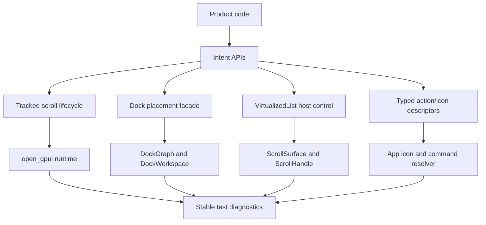
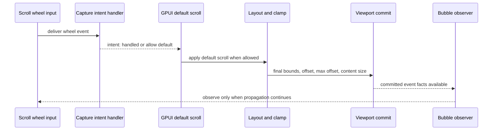
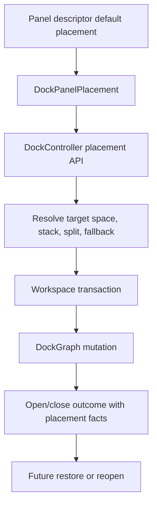

# Product Correctness Primitives - Plan

## Goal Capsule

| Field | Value |
|---|---|
| Objective | Promote the app-side fixes exposed by real Open GPUI product work into framework-level correctness primitives for scroll lifecycle, input intent, docking placement, list host control, action/icon projection, and diagnostics. |
| Authority | User request and Wenli framework experience review shape the product risks; current Open GPUI READMEs, plans, code, and verification docs shape implementation boundaries. |
| Execution profile | Fearless pre-1.0 refactor: breaking changes and code deletion are allowed when they remove misleading APIs or app-side wrapper requirements. |
| Stop conditions | Stop and re-plan if a requirement needs a new renderer backend, a separate headless UI crate, a hosted registry, or a P2 performance telemetry program to be correct. |
| Tail ownership | Implementation owns code, tests, docs, release inventory, and final verification; this plan does not implement code. |

---

## Product Contract

### Summary

This plan turns Open GPUI's existing low-level ingredients into product-correctness primitives: committed scroll viewport lifecycle, typed scroll/input intent, product-level docking placement, host-controlled virtualized list scrolling, typed action/icon descriptors, and stable diagnostic probes. It keeps P2 performance and rendering observability as follow-up work so the next refactor lands a coherent P0/P1 correctness layer instead of a broad telemetry program.

### Problem Frame

Open GPUI already has strong foundations after the v0.2.0 stabilization work. `ScrollViewportChangedEvent` commits final scroll facts after layout; `VirtualizedList` is key-first and split by responsibility; `open-gpui-docking` has a retained graph, controller, panel registry, and capability-gated viewport runtime; `open_gpui_command::CommandDescriptor` carries command metadata and disabled reasons; the component contract and release inventory give public surface checks.

The remaining risk is that application authors still need to know too much about implementation mechanics to build correct products. A scroll consumer must infer whether `Layout`, `Wheel`, or `Programmatic` is precise enough. A custom wheel handler still mutates `window.prevent_default()` and `cx.stop_propagation()` instead of returning a typed handling intent. Docking callers still think in graph nodes and tab targets when product code wants "open this panel in the right rail" or "restore where this item belonged before close". VirtualizedList has internal scroll-surface helpers but no public external `ScrollHandle` ownership path. Button, toolbar, menu, and command surfaces share labels and disabled reasons, but icons remain string glyphs instead of typed action metadata that an app can resolve consistently.

The framework move is to make the correct product path shorter than the app-side workaround path. Low-level escape hatches may remain when they have a concrete diagnostic or advanced use, but default APIs should carry intent, lifecycle, and testable facts.

### Requirements

**Scroll Lifecycle And Input Intent**

- R1. Tracked scroll surfaces must emit committed viewport events after final layout and clamping, with stable bounds, offset, max offset, content size, generation, and a source taxonomy specific enough for product tests.
- R2. `ScrollViewportChangeSource` must distinguish initial mount/layout, resize, content-size change, wheel/default scroll, scrollbar drag when supported, keyboard scroll, touch/inertia when supported, and named programmatic reveal or offset requests when those facts are knowable.
- R3. Programmatic scroll APIs must provide a way to mark the request reason and schedule a committed viewport notification without forcing callers to synthesize wheel events or inspect private state.
- R4. Ordinary `overflow_scroll` usage must remain simple; the richer lifecycle contract applies when the caller opts into tracked viewport behavior or a component exposes it.
- R5. Scroll-wheel capture and bubble handlers must have an intent-returning API for handled, allow default scroll, continue propagation, and focus-on-wheel behavior.
- R6. The default scroll pipeline must consume wheel input in a deterministic order: capture intent, default scroll, committed viewport event, then bubble observation when not stopped.
- R7. Legacy imperative mutation through `prevent_default` and `stop_propagation` must either move to an explicit raw/advanced path or be documented as compatibility-only if the implementation keeps it during migration.

**Docking Product Placement**

- R8. Docking must expose product-level placement descriptors for common app layout intent: center stack, left/right/bottom rails, split fractions, tab stack membership, selected item, and fallback placement.
- R9. The controller and builder APIs must support named default layouts and item restore/open operations by product placement without requiring callers to hold `DockNodeId` tab targets.
- R10. Closing, vetoing, reopening, and restoring panels must preserve descriptor-level lifecycle facts, including the last product placement when it can be known.
- R11. The retained docking graph remains the runtime layout engine and persistence format; it must not become the product source of truth for default placement policy.

**VirtualizedList Host Control**

- R12. `VirtualizedList` must expose host-owned scroll control comparable to `ScrollArea::scroll_handle`, while preserving the existing keyed runtime and behavior snapshot contracts.
- R13. Public reveal APIs must support nearest, top, center, and bottom alignment by stable key and must report absent, disabled, filtered, duplicate, or offscreen states deterministically.
- R14. Custom row rendering must keep the outer row in charge of layout, measurement feedback, roles, focus, hit testing, selection, activation, and nested action containment.

**Action, Icon, And Command Projection**

- R15. Shared command/action metadata must carry typed icon descriptors and resolver intent rather than string glyphs at each component call site.
- R16. Button, IconButton, Toolbar, Menu, ContextMenu, Command, Sidebar, and gallery action surfaces must consume the same resolved action state for label, icon, shortcut, disabled reason, tooltip, and accessibility description.
- R17. Apps must remain the authority for command execution, icon asset resolution, keybinding policy, and command availability; UI components render resolved facts and return user intent.

**Diagnostics, Verification, And Release Surface**

- R18. Tests must be able to inspect final scroll viewport facts, default-input consumption, focus owner, and frame/event diagnostics without depending on private render plans.
- R19. Component contract, public surface tests, examples, README docs, and release breaking-change inventory must describe every removed, renamed, or moved public API.
- R20. P2 performance and rendering observability must be explicitly deferred unless a correctness unit needs a narrow diagnostic counter to prove behavior.

### Acceptance Examples

- AE1. Given a tracked scroll element first renders, when layout commits, then exactly one initial committed viewport event reports final bounds, offset, max offset, content size, generation, and an initial/layout source.
- AE2. Given content height changes without user input, when the scroll handle clamps the old offset, then the committed event reports a content-size or layout source rather than a wheel source.
- AE3. Given app code calls a named reveal API for a row, when the viewport commits, then the event reports the named programmatic source and the final clamped offset.
- AE4. Given a capture wheel handler returns "allow default scroll", when the pointer is over a scrollable div, then GPUI performs default scrolling and emits a wheel-sourced committed viewport event.
- AE5. Given a capture wheel handler returns "handled and stop propagation", when the pointer is over nested scroll regions, then default scrolling is suppressed and downstream handlers do not need to call `prevent_default` manually.
- AE6. Given a product panel descriptor has a default right-rail placement, when the panel is opened from a command, then the controller opens or restores it in the right rail without the caller resolving a target tabs node.
- AE7. Given a panel was closed from the bottom stack, when it is reopened with restore-default behavior, then docking prefers the recorded product placement and falls back to the descriptor default when the recorded target is invalid.
- AE8. Given a close veto is returned by descriptor-level policy, when the app tries to close the panel, then no eager view mount is required just to learn the close outcome.
- AE9. Given a VirtualizedList uses an external scroll handle, when a host toolbar calls reveal-center for a key, then the visible viewport changes through the same committed scroll lifecycle observed by the host.
- AE10. Given a VirtualizedList row contains a nested action button, when the nested action is clicked, then the row does not also activate or change selection.
- AE11. Given a command has a disabled reason and typed icon descriptor, when it is projected into a toolbar and a More menu, then both surfaces render the same icon intent, disabled reason, shortcut, tooltip, and accessibility metadata.
- AE12. Given an icon asset is unknown to an app resolver, when an action surface resolves, then the missing icon is reported as diagnostic metadata without breaking command dispatch or hiding the action.
- AE13. Given tests simulate scroll input, keyboard input, and programmatic reveals, when assertions run after a frame, then helpers can read default-input consumption, final scroll viewport, and focus owner from stable public test APIs.
- AE14. Given the release inventory is generated or checked, when a public API is deleted or moved by this plan, then `docs/release/breaking-changes.md`, public surface tests, and README examples all agree.

### Scope Boundaries

#### In Scope

- Breaking or deleting pre-1.0 APIs that make product authors mutate low-level event state, hold graph node ids for ordinary docking placement, or pass ad hoc icon strings through action surfaces.
- Extending existing Open GPUI primitives before adding new crates: `open_gpui` scroll/input lifecycle, `open-gpui-docking` controller/layout APIs, `open-gpui-ui-components` component adapters, and `open_gpui_command` metadata.
- Public test harness probes for final scroll viewport state, default input handling, focus owner, and diagnostic logs where those facts already exist internally.
- Docs, examples, component contract rows, public API inventory, and breaking-change inventory for all public surface changes.

#### Deferred To Follow-Up Work

- P2 performance dashboards, frame budget telemetry, GPU upload accounting, paint invalidation traces, and broad rendering observability.
- A separate `open-gpui-ui-headless` crate.
- A hosted component registry, source-copy package manager, or `gpui add` CLI.
- Full table/tree rewrites on top of the VirtualizedList host-control contract.
- Public row enter/exit presence APIs, shared-layout animation, keyframes, or global animation scheduling.
- Platform viewport window support for web or unsupported compositor backends beyond existing fail-closed capability reporting.

#### Outside This Product Identity

- Copying DOM, React hook, Radix, or Floating UI API shapes directly into GPUI.
- Treating docking graph internals as the product-level default placement model.
- Making VirtualizedList domain-specific to one reader, editor, or command palette workflow.
- Letting icons, motion, diagnostics, or test helpers mutate semantic selection, focus order, hit testing, accessibility roles, or durable layout state.

---

## Planning Contract

### Key Technical Decisions

- KTD1. Default APIs should return product intent, not require app-side event mutation. Low-level event mutation may remain as an explicit raw path, but component and product APIs should expose typed outcomes.
- KTD2. Scroll viewport lifecycle is post-layout and opt-in. The event contract reports committed facts after layout/clamping; simple overflow scrolling stays available without forcing every div into diagnostics mode.
- KTD3. Programmatic scroll reasons become first-class. A reveal request should carry enough source metadata for tests and product code to distinguish "user scrolled" from "the app revealed the active item".
- KTD4. Dock placement is product intent over a retained graph. Product placement descriptors compile into graph operations, but the graph remains the runtime layout and persistence engine rather than the authoring model for defaults.
- KTD5. Dock close and restore stay descriptor-first. Close vetoes, dirty state, reopen labels, and default placement must not require eager GPUI view construction.
- KTD6. VirtualizedList host control extends existing scroll-surface primitives. Use the existing `ScrollHandle` and `ScrollSurfaceRevealStrategy` shape instead of inventing a parallel list-specific scroll engine.
- KTD7. VirtualizedList row chrome remains adapter-owned. Custom content can replace inner row presentation, but outer row semantics, measurement, focus, hit testing, and nested action containment are framework-owned.
- KTD8. Focus-on-wheel is explicit policy. Plain overflow scrolling should not silently move focus; components that need focus-on-wheel opt into it through typed input intent or component policy.
- KTD9. Icons are renderer-neutral descriptors resolved by the app. Components should render resolved icon facts, while application code owns icon libraries, asset loading, fallback policy, and brand-specific glyph choices.
- KTD10. Action projection should cross toolbar, navigation, and menu surfaces. A command/action descriptor should project once and render consistently in primary toolbars, sidebars, overflow menus, context menus, command palettes, and tests.
- KTD11. Diagnostics are stable facts, not product state. Event logs, viewport snapshots, and missing icon diagnostics help tests and tooling, but they should not become hidden sources of layout, selection, or command truth.
- KTD12. Public breaks are release work. Every moved, renamed, or removed public API must update the breaking-change inventory, examples, docs, and public-surface tests in the same implementation tail.

### High-Level Technical Design

The common shape is an intent facade above retained runtime machinery. Product code expresses what it wants; framework adapters translate that intent into existing scroll, graph, virtualizer, command, and render facts; diagnostics expose the final committed outcome.

Scroll handling becomes an ordered contract. Capture decides intent; default scroll runs only when allowed; committed viewport facts are emitted after layout; bubble observers see the final state unless propagation was stopped.

Docking product placement is a facade over workspace transactions. It records and restores product intent while keeping graph validation and runtime layout authority in the existing docking engine.

### Assumptions

- The current post-v0.2.0 stabilization work is the baseline for implementation. If execution starts from an older branch, the implementer must first merge or rebase onto the branch that already has split VirtualizedList modules, motion frame ownership convergence, docking public API tiers, and release-doc gates.
- Pre-1.0 breakage is acceptable when it removes misleading public APIs or prevents app-side wrapper patterns from becoming de facto contracts.
- Existing local research is sufficient for this plan. No new external clone is required unless implementation uncovers an API design fork that cannot be settled from current repo evidence.
- P2 performance and rendering observability are valuable, but not required for this correctness slice unless a narrow diagnostic proves a P0/P1 behavior.
- Rust formatting and tests should use the repository conventions: `cargo fmt` for formatting and `cargo nextest` for focused test execution where possible.

### System-Wide Impact

- `open_gpui` gains or changes public scroll/input APIs that many component adapters may consume.
- `open-gpui-docking` gains a higher-level product placement API and may demote graph-first helpers from the recommended path.
- `open-gpui-ui-components` updates VirtualizedList, Toolbar, Button/IconButton, Menu, ContextMenu, Command, Sidebar projections, public API inventory, and gallery samples.
- `open_gpui_command` may extend `CommandDescriptor` or related projections with icon/action metadata.
- Test helpers and diagnostic APIs become part of the supported verification surface, so they need public-surface tests and docs.
- Release notes and breaking-change inventory must treat this as a user-facing API refactor, not internal cleanup.

### Risks & Mitigations

| Risk | Mitigation |
|---|---|
| Scroll source taxonomy becomes too broad or backend-fictional. | Only report sources the runtime can know; use an `Unknown` or `Other` escape hatch for backend-specific cases instead of overclaiming. |
| Intent-returning input APIs conflict with existing callback ergonomics. | Add a clear default API and move raw callbacks to an explicit compatibility/advanced path; update examples to teach only the intent path. |
| Dock placement facade duplicates graph persistence. | Keep placement as product intent compiled into workspace transactions; persist graph layout separately from descriptor defaults and last-known product placement. |
| VirtualizedList host control lets callers bypass row invariants. | Expose scroll ownership and reveal intent, not row geometry mutation; outer row continues to own semantics and measurement. |
| Typed icon descriptors pull in an icon library dependency. | Keep descriptors renderer-neutral and app-resolved; first-party components accept resolved icon facts without depending on a specific icon set. |
| Diagnostics become unstable implementation dumps. | Define narrow, named records for final viewport, input consumption, focus owner, and missing icon/action resolution; keep render plans private. |
| Public breaks strand examples and docs. | Make docs, gallery, component contract, public-surface tests, and `docs/release/breaking-changes.md` blocking work in U7. |

### Sequencing

Implement in dependency order. Start with `open_gpui` scroll lifecycle and input intent because VirtualizedList and component tests need those facts. Then add docking product placement because it is independent of list/action work but has its own public API break. After that, expose VirtualizedList host control, introduce typed action/icon descriptors, add diagnostics/test harness probes, and finish with public docs, examples, and release inventory.

---

## Implementation Units

### U1. Upgrade Scroll Viewport Lifecycle Contract

- **Goal:** Make committed scroll viewport changes precise enough for product code and tests without complicating basic scrollable divs.
- **Requirements:** R1, R2, R3, R4, R18.
- **Files:** `crates/gpui/src/elements/div.rs`, `crates/gpui/src/window.rs`, `crates/gpui/src/app/test_context.rs`, `crates/gpui/src/app/visual_test_context.rs`, `crates/ui_components/src/scroll_area.rs`, `docs/verification.md`.
- **Approach:** Extend the tracked-scroll source vocabulary and programmatic marking APIs around the existing `ScrollViewportChangedEvent` and `ScrollHandle` contract. Preserve once-per-frame coalescing, monotonic generation, final layout/clamping facts, and simple `overflow_scroll` behavior. Add named programmatic reveal/offset helpers only where the caller has opted into tracked scroll or a component exposes a tracked surface.
- **Test Scenarios:** Initial mount commits one final viewport event; resize and content-size change report non-wheel sources; programmatic reveal reports a programmatic reason after clamping; unchanged viewport does not increment generation; basic overflow scrolling still works without tracked listeners.
- **Verification:** Focused `open-gpui` scroll lifecycle tests pass under nextest or cargo test; `ScrollArea` viewport-change tests still pass with the richer source vocabulary.

### U2. Replace Scroll-Wheel Mutation With Input Intent Results

- **Goal:** Let wheel handlers return explicit handling intent instead of mutating `Window` and `App` state as the normal path.
- **Requirements:** R5, R6, R7, R18.
- **Files:** `crates/gpui/src/elements/div.rs`, `crates/gpui/src/elements/list.rs`, `crates/gpui/src/window.rs`, `crates/gpui/src/interactive.rs`, `crates/ui_components/src/scroll_surface.rs`, `crates/ui_components/src/scroll_area.rs`, `docs/verification.md`.
- **Approach:** Introduce a typed scroll input outcome for capture and bubble handlers. Map outcomes to default-prevention, propagation, and explicit focus-on-wheel policy inside GPUI's dispatch pipeline. Keep plain overflow scroll from silently transferring focus, require component opt-in for focus-on-wheel behavior, keep raw callbacks only when they are needed as a compatibility or advanced event hook, and update first-party scroll consumers to use the intent path where they currently pair `prevent_default` with `stop_propagation`.
- **Test Scenarios:** Capture allow-default scrolls the nearest scrollable surface; capture handled suppresses default scroll; stop-propagation prevents nested handlers; bubble observation sees committed facts after default scroll; plain overflow scroll preserves focus; opt-in focus-on-wheel policy moves focus deterministically.
- **Verification:** Focused `open-gpui` input/scroll tests pass; first-party component tests that simulate wheel containment pass without relying on manual default-prevention in new code.

### U3. Add Dock Product Placement Facade

- **Goal:** Give applications a product-level way to declare and open panels by placement intent instead of graph node ids.
- **Requirements:** R8, R9, R11, R19.
- **Files:** `crates/gpui_docking/src/builder.rs`, `crates/gpui_docking/src/controller.rs`, `crates/gpui_docking/src/workspace.rs`, `crates/gpui_docking/src/workspace_action.rs`, `crates/gpui_docking/src/workspace_panel_transaction.rs`, `crates/gpui_docking/src/lib.rs`, `crates/gpui_docking/src/prelude.rs`, `crates/gpui_docking/README.md`.
- **Approach:** Add `DockPanelPlacement` and named layout/preset APIs that compile center, rail, split, stack, selected-item, and fallback intent into the existing graph layout and workspace transactions. Keep `EditorDockLayoutSpec` only if it remains a useful compatibility wrapper over the richer placement model; otherwise replace the recommended README path with the new facade.
- **Test Scenarios:** Default editor-like layouts can be built from placement descriptors; right/left/bottom rail placements produce expected graph structure; invalid or missing targets fall back deterministically; common app setup no longer requires target tab node ids.
- **Verification:** Focused docking builder/controller/workspace tests pass; `open-gpui-docking-minimal` compiles using the placement facade.

### U4. Productize Dock Close, Reopen, And Restore Outcomes

- **Goal:** Preserve product placement and lifecycle facts across close, veto, reopen, and restore without eager view construction.
- **Requirements:** R9, R10, R11, R19.
- **Files:** `crates/gpui_docking/src/panel.rs`, `crates/gpui_docking/src/controller.rs`, `crates/gpui_docking/src/workspace_panel_transaction.rs`, `crates/gpui_docking/src/viewport_close.rs`, `crates/gpui_docking/src/viewport_runtime_status.rs`, `crates/gpui_docking/src/public_surface_tests.rs`, `docs/release/breaking-changes.md`.
- **Approach:** Extend panel descriptors or registration records with default placement, last-known product placement, dirty/close-veto metadata, and reopen policy. Return close/open outcomes that expose product placement facts when known. Keep viewport placement data separate from logical panel placement; platform-window placement remains runtime adapter state.
- **Test Scenarios:** Descriptor-level close veto does not mount a view; closing a tab records last product placement; reopen restores to recorded placement when valid and descriptor default otherwise; platform viewport close outcomes do not conflate window placement with logical panel placement.
- **Verification:** Docking panel lifecycle, workspace transaction, viewport close, and public-surface tests pass.

### U5. Expose VirtualizedList Host-Controlled Scroll Surface

- **Goal:** Make VirtualizedList scroll/reveal ownership available to app shells without weakening row semantics.
- **Requirements:** R12, R13, R14, R18.
- **Files:** `crates/ui_components/src/scroll_surface.rs`, `crates/ui_components/src/virtualized_list/mod.rs`, `crates/ui_components/src/virtualized_list/model.rs`, `crates/ui_components/src/virtualized_list/runtime.rs`, `crates/ui_components/src/virtualized_list/render.rs`, `crates/ui_components/tests/layout.rs`, `examples/ui-foundation-gallery/src/pages/components/samples/virtualized_list.rs`, `examples/ui-foundation-gallery/tests/foundation_gallery/`.
- **Approach:** Promote the existing external `ScrollHandle` support from shared internal scroll-surface helpers into a public VirtualizedList builder/adapter contract. Expose controlled reveal by stable key using the existing nearest/top/center/bottom strategy vocabulary. Add nested action containment so inner buttons or menus can act without also selecting or activating the row.
- **Test Scenarios:** Host-provided scroll handle observes final viewport changes; reveal-nearest/top/center/bottom by key produces deterministic offsets; absent/disabled/duplicate/status rows return explicit reveal results; nested row actions via click or keyboard do not trigger row activation; custom row content cannot own outer row layout or roles.
- **Verification:** `open-gpui-ui-components` VirtualizedList and layout tests pass; gallery VirtualizedList smoke tests prove host reveal, wheel containment, keyboard reveal, activation, and nested action containment.

### U6. Introduce Typed Action And Icon Descriptors

- **Goal:** Unify action metadata across command, toolbar, button, menu, context menu, command palette, sidebar, and gallery surfaces.
- **Requirements:** R15, R16, R17, R19.
- **Files:** `crates/open-gpui-command/src/registry.rs`, `crates/open-gpui-command/src/menu.rs`, `crates/open-gpui-command/src/lib.rs`, `crates/ui_components/src/button.rs`, `crates/ui_components/src/icon_button.rs`, `crates/ui_components/src/toolbar.rs`, `crates/ui_components/src/menu/descriptor.rs`, `crates/ui_components/src/menu/mod.rs`, `crates/ui_components/src/context_menu/`, `crates/ui_components/src/command/descriptor.rs`, `crates/ui_components/src/sidebar.rs`, `crates/ui_components/src/public_api/default.rs`, `docs/ui/command-ecosystem.md`, `docs/ui/component-contract.md`.
- **Approach:** Add renderer-neutral icon/action descriptors and resolved action state. Extend command descriptors or projections to carry icon intent while keeping app-owned resolver and execution boundaries. Update Button/IconButton/Toolbar/Menu/Command/Sidebar paths so the same action facts can render as primary toolbar items, navigation actions, and overflow menu items with consistent labels, shortcuts, disabled reasons, tooltips, and accessibility descriptions.
- **Test Scenarios:** A command descriptor projects to toolbar, sidebar, and menu with the same icon intent and disabled reason; unknown icon resolution reports diagnostics without hiding the action; IconButton can be built from resolved action state; public API inventory rejects string-only trigger/icon paths when a typed descriptor should be used.
- **Verification:** `open-gpui-command` descriptor/menu/availability tests pass; `open-gpui-ui-components` toolbar, menu, command, button, and public-surface tests pass.

### U7. Build Stable Diagnostics And Test Harness Probes

- **Goal:** Give tests and tooling stable facts for correctness without exposing private render plans as public APIs.
- **Requirements:** R18, R19, R20.
- **Files:** `crates/gpui/src/app/test_context.rs`, `crates/gpui/src/app/visual_test_context.rs`, `crates/gpui/src/window.rs`, `crates/ui_components/src/component_contract/`, `crates/ui_components/tests/public_surface/`, `crates/gpui_docking/src/advanced.rs`, `docs/verification.md`.
- **Approach:** Add or tighten diagnostic records for final scroll viewport, default-input consumption, focus owner, frame/event log samples, missing icon/action resolution, and docking placement outcomes. Keep component render plans private; expose only stable behavior snapshots, resolved state, or diagnostic summaries that tests can assert.
- **Test Scenarios:** Tests can read final viewport after simulated wheel and reveal; tests can assert whether default input was consumed; focus owner can be inspected after input; missing icon and docking placement diagnostics are stable; warning-clean example checks do not require scraping debug strings.
- **Verification:** Public-surface tests cover new diagnostics; focused `open-gpui`, docking, component, and gallery tests pass with no private render-plan access.

### U8. Update Public Surface, Docs, Examples, And Release Inventory

- **Goal:** Make the breaking refactor discoverable and release-ready.
- **Requirements:** R19, R20.
- **Files:** `docs/release/breaking-changes.md`, `CHANGELOG.md`, `README.md`, `crates/gpui_docking/README.md`, `crates/ui_components/README.md`, `docs/ui/component-contract.md`, `docs/ui/command-ecosystem.md`, `docs/verification.md`, `examples/docking-minimal/`, `examples/docking-native/`, `examples/ui-foundation-gallery/`, `crates/ui_components/src/component_contract/`, `crates/ui_components/src/public_api/default.rs`.
- **Approach:** Update examples to teach the new recommended APIs, delete stale compatibility examples, extend breaking-change inventory for old paths and replacements, and synchronize component contract rows, public API tiers, gallery evidence, README snippets, and verification docs.
- **Test Scenarios:** Public examples compile; docs mention the placement facade, typed input intent, typed action/icon descriptors, and VirtualizedList host control; breaking-change inventory has entries for every moved/deleted public API; component contract scan remains clean.
- **Verification:** Docs/release gates, component contract scan, public surface tests, examples, and final workspace verification pass.

---

## Verification Contract

| Command | Units | Done Signal |
|---|---|---|
| `cargo fmt --all --check` | All units | Rust formatting is stable across the workspace. |
| `cargo nextest run -p open-gpui scroll viewport input --no-fail-fast --locked` | U1, U2, U7 | Core scroll lifecycle, input intent, and test harness probes pass. |
| `cargo nextest run -p open-gpui-docking placement panel workspace viewport_close --no-fail-fast --locked` | U3, U4, U7 | Dock placement, panel lifecycle, workspace transactions, and close outcomes pass. |
| `cargo nextest run -p open-gpui-command descriptor menu availability --no-fail-fast --locked` | U6 | Command metadata, menu projection, availability, disabled reason, and icon/action metadata pass. |
| `cargo nextest run -p open-gpui-ui-components virtualized_list scroll_area toolbar menu command sidebar --no-fail-fast --locked` | U1, U2, U5, U6, U7 | Component scroll, list, toolbar, menu, command, and sidebar behavior remains coherent. |
| `cargo nextest run -p open-gpui-ui-components --test public_surface --no-fail-fast --locked` | U5, U6, U7, U8 | Public exports, docs tokens, API inventory, and component contract mappings match the new surface. |
| `cargo nextest run -p open-gpui-ui-foundation-gallery virtualized_list command component --no-fail-fast --locked` | U5, U6, U8 | Gallery samples prove host-controlled list behavior and action projection without stale examples. |
| `cargo check -p open-gpui-docking-minimal --locked` and `cargo check -p open-gpui-docking-native --locked` | U3, U4, U8 | Docking examples compile on the new placement API. |
| `cargo run -p xtask -- scan-ui-contract` | U5, U6, U7, U8 | Component contract, public API, docs, and gallery evidence stay synchronized. |
| `cargo run -p xtask -- scan-doc-links` and `cargo run -p xtask -- verify-release-docs` | U8 | Public docs, release notes, README snippets, and breaking-change inventory are coherent. |
| `cargo run -p xtask -- verify` | Final | Full local verification passes, or platform-owned failures are documented with focused gates already green. |

---

## Definition of Done

- Scroll viewport lifecycle reports committed final facts with a richer source taxonomy and deterministic generation behavior.
- Scroll wheel handling has an intent-returning default API; first-party code no longer teaches ordinary callers to pair `prevent_default` with `stop_propagation` for product behavior.
- Docking applications can declare default panel placement and open/restore panels by product intent without holding graph node ids in normal app code.
- Dock close/reopen outcomes preserve descriptor-level placement and lifecycle facts without eager view mounting.
- VirtualizedList supports host-owned scroll handles, controlled reveal by stable key, and nested action containment while preserving outer row ownership.
- Command/action metadata carries typed icon intent and projects consistently into toolbar, sidebar, menu, context menu, command, and button/icon-button surfaces.
- Diagnostics and test helpers expose stable final facts for viewport, input consumption, focus, and action/icon resolution without exposing private render plans.
- All public API breaks are represented in `docs/release/breaking-changes.md`, docs, README examples, component contract rows, public-surface tests, and changelog/release-note inputs.
- P2 performance/rendering observability remains explicitly deferred unless a narrow diagnostic was needed to prove a P0/P1 behavior.
- Dead compatibility shims, abandoned experimental code, and stale examples introduced or invalidated by this refactor are removed before completion.

---

## Appendix

### Sources And Research

- Requester-supplied Wenli framework experience review for Open GPUI product dogfooding and framework gaps.
- `docs/knowledge/engineering/current-state.md` shows the current post-v0.2.0 stabilization baseline and verification status.
- `docs/plans/2026-07-07-002-refactor-post-v020-stabilization-plan.md` defines the recently completed API-tiering, VirtualizedList splitting, motion convergence, and release automation baseline.
- `docs/plans/2026-07-06-003-refactor-virtualized-list-motion-v020-plan.md` defines the key-first VirtualizedList and motion foundation this plan builds on.
- `docs/architecture/native-ui-framework-strategy.md` confirms that Open GPUI uses Cargo crates, source inspection, typed contract rows, and gallery proof rather than a hosted registry or source-copy CLI.
- `docs/research/native-ui-framework-design-research.md` supports the headless behavior, anatomy, state-hoisting, typed contract, and verification themes without requiring direct adoption of Web APIs.
- `crates/gpui/src/elements/div.rs` already has tracked scroll viewport events and a coarse `Layout`, `Wheel`, `Programmatic` source model.
- `crates/ui_components/src/scroll_surface.rs` already has internal external-scroll-handle and reveal helpers that can inform the VirtualizedList public contract.
- `crates/ui_components/src/virtualized_list/` already has key-first model/runtime/render/style modules and reveal strategy vocabulary.
- `crates/gpui_docking/README.md` and `crates/gpui_docking/src/controller.rs` show the current graph/controller-first docking setup path.
- `crates/open-gpui-command/src/registry.rs`, `crates/ui_components/src/menu/descriptor.rs`, and `docs/ui/command-ecosystem.md` show the current command metadata, disabled reason, shortcut, and menu projection boundary.
- `docs/release/breaking-changes.md` is the release-facing inventory that must be extended for new public breaks.

### Research Evidence Trace

| Finding | Plan Response |
|---|---|
| Wenli product work needed render-backed scroll lifecycle, richer source reasons, and stable test hooks. | U1 and U7 make committed viewport facts and diagnostics part of the framework contract. |
| Wenli product work had to manually combine scroll capture, `prevent_default`, and propagation control. | U2 adds typed input intent and migrates first-party paths away from manual mutation as the recommended API. |
| Docking graph APIs are powerful but too low-level for product default placement and restore flows. | U3 and U4 add product placement descriptors and close/reopen placement outcomes while keeping graph authority internal. |
| VirtualizedList already has internal scroll-surface machinery but not public host ownership. | U5 promotes external scroll handles and controlled reveal by stable key while preserving outer row invariants. |
| Command/action surfaces share metadata but icons are still stringly and per-component. | U6 adds typed icon/action projection and app-owned icon resolution. |
| Open GPUI's current strategy rejects hosted registry and source-copy workflow. | The plan updates typed component contracts, docs, examples, and tests instead of introducing registry infrastructure. |
