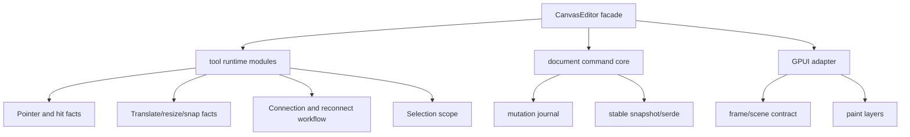
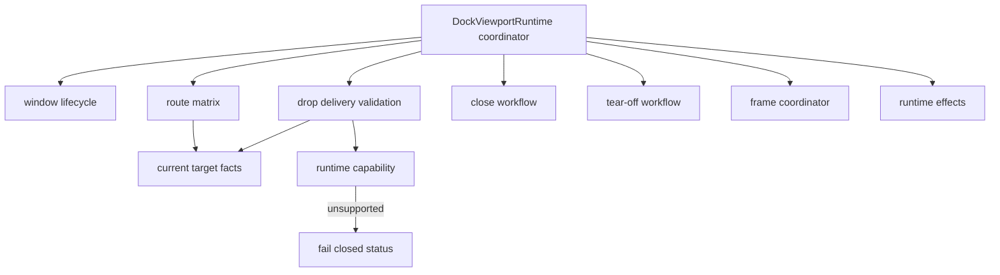
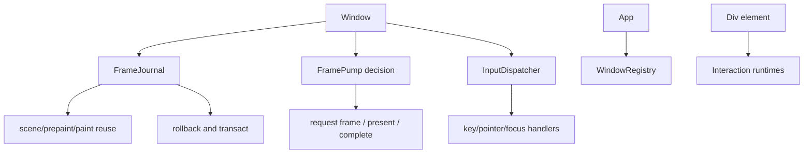

# Runtime, Canvas, And Docking Depth Refactor - Plan

## Goal Capsule

| Field | Decision |
|---|---|
| Objective | Deepen Open GPUI's core runtime, Canvas, and Docking modules before the next pre-1.0 release so the project does not accumulate wide orchestrators, hidden behavior contracts, and misleading public surfaces that would force a larger future rewrite. |
| Authority | User-approved fearless pre-1.0 refactor scope, read-only subagent findings from `canvas_depth_research`, `docking_depth_research`, `gpui_runtime_depth_research`, and `repo_profile_readonly`, plus codebase evidence from `main` at `4d49459`. |
| Release state | v0.2.0 has shipped. This work targets the next breaking stabilization cycle; compatibility shims and deprecation periods are not required for new or unstable internals. |
| Execution profile | Fearless but bounded architecture work. Breaking APIs, deleting unused code, splitting giant modules, and rewriting internal seams are allowed when they reduce long-term maintenance risk and are backed by characterization tests. |
| Product boundary | Open GPUI should remain a general native/web UI framework foundation. Motion remains renderer-neutral infrastructure; Docking remains capability-gated; Canvas remains a reusable editor substrate; GPUI runtime internals become deeper modules without forcing app authors to learn internal scheduling details. |
| Stop conditions | Stop and re-plan if implementation requires a global animation scheduler, public GSAP/WAAPI compatibility, browser popout docking, a mass split of the platform trait, a snapshot/serde format break for Canvas documents, or a rewrite of semantic focus/hit-testing behavior without characterization coverage. |
| Tail ownership | `ce-work` owns implementation, focused verification, code review, logical commits, and push or merge handling only after gates pass or the user explicitly accepts a partial landing. |

---

## Product Contract

### Summary

The current repo has moved past early component and motion bootstrapping. The next highest-risk work is not another visible feature family; it is shrinking modules that currently behave like "runtime buses" and making their contracts explicit enough that future components can build on them safely. The priority order is Canvas first for editor substrate maintainability, Docking second for multi-viewport correctness and API honesty, GPUI runtime third for frame/input internals, and documentation/verification as the release-facing proof that the refactor did not create invisible regressions.

### Problem Frame

Canvas, Docking, and GPUI runtime all show the same architectural smell in different layers: useful behavior exists, but too many facts flow through giant files, giant tests, and broad coordination types. `crates/canvas/src/tool.rs`, `crates/canvas/src/document.rs`, and the Canvas GPUI adapter still mix product behavior, fixtures, rendering contracts, and tests. `open-gpui-docking` has a correct current-facts authority model, but `viewport_runtime.rs`, `viewport_drop_route.rs`, `viewport_drop_delivery.rs`, and `drop_target.rs` still pack state-machine decisions into dense modules. `crates/gpui/src/window.rs` and `crates/gpui/src/elements/div.rs` still carry too much frame, dispatch, input, and interaction machinery directly.

The project is pre-1.0 and the user explicitly prefers breaking now over preserving weak seams. The right move is a deliberate deep-module pass: preserve behavior that users rely on, but break or delete misleading internal exposure, split responsibilities around durable facts, and add tests at the new module boundaries.

### Requirements

- R1. Do not repeat completed work. Keep the existing Canvas store/mutation discipline, Docking current-facts release authority, Docking presentation-scene render authority, Motion frame-demand primitives, and runtime capability gates.
- R2. Canvas tool, document, and GPUI adapter code must be split into deeper modules without making internals public merely for tests.
- R3. Canvas document serialization, stable IDs, mutation journal semantics, `DocumentCommand` behavior, and snapshot compatibility must remain intact unless a separate migration plan is written.
- R4. Canvas GPUI rendering must expose a clearer internal frame/paint/scene contract with tests for layer order, hit regions, pointer routing, and presentation snapshots.
- R5. Docking viewport runtime must be reduced from a broad coordinator into explicit workflow modules for lifecycle, routing, delivery, tear-off, close, frame, payload, focus, and effects ownership.
- R6. Docking route and delivery state machines must keep the current-facts authority model while becoming table-testable around coordinate spaces, trusted hover facts, stale facts, fallback routing, and blocked platform capabilities.
- R7. Docking drop-target parsing, candidate generation, ranking, availability, and edge sizing must be separated so future table/tree/workspace consumers can reason about target policy without reading one dense module.
- R8. Docking web and unsupported-backend behavior must remain runtime-capability gated. Single-window docking should keep working on web; platform viewport windows and tear-off must fail closed when the backend cannot support them.
- R9. GPUI runtime frame accumulation, scene reuse, rollback, prepaint/paint index handling, input dispatch, and frame-request decisions must move behind internal modules with pure or focused tests where practical.
- R10. GPUI runtime refactors must not move scheduling ownership into `open-gpui-motion`, split the platform trait broadly, or change public app APIs without clear replacement paths.
- R11. Giant test files should be split into topic-focused test modules or test support fixtures so future failures identify the behavior area rather than a 3000-line file.
- R12. Release-facing docs, verification docs, ADRs, and engineering memory must reflect the new module boundaries and current non-goals so future agents do not restart already-settled work.

### Scope Boundaries

#### In Scope

- Splitting `crates/canvas/src/tool.rs`, `crates/canvas/src/tool/context.rs`, `crates/canvas/src/document.rs`, and Canvas GPUI adapter modules into deeper internal modules.
- Moving tests from giant in-module or giant sibling files into focused module test files and shared test fixtures.
- Splitting Docking viewport runtime, route, delivery, and drop-target responsibilities while preserving current-facts release authority and capability gates.
- Splitting GPUI window frame journal/reuse, frame pump decisions, input dispatch, app window registry, and Div interactivity internals when the local code shape supports it.
- Removing unused, misleading, or obsolete internal code and public exports discovered during the refactor.
- Updating docs and verification commands that describe these subsystems.
- Calling read-only subagents for review and using logical conventional commits after coherent slices.

#### Deferred to Follow-Up Work

- A public presence/enter-exit motion API, keyframes, repeat/reverse controls, global animation scheduler, or GSAP-style timeline compatibility.
- Browser platform viewport windows, popout docking, or multi-window web tear-off.
- A mass split of `Platform` or replacement of GPUI's borrow/entity model.
- A table/tree rewrite on top of the Canvas or Docking work.
- Intentional Canvas document format migrations.
- Pixel-perfect browser visual testing for every gallery scenario.

#### Outside This Product Identity

- Treating Motion as a DOM animation framework.
- Letting animated presentation state mutate semantic focus, hit testing, selection, accessibility roles, or durable layout state.
- Advertising platform-window docking as available on web or unsupported Linux paths.
- Preserving pre-1.0 compatibility exports that hide ownership boundaries or make internals look stable.

---

## Planning Contract

### Priority Analysis

| Priority | Work | Reason |
|---|---|---|
| P0 | Canvas test topology, tool context split, document seam protection | Canvas is a reusable editor substrate and currently has the highest combination of large files, mutation semantics, and serialization risk. Characterization must come before deeper edits. |
| P0 | Docking viewport route/delivery and capability gates | Docking already has the right authority model; the risk is regression from dense route matrices and web/platform capability ambiguity. |
| P1 | GPUI frame journal and frame pump split | Runtime scheduling mistakes are high blast radius. These should be made testable before expanding component usage. |
| P1 | Docking viewport runtime workflow split and drop-target decomposition | These reduce future multi-viewport and drag/drop complexity without changing the public product promise. |
| P2 | GPUI input dispatcher, app window registry, and Div interactivity split | Valuable, but should follow the frame/journal work because public behavior is broad and requires careful characterization. |
| P2 | Docs, ADRs, and engineering memory refresh | Must happen before completion, but should follow code movement so it documents reality rather than intent. |

### Key Technical Decisions

- KTD1. Deep modules beat compatibility shims. This is pre-1.0 architecture work; if an internal or unstable public path is wrong, replace it directly and document the break instead of carrying deprecated aliases.
- KTD2. Characterization tests lead behavior-moving refactors. Any move that touches Canvas document mutation, Docking route/delivery, or GPUI frame/input behavior needs focused tests before or in the same slice.
- KTD3. Do not make internals public for tests. Prefer `#[cfg(test)]` modules, crate-local test support, or integration tests through real public behavior.
- KTD4. Motion stays renderer-neutral and scheduler-free. Motion can provide deterministic samples and frame demand; GPUI/window owners decide how frames are requested.
- KTD5. Docking current-facts authority remains the release source of truth. Stale preview geometry, stale hover state, or cached route state must not win over current platform facts during release.
- KTD6. Platform capabilities are runtime facts. Cargo features may compile code paths, but they must not imply platform viewport availability.
- KTD7. Canvas document snapshots are product data. Do not change serde shape, stable IDs, or mutation inverse semantics without a separate migration plan.
- KTD8. Thin coordinators are the target shape. Runtime entry points may orchestrate, but route calculation, delivery validation, close workflow, frame demand, and cleanup effects should live behind named internal modules.
- KTD9. Public API narrowing requires inventory. If a type or function moves, disappears, or becomes crate-private, record old path, new path or no-replacement reason, and user-facing note.
- KTD10. Commit slices should match reviewable risk. Prefer commits by subsystem and contract boundary: Canvas characterization/split, Docking route/runtime split, GPUI frame/input split, docs/verification.

### High-Level Technical Design

Canvas should expose a small editor facade while internal modules own factual domains. Tests should assert behavior through the facade or crate-local fixtures rather than by reaching into every helper.

Docking keeps the current runtime facts as authority. The coordinator should delegate to workflows that can be table-tested independently.

GPUI should keep public behavior stable while moving runtime mechanics behind internal modules that can be reasoned about without reading the entire `window.rs` or `div.rs`.

### Assumptions

- The user has explicitly approved broad fearless refactor, breaking changes, deletion of unnecessary code, subagent review, and intermediate commits.
- Work starts from a clean `main` at `4d49459`; if the user edits files concurrently, those edits must be preserved and never reverted without explicit permission.
- Windows, Linux, wasm, and web capability behavior matter, but platform-specific smoke failures should be classified precisely rather than hidden by broad skips.
- Full workspace verification may be expensive. Focused subsystem gates should run after each slice; full `xtask verify` should run before final merge/push unless the user accepts documented partial status.

### Minimum Shippable Slice

The full target is U1 through U12. If an external platform gate blocks late and the user accepts a partial landing, the smallest acceptable architecture slice is U1, U2, U5, U6, U8, U9, U11, and U12. U3, U4, U7, and U10 may only defer if their existing behavior remains covered and the plan/engineering memory clearly records what is left. No partial landing may weaken Canvas document compatibility, Docking current-facts release authority, or web capability fail-closed behavior.

---

## Implementation Units

### U1. Canvas Characterization And Test Topology

- **Goal:** Split giant Canvas tests into topic-focused modules and add characterization coverage before behavior-moving refactors.
- **Requirements:** R2, R3, R4, R11.
- **Dependencies:** None.
- **Files:** `crates/canvas/src/tool.rs`, `crates/canvas/src/tool/tests.rs`, `crates/canvas/src/tool/tests/*`, `crates/canvas/src/document.rs`, `crates/canvas/src/document/tests/*`, `crates/canvas/src/gpui.rs`, `crates/canvas/src/gpui/tests/*`, `crates/canvas/src/test_support.rs`.
- **Approach:** Move in-module tests out of `tool.rs`, `document.rs`, and GPUI adapter files into focused test modules grouped by selection, clipboard, transform, connection, custom tool, history, document command, snapshot, and GPUI presentation behavior. Add crate-local fixtures where tests currently duplicate setup. Keep test-only helpers crate-private or `#[cfg(test)]`.
- **Test scenarios:** Existing tests still pass after movement; test names identify the behavior domain; no production public API is added solely for tests; Canvas snapshot and mutation tests still assert stable IDs and inverse behavior.
- **Verification:** `cargo nextest run -p open-gpui-canvas --no-fail-fast`; `cargo check -p open-gpui-canvas --benches --locked`; `cargo fmt --all --check`.

### U2. Canvas Tool Context Deep Modules

- **Goal:** Split `CanvasToolContext` and reducer helpers into factual modules for pointer/hit data, transform, snapping, connection, resize, and selection.
- **Requirements:** R2, R3.
- **Dependencies:** U1.
- **Files:** `crates/canvas/src/tool/context.rs`, `crates/canvas/src/tool/context/*`, `crates/canvas/src/tool/select.rs`, `crates/canvas/src/tool/builtin.rs`, `crates/canvas/src/geometry_facts.rs`, `crates/canvas/src/snap.rs`, `crates/canvas/src/routing.rs`.
- **Approach:** Keep the public editor/tool facade stable while moving coherent helper groups into internal modules such as `pointer`, `transform`, `resize`, `connection`, `snap`, and `selection_scope`. Preserve use of `CanvasGeometryFacts`, `CanvasStore`, and `CanvasMutationJournal`; do not bypass the mutation journal for convenience. Delete duplicate setup or stale helper paths found during the split.
- **Test scenarios:** Pointer press/drag/release, resize anchors, snap guides, connect/reconnect, relation updates, z-order changes, and selection scope behavior match characterization tests; reduced helper visibility does not require public API changes.
- **Verification:** Focused Canvas tool nextest filters plus full `open-gpui-canvas` nextest.

### U3. Canvas Document Module Tree

- **Goal:** Reduce `document.rs` by separating command application, validation, diffs, snapshot/export, inverse operations, and builder/test fixtures.
- **Requirements:** R2, R3, R11.
- **Dependencies:** U1.
- **Files:** `crates/canvas/src/document.rs`, `crates/canvas/src/document/*`, `crates/canvas/src/changes.rs`, `crates/canvas/src/mutation.rs`, `crates/canvas/src/schema.rs`, `crates/canvas/src/json_canvas.rs`, `crates/canvas/src/store.rs`.
- **Approach:** Preserve the public `CanvasDocument` and command API while moving implementation pieces into private submodules. Keep serialization and command semantics stable. Avoid string-based snapshot rewrites; use existing typed structures. If dead validation or builder code is discovered, delete it only after tests prove no public behavior relies on it.
- **Test scenarios:** Document command apply/undo/redo, relation inverse invariants, schema validation, JSON canvas import/export, diff/snapshot tests, and builder fixtures still pass; no snapshot format changes appear in golden files unless explicitly intended and documented.
- **Verification:** `cargo nextest run -p open-gpui-canvas document --no-fail-fast`; full Canvas nextest.

### U4. Canvas GPUI Adapter Frame And Paint Contract

- **Goal:** Make Canvas GPUI frame/painter behavior explicit and testable without mixing render planning, scene facts, hit testing, and painting in one path.
- **Requirements:** R4, R11.
- **Dependencies:** U1.
- **Files:** `crates/canvas/src/gpui.rs`, `crates/canvas/src/gpui/frame.rs`, `crates/canvas/src/gpui/painter.rs`, `crates/canvas/src/gpui/input.rs`, `crates/canvas/src/gpui/model.rs`, `crates/canvas/src/gpui/style.rs`, `crates/canvas/src/gpui/view.rs`, `crates/canvas/src/gpui/tests/*`.
- **Approach:** Introduce internal frame/scene facts that the painter consumes. Keep user-facing Canvas view APIs stable while separating input hit facts from paint ordering. Tests should assert layer ordering, selection/hover overlays, relation rendering, pointer routing, and scene snapshot behavior.
- **Test scenarios:** Canvas items render in stable layer order; selection handles and hover outlines do not steal semantic hit ownership; relation edges and labels use current geometry facts; pointer routing matches frame facts after pan/zoom; presentation snapshots remain deterministic.
- **Verification:** Canvas GPUI focused nextest filters plus `cargo check -p open-gpui-smoke-native --locked` if available.

### U5. Canvas Spatial Cache Documentation And Contract Cleanup

- **Goal:** Align spatial cache docs and tests with the current runtime cache implementation so future agents do not repeat completed cache work.
- **Requirements:** R1, R12.
- **Dependencies:** U2, U3, or U4 only when code movement affects cache facts.
- **Files:** `crates/canvas/src/spatial_cache.rs`, `crates/canvas/src/runtime.rs`, `crates/canvas/src/runtime_query.rs`, `docs/adr/*canvas*`, `docs/verification.md`, `docs/engineering-memory/*`.
- **Approach:** Audit the spatial cache implementation against current docs. Update docs to describe the live cache authority, invalidation model, and query contracts. Delete obsolete comments or plan references that claim cache work is still pending when it is already implemented.
- **Test scenarios:** Existing cache invalidation and runtime query tests still pass; docs name the current cache source of truth and do not instruct future work to rebuild completed seams.
- **Verification:** Canvas runtime tests and doc link checks when available.

### U6. Docking Viewport Runtime Workflow Split

- **Goal:** Turn `DockViewportRuntime` into a thin coordinator over named workflows.
- **Requirements:** R5, R8, R11.
- **Dependencies:** None.
- **Files:** `crates/gpui_docking/src/viewport_runtime.rs`, `crates/gpui_docking/src/viewport_window_lifecycle.rs`, `crates/gpui_docking/src/viewport_close.rs`, `crates/gpui_docking/src/viewport_tear_off.rs`, `crates/gpui_docking/src/viewport_frame_coordinator.rs`, `crates/gpui_docking/src/viewport_payload_drag.rs`, `crates/gpui_docking/src/viewport_focus.rs`, `crates/gpui_docking/src/viewport_runtime_effects.rs`, `crates/gpui_docking/src/viewport_runtime_handle/*`, `crates/gpui_docking/src/host_viewport_*tests.rs`.
- **Approach:** Move lifecycle, close, tear-off, frame coordination, payload drag, focus synchronization, and cleanup effects into focused modules if they are not already fully separated. Leave `viewport_runtime.rs` as the owner that wires state and policies together. Delete obsolete compatibility wrappers after tests and call sites move.
- **Test scenarios:** Open/close lifecycle, detached viewport cleanup, payload drag ownership, focus handoff, frame demand, and tear-off capability behavior match current tests; no workflow can construct platform windows without the runtime capability gate.
- **Verification:** `cargo nextest run -p open-gpui-docking host_viewport_lifecycle_tests host_viewport_close_tests host_viewport_platform_capability_tests --no-fail-fast`; `cargo check -p open-gpui-docking --tests --locked`.

### U7. Docking Route And Delivery State Machines

- **Goal:** Split route calculation and drop delivery validation into table-testable current-facts modules.
- **Requirements:** R6, R8.
- **Dependencies:** U6 if shared runtime types move first.
- **Files:** `crates/gpui_docking/src/viewport_drop_route.rs`, `crates/gpui_docking/src/viewport_drop_route/*`, `crates/gpui_docking/src/viewport_drop_delivery.rs`, `crates/gpui_docking/src/viewport_drop_delivery/*`, `crates/gpui_docking/src/viewport_coordinates.rs`, `crates/gpui_docking/src/viewport_target_context.rs`, `crates/gpui_docking/src/viewport_target_resolver.rs`, `crates/gpui_docking/src/host_viewport_route_tests.rs`, `crates/gpui_docking/src/host_viewport_preview_tests.rs`.
- **Approach:** Extract named structures for route input facts, coordinate conversions, trusted hover facts, stale-fact rejection, preview target resolution, delivery policy, and fallback status. Preserve the release-time current-facts authority from ADR 0012. Add table tests for every route status and fallback branch.
- **Test scenarios:** Coordinate-space conversions are explicit; stale hover facts cannot authorize release; blocked platform capability returns unsupported status; outside release and fallback route status stay deterministic; web single-window docking remains supported while platform viewport release paths fail closed.
- **Verification:** Route, preview, delivery, and platform capability nextest filters.

### U8. Docking Drop Target Decomposition

- **Goal:** Split `drop_target.rs` into parser/model, candidate generation, ranking, availability, and edge sizing modules.
- **Requirements:** R7, R11.
- **Dependencies:** U7 when route types are shared.
- **Files:** `crates/gpui_docking/src/drop_target.rs`, `crates/gpui_docking/src/drop_target/*`, `crates/gpui_docking/src/workspace_drop_target.rs`, `crates/gpui_docking/src/drop_runtime.rs`, `crates/gpui_docking/src/drop_preview.rs`, `crates/gpui_docking/src/host_interaction_tests.rs`.
- **Approach:** Keep public drop target behavior stable while moving policy decisions into named internal modules. Make invalid or unavailable targets explainable through typed status rather than implicit ranking failures. Delete duplicated edge sizing or availability helpers after all call sites move.
- **Test scenarios:** Center/edge/tab-stack targets rank consistently; unavailable targets explain why they are blocked; edge sizing clamps match existing behavior; workspace drop transactions still produce the same graph mutations; preview target facts match route/delivery expectations.
- **Verification:** Docking drop target, drop runtime, interaction, and workspace move tests.

### U9. Docking Test Topology And Public Surface Audit

- **Goal:** Split giant Docking tests and remove misleading public exports or dead-code allowances uncovered by runtime work.
- **Requirements:** R1, R8, R11, R12.
- **Dependencies:** U6, U7, U8.
- **Files:** `crates/gpui_docking/src/host_viewport_lifecycle_tests.rs`, `crates/gpui_docking/src/host_viewport_close_tests.rs`, `crates/gpui_docking/src/host_interaction_tests.rs`, `crates/gpui_docking/src/host_render_tests.rs`, `crates/gpui_docking/src/host_viewport_route_tests.rs`, `crates/gpui_docking/src/host_viewport_runtime_test_support.rs`, `crates/gpui_docking/src/lib.rs`, `crates/gpui_docking/src/prelude.rs`, `crates/gpui_docking/src/advanced.rs`, `crates/gpui_docking/src/public_surface_tests.rs`, `crates/gpui_docking/README.md`, `docs/release/breaking-changes.md`.
- **Approach:** Move large tests into scenario modules or shared fixtures. Audit root, prelude, and advanced exports after the refactor. Remove exports that expose internal runtime records by accident; keep advanced exports only when they have a user-debugging reason and docs coverage.
- **Test scenarios:** Public-surface tests prove common imports and advanced-only imports; old misleading paths fail or are absent from the inventory; giant tests are split by lifecycle/route/close/render/interaction scenarios; README imports compile.
- **Verification:** Docking full nextest, public-surface tests, docs/release breaking-change scan if available.

### U10. GPUI Frame Journal And Frame Pump

- **Goal:** Extract internal frame accumulation/reuse/rollback and request-frame decision logic from `window.rs`.
- **Requirements:** R9, R10.
- **Dependencies:** None, but should start after Canvas/Docking characterization is in place if runtime tests are noisy.
- **Files:** `crates/gpui/src/window.rs`, `crates/gpui/src/window/frame_journal.rs`, `crates/gpui/src/window/frame_pump.rs`, `crates/gpui/src/window/a11y.rs`, `crates/gpui/src/scene.rs`, `crates/gpui/src/element.rs`, `crates/gpui/src/platform_scheduler.rs`.
- **Approach:** Move `Frame` accumulation and frame reuse bookkeeping into an internal `FrameJournal` or equivalent. Move request-frame decisions into a pure `FramePump` decision function that takes facts such as active/throttled/force-present/pending-frame/input-rate and returns explicit actions. Preserve public `Window` behavior and platform hooks.
- **Test scenarios:** Prepaint/paint reuse rolls back consistently; hitboxes, dispatch trees, input handlers, tooltips, cursors, tab stops, text layout, and scene replay survive frame transactions; frame pump decisions cover inactive throttle, forced frame, present, next-frame callback, draw, present complete, and no-op cases.
- **Verification:** `cargo nextest run -p open-gpui window --no-fail-fast` if filter is valid; otherwise `cargo nextest run -p open-gpui --no-fail-fast` or targeted GPUI tests discovered during implementation; `cargo check -p open-gpui --tests --locked`.

### U11. GPUI Input, App Registry, And Div Interactivity Split

- **Goal:** Continue the GPUI runtime deepening by extracting input dispatch, app window registry, and Div interaction installers where the frame split reveals stable seams.
- **Requirements:** R9, R10, R11.
- **Dependencies:** U10.
- **Files:** `crates/gpui/src/window.rs`, `crates/gpui/src/window/input_dispatch.rs`, `crates/gpui/src/app.rs`, `crates/gpui/src/app/window_registry.rs`, `crates/gpui/src/elements/div.rs`, `crates/gpui/src/elements/div/*`, `crates/gpui/src/interactive.rs`, `crates/gpui/src/input.rs`, `crates/gpui/src/key_dispatch.rs`.
- **Approach:** Extract input dispatch only after tests identify the existing event phases. Split app window registry from effects/entity ownership without changing public `App` or context APIs. Move Div tooltip, scroll, hover, click, key, focus, and cursor installation into internal interaction runtimes if the code shape supports clean extraction. Defer pieces that would require public API churn or platform trait changes.
- **Test scenarios:** Pointer, keyboard, focus, tooltip, scroll, cursor, tab stop, and action dispatch behavior remain unchanged; app window registration and quit behavior match existing tests; Div builder APIs continue to compile.
- **Verification:** GPUI focused tests discovered by module; `cargo check -p open-gpui --tests --locked`; downstream `open-gpui-ui-components` and `open-gpui-docking` checks.

### U12. Verification, Docs, And Engineering Memory

- **Goal:** Make the new architecture discoverable and keep future agents from reopening settled decisions.
- **Requirements:** R1, R8, R12.
- **Dependencies:** U1 through U11 as applicable.
- **Files:** `docs/verification.md`, `docs/adr/*`, `docs/release/breaking-changes.md`, `CHANGELOG.md`, `crates/canvas/README.md`, `crates/gpui_docking/README.md`, `crates/motion/README.md`, `crates/gpui/README.md`, `docs/engineering-memory/*`.
- **Approach:** Update user-facing docs for changed public surfaces and internal architecture notes for the new module boundaries. Keep changelog entries user-facing and non-repetitive. Record non-goals clearly: no global motion scheduler, no web popout docking, no Canvas snapshot migration. Remove or archive stale engineering-memory claims that conflict with the implemented state.
- **Test scenarios:** Docs name the right crate/module paths; breaking-change inventory covers public moves/removals; verification docs include focused commands for Canvas, Docking, GPUI runtime, wasm/web, and full workspace gates.
- **Verification:** `cargo run -p xtask -- verify` before completion when practical; `git diff --check`; doc link checks if available.

---

## Execution Task List

- [ ] T1. Create or update branch from clean `main`; record baseline status and active plan path.
- [ ] T2. Run initial focused checks or test discovery for Canvas, Docking, and GPUI runtime to establish local baseline.
- [ ] T3. Implement U1 Canvas test topology and commit after focused Canvas tests pass.
- [ ] T4. Implement U2 and U3 Canvas context/document splits with characterization tests and commit.
- [ ] T5. Implement U4 and U5 Canvas GPUI adapter/spatial docs cleanup and commit.
- [ ] T6. Implement U6 and U7 Docking viewport runtime/route/delivery splits with capability tests and commit.
- [ ] T7. Implement U8 and U9 Docking drop-target/test/public-surface cleanup and commit.
- [ ] T8. Implement U10 GPUI frame journal/frame pump split with focused tests and commit.
- [ ] T9. Implement U11 GPUI input/app/div split where seams are clean; defer only with documented reason.
- [ ] T10. Implement U12 docs, breaking-change inventory, verification docs, and engineering-memory refresh.
- [ ] T11. Run final focused subsystem gates, then `cargo run -p xtask -- verify` if practical.
- [ ] T12. Run subagent or second-pass code review on the final diff, fix blockers, commit remaining work, and report merge/push status.

---

## Verification Contract

### Focused Gates

- `cargo fmt --all --check`
- `cargo nextest run -p open-gpui-canvas --no-fail-fast`
- `cargo check -p open-gpui-canvas --benches --locked`
- `cargo nextest run -p open-gpui-docking host_viewport_lifecycle_tests host_viewport_close_tests host_viewport_route_tests host_viewport_preview_tests host_viewport_platform_capability_tests --no-fail-fast`
- `cargo nextest run -p open-gpui-docking drop_target drop_runtime host_interaction_tests host_viewport_preview_visual_tests public_surface_tests --no-fail-fast`
- `cargo check -p open-gpui-docking --tests --locked`
- `cargo check -p open-gpui --tests --locked`
- `cargo nextest run -p open-gpui --no-fail-fast` or narrower valid GPUI filters discovered during implementation

### Workspace And Platform Gates

- `cargo check --workspace --locked`
- Existing wasm/web checks listed in `docs/verification.md`
- `cargo run -p xtask -- web-smoke` when the web smoke harness is available in the working tree
- `cargo run -p xtask -- verify`
- `git diff --check`

### Review Gates

- Subagent or independent review after major subsystem slices if the diff is large.
- Manual public-surface inventory review for any export removal or path move.
- Documentation review for user-facing README/changelog/breaking-change entries before final completion.

---

## Risks And Mitigations

- **Risk:** Canvas refactor accidentally changes document snapshots or undo/redo semantics. **Mitigation:** Run characterization tests first, avoid serde shape edits, and inspect snapshot diffs manually.
- **Risk:** Docking route split weakens release-time current-facts authority. **Mitigation:** Add table tests for stale facts and capability-blocked releases before moving delivery code.
- **Risk:** GPUI frame split changes scheduling behavior in subtle ways. **Mitigation:** Extract pure decision logic with tests and keep platform hooks unchanged until behavior is proven.
- **Risk:** Test movement hides coverage gaps. **Mitigation:** Use exact test counts and focused test names before/after each move; do not delete tests just because they are noisy.
- **Risk:** Concurrent user edits overlap. **Mitigation:** Check `git status` before each patch and stage only files intentionally edited by this work.
- **Risk:** Full workspace verify is slow or platform-dependent. **Mitigation:** Run focused gates after each slice and document any platform-only full-gate blocker with exact command output.

---

## Definition Of Done

- Canvas tool/document/GPUI adapter modules are smaller, behavior is characterized, and public editor/document semantics remain stable.
- Docking viewport runtime, route/delivery, and drop-target logic have named internal modules with table or scenario tests for capability and stale-fact behavior.
- GPUI runtime frame journal and frame pump are extracted or the remaining blocker is documented with a concrete follow-up; no scheduler ownership moves into Motion.
- Public surfaces are narrower or explicitly inventoried where they changed; no internal type is exported by accident as default API.
- Docs and engineering memory describe the new state and non-goals accurately.
- Focused subsystem gates pass, and full workspace verification is either green or blocked by a documented external/platform issue accepted by the user.
- Work is committed in logical conventional commits with only intended files staged.
