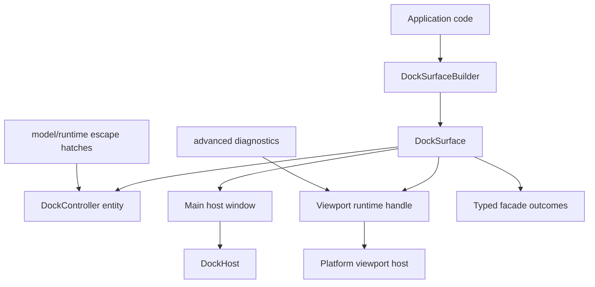
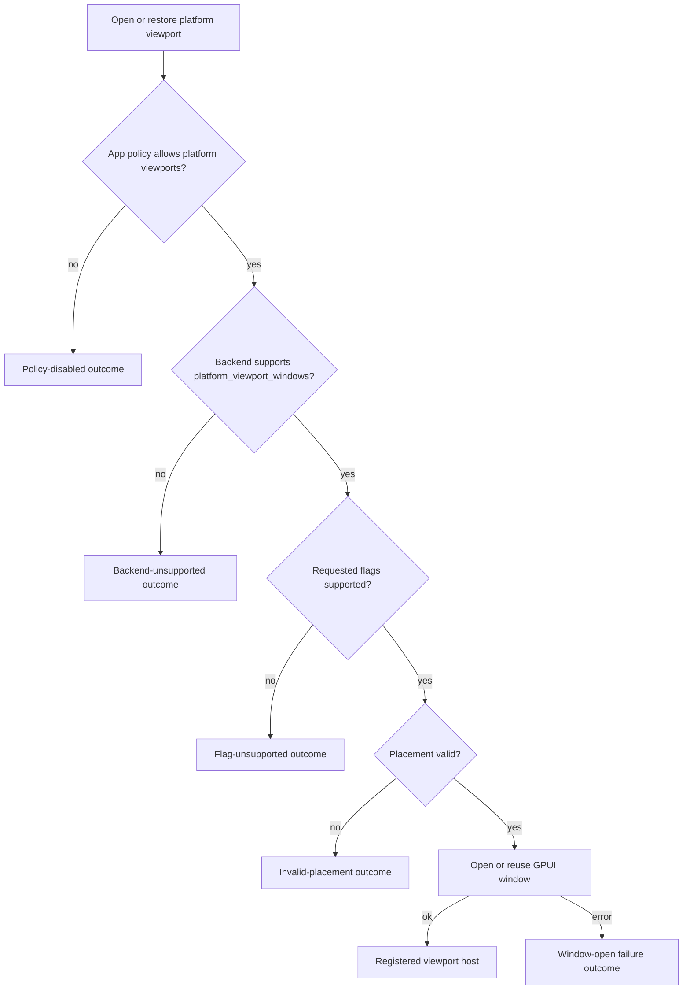
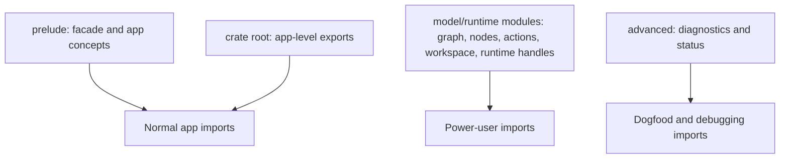

## Goal Capsule

| Field | Value |
|---|---|
| Objective | Make `open-gpui-docking` feel like a mature application-level docking module by adding a small `DockSurface` interface, tightening default exports, giving viewport capability failures typed outcomes, and dogfooding the facade through examples and tests. |
| Authority | User request for fearless breaking refactor; current `open-gpui-docking` code; prior web docking capability-gate plan in `docs/plans/2026-07-05-002-refactor-web-docking-viewport-capability-gates-plan.md`; local ImGui docking reference in `repo-ref/imgui`; read-only docking facade and viewport capability research from this planning pass. |
| Execution profile | Deep refactor; breaking changes are allowed; no deprecation layer is required; prefer proof-first coverage for new facade behavior and characterization coverage before moving existing viewport behavior behind the facade. |
| Stop conditions | Stop only for a contradiction in public behavior, a missing GPUI platform primitive that prevents typed capability reporting, or a verification failure that shows the plan's interface shape is wrong rather than merely incomplete. |
| Landing strategy | Work may commit directly on `main` because the user explicitly authorized main sync and remote push for this work; commits should stay unit-sized and conventional. |

---

## Product Contract

### Summary

The docking crate currently exposes powerful model and runtime pieces, but the common caller path still asks applications to assemble `DockController`, `DockViewportRuntimeHandle`, `DockHost`, raw graph concepts, and platform capability facts directly.
This plan makes the common path a deep module: callers start from `DockSurface`, register panels, open a host window, and opt into platform viewports through typed capability outcomes.
Raw graph, diagnostics, and runtime plumbing remain available as escape hatches, but they stop being the default interface a normal application learns first.

### Problem Frame

ImGui's docking lesson is not that Open GPUI should copy immediate-mode window identity or expose unstable dock-builder internals.
The useful lesson is interface shape: an application can enable docking with a small public surface, while backend integrations carry the larger platform-window contract.
Open GPUI already has much of the hard runtime work, including capability facts, route status, placement persistence, close policies, and fail-closed web behavior.
The gap is packaging that work into an app-level interface and making tests/docs enforce that the default public surface stays small.

### Requirements

**Facade and public surface**

- R1. Applications can create and render a docked workspace through `DockSurface` without importing raw graph, node, action, or runtime-handle types.
- R2. `open_gpui_docking::prelude` is app-first: facade, panel descriptors, placement targets, persistence structs, policy structs, and typed outcomes only.
- R3. Raw graph, layout mutation, action, workspace, low-level runtime, and diagnostics types move behind explicit escape-hatch modules rather than the default prelude.
- R4. Panel lifecycle operations are available by stable item, descriptor, placement, or facade handle; normal callers do not need `DockNodeId` for open, close, float, or dock-back flows.

**Multi-viewport and capability behavior**

- R5. Platform viewport support reports typed outcomes that distinguish app policy disabled, backend unsupported, flag unsupported, invalid placement, and window-open failure.
- R6. Web and other unsupported backends fail closed for platform viewports and keep single-window docking usable.
- R7. Native-supported backends can open, reuse, restore, export, and close platform viewport hosts through the facade while preserving existing close policies and current-facts route authority.
- R8. Tear-off and cross-window docking keep the current runtime's stale-preview protections and never create a route or registered viewport after a capability failure.

**Examples and documentation**

- R9. `examples/docking-minimal` demonstrates the common facade path and imports only the default public surface.
- R10. A production-shaped multi-viewport example demonstrates facade-level native viewport usage without diagnostics imports.
- R11. `examples/docking-native` remains a diagnostics dogfood app and uses the explicit escape-hatch surface for runtime status and lower-level experiments.
- R12. README and verification docs explain the three tiers: facade-first app API, explicit low-level model/runtime API, and advanced diagnostics.

**Compatibility posture**

- R13. The refactor may break pre-0.3 public imports and delete obsolete examples or docs; the crate does not need a deprecation bridge for APIs that did not exist in v0.1.0 or are being corrected before a stable release.

### Acceptance Examples

- AE1. Given a simple app with three lazy panels, when it builds a `DockSurface` and opens the main host window, then the app does not import `DockGraph`, `DockNodeId`, `DockAction`, or `DockViewportRuntimeHandle`.
- AE2. Given `allow_platform_viewports` is requested on a backend with `platform_viewport_windows = false`, when the app asks the surface to open or restore a platform viewport, then it receives a typed unsupported result and no platform window, route, or runtime registration is created.
- AE3. Given a supported native backend and saved viewport placement, when the app restores through `DockSurface`, then the secondary viewport opens or reuses its registered host and export returns updated placement data.
- AE4. Given a panel is floated and then docked back through facade commands, when the operation completes, then selection, panel registry state, and workspace item ownership match the existing controller invariants.
- AE5. Given a future change accidentally reexports raw graph or diagnostic types from `prelude`, when public surface tests run, then they fail with a targeted message.

### Scope Boundaries

In scope:

- Add a `DockSurface` app-level facade and builder.
- Add typed facade outcomes for viewport capability and open/restore flows.
- Narrow default exports and update internal examples/tests for the new tiers.
- Add or strengthen tests that prove web/native gating, facade panel lifecycle, placement restore/export, and public surface boundaries.
- Update README and examples so the common path is facade-first.

Out of scope:

- Full ImGui DockBuilder parity or `.ini` import/export.
- Browser DOM multi-window emulation.
- Pixel-level style parity with ImGui.
- New platform backend primitives beyond using existing GPUI viewport capability facts.
- A stable 1.0 compatibility promise.

Deferred to follow-up work:

- A larger user-facing docking layout editor.
- Full visual drag-preview polish beyond preserving current route correctness.
- Persisted workspace schema version migration tooling if execution finds the existing layout structs need a broader serialization redesign.

---

## Planning Contract

### Key Technical Decisions

- KTD1. Introduce `DockSurface` as the deep module seam for applications. It should own or wrap `Entity<DockController>` plus the viewport runtime handle, while hiding `DockHost::from_controller` and direct runtime setup from normal app code.
- KTD2. Split the public surface by caller maturity. The default prelude should be small and app-level; raw graph/model/runtime escape hatches should live in explicit modules such as `model`, `runtime`, or `advanced`; diagnostics stay in `advanced`.
- KTD3. Keep `DockLayout`, `DockPanelPlacement`, `DockPanelDescriptor`, policy, and viewport placement persistence types in the app-level surface. These are durable application concepts, not implementation internals.
- KTD4. Report viewport capability failures as domain outcomes, not opaque `anyhow` strings. The facade should tell callers whether policy, backend capability, flag support, placement validation, or window opening blocked the request.
- KTD5. Do not turn web into fake platform viewports. Unsupported web and Wayland paths remain single-window docking plus in-window floating unless a future backend exposes real independent GPUI viewport support.
- KTD6. Treat examples as public interface conformance tests. `docking-minimal` proves the common app surface, `docking-multiviewport` proves production-shaped native usage, and `docking-native` proves diagnostics and raw runtime dogfooding.
- KTD7. Copy ImGui's small app surface and backend capability honesty, not its unstable internal DockBuilder model. Programmatic layout mutation can remain an explicit low-level model API.

### High-Level Technical Design

### Sequencing

Start with the facade seam and tests, because export narrowing and examples need a concrete common path to target.
Then add typed capability outcomes and panel lifecycle helpers, move default exports, update examples/docs, and finish with broad verification plus dead-code cleanup.

### Assumptions

- The current `DockViewportRuntimeHandle` remains the authoritative implementation for platform viewport lifecycle.
- The current `DockPolicy` and `PlatformViewportCapabilities::platform_viewport_windows` facts are sufficient to distinguish policy-disabled and backend-unsupported outcomes.
- Breaking imports in examples, crate docs, and downstream pre-0.3 callers is acceptable.
- `docking-native` may continue using low-level imports because it is explicitly a diagnostics dogfood app.

### Risks and Mitigations

| Risk | Mitigation |
|---|---|
| Moving exports breaks many internal tests that currently use crate-root reexports. | Keep crate-internal aliases where useful, update tests to import from the explicit tier they exercise, and land export narrowing after facade tests exist. |
| Facade becomes a pass-through wrapper rather than a deep module. | Require examples and public tests to avoid direct `DockHost`, `DockViewportRuntimeHandle`, `DockNodeId`, and raw graph imports for common flows. |
| Typed outcomes duplicate existing runtime status concepts. | Map facade outcomes to existing runtime errors/status records and keep diagnostics in `advanced` instead of inventing a second status model. |
| Web capability behavior regresses while adding native convenience. | Keep fail-closed tests for unsupported platform viewport windows and assert no registration side effects after failure. |
| Native multi-viewport example becomes diagnostic-heavy again. | Split production example from `docking-native`; reserve diagnostics UI for the dogfood app. |

### Sources and Research

- `crates/gpui_docking/src/lib.rs`, `crates/gpui_docking/src/prelude.rs`, and `crates/gpui_docking/src/advanced.rs` show the current export tiers.
- `crates/gpui_docking/src/controller.rs`, `crates/gpui_docking/src/host.rs`, and `crates/gpui_docking/src/viewport_runtime_handle.rs` show the current app wiring burden.
- `crates/gpui_docking/src/public_surface_tests.rs` already guards diagnostics leakage and can become the public-surface contract.
- `docs/plans/2026-07-05-002-refactor-web-docking-viewport-capability-gates-plan.md` established runtime capability gating instead of cargo feature gating.
- `repo-ref/imgui/imgui.h` and `repo-ref/imgui/docs/BACKENDS.md` show ImGui's small app-level docking entry points and larger backend multi-viewport contract.

---

## Implementation Units

### U1. Add the DockSurface facade seam

- **Goal:** Create the app-level module that owns common docking setup and becomes the public entry point for normal applications.
- **Requirements:** R1, R2, R9, AE1.
- **Dependencies:** None.
- **Files:** Create `crates/gpui_docking/src/surface.rs`; modify `crates/gpui_docking/src/lib.rs`, `crates/gpui_docking/src/prelude.rs`, `crates/gpui_docking/src/public_surface_tests.rs`; test in `crates/gpui_docking/src/surface_tests.rs`.
- **Approach:** Add `DockSurface`, `DockSurfaceBuilder`, and facade options that build or wrap a controller entity plus runtime handle. Include app-level methods for creating a host window and host view so examples do not wire `DockHost::from_controller` directly. Keep direct accessors narrow and name any low-level escape clearly.
- **Execution note:** Start with facade compile tests that express the desired app import shape before changing examples.
- **Patterns to follow:** `DockController::builder` in `crates/gpui_docking/src/controller.rs`; current host creation in `examples/docking-minimal/src/main.rs`; runtime host creation in `crates/gpui_docking/src/viewport_runtime_handle.rs`.
- **Test scenarios:** Covers AE1. A facade-only test builds a surface with three lazy panel descriptors, opens or constructs the primary host, and compiles without importing raw graph, node, action, or runtime handle types. A builder validation test returns the existing controller validation error when an invalid layout is supplied. A wrapping test creates a surface from an existing controller entity and preserves the primary space.
- **Verification:** `surface_tests` prove the new seam, and `public_surface_tests` can name `DockSurface` from the prelude.

### U2. Add typed viewport capability and open outcomes

- **Goal:** Make facade-level platform viewport operations report policy and backend capability failures without leaking `anyhow` or diagnostics-only status types.
- **Requirements:** R5, R6, R7, R8, AE2, AE3.
- **Dependencies:** U1.
- **Files:** Modify `crates/gpui_docking/src/surface.rs`, `crates/gpui_docking/src/viewport_open.rs`, `crates/gpui_docking/src/viewport_runtime_handle.rs`, `crates/gpui_docking/src/host_viewport_platform_capability_tests.rs`, `crates/gpui_docking/src/host_viewport_placement_tests.rs`; create or extend `crates/gpui_docking/src/surface_viewport_tests.rs`.
- **Approach:** Add facade outcomes that wrap successful open/reuse results and classify failure as policy-disabled, backend-unsupported, flag-unsupported, invalid-placement, or window-open-failed. Reuse existing `DockPolicy`, `PlatformViewportCapabilities`, placement validation, and runtime open paths. Keep `DockViewportRuntimeHandle` as the low-level implementation and avoid duplicating registry state.
- **Execution note:** Characterize existing unsupported-backend behavior before replacing opaque facade errors with typed results.
- **Patterns to follow:** Capability gating in `crates/gpui_docking/src/viewport_runtime_handle.rs`; route fail-closed tests in `crates/gpui_docking/src/host_viewport_route_tests.rs`; placement tests in `crates/gpui_docking/src/host_viewport_placement_tests.rs`.
- **Test scenarios:** Covers AE2. With policy enabled and backend support false, facade open returns backend-unsupported and no runtime viewport registration is present. Covers AE2. With policy disabled and backend support true, facade open returns policy-disabled. Covers AE3. With backend support true and a valid placement, facade open delegates to runtime open/reuse and the registered viewport can be exported. Invalid placement returns a typed placement outcome without opening a window.
- **Verification:** Focused viewport facade tests pass and existing runtime capability tests remain green.

### U3. Add product-level panel lifecycle commands

- **Goal:** Let normal callers open, close, float, and dock back panels through `DockSurface` without raw node identifiers.
- **Requirements:** R4, AE4.
- **Dependencies:** U1.
- **Files:** Modify `crates/gpui_docking/src/surface.rs`, `crates/gpui_docking/src/controller.rs`, `crates/gpui_docking/src/panel.rs`, `crates/gpui_docking/src/host_interaction_tests.rs`; create or extend `crates/gpui_docking/src/surface_panel_tests.rs`.
- **Approach:** Add facade commands that accept stable panel/item identifiers, descriptors, placement targets, and optional bounds. Use controller operations internally and add controller helpers only when they hide repeated lookup or node-selection logic. Keep raw `DockNodeId` operations in the low-level tier for tests and power users.
- **Execution note:** Add tests around facade commands before deleting direct caller workarounds in examples.
- **Patterns to follow:** `DockController::open_panel_at_placement`, `close_panel`, `float_item_in_window`, and merge helpers in `crates/gpui_docking/src/controller.rs`; interaction tests in `crates/gpui_docking/src/host_interaction_tests.rs`.
- **Test scenarios:** Covers AE4. Opening a registered lazy panel through the surface creates or selects the workspace item. Closing a panel through the surface respects existing close outcomes. Floating a panel by item id creates an in-window floating container without the caller naming a node. Docking back a floating panel restores workspace ownership and selection invariants. Unknown panel or item identifiers return typed not-found outcomes.
- **Verification:** Facade panel tests pass and existing host interaction tests still prove raw controller behavior.

### U4. Narrow exports into app, model, runtime, and advanced tiers

- **Goal:** Make the crate's default import shape match the intended mature public interface while preserving explicit low-level escape hatches.
- **Requirements:** R2, R3, R12, R13, AE5.
- **Dependencies:** U1, U2, U3.
- **Files:** Modify `crates/gpui_docking/src/lib.rs`, `crates/gpui_docking/src/prelude.rs`, `crates/gpui_docking/src/advanced.rs`, `crates/gpui_docking/src/public_surface_tests.rs`, `crates/gpui_docking/README.md`; create `crates/gpui_docking/src/model.rs` and `crates/gpui_docking/src/runtime.rs` if execution confirms that explicit modules make the split clearer.
- **Approach:** Keep facade and durable app concepts at the root/prelude. Move raw graph, node, action, workspace, mutation, and runtime-handle reexports out of the prelude and into explicit modules. Keep diagnostics and status records in `advanced`. Use crate-internal aliases when necessary so internal implementation does not become noisier than external code.
- **Execution note:** Do this after examples have a facade path so export tests can enforce the new contract rather than only removing names.
- **Patterns to follow:** Existing diagnostics isolation in `crates/gpui_docking/src/advanced.rs`; import-shape scanning in `crates/gpui_docking/src/public_surface_tests.rs`.
- **Test scenarios:** Covers AE5. `public_surface_tests` fail if `prelude.rs` reexports raw graph, node, action, workspace, runtime-handle, or diagnostics names. A compile-level import test uses root/prelude facade names only. A low-level import test uses the explicit model/runtime/advanced tier for raw operations.
- **Verification:** Public surface tests pass and all internal references compile after import updates.

### U5. Convert examples and docs to facade-first guidance

- **Goal:** Make examples and README teach the mature interface tiers and prove the common path remains ergonomic.
- **Requirements:** R9, R10, R11, R12, AE1, AE3.
- **Dependencies:** U1, U2, U4.
- **Files:** Modify `examples/docking-minimal/src/main.rs`, `examples/docking-native/src/main.rs`, root `Cargo.toml`, `crates/gpui_docking/README.md`; create `examples/docking-multiviewport/Cargo.toml`, `examples/docking-multiviewport/src/main.rs`; update relevant docs under `docs/` if linked from README.
- **Approach:** Rewrite `docking-minimal` around `DockSurface`. Add a production-shaped multiviewport example that opts into platform viewport support through typed facade outcomes and shows restore/export without diagnostics imports. Keep `docking-native` as the heavier diagnostics app and move its imports to explicit low-level modules.
- **Execution note:** Treat example compilation as API conformance; do not leave examples using old common imports.
- **Patterns to follow:** Existing panel rendering in `examples/docking-minimal/src/main.rs`; native placement and close-policy scenarios in `examples/docking-native/src/main.rs`; current example workspace conventions in root `Cargo.toml`.
- **Test scenarios:** Minimal example compiles with facade/prelude imports only. Multiviewport example compiles without `advanced` imports. Native diagnostics example compiles using explicit model/runtime/advanced imports. README snippets match the new facade names and do not mention raw runtime setup as the common path.
- **Verification:** Example packages compile and README public-tier descriptions match code.

### U6. Harden web/native capability gates through the facade

- **Goal:** Ensure the new facade does not weaken the existing platform viewport fail-closed guarantees.
- **Requirements:** R5, R6, R7, R8, AE2, AE3.
- **Dependencies:** U2, U5.
- **Files:** Modify `crates/gpui_docking/src/host_viewport_platform_capability_tests.rs`, `crates/gpui_docking/src/host_viewport_route_tests.rs`, `crates/gpui_docking/src/host_viewport_placement_tests.rs`, `crates/gpui_docking/src/surface_viewport_tests.rs`, `docs/plans/2026-07-05-002-refactor-web-docking-viewport-capability-gates-plan.md` only if execution finds a factual drift in referenced verification notes.
- **Approach:** Add facade-level assertions beside existing runtime assertions. Unsupported backend paths should return typed outcomes before `cx.open_window`; route and placement tests should prove registry state is unchanged after failure. Supported test backends should still exercise open/reuse/export/close-policy flows.
- **Execution note:** Preserve existing runtime tests; add facade coverage rather than weakening lower-level tests to make the facade pass.
- **Patterns to follow:** Existing unsupported capability tests in `crates/gpui_docking/src/host_viewport_placement_tests.rs`; drop-route fail-closed tests in `crates/gpui_docking/src/host_viewport_route_tests.rs`.
- **Test scenarios:** Covers AE2. Facade open on unsupported backend creates no registered viewport and returns backend-unsupported. Facade restore with mixed supported and unsupported entries reports per-entry outcomes. Covers AE3. Supported backend restore opens or reuses viewports and export includes current bounds. Existing tear-off route unsupported tests still pass.
- **Verification:** Focused facade capability tests pass, existing route and placement tests pass, and wasm/web smoke gates do not regress.

### U7. Cleanup, review, and release-facing polish

- **Goal:** Remove obsolete wiring paths, stale docs, and dead-end compatibility code introduced during the refactor, then run the full quality tail.
- **Requirements:** R12, R13.
- **Dependencies:** U1, U2, U3, U4, U5, U6.
- **Files:** Modify files touched by earlier units as needed; update `CHANGELOG.md` or release notes only if execution changes user-visible v0.2.0 guidance; remove obsolete files only when they are superseded by the facade and not used by tests or examples.
- **Approach:** Search for old common-path language such as direct `DockViewportRuntimeHandle` setup in app examples and remove or move it to low-level documentation. Run a simplification pass over surface/controller changes so the facade is not a thin wrapper over caller complexity.
- **Execution note:** This is a cleanup and verification unit; behavior-bearing fixes discovered by review should add tests near the affected behavior.
- **Patterns to follow:** Current changelog style, README no-hard-wrap style, and workspace verification conventions.
- **Test scenarios:** Test expectation: none for pure cleanup; any behavior-bearing review fix must add or update the relevant test in the same file cluster.
- **Verification:** Full verification contract passes or any platform-unavailable gate is recorded with the exact reason.

---

## Verification Contract

| Gate | Applies to | Done signal |
|---|---|---|
| `cargo fmt --all --check` | All units | Formatting passes without modifying source. |
| `cargo check -p open-gpui-docking --tests --locked` | U1-U7 | Docking crate and tests compile after export changes. |
| `cargo nextest run -p open-gpui-docking --no-fail-fast` | U1-U7 | Docking crate behavior remains green, including facade, route, placement, panel, and public-surface tests. |
| `cargo check -p open-gpui-docking-minimal --locked` | U5 | Minimal example compiles through the facade path. |
| `cargo check -p open-gpui-docking-multiviewport --locked` | U5-U6 | New multiviewport example compiles without diagnostics imports. |
| `cargo check -p open-gpui-docking-native --locked` | U5-U6 | Native diagnostics dogfood example compiles through explicit low-level imports. |
| `cargo nextest run -p open-gpui-docking-native --no-fail-fast` | U5-U6 | Native example tests remain green where present. |
| `cargo check --target wasm32-unknown-unknown -p open-gpui-docking --locked` | U6 | Web/wasm compile gates still hold after capability facade changes. |
| `cargo run -p xtask -- web-smoke` | U6 | Web smoke remains single-window safe or reports an environment-only blocker. |
| `cargo run -p xtask -- verify` | U7 | Workspace verification passes before final push. |

---

## Definition of Done

- `DockSurface` is the documented and tested common app entry point.
- Normal apps can build/open a dock host and use panel lifecycle operations without raw graph, node, action, host-construction, or runtime-handle imports.
- Platform viewport operations through the facade return typed policy/backend/flag/placement/open outcomes.
- Unsupported backends keep fail-closed behavior and leave runtime registry state unchanged after platform viewport attempts.
- `prelude` no longer reexports raw graph, node, action, workspace, runtime-handle, or diagnostics types.
- Explicit low-level modules remain available for power users and diagnostics examples.
- `docking-minimal`, `docking-multiviewport`, and `docking-native` compile and demonstrate their intended tiers.
- README and docs describe facade-first docking, explicit low-level escape hatches, and web/native capability behavior.
- Obsolete compatibility scaffolding and abandoned implementation attempts are removed.
- The verification contract has been run, with any environment-only skip recorded in the final implementation summary.

---

## Appendix

### ImGui Lessons Applied

ImGui exposes a small app-level docking path and asks backend integrations to implement the hard multi-viewport contract.
Open GPUI should follow that separation.
The app-facing surface should feel simple, while backend capability facts and diagnostics remain truthful and explicit.

### Deferred Implementation Notes

- Exact facade method names can be adjusted during implementation to match Rust naming and GPUI context conventions.
- If root export narrowing creates excessive internal churn, preserve crate-internal aliases while keeping external prelude/root tiers small.
- If facade-level platform flag support needs data not currently exposed by `PlatformViewportCapabilities`, add a narrow capability record rather than folding diagnostics status into the app surface.
