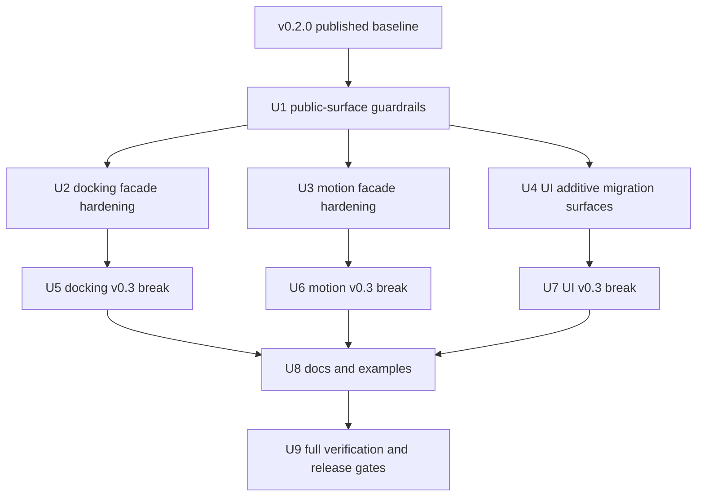
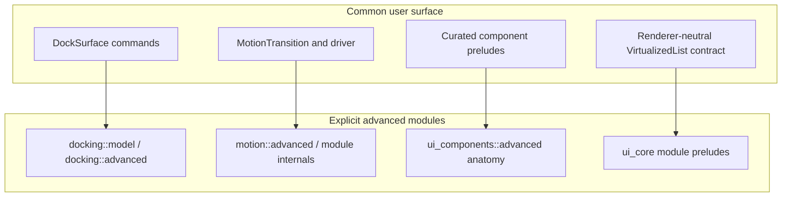

# Open GPUI v0.3 Public API Stabilization - Plan

## Goal Capsule

| Field | Value |
|---|---|
| Objective | Stabilize the v0.3.0 public API shape for docking, motion, UI components, and UI core before more downstream users depend on low-level implementation surfaces. |
| Authority | The user explicitly permits breaking changes, removing obsolete code, fearless refactoring, incremental commits, subagent review, and main-branch landing. |
| Release boundary | User-facing breaking changes belong to v0.3.0 because v0.2.0 is already published. Non-breaking hardening may still land as preparatory v0.2.x-compatible commits when it reduces risk. |
| Execution profile | Large cross-crate refactor with public API, docs, examples, and CI impact. Prefer characterization and public-surface tests before removals, then keep integration commits green before pushing. |
| Stop conditions | Stop for a product decision only if implementation proves the plan would remove a capability the framework still needs, or if a platform gate cannot be modeled without changing the product scope. |
| Tail ownership | `ce-work` owns implementation, focused verification, code review follow-up, commits, and push according to repo conventions and user instructions. |

---

## Product Contract

### Summary

Open GPUI should expose a mature application-facing component and framework API, not a set of raw model/runtime internals that ordinary users must assemble themselves. The v0.3.0 stabilization pass should make the common path obvious, keep advanced escape hatches available under explicit modules, and ensure docs, tests, and CI defend the new boundary.

### Problem Frame

The current crates already contain substantial functionality, but several default import paths expose low-level implementation contracts too early. Docking exposes controller and graph-shaped operations through common paths, motion exposes execution/runtime primitives as the crate-level language, and UI component preludes mirror broad root exports instead of acting as small daily-use vocabularies. These leaks raise the cost of future improvements because downstream users can accidentally depend on raw node IDs, `Instant`-based clocks, GPUI adapter types, and internal render item anatomy.

v0.2.0 has shipped, so this plan treats user-facing removals and signature changes as v0.3.0 work. The implementation does not need deprecation shims for APIs that did not exist before v0.2.0 or for v0.3.0 breaking removals, but it should still land additive guardrails first when those guardrails make the breaking pass safer.

### Requirements

**Public API layering**

- R1. Each affected crate must define a smaller common surface and keep raw model/runtime/anatomy escape hatches under explicit module paths.
- R2. Root exports and preludes must no longer be assumed equivalent; preludes should contain high-frequency vocabulary and extension traits only.
- R3. Public-surface tests must detect owner-class drift, default-export drift, and adapter-type leakage in common APIs.

**Docking**

- R4. Common docking APIs must prefer semantic panel, dockspace, placement, viewport, and close-lifecycle operations over `DockNodeId` and raw `DockAction` operations.
- R5. Platform viewport behavior must fail closed unless both policy and backend capabilities allow it, including runtime-handle paths and web/native feature gates.
- R6. Multi-viewport placement export, restore checks, and saved-placement opening must be available through the `DockSurface` facade, not only through low-level runtime handles.
- R7. Durable layout APIs must distinguish stable user-facing layout specs from raw serialized graph/model layout structures.

**Motion**

- R8. Public motion time should be duration/sample based; `Instant` conversion should live at adapter boundaries rather than in core user-facing execution APIs.
- R9. Motion vocabulary must separate product intent from execution model so users can choose committed layout, continuity, affordance, duration, spring, and immediate behavior without juggling overlapping `Spec`, `Preset`, `Model`, and policy context concepts.
- R10. Motion root exports must favor stable facade types; scalar tracks, frame hosts, timeline internals, sequence steps, and execution plans should be advanced or module-scoped.
- R11. Frame-demand reasons must be future-extensible without forcing downstream exhaustive matches over a single-variant enum.

**UI components and UI core**

- R12. `open_gpui_ui_components::prelude` and `open_gpui_ui_core::prelude` must become curated common import paths instead of broad mirrors of root exports.
- R13. Internal implementation detail types must not be default-exported as user-facing component contracts.
- R14. `VirtualizedList` must support rich component-library use cases through renderer-neutral state and a GPUI adapter extension, rather than hard-binding the main builder to `ScrollHandle`, `Window`, and `App`.
- R15. UI core table, virtualizer, split, and overlay advanced vocabularies must remain public through modules, but should not all enter the foundation prelude.

**Documentation and release readiness**

- R16. READMEs, examples, changelog guidance, and migration notes must describe the v0.3.0 import paths, common APIs, and explicit advanced escape hatches.
- R17. Verification must cover Linux, macOS, Windows, wasm surfaces, packageability, docs links, and crate-specific public API contracts before pushing main.

### Scope Boundaries

- In scope: breaking API changes for v0.3.0, public-surface test rewrites, docs/examples migrations, and deletion of obsolete APIs that exist only to support the old public shape.
- In scope: non-breaking preparatory facade methods and tests when they make the v0.3.0 break safer to review.
- Deferred to follow-up work: new docking algorithms beyond the public surface, a full ImGui-style docking feature clone, new animation authoring DSLs beyond the facade vocabulary, visual redesign of component examples, and new release-note automation beyond validating the docs affected by this refactor.
- Outside this plan: dependency upgrades unrelated to the public API stabilization, publishing a new release, and manual GitHub Release note authoring.

### Success Criteria

- A normal docking user can build a multi-window dock surface, reopen panels, export/restore viewport placement, and handle close lifecycle without importing raw graph/runtime controller types from the common path.
- A normal motion user can create and drive common transitions with duration-based samples and adapter-owned frame scheduling without importing scalar execution internals.
- A normal UI component user can import a small prelude and build controls, virtualized lists, and table/tree surfaces without internal anatomy types leaking into default imports.
- Advanced users still have explicit access to model/runtime/anatomy modules, and tests make that distinction enforceable.

---

## Planning Contract

### Key Technical Decisions

- KTD1. Treat v0.3.0 as the public break boundary. Because v0.2.0 has shipped, removals from default imports, signature changes, and type renames should target v0.3.0 rather than pretending to be v0.2.x-compatible.
- KTD2. Add or strengthen public-surface guardrails before large removals. The cheapest way to make fearless refactoring safe is to first make the intended boundaries executable in tests.
- KTD3. Keep advanced escape hatches, but make them opt-in by path. The plan does not delete graph/model/runtime power; it removes accidental exposure through root and prelude paths.
- KTD4. Prefer semantic commands over generated IDs in common docking APIs. `DockNodeId` remains a model concept, but application flows should speak in panel ids, dockspace ids, placement targets, and viewport specs.
- KTD5. Make motion time deterministic at the public facade. Duration-based samples make tests, replay, pause/resume, and non-GPUI adapters easier; `Instant` belongs in adapter convenience helpers.
- KTD6. Split UI common imports from crate ownership. Root can stay broader when useful, but prelude should optimize for daily authoring and avoid locking experimental state/anatomy into the default namespace.
- KTD7. Use docs and examples as API acceptance tests. Example code is part of the user contract for a UI framework, so migrations must update examples alongside tests.

### High-Level Technical Design

### Phased Delivery

1. Establish tests and additive facade seams while the old API still compiles.
2. Apply v0.3.0 breaking removals and renames crate by crate, updating examples and docs in the same phase as the code.
3. Run full verification, review, and push only after the integrated main branch is green.

### Assumptions

- The repository version remains `0.2.0` until a separate release-preparation change bumps versions for v0.3.0.
- The implementation may remove v0.2.0-era public APIs from common surfaces without deprecation aliases when the new v0.3.0 shape is clearer.
- Tests may be renamed or deleted when they exist only to enforce the old public-surface shape.
- Web and wasm docking support should keep capability gates explicit; the plan should not invent platform-window behavior that the backend cannot support.

### System-Wide Impact

This work affects downstream imports, docs.rs surfaces, examples, CI, packageability, and any user code that adopted v0.2.0 common imports. It also affects future component-library architecture because table/tree/virtualized-list and docking/motion will become the baseline examples for how Open GPUI separates common APIs from advanced contracts.

### Risk Analysis & Mitigation

| Risk | Mitigation |
|---|---|
| Removing too much from common surfaces makes legitimate advanced apps harder. | Keep advanced modules public and document explicit imports; add tests that confirm advanced paths remain available. |
| Public-surface tests become brittle string scans. | Strengthen owner-class rules first, then add real compile/pass contract tests where feasible; string scans remain only as cheap drift detectors. |
| Docking facade cannot cover a real multi-viewport flow. | Migrate `examples/docking-native` and `examples/docking-multiviewport` during U5/U8; if they need runtime APIs, expose a named advanced path rather than leaking it through prelude. |
| Motion vocabulary rename churn creates confusing transitional code. | Do the rename in one v0.3.0 pass after additive facade tests exist; delete old names rather than layering aliases unless a test proves an alias reduces internal churn. |
| UI prelude narrowing breaks many internal tests at once. | Update contract tests first, then migrate examples/tests by import class so compile failures point at intended moves. |

---

## Implementation Units

### U1. Add public API owner gates

- **Goal:** Make the intended common/advanced/internal boundaries executable before changing the APIs.
- **Requirements:** R1, R2, R3, R10, R12, R13, R15.
- **Dependencies:** None.
- **Files:** Modify `crates/gpui_docking/src/public_surface_tests.rs`, `crates/motion/tests/public_contracts.rs`, `crates/ui_components/tests/public_surface/exports.rs`, `crates/ui_components/tests/public_surface/manifest.rs`, `crates/ui_components/tests/public_surface/adapter.rs`, `crates/ui_components/tests/support/public_surface/mod.rs`, `crates/ui_core/tests/headless_contracts.rs`. Create focused helper files only if the existing support module becomes too broad.
- **Approach:** Add owner-class assertions that fail when raw model/runtime/anatomy types are default-exported, when prelude and root are accidentally forced to match, or when GPUI adapter types appear in renderer-neutral common builder signatures. Keep tests descriptive enough that later removals fail with an explanation, not a token-diff mystery.
- **Execution note:** Characterize the current failures first where practical, then update expectations to the planned v0.3.0 shape during later units.
- **Patterns to follow:** `crates/ui_components/tests/public_surface/manifest.rs`, `crates/ui_components/tests/public_surface/adapter.rs`, `crates/gpui_docking/src/public_surface_tests.rs`, `crates/ui_core/tests/headless_contracts.rs`.
- **Test scenarios:** A type classified as internal implementation detail cannot appear in `public_api::default`; a type classified as advanced cannot be re-exported from prelude; `VirtualizedList` renderer-neutral surfaces reject `open_gpui::Window`, `open_gpui::App`, and `ScrollHandle` in common contracts; docking common exports reject `DockAction`, `DockNodeId` command methods, and runtime handles unless they are under explicit advanced/model paths; motion root exports reject low-level scalar execution internals after U6.
- **Verification:** Focused public-surface tests fail on the old boundary where expected, then pass after the corresponding unit updates them.

### U2. Harden docking facade without breaking users

- **Goal:** Close current docking behavior gaps and add facade seams that make the v0.3.0 break lower risk.
- **Requirements:** R4, R5, R6.
- **Dependencies:** U1.
- **Files:** Modify `crates/gpui_docking/src/surface.rs`, `crates/gpui_docking/src/viewport_runtime_handle.rs`, `crates/gpui_docking/src/host_viewport_platform_capability_tests.rs`, `crates/gpui_docking/src/host_viewport_placement_tests.rs`, `crates/gpui_docking/src/host_viewport_lifecycle_tests.rs`, `crates/gpui_docking/README.md`, `examples/docking-native/src/main.rs`, `examples/docking-multiviewport/src/main.rs`.
- **Approach:** Make runtime-handle viewport opening honor `DockPolicy::allow_platform_viewports` or move unchecked behavior behind an explicit advanced name. Add `DockSurface` methods for placement export, placement restore checks, and saved-placement opening so examples no longer need to hold a runtime handle for common multi-viewport flows.
- **Execution note:** Start with tests that demonstrate runtime-handle policy bypass and missing surface placement restore facade before changing production code.
- **Patterns to follow:** `DockSurface::open_viewport_spec`, `DockViewportRuntimeHandle::export_placement`, `DockViewportRuntimeHandle::check_placement_restore`, existing host viewport placement tests.
- **Test scenarios:** Runtime open fails when backend supports platform viewports but policy denies them; runtime open succeeds when both policy and backend allow it; `DockSurface` exports the same placement layout as the runtime handle; `DockSurface` restore checks report stale/missing/open viewport states; native and multiviewport examples use the facade for common placement restore.
- **Verification:** Docking viewport placement, lifecycle, and platform capability tests pass with policy checks applied through both facade and runtime paths.

### U3. Add duration-first motion facade seams

- **Goal:** Introduce the public motion vocabulary that v0.3.0 will keep, while old internals still exist for comparison.
- **Requirements:** R8, R9, R10, R11.
- **Dependencies:** U1.
- **Files:** Modify or create `crates/motion/src/lib.rs`, `crates/motion/src/motion.rs`, `crates/motion/src/controller.rs`, `crates/motion/src/frame_host.rs`, `crates/motion/src/runtime.rs`, `crates/motion/src/spring.rs`, `crates/motion/src/sequence.rs`, `crates/motion/tests/public_contracts.rs`, `crates/motion/README.md`.
- **Approach:** Add facade names for `MotionTransition`, intent/kind vocabulary, duration-based samples, adapter-owned driver/clock helpers, and future-extensible frame-demand reasons. Keep the facade thin over existing sampling logic until U6 removes the old root shape.
- **Execution note:** Prefer characterization tests that compare old and new facade samples for the same duration before deleting old names.
- **Patterns to follow:** Existing `MotionClockSample::from_elapsed`, `MotionTimeline::sample_elapsed`, `MotionSpring::sample_elapsed`, `MotionFrameHost::sample`, and `repo-ref/motion` facade-oriented export layering.
- **Test scenarios:** Duration-first timeline and spring facade returns the same scalar sample as current internals for representative elapsed durations; reduced motion resolves to immediate completion; non-monotonic clock samples clamp; combined frame demand preserves `needs_frame` without requiring exhaustive reason matching; README examples compile against facade imports.
- **Verification:** Motion public contracts pass with both additive facade assertions and existing sampling behavior intact.

### U4. Add additive UI migration surfaces

- **Goal:** Give UI users and internal examples a non-breaking path toward curated preludes and renderer-neutral virtualized list contracts.
- **Requirements:** R2, R12, R13, R14, R15.
- **Dependencies:** U1.
- **Files:** Modify or create `crates/ui_components/src/lib.rs`, `crates/ui_components/src/prelude.rs`, `crates/ui_components/src/public_api/default.rs`, `crates/ui_components/src/public_api/common.rs`, `crates/ui_components/src/virtualized_list/mod.rs`, `crates/ui_components/src/virtualized_list/runtime.rs`, `crates/ui_components/src/gpui_adapter` module exports, `crates/ui_core/src/prelude.rs`, `crates/ui_core/src/table/mod.rs`, `crates/ui_core/src/virtualizer/mod.rs`, `crates/ui_components/tests/layout.rs`, `crates/ui_components/tests/public_surface/exports.rs`, `crates/ui_components/tests/public_surface/adapter.rs`, `crates/ui_core/tests/headless_contracts.rs`.
- **Approach:** Add `common` or `foundation` re-export modules, module-local preludes for table/virtualizer/split where missing, and a `VirtualizedListGpuiExt` or adapter builder layer that owns `ScrollHandle`, `Window`, and `App` signatures. The old builder can forward until U7 removes it from the common API.
- **Execution note:** Use compile-oriented tests to prove both old and new paths work before narrowing root/prelude.
- **Patterns to follow:** Existing `gpui_adapter` module, `crates/ui_components/tests/public_surface/adapter.rs`, table module tests, virtualized list layout tests.
- **Test scenarios:** `open_gpui_ui_components::common` exposes high-frequency components without internal item anatomy; `VirtualizedList` renderer-neutral state can be resolved without GPUI runtime types; GPUI row rendering remains available through the adapter extension; `ui_core::table::prelude` and `ui_core::virtualizer::prelude` expose advanced vocabulary outside the foundation prelude.
- **Verification:** UI component and UI core public-surface tests pass with additive migration imports available.

### U5. Break and stabilize docking common API for v0.3.0

- **Goal:** Remove accidental raw graph/runtime exposure from docking common imports and make `DockSurface` the ordinary application facade.
- **Requirements:** R1, R4, R5, R6, R7, R16.
- **Dependencies:** U1, U2.
- **Files:** Modify `crates/gpui_docking/src/lib.rs`, `crates/gpui_docking/src/prelude.rs`, `crates/gpui_docking/src/controller.rs`, `crates/gpui_docking/src/builder.rs`, `crates/gpui_docking/src/layout.rs`, `crates/gpui_docking/src/model.rs`, `crates/gpui_docking/src/advanced.rs`, `crates/gpui_docking/src/surface.rs`, `crates/gpui_docking/src/public_surface_tests.rs`, docking host and workspace tests that import root/prelude internals, docking examples and README.
- **Approach:** Move `DockController`, `DockControllerBuilder`, raw layout builders, raw actions, raw workspace accessors, node-id commands, and runtime handles out of root/prelude into explicit advanced/model/runtime paths. Add semantic command/snapshot types on `DockSurface` for selecting, opening, closing, floating, moving, and restoring panels by panel id, dockspace id, placement, and viewport spec. Split durable user layout spec from raw serialized graph layout where needed.
- **Execution note:** Expect broad compile failures after the export break; migrate tests and examples by owner class rather than re-exporting old internals to make them pass.
- **Patterns to follow:** `DockSurface::builder`, `DockPanelPlacement`, `DockPanelPlacementTarget`, `DockSurfaceViewportSpec`, `DockPolicy`, `crates/gpui_docking/src/model.rs`, `crates/gpui_docking/src/advanced.rs`.
- **Test scenarios:** `open_gpui_docking::prelude` can build a primary dock surface with panels and viewport policy without `DockController`; advanced tests can still import controller/model types through explicit modules; common tests use semantic panel operations instead of `DockNodeId`; layout round-trip still preserves raw serialized data while common builders hide raw node details; web/wasm platform viewport gates fail closed.
- **Verification:** Docking unit tests, examples, wasm surface checks, and public-surface tests pass after common imports are narrowed.

### U6. Break and stabilize motion public API for v0.3.0

- **Goal:** Make the motion crate read as a general Open GPUI animation system instead of a collection of scalar runtime internals.
- **Requirements:** R8, R9, R10, R11, R16.
- **Dependencies:** U1, U3.
- **Files:** Modify `crates/motion/src/lib.rs`, `crates/motion/src/motion.rs`, `crates/motion/src/controller.rs`, `crates/motion/src/frame_host.rs`, `crates/motion/src/runtime.rs`, `crates/motion/src/spring.rs`, `crates/motion/src/sequence.rs`, `crates/motion/tests/public_contracts.rs`, `crates/motion/README.md`.
- **Approach:** Narrow root exports to facade types, move scalar execution/timeline/frame-host internals to module or advanced paths, replace public `Instant` constructors/samplers with duration/sample APIs, consolidate `MotionSpec`/`MotionSpringSpec`/`MotionPreset`/`MotionModel` into intent plus transition execution vocabulary, and rename broad scalar-only sequence concepts to progress/scalar-specific names.
- **Execution note:** Remove old public names directly when the new facade tests pass; do not preserve deprecated aliases unless internal migration would be riskier than deletion.
- **Patterns to follow:** Current deterministic sampling logic, `MotionClockSample`, existing spring/timeline unit tests, `repo-ref/motion` facade exports as a layering reference rather than a Rust API template.
- **Test scenarios:** Root imports cover common duration, spring, immediate, and reduced-motion transitions; advanced imports still allow low-level deterministic sampling tests; public tests cannot construct user-facing runs with `Instant`; frame demand supports future reason expansion through helpers or reason sets; progress sequence naming no longer occupies a future general storyboard/timeline concept.
- **Verification:** Motion unit tests and public contracts pass with docs examples migrated to facade imports.

### U7. Break and stabilize UI component and UI core imports for v0.3.0

- **Goal:** Make UI component imports scale as a component library surface instead of exposing every state/anatomy/runtime type through default paths.
- **Requirements:** R1, R2, R3, R12, R13, R14, R15, R16.
- **Dependencies:** U1, U4.
- **Files:** Modify `crates/ui_components/src/lib.rs`, `crates/ui_components/src/prelude.rs`, `crates/ui_components/src/public_api/default.rs`, `crates/ui_components/src/component_contract/rows/catalog.rs`, `crates/ui_components/src/toolbar`, `crates/ui_components/src/sidebar`, `crates/ui_components/src/listbox`, `crates/ui_components/src/virtualized_list`, `crates/ui_core/src/lib.rs`, `crates/ui_core/src/prelude.rs`, `crates/ui_core/src/table/mod.rs`, `crates/ui_core/src/virtualizer/mod.rs`, `crates/ui_core/src/split/mod.rs`, UI component tests and READMEs.
- **Approach:** Narrow `ui_components::prelude` to daily-use components, descriptors, tokens, sizing, and extension traits; remove internal item anatomy from default exports; move render anatomy to private or `advanced::anatomy` modules; make `VirtualizedList` common builder renderer-neutral and put GPUI-specific render/scroll hooks on an adapter extension; narrow `ui_core::prelude` to foundation vocabulary while keeping table/virtualizer/split public through module preludes.
- **Execution note:** Expect tests that intentionally asserted root/prelude parity to be deleted or rewritten; parity is no longer the desired contract.
- **Patterns to follow:** `component_contract` owner classes, `gpui_adapter` module boundary, table module export organization, existing `VirtualizedListBehaviorSnapshot` and `VirtualizerSnapshot` contracts.
- **Test scenarios:** Prelude no longer equals root; internal implementation detail types are not default exports; common virtualized list code resolves state and behavior snapshots without GPUI runtime types; GPUI adapter extension still renders custom rows and preserves activation/selection callbacks; table, virtualizer, and split module preludes compile for advanced users.
- **Verification:** UI component layout/table/public-surface tests and UI core headless contracts pass with the new import model.

### U8. Migrate docs, examples, and changelog guidance

- **Goal:** Make the new v0.3.0 public model understandable to users without reading tests.
- **Requirements:** R16.
- **Dependencies:** U5, U6, U7.
- **Files:** Modify `README.md`, `CHANGELOG.md`, `crates/gpui_docking/README.md`, `crates/motion/README.md`, `crates/ui_components/README.md`, `crates/gpui_web/README.md` if feature gates are documented there, `examples/docking-minimal/src/main.rs`, `examples/docking-multiviewport/src/main.rs`, `examples/docking-native/src/main.rs`, `examples/ui-foundation-gallery/src/main.rs`.
- **Approach:** Rewrite docs around the new common path first, then add explicit advanced import examples. Keep changelog entries user-facing and non-repetitive, with v0.3.0 breaking sections grouped by docking, motion, and components. Avoid manual line wrapping in changelog prose.
- **Execution note:** Treat docs examples as compile targets where possible; do not leave snippets that reference removed imports.
- **Patterns to follow:** Current README crate sections, publish-check docs verification, existing examples.
- **Test scenarios:** README examples reference `DockSurface`, motion facade types, curated preludes, and adapter modules consistently; changelog explains what users must change without exposing implementation churn; docs link scanner passes.
- **Verification:** Release docs verification and docs link scan pass.

### U9. Run integrated verification and review

- **Goal:** Prove the refactor is ready to push to main and future v0.3.0 release work.
- **Requirements:** R17.
- **Dependencies:** U1, U2, U3, U4, U5, U6, U7, U8.
- **Files:** Modify `.github/workflows/verify.yml`, `.github/workflows/publish-check.yml`, `.github/workflows/release-crates.yml`, `xtask` files only if the refactor requires new checks. Otherwise use existing workflows unchanged.
- **Approach:** Run focused tests after each unit, then full workspace verification. Use code review for non-mechanical diffs and apply findings before pushing. If CI-only platform gaps appear, add a focused local or workflow check rather than broadening every job.
- **Execution note:** Do not push a known broken main unless the user explicitly reconfirms accepting a broken remote after seeing the exact breakage.
- **Patterns to follow:** Existing verify workflow matrix, publish-check packageability and docs gates, Rust nextest usage.
- **Test scenarios:** Linux/macOS/Windows check surfaces remain represented; wasm web/platform/wgpu surfaces still compile; packageability checks still run; release-crates workflow is not regressed by import changes.
- **Verification:** Full local verification or documented platform-equivalent verification passes, review has no unresolved actionable findings, and remote main CI is watched after push.

---

## Verification Contract

| Gate | Applies to | Expected outcome |
|---|---|---|
| `cargo fmt --all --check` | All code units | Formatting is stable before commit and push. |
| `cargo nextest run -p open-gpui-motion` | U3, U6 | Motion facade and internal sampling contracts pass. |
| `cargo nextest run -p open-gpui-docking --no-fail-fast` | U2, U5 | Docking model, host, viewport, placement, and public-surface contracts pass. |
| `cargo nextest run -p open-gpui-ui-components --no-fail-fast` | U1, U4, U7 | Component behavior, virtualized list, table, and public-surface contracts pass. |
| `cargo nextest run -p open-gpui-ui-core --no-fail-fast` | U1, U4, U7 | Foundation/prelude/table/virtualizer contracts pass. |
| `cargo check -p open-gpui-web --target wasm32-unknown-unknown --tests --locked -j 1` | U5, U8, U9 | Web-facing surfaces remain wasm-checkable with docking gates fail-closed. |
| `cargo check -p open-gpui-platform --target wasm32-unknown-unknown --locked -j 1` | U5, U9 | Platform abstraction stays wasm-compatible. |
| `cargo check -p open-gpui-wgpu --target wasm32-unknown-unknown --locked -j 1` | U5, U9 | WGPU wasm surface remains checkable. |
| `cargo run -p xtask -- verify-release-docs` | U8, U9 | Release-facing docs metadata and changelog expectations pass. |
| `cargo run -p xtask -- scan-doc-links` | U8, U9 | Docs links do not break after import/doc migration. |
| `cargo run -p xtask -- verify` | Integrated tail | Workspace verification passes on the local platform, with CI covering the remaining platform matrix. |

---

## Definition of Done

- All implementation units are complete or explicitly removed from scope by a new user decision.
- Common root/prelude surfaces for docking, motion, UI components, and UI core match the v0.3.0 model described in this plan.
- Advanced graph/runtime/anatomy/scalar internals remain available only through explicit modules where the crate still intends to support them.
- Public-surface tests enforce the new owner classes and fail on the old leakage patterns.
- Docking viewport policy, placement restore, and close lifecycle work through the facade and remain feature-gated across native/web surfaces.
- Motion public examples use duration/sample-based facade APIs and do not require user-facing `Instant` orchestration.
- `VirtualizedList` supports renderer-neutral state plus GPUI adapter rendering without leaking GPUI runtime types into the common contract.
- READMEs, examples, and changelog guidance describe the v0.3.0 migration in user-facing language.
- Formatting, focused crate tests, docs gates, packageability gates, wasm checks, and full workspace verification are passing or have a documented platform-only equivalent with CI watched after push.
- Code review has no unresolved actionable findings, and abandoned experimental code from the refactor is removed.

---

## Sources & Research

- Code surfaces: `crates/gpui_docking/src/lib.rs`, `crates/gpui_docking/src/prelude.rs`, `crates/gpui_docking/src/controller.rs`, `crates/gpui_docking/src/surface.rs`, `crates/gpui_docking/src/viewport_runtime_handle.rs`.
- Code surfaces: `crates/motion/src/lib.rs`, `crates/motion/src/controller.rs`, `crates/motion/src/motion.rs`, `crates/motion/src/spring.rs`, `crates/motion/src/sequence.rs`, `crates/motion/tests/public_contracts.rs`.
- Code surfaces: `crates/ui_components/src/lib.rs`, `crates/ui_components/src/prelude.rs`, `crates/ui_components/src/public_api/default.rs`, `crates/ui_components/src/virtualized_list/runtime.rs`, `crates/ui_components/tests/public_surface`.
- Code surfaces: `crates/ui_core/src/lib.rs`, `crates/ui_core/src/prelude.rs`, `crates/ui_core/src/table/mod.rs`, `crates/ui_core/tests/headless_contracts.rs`.
- Verification surfaces: `.github/workflows/verify.yml`, `.github/workflows/publish-check.yml`, `.github/workflows/release-crates.yml`, `xtask`.
- Prior-art references already present in the repository: `repo-ref/motion`, `repo-ref/imgui`, `repo-ref/gpui-components`, `repo-ref/fret`.
- Subagent audit inputs: docking public API audit, motion public API audit, and UI public API audit completed before this plan and identified the leakage patterns captured in R4 through R15.
