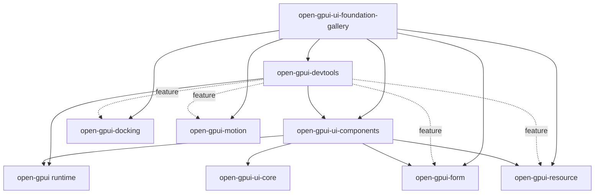
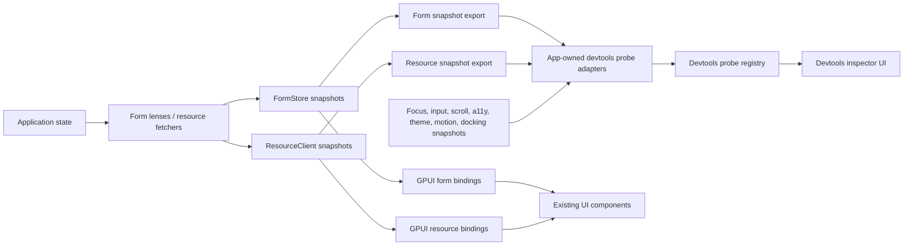
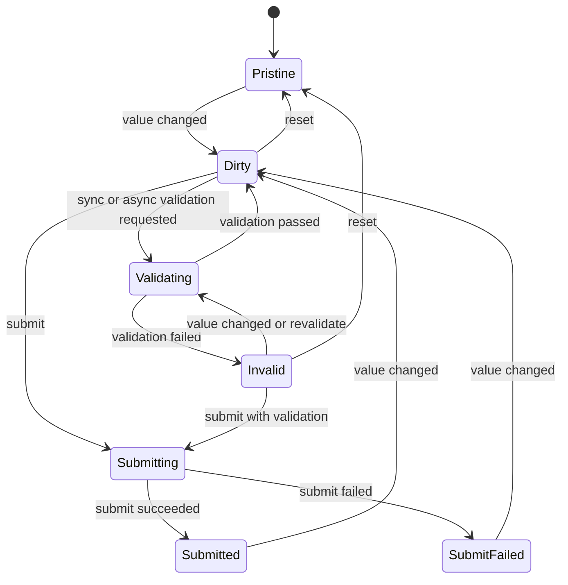
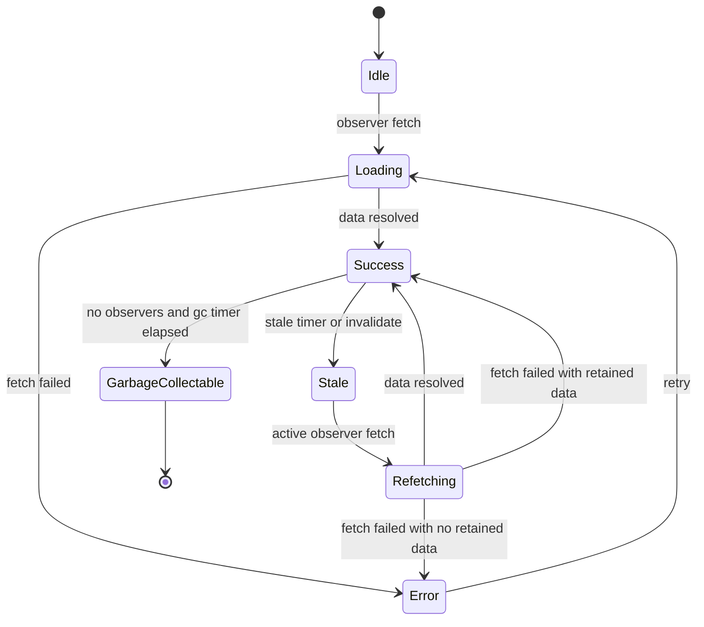

# Open GPUI DevTools, Form, and Resource Ecosystem Foundations - Plan

## Goal Capsule

| Field | Value |
|---|---|
| Objective | Add three optional first-party ecosystem foundations for Open GPUI: developer inspection tooling, headless form orchestration, and headless async resource state. |
| Authority | The user selected the earlier ecosystem items 2, 3, and 4 as acceptable scope and permitted cloning reference projects under `repo-ref/` for local study. |
| Release boundary | These are additive ecosystem crates and adapters. They should not break existing v0.2.0 public imports unless implementation uncovers an unavoidable crate-boundary conflict, in which case stop for review. |
| Execution profile | Multi-crate product foundation work with new workspace crates, focused adapters in `open-gpui-ui-components`, gallery samples, docs, and verification gates. |
| Stop conditions | Stop if a proposed dependency direction creates a cycle, if a public API would require storing app data beyond app-owned retention policy, or if devtools requires privileged mutation of GPUI runtime internals instead of snapshot-based inspection. |
| Tail ownership | `ce-work` or goal-mode implementation owns code changes, focused verification, review follow-up, commits, and push according to repo conventions and user instructions. |

---

## Product Contract

### Summary

Open GPUI already has a growing native UI substrate: components, motion, docking, multi-viewport support, canvas foundations, command surfaces, theme contracts, and gallery verification. The next highest-leverage ecosystem additions are not more leaf widgets. They are the missing app-building primitives that mature UI frameworks accumulate around the component library:

- `open-gpui-devtools`: inspect what the framework thinks happened, across layout, focus, accessibility, input, scroll, theme, motion, docking, forms, and resources.
- `open-gpui-form`: manage form values, field meta, validation, submission, and UI bindings without making every app write bespoke form state.
- `open-gpui-resource`: manage async query/mutation state, cache invalidation, retry, cancellation, and UI bindings without baking HTTP policy into components.

These should remain Cargo-first, source-first, and optional. The plan must not reintroduce a generated registry, CLI scaffold, or hosted component distribution path that the existing native UI framework strategy explicitly rejected.

### Problem Frame

The current repository has strong rendering and component contracts, but application authors still have to invent three pieces repeatedly:

1. **Observability:** When a UI misbehaves, developers need a first-party way to inspect element state, focus, hit testing, accessibility nodes, theme resolution, scroll windows, motion demand, docking trees, and app state projections. Today those facts exist mostly as tests, debug structs, or crate-local helpers.
2. **Form orchestration:** `Field`, `TextInput`, `Textarea`, `NumberInput`, `Checkbox`, `Radio`, `Select`, and related components exist, but there is no headless form owner for dirty/touched/visited/submitted state, field-level validation, async validation, debouncing, submit lifecycle, or reusable error projection.
3. **Async resource state:** Table, Tree, Command, VirtualizedList, and gallery samples already model loading/error/empty patterns, but there is no shared cache/observer/mutation primitive comparable to a headless query client. That pushes every app toward one-off loading state and invalidation logic.

Reference projects point toward the same design shape: TanStack Query and TanStack Form keep the hard state machines headless and adapter-driven; React Hook Form optimizes for low re-render pressure and external schema integration; AccessKit proves that custom-rendered UI frameworks need stable, inspectable accessibility trees; egui proves that immediate/custom-rendered toolkits need a strong inspection and debug story; gpui-component shows broad demand for app-level widgets and diagnostics, but also demonstrates why Open GPUI should keep core ecosystem primitives focused instead of stuffing every app feature into `ui_components`.

### Requirements

**DevTools**

- R1. Provide a renderer-neutral snapshot and probe model that can represent element/layout, focus, input dispatch, scroll viewport, accessibility, theme, motion, docking, form, and resource state.
- R2. Keep devtools read-only in v1. Selecting, highlighting, filtering, copying, and exporting snapshots are in scope; live property editing and runtime mutation are deferred.
- R3. Use stable IDs and serializable snapshot envelopes so tests, gallery samples, and downstream tools can consume the same facts.
- R4. Provide a native GPUI inspector surface and a gallery-hosted devtools page using existing UI components, without making application code depend on a devtools runtime by default.
- R5. Devtools must not retain sensitive app values by accident. Form and resource snapshots need redaction and summary hooks.

**Form**

- R6. Provide a headless form core for values, fields, dirty/touched/visited/submitted meta, sync validation, async validation, debouncing, cancellation, reset, and submit lifecycle.
- R7. Support both typed app-owned values through field lenses and dynamic forms through a map-backed value model.
- R8. Keep schema validation adapter-friendly, but do not hard-depend on a specific validation ecosystem in the core crate.
- R9. Provide GPUI component adapters that project form state into existing `Field`, `TextInput`, `Textarea`, `NumberInput`, `Checkbox`, `Radio`, `Select`, and related components instead of replacing those components.
- R10. Expose serializable, redacted form snapshots for devtools and tests.

**Resource**

- R11. Provide a headless resource core for query keys, cache entries, observers, stale/invalidate policy, retry/backoff, cancellation, pagination/infinite state, and mutation lifecycle.
- R12. Keep fetching protocol-agnostic. The resource crate may integrate with `open-gpui-http-client` through examples or adapters, but the core must not become an HTTP client.
- R13. Provide observer snapshots that UI components can render without owning cache internals.
- R14. Provide GPUI adapters for common loading/error/empty/retry projections in `Table`, `Tree`, `Command`, and `VirtualizedList` samples.
- R15. Expose serializable, redacted resource snapshots for devtools and tests.

**Cross-cutting**

- R16. New cores must be testable without a live GPUI window.
- R17. New adapters must preserve current Cargo-first distribution and the existing source-and-tests-as-contract strategy.
- R18. Public APIs must avoid dependency cycles among `open-gpui-ui-components`, `open-gpui-devtools`, `open-gpui-form`, and `open-gpui-resource`.
- R19. Gallery samples and docs must serve as adoption paths and verification gates, not marketing pages.

### Scope Boundaries

- In scope: new workspace crates for devtools, form, and resource; UI component adapters; gallery pages/samples; docs and verification updates; focused tests for headless state machines and adapters.
- In scope: local reference study under `repo-ref/`, including TanStack Query, TanStack Form, React Hook Form, AccessKit, egui, and gpui-component.
- Deferred: app shell kit, plugin/extension runtime, canvas collaboration adapters, charting, Markdown/HTML rendering, full code editor/LSP, mobile parity, hosted registries, and source-code component scaffolding.
- Outside this plan: publishing a release, adding a CLI installer, replacing GPUI runtime internals, or building a production remote devtools service.

### Success Criteria

- A developer can run the gallery, open the devtools page, and inspect framework facts from at least components, theme, accessibility, docking, forms, and resources.
- An application can build a validated form using existing UI components with no custom dirty/touched/async-validation state machine.
- An application can build a cached async table/tree/command/list sample with retry, stale invalidation, and mutation feedback without one-off cache code.
- Headless form and resource tests can run without a GPUI window.
- Devtools snapshots are serializable, redaction-aware, and covered by contract tests.

---

## Planning Contract

### Key Technical Decisions

- KTD1. Add three optional crates: `crates/devtools` as package `open-gpui-devtools`, `crates/form` as package `open-gpui-form`, and `crates/resource` as package `open-gpui-resource`.
- KTD2. Keep `open-gpui-form` and `open-gpui-resource` renderer-neutral by default. They should not depend on `open_gpui`, `open_gpui_ui_components`, or `open_gpui_devtools` in their core paths.
- KTD3. Put reusable GPUI-facing form and resource adapters in `open-gpui-ui-components`, because `ui_components` can depend on the headless cores without creating a cycle. Keep gallery-local modules limited to deterministic sample data, fake fetchers, and page wiring.
- KTD4. Let `open-gpui-devtools` depend on UI components for the inspector UI and optionally depend on form/resource/docking/motion features for specialized panels. Form and resource expose snapshots directly; they do not need to depend on devtools.
- KTD5. Use an observer/snapshot model, not a widget-owned model. TanStack Query/Form are the reference shape: core state lives in stores/caches, UI layers subscribe to snapshots.
- KTD6. Treat devtools as a probe registry plus inspector UI. Runtime owners contribute snapshots through explicit probe adapters; devtools does not become a second runtime authority.
- KTD7. Model form fields with stable `FieldPath`/`FieldId` plus typed lenses for structured app values. Provide a map-backed value model for dynamic forms and examples.
- KTD8. Model resources with deterministic `QueryKey` segments, `ResourceClient`, cache entries, observers, fetch generations, mutation records, and policy objects for stale time, garbage collection, retry, and cancellation.
- KTD9. Make every snapshot redaction-aware. Debuggability is valuable, but default devtools should avoid keeping full passwords, tokens, request bodies, or large cached payloads.
- KTD10. Use the gallery as the first integrated product surface. A standalone devtools example can follow after the gallery proves the API.

### Dependency Direction



The important rule is one-way ownership: form/resource cores do not depend on UI or devtools, and UI components do not depend on devtools.

### Runtime Model



### Form State Model



### Resource State Model



### Sources and Research Inputs

Local repository sources:

- `README.md`
- `docs/architecture/native-ui-framework-strategy.md`
- `docs/knowledge/engineering/current-state.md`
- `docs/knowledge/engineering/decisions/open-gpui-ui-productization-roadmap.md`
- `docs/knowledge/engineering/decisions/open-gpui-native-ui-framework-distribution-strategy.md`
- `docs/verification.md`
- `crates/ui_components/README.md`
- `crates/motion/README.md`
- `crates/gpui_docking/README.md`
- `crates/canvas/README.md`
- `crates/gpui_web/README.md`

Reference projects cloned or already present under `repo-ref/`:

- `repo-ref/tanstack-query` - headless query client, cache, observers, mutations, focus/online managers, retryer.
- `repo-ref/tanstack-form` - headless form API, field API, validators, async debounce, typed path concepts.
- `repo-ref/react-hook-form` - low re-render form ergonomics, external resolver integration, UI-library interoperability.
- `repo-ref/accesskit` - stable accessibility tree schema for custom-rendered UI toolkits.
- `repo-ref/egui` - custom-rendered toolkit with strong debug/inspection culture and AccessKit integration.
- `repo-ref/gpui-component` - GPUI ecosystem breadth signal: components, tables, markdown/html, charts, editor, web gallery.

### Assumptions

- The user wants items 2, 3, and 4 from the earlier recommendation: DevTools/Inspector, Form, and Resource.
- The first version should be additive and optional.
- `repo-ref/*` remains ignored and excluded from the workspace.
- The first devtools surface should be read-only and local. Remote inspection, time travel, and live editing can be separate follow-up plans.
- App-kit, plugin runtime, and canvas collaboration are useful later, but intentionally out of this plan.

### Risk Analysis and Mitigation

| Risk | Mitigation |
|---|---|
| New crates create dependency cycles. | Enforce one-way dependencies: headless cores at the bottom, UI adapters above them, devtools consuming snapshots rather than owning core state. |
| Form API becomes too clever for Rust ergonomics. | Start with typed lenses plus a dynamic map-backed model; defer derive macros until real examples prove the shape. |
| Resource crate accidentally becomes an HTTP client. | Keep fetch protocol-agnostic; HTTP integrations live in examples or optional adapter modules. |
| Devtools exposes sensitive app data. | Add redaction policy and summary hooks before displaying form values or cached resource payloads. |
| Devtools requires runtime mutation hooks. | Keep v1 read-only and snapshot-based; select/highlight/export are allowed, live mutation is deferred. |
| The plan is too broad for one change set. | Land vertical slices in dependency order and keep each unit independently testable. |

---

## Implementation Units

### U1. Add workspace crates and public boundaries

- **Goal:** Establish additive package boundaries for the three ecosystem foundations without implementing the full behavior yet.
- **Requirements:** R16, R17, R18.
- **Dependencies:** None.
- **Files:** Modify `Cargo.toml`. Create `crates/form/Cargo.toml`, `crates/form/src/lib.rs`, `crates/resource/Cargo.toml`, `crates/resource/src/lib.rs`, `crates/devtools/Cargo.toml`, `crates/devtools/src/lib.rs`, and minimal crate README files if the repository convention requires them.
- **Approach:** Add workspace members and workspace dependencies for `open_gpui_form`, `open_gpui_resource`, and `open_gpui_devtools`. Keep form/resource default features free of GPUI dependencies. Give devtools feature flags for `form`, `resource`, `docking`, and `motion` panels.
- **Test scenarios:** `cargo metadata` includes the new members; form/resource compile without GPUI feature dependencies; devtools compiles with default read-only snapshot types; workspace dependency names follow existing `open_gpui_*` conventions.
- **Verification:** Run focused `cargo check` for the three new crates before adding adapters.

### U2. Implement the devtools snapshot and probe model

- **Goal:** Provide the common inspection data model that later panels and tests can consume.
- **Requirements:** R1, R2, R3, R5, R10, R15, R18.
- **Dependencies:** U1.
- **Files:** Create or modify `crates/devtools/src/snapshot.rs`, `crates/devtools/src/probe.rs`, `crates/devtools/src/registry.rs`, `crates/devtools/src/redaction.rs`, `crates/devtools/src/panel.rs`, `crates/devtools/src/lib.rs`, and `crates/devtools/tests/snapshot_contracts.rs`.
- **Approach:** Define `DevtoolsProbe`, `ProbeId`, `SnapshotKind`, `SnapshotEnvelope`, `SnapshotTree`, `SnapshotNode`, redaction summaries, and a registry that collects snapshots from app-owned probes. Keep payloads serializable and avoid retaining borrowed runtime objects.
- **Test scenarios:** Probes can register/unregister; snapshots preserve stable IDs and timestamps; redaction removes configured values while keeping summary metadata; registry collection is deterministic enough for tests; malformed or unavailable probes produce diagnostic entries instead of panics.
- **Verification:** Run `cargo nextest run -p open-gpui-devtools snapshot probe redaction --no-fail-fast --locked`.

### U3. Implement the headless form core

- **Goal:** Add the renderer-neutral form state machine, field model, validation lifecycle, and snapshot contracts.
- **Requirements:** R6, R7, R8, R10, R16.
- **Dependencies:** U1.
- **Files:** Create or modify `crates/form/src/form.rs`, `crates/form/src/field.rs`, `crates/form/src/lens.rs`, `crates/form/src/meta.rs`, `crates/form/src/validation.rs`, `crates/form/src/submit.rs`, `crates/form/src/snapshot.rs`, `crates/form/src/redaction.rs`, `crates/form/src/error.rs`, `crates/form/src/lib.rs`, and `crates/form/tests/form_lifecycle.rs`.
- **Approach:** Implement `FormStore`, `FieldPath`, `FieldId`, `FieldLens`, field metadata, sync validator traits, async validation generations, debounced validation policy, reset, submit lifecycle, and redacted `FormSnapshot`. Provide a map-backed value model for dynamic examples.
- **Test scenarios:** Field value changes set dirty/touched/visited meta; sync validation blocks submit; async validation cancels stale generations; debounce suppresses redundant validator runs; reset restores initial state; redacted snapshots hide sensitive field values while keeping meta and error counts.
- **Verification:** Run `cargo nextest run -p open-gpui-form lifecycle validation async_validation snapshot --no-fail-fast --locked`.

### U4. Add form adapters and gallery samples

- **Goal:** Bind headless form state to existing GPUI components without replacing the component library.
- **Requirements:** R9, R10, R17, R19.
- **Dependencies:** U3.
- **Files:** Modify or create `crates/ui_components/src/form_adapter.rs`, `crates/ui_components/src/lib.rs`, `crates/ui_components/tests/form_adapter.rs`, `examples/ui-foundation-gallery/src/pages/components/samples/form.rs`, `examples/ui-foundation-gallery/src/pages/components/runtime/form.rs`, and gallery catalog metadata where appropriate.
- **Approach:** Add adapter helpers that project `FieldSnapshot` and `FormSnapshot` into `Field`, `TextInput`, `Textarea`, `NumberInput`, `Checkbox`, `Radio`, `Select`, and submit/reset controls. Keep app-owned values outside components; adapters only translate events and render state.
- **Test scenarios:** Text, number, checkbox, select, and textarea controls update form values; validation errors render through existing field/error states; submit disables while pending; reset restores UI state; gallery smoke can fill, validate, submit, and inspect state readouts.
- **Verification:** Run `cargo nextest run -p open-gpui-ui-components form_adapter --no-fail-fast --locked` and focused gallery form smoke tests.

### U5. Implement the headless resource core

- **Goal:** Add query/mutation state, cache ownership, observers, invalidation, retry, cancellation, pagination, and snapshot contracts.
- **Requirements:** R11, R12, R13, R15, R16.
- **Dependencies:** U1.
- **Files:** Create or modify `crates/resource/src/key.rs`, `crates/resource/src/client.rs`, `crates/resource/src/cache.rs`, `crates/resource/src/query.rs`, `crates/resource/src/observer.rs`, `crates/resource/src/fetch.rs`, `crates/resource/src/mutation.rs`, `crates/resource/src/pagination.rs`, `crates/resource/src/policy.rs`, `crates/resource/src/snapshot.rs`, `crates/resource/src/redaction.rs`, `crates/resource/src/error.rs`, `crates/resource/src/lib.rs`, and `crates/resource/tests/resource_lifecycle.rs`.
- **Approach:** Implement deterministic `QueryKey`, `ResourceClient`, cache entries, observer subscriptions, fetch generations, retry/backoff policy, stale/invalidate behavior, cancellation, mutation lifecycle, and redacted `ResourceSnapshot`. Keep fetchers user-supplied futures.
- **Test scenarios:** Equal query keys share cache entries; observer count controls active state; invalidation marks stale and triggers refetch when observed; retry policy backs off and stops; cancellation drops stale fetch results; mutation success invalidates configured keys; pagination/infinite observers preserve page order and cursor metadata; snapshots redact payloads by default.
- **Verification:** Run `cargo nextest run -p open-gpui-resource cache observer retry mutation pagination snapshot --no-fail-fast --locked`.

### U6. Add resource adapters and gallery samples

- **Goal:** Reuse resource state across data-heavy UI components and command surfaces.
- **Requirements:** R13, R14, R15, R17, R19.
- **Dependencies:** U5.
- **Files:** Modify or create `crates/ui_components/src/resource_adapter.rs`, `crates/ui_components/src/lib.rs`, `crates/ui_components/tests/resource_adapter.rs`, `examples/ui-foundation-gallery/src/pages/components/samples/resource.rs`, `examples/ui-foundation-gallery/src/pages/components/runtime/resource.rs`, and focused Table/Tree/Command/VirtualizedList sample wiring.
- **Approach:** Add projection helpers for loading, error, empty, retry, stale, refreshing, and mutation-pending states. Start with gallery-owned fake fetchers so behavior is deterministic. Integrate with `Table`, `Tree`, `Command`, and `VirtualizedList` samples through snapshots rather than component-owned caches.
- **Test scenarios:** Table sample renders loading, success, stale refresh, error retry, and mutation feedback; Tree lazy branch loads through a resource query; Command provider can show loading/error/empty resource states; VirtualizedList can render paginated/infinite pages; gallery smoke proves retry and invalidation update visible state.
- **Verification:** Run `cargo nextest run -p open-gpui-ui-components resource_adapter --no-fail-fast --locked` and focused gallery resource smoke tests.

### U7. Build the native devtools inspector surface

- **Goal:** Turn the snapshot/probe model into an actual local inspection UI.
- **Requirements:** R1, R2, R3, R4, R5, R10, R15, R19.
- **Dependencies:** U2, U3, U4, U5, U6.
- **Files:** Create or modify `crates/devtools/src/gpui.rs`, `crates/devtools/src/views/mod.rs`, `crates/devtools/src/views/elements.rs`, `crates/devtools/src/views/a11y.rs`, `crates/devtools/src/views/theme.rs`, `crates/devtools/src/views/motion.rs`, `crates/devtools/src/views/docking.rs`, `crates/devtools/src/views/forms.rs`, `crates/devtools/src/views/resources.rs`, `examples/ui-foundation-gallery/src/pages/devtools.rs`, gallery navigation files, and `crates/devtools/tests/inspector_contracts.rs`.
- **Approach:** Build read-only panels over `SnapshotEnvelope` data using existing tabs, tree/table/list, field, badge, command, and split components. Start with gallery-hosted inspection of gallery-owned probes, then expose a reusable `DevtoolsInspector` element for apps.
- **Test scenarios:** Inspector renders multiple snapshot kinds; filtering and selection do not mutate app state; copied/exported snapshot JSON is redacted; unavailable optional panels show diagnostics; gallery devtools smoke can inspect form and resource samples after interactions; docking/theme/a11y probes render stable rows.
- **Verification:** Run `cargo nextest run -p open-gpui-devtools inspector --no-fail-fast --locked` and focused gallery devtools smoke tests.

### U8. Document, verify, and prepare adoption path

- **Goal:** Make the new ecosystem foundations discoverable and guarded by the repository's existing verification style.
- **Requirements:** R17, R19.
- **Dependencies:** U1, U2, U3, U4, U5, U6, U7.
- **Files:** Modify `README.md`, `docs/verification.md`, `crates/form/README.md`, `crates/resource/README.md`, `crates/devtools/README.md`, `crates/ui_components/README.md`, and gallery documentation or contract tables as needed.
- **Approach:** Document the additive crates, dependency direction, examples, redaction policy, and focused test commands. Add verification entries for form/resource/devtools and gallery smoke coverage.
- **Test scenarios:** README examples compile or have matching tests; docs mention redaction and protocol-agnostic resource policy; verification commands map to real packages and tests; gallery catalog references the new samples.
- **Verification:** Run the full focused verification contract below.

---

## Verification Contract

Focused checks while implementing:

```powershell
cargo fmt -p open-gpui-form -p open-gpui-resource -p open-gpui-devtools -p open-gpui-ui-components -p open-gpui-ui-foundation-gallery --check
cargo check -p open-gpui-form -p open-gpui-resource -p open-gpui-devtools --tests --locked
cargo nextest run -p open-gpui-form --no-fail-fast --locked
cargo nextest run -p open-gpui-resource --no-fail-fast --locked
cargo nextest run -p open-gpui-devtools --no-fail-fast --locked
cargo nextest run -p open-gpui-ui-components form_adapter resource_adapter --no-fail-fast --locked
cargo nextest run -p open-gpui-ui-foundation-gallery form resource devtools --no-fail-fast --locked
```

Integration checks before landing:

```powershell
cargo check -p open-gpui-ui-foundation-gallery --tests --locked
cargo nextest run -p open-gpui-ui-components --no-fail-fast --locked
cargo nextest run -p open-gpui-ui-foundation-gallery --no-fail-fast --locked
cargo run -p xtask -- scan-ui-contract
cargo run -p xtask -- scan-theme-drift
cargo run -p xtask -- scan-theme-schema
```

Manual dogfood after automated checks:

```powershell
cargo run -p open-gpui-ui-foundation-gallery -- --page components
cargo run -p open-gpui-ui-foundation-gallery -- --page devtools
```

## Definition of Done

- `open-gpui-form`, `open-gpui-resource`, and `open-gpui-devtools` exist as workspace crates with clear README ownership boundaries.
- Form and resource cores compile and test without live GPUI windows.
- UI component adapters cover at least text input, checkbox, select, textarea, table, tree, command, and virtualized-list use cases through existing components.
- Devtools provides a read-only GPUI inspector surface and gallery page.
- Form/resource/devtools snapshots are serializable and redaction-aware.
- Gallery samples demonstrate form validation/submission, resource loading/retry/invalidation, and devtools inspection.
- `README.md` and `docs/verification.md` document adoption and focused verification commands.
- Focused verification commands pass, or any platform-specific failures are documented with exact command output and next action.

## Open Questions

- Should `open-gpui-devtools` eventually be split into a headless `open-gpui-inspect` crate plus a GPUI inspector UI crate, or is a feature-gated single crate enough for the first version?
- Should typed form lenses ship first as hand-written closures only, or should a later derive macro be planned once examples stabilize?
- Should resource cache persistence be a follow-up adapter over existing canvas/persistence work, or remain out of scope until real apps request offline behavior?
