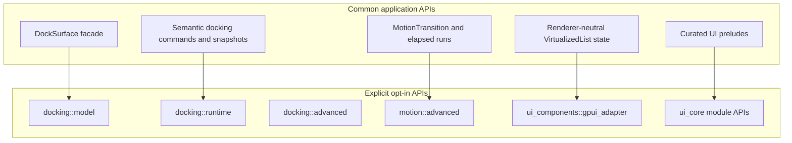

# Open GPUI v0.3 API Freeze and Facade Maturity - Plan

## Goal Capsule

| Field | Value |
|---|---|
| Objective | Freeze the v0.3 public API model by making ordinary docking, motion, UI component, and UI core usage go through mature facades while low-level runtime/model/adapter contracts stay behind explicit opt-in paths. |
| Authority | The user explicitly permits breaking v0.2-era public APIs, deleting unneeded code, fearless refactors, subagent review, incremental commits, and main-branch landing. |
| Release boundary | User-facing breaks are v0.3.0 work because v0.2.0 has already shipped. Do not add deprecation aliases unless a local test proves an alias is needed for internal migration. |
| Execution profile | Cross-crate public API refactor touching Rust exports, first-party consumers, tests, docs, examples, xtask gates, and release guidance. |
| Stop conditions | Stop only for a scope-changing product decision, a platform capability contradiction, or a verification blocker that cannot be resolved without changing this plan's API model. |
| Landing strategy | Work directly on the current branch only because the user has repeatedly authorized main-branch work; keep commits logical and do not stage unrelated user changes. |

---

## Product Contract

### Summary

Open GPUI should read like a general UI framework: common users import facades and semantic commands, while framework authors deliberately opt into advanced model, runtime, adapter, or diagnostic layers. The v0.3 break should remove accidental dependency traps now, before downstream code treats raw graph IDs, `Instant` lifecycles, GPUI adapter traits, and internal anatomy as stable framework concepts.

### Problem Frame

The previous v0.3 stabilization pass narrowed several root and prelude leaks, but the remaining risk is deeper than direct re-exports. Docking users still need low-level model/runtime concepts for embedded host views, semantic snapshots, programmatic detach, and complete multiviewport restore. Motion has a duration-first facade, but `Instant` lifecycle APIs remain public and first-party consumers still exercise them. UI components have a useful contract inventory, but adapter-only helpers still have multiple public paths and some root/prelude/common/default exports are not forced through a single owner map. The current text scanners catch many leaks, but they do not inspect the real Rust public API graph.

### Requirements

- R1. Every common API surface must have an owned tier: `common`, `prelude`, `root`, `advanced`, `model`, `runtime`, `gpui_adapter`, or `internal`.
- R2. A normal docking app must embed a dock surface inside an existing window, inspect semantic panel state, run semantic panel commands, detach panels to platform viewports, and restore saved placement without importing `DockController`, `DockNodeId`, `DockHost`, or `DockViewportRuntimeHandle`.
- R3. Docking platform viewport paths must fail closed when policy or backend capability denies platform windows, including facade and explicit runtime paths.
- R4. Docking durable layout must expose stable user-facing persistence/read APIs while raw graph/node layout construction stays in `model` or another explicit low-level tier.
- R5. Motion public time must be elapsed/sample based. `Instant` storage and conversion belong to adapter code, not public run/controller/timeline lifecycle APIs.
- R6. First-party motion consumers in UI components, UI core, and docking must prove the elapsed-time boundary by not depending on motion-owned `Instant` lifecycle APIs.
- R7. Motion vocabulary must keep product intent and execution model separate: root is for `MotionTransition`, intents, runs, clocks, frame demand, geometry/projection; raw specs, models, controllers, frame hosts, and scalar execution stay advanced or internal.
- R8. UI component common/default/root/prelude exports must be fully classified by the component contract inventory or by a tiny intentional allowlist.
- R9. GPUI adapter-only helpers must have one deliberate public path. `UiA11yElementExt`, `VirtualizedListGpuiExt`, and any scroll-handle adapter helper cannot leak from the common prelude unless explicitly accepted as permanent exceptions.
- R10. `VirtualizedList` must remain a rich component-library primitive, not label-only, while renderer-neutral state/snapshot/descriptor/context contracts avoid GPUI runtime types.
- R11. `ui_core::prelude` should stay narrow and headless; table, virtualizer, grid, split, and other advanced vocabularies remain available through module-level paths or preludes.
- R12. Public API checks must include a real API snapshot or graph-derived gate in addition to existing text sentinels.
- R13. README, changelog, release inventory, and verification docs must describe user-facing migration groups rather than implementation churn.

### Scope Boundaries

- In scope: breaking exports and method signatures for v0.3.0, facade additions needed to replace low-level common usage, first-party consumer migrations, contract tests, xtask gates, docs, examples, and release inventory.
- In scope: deleting old aliases, tests, docs, and helper modules that exist only to preserve the pre-freeze API shape.
- Deferred: a full ImGui feature clone, full animation authoring DSLs, keyframe/storyboard/presence systems, new visual component designs, new release automation beyond checks needed by this plan.
- Out of scope: publishing v0.3.0, manual GitHub Release note authoring, unrelated dependency upgrades, and visual redesign of examples.

### Success Criteria

- Docking common examples and tests use `DockSurface` for embedded hosts, semantic panel operations, multiviewport detach/open, placement export/check/restore, and close lifecycle.
- Motion common tests and first-party consumers use elapsed `Duration`/clock samples rather than public `Instant` lifecycle APIs.
- UI component public surface tests prove all default/common/prelude exports have classified ownership and adapter-only helpers have intentional paths.
- `ui_core::prelude` stays headless and narrow.
- A public API snapshot or graph-based xtask gate catches leaks that source text scanners miss.
- Docs and changelog explain v0.3 migration in user language without manual line wrapping or duplicated low-level details.

---

## Planning Contract

### Key Technical Decisions

- KTD1. Treat this as the v0.3 freeze, not another compatibility cleanup. If an API encourages the wrong dependency shape, remove or move it directly.
- KTD2. Add facade replacements before removing low-level common paths. Users should lose accidental access, not lose capability.
- KTD3. Preserve power-user access through explicit modules. `model`, `runtime`, `advanced`, and `gpui_adapter` are allowed escape hatches, but they must be named and tested as escape hatches.
- KTD4. Prefer semantic facts over graph facts in docking common APIs. Panel ids, dockspace ids, placement targets, viewport specs, and close outcomes are common vocabulary; node ids and graph actions are model vocabulary.
- KTD5. Make elapsed time the motion contract. Adapters may own `Instant`, but motion runs/controllers sample elapsed time and publish clamp/reset metadata.
- KTD6. Make the component contract the authority for UI exports. Extra public tokens are allowed only when they are explicitly classified.
- KTD7. Use real public API data for freeze checks. Text scans remain fast diagnostics; snapshots or rustdoc/public-api analysis become the authoritative gate.

### System Shape

### Priority Order

1. Add public API snapshot/tier gates so later breaks are mechanically enforced.
2. Mature `DockSurface` enough that common users no longer need model/runtime.
3. Remove motion `Instant` lifecycle APIs and migrate first-party consumers.
4. Lock UI component ownership and adapter-only paths.
5. Update docs, release inventory, examples, and full verification.

### Risks and Mitigations

| Risk | Mitigation |
|---|---|
| Facade gaps force users back to low-level docking APIs after the break. | Add embedded host, semantic snapshot, semantic commands, detach/open, and placement restore facade before removing common access. |
| Public API snapshot tooling depends on nightly or unavailable cargo plugins. | Implement the gate as an optional fast path when available and keep a deterministic fallback based on generated rustdoc JSON or checked-in tier manifests. |
| Motion refactor breaks docking/UI animation behavior. | Characterize current samples, retargeting, reduced motion, and frame demand before replacing `Instant` lifecycle paths. |
| UI contract inventory becomes noisy. | Require all root/common/prelude/default tokens to be classified, but keep the allowlist small and documented in tests. |
| Large cross-crate compile break becomes hard to repair. | Commit after each green unit and keep first-party migrations grouped by crate and ownership tier. |

---

## Implementation Units

### U1. Add real public API snapshot and tier manifests

- **Goal:** Make v0.3 public API boundaries enforceable beyond source text scans.
- **Requirements:** R1, R8, R9, R11, R12.
- **Dependencies:** None.
- **Files:** Modify `xtask/src/main.rs`, `xtask/src/ui_contract.rs`, `docs/verification.md`, `crates/gpui_docking/src/public_surface_tests.rs`, `crates/motion/tests/public_contracts.rs`, `crates/ui_components/tests/public_surface/exports.rs`, `crates/ui_components/tests/public_surface/manifest.rs`, `crates/ui_components/tests/support/public_surface/mod.rs`, `crates/ui_core/tests/headless_contracts.rs`. Create `xtask/src/public_api_snapshot.rs` and `docs/public-api/` or `crates/*/tests/public_surface/*.snap` only if the implementation needs persisted snapshots.
- **Approach:** Add a crate-tier manifest for docking, motion, UI components, and UI core. Use `cargo-public-api` or rustdoc JSON when available to produce a real public API inventory; fall back to deterministic compile/text gates where the local toolchain cannot produce JSON. Existing string sentinels stay as fast error messages, but the new gate owns the freeze decision.
- **Execution note:** Run an initial check against the current tree before changing exports so failures identify current leaks.
- **Patterns to follow:** `xtask/src/ui_contract.rs`, `crates/ui_components/tests/public_surface/manifest.rs`, `crates/gpui_docking/src/public_surface_tests.rs`.
- **Test scenarios:** `open_gpui_docking::DockController` is forbidden while `open_gpui_docking::model::DockController` is allowed; `open_gpui_motion::MotionExecutionPlan` is forbidden while `open_gpui_motion::advanced::MotionExecutionPlan` is allowed until U5 decides its final tier; `open_gpui_ui_components::prelude::TextInputController` is forbidden while `gpui_adapter::TextInputController` is allowed; `ui_core::prelude` rejects table/virtualizer/split additions unless allowlisted.
- **Verification:** `cargo run -p xtask -- scan-public-api --check` or the chosen equivalent passes and is wired into `cargo run -p xtask -- verify`.

### U2. Add embedded docking host and semantic read facade

- **Goal:** Let applications render and inspect docking surfaces without touching controller, host, graph, or node internals.
- **Requirements:** R2, R4.
- **Dependencies:** U1.
- **Files:** Modify `crates/gpui_docking/src/surface.rs`, `crates/gpui_docking/src/surface/panel.rs`, `crates/gpui_docking/src/lib.rs`, `crates/gpui_docking/src/prelude.rs`, `crates/gpui_docking/src/public_surface_tests.rs`, `crates/gpui_docking/src/surface_tests.rs`, `examples/docking-minimal/src/main.rs`, `crates/gpui_docking/README.md`.
- **Approach:** Add an embedded host facade such as a `DockSurface` method that returns the common renderable host view for a `DockSpaceId`. Add semantic read APIs for spaces, registered panels, selected panel, panel location, floating panels, viewport-open status, and exported layout. Keep raw graph/node snapshots in `model`.
- **Execution note:** Characterize the current need to reach `DockController` or `DockHost`, then migrate tests/examples to the new facade.
- **Patterns to follow:** `DockSurface::open_primary_window`, `DockHost`, `DockPanelCatalog`, `DockLayout`, existing surface tests.
- **Test scenarios:** A minimal app can create a `DockSurface`, register panels, and embed the primary dock area in a host view using only prelude/common imports; semantic snapshots report selected and floating panels without exposing `DockNodeId`; exported layout remains stable and raw graph layout construction is absent from common tests.
- **Verification:** `cargo nextest run -p open-gpui-docking surface --no-fail-fast` and docking public-surface tests pass.

### U3. Add semantic docking commands and viewport restore facade

- **Goal:** Replace common low-level docking operations with semantic panel and viewport commands.
- **Requirements:** R2, R3, R4.
- **Dependencies:** U1, U2.
- **Files:** Modify `crates/gpui_docking/src/surface/panel.rs`, `crates/gpui_docking/src/surface/viewport.rs`, `crates/gpui_docking/src/viewport_runtime_handle.rs`, `crates/gpui_docking/src/policy.rs`, `crates/gpui_docking/src/host_viewport_platform_capability_tests.rs`, `crates/gpui_docking/src/host_viewport_placement_tests.rs`, `crates/gpui_docking/src/host_viewport_lifecycle_tests.rs`, `examples/docking-multiviewport/src/main.rs`, `examples/docking-native/src/main.rs`.
- **Approach:** Add `DockSurface` commands for select/focus/zoom/reopen/close/float/dock/move/raise/set-floating-bounds by panel and placement concepts. Add programmatic detach/open viewport APIs by panel or space, a placement restore batch helper keyed by `DockSpaceId`, and typed unavailable outcomes for invalid placement, unsupported backend, and policy disabled. Ensure explicit runtime opens cannot bypass platform viewport policy unless the method name says unchecked and remains outside common paths.
- **Execution note:** Add failing tests for policy bypass and missing restore report shape before implementation.
- **Patterns to follow:** `DockSurface::open_viewport_spec`, `DockSurface::export_viewport_placement`, `DockSurface::check_viewport_placement_restore`, `DockViewportRuntimeHandle`, existing viewport tests.
- **Test scenarios:** Facade and runtime paths fail closed when policy denies platform viewports; backend-unsupported returns typed unavailability without mutating runtime state; saved placement restore can open a batch and returns outcomes keyed by space; panel detach moves a registered panel into a viewport without exposing node ids; close/merge/prevent policies still work through facade callbacks.
- **Verification:** Docking viewport lifecycle, route, placement, and platform capability tests pass.

### U4. Break and stabilize docking low-level tiers

- **Goal:** Complete the v0.3 docking API break after facade coverage exists.
- **Requirements:** R1, R2, R3, R4, R13.
- **Dependencies:** U1, U2, U3.
- **Files:** Modify `crates/gpui_docking/src/lib.rs`, `crates/gpui_docking/src/prelude.rs`, `crates/gpui_docking/src/model.rs`, `crates/gpui_docking/src/runtime.rs`, `crates/gpui_docking/src/advanced.rs`, `crates/gpui_docking/src/layout.rs`, `crates/gpui_docking/src/builder.rs`, `crates/gpui_docking/src/controller.rs`, `crates/gpui_docking/src/public_surface_tests.rs`, docking tests and examples that import old root/prelude internals.
- **Approach:** Remove raw controller, host, node, action, raw layout builder, and runtime handle exposure from root/prelude. Keep explicit `model`, `runtime`, and `advanced` imports for framework authors. If `DockLayout` common APIs expose raw nodes too strongly, introduce stable read/persistence helpers and move raw construction to `model`.
- **Execution note:** Expect compile failures after removals; migrate by import tier instead of re-exporting removed symbols.
- **Patterns to follow:** Current `model.rs`, `runtime.rs`, `advanced.rs`, `DockSurface` facade methods from U2/U3.
- **Test scenarios:** Common imports can build and restore ordinary surfaces; low-level imports compile only through explicit modules; public API snapshot rejects `DockNodeId` and `DockViewportRuntimeHandle` in common signatures; wasm checks still fail closed for platform viewport windows.
- **Verification:** `cargo nextest run -p open-gpui-docking --no-fail-fast` and wasm docking-related checks pass.

### U5. Remove public motion `Instant` lifecycle APIs and add elapsed epoch

- **Goal:** Make motion's public lifecycle deterministic and adapter-owned.
- **Requirements:** R5, R6, R7.
- **Dependencies:** U1.
- **Files:** Modify `crates/motion/src/lib.rs`, `crates/motion/src/controller.rs`, `crates/motion/src/frame_host.rs`, `crates/motion/src/transition.rs`, `crates/motion/src/runtime.rs`, `crates/motion/src/spring.rs`. Create `crates/motion/src/clock.rs` if needed. Modify `crates/motion/tests/public_contracts.rs`.
- **Approach:** Add a `MotionEpoch` or equivalent elapsed-time helper that records elapsed, delta, clamp state, and reset reason without storing `Instant`. Remove or demote `MotionClockSample::from_instant`, `MotionClockSample::from_instants`, `MotionProgressExecution::start(... Instant)`, `sample_since(Instant)`, and public `MotionTimeline`/`MotionSpring` lifecycle methods that store `Instant`. Keep pure `sample_elapsed` behavior for deterministic testing.
- **Execution note:** First add tests that prove non-monotonic elapsed clamps and reset epochs behave as desired.
- **Patterns to follow:** `MotionClockSample::from_elapsed`, `MotionFrameDriver`, `MotionFrameHost`, `MotionTimeline::sample_elapsed`, `MotionSpring::sample_elapsed`.
- **Test scenarios:** Public root/common lifecycle contains no `Instant` constructors or samplers; elapsed samples match current timeline/spring values; reduced motion completes immediately; non-monotonic elapsed clamps delta to zero and marks the sample clamped; frame demand remains query-based rather than exhaustive-match based.
- **Verification:** `cargo nextest run -p open-gpui-motion --no-fail-fast` and motion public contracts pass.

### U6. Migrate first-party motion consumers and freeze motion vocabulary

- **Goal:** Prove the motion boundary by updating docking, UI components, and UI core to use elapsed motion facades.
- **Requirements:** R5, R6, R7, R13.
- **Dependencies:** U1, U5.
- **Files:** Modify `crates/ui_components/src/splitter.rs`, `crates/ui_components/src/virtualized_list/motion.rs`, `crates/gpui_docking/src/transition_executor.rs`, `crates/gpui_docking/src/presentation_commands.rs`, `crates/ui_core/src/split.rs`, `crates/motion/src/lib.rs`, `crates/motion/src/advanced.rs`, `crates/motion/src/motion.rs`, `crates/motion/src/spring.rs`, `crates/motion/src/sequence.rs`, `crates/motion/README.md`.
- **Approach:** Convert first-party consumers to store adapter-local `Instant` only long enough to compute elapsed `Duration`, then sample motion through `MotionTransition`, `MotionProgressRun`, `MotionScalarRun`, `MotionClockSample`, or `MotionEpoch`. Rename or demote overlapping terms: `MotionSpec` becomes timeline-specific or advanced, `MotionModel` stays advanced/internal, broad raw `MotionSequence` remains advanced while root keeps progress-specific names.
- **Execution note:** Remove old root names directly after consumers are migrated; do not keep compatibility aliases for names introduced during v0.2 development unless compile churn proves they are needed internally.
- **Patterns to follow:** Existing motion public contracts, splitter and virtualized-list behavior tests, docking host transition tests.
- **Test scenarios:** Splitter programmatic motion uses elapsed runs while pointer drag stays immediate; virtualized-list active indicator retarget/cancel/finish resets epoch correctly; docking transition executor retargets from the current sample without owning motion `Instant`; `ui_core::split` no longer depends on `MotionSpec` when only reduced/final-state policy is needed; root exports no longer expose low-level specs/models/controllers unless intentionally kept.
- **Verification:** Motion tests, UI component splitter/virtualized-list tests, UI core headless contracts, and docking transition tests pass.

### U7. Lock UI component ownership and adapter-only paths

- **Goal:** Make `ui_components` exports match the component-library contract instead of accidental module paths.
- **Requirements:** R1, R8, R9, R10, R13.
- **Dependencies:** U1.
- **Files:** Modify `crates/ui_components/src/lib.rs`, `crates/ui_components/src/prelude.rs`, `crates/ui_components/src/public_api/common.rs`, `crates/ui_components/src/public_api/default.rs`, `crates/ui_components/src/component_contract/rows/catalog.rs`, `crates/ui_components/src/virtualized_list/mod.rs`, `crates/ui_components/src/virtualized_list/runtime.rs`, `crates/ui_components/src/scroll_area.rs`, `crates/ui_components/tests/public_surface/exports.rs`, `crates/ui_components/tests/public_surface/adapter.rs`, `crates/ui_components/tests/public_surface/inventory.rs`, `crates/ui_components/tests/support/public_surface/mod.rs`.
- **Approach:** Remove `UiA11yElementExt` from prelude unless it is deliberately reclassified as a permanent exception. Make `VirtualizedListGpuiExt` and any scroll-handle helper public through `gpui_adapter` only, or encode the exact allowed narrow module path in tests. Require root/common/default/prelude exports to map to contract rows or a tiny explicit allowlist. Extend renderer-neutral scans from `*State` to snapshots, descriptors, contexts, changes, activations, and behavior snapshots.
- **Execution note:** Run the current public-surface tests before edits to record which tokens are unclassified.
- **Patterns to follow:** `crates/ui_components/tests/public_surface/adapter.rs`, `crates/ui_components/tests/public_surface/exports.rs`, `crates/ui_components/src/component_contract/rows/catalog.rs`, `gpui_adapter` exports in `lib.rs`.
- **Test scenarios:** `UiA11yElementExt` cannot be imported from prelude unless allowlisted; `VirtualizedListGpuiExt` has only the allowed adapter path; all root/common/default/prelude tokens are classified; renderer-neutral contracts reject `Window`, `App`, `IntoElement`, `ScrollHandle`, `FocusHandle`, and `Entity<` in non-adapter public structs.
- **Verification:** `cargo nextest run -p open-gpui-ui-components public_surface --no-fail-fast` or equivalent public-surface tests pass.

### U8. Narrow UI core prelude and preserve module-level advanced access

- **Goal:** Keep UI core's foundation prelude stable while advanced table, virtualizer, split, and grid vocabulary remains available by explicit module path.
- **Requirements:** R1, R11, R12.
- **Dependencies:** U1.
- **Files:** Modify `crates/ui_core/src/prelude.rs`, `crates/ui_core/src/table/mod.rs`, `crates/ui_core/src/virtualizer.rs` or `crates/ui_core/src/virtualizer/mod.rs`, `crates/ui_core/src/split.rs`, `crates/ui_core/src/grid_viewport.rs`, `crates/ui_core/tests/headless_contracts.rs`.
- **Approach:** Add an explicit prelude allowlist test. If module-level preludes are missing for high-churn advanced areas, add them locally without importing them into `ui_core::prelude`.
- **Execution note:** This unit should stay small because the current `ui_core::prelude` is already mostly acceptable.
- **Patterns to follow:** Existing `ui_core::prelude` exports and `headless_contracts.rs`.
- **Test scenarios:** Foundation prelude remains GPUI-free and excludes table/virtualizer/grid/split by default; advanced module imports compile through module paths; the public API snapshot catches future prelude growth.
- **Verification:** `cargo nextest run -p open-gpui-ui-core --no-fail-fast` passes.

### U9. Update docs, release inventory, and examples for v0.3

- **Goal:** Make the new API shape understandable and release-ready.
- **Requirements:** R13.
- **Dependencies:** U4, U6, U7, U8.
- **Files:** Modify `README.md`, `CHANGELOG.md`, `docs/release/breaking-changes.md`, `docs/verification.md`, `docs/ui/component-contract.md`, `crates/gpui_docking/README.md`, `crates/motion/README.md`, `crates/ui_components/README.md`, `examples/docking-minimal/src/main.rs`, `examples/docking-multiviewport/src/main.rs`, `examples/docking-native/src/main.rs`, `examples/ui-foundation-gallery/src/main.rs`.
- **Approach:** Group changelog and migration notes by user-facing changes: docking facade, motion elapsed-time API, UI component import tiers, UI core prelude. Keep long-lived architecture docs focused on stable rules, and put release-specific migration details in changelog and release inventory. Avoid manual line wrapping in changelog prose.
- **Execution note:** Update docs after code paths compile so snippets do not describe speculative names.
- **Patterns to follow:** Existing v0.2 changelog cleanup, release docs checks, crate README examples.
- **Test scenarios:** README examples use common facade imports; advanced examples explicitly import advanced/model/runtime/gpui_adapter; release inventory rows are covered by exactly one user-facing changelog group; docs link scan passes.
- **Verification:** `cargo run -p xtask -- verify-release-docs` and `cargo run -p xtask -- scan-doc-links` pass.

### U10. Integrated verification, review, commits, and push

- **Goal:** Land the v0.3 API freeze with evidence.
- **Requirements:** R1 through R13.
- **Dependencies:** U1 through U9.
- **Files:** Modify `.github/workflows/verify.yml`, `.github/workflows/publish-check.yml`, `.github/workflows/release-crates.yml`, or `xtask` only if new checks need CI wiring. Otherwise leave workflows unchanged.
- **Approach:** Run focused tests after each unit, commit logical green slices, run code review before final tail, then run full workspace verification and wasm checks. Push main only after local verification is green or after explicitly documenting any platform-only check delegated to CI.
- **Execution note:** Do not stage unrelated user changes; review `git status --short` before every commit.
- **Patterns to follow:** Existing verify workflow, publish-check gates, release-crates workflow, previous v0.2 verification practice.
- **Test scenarios:** Full `xtask verify` runs; wasm platform/web/wgpu checks run; public API snapshot gate is included in verify; packageability and docs gates still pass; CI matrix covers Linux/Windows/macOS.
- **Verification:** Full Verification Contract below passes or has a documented platform-equivalent with CI watched after push.

---

## Verification Contract

| Gate | Applies to | Expected outcome |
|---|---|---|
| `cargo fmt --all --check` | All units | Formatting is stable. |
| `cargo run -p xtask -- scan-public-api --check` | U1 through U10 | Public API tiers match the v0.3 freeze manifests or snapshots. |
| `cargo run -p xtask -- scan-ui-contract` | U1, U7, U9 | Component contract ownership, docs tokens, and theme checks pass. |
| `cargo nextest run -p open-gpui-docking --no-fail-fast` | U2, U3, U4 | Docking facade, model/runtime tiers, viewport policy, placement, and public surface pass. |
| `cargo nextest run -p open-gpui-motion --no-fail-fast` | U5, U6 | Motion elapsed-time facade, vocabulary, sampling, and public contracts pass. |
| `cargo test -p open-gpui-motion --doc --locked` | U5, U6, U9 | Motion README/crate docs examples stay valid. |
| `cargo nextest run -p open-gpui-ui-components --no-fail-fast` | U6, U7, U9 | UI component behavior, virtualized list, adapter boundary, and public surface pass. |
| `cargo nextest run -p open-gpui-ui-core --no-fail-fast` | U6, U8 | UI core headless and prelude contracts pass. |
| `cargo check -p open-gpui-web --target wasm32-unknown-unknown --tests --locked -j 1` | U3, U4, U10 | Web-facing platform viewport gates remain wasm-checkable. |
| `cargo check -p open-gpui-platform --target wasm32-unknown-unknown --locked -j 1` | U3, U4, U10 | Platform abstraction remains wasm-checkable. |
| `cargo check -p open-gpui-wgpu --target wasm32-unknown-unknown --locked -j 1` | U10 | WGPU wasm surface remains checkable. |
| `cargo run -p xtask -- verify-release-docs` | U9, U10 | Release inventory and changelog checks pass. |
| `cargo run -p xtask -- scan-doc-links` | U9, U10 | Docs links pass after migration. |
| `cargo run -p xtask -- verify` | U10 | Integrated workspace verification passes. |

---

## Definition of Done

- `DockSurface` covers embedded host rendering, semantic snapshots, semantic panel commands, programmatic detach/open, placement export/check/restore, and close lifecycle for common users.
- Docking root/prelude no longer expose raw controller, host, node id, action, raw graph layout builder, or runtime handle types.
- Motion public lifecycle is elapsed-time based; public motion APIs no longer require users to construct or sample motion-owned `Instant` lifecycles.
- Splitter, virtualized list, docking transitions, and UI core split policy use the new motion boundary.
- UI component exports are fully classified; adapter-only helpers have one deliberate path or a tested exception.
- `ui_core::prelude` remains narrow and GPUI-free.
- Public API snapshot or equivalent tier gate is part of `xtask verify`.
- READMEs, examples, docs, release inventory, and changelog describe v0.3 migration in user-facing language.
- Focused tests, wasm checks, docs gates, full verification, and code review pass.
- Logical commits are created, unrelated user changes are not staged, and main is pushed only after the integrated result is verified or the remaining evidence is explicitly CI-owned.

---

## Sources and Research

- Prior plan: `docs/plans/2026-07-08-001-refactor-v030-public-api-stabilization-plan.md`.
- Docking surfaces: `crates/gpui_docking/src/lib.rs`, `crates/gpui_docking/src/prelude.rs`, `crates/gpui_docking/src/surface.rs`, `crates/gpui_docking/src/surface/panel.rs`, `crates/gpui_docking/src/surface/viewport.rs`, `crates/gpui_docking/src/model.rs`, `crates/gpui_docking/src/runtime.rs`, `crates/gpui_docking/src/advanced.rs`, `crates/gpui_docking/src/public_surface_tests.rs`.
- Motion surfaces: `crates/motion/src/lib.rs`, `crates/motion/src/advanced.rs`, `crates/motion/src/controller.rs`, `crates/motion/src/frame_host.rs`, `crates/motion/src/runtime.rs`, `crates/motion/src/spring.rs`, `crates/motion/src/transition.rs`, `crates/motion/tests/public_contracts.rs`.
- UI surfaces: `crates/ui_components/src/lib.rs`, `crates/ui_components/src/prelude.rs`, `crates/ui_components/src/public_api/common.rs`, `crates/ui_components/src/public_api/default.rs`, `crates/ui_components/src/virtualized_list`, `crates/ui_components/tests/public_surface`, `crates/ui_core/src/prelude.rs`, `crates/ui_core/tests/headless_contracts.rs`.
- Verification and docs: `xtask/src/ui_contract.rs`, `docs/verification.md`, `docs/release/breaking-changes.md`, `docs/ui/component-contract.md`, `CHANGELOG.md`.
- Subagent audits: v0.3 docking facade audit, v0.3 motion API audit, v0.3 UI public surface audit, and v0.3 contract/docs audit.
- Prior-art references present locally: `repo-ref/motion`, `repo-ref/imgui`, `repo-ref/gpui-components`, `repo-ref/fret`.
