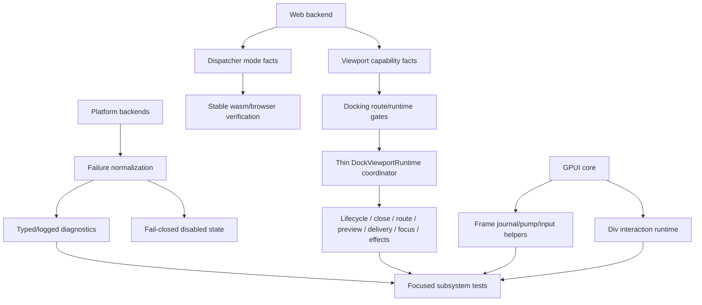
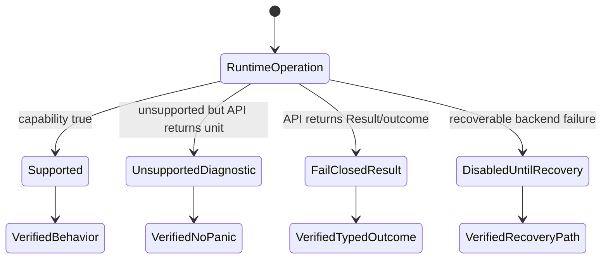

# Open GPUI Runtime, Docking, And Core Hardening - Plan

## Goal Capsule

| Field | Decision |
|---|---|
| Objective | Finish the next v0.3 hardening slice by removing remaining platform runtime crash paths, proving web/wasm capability truth, continuing docking runtime/test decomposition where old plans are not already complete, and deepening GPUI core frame/input/div boundaries. |
| Authority | Current `main`, the 2026-07 runtime hardening and depth plans, current crate READMEs, `docs/verification.md`, current CI workflows, and prior v0.3 public API/facade review findings. |
| Release boundary | v0.2.0 is already published. User-facing API breaks from this work are v0.3.0 changes; internal breaks, deletions, and module moves are allowed when tests and docs are updated. |
| Execution profile | Fearless refactor with characterization-first behavior changes. Do not preserve misleading aliases or unsupported paths. Do not reimplement completed motion/component/facade freeze work. |
| Stop conditions | Stop and re-plan only if the work requires a broad `Platform` trait redesign, browser popout viewport windows, a full Canvas document migration, a public GSAP/WAAPI-compatible animation API, or changing semantic focus/hit-test behavior without characterization coverage. |
| Tail ownership | Goal execution owns implementation, focused verification, review, logical conventional commits, merge or direct-main handling according to current repo state, push when gates pass or platform delegation is documented, and CI follow-up. |

---

## Product Contract

### Summary

Open GPUI already has v0.3 facade/API direction for docking, motion, and components. The remaining risk before the next breaking cycle is lower in the stack: Windows runtime recovery still has panic paths, web/wasm capability facts need to stay verified, docking internals are partly decomposed but still have giant runtime and test surfaces, and GPUI core still has very large `Window`, `App`, and `Div` implementation files. This plan finishes the next hardening layer by making runtime failures explicit, shrinking coordinators, splitting tests by behavior, and documenting the new boundaries.

### Problem Frame

The previous plans were intentionally ambitious, but several items have already landed. `crates/gpui_web/src/dispatcher.rs` exposes `WebDispatcherMode`; `crates/gpui_docking/src/viewport_drop_route/*`, `crates/gpui_docking/src/viewport_drop_delivery/*`, `crates/gpui_docking/src/drop_target/*`, and `crates/gpui/src/window/*` show that the first decomposition pass is no longer hypothetical. Repeating those old units would waste effort and risk churn.

The remaining architecture smell is now residual coordination and runtime failure semantics. Windows device-loss recovery still panics in normal backend paths. Clipboard format registration still panics on Win32 failure. Docking keeps a large `DockViewportRuntime` coordinator and very large scenario tests even though many helper modules exist. GPUI core has extracted frame and input helpers, but `window.rs`, `app.rs`, and `elements/div.rs` remain large enough that future platform, docking, and component work can easily reintroduce hidden behavior contracts.

### Requirements

- R1. Normal platform backend recovery and OS integration paths must fail closed or report diagnostics instead of panicking where the API shape permits recovery.
- R2. Windows device-loss and clipboard format registration errors must become logged or typed failures where possible, with Windows CI owning platform-specific compile validation.
- R3. Web dispatcher mode and web platform viewport capability facts must stay stable, tested, and documented for single-threaded wasm and optional multithreaded builds.
- R4. Docking runtime decomposition must build on existing modules instead of redoing completed facade/API work.
- R5. `DockViewportRuntime` must become thinner by delegating remaining route, preview, lifecycle, payload, focus, and effect concerns to focused modules.
- R6. Docking giant test files must be split or fronted by focused fixtures so failures identify lifecycle, route, placement, close, preview, render, or interaction behavior.
- R7. Docking public/common docs must keep facade-first language and avoid encouraging raw layout or model APIs for common app workflows.
- R8. GPUI core frame/input/window/app/div extraction must preserve public behavior while reducing broad files and moving pure decisions behind internal modules.
- R9. Div interactivity, tooltip, scroll, hover, click, key, focus, and cursor installation should move into internal interaction modules where seams are clean.
- R10. Public API freeze gates must keep catching root/prelude/advanced/adapter leaks that source-text scans can miss, including accidental `pub mod` exposure.
- R11. Verification must distinguish local focused gates from Windows, Linux, macOS, wasm, and browser-smoke CI ownership.
- R12. Docs, changelog, breaking inventory, and engineering memory must describe user-facing changes and current architecture without repeating stale plan text.

### Acceptance Examples

- AE1. Given a Windows backend build, when DirectX device recovery fails, then the backend records a recoverable diagnostic or disables the affected render path instead of panicking from the vsync or window event handler.
- AE2. Given Win32 custom clipboard format registration fails, then clipboard operations degrade with a warning or skip internal metadata instead of crashing process startup or clipboard access.
- AE3. Given a stable wasm build, when `WebPlatform::dispatcher_mode()` is inspected, then it reports the stable single-threaded mode and docs keep nightly/shared-memory checks optional.
- AE4. Given a docking platform-window route on a backend without platform viewport support, then single-window docking remains available and platform-window routes fail closed before creating a window.
- AE5. Given a docking route/close/placement test failure, then the failing test file and fixture identify the behavior area without requiring a reader to inspect a multi-thousand-line scenario file.
- AE6. Given a GPUI core frame or input refactor, then pointer, keyboard, focus, tooltip, cursor, scroll, tab stop, and frame pump behavior remain unchanged through focused tests.
- AE7. Given a future public API leak such as `pub mod layout` or a low-level motion policy module exposed from root, then the public API gate fails with a tier-specific message.

### Scope Boundaries

#### In Scope

- Windows device-loss and clipboard no-panic hardening.
- Web dispatcher/capability contract verification and documentation cleanup.
- Docking runtime coordinator thinning where existing modules already expose seams.
- Docking test topology cleanup and facade-first docs/public-surface hardening.
- GPUI core `Window`, `App`, and `Div` second-stage internal decomposition.
- Focused tests, public API gates, verification docs, breaking inventory, and current-state memory updates.

#### Deferred to Follow-Up Work

- Browser popout, multi-tab, or true independent web viewport windows.
- Full GSAP, Framer Motion DOM, WAAPI, CSS parser, or keyframe/storyboard compatibility.
- Broad `Platform` trait redesign or result-returning lifecycle API migration.
- Canvas document format migration or a new Canvas product feature pass.
- Pixel-perfect visual redesign of gallery or docking examples.

#### Outside This Product Identity

- Treating unsupported platform behavior as an ordinary runtime panic.
- Using cargo features as a substitute for runtime capability facts.
- Letting common app docs teach raw docking graph anatomy as the default workflow.
- Preserving pre-1.0 aliases that hide the ownership boundary this plan is trying to make explicit.

---

## Planning Contract

### Key Technical Decisions

- KTD1. Harden residual runtime failures before adding more UI surface. Platform crash paths and capability truth affect every framework user, while motion/component facade work has already reached v0.3 shape.
- KTD2. Keep void platform APIs no-op or diagnostic when they cannot return errors. Do not redesign the `Platform` trait in this slice.
- KTD3. Prefer typed recoverability over process panics in backend code. Use `Result`, status records, disabled-device state, or logged diagnostics when the call chain can recover.
- KTD4. Treat web dispatcher mode as a backend fact. Stable wasm remains single-threaded; multithreaded shared-memory mode is feature, browser, and worker-startup gated.
- KTD5. Continue docking's facade-first model. Common users use `DockSurface`; `model`, `runtime`, and `advanced` stay explicit escape hatches.
- KTD6. Shrink coordinators only along tested seams. `DockViewportRuntime` and `Window` may coordinate, but branch-heavy decisions should live in named internal modules with focused tests.
- KTD7. Public API leak prevention must scan module visibility as well as root/prelude re-export tokens. A `pub mod` can expose low-level types even when no root `pub use` exists.
- KTD8. Documentation is part of the architecture. Any module move or behavior hardening that changes user expectations must update README, verification, breaking inventory, or current-state docs in the same landing.

### Assumptions

- The user has authorized breaking changes, deletion of unneeded code, subagent review, logical commits, direct main work when appropriate, merge back to local `main`, and remote push after verification.
- Current `main` already includes the v0.3 facade/API maturity slice, motion elapsed-time public API work, component adapter cleanup, web dispatcher mode, and first docking/runtime/core decomposition pass.
- Local macOS binary execution may still hang in `_dyld_start`; when that happens, cargo check, no-run builds, and GitHub Actions own final binary-execution confirmation.
- Windows-specific device-loss behavior cannot be fully exercised on the local macOS host; Windows CI is the authority for `open-gpui-windows --all-features`.
- Existing public API snapshot gates exist but still need module-visibility hardening based on prior review findings.

### High-Level Technical Design

### Priority Order

1. Remove platform/runtime panic paths that can affect ordinary app execution.
2. Keep web/wasm capability truth and public API leak gates honest.
3. Continue docking runtime and test decomposition where current modules show real remaining coupling.
4. Continue GPUI core extraction in `Window`, `App`, and `Div` with characterization tests.
5. Land docs, verification updates, and engineering memory after each completed slice.

### Risks and Mitigations

| Risk | Mitigation |
|---|---|
| Windows device-loss behavior is hard to validate locally. | Keep changes type/compile-driven locally, require Windows CI compile and native gates, and document any unexercised recovery path. |
| Replacing panic with logging hides severe renderer failure. | Use explicit disabled/recovery state where possible and keep logs/status records actionable. |
| Docking decomposition repeats already-completed work. | Audit current modules first and only move remaining broad coordination or giant tests. |
| GPUI core extraction changes behavior accidentally. | Characterize pointer/key/focus/frame behavior before moving branch-heavy logic. |
| Public API gate becomes noisy. | Add narrow module-visibility checks for known leak classes instead of broad brittle source parsing. |
| Large plan creates long-running partial diffs. | Commit by subsystem after focused gates pass and keep docs in the subsystem commit or immediate follow-up. |

---

## Implementation Units

### U1. Windows Runtime Failure Normalization

- **Goal:** Replace remaining ordinary Windows backend panic paths with recoverable diagnostics or fail-closed state.
- **Requirements:** R1, R2.
- **Dependencies:** None.
- **Files:** `crates/gpui_windows/src/platform.rs`, `crates/gpui_windows/src/events.rs`, `crates/gpui_windows/src/directx_renderer.rs`, `crates/gpui_windows/src/directx_devices.rs`, `crates/gpui_windows/src/clipboard.rs`, `docs/verification.md`.
- **Approach:** Audit `panic!("Device lost: {err}")` and clipboard registration panics. Convert device-loss recovery failure into logged diagnostics plus a renderer/device invalidation state if the call chain can continue. Convert custom clipboard metadata/image format registration into optional format support so text/file/image clipboard basics do not crash when internal format registration fails. Preserve any invariant panic that is test-only or impossible without memory corruption.
- **Execution note:** Characterize current call chains before changing behavior. On non-Windows hosts, prefer compile-oriented changes and document Windows CI as the behavioral owner.
- **Patterns to follow:** Existing `log::error!` write/read clipboard failure handling, `DockViewportRuntimeStatus` style diagnostic records, and no-op platform lifecycle behavior already documented for Windows hide-other-apps.
- **Test scenarios:** Device-loss recovery failure does not panic from the vsync thread; window event device-loss failure does not panic; clipboard metadata format registration failure disables metadata support but still allows text clipboard attempts; image format registration failure skips that custom format instead of panicking; Windows all-features check still compiles.
- **Verification:** `cargo check -p open-gpui-windows --all-features --locked` on Windows CI; local `cargo check -p open-gpui-windows --locked` when host/toolchain supports it; `cargo fmt --all --check`.

### U2. Web And Public Capability Gate Tightening

- **Goal:** Keep web dispatcher/capability contracts and public API tier gates from drifting after the v0.3 facade work.
- **Requirements:** R3, R10, R11.
- **Dependencies:** None.
- **Files:** `crates/gpui_web/src/dispatcher.rs`, `crates/gpui_web/src/platform.rs`, `crates/gpui_web/gpui_web.rs`, `xtask/src/public_api_snapshot.rs`, `xtask/src/commands.rs`, `crates/gpui_docking/src/public_surface_tests.rs`, `crates/motion/tests/public_contracts.rs`, `docs/verification.md`.
- **Approach:** Add or tighten tests that assert stable wasm single-threaded mode, optional multithreaded fallback reasons, and explicit unsupported platform viewport capability. Extend `scan-public-api` to reject known accidental `pub mod` low-level exposures such as docking layout internals or motion policy internals when those modules are supposed to be explicit advanced/model paths.
- **Execution note:** Run the current public API scan before changing the gate so existing leaks are separated from new enforcement.
- **Patterns to follow:** `xtask/src/public_api_snapshot.rs`, `crates/gpui_web/src/dispatcher.rs` `WebDispatcherMode`, `xtask/src/web_smoke.rs` capability assertions.
- **Test scenarios:** Stable wasm reports `BuiltWithoutMultithreadedFeature`; worker startup failure remains a single-threaded reason; web platform viewport windows remain unsupported in stable web smoke; a forbidden `pub mod layout` or root-exposed low-level motion policy module fails the public API scan; allowed `model`, `runtime`, `advanced`, and `gpui_adapter` paths continue to pass.
- **Verification:** Stable wasm checks for `open-gpui-web`, `open-gpui-platform`, and `open-gpui-wgpu`; `cargo run -p xtask -- scan-public-api --check`; Linux CI `xtask web-smoke`.

### U3. Docking Runtime Coordinator Thinning

- **Goal:** Reduce remaining `DockViewportRuntime` coordination by moving branch-heavy workflows into already-existing focused modules.
- **Requirements:** R4, R5.
- **Dependencies:** U2 only if public API gates expose new forbidden modules.
- **Files:** `crates/gpui_docking/src/viewport_runtime.rs`, `crates/gpui_docking/src/viewport_runtime_handle.rs`, `crates/gpui_docking/src/viewport_runtime_handle/close_ops.rs`, `crates/gpui_docking/src/viewport_runtime_handle/route_ops.rs`, `crates/gpui_docking/src/viewport_runtime_handle/scene_ops.rs`, `crates/gpui_docking/src/viewport_runtime_effects.rs`, `crates/gpui_docking/src/viewport_window_lifecycle.rs`, `crates/gpui_docking/src/viewport_close.rs`, `crates/gpui_docking/src/viewport_payload_drag.rs`, `crates/gpui_docking/src/viewport_focus.rs`, `crates/gpui_docking/src/viewport_runtime_status.rs`.
- **Approach:** Audit `viewport_runtime.rs` for logic that belongs to lifecycle, close, route, scene/preview, payload drag, focus, backend-focus, or effects modules. Move only coherent workflow decisions. Leave the runtime as the state owner and wiring coordinator. Delete wrappers that remain after all call sites move.
- **Execution note:** Add or strengthen characterization tests before moving any behavior that affects open/close/route/tear-off/focus.
- **Patterns to follow:** Existing `viewport_runtime_handle/*` split, `viewport_window_lifecycle.rs`, `viewport_runtime_effects.rs`, and `viewport_drop_route/*`.
- **Test scenarios:** Open/register/reuse flow remains unchanged; close and should-close flow preserve cleanup effects; payload drag source state clears stale routed preview; focus handoff and backend focus records stay deterministic; platform viewport capability gates still run before window creation.
- **Verification:** `cargo nextest run -p open-gpui-docking host_viewport_lifecycle_tests host_viewport_close_tests host_viewport_route_tests host_viewport_platform_capability_tests --no-fail-fast`; `cargo check -p open-gpui-docking --tests --locked`.

### U4. Docking Test Topology And Facade-First Docs

- **Goal:** Make docking failures easier to localize and keep common docs/tests from depending on raw layout anatomy.
- **Requirements:** R6, R7, R10, R12.
- **Dependencies:** U3.
- **Files:** `crates/gpui_docking/src/host_viewport_lifecycle_tests.rs`, `crates/gpui_docking/src/host_viewport_close_tests.rs`, `crates/gpui_docking/src/host_interaction_tests.rs`, `crates/gpui_docking/src/host_render_tests.rs`, `crates/gpui_docking/src/host_viewport_route_tests.rs`, `crates/gpui_docking/src/host_viewport_runtime_test_support.rs`, `crates/gpui_docking/src/surface_tests.rs`, `crates/gpui_docking/src/lib.rs`, `crates/gpui_docking/README.md`, `docs/release/breaking-changes.md`.
- **Approach:** Split the largest test files when clear scenario groups exist, or introduce focused helper fixtures that make test failures report lifecycle/close/route/placement/render/interaction intent. Replace facade tests that directly inspect raw layout fields with semantic common API assertions. Update crate docs so common flows prefer `DockSurface` panel/viewport commands and treat `model` as tooling/advanced.
- **Execution note:** Preserve test names or add aliases only when needed for diagnostics; progress is derived from git, not checkbox edits.
- **Patterns to follow:** Existing `host_viewport_matrix_tests.rs`, `host_viewport_runtime_test_support.rs`, `surface_tests.rs`, and prior review findings on `pub mod layout` and facade docs.
- **Test scenarios:** Surface tests assert semantic layout facts without reading raw `spaces[0].floatings`; giant lifecycle/close/route tests are split or grouped by scenario; public surface tests fail on common raw layout/module leaks; README examples keep common imports facade-first.
- **Verification:** Docking public-surface tests, surface tests, and focused viewport test filters pass; `cargo run -p xtask -- scan-public-api --check`.

### U5. GPUI Window And App Runtime Boundary Pass

- **Goal:** Continue second-stage GPUI runtime decomposition without changing public app/window APIs.
- **Requirements:** R8.
- **Dependencies:** None, but should run after U1 if platform failure types affect window behavior.
- **Files:** `crates/gpui/src/window.rs`, `crates/gpui/src/window/frame_journal.rs`, `crates/gpui/src/window/frame_pump.rs`, `crates/gpui/src/window/input_dispatch.rs`, `crates/gpui/src/window/a11y.rs`, `crates/gpui/src/app.rs`, `crates/gpui/src/app/window_registry.rs`, `crates/gpui/src/app/action_dispatch.rs`, `crates/gpui/src/platform_scheduler.rs`.
- **Approach:** Identify remaining pure decision blocks and registry/effect logic in `window.rs` and `app.rs` that can move into `window/*` or `app/*`. Favor helpers that reduce large-file branching while keeping borrow/lifetime behavior local. Do not split the public context/entity model in this slice.
- **Execution note:** Characterize behavior through existing GPUI tests before moving frame/input/app registry logic.
- **Patterns to follow:** Existing `window/frame_journal.rs`, `window/frame_pump.rs`, `window/input_dispatch.rs`, and `app/window_registry.rs`.
- **Test scenarios:** Frame throttle and presentation decisions stay unchanged; prepaint/paint reuse and rollback stay consistent; pointer and keyboard input normalization stays unchanged; app window registration/removal/quit behavior stays unchanged; post-quit spawn diagnostics stay unchanged unless explicitly hardened.
- **Verification:** `cargo check -p open-gpui --tests --locked`; focused GPUI tests discovered during implementation; downstream `open-gpui-ui-components` and `open-gpui-docking` checks.

### U6. Div Interactivity Deep Module Split

- **Goal:** Reduce `elements/div.rs` by moving interactivity installation into named internal modules.
- **Requirements:** R8, R9.
- **Dependencies:** U5 when shared window/input helpers move.
- **Files:** `crates/gpui/src/elements/div.rs`, `crates/gpui/src/elements/div/interactive.rs`, `crates/gpui/src/elements/div/tooltip.rs`, `crates/gpui/src/elements/div/scroll.rs`, `crates/gpui/src/elements/div/focus.rs`, `crates/gpui/src/elements/div/keyboard.rs`, `crates/gpui/src/elements/div/cursor.rs`, `crates/gpui/src/interactive.rs`, `crates/gpui/src/input.rs`.
- **Approach:** Move cohesive builder/runtime chunks for tooltip, scroll, hover, click, key, focus, cursor, and accessibility role installation into private submodules when they can keep the existing `div()` API unchanged. If a chunk is too entangled with style/layout, leave it and document why.
- **Execution note:** Avoid mechanical file splitting without ownership improvement. Each extracted module should own a real behavior family.
- **Patterns to follow:** Existing element modules under `crates/gpui/src/elements/`, current `window/input_dispatch.rs`, and `interactive.rs`.
- **Test scenarios:** Div click/hover/key/focus/tooltip/cursor/scroll behavior compiles and passes existing GPUI examples/tests; accessibility role builder APIs still compile; scroll wheel focus and propagation tests continue to pass; downstream component tests that rely on `div()` interactivity pass.
- **Verification:** Focused `open-gpui` scroll/input/div-related tests; `cargo check -p open-gpui-ui-components --tests --locked`; `cargo nextest run -p open-gpui-ui-components --no-fail-fast` when behavior changes affect components.

### U7. Verification, Docs, And Release Inventory Refresh

- **Goal:** Keep current docs and release-facing artifacts aligned with the new runtime boundaries and platform ownership.
- **Requirements:** R11, R12.
- **Dependencies:** U1 through U6 as applicable.
- **Files:** `docs/verification.md`, `docs/knowledge/engineering/current-state.md`, `docs/release/breaking-changes.md`, `CHANGELOG.md`, `crates/gpui/README.md`, `crates/gpui_docking/README.md`, `crates/gpui_web/README.md`, `crates/gpui_windows/README.md` if created, `.github/workflows/verify.yml`.
- **Approach:** Update docs only for real implemented changes. Keep changelog user-facing and non-repetitive. Add breaking inventory rows only for public API moves/removals. Clarify which gates are local, Windows CI, Linux wasm/web-smoke, macOS, and release-only.
- **Execution note:** Do not manually wrap changelog or release-note paragraphs; release docs verification rejects wrapped release notes.
- **Test scenarios:** Verification docs include focused gates for Windows runtime, web/wasm, docking runtime, GPUI core, public API scan, and full workspace; changelog groups user-facing changes rather than listing internal module moves; doc links pass; current-state memory names completed and deferred work accurately.
- **Verification:** `cargo run -p xtask -- verify-release-docs`; `cargo run -p xtask -- scan-doc-links`; `git diff --check`.

---

## Verification Contract

| Gate | Scope | Owner |
|---|---|---|
| `cargo fmt --all --check` | Formatting for all changed Rust code | Local before each commit and CI |
| `cargo check -p open-gpui --tests --locked` | GPUI core extraction compile proof | Local |
| `cargo check -p open-gpui-docking --tests --locked` | Docking decomposition compile proof | Local |
| `cargo nextest run -p open-gpui-docking ... --no-fail-fast` | Focused docking lifecycle, close, route, placement, surface, public-surface behavior | Local when binary execution is healthy; CI otherwise |
| `cargo check -p open-gpui-web --target wasm32-unknown-unknown --tests --locked -j 1` and related wasm checks | Stable wasm compile surfaces | Linux CI, local when target installed |
| `cargo run -p xtask -- web-smoke` | Stable browser smoke and unsupported platform viewport capability | Linux CI, local when browser tooling exists |
| `cargo check -p open-gpui-windows --all-features --locked` | Windows backend compile/API proof | Windows CI |
| `cargo run -p xtask -- scan-public-api --check` | v0.3 public API tier leak gate | Local and CI through `xtask verify` |
| `cargo run -p xtask -- verify-release-docs` and `cargo run -p xtask -- scan-doc-links` | Release docs, changelog, README, link gates | Local and CI |
| `cargo run -p xtask -- verify` | Full local gate | Run before final push when local binary execution is healthy; otherwise document local limitation and rely on CI |

---

## Definition of Done

- U1 through U7 are either implemented or explicitly deferred with a reason that does not violate R1-R12.
- Any behavior-bearing unit has focused tests, characterization tests, or a documented platform-owned CI gate.
- No ordinary Windows platform runtime path introduced by this plan panics where recovery or fail-closed behavior is possible.
- Stable web/wasm mode and platform viewport capability facts remain verified.
- Docking common docs and tests prefer `DockSurface`; raw model/runtime access stays explicit.
- GPUI core extraction reduces broad coordination without changing public app/window/div behavior.
- Public API scan catches known root/prelude/module-visibility leak classes.
- Docs, changelog, breaking inventory, and current-state memory reflect the implemented reality.
- `git diff --check` is clean, formatting is clean, focused gates pass or are delegated to platform CI with a clear note, and commits are logical conventional commits.

---

## Sources And Research

- `docs/plans/2026-07-06-001-refactor-runtime-ui-hardening-plan.md` established platform/web capability hardening and documented that Windows hide-other-apps no longer uses `unimplemented!()`.
- `docs/plans/2026-07-07-003-refactor-runtime-canvas-docking-depth-plan.md` established the deeper runtime/docking/core target, but several units are now partially complete in the current tree.
- `docs/plans/2026-07-08-002-refactor-v030-api-freeze-facade-maturity-plan.md` established the v0.3 facade/API freeze direction and should not be repeated as this plan's main work.
- `docs/verification.md` documents current Linux wasm/web-smoke, Windows, macOS, release, dependency, docking, motion, UI, and full workspace gates.
- `.github/workflows/verify.yml` runs Linux, macOS, and Windows verification, including stable wasm and browser smoke on Linux and Windows backend/docking-native gates on Windows.
- Prior review findings noted two relevant remaining leak classes: docking layout module visibility can bypass root/prelude token checks, and motion low-level policy APIs can leak through a public module even after root re-exports are removed.
