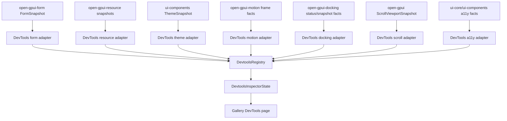
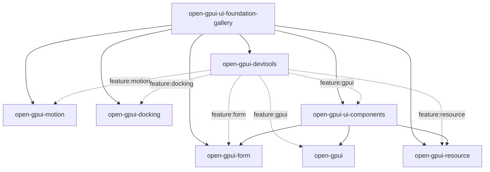

# Open GPUI DevTools Real Probes And Ecosystem Dogfood - Plan

## Goal Capsule

| Field | Decision |
|---|---|
| Objective | Turn the first devtools/form/resource ecosystem slice from static gallery demonstrations into reusable read-only probe adapters backed by real public snapshots, then dogfood those adapters through the gallery's form/resource ecosystem samples. |
| Authority | Current `main`, the implemented `docs/plans/2026-07-08-002-feat-devtools-form-resource-ecosystem-plan.md`, current crate READMEs, `docs/verification.md`, and the user's permission to break APIs, delete misleading code, commit, merge, and push `main` after green gates. |
| Release boundary | This is a v0.3 ecosystem maturation slice. Public breaks are allowed when they remove demo-only or misleading surfaces, but the desired dependency direction is additive: source crates expose public snapshots, DevTools consumes them. |
| Execution profile | Fearless refactor with proof-first tests for converters and gallery contracts. Prefer deleting handwritten demo snapshots over preserving compatibility wrappers. |
| Stop conditions | Stop and re-plan only if the work requires live runtime mutation, remote DevTools transport, private GPUI runtime introspection without a public read-only fact, or a broad redesign of form/resource stores. |
| Landing strategy | Work on a feature branch from current `main`, commit by coherent slice, merge back to local `main`, push `origin/main` after focused gates pass, and document any platform-owned verification. |

---

## Product Contract

### Summary

Open GPUI now has `open-gpui-devtools`, `open-gpui-form`, and `open-gpui-resource`, plus UI component adapters and gallery pages.
The remaining gap is integration truth.
The DevTools gallery page still constructs static `SnapshotEnvelope` fixtures by hand, so it proves the inspector can render rows but not that real form/resource/theme/motion/docking/scroll/a11y state can be converted consistently.

This plan adds first-party DevTools probe adapters over existing public snapshots and replaces static gallery fixtures with registry-collected snapshots from real sample state.
The goal is a small but durable ecosystem spine: app code owns runtime state, source crates expose safe snapshots, DevTools converts snapshots into stable inspection trees, and the gallery proves the whole chain.

### Problem Frame

The first ecosystem slice intentionally built the headless foundations before wiring every cross-crate adapter.
That left three risks:

- A downstream app would have to hand-author DevTools trees for `FormSnapshot`, `ResourceSnapshot`, `ThemeSnapshot`, `MotionFrameDemand`, `DockViewportRuntimeStatus`, `ScrollViewportSnapshot`, and accessibility contracts even though these facts already exist.
- The gallery DevTools page could drift from real form/resource behavior because it creates static snapshots unrelated to the form/resource adapter samples.
- Redaction is present in form/resource cores, but there is no central converter that proves redacted values remain redacted when shown through DevTools.

The correct next step is not a bigger inspector UI or remote debugging.
It is a set of stable, tested conversion seams that make framework facts inspectable without giving DevTools ownership over app state.

### Requirements

**Probe Adapter Surface**

- R1. DevTools must expose reusable adapter functions or probe builders for converting public framework snapshots into `SnapshotProbeSnapshot` or `SnapshotEnvelope` data.
- R2. Form/resource/source crates must not depend on `open-gpui-devtools`; DevTools consumes their public snapshots through feature-gated modules.
- R3. Adapter output must use stable node IDs, deterministic ordering, and serializable payloads so tests, gallery samples, and external tools consume the same facts.
- R4. Form and resource adapters must derive `SnapshotRedactionSummary` from redacted values instead of trusting callers to record redaction manually.
- R5. Adapter output must sanitize the entire serialized `SnapshotEnvelope`, including node IDs, labels, payloads, redaction notes, field paths, query key segments, mutation IDs, error strings, and diagnostics, unless an upstream snapshot explicitly marks the value as exposed.

**Framework Facts**

- R6. DevTools must cover real public facts for theme mode/revision/color count, motion frame demand, docking runtime/status facts, scroll committed viewport facts, and accessibility contract/demo state where those facts are already public.
- R7. If a target fact lacks a stable public read-only snapshot, add the smallest read-only snapshot in the owning crate or defer that target explicitly; do not reach through private runtime internals.
- R8. Optional feature gates must stay honest: enabling `form`, `resource`, `motion`, `docking`, or `gpui` should expose only the adapters for dependencies that are actually available.

**Gallery Dogfood**

- R9. `examples/ui-foundation-gallery/src/pages/devtools.rs` must collect snapshots through `DevtoolsRegistry` and real adapters rather than constructing static demo envelopes directly.
- R10. The gallery must have one deterministic ecosystem dogfood path that connects form validation/submission, resource invalidation/mutation, and DevTools redacted snapshots.
- R11. Gallery tests must prove that DevTools rows reflect current sample state and that redaction counts come from form/resource snapshots.
- R12. The implementation should remove obsolete static fixture builders and redundant sample glue once the registry-backed path exists.

**Docs And Verification**

- R13. README and verification docs must describe the new adapter path, feature gates, redaction contract, and focused test commands.
- R14. Engineering memory must record the active plan, branch, verification state, commits, and any deferred public snapshot targets.

### Acceptance Examples

- AE1. Given a `FormSnapshot` produced with `RedactionPolicy::RedactAll`, when DevTools converts it, then each redacted field is counted in `SnapshotRedactionSummary` and no raw field value appears in payload JSON.
- AE2. Given a `ResourceSnapshot` plus a `MutationSnapshot`, when DevTools converts them, then query key, lifecycle status, observer count, fetch attempts, mutation id, mutation status, and redaction counts are visible with stable node IDs.
- AE3. Given a `ThemeSnapshot`, when DevTools converts it, then the snapshot includes mode, revision, color count, and representative semantic token rows without requiring a live GPUI window.
- AE4. Given a `MotionFrameDemand` or `MotionFrameDriver` state, when DevTools converts it, then the snapshot says whether a frame is needed and why.
- AE5. Given a gallery DevTools collection, when tests inspect it, then it contains registry-collected form, resource, theme, docking, motion, scroll, and accessibility rows or explicit diagnostics for unavailable optional facts.
- AE6. Given the gallery form/resource samples, when their deterministic state changes from validation to submit or mutation, then the DevTools collection uses those same snapshots and updates its status/redaction metadata.

### Scope Boundaries

#### In Scope

- Feature-gated DevTools adapters for form, resource, theme, motion, docking, scroll, and accessibility facts that already have public snapshot inputs.
- Small public read-only snapshots in owning crates only when a fact is already stable but not yet externally readable.
- Gallery dogfood that exercises real sample state, registry collection, redaction, diagnostics, and inspector rows.
- Deletion of static gallery DevTools fixture builders and any compatibility glue that only exists to keep the old demo path alive.
- Focused tests, docs, release inventory when public breaks occur, and engineering memory.

#### Deferred

- Remote DevTools transport, browser extension integrations, time travel, and live editing.
- A global runtime probe manager that auto-discovers every app probe.
- Full GPUI render-tree or hit-test private runtime introspection.
- Persistence of resource caches or form drafts.
- Visual redesign of the DevTools inspector surface beyond what is required to show real rows.

---

## Planning Contract

### Key Technical Decisions

- KTD1. DevTools owns conversion from public snapshots into `SnapshotTree` nodes. Source crates stay independent and do not learn about DevTools.
- KTD2. Adapter modules are feature-gated at the consumer edge: `form`, `resource`, `motion`, `docking`, and `gpui` decide which converters compile.
- KTD3. Form/resource redaction is inferred from `RedactedValue` and `RedactedResourceValue`. Manual redaction notes remain possible for custom probes, but first-party adapters must not require manual bookkeeping.
- KTD4. Snapshot payloads are diagnostic summaries, not app state exports. A converter may include statuses, counts, ids, labels, and summary kinds; raw JSON appears only when the upstream snapshot contains exposed JSON.
- KTD5. Gallery dogfood uses deterministic in-process sample stores and clients. No HTTP, timers, background threads, or remote DevTools transport are introduced in this slice.
- KTD6. Public read-only facts are preferred over private reach-through. If docking, scroll, or accessibility needs more facts, add a narrow snapshot on the owning side rather than reading private fields from DevTools.
- KTD7. Static gallery envelopes are deleted after replacement. Keeping both paths would make tests pass while hiding drift.
- KTD8. Review and verification must treat feature combinations as part of the public contract because optional DevTools adapters are only useful when their features compile independently.
- KTD9. Missing or unavailable optional runtime facts use collection-level `SnapshotDiagnostic` records with stable codes and sanitized summaries. `SnapshotKind::Diagnostic` is reserved for successfully collected diagnostic facts, not for probe collection failures.
- KTD10. Split DevTools feature taxonomy before implementing framework adapters. Keep `gpui` as the existing GPUI inspector/UI convenience feature, add a narrower core GPUI feature for `open_gpui` facts if scroll adapters need it, and use a separate UI-components/theme/a11y feature when converters depend only on `open_gpui_ui_components`.

### High-Level Technical Design



### Dependency Direction



### Priority Order

1. Build the DevTools adapter foundation and redaction helpers first, because every later converter needs stable node and payload rules.
2. Convert form/resource snapshots next, because they carry the highest app-data and redaction risk.
3. Replace the gallery DevTools static collection for form/resource with `DevtoolsRegistry` as soon as U2 lands, using diagnostics for framework facts that are not wired yet.
4. Add framework fact converters for theme, motion, scroll, accessibility, and docking using public snapshots only, then layer them into the same registry path.
5. Delete obsolete demo-only code, update docs/memory, run review, and merge/push after gates.

### Gallery Dogfood Flow

| Step | Entry or action | Source state | DevTools expectation |
|---|---|---|---|
| 1 | Open the gallery DevTools page or call `devtools_gallery_collection()` from tests. | Deterministic gallery sample factories create form/resource/theme diagnostics without external services. | `DevtoolsRegistry` collects rows; no static `SnapshotEnvelope` fixture functions participate. |
| 2 | Select or construct the invalid profile form sample. | `FormStore` has an invalid email field, touched/visited meta, one validation error, and `RedactionPolicy::RedactAll`. | The form probe shows form status, field counts, invalid count, submit count, sanitized field identifiers, and redaction count; serialized output does not include the raw email. |
| 3 | Select or construct the submitting profile form sample. | `FormStore` is in submitting state and projected controls are disabled through `FormFieldProjection`. | Re-collecting the registry updates the same form probe row to `submitting` and keeps value redaction intact. |
| 4 | Select or construct the refreshing resource sample. | `ResourceClient` has observed projects data, invalidation requested a refetch, and payloads are summarized or redacted. | The resource probe shows query key summary, status, observers, fetch attempts, stale/refetch state, and no raw payload. |
| 5 | Select or construct the mutation resource sample. | `ResourceClient` has a pending or completed mutation and configured invalidation keys. | The mutation node shows sanitized mutation identity, status, invalidation summary, and action-disabled state without exposing mutation payload. |
| 6 | Enable framework adapters that have deterministic inputs. | Theme, motion, docking, scroll, or accessibility facts are available from public snapshots. | Registry rows use real converters; unavailable facts emit sanitized collection diagnostics with stable codes. |

### Diagnostic Contract

| Condition | Representation | Stable fields | Sanitization rule |
|---|---|---|---|
| Feature disabled | No probe is registered by default; tests may register a collection diagnostic for expected disabled facts. | `probe_id`, `code: feature-disabled`, feature name. | Do not include Cargo feature expressions or raw compile errors. |
| Runtime absent | `SnapshotDiagnostic` from the registered probe. | `probe_id`, `code: runtime-absent`, sanitized runtime label. | Do not forward raw runtime error strings. |
| Public snapshot unavailable | `SnapshotDiagnostic` from the adapter. | `probe_id`, `code: snapshot-unavailable`, owning crate or fact kind. | Do not include private field names or app data. |
| Probe collection error | `SnapshotDiagnostic` from `DevtoolsRegistry::collect`. | `probe_id`, `code: collection-failed`, sanitized summary. | Strip token-like, email-like, URL-query, and path payload fragments. |
| Deferred target | `SnapshotDiagnostic` or docs-only note when no probe is registered. | `code: deferred`, target fact kind, plan citation in docs only. | Do not invent fake snapshot nodes. |

### Risks And Mitigations

| Risk | Mitigation |
|---|---|
| Feature-gated adapters create dependency cycles. | Keep every adapter inside `open-gpui-devtools`; never add DevTools dependencies to form/resource/components/docking/motion. |
| Redaction summary drifts from redacted values. | Derive first-party summary counts directly while walking redacted snapshot values. |
| Adapter payloads become unstable blobs. | Use stable node ids and small typed summary payloads; tests assert exact ids, labels, selected payload fields, and serialized redaction behavior. |
| Gallery keeps passing with stale static fixtures. | Delete static envelope builders after registry-backed collection lands. |
| Docking or scroll facts need private fields. | Add narrow read-only snapshots in the owning crate or leave a diagnostic/deferred target. |
| Converter API gets overabstracted. | Start with concrete functions and simple probe builders. Add traits only if repeated code becomes real, not speculative. |
| Sensitive data leaks through non-value channels. | Treat identifiers, labels, errors, and diagnostics as redaction-bearing channels, not harmless metadata. |

---

## Implementation Units

### U1. DevTools Adapter Foundation

- **Goal:** Add shared conversion helpers for building stable snapshot nodes, summary payloads, and redaction summaries without changing existing probe registry semantics.
- **Requirements:** R1, R3, R4, R5.
- **Dependencies:** None.
- **Files:** Modify `crates/devtools/src/lib.rs`, `crates/devtools/src/snapshot.rs`, `crates/devtools/src/probe.rs`, and `crates/devtools/src/redaction.rs`. Create `crates/devtools/src/adapters/mod.rs`, `crates/devtools/src/adapters/payload.rs`, and `crates/devtools/tests/adapter_contracts.rs`.
- **Approach:** Keep `SnapshotEnvelope`, `SnapshotTree`, and `SnapshotProbeSnapshot` as the core DTOs. Add small helper APIs for deterministic sanitized node IDs, JSON summary payloads, redaction recording, redaction-summary merging, and sanitized diagnostic construction. Avoid a broad trait hierarchy unless multiple adapters need the same abstraction after the concrete converters exist.
- **Execution note:** Characterize existing registry and closure-backed probe behavior before changing shared DTOs.
- **Patterns to follow:** `crates/devtools/src/snapshot.rs`, `crates/devtools/src/probe.rs`, `crates/devtools/tests/snapshot_contracts.rs`, and `crates/devtools/tests/inspector_contracts.rs`.
- **Test scenarios:** Existing registry collection still returns deterministic snapshots; duplicate probe IDs still fail; helper-created nodes serialize the same as manual nodes; redaction summaries can be merged or recorded without losing labels; diagnostic summaries strip token-like, email-like, URL-query, and path payload fragments; empty or diagnostic trees remain valid.
- **Verification:** `cargo nextest run -p open-gpui-devtools snapshot probe adapter --no-fail-fast --locked`.

### U2. Form And Resource Snapshot Adapters

- **Goal:** Convert real headless form/resource snapshots into DevTools trees with redaction derived from snapshot values.
- **Requirements:** R1, R2, R3, R4, R5, R8, R10, R11.
- **Dependencies:** U1.
- **Files:** Modify `crates/devtools/Cargo.toml`, `crates/devtools/src/lib.rs`, and `crates/resource/src/lib.rs`. Create `crates/devtools/src/form.rs`, `crates/devtools/src/resource.rs`, and `crates/devtools/tests/form_resource_adapters.rs`. Modify `crates/devtools/README.md`.
- **Approach:** Under the `form` feature, expose conversion and probe-builder helpers for `FormSnapshot` and `FieldSnapshot`. Under the `resource` feature, expose conversion and probe-builder helpers for `ResourceSnapshot`, `MutationSnapshot`, and paginated resource snapshots. Re-export `PaginatedResourceSnapshotView` from `open-gpui-resource` so DevTools can accept redaction-aware paginated views without reaching into a private module. Stable node IDs may derive from paths, query keys, mutation IDs, and page indices only after passing through the same identifier sanitizer used for labels and payload summaries.
- **Execution note:** Use proof-first tests that fail against the current static-only DevTools crate before adding converters.
- **Patterns to follow:** `crates/form/src/snapshot.rs`, `crates/form/src/redaction.rs`, `crates/resource/src/snapshot.rs`, `crates/resource/src/pagination.rs`, `crates/resource/src/redaction.rs`, `crates/ui_components/src/form_adapter.rs`, and `crates/ui_components/src/resource_adapter.rs`.
- **Test scenarios:** Redacted form fields increment the DevTools redaction count; exposed form fields include JSON only when upstream exposed them; serialized form envelopes do not contain raw emails or token-like field paths; form errors/status/submit count are visible through sanitized summaries; resource query key segments become stable sanitized labels; resource/mutation status, observer count, fetch attempts, and errors are visible through sanitized summaries; serialized resource envelopes do not contain raw URLs, tokens, or mutation IDs marked sensitive; redacted resource data increments redaction count; feature-disabled default build does not expose form/resource symbols.
- **Verification:** `cargo check -p open-gpui-devtools --features form,resource --tests --locked` and `cargo nextest run -p open-gpui-devtools --features form,resource form_resource_adapters --no-fail-fast --locked`.

### U3. Theme, Motion, Scroll, Accessibility, And Docking Adapters

- **Goal:** Make existing framework facts inspectable through DevTools without private runtime reach-through.
- **Requirements:** R1, R2, R3, R6, R7, R8.
- **Dependencies:** U1.
- **Files:** Modify `crates/devtools/Cargo.toml` and `crates/devtools/src/lib.rs`. Create or modify `crates/devtools/src/gpui.rs`, `crates/devtools/src/motion.rs`, `crates/devtools/src/docking.rs`, and `crates/devtools/tests/framework_adapters.rs`. Modify owning crates only if a narrow public read-only snapshot is missing: likely candidates are `crates/gpui/src/elements/div.rs`, `crates/ui_components/src/a11y.rs`, or `crates/gpui_docking/src/advanced.rs`.
- **Approach:** First resolve feature taxonomy in `Cargo.toml` and docs: retain existing `gpui` convenience behavior for the inspector UI, add narrower feature names when core GPUI and UI-components facts need independent compilation, and update tests to match the final taxonomy. Convert theme and accessibility facts under the UI-components feature, scroll facts under the core GPUI feature, motion facts under `motion`, and docking facts under `docking`. Return collection diagnostics for absent optional runtime facts instead of inventing fake data.
- **Execution note:** If a converter would need a private field, pause within the unit and add a small public read-only snapshot in the owning crate with focused tests.
- **Patterns to follow:** `crates/ui_components/src/theme/snapshot.rs`, `crates/ui_components/src/theme/runtime.rs`, `crates/motion/src/controller.rs`, `crates/motion/src/frame_host.rs`, `crates/gpui/src/elements/div.rs`, `crates/gpui_docking/src/advanced.rs`, and `crates/gpui_docking/src/viewport_runtime_status.rs`.
- **Test scenarios:** Theme conversion exposes mode, revision, color count, and selected semantic token rows; motion conversion distinguishes idle from needs-frame and preserves the reason label; scroll conversion exposes committed viewport bounds/offset/content size/source facts when present and a sanitized diagnostic when absent; accessibility conversion exposes role/value/action summary facts from public contracts or demo state; docking conversion exposes route/platform/status records without depending on private runtime internals; each single feature and selected combined feature set compiles independently.
- **Verification:** `cargo check -p open-gpui-devtools --features gpui,motion,docking --tests --locked` and `cargo nextest run -p open-gpui-devtools --features gpui,motion,docking framework_adapters --no-fail-fast --locked`.

### U4. Gallery Ecosystem Dogfood And Registry Collection

- **Goal:** Replace static DevTools gallery snapshots with registry-collected probes over deterministic form/resource sample state first, then include framework probes as U3 adapters become available.
- **Requirements:** R9, R10, R11, R12.
- **Dependencies:** U2. U3 framework adapters may land before or after this unit and should integrate through the same registry path.
- **Files:** Modify `examples/ui-foundation-gallery/Cargo.toml`, `examples/ui-foundation-gallery/src/pages/devtools.rs`, `examples/ui-foundation-gallery/src/pages/components/samples/form.rs`, `examples/ui-foundation-gallery/src/pages/components/samples/resource.rs`, `examples/ui-foundation-gallery/src/pages/components/render/ecosystem.rs`, `examples/ui-foundation-gallery/src/pages/components/runtime/mod.rs`, `examples/ui-foundation-gallery/tests/foundation_gallery.rs`, `examples/ui-foundation-gallery/tests/foundation_gallery/foundation_contracts.rs`, and `examples/ui-foundation-gallery/tests/foundation_gallery/component_sample_contracts.rs`. Create and register `examples/ui-foundation-gallery/tests/foundation_gallery/devtools_contracts.rs` if the DevTools assertions become large.
- **Approach:** Enable the exact DevTools adapter features the gallery consumes in `examples/ui-foundation-gallery/Cargo.toml`, update manifest assertions, and add `open_gpui_docking` only if the gallery directly constructs docking snapshots. Expose deterministic form and resource sample snapshots from existing gallery sample builders. Build `devtools_gallery_collection()` by registering closure-backed probes that call the first-party DevTools adapters. Include a combined dogfood sample that follows the Gallery Dogfood Flow and proves form validation/submission, resource mutation/invalidation, and DevTools redaction counts from the same sample data.
- **Execution note:** Delete old `theme_snapshot`, `form_snapshot`, `resource_snapshot`, and `docking_snapshot` fixture builders after the registry-backed collection passes tests.
- **Patterns to follow:** `examples/ui-foundation-gallery/src/pages/devtools.rs`, `examples/ui-foundation-gallery/src/pages/components/samples/form.rs`, `examples/ui-foundation-gallery/src/pages/components/samples/resource.rs`, `examples/ui-foundation-gallery/src/pages/components/render/ecosystem.rs`, `examples/ui-foundation-gallery/tests/foundation_gallery/component_sample_contracts.rs`, and `examples/ui-foundation-gallery/tests/foundation_gallery/component_catalog_contracts.rs`.
- **Test scenarios:** DevTools gallery collection is produced by `DevtoolsRegistry`; a new `devtools_contracts` module is registered from `foundation_gallery.rs` when created; form/resource rows match actual sample status counts; redaction row counts match redacted form/resource snapshots; combined ecosystem sample records form submit and resource mutation/invalidation facts in the sequence defined by Gallery Dogfood Flow; optional framework facts appear as snapshots when deterministic inputs exist and sanitized diagnostics when a runtime is not mounted; probe and diagnostic rows have accessible labels or existing inspector row text that UI tests can assert; no static demo-only snapshot builder remains.
- **Verification:** `cargo nextest run -p open-gpui-ui-foundation-gallery devtools form resource component_sample_contracts --no-fail-fast --locked` and `cargo check -p open-gpui-ui-foundation-gallery --tests --locked`.

### U5. Public Docs, Verification, And Release Inventory

- **Goal:** Align docs and durable memory with the real probe adapter path and any intentional public breaks.
- **Requirements:** R12, R13, R14.
- **Dependencies:** U1, U2, U3, U4.
- **Files:** Modify `README.md`, `docs/verification.md`, `docs/release/breaking-changes.md` if public paths are removed or renamed, `crates/devtools/README.md`, `crates/form/README.md`, `crates/resource/README.md`, `docs/knowledge/engineering/registry/*.md`, `docs/knowledge/engineering/progress/*.md`, and `docs/knowledge/engineering/verification/*.md` as needed.
- **Approach:** Document feature-gated adapters, redaction behavior, registry-backed gallery dogfood, and focused verification commands. Register the active work in engineering memory before long execution and write sharded progress/verification concepts at commit boundaries.
- **Execution note:** Do not edit the plan as a progress ledger. Execution state belongs in git commits and engineering memory.
- **Patterns to follow:** `crates/devtools/README.md`, `docs/verification.md`, `docs/knowledge/engineering/progress/2026-07-08-open-gpui-devtools-form-resource-ecosystem-final.md`, and `docs/knowledge/engineering/verification/open-gpui-devtools-form-resource-ecosystem-20260708.md`.
- **Test scenarios:** Docs mention adapter feature gates and redaction; verification commands reference real packages and features; release breaking inventory includes any removed public path; memory links to this plan, branch, commits, and final verification; doc link scans pass.
- **Verification:** `cargo run -p xtask -- verify-release-docs`, `cargo run -p xtask -- scan-doc-links`, `python "$HOME\\.codex\\skills\\engineering-wiki-memory\\scripts\\wiki_memory.py" validate --root docs\\knowledge\\engineering`, and `git diff --check`.

---

## Verification Contract

Focused checks while implementing:

```powershell
cargo fmt -p open-gpui-devtools -p open-gpui-form -p open-gpui-resource -p open-gpui-ui-components -p open-gpui-ui-foundation-gallery --check
cargo check -p open-gpui-devtools --tests --locked
cargo check -p open-gpui-devtools --features form,resource --tests --locked
cargo check -p open-gpui-devtools --features gpui,motion,docking --tests --locked
cargo check -p open-gpui-devtools --no-default-features --features form --tests --locked
cargo check -p open-gpui-devtools --no-default-features --features resource --tests --locked
cargo check -p open-gpui-devtools --no-default-features --features motion --tests --locked
cargo check -p open-gpui-devtools --no-default-features --features docking --tests --locked
cargo check -p open-gpui-devtools --no-default-features --features gpui --tests --locked
cargo check -p open-gpui-ui-foundation-gallery --tests --locked
cargo nextest run -p open-gpui-devtools --no-fail-fast --locked
cargo nextest run -p open-gpui-devtools --features form,resource form_resource_adapters --no-fail-fast --locked
cargo nextest run -p open-gpui-devtools --features gpui,motion,docking framework_adapters --no-fail-fast --locked
cargo nextest run -p open-gpui-ui-foundation-gallery devtools form resource component_sample_contracts --no-fail-fast --locked
```

Integration and release-facing checks before landing:

```powershell
cargo check -p open-gpui-ui-components --tests --locked
cargo nextest run -p open-gpui-ui-components form resource public_surface --no-fail-fast --locked
cargo run -p xtask -- verify-release-docs
cargo run -p xtask -- scan-doc-links
cargo run -p xtask -- scan-ui-contract
python "$HOME\\.codex\\skills\\engineering-wiki-memory\\scripts\\wiki_memory.py" validate --root docs\\knowledge\\engineering
git diff --check
```

Manual dogfood when local binary execution is healthy:

```powershell
cargo run -p open-gpui-ui-foundation-gallery -- --page devtools
cargo run -p open-gpui-ui-foundation-gallery -- --page components
```

## Definition of Done

- DevTools exposes feature-gated first-party adapters for form, resource, and available framework facts.
- Form/resource adapters derive redaction summaries from actual redacted snapshot values.
- Theme, motion, scroll, accessibility, and docking converters either use public snapshots or document the exact deferred public fact.
- The gallery DevTools page collects through `DevtoolsRegistry` instead of static hand-authored envelopes.
- Gallery ecosystem samples prove form validation/submission, resource mutation/invalidation, and DevTools redaction together.
- Demo-only static snapshot builders and obsolete glue are removed.
- Focused tests cover converters, feature combinations, gallery dogfood, and redaction behavior.
- README, crate docs, verification docs, release inventory when needed, and engineering memory reflect the implemented state.
- Logical conventional commits are on the implementation branch, local `main` is updated after green gates, and `origin/main` is pushed.

---

## Sources And Research

- `docs/plans/2026-07-08-002-feat-devtools-form-resource-ecosystem-plan.md` established the first ecosystem foundations and the read-only snapshot model.
- `crates/devtools/src/snapshot.rs`, `crates/devtools/src/probe.rs`, and `crates/devtools/src/registry.rs` are the current DevTools DTO and registry surface.
- `crates/form/src/snapshot.rs` and `crates/form/src/redaction.rs` define form diagnostic snapshots and redaction policies.
- `crates/resource/src/snapshot.rs`, `crates/resource/src/pagination.rs`, and `crates/resource/src/redaction.rs` define resource diagnostic snapshots and redaction policies.
- `crates/ui_components/src/form_adapter.rs` and `crates/ui_components/src/resource_adapter.rs` are the existing component-facing projection patterns.
- `crates/ui_components/src/theme/snapshot.rs`, `crates/ui_components/src/theme/runtime.rs`, `crates/motion/src/frame_host.rs`, `crates/motion/src/controller.rs`, `crates/gpui/src/elements/div.rs`, and `crates/gpui_docking/src/viewport_runtime_status.rs` provide public or near-public facts for framework adapters.
- `examples/ui-foundation-gallery/src/pages/devtools.rs`, `examples/ui-foundation-gallery/src/pages/components/samples/form.rs`, and `examples/ui-foundation-gallery/src/pages/components/samples/resource.rs` are the dogfood integration points.
