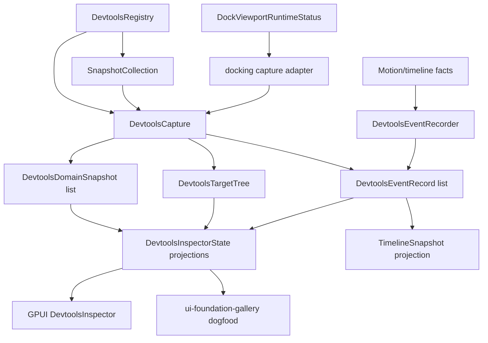

# DevTools Target Domain Runtime - Plan

## Goal Capsule

Refactor Open GPUI DevTools from a flat snapshot collection into a target/domain/event capture runtime. The existing `SnapshotEnvelope` and registry-backed probes remain the compatibility surface; the new layer adds target identity, domain-scoped outputs, bounded event history, and docking/multi-viewport topology so complex apps can explain what object produced which facts.

Authority order: current user request, AGENTS.md repository rules, `docs/plans/2026-07-09-001-feat-devtools-ecosystem-deepening-plan.md`, existing `crates/devtools` contracts, then this plan. Stop and re-plan only if the target/domain model would require DevTools to mutate app state, own docking/layout authority, or bypass existing sanitizer paths.

Execution profile: work directly on `main` is allowed by the user for this run. Use conventional commits at green slices, merge or rebase local `main` with `origin/main` before pushing, and record durable progress in `docs/knowledge/engineering/` rather than in this plan.

## Product Contract

### Summary

The previous DevTools slice added command, timeline, layout, category projections, and registry-backed gallery dogfood. The next ecosystem layer should make those facts navigable by target and domain, matching the shape used by mature tooling: Chromium DevTools has targets and SDK models, Flutter DevTools separates connected app services, inspector, and performance controllers, React DevTools separates backend agent/component tree/profiling streams, and Dear ImGui exposes metrics/debug logs for docking and viewports.

### Problem Frame

`SnapshotCollection` is intentionally simple, but it is now too flat for docking, multi-window apps, and future plugin-like DevTools extensions. A command snapshot, a layout snapshot, and a docking runtime snapshot can share the same app/window/viewport owner, but today that relationship is implicit in probe ids and JSON payloads. Timeline events are also one-shot snapshot payloads, not a bounded local history that domains can contribute to over time.

### Requirements

Core model:

- R1. DevTools must expose a sanitized target tree covering app, window, viewport, dockspace, panel, probe, and custom targets.
- R2. DevTools must expose domain snapshots that attach command, layout, timeline, docking, motion, data, theme, accessibility, interaction, diagnostics, or custom facts to a target.
- R3. A new capture object must carry targets, domains, events, diagnostics, and legacy snapshots so old probe consumers keep compiling while new inspector surfaces use richer structure.
- R4. `DevtoolsRegistry` must support collecting a target/domain capture without removing the existing `collect()` path.

Safety and ownership:

- R5. The runtime stays read-only; no DevTools target, domain, or event API may mutate command dispatch, layout, docking, motion, form, resource, or app state.
- R6. Probe ids, target ids, domain ids, labels, event ids, diagnostics, and JSON payloads must all flow through the same sanitizer/redaction discipline as existing snapshots.
- R7. Source crates remain runtime authorities and expose only narrow public debug/status facts; DevTools must not reach into private docking or GPUI fields.

Event runtime:

- R8. DevTools must add a bounded event recorder with stable sequence ids, target/domain references, event kind, timestamp/order fields, optional duration, and sanitized payload.
- R9. The recorder must degrade predictably when capacity is exceeded by reporting omitted event counts, not by silently losing ordering facts.
- R10. Timeline snapshots must be able to project from the event recorder while preserving the existing `TimelineSnapshot` compatibility API.

Docking and multi-viewport:

- R11. Docking DevTools must project `DockViewportRuntimeStatus` into targets for dock runtime, dockspaces, viewport windows, lifecycle records, platform capabilities, and visual affordances.
- R12. Docking DevTools must expose a graph/domain view with nodes, edges, status summaries, and unavailable diagnostics without recomputing docking layout.
- R13. Docking DevTools must emit bounded domain events for route, activation, close, tear-off, platform sync, drop outcome, and visual affordance state when those public records are present.

Inspector and gallery:

- R14. `DevtoolsInspectorState` must support target rows, domain rows, event rows, category summaries, and selected target/domain/detail projections from a capture.
- R15. Filtering and selection must be deterministic across target labels, domain labels, snapshot kinds, diagnostics, and event labels.
- R16. The GPUI inspector must render a compact target/domain/event surface without nested cards or mutation controls.
- R17. The gallery DevTools page must dogfood the capture model while retaining legacy snapshot collection tests.
- R18. Tests, docs, public API scan, and engineering memory must cover the new model, feature gates, and compatibility boundary.

### Acceptance Examples

- AE1. Given a registry with legacy command, layout, and timeline probes, when `collect_capture()` runs, the capture includes a root app target, one probe target per probe, domain snapshots attached to those targets, legacy snapshots, and no unsanitized labels.
- AE2. Given a capture with command and docking domains under different targets, when inspector state is filtered by `docking`, selected rows move to the first visible docking target/domain and the legacy snapshot selection remains deterministic.
- AE3. Given a bounded event recorder with capacity 2 and five events, when it is exported, two ordered events remain and the omitted count is 3.
- AE4. Given a `DockViewportRuntimeStatus` with platform capabilities, lifecycle records, and visual affordances, when converted to a capture, docking target rows and graph nodes reflect those public facts without private field access.
- AE5. Given the gallery DevTools collection, when contract tests run, both legacy snapshot probes and the new capture projections are asserted so downstream users can migrate gradually.

### Scope Boundaries

In scope: local target/domain/event DTOs, registry capture collection, inspector projections, GPUI read-only UI, docking runtime capture adapters, timeline projection from event records, gallery dogfood, docs, tests, and cleanup of superseded duplicate helpers introduced during the work.

Out of scope: Chrome DevTools Protocol compatibility, remote debugging, live mutation commands, persistent keymap editing, time travel, GPU frame capture, tracing subscriber integration, screenshot baselines as the primary correctness gate, and making DevTools a dependency of source crates.

### Sources and Research

- Baseline plan: `docs/plans/2026-07-09-001-feat-devtools-ecosystem-deepening-plan.md`.
- Baseline verification: `docs/knowledge/engineering/verification/2026-07-09-devtools-ecosystem-final-verification.md`.
- DevTools prior memory: `docs/knowledge/engineering/subagents/2026-07-09-devtools-ecosystem-prior-memory.md`.
- Current DevTools surface: `crates/devtools/src/snapshot.rs`, `crates/devtools/src/registry.rs`, `crates/devtools/src/inspector.rs`, `crates/devtools/src/timeline.rs`, `crates/devtools/src/layout.rs`, `crates/devtools/src/docking.rs`.
- Docking public status surface: `crates/gpui_docking/src/viewport_runtime_status.rs`, `crates/gpui_docking/src/debug.rs`, `crates/gpui_docking/src/advanced.rs`.
- Chromium reference: `repo-ref/chromium-devtools-frontend/front_end/core/sdk/TargetManager.ts`, `repo-ref/chromium-devtools-frontend/front_end/core/sdk/Target.ts`, `repo-ref/chromium-devtools-frontend/front_end/core/sdk/SDKModel.ts`, `repo-ref/chromium-devtools-frontend/front_end/panels/timeline/README.md`.
- Flutter reference: `repo-ref/flutter-devtools/packages/devtools_app/lib/src/service/service_manager.dart`, `repo-ref/flutter-devtools/packages/devtools_app/lib/src/screens/inspector/inspector_controller.dart`, `repo-ref/flutter-devtools/packages/devtools_app/lib/src/screens/performance/performance_controller.dart`.
- React reference: `repo-ref/react-devtools/packages/react-devtools-shared/src/backend/agent.js`, `repo-ref/react-devtools/packages/react-devtools-shared/src/backend/profilingHooks.js`, `repo-ref/react-devtools/packages/react-devtools-shared/src/frontend/types.js`.
- Dear ImGui reference: `repo-ref/imgui/imgui_internal.h` metrics/debug log and docking/viewport debug concepts.

## Planning Contract

### Key Technical Decisions

- KTD1. Introduce `DevtoolsCapture` above `SnapshotCollection`, not instead of it. The new capture becomes the richer read model while `SnapshotCollection` remains the compatibility export for existing probes and tests.
- KTD2. Model target identity as newtypes and trees. Stringly probe ids are useful compatibility handles, but target/domain/event references need typed ids to make invalid joins harder.
- KTD3. Domains wrap existing snapshot envelopes instead of duplicating payload conversion. Existing command, layout, timeline, form, resource, motion, and theme adapters stay the source of JSON/tree conversion.
- KTD4. Event recording is a local bounded ring buffer, not a tracing backend. It should be cheap, deterministic in tests, and usable by docking/motion/layout without installing a subscriber.
- KTD5. Docking adapters consume public `DockViewportRuntimeStatus` and debug summaries only. Missing graph facts become stable diagnostics or summary nodes, not private reach-through.
- KTD6. Inspector state owns target/domain/event projection. GPUI rendering consumes state projections so tests can validate behavior without a live window.
- KTD7. The gallery migrates by dogfooding capture while preserving legacy collection assertions. This avoids a flag day for downstream snapshot consumers.

### High-Level Technical Design

### Sequencing

1. Add core target/domain/capture DTOs and tests before touching UI or docking.
2. Extend registry/probe collection to produce captures while keeping `collect()` behavior stable.
3. Add event recorder and timeline projection so docking can emit events into an established model.
4. Rewrite docking adapter around target/domain/graph/events using public runtime status.
5. Wrap existing command/layout/timeline producers into domain snapshots.
6. Upgrade inspector state and GPUI UI to target/domain/event projections.
7. Move gallery/docs/tests to the new capture dogfood path, then run verification and review.

### Risks and Dependencies

- RD1. Public API growth can destabilize v0.3 inventory. Mitigation: keep DTOs small, document every public item, and run `cargo run -p xtask -- scan-public-api --check`.
- RD2. Target/domain/capture can duplicate legacy snapshot logic. Mitigation: reuse `SnapshotEnvelope`, `SnapshotTree`, and existing adapter functions as the payload authority.
- RD3. Docking status is rich but not a full layout graph. Mitigation: represent what public status proves, name unavailable facts with stable diagnostics, and do not infer private topology.
- RD4. Event recorder ordering can become nondeterministic if wall-clock time is required. Mitigation: store monotonic sequence order and make timestamp optional.
- RD5. Broad local tests on Windows can hit resource limits. Mitigation: run package-scoped gates first and fall back to `-j 1` only for environmental resource failures.

## Implementation Units

### U1. Target, Domain, and Capture Core

Goal: add the typed read model that relates snapshots to targets and domains.

Requirements: R1, R2, R3, R5, R6, R18.

Files:

- `crates/devtools/src/target.rs`
- `crates/devtools/src/domain.rs`
- `crates/devtools/src/snapshot.rs`
- `crates/devtools/src/lib.rs`
- `crates/devtools/tests/target_domain_contracts.rs`

Approach:

- Add `DevtoolsTargetId`, `DevtoolsTargetKind`, `DevtoolsTargetSnapshot`, and `DevtoolsTargetTree` with sanitized ids, labels, optional parent ids, metadata, and deterministic ordering.
- Add `DevtoolsDomainKind`, `DevtoolsDomainId`, and `DevtoolsDomainSnapshot` that attach a domain to a target and optionally hold a `SnapshotEnvelope`.
- Add `DevtoolsCapture` with targets, domains, events, diagnostics, and legacy snapshots; add conversion back to `SnapshotCollection`.
- Keep constructors small and typed; avoid a trait abstraction until at least two real producers need it.

Test scenarios:

- Target ids, labels, metadata, and custom kinds are sanitized.
- A capture created from legacy snapshots contains probe targets and domain snapshots in deterministic order.
- `SnapshotCollection` round-trip from capture preserves legacy snapshots and diagnostics.
- Custom target/domain kinds do not leak token-like text.

Verification:

- `cargo nextest run -p open-gpui-devtools target_domain --no-fail-fast --locked`
- `cargo check -p open-gpui-devtools --all-features --tests --locked`

### U2. Registry Capture Pipeline

Goal: make `DevtoolsRegistry` collect both legacy snapshots and target/domain captures.

Requirements: R3, R4, R5, R6, R14, R17.

Files:

- `crates/devtools/src/probe.rs`
- `crates/devtools/src/registry.rs`
- `crates/devtools/src/target.rs`
- `crates/devtools/src/domain.rs`
- `crates/devtools/tests/snapshot_contracts.rs`
- `crates/devtools/tests/adapter_contracts.rs`

Approach:

- Add `DevtoolsRegistry::collect_capture()` that calls the existing probe path, then maps each successful snapshot into a probe target and a domain snapshot.
- Add optional target metadata support to closure-backed probes only if U1 tests show the default probe target is too weak; otherwise keep the first slice compatibility-first.
- Preserve `DevtoolsRegistry::collect()` behavior and duplicate-probe errors.
- Make collection failures appear as capture diagnostics and diagnostic-domain facts where useful.

Test scenarios:

- Existing registry collection tests pass unchanged.
- Capture collection over mixed successful and failing probes creates deterministic targets, domains, diagnostics, and legacy snapshots.
- Duplicate probe registration still fails before any target/domain state is produced.

Verification:

- `cargo nextest run -p open-gpui-devtools snapshot adapter target_domain --no-fail-fast --locked`
- `cargo check -p open-gpui-devtools --all-features --tests --locked`

### U3. Bounded Event Recorder and Timeline Projection

Goal: add a reusable local event history that timeline and docking can share.

Requirements: R5, R6, R8, R9, R10, R13, R18.

Files:

- `crates/devtools/src/event.rs`
- `crates/devtools/src/timeline.rs`
- `crates/devtools/src/lib.rs`
- `crates/devtools/tests/event_recorder_contracts.rs`
- `crates/devtools/tests/timeline_adapters.rs`

Approach:

- Add `DevtoolsEventKind`, `DevtoolsEventRecord`, `DevtoolsEventRecorder`, and `DevtoolsEventBatch` with a bounded `VecDeque`.
- Store sequence order as the primary ordering field; support optional timestamp and duration for producers that have clock facts.
- Include optional target/domain references so events can be filtered without parsing payload JSON.
- Add a `TimelineSnapshot` projection from event batches while keeping existing timeline constructors working.

Test scenarios:

- Recorder capacity bounds exported events and reports omitted counts.
- Event labels, ids, target ids, domain ids, and payloads are sanitized.
- Timeline projection preserves sequence order and optional duration.
- Existing motion timeline tests remain green.

Verification:

- `cargo nextest run -p open-gpui-devtools event timeline --no-fail-fast --locked`
- `cargo check -p open-gpui-devtools --features motion --tests --locked`

### U4. Docking Target, Domain, Graph, and Events

Goal: turn docking runtime diagnostics into target/domain capture data for multi-viewport debugging.

Requirements: R1, R2, R5, R6, R7, R11, R12, R13, R17, R18.

Files:

- `crates/devtools/src/docking.rs`
- `crates/devtools/tests/framework_adapters.rs`
- `crates/gpui_docking/src/viewport_runtime_status.rs`
- `crates/gpui_docking/src/debug.rs`
- `crates/gpui_docking/src/advanced.rs`

Approach:

- Add docking-specific DTOs only when they clarify target graph output: `DockingGraphSnapshot`, `DockingGraphNodeSnapshot`, and `DockingGraphEdgeSnapshot`.
- Add `docking_runtime_capture(status)` or equivalent that creates a docking root target, platform capability domain, lifecycle viewport targets, visual affordance targets, graph domain, and bounded events.
- Keep `docking_runtime_probe_snapshot(status)` as a compatibility wrapper over the new domain graph output.
- If `DockViewportRuntimeStatus` lacks a public field needed for a target, add a narrow public status accessor or emit `runtime.unavailable`.

Test scenarios:

- Platform capabilities become a docking domain under a docking runtime target.
- Lifecycle records create viewport targets with route/input/platform request summaries.
- Visual affordance records create child targets and events without leaking debug labels.
- Legacy docking probe snapshot still serializes the same high-level runtime summary.

Verification:

- `cargo check -p open-gpui-devtools --features docking --tests --locked`
- `cargo nextest run -p open-gpui-devtools --features docking framework_adapters --no-fail-fast --locked`
- `cargo nextest run -p open-gpui-docking viewport_runtime_status host_debug --no-fail-fast --locked`

### U5. Domain Wrappers for Existing Producers

Goal: make command, layout, timeline, motion, GPUI, form, resource, and theme producers available as target/domain facts without duplicating adapters.

Requirements: R2, R3, R4, R5, R6, R10, R14, R17.

Files:

- `crates/devtools/src/command.rs`
- `crates/devtools/src/layout.rs`
- `crates/devtools/src/timeline.rs`
- `crates/devtools/src/motion.rs`
- `crates/devtools/src/gpui.rs`
- `crates/devtools/src/form.rs`
- `crates/devtools/src/resource.rs`
- `crates/devtools/src/ui_components.rs`
- `crates/devtools/tests/command_adapters.rs`
- `crates/devtools/tests/layout_adapters.rs`
- `crates/devtools/tests/form_resource_adapters.rs`
- `crates/devtools/tests/framework_adapters.rs`

Approach:

- Add small wrapper helpers that accept a target id and return `DevtoolsDomainSnapshot` from existing `SnapshotEnvelope` or `SnapshotProbeSnapshot` outputs.
- Keep feature gates unchanged: `command`, `gpui`, `motion`, `docking`, `form`, `resource`, and `ui-components`.
- Avoid introducing producer traits until repeated wrapper code proves it is valuable.

Test scenarios:

- Command registry/keybinding/keymap domain wrappers retain existing command snapshot payloads.
- GPUI scroll viewport layout domain wrapper retains geometry payloads.
- Form/resource/theme wrappers preserve redaction counts.
- Feature-gated builds compile for each affected adapter family.

Verification:

- `cargo check -p open-gpui-devtools --all-features --tests --locked`
- `cargo nextest run -p open-gpui-devtools --all-features command layout form_resource framework --no-fail-fast --locked`

### U6. Inspector Target, Domain, and Event Projections

Goal: upgrade inspector state and GPUI rendering to navigate captures, not only flat snapshot rows.

Requirements: R14, R15, R16, R17, R18.

Files:

- `crates/devtools/src/inspector.rs`
- `crates/devtools/src/gpui.rs`
- `crates/devtools/tests/inspector_contracts.rs`

Approach:

- Add `DevtoolsInspectorState::from_capture()` while keeping `new(SnapshotCollection)` as a compatibility constructor.
- Add public row DTOs for targets, domains, and events with selected flags, labels, counts, and category/domain metadata.
- Update filtering to search target labels, domain labels, snapshot labels, diagnostics, and event labels in one deterministic pass.
- Render a compact target list, domain summary/tabs, selected detail, and event strip/list using existing UI component style.

Test scenarios:

- Empty capture renders no target/domain/event rows and no selected detail.
- Filtering by target, domain, event, or legacy snapshot kind moves selection to the first visible result.
- Legacy `DevtoolsInspectorState::new(collection)` still exposes snapshot rows and category summaries.
- GPUI debug selectors exist for root, target list, domain list, event list, selected detail, and diagnostics.

Verification:

- `cargo nextest run -p open-gpui-devtools inspector --no-fail-fast --locked`
- `cargo check -p open-gpui-devtools --features gpui --tests --locked`

### U7. Gallery Dogfood, Docs, Memory, and Cleanup

Goal: make the new capture runtime visible in the gallery and document the extension pattern.

Requirements: R3, R4, R16, R17, R18.

Files:

- `examples/ui-foundation-gallery/src/pages/devtools.rs`
- `examples/ui-foundation-gallery/tests/foundation_gallery/devtools_contracts.rs`
- `crates/devtools/README.md`
- `README.md`
- `docs/verification.md`
- `docs/knowledge/engineering/registry/`
- `docs/knowledge/engineering/progress/`
- `docs/knowledge/engineering/verification/`

Approach:

- Add `devtools_gallery_capture()` and make the page derive inspector state from the capture.
- Preserve `devtools_gallery_collection()` for legacy tests by returning the capture's legacy collection.
- Add deterministic docking status sample data if a public constructor exists; otherwise keep the live docking diagnostic and add domain diagnostic coverage.
- Update docs with target/domain/event terminology, feature-gate examples, migration guidance from `SnapshotCollection`, and verification commands.
- Record progress and final verification as sharded engineering memory.

Test scenarios:

- Gallery capture includes app/probe targets, command/layout/timeline domains, and event rows.
- Legacy gallery collection order remains deterministic for existing tests.
- Docs mention read-only target/domain/event boundaries and no remote protocol.
- Source search confirms no new static DevTools demo builders survive in the gallery.

Verification:

- `cargo nextest run -p open-gpui-ui-foundation-gallery devtools --no-fail-fast --locked`
- `cargo run -p xtask -- scan-doc-links`
- `cargo run -p xtask -- scan-public-api --check`

## Verification Contract

Required local gates:

| Gate | Command | Done Signal |
|---|---|---|
| Format | `cargo fmt -p open-gpui-devtools -p open-gpui-ui-foundation-gallery -p open-gpui-docking` | Changed Rust files are formatted. |
| DevTools compile | `cargo check -p open-gpui-devtools --all-features --tests --locked` | All feature-gated DevTools code compiles. |
| DevTools tests | `cargo nextest run -p open-gpui-devtools --all-features --no-fail-fast --locked` | Target/domain/event/docking/inspector tests pass. |
| Docking status tests | `cargo nextest run -p open-gpui-docking viewport_runtime_status host_debug --no-fail-fast --locked` | Public docking status/debug assumptions remain valid. |
| Gallery dogfood | `cargo nextest run -p open-gpui-ui-foundation-gallery devtools --no-fail-fast --locked` | Gallery capture and legacy collection tests pass. |
| Docs | `cargo run -p xtask -- scan-doc-links` | Documentation links are valid. |
| Public API | `cargo run -p xtask -- scan-public-api --check` | New public exports match the API inventory rules. |

Conditional gates:

- Run package-scoped `nextest` with `-j 1` only if Windows resource limits cause unrelated broad-run failures.
- Run manual gallery smoke with `cargo run -p open-gpui-ui-foundation-gallery -- --page devtools` if GPUI rendering changes are not sufficiently covered by debug-selector tests.
- Run `cargo run -p xtask -- scan-ui-contract` only if UI component public contracts are touched beyond DevTools inspector rendering.

Quality gates:

- Run a simplification pass after U3/U4 if capture/domain/event wrappers duplicate structure.
- Run `ce-code-review mode:agent depth:full` before final push because this is a cross-cutting public API and sanitizer-sensitive refactor.
- Apply eligible review findings, record residuals if any, and keep the plan body free of execution status.

## Definition of Done

Global done criteria:

- All non-deferred requirements R1-R18 are implemented or represented by a stable unavailable diagnostic.
- `DevtoolsCapture` is the richer target/domain/event read model, and `SnapshotCollection` remains usable for legacy consumers.
- Registry capture collection, event recording, docking capture, domain wrappers, inspector projections, and gallery dogfood are covered by tests.
- No new DevTools API bypasses sanitizer/redaction for ids, labels, diagnostics, events, or JSON payloads.
- Docking adapters consume public runtime status/debug facts only.
- Required verification gates pass or any environmental failure is documented with command, reason, and scoped replacement evidence.
- Dead-end code, duplicate adapters, and static demo-only helpers introduced during this work are removed.
- Engineering memory records major progress, review, final verification, and pushed commit state.
- Local `main` is merged with `origin/main` before final push, and `origin/main` contains the completed commits.

Per-unit done criteria:

- U1 is done when target/domain/capture DTOs compile, are documented, and pass sanitizer/round-trip tests.
- U2 is done when `collect_capture()` maps legacy probes into deterministic targets/domains without changing `collect()`.
- U3 is done when bounded event recorder and timeline projection tests pass.
- U4 is done when docking runtime status produces target/domain/graph/event facts and legacy docking snapshot compatibility remains covered.
- U5 is done when existing adapter families can emit domain snapshots under feature gates without payload duplication.
- U6 is done when inspector state and GPUI UI expose target/domain/event projections with deterministic filtering and selectors.
- U7 is done when gallery/docs/memory are updated and all verification gates pass.

## Appendix

### Deferred Ideas

- Remote DevTools protocol bridge.
- Plugin marketplace for third-party domains.
- Live mutation commands for layout or keymaps.
- Time-travel playback.
- Persistent event recording across app restarts.
- GPU frame capture.
