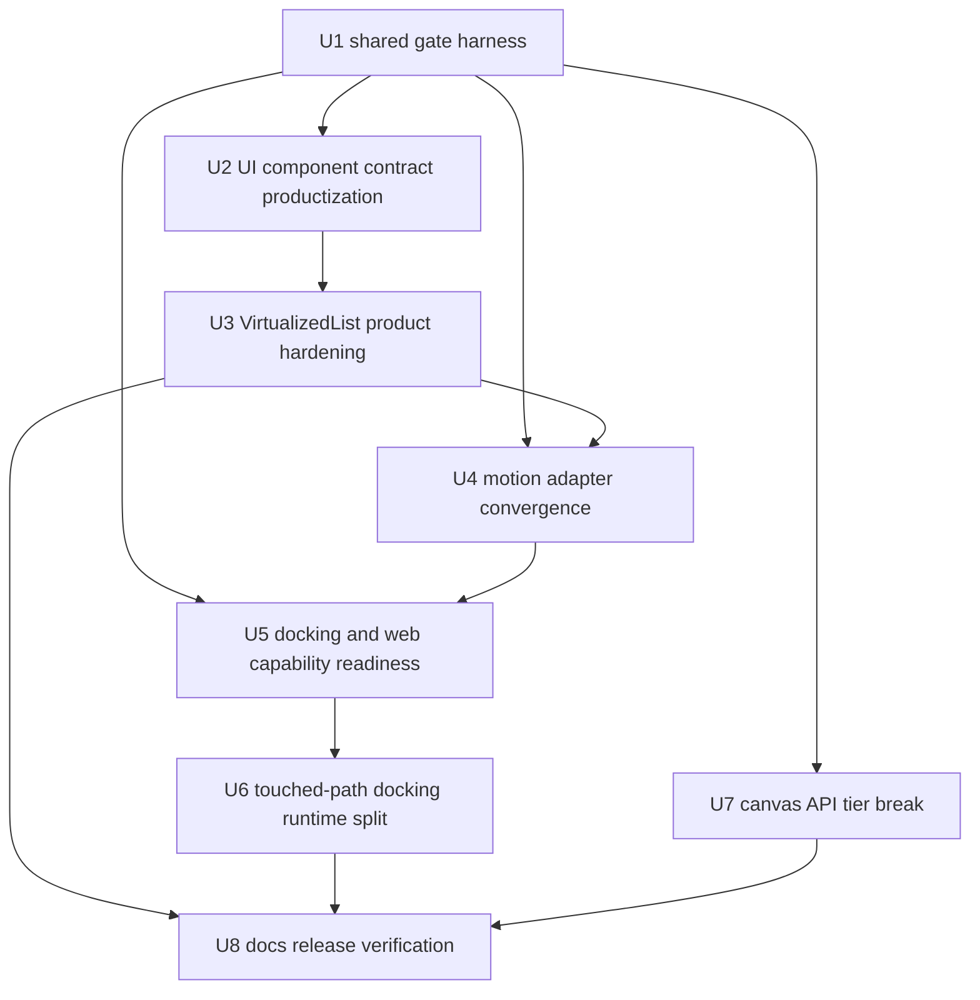
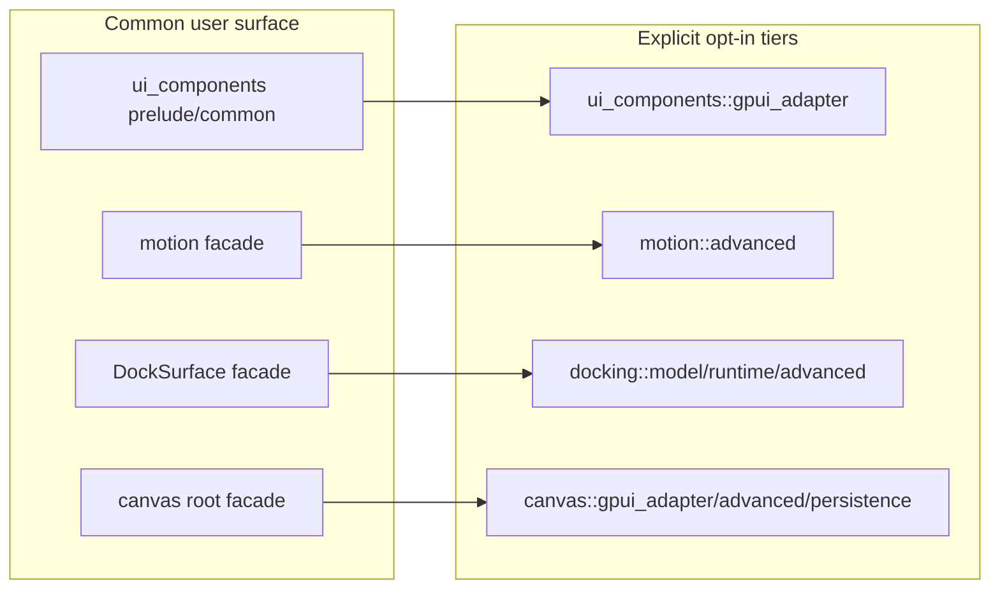
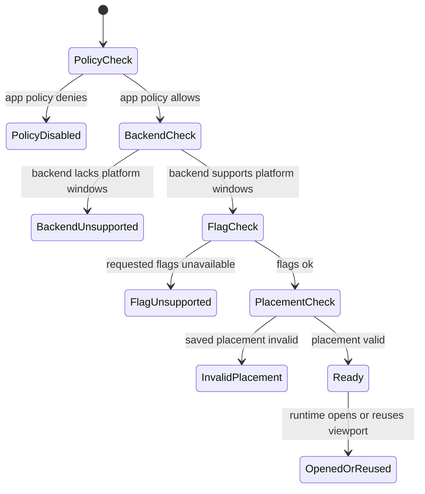
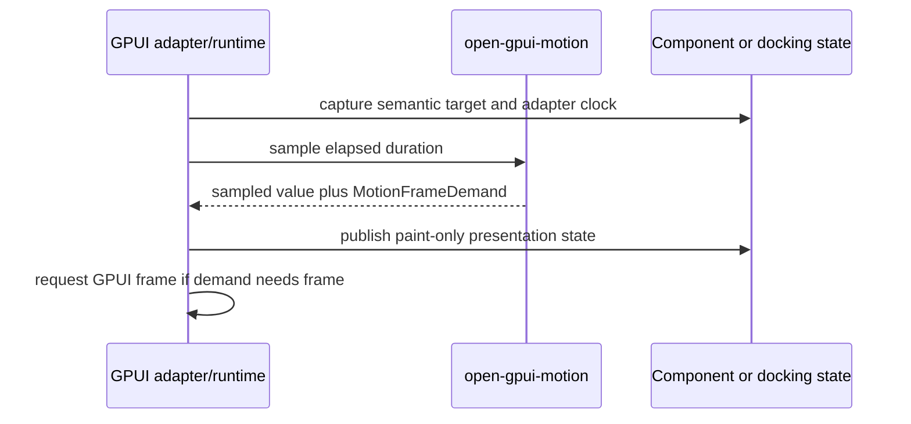

# Open GPUI v0.3 Product Surface Hardening - Plan

## Goal Capsule

| Field | Value |
|---|---|
| Objective | Finish the next v0.3.0-facing hardening pass by productizing UI component contracts, converging motion frame ownership, maturing docking/web capability reporting, adding canvas to API-tier gates, and updating release-facing docs. |
| Authority | The user explicitly authorized fearless breaking refactors, deleting obsolete code, subagent research/review, incremental commits, local-main work, remote pushes, and goal-mode execution. |
| Release boundary | User-facing breaks belong to v0.3.0 because v0.2.0 has shipped. Do not add deprecation shims unless internal migration proves a short-lived alias is cheaper than broad churn. |
| Execution profile | Cross-crate product-surface refactor touching Rust APIs, examples, xtask scans, READMEs, changelog, release inventory, and CI-relevant verification. |
| Stop conditions | Stop only if implementation proves a planned break removes a still-needed public capability, contradicts platform facts, or requires inventing web platform-window support instead of reporting unsupported capability. |
| Landing strategy | Work directly on the current branch per user instruction, keep commits unit-sized, stage only touched files, merge/reconcile remote main when needed, and push after meaningful green slices. |

---

## Product Contract

### Summary

Open GPUI already has deep subsystems, but several public product surfaces still rely on scattered contracts: component registry/a11y/theme gates are not the single authority, motion adapters still interpret time locally, docking capability reporting is correct but not yet ergonomic enough for mature multiviewport workflows, and canvas is not covered by the public API tier scan. This plan completes the v0.3.0 pre-release hardening layer so ordinary users see stable facades and advanced users opt into explicit lower-level tiers.

### Problem Frame

The v0.2.0 release proved the project can ship crates, docs, wasm checks, and release automation. The remaining risk is not missing isolated widgets; it is that each strong subsystem can still drift at its public boundary. UI components have broad coverage but need a stronger product contract around ownership, accessibility, theme portability, and gallery conformance. Motion has the right renderer-neutral model but first-party adapters still store `Instant` and frame-host details in inconsistent places. Docking exposes a `DockSurface` facade and fail-closed web behavior, but capability/readiness information is split across policy, backend facts, runtime records, and smoke checks. Canvas has a mature model and README but a broad root facade and no workspace-level API tier gate.

Because this is pre-1.0 and v0.3.0 is the next user-facing breaking boundary, this plan prefers direct breaks and deletion over compatibility layering when the old shape encourages downstream users to depend on internals.

### Requirements

**UI component productization**

- R1. Component ownership, default/common/prelude exports, docs status, gallery status, and a11y evidence must be governed by one contract source or a small tested allowlist.
- R2. Theme JSON schema, theme loading, resolver behavior, and gallery theme samples must form a portable user-facing theme story.
- R3. Accessibility gates must cover component labels, roles, disabled/selected/value state, focus behavior, and non-interactive structural rows where applicable.
- R4. `VirtualizedList` must be locked as a rich component primitive with descriptors, initial/prepend/append loading, empty, exhausted, error, retry, custom row rendering, measured rows, sticky section facts, typeahead, range selection, and renderer-neutral snapshots; current capabilities should be documented and protected from regression rather than rebuilt.

**Motion and frame ownership**

- R5. Motion remains renderer-neutral and must not schedule UI frames, mutate semantic state, own GPUI windows, or depend on docking/component state.
- R6. First-party motion consumers must converge on elapsed-time sampling and adapter-owned frame requests instead of each runtime exposing its own `Instant` or boolean scheduling convention.
- R7. Public motion imports should favor stable facade vocabulary; low-level frame host, scalar controller, model, policy-input, and timeline internals stay advanced or module-scoped.

**Docking and web capability maturity**

- R8. Docking common APIs must report platform viewport readiness through a coherent facade-level capability/readiness surface that combines policy, backend support, flag support, placement validity, and runtime lifecycle state.
- R9. Web stays single-window plus in-window docking/floating unless backend facts report real platform viewport windows. Unsupported platform viewports must fail closed and be visible in browser smoke.
- R10. Docking runtime modules and large tests should be split by lifecycle, route, close, placement, preview, and focus ownership where that reduces future rewrite cost without weakening behavior.

**Canvas and release surface**

- R11. Canvas must join the workspace public API tier scan so future v0.3 breaks cannot bypass release-facing API gates.
- R12. Canvas root exports should be narrowed to common app concepts, with GPUI adapter, persistence, raw paint, mutation, runtime query, and diagnostic APIs moved behind explicit tiers.
- R13. Crate READMEs, `CHANGELOG.md`, `docs/release/breaking-changes.md`, and `docs/verification.md` must describe user-facing migration groups rather than low-level implementation churn.
- R14. Verification must cover focused crate tests, public API scans, release-doc checks, docs links, stable wasm checks, browser smoke, and platform CI handoff.

### Acceptance Examples

- AE1. Given a component is added or moved, when public-surface gates run, then the component's owner class, default export status, docs status, gallery status, and a11y evidence are either recorded in the contract inventory or rejected with a targeted message.
- AE2. Given a custom themed app loads a theme JSON file, when theme validation and gallery samples run, then schema validation, active mode selection, and component recipe resolution use the same public theme facade.
- AE3. Given a `VirtualizedList` with grouped rows, custom content, status rows, and measured heights, when existing typeahead, range selection, reveal, and sticky section snapshots are exercised, then selection/focus semantics stay key-based and non-selectable rows remain structural.
- AE4. Given splitter, virtualized-list active indicator, and docking transitions animate, when the adapter samples them, then motion receives elapsed time and returns frame demand while GPUI frame requests stay at adapter boundaries.
- AE5. Given web reports no platform viewport window support, when docking tries to open or restore a platform viewport, then the facade returns a typed unsupported/readiness outcome and browser smoke confirms no fake multiviewport window is created.
- AE6. Given a canvas user imports the crate root, when public API scan runs, then common model/editor/view concepts remain available while raw index, mutation, paint, persistence, and adapter internals require explicit tier imports.
- AE7. Given release docs are generated or checked, when changelog and breaking inventory are scanned, then v0.3.0 changes are grouped by user-facing API areas without manual line wrapping or duplicated low-level details.

### Scope Boundaries

In scope:

- Breaking v0.3.0 public API moves for UI components, motion consumers, docking capability facades, and canvas API tiers.
- Deleting obsolete tests, docs, aliases, helper modules, or examples that only preserve a misleading old public shape.
- Strengthening `xtask` scans, public-surface tests, crate READMEs, gallery contract tests, and release docs.
- Refactoring runtime/test files only where the active readiness or facade work already touches that ownership boundary.

Deferred to follow-up work:

- A full ImGui DockBuilder clone, browser DOM popout/window emulation, or new platform backend primitives.
- Full animation authoring DSLs, presence systems, keyframe timelines, variants, or timeline editors.
- Visual redesign of component examples, screenshot diff infrastructure, and a standalone `open-gpui-ui-headless` crate.
- New canvas GPU/tile/R-tree index backends beyond public API tiering and existing runtime-query guarantees.
- Broad docking runtime/test modularization that is not required by the platform-viewport readiness work.

Outside this plan:

- Publishing v0.3.0, manual GitHub Release note authoring, unrelated dependency upgrades, and broad aesthetic redesign.

### Success Criteria

- UI component contract gates make component ownership, a11y, theme, gallery, and docs drift visible before release.
- Motion first-party adapters sample through elapsed-time/frame-demand contracts without moving scheduling into `open-gpui-motion`.
- Docking users get facade-level capability/readiness results for platform viewport flows, and web smoke proves unsupported multiviewport behavior remains fail-closed.
- Canvas has explicit API tiers and participates in the same public API freeze gate as docking, motion, UI components, and UI core.
- Docs and release notes explain v0.3.0 migration by user-facing areas.

---

## Planning Contract

### Key Technical Decisions

- KTD1. Treat this as a v0.3.0 product-surface hardening pass, not a feature breadth sprint. The goal is to remove future migration traps before more users build on v0.2.x shapes.
- KTD2. Use contract gates before and during breaks. Public API scans, component inventories, gallery conformance, and release-doc checks should fail on drift before code cleanup hides the cause.
- KTD3. Keep power-user APIs, but make the path say what tier the user is entering. `advanced`, `model`, `runtime`, `gpui_adapter`, and `persistence` are acceptable; accidental root/prelude/default leakage is not.
- KTD4. Motion does not get a global scheduler. Adapter-local clocks convert UI/runtime time into elapsed samples, and only adapters call GPUI frame APIs.
- KTD5. Docking capability is runtime truth, not cargo-feature optimism. Policy, backend support, requested flags, placement, and lifecycle state all feed one user-facing readiness report.
- KTD6. Canvas is productized enough to need stricter API tiering. The root facade should teach the common model/editor/view path, while raw paint, index, mutation, persistence, and adapter internals move to named tiers.
- KTD7. Documentation is part of the API freeze. README snippets, examples, changelog, breaking inventory, and verification commands must move with the code.

### Assumptions

- Existing v0.3 API freeze work is present on `main`; this plan extends it rather than redoing completed facade splits.
- `DockSurface`, motion elapsed APIs, UI component contract rows, and canvas explicit root reexports are the current baseline.
- Web/WASM support remains WebGPU single-window rendering with explicit unsupported platform viewport windows.
- The current branch may be committed and pushed directly, but unrelated user changes must remain untouched and unstaged.
- If a broad local workspace gate stalls, focused gates plus CI handoff may own the platform-confirmation tail.

### High-Level Technical Design

### Priority Order

1. Add or extend the shared API/contract gate harness before breaking more public surfaces.
2. Productize UI component contracts because the roadmap already identifies registry, a11y, and theme as the next risk.
3. Converge motion adapters because time ownership affects components and docking.
4. Mature docking/web capability reporting before promising multiviewport ergonomics.
5. Add canvas API tiering because canvas is packageable but not yet covered by the global API scan.
6. Finish docs, changelog, verification, review, commits, and push.

### Risks and Mitigations

| Risk | Mitigation |
|---|---|
| Large public-surface breaks create noisy compile failures. | Land gates first, then migrate by crate/tier and commit green slices. |
| API scans become brittle source-token checks. | Keep fast source scans for targeted messages, but prefer compile or real public signature evidence where the repo already supports it. |
| Motion convergence accidentally moves scheduling into motion. | Tests must prove motion returns demand only; adapters still own frame requests and semantic state. |
| Docking readiness duplicates runtime diagnostics. | Build facade reports from existing policy/backend/runtime facts instead of inventing a parallel status model. |
| Canvas root narrowing hides legitimate power-user APIs. | Keep explicit advanced/adapter/persistence tiers public and document imports. |
| Browser smoke becomes flaky. | Keep smoke focused on stable readiness/canvas/input/capability facts and leave shared-memory/nightly experiments optional. |

### Sources and Research

- `docs/knowledge/engineering/current-state.md` identifies current `main` as post runtime/docking/core and devtools ecosystem integration.
- `docs/knowledge/engineering/decisions/open-gpui-ui-productization-roadmap.md` names registry, accessibility, and theme productization as the next UI component phase.
- `crates/motion/src/lib.rs`, `crates/motion/src/frame_host.rs`, and `crates/motion/src/transition.rs` show the renderer-neutral motion boundary.
- `crates/gpui_docking/src/lib.rs`, `crates/gpui_docking/src/surface.rs`, and `crates/gpui_docking/src/policy.rs` show the current facade and capability split.
- `crates/gpui_web/README.md` states the supported stable web path and unsupported platform viewport boundary.
- `crates/canvas/src/lib.rs`, `crates/canvas/src/gpui.rs`, and `crates/canvas/src/public_surface_tests.rs` show canvas's explicit but broad root facade.
- Read-only subagent research found that docking is facade-first but not yet ImGui-mature, motion time does not conflict with UI time, web must remain fail-closed for platform viewports, and canvas needs API-tier scan coverage.

---

## Implementation Units

### U1. Establish Shared Public API And Contract Gate Harness

- **Goal:** Give later units a shared scan/reporting harness without making every surface's detailed gate a global prerequisite.
- **Requirements:** R1, R3, R7, R11, R14, AE1, AE6.
- **Dependencies:** None.
- **Files:** Modify `xtask/src/public_api_snapshot.rs`, `xtask/src/commands.rs` if command wiring changes, shared scan helpers in `xtask/src/public_api_snapshot.rs`, and `docs/verification.md`.
- **Approach:** Add the harness and diagnostics needed for per-surface tier scans. Keep the global gate able to aggregate docking, motion, UI component, UI core, and canvas results, but leave each surface's exact forbidden-token and allowlist policy in its own unit. Prefer targeted error messages that name the tier and offending token.
- **Test scenarios:** The scan command reports per-surface failures without stopping after the first surface; a surface can add a new tier rule without changing unrelated surface tests; docs list the gate as a v0.3 public API freeze check.
- **Verification:** Public API scan still passes on the current tree before surface-specific breaks, and unit-level gates added in U2, U4, U5, and U7 can reuse the shared harness.

### U2. Productize Component Contract, Theme, A11y, And Gallery Gates

- **Goal:** Make the UI component library's product contract the single source for ownership, docs, gallery, theme, and a11y drift.
- **Requirements:** R1, R2, R3, R13, R14, AE1, AE2.
- **Dependencies:** U1.
- **Files:** Modify `crates/ui_components/src/component_contract/*`, `crates/ui_components/src/theme/*`, `docs/schemas/open-gpui-theme-v1.schema.json`, `crates/ui_components/tests/a11y.rs`, `crates/ui_components/tests/theme.rs`, `crates/ui_components/tests/public_surface/*`, `examples/ui-foundation-gallery/src/pages/components/*`, `docs/ui/component-contract.md`, `crates/ui_components/README.md`.
- **Approach:** Treat `component_contract` as the ownership authority. Add missing rows or allowlist entries only when the component is intentionally public. Extend a11y evidence checks for roles, label sources, disabled/selected/value state, and focus behavior. Keep the theme JSON/schema loader and gallery theme samples in sync with resolver behavior. U2 owns the cross-component a11y/theme contract schema and gate; component-specific edge evidence belongs in the component unit that exercises it.
- **Test scenarios:** A component with default export lacks docs/gallery/a11y evidence and fails; a theme JSON file validates against schema and resolves through the same runtime facade used by gallery samples; changed themed components exercise default, hover or focus, disabled, selected or active where applicable, invalid where applicable, and a high-contrast or reduced-motion compatible sample; structural rows and disabled controls expose the expected a11y metadata through the shared gate; gallery catalog rows match contract rows.
- **Verification:** UI component public-surface, a11y, theme, and gallery component-contract tests pass.

### U3. Lock VirtualizedList As A Rich Component Primitive

- **Goal:** Convert the existing rich `VirtualizedList` behavior into an explicit product contract while preserving renderer-neutral state and adapter-owned rendering.
- **Requirements:** R3, R4, R13, AE3.
- **Dependencies:** U1, U2.
- **Files:** Modify `crates/ui_components/src/virtualized_list/*`, `crates/ui_components/tests/layout.rs`, `crates/ui_components/tests/navigation.rs` if shared helpers are needed, `examples/ui-foundation-gallery/src/pages/components/samples/virtualized_list.rs`, `examples/ui-foundation-gallery/src/pages/components/runtime/virtualized_list.rs`, `docs/ui/component-contract.md`, `crates/ui_components/README.md`.
- **Approach:** Audit the current descriptors, loading/empty/exhausted/error/retry status rows, custom row rendering, measured rows, sticky section snapshots, typeahead, range selection, reveal, and active-indicator motion. Add only missing regression gates, docs, gallery readouts, or adapter-boundary tests. U3 supplies VirtualizedList evidence to the U2 a11y gate instead of creating a parallel a11y framework. Keep `Window`, `App`, `ScrollHandle`, `FocusHandle`, and GPUI renderer hooks in the adapter layer.
- **Test scenarios:** Existing typeahead uses explicit text value and skips disabled/structural rows; existing range selection uses stable keys and skips non-selectable rows; existing sticky section snapshot reports the preceding section without changing roles or selection; loading, empty, exhausted, error, retry, and non-selectable structural rows define focusability, role, selection exclusion, and typeahead behavior; measured reveal uses exact heights when available and prunes removed-key measurements; custom row rendering remains available only through the GPUI adapter path.
- **Verification:** Focused virtualized-list tests, UI component layout tests, public-surface adapter scans, and gallery virtualized-list sample tests pass.

### U4. Converge Motion Adapter Time And Frame Demand

- **Goal:** Make splitter, virtualized-list, and docking transitions share the same elapsed-time and frame-demand ownership model.
- **Requirements:** R5, R6, R7, R13, AE4.
- **Dependencies:** U1, U3.
- **Files:** Modify `crates/motion/src/transition.rs`, `crates/motion/src/frame_host.rs`, `crates/motion/src/controller.rs`, `crates/motion/src/lib.rs`, `crates/ui_components/src/splitter.rs`, `crates/ui_components/src/virtualized_list/motion.rs`, `crates/ui_components/src/virtualized_list/runtime.rs`, `crates/gpui_docking/src/transition_executor.rs`, `crates/gpui_docking/src/presentation_commands.rs`, `crates/motion/README.md`.
- **Approach:** Introduce or promote a root-level elapsed epoch/driver facade when needed. First migrate motion core and splitter, then docking transitions before U5 consumes readiness outcomes, and migrate VirtualizedList motion after U3 confirms its current behavior contract. Convert first-party consumers so adapter-local clocks compute elapsed duration and motion only returns samples plus `MotionFrameDemand`. Move low-level frame-host or scalar execution imports behind `advanced` where they remain necessary.
- **Test scenarios:** Splitter programmatic motion requests frames while active and idles when terminal; dragging cancels or bypasses programmatic motion without scheduling through motion; virtualized-list active indicator retarget/cancel/finish resets epoch state; docking transition samples carry frame demand without directly requesting GPUI frames; reduced motion publishes final presentation state without continued demand.
- **Verification:** Motion tests, splitter tests, virtualized-list motion tests, and docking transition/presentation tests pass.

### U5. Mature Docking And Web Capability Readiness

- **Goal:** Make platform viewport readiness understandable at the `DockSurface` level and prove web remains fail-closed.
- **Requirements:** R8, R9, R13, R14, AE5.
- **Dependencies:** U1, U4.
- **Files:** Modify `crates/gpui/src/platform.rs` if backend facts need naming, `crates/gpui_docking/src/surface/viewport.rs`, `crates/gpui_docking/src/viewport_runtime_status.rs`, `crates/gpui_docking/src/viewport_open.rs`, `crates/gpui_docking/src/host_viewport_platform_capability_tests.rs`, `crates/gpui_docking/src/host_viewport_placement_tests.rs`, `crates/gpui_web/src/platform.rs`, `crates/gpui_web/examples/smoke_web/main.rs`, `xtask/src/web_smoke.rs`, `crates/gpui_docking/README.md`, `crates/gpui_web/README.md`.
- **Approach:** Build a facade-facing readiness report from policy, backend viewport support, requested platform flags, placement validation, and runtime lifecycle facts. Map readiness to visible interaction states in examples or smoke fixtures: enabled or disabled actions, unsupported messages, restore failure states, and drag/drop no-op feedback on web. Add browser smoke assertions for unsupported platform viewport capability. Keep in-window docking and floating available on web while platform viewport requests return typed unsupported outcomes.
- **Test scenarios:** Policy-disabled, backend-unsupported, flag-unsupported, invalid-placement, open/reuse, close/prevent, and stale-route cases produce distinct outcomes; readiness maps to disabled affordances, unsupported copy, restore failure presentation, and web drag/drop no-op feedback; browser smoke observes unsupported platform viewport windows without creating a platform window; native test backend still opens or reuses supported viewports; README examples describe single-window web behavior.
- **Verification:** Docking viewport capability/placement/lifecycle tests, web wasm checks, and `xtask web-smoke` pass.

### U6. Modularize Only Docking Runtime Paths Touched By Readiness

- **Goal:** Keep U5 implementation readable without turning this plan into a broad docking internals rewrite.
- **Requirements:** R10, R14.
- **Dependencies:** U5.
- **Files:** Modify `crates/gpui_docking/src/viewport_runtime.rs`, `crates/gpui_docking/src/viewport_runtime/*`, `crates/gpui_docking/src/viewport_runtime_handle/*`, `crates/gpui_docking/src/viewport_window_lifecycle.rs`, `crates/gpui_docking/src/viewport_close.rs`, `crates/gpui_docking/src/viewport_focus.rs`, `crates/gpui_docking/src/viewport_runtime_effects.rs`, and large `crates/gpui_docking/src/host_viewport_*_tests.rs` files.
- **Approach:** Split only the readiness, placement, close, route, focus, or effects code that U5 already modifies. Delete duplicated test scaffolding only when it is in the touched path. Defer broad file-size cleanup and unrelated large-test reshaping to follow-up work.
- **Test scenarios:** Runtime registration/cleanup, close/merge/prevent, route preview cleanup, placement restore, backend focus, and cross-window drop delivery still pass for the touched readiness paths; no new root/prelude exports are required by the split.
- **Verification:** Full docking nextest suite or focused ownership suites pass, and public API scan confirms the split did not leak internals.

### U7. Break Canvas Facade Into Common, Adapter, Persistence, And Advanced Tiers

- **Goal:** Make canvas match the rest of Open GPUI's v0.3 public API tier discipline.
- **Requirements:** R11, R12, R13, R14, AE6.
- **Dependencies:** U1.
- **Files:** Modify `crates/canvas/src/lib.rs`, `crates/canvas/src/gpui.rs`, `crates/canvas/src/public_surface_tests.rs`, create `crates/canvas/src/advanced.rs`, `crates/canvas/src/gpui_adapter.rs`, or `crates/canvas/src/persistence_api.rs` only if those tiers make imports clearer, modify `crates/canvas/README.md`, `docs/verification.md`.
- **Approach:** Keep common root exports for document, records, ids, graph queries, editor/store, kind registry, viewport, JSON Canvas, and common view helpers. Move raw paint/prepaint functions, widget overlay internals, index internals, mutation batches, persistence internals, runtime query, and diagnostic helpers into explicit tiers. Add scan coverage so future root leaks fail.
- **Test scenarios:** Common root import compiles for document/editor/view usage; adapter import compiles for GPUI-specific rendering helpers; persistence import compiles for persistence-specific APIs; advanced import compiles for low-level diagnostics; public API scan rejects forbidden canvas tokens at the root.
- **Verification:** Canvas public-surface tests, canvas unit tests, package checks, public API scan, and README docs checks pass.

### U8. Update Release Docs, Examples, Verification, Review, And Push

- **Goal:** Land the product-surface hardening with user-facing migration guidance and evidence.
- **Requirements:** R13, R14, AE7.
- **Dependencies:** U2, U3, U4, U5, U6, U7.
- **Files:** Modify `CHANGELOG.md`, `docs/release/breaking-changes.md`, `docs/verification.md`, root `README.md` if affected, crate READMEs for `crates/ui_components`, `crates/motion`, `crates/gpui_docking`, `crates/gpui_web`, `crates/canvas`, relevant examples, and CI workflows only if new gates need wiring.
- **Approach:** Group changelog and breaking inventory by user-facing areas: UI component contract/theme/a11y, VirtualizedList, motion adapter API, docking/web capability, and canvas API tiers. Add a short migration path per affected crate with common import before/after, advanced-tier import before/after, and one minimal compile-proven snippet or example. Avoid manual line wrapping in changelog prose. Run simplification/review after the diff stabilizes, fix eligible findings, commit logical slices, merge/reconcile remote main, and push.
- **Test scenarios:** Release docs check accepts all changed crate README/version/breaking inventory rows; docs link scan passes; migration snippets or examples compile with the new public imports; final status contains no unrelated staged files and no dead-end code from abandoned approaches.
- **Verification:** Full verification contract passes locally or has a documented CI-owned platform equivalent.

---

## Verification Contract

| Gate | Applies to | Expected outcome |
|---|---|---|
| `cargo fmt --all --check` | All units | Formatting is stable. |
| `cargo run -p xtask -- scan-public-api --check` | U1, U4, U5, U7, U8 | Public API tiers match v0.3 boundaries, including canvas. |
| `cargo run -p xtask -- scan-ui-contract` | U1, U2, U3, U8 | Component contract, docs, gallery, theme, and export gates pass. |
| `cargo nextest run -p open-gpui-ui-components public_surface a11y theme virtualized_list --no-fail-fast --locked` | U1, U2, U3 | UI component public-surface, a11y, theme, and virtualized-list gates pass. |
| `cargo nextest run -p open-gpui-ui-foundation-gallery components --no-fail-fast --locked` | U2, U3, U8 | Gallery component contract and sample coverage pass. |
| `cargo nextest run -p open-gpui-motion --no-fail-fast --locked` | U4 | Motion facade, sampling, policy, and frame-demand tests pass. |
| `cargo nextest run -p open-gpui-docking host_transition_tests host_viewport_platform_capability_tests host_viewport_route_tests host_viewport_close_tests host_viewport_placement_tests --no-fail-fast --locked` | U4, U5, U6 | Docking transition, capability, route, close, and placement behavior pass. |
| `cargo nextest run -p open-gpui-docking --no-fail-fast --locked` | U6, U8 | Full docking behavior passes after touched-path readiness splits. |
| `cargo check -p open-gpui-web --target wasm32-unknown-unknown --tests --locked -j 1` | U5, U8 | Web tests compile for wasm. |
| `cargo check -p open-gpui-web --target wasm32-unknown-unknown --locked -j 1` | U5, U8 | Web crate compiles for wasm. |
| `cargo check -p open-gpui-platform --target wasm32-unknown-unknown --locked -j 1` | U5, U8 | Platform selector compiles for wasm. |
| `cargo check -p open-gpui-wgpu --target wasm32-unknown-unknown --locked -j 1` | U5, U8 | WebGPU backend compiles for wasm. |
| `cargo run -p xtask -- web-smoke` | U5, U8 | Stable browser smoke proves canvas readiness, input, and unsupported platform viewport capability. |
| `cargo nextest run -p open-gpui-canvas --no-fail-fast --locked` | U7, U8 | Canvas public facade and behavior tests pass. |
| `cargo check -p open-gpui-canvas --benches --locked` | U7, U8 | Canvas benches compile after facade tier changes. |
| `cargo run -p xtask -- verify-release-docs` | U8 | Release docs, crate READMEs, and breaking inventory checks pass. |
| `cargo run -p xtask -- scan-doc-links` | U8 | Docs links resolve. |
| `cargo run -p xtask -- verify` | U8 | Workspace verification passes or any platform-only ownership is documented and watched in CI. |
| CI matrix | U8 | Linux/web/wasm, Windows, and macOS platform gates remain green after push. |

---

## Definition Of Done

- Each non-deferred implementation unit has code, tests, docs, and examples updated according to its requirements.
- Public API scan includes canvas and continues covering docking, motion, UI components, and UI core.
- Component contract gates cover ownership, docs/gallery status, theme, and a11y evidence for changed public rows.
- Motion first-party adapters use elapsed-time/frame-demand boundaries, with GPUI frame requests owned by adapters.
- Docking/web capability readiness reports fail closed on unsupported web platform viewports and remain usable for native supported paths.
- Canvas common root, adapter, persistence, and advanced tiers are explicit and tested.
- Changelog and breaking inventory describe v0.3.0 user-facing migration groups without manual line wrapping or duplicated low-level details.
- Focused verification passes after each affected unit, and final verification passes locally or has documented CI-owned equivalents.
- Simplification and code review run after the diff stabilizes; eligible findings are fixed or documented.
- Dead-end experimental code from abandoned approaches is removed before the goal is marked complete.
- Logical commits are pushed to `origin/main` with no unrelated user changes staged.
