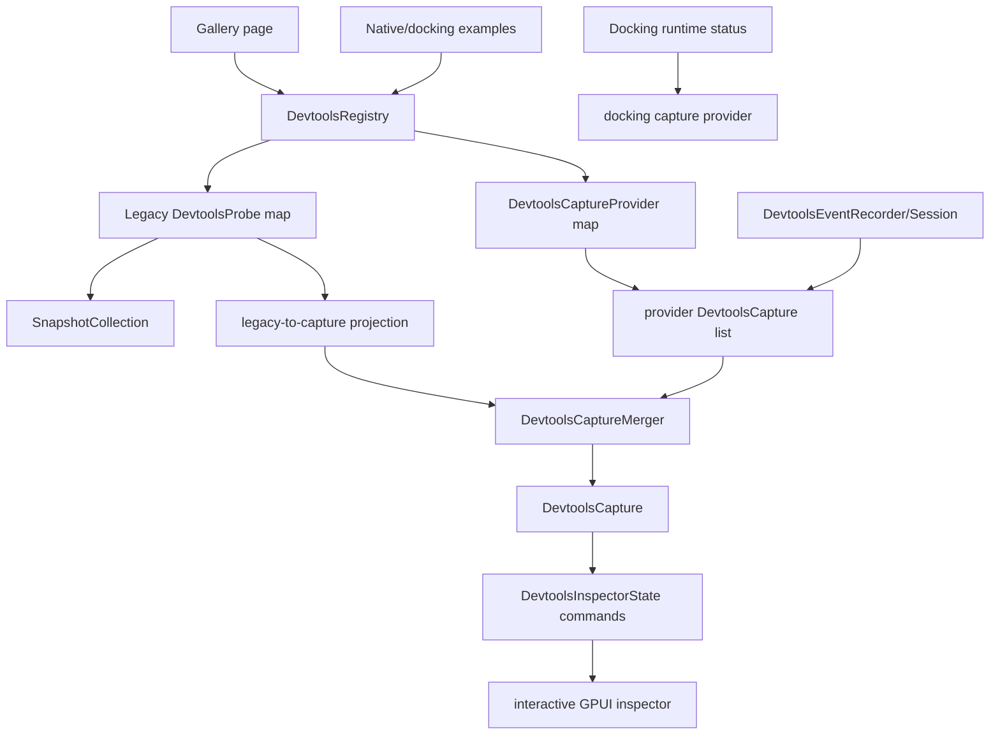

# DevTools Runtime Ecosystem - Plan

## Goal Capsule

Turn the target/domain/event protocol from the previous slice into a real DevTools runtime ecosystem. The new work makes capture producers first-class, gives the event recorder an application lifecycle, upgrades the inspector from static read-only markup to an interactive debugging surface, and dogfoods the model against gallery, native, docking, and multi-viewport runtime facts.

Authority order: current user request, AGENTS.md repository rules, `docs/plans/2026-07-09-002-refactor-devtools-target-domain-runtime-plan.md`, existing `crates/devtools` contracts, then this plan. The user explicitly allows fearless refactor, breaking changes, deletion of superseded code, direct `main` work, subagents, intermediate commits, periodic pull/merge from local or remote `main`, and pushes to remote `main`.

Stop and re-plan only if this work would require DevTools to mutate application state, own docking/layout authority, introduce a remote debugging protocol, or bypass established sanitizer/redaction paths.

## Product Contract

### Summary

Open GPUI DevTools now has the right vocabulary: targets, domains, captures, events, and docking runtime snapshots. The remaining gap is ecosystem maturity. Mature tools separate collection providers, session/event lifecycle, inspector controllers, and runtime dogfood:

- Chromium DevTools uses target/model registration and panel controllers rather than a single flat snapshot list.
- Flutter DevTools separates service connection lifecycle from inspector and performance controllers.
- React DevTools separates backend event streaming/profiling from frontend tree inspection.
- Dear ImGui exposes metrics/debug tooling as live runtime surfaces, especially around docking and viewports.

Open GPUI should keep its local, read-only, redacted design, but borrow the same architecture shape: capture providers feed a shared capture runtime; event recorders are scoped and mergeable; inspectors act on state; real examples continuously exercise the contracts.

### Problem Frame

The current implementation is intentionally conservative:

- `DevtoolsRegistry` still owns only legacy `DevtoolsProbe` entries; `collect_capture()` projects the resulting `SnapshotCollection`.
- First-party adapters expose many `*_capture` helpers, but they are not registered through one provider pipeline.
- `DevtoolsEventRecorder` is a useful bounded buffer, but it has no application-level lifecycle, merge/export contract, or registry integration.
- `DevtoolsInspectorState` can select targets/domains/events in tests, while `gpui::DevtoolsInspector` still renders static lists without click-driven selection, keyboard affordances, copy/export feedback, or controller state.
- Gallery dogfoods a deterministic capture, but it still manually assembles events and does not exercise real provider lifecycle or docking/native runtime integrations.

The next slice should remove this split. The framework needs one obvious path for "this runtime object can be inspected" and one obvious path for "this runtime event should appear in DevTools".

### Requirements

Provider runtime:

- R1. DevTools must expose a first-class capture provider trait or equivalent abstraction that can contribute a full `DevtoolsCapture`, not only a legacy `SnapshotEnvelope`.
- R2. `DevtoolsRegistry` must register, unregister, deduplicate, collect, and diagnose both legacy probes and capture providers.
- R3. Registry collection must merge multiple provider captures deterministically while preserving target, domain, event, snapshot, and diagnostic order.
- R4. Duplicate provider/probe/target/domain/event identities must produce stable sanitized diagnostics or registration errors.
- R5. Legacy `collect()` and `register_snapshot_probe()` remain available until a later planned compatibility break, but new examples should prefer provider capture.

Event lifecycle:

- R6. `DevtoolsEventRecorder` must support application/session lifecycle semantics: named recorder scope, retained count, omitted count, capacity, drain/snapshot/export, and merge into captures.
- R7. Event recording must remain local and read-only; no tracing subscriber or global mutable singleton is required.
- R8. Events from multiple scopes must retain deterministic order using sequence and timestamp metadata without requiring wall-clock time in tests.
- R9. Event payloads and labels must continue to use existing sanitizer/redaction behavior.

Inspector interaction:

- R10. `DevtoolsInspectorState` must provide command-style operations for selecting target/domain/event rows, clearing filters, moving selection, copying selected details, and exporting the current capture JSON.
- R11. `gpui::DevtoolsInspector` must become an interactive surface with stable state ownership instead of a one-shot static rendering wrapper.
- R12. GPUI rows must have click handlers and debug selectors that let tests/dogfood verify selection changes without relying on screenshots.
- R13. The inspector must expose compact target/domain/event/detail panes without nested cards or mutation controls.
- R14. Copy/export actions must report deterministic feedback state that can be asserted in non-browser tests.
- R14a. Inspector navigation must use one active target, one active domain, and one active event/detail selection at a time; category and search remain filters, not independent multi-select state.
- R14b. Interactive controls must have deterministic focus order, keyboard-accessible selection commands, readable labels, and visible success/error feedback for copy/export actions.

Dogfood and adapters:

- R15. First-party command, form, resource, layout, timeline, motion, UI component, and docking adapters must be registerable as capture providers where useful.
- R16. Gallery DevTools must collect through the provider registry and event lifecycle rather than manually composing a capture.
- R17. Docking and multi-viewport runtime status must exercise provider capture and event recording using only public runtime/debug surfaces.
- R18. Native or example-level dogfood must cover at least one non-gallery runtime path, or document why the available binary cannot be driven in CI.

Quality and cleanup:

- R19. Superseded one-off helpers introduced only for the previous migration should be deleted or narrowed after provider registration exists.
- R20. Public API inventory, docs links, package checks, and focused nextest suites must stay green.
- R21. Engineering memory must record the new provider/event/inspector architecture and verification results.

### Acceptance Examples

- AE1. Given a registry with one legacy probe and two capture providers, `collect_capture()` returns one merged sanitized capture containing all targets, domains, events, snapshots, and diagnostics in deterministic order.
- AE2. Given two providers emitting the same target or domain id, collection includes a stable diagnostic that names the conflict without panicking or leaking sensitive values.
- AE3. Given a named event recorder with capacity 2 and five events across two scopes, export reports retained count 2, omitted count 3, scope metadata, and ordered retained events.
- AE4. Given a gallery DevTools page, its capture is produced through registered providers and a recorder session, while `devtools_gallery_collection()` still returns compatibility snapshots.
- AE5. Given an inspector state with multiple targets/domains/events, selecting rows through command operations updates selected details and JSON export deterministically.
- AE6. Given a rendered GPUI inspector, clicking target/domain/event rows updates visible selected detail and action feedback in tests.
- AE7. Given docking runtime status, provider capture exposes viewport/dockspace/domain facts and associated lifecycle events without private field access.
- AE8. Given public API scanning, new public provider and event lifecycle APIs are documented and legacy APIs remain intentionally compatible.

### Scope Boundaries

In scope: provider registry, capture merge semantics, first-party provider adapters, event recorder lifecycle, inspector command operations, GPUI interactive inspector wiring, gallery and docking/native dogfood, focused tests, docs, and cleanup.

Out of scope: Chrome DevTools Protocol, remote debugging, network transport, live mutation/property editing, persistent trace storage, full screenshot baseline testing, adding DevTools as a required dependency of source crates, and a global process-wide event bus.

### Sources and Research

- Previous runtime model plan: `docs/plans/2026-07-09-002-refactor-devtools-target-domain-runtime-plan.md`.
- Existing protocol modules: `crates/devtools/src/target.rs`, `crates/devtools/src/domain.rs`, `crates/devtools/src/event.rs`, `crates/devtools/src/registry.rs`, `crates/devtools/src/inspector.rs`, `crates/devtools/src/gpui.rs`.
- First-party adapters: `crates/devtools/src/command.rs`, `form.rs`, `resource.rs`, `layout.rs`, `timeline.rs`, `motion.rs`, `ui_components.rs`, `docking.rs`.
- Gallery dogfood: `examples/ui-foundation-gallery/src/pages/devtools.rs`.
- Docking runtime authority: `crates/gpui_docking/src/viewport_runtime_status.rs`, `crates/gpui_docking/src/debug.rs`, `crates/gpui_docking/src/advanced.rs`.
- Reference projects in `repo-ref/`: `chromium-devtools-frontend`, `flutter-devtools`, `react-devtools`, `imgui`, `zed`, `egui`, and `gpui-component`.

## Planning Contract

### Key Technical Decisions

- KTD1. Add provider capture above legacy probes instead of replacing legacy probes immediately. This keeps downstream compatibility while moving first-party dogfood to the richer path.
- KTD2. Use explicit provider identity and merge diagnostics. A broad "append everything" merge would hide invalid topology; duplicate targets/domains/events must become visible debugging facts.
- KTD3. Keep capture DTOs renderer-neutral. GPUI interaction belongs in `gpui.rs` and state commands belong in `inspector.rs`; provider/event core must compile without UI assumptions.
- KTD4. Event lifecycle remains app-owned and bounded. DevTools offers recorder/session types and merge/export APIs, not a process-global telemetry service.
- KTD5. Inspector interactivity is state-first. Tests should validate `DevtoolsInspectorState` operations before GPUI event wiring, then GPUI tests assert the wiring surface.
- KTD6. First-party adapters should converge on provider functions when their capture output is richer than a single legacy snapshot. Simple snapshot-only producers may remain probes until a provider adds value.
- KTD7. Docking adapters consume public runtime/debug status only. Unavailable private topology becomes a diagnostic, never an inference from internals.
- KTD8. Break or delete local helper APIs when they only exist to bridge the previous static gallery path, but keep documented public compatibility unless tests and API inventory are updated intentionally.

### High-Level Technical Design

### Implementation Priorities

1. Provider registry and merge semantics. Without this, every later adapter remains a one-off helper.
2. Event lifecycle. Provider capture needs a clean way to include app-owned events without global state.
3. Inspector state commands. GPUI interaction should sit on proven state operations.
4. GPUI interactive wiring. This turns the feature from data model into usable tooling.
5. Gallery and docking/native dogfood. This proves the contracts on real runtime shapes and deletes manual assembly.
6. Cleanup, docs, and API scan. This keeps the ecosystem surface intentional after the broad refactor.

### Risks and Mitigations

- RD1. Provider abstraction can overfit one adapter. Mitigation: keep the trait minimal: `id`, `label`, `capture`; let helpers build typed captures.
- RD2. Merge diagnostics can become noisy. Mitigation: emit diagnostics only for identity conflicts, invalid joins, and provider failures; do not warn for empty valid captures.
- RD3. GPUI interaction tests may be limited by available test harnesses. Mitigation: put behavior in `DevtoolsInspectorState` and expose stable debug selectors for any GPUI-level smoke tests that exist.
- RD4. Event lifecycle can look like telemetry infrastructure. Mitigation: no global singleton, no background thread, no persistent sink, no external subscriber dependency.
- RD5. Docking/native examples may have feature-gated binaries. Mitigation: use compile-time and deterministic adapter tests first; add runtime dogfood only where the repo already supports it.

## Implementation Units

### U1. Capture Provider Registry

Goal: make first-class capture providers the main DevTools collection unit while preserving legacy probes.

Requirements: R1, R2, R3, R4, R5, R19, R20.

Files:

- `crates/devtools/src/registry.rs`
- `crates/devtools/src/probe.rs`
- `crates/devtools/src/domain.rs`
- `crates/devtools/src/lib.rs`
- `crates/devtools/tests/registry_contracts.rs`

Approach:

- Introduce `DevtoolsCaptureProvider` and `CaptureProviderId` only if current `ProbeId` is not semantically sufficient; otherwise reuse `ProbeId` with provider-specific docs.
- Extend `DevtoolsRegistry` with provider registration, unregistration, counts, and duplicate identity errors.
- Add a merge helper that combines legacy-projected capture and provider captures in deterministic order.
- Convert provider collection failures into sanitized diagnostics.
- Keep `collect()` as the legacy snapshot path and `collect_capture()` as the richer merged path.
- Remove or narrow any private helper that duplicates the new merge path.

Tests:

- Provider registration/unregistration and duplicate ids.
- `collect()` ignores provider-only data but still returns legacy snapshots.
- `collect_capture()` merges legacy probes and providers.
- Duplicate target/domain/event identities produce diagnostics.
- Provider failure becomes a diagnostic and does not poison successful providers.

### U2. First-Party Provider Adapters

Goal: give first-party domains a consistent provider entry point instead of ad hoc gallery assembly.

Requirements: R1, R3, R5, R15, R19, R20.

Files:

- `crates/devtools/src/command.rs`
- `crates/devtools/src/form.rs`
- `crates/devtools/src/resource.rs`
- `crates/devtools/src/layout.rs`
- `crates/devtools/src/timeline.rs`
- `crates/devtools/src/motion.rs`
- `crates/devtools/src/ui_components.rs`
- `crates/devtools/src/docking.rs`
- `crates/devtools/tests/*`

Approach:

- Add provider constructors for domains that already have a `*_capture` helper.
- Prefer capture providers for adapters that can expose targets/domains/events; keep pure snapshot probes when a provider would only wrap a single snapshot without added semantics.
- Ensure all constructors sanitize ids/labels through existing core types.
- Update tests so first-party adapters assert provider and legacy compatibility where both exist.
- Delete redundant gallery-only conversion helpers when provider constructors make them unnecessary.

Tests:

- Command/layout/timeline provider captures include expected target/domain ids.
- Snapshot-only adapters still work through legacy probes.
- Provider constructors reject invalid ids.
- Feature-gated adapters compile under all relevant feature sets.

### U3. Event Recorder Lifecycle

Goal: make app-owned event recording explicit, scoped, mergeable, and exportable.

Requirements: R6, R7, R8, R9, R16, R20.

Files:

- `crates/devtools/src/event.rs`
- `crates/devtools/src/domain.rs`
- `crates/devtools/src/timeline.rs`
- `crates/devtools/src/inspector.rs`
- `crates/devtools/tests/event_contracts.rs`

Approach:

- Add recorder/session metadata such as scope id, label, capacity, retained count, omitted count, and next sequence.
- Add snapshot/export APIs that can be merged into `DevtoolsCapture`.
- Support deterministic merging from multiple recorders or batches.
- Keep existing `record` behavior simple and cheap; tests should not need wall-clock time.
- Add timeline projection helpers only where they reuse existing `TimelineSnapshot` compatibility structures.

Tests:

- Capacity overflow reports omitted count and retained order.
- Multiple scopes merge deterministically.
- Payloads and labels are sanitized.
- Recorder export can be included in a provider capture.
- Legacy event tests keep passing.

### U4. Inspector State Commands and Export

Goal: move inspector behavior into a testable state/controller layer.

Requirements: R10, R13, R14, R14a, R20.

Files:

- `crates/devtools/src/inspector.rs`
- `crates/devtools/src/domain.rs`
- `crates/devtools/tests/inspector_contracts.rs`

Approach:

- Add explicit operations for selecting target, domain, event, next/previous visible row, clearing filters, and applying filters.
- Define selection priority as event detail over domain detail over target detail over legacy snapshot detail; filters may change visible rows but not introduce multi-select state.
- Add copy/export result types that report selected detail JSON, full capture JSON, or structured errors.
- Preserve current deterministic filtering and selection migration.
- Keep UI labels compact and let GPUI consume row DTOs.

Tests:

- Selection commands update selected detail and JSON output.
- Filter clearing restores deterministic first visible selection.
- Copy/export operations return sanitized JSON and feedback state.
- Missing selections return typed errors.

### U5. Interactive GPUI Inspector

Goal: wire the GPUI inspector to real state operations without turning DevTools into a mutation surface.

Requirements: R11, R12, R13, R14, R14a, R14b, R20.

Files:

- `crates/devtools/src/gpui.rs`
- `crates/devtools/src/inspector.rs`
- `crates/devtools/tests/gpui_inspector_contracts.rs` or existing GPUI test module

Approach:

- Refactor `DevtoolsInspector` from static `RenderOnce` data wrapper into a small stateful GPUI component if the repo's GPUI patterns support it; otherwise add event callbacks around an owned state model with minimal API break.
- Add click handlers for target/domain/event rows and toolbar actions for clear filter, copy selected detail, and export capture.
- Add keyboard-accessible command paths for moving selection and invoking toolbar actions, using stable labels and visible feedback states.
- Keep existing debug selectors and add row-specific selected/action feedback selectors.
- Avoid nested cards and keep layout stable across narrow widths.
- Make interaction tests assert state transitions through debug selectors or direct state operations, depending on available harness support.

Tests:

- Clicking target/domain/event rows changes selection.
- Copy/export actions update deterministic feedback.
- Existing static debug selectors still exist or have documented replacements.
- Empty/error states render without panics.

### U6. Gallery, Docking, and Native Runtime Dogfood

Goal: prove the runtime ecosystem on real examples and remove manual capture assembly.

Requirements: R15, R16, R17, R18, R19, R20.

Files:

- `examples/ui-foundation-gallery/src/pages/devtools.rs`
- `examples/ui-foundation-gallery/src/pages/components.rs`
- `crates/devtools/src/docking.rs`
- `crates/gpui_docking/src/viewport_runtime_status.rs`
- `crates/gpui_docking/src/debug.rs`
- `examples/docking-native/**` or nearest native/docking example present in the repo
- `examples/ui-foundation-gallery/tests/**` where present

Approach:

- Rebuild `devtools_gallery_capture()` through `DevtoolsRegistry` providers and a named event recorder session.
- Preserve `devtools_gallery_collection()` as compatibility export from the capture.
- Register docking runtime provider(s) around public `DockViewportRuntimeStatus` or debug status structs.
- Add deterministic events for gallery motion, docking lifecycle, route, activation, tear-off/drop outcomes, and viewport/platform capability facts where public records exist.
- If a native runtime cannot be launched in CI, add compile-time adapter tests and a documented manual dogfood path.
- Delete manual event/capture assembly that is now redundant.

Tests:

- Gallery capture includes provider-produced command/layout/timeline/resource/theme/accessibility facts.
- Gallery event rows come from recorder lifecycle metadata.
- Docking provider capture includes viewport/dockspace/domain facts and public diagnostics.
- Native/docking example compiles with the new provider APIs.

### U7. Compatibility Cleanup, Documentation, and Verification Memory

Goal: leave the public ecosystem coherent after the broad refactor.

Requirements: R5, R19, R20, R21.

Files:

- `crates/devtools/src/lib.rs`
- `docs/knowledge/engineering/**`
- `docs/plans/2026-07-09-003-refactor-devtools-runtime-ecosystem-plan.md`
- `README.md` or DevTools docs if touched by existing links

Approach:

- Audit public exports and remove unused transitional exports that are not documented compatibility surfaces.
- Update docs/memory with provider registry, event lifecycle, inspector interaction, and dogfood verification results.
- Run public API scan and docs link scan.
- Commit and push green slices to `main`.

Tests and checks:

- Public API scan stays green or intentional changes are reflected in inventory.
- Docs link scan passes.
- `git diff --check` passes.
- Final status is clean after commit/push.

## Verification Contract

Run focused checks after each meaningful slice and the full package gates before final push:

- `cargo fmt -p open-gpui-devtools -p open-gpui-ui-foundation-gallery`
- `cargo check -p open-gpui-devtools --no-default-features --tests --locked`
- `cargo check -p open-gpui-devtools --all-features --tests --locked`
- `$env:CARGO_BUILD_JOBS='1'; cargo nextest run -p open-gpui-devtools --all-features --no-fail-fast --locked`
- `cargo check -p open-gpui-ui-foundation-gallery --tests --locked`
- `cargo nextest run -p open-gpui-ui-foundation-gallery devtools --no-fail-fast --locked`
- `cargo check -p open-gpui-docking-native --tests --locked` if the package exists under that name; otherwise run the nearest docking/native package check discovered in the workspace.
- `cargo run -p xtask -- scan-doc-links`
- `cargo run -p xtask -- scan-public-api --check`
- `git diff --check`

If Windows resource pressure causes linker or process failures, retry the same package-scoped gate with `CARGO_BUILD_JOBS=1` and record the environmental retry in engineering memory.

## Execution Notes

- Work directly on `main` because the user authorized it for this run.
- Pull/merge `origin/main` before major pushes when the tree is clean.
- Commit with Conventional Commit messages at green implementation slices.
- Do not revert, stash, or delete changes that were not made as part of this work.
- Prefer targeted package checks over whole-workspace tests unless a shared API change requires broader validation.
