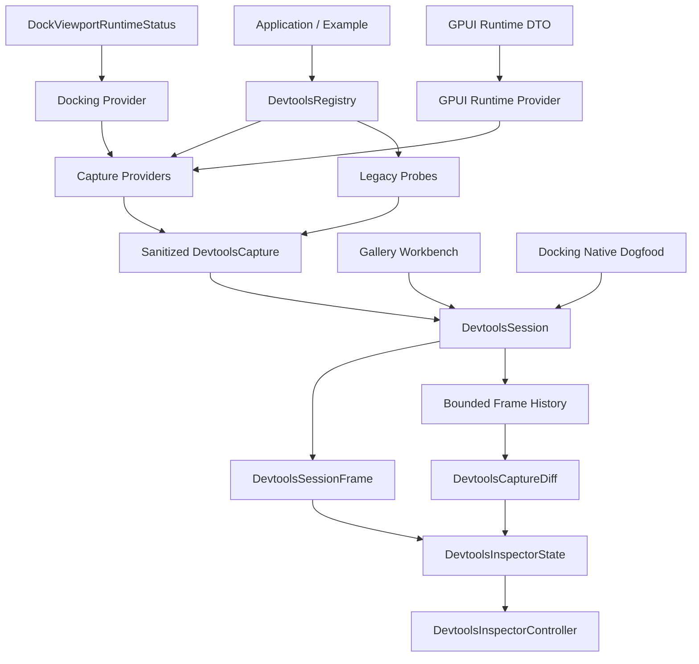

# DevTools Live Runtime Workbench - Plan

## Goal Capsule

Build the next DevTools ecosystem layer on top of the existing target/domain/event and capture provider foundation: a local read-only runtime session, sanitized capture diff/history replay, a live-capable inspector controller, first-party GPUI and docking runtime instrumentation, and Gallery/native dogfood surfaces that exercise the model.

Authority order: current user request, AGENTS.md repository rules, `docs/plans/2026-07-09-003-refactor-devtools-runtime-ecosystem-plan.md`, existing `crates/devtools` contracts, engineering memory under `docs/knowledge/engineering`, local prior-art in `repo-ref/`, then this plan.

Execution profile: fearless refactor is allowed; breaking changes and deletion of superseded code are allowed when they make the DevTools architecture clearer. Work can proceed directly on `main`, with subagents, intermediate commits, periodic local/remote `main` merges, and pushes as needed.

Stop and re-plan if the implementation requires DevTools to mutate application state, own docking/layout runtime authority, add any network or remote debugging transport, introduce persistent trace storage/database, persist raw sensitive payloads, or bypass the existing sanitizer/redaction boundary.

---

## Product Contract

### Summary

Open GPUI DevTools already has the right core vocabulary: runtime targets, domains, captures, bounded events, capture providers, and a GPUI inspector controller. The next missing ecosystem layer is the live workbench around those primitives.

The target shape is local and read-only: `DevtoolsSession` owns a provider registry, captures current runtime facts, retains bounded frame history, computes sanitized diffs, and feeds an inspector that can refresh, browse history, inspect docking/GPUI runtime facts, and export safe offline captures. "Live" means in-process capture refresh; "replay" means viewing captured frames in the inspector; neither term implies remote protocol, property editing, input injection, or time-travel mutation.

### Problem Frame

The current implementation is a strong static/capture surface but not yet a runtime workbench:

- `DevtoolsRegistry::collect_capture()` can merge legacy probes and capture providers, but there is no long-lived session with generation, connection state, history, or refresh semantics.
- `DevtoolsEventRecorder` is a bounded app-owned recorder, but session-level capture metadata does not yet expose the history/diff context a user needs when runtime facts change.
- `DevtoolsInspectorState` and `DevtoolsInspectorController` can browse one capture, but there is no first-class refresh, history frame selection, or diff row model.
- `docking_runtime_capture(status)` correctly consumes public `DockViewportRuntimeStatus`, but there is no dedicated multi-viewport inspection projection or native example dogfood.
- GPUI runtime facts are not yet modeled as a narrow public snapshot that DevTools can consume without reaching into private window internals.
- Gallery has a deterministic DevTools page, but it does not yet dogfood live session refresh, capture diff, replay/history, or docking/native runtime integration.

### Primary Workflow

The first developer workflow is "what changed in my app runtime after I performed one action?" A maintainer opens Gallery or docking-native DevTools, captures the current session frame, performs a deterministic UI/runtime action, refreshes, and uses the workbench to answer from visible rows rather than raw JSON: which target/domain/event changed, whether providers partially failed, what data was omitted by bounds, and whether the detail/export view remains sanitized.

This workflow is the first success criterion for the workbench. Session metadata, diff rows, history replay, and Gallery/native dogfood are in scope because they support this loop; any GPUI or docking instrumentation that does not help this loop should stay minimal or defer.

### Requirements

**Runtime session and bridge**

- R1. DevTools must expose a renderer-neutral `DevtoolsSession` or equivalent local runtime session over `DevtoolsRegistry`.
- R2. A session must have stable metadata: session id, schema/protocol version, connection state, generation number, history limit, and last refresh result.
- R3. Refresh must collect a sanitized `DevtoolsCapture`, preserve provider diagnostics, increment generation deterministically, and keep the previous frame for diff.
- R4. Session history must be bounded and explicit about retained frame count; it must not become persistent trace storage.
- R5. Session stop/close must be explicit and refresh after close must return a deterministic error or diagnostic state.
- R6. The session API must remain in-process and read-only; no network transport, remote control, mutation command, or global event bus is part of this slice.

**Capture diff and replay**

- R7. DevTools must expose sanitized capture diff types for targets, domains, events, snapshots, and diagnostics.
- R8. Diff identity must be stable and deterministic: compare by target id, domain id, probe id, event scope/sequence/id, and diagnostic identity.
- R9. Diff comparison must run after sanitization and must not leak redacted strings through labels, payloads, diagnostics, or JSON detail.
- R10. Replay must mean "load a captured frame or session export into inspector state"; it must not replay actions into the running application.
- R11. Offline exports must carry enough metadata to explain generation, schema version, history bounds, event omissions, and redaction summary.

**Inspector workbench**

- R12. `DevtoolsInspectorState` must accept new captures/session frames while preserving filter and selection when possible.
- R13. When a selected target/domain/event disappears after refresh, selection must degrade deterministically to the nearest visible valid row.
- R14. The inspector must expose diff rows and current/previous frame metadata in renderer-neutral state for tests.
- R15. `DevtoolsInspectorController` must expose refresh/update APIs and render session/diff/history state without taking ownership of application runtime authority.
- R16. Copy/export/detail actions must continue to produce deterministic feedback and sanitized JSON.
- R16a. The workbench must have one shared information architecture: session header and toolbar, latest/history frame selector, capture/diff/diagnostics grouping, target/domain/event rows, and detail/export pane.
- R16b. Refresh, history, diff, replay, close, copy, and export must define visible states for idle, loading, success, partial provider failure, error, empty, closed, no previous frame, no changes, invalid import, and export failure.
- R16c. Keyboard and accessibility behavior must be explicit for target/domain/event rows, history frames, diff rows, toolbar actions, focus preservation after refresh, and status/error announcements.

**Docking and multi-viewport instrumentation**

- R17. Docking DevTools must keep using public `DockViewportRuntimeStatus` and `advanced` DTOs only.
- R18. Docking inspection must project app/window/viewport/dockspace/panel-like identities where public facts support them, and emit diagnostics for unavailable private facts.
- R19. Docking diff/history must make route, drop, tear-off, close, placement restore, platform capability, lifecycle, and visual-affordance changes visible.
- R20. `examples/docking-native` or another real docking example must dogfood DevTools capture without adding a reverse dependency from `gpui_docking` to `open_gpui_devtools`.
- R20a. Docking unavailable facts must come from explicit public present/unavailable/capability records, not from DevTools inferring private runtime outcomes from missing fields.

**GPUI runtime instrumentation**

- R21. GPUI runtime instrumentation must use a narrow public read-only snapshot or app-provided DTO, not private `Window`/frame internals.
- R22. GPUI capture must expose committed facts such as app/window identity, focus, scroll/layout snapshots, input/frame signals, and diagnostics where they are publicly available.
- R23. Test-support-only facts must remain feature gated and must not become required runtime API for production DevTools.
- R23a. GPUI runtime input/focus/layout capture must be metadata-only: event kinds, counts, scopes, timing, capabilities, and diagnostics are allowed; raw text, clipboard contents, editable-field key payloads, accessibility labels, and unredacted window titles are forbidden in session frames, diffs, details, and exports.
- R23b. GPUI runtime planning must include a fact-source matrix for each proposed fact: production public API, app-provided DTO, test-support-only DTO, unavailable diagnostic, and whether a new `open_gpui` snapshot API is allowed.

**Gallery and ecosystem dogfood**

- R24. Gallery DevTools must use the session/diff/history path as its primary dogfood surface.
- R25. Gallery must keep legacy `SnapshotCollection` compatibility and the existing guard against reintroduced static demo snapshot builders.
- R26. Gallery must expose stable contract tests for session generation, refresh/diff rows, event history, redaction, and unavailable or deterministic docking runtime facts.
- R27. Docs and engineering memory must explain the new session/diff/replay boundary so future work does not drift toward a mutation/control plane.
- R28. Replay/import must validate schema/protocol version, history/event bounds, category ids, and size limits, then canonicalize and re-sanitize imported frames before loading inspector state.
- R29. Redaction-induced identity collisions must be explicit: diff/session code must either keep a multi-value set under the same sanitized identity or emit collision diagnostic rows.
- R30. Event selection, diff rows, and replay frames must share one event identity type that includes at least scope, sequence, and event id.

### Acceptance Examples

- AE1. Given a registry with legacy probes, capture providers, and one failing provider, a session refresh produces generation 1 with all successful sanitized capture data and a provider-failure diagnostic.
- AE2. Given two refreshes where one target was added, one domain changed, and one event was omitted by capacity, `DevtoolsCaptureDiff` reports stable added/changed rows and the exported session explains retained/omitted counts.
- AE3. Given an inspector filtered to a selected domain, refreshing with the same domain preserves selection; refreshing after the domain disappears selects the nearest visible target or reports an empty valid state.
- AE4. Given an exported session frame, offline replay loads it into `DevtoolsInspectorState` and exposes the same sanitized details without calling any provider.
- AE5. Given `DockViewportRuntimeStatus` with platform viewport support disabled, docking capture includes the unsupported capability diagnostic and does not infer private runtime outcomes.
- AE6. Given a docking-native runtime status after opening a secondary viewport, DevTools capture contains viewport lifecycle facts and stable route/placement events.
- AE7. Given a Gallery DevTools page, contract tests prove the page is session-backed, has diff/history data, keeps legacy snapshot compatibility, and does not define static `theme_snapshot`, `form_snapshot`, `resource_snapshot`, or `docking_snapshot` builders.
- AE8. Given a no-default-features build of `open-gpui-devtools`, session and diff core compile without GPUI/docking/UI dependencies.
- AE9. Given a Gallery or docking-native action that changes runtime facts, refreshing the workbench lets the developer answer from visible current frame and diff/history rows which target, domain, and event changed.
- AE10. Given a malformed or oversized exported session, offline replay rejects it before inspector state loads it, reports a sanitized error, and does not expose raw imported strings.
- AE11. Given two raw identities that sanitize to the same target/domain/event/snapshot id, diff output preserves both values as a collision set or emits an explicit collision diagnostic instead of overwriting one row.

### Scope Boundaries

In scope: local session lifecycle, capture refresh/history, sanitized diff, offline frame replay into inspector state, GPUI controller refresh APIs, public GPUI runtime DTOs, docking multi-viewport inspection projections, Gallery and docking-native dogfood, focused tests, docs, cleanup, and engineering memory.

Out of scope: Chrome DevTools Protocol, TCP/WebSocket transport, remote backend/frontend bridge, runtime mutation, property editing, input injection, application time travel, persistent trace database, full screenshot baseline automation, and direct DevTools dependency from source runtime crates.

### Sources and Research

- Current DevTools runtime plan: `docs/plans/2026-07-09-003-refactor-devtools-runtime-ecosystem-plan.md`.
- Current DevTools core: `crates/devtools/src/probe.rs`, `crates/devtools/src/registry.rs`, `crates/devtools/src/domain.rs`, `crates/devtools/src/event.rs`, `crates/devtools/src/inspector.rs`, `crates/devtools/src/gpui.rs`.
- Docking runtime facts: `crates/devtools/src/docking.rs`, `crates/gpui_docking/src/viewport_runtime_status.rs`, `crates/gpui_docking/src/viewport_runtime_handle.rs`, `examples/docking-native/src/main.rs`.
- Gallery dogfood: `examples/ui-foundation-gallery/src/pages/devtools.rs`, `examples/ui-foundation-gallery/tests/foundation_gallery/devtools_contracts.rs`.
- Local prior-art references: `repo-ref/flutter-devtools`, `repo-ref/react-devtools`, `repo-ref/chromium-devtools-frontend`, `repo-ref/egui`, `repo-ref/imgui`, `repo-ref/zed`.
- Internal reusable diff patterns: `crates/canvas/src/mutation.rs`, `crates/canvas/src/document/diff.rs`, `crates/canvas/src/store.rs`.

---

## Planning Contract

### Key Technical Decisions

- KTD1. Build `DevtoolsSession` above `DevtoolsRegistry`, not beside it. The registry remains the source of provider collection; the session adds lifecycle, generation, history, and refresh semantics.
- KTD2. Treat "runtime bridge" as an in-process protocol boundary. Add schema/protocol metadata and connection state now, but do not open a network transport or mutation command surface.
- KTD3. Compute diffs from sanitized captures. The diff engine must never compare or export raw provider data before redaction.
- KTD4. Keep replay offline and inspector-only. A replayed frame is an immutable capture input to `DevtoolsInspectorState`, not a script that drives the application.
- KTD5. Make inspector live behavior state-first. `DevtoolsInspectorState` owns replacement, selection preservation, history, and diff rows; GPUI rendering wires controls onto those commands.
- KTD6. Use bounded history and bounded event recorders. The feature is a debugging workbench, not telemetry infrastructure.
- KTD7. Docking DevTools consumes public runtime status only. If a requested fact is private or unavailable, emit a diagnostic instead of rebuilding docking knowledge in DevTools.
- KTD8. GPUI runtime instrumentation starts from a narrow DTO. If `open_gpui` lacks a public fact, add the smallest read-only snapshot or require the app/example to provide a DTO; do not reach through private window internals.
- KTD9. Gallery is the integration gate. Unit tests prove data contracts, but Gallery and docking-native prove the ecosystem wiring against real example flows.
- KTD10. One workbench information architecture owns live behavior. Gallery, native dogfood, and the reusable GPUI controller must share the same session/header/history/diff/detail model instead of inventing separate debug pages.
- KTD11. Imported captures are untrusted inputs. Even self-generated exports must pass schema, bound, canonicalization, and sanitizer checks before offline replay loads them.

### Rejected Alternative

A Gallery-first refresh/history adapter over `collect_capture()` would prove less than the new session core. It could show two captures changing in one example, but it would leave generation, close/error state, bounded history, replay import validation, diff identity collisions, and provider failure metadata undefined for every other application. The plan still adds a thin Gallery/native vertical slice early, but the reusable contract starts in `crates/devtools`.

### Workbench IA Contract

The reusable inspector workbench has one compact structure:

- **Session header:** session id, connection state, current generation, history count, schema/protocol version, and latest refresh result.
- **Toolbar:** Refresh, Close, Copy Detail, Export Frame, Export Session, and optional Load Offline Frame actions. Controls show deterministic disabled/loading/error/success states.
- **Primary panes:** target/domain/event navigation on the left, Capture/Diff/History/Diagnostics grouping in the middle, selected detail/export preview on the right.
- **Frame semantics:** the default view is the latest frame. Diff compares the current frame with its previous retained frame. Selecting a past history frame shows that frame and its diff from its own previous frame; arbitrary pairwise diff is deferred.
- **Detail semantics:** selecting a target, domain, event, diff row, diagnostic, or history frame updates one detail pane and one export payload. The user should not need raw JSON to identify the changed runtime fact.

### Interaction State Matrix

| Interaction | Required states |
|---|---|
| Refresh | idle, loading, success, partial provider failure, provider error, closed session |
| History | empty, latest frame, selected past frame, dropped frame due to bounds |
| Diff | no previous frame, no changes, changed rows, redaction-induced collision, omitted events |
| Replay/import | loaded, invalid schema/protocol, oversized history/events, re-sanitized secret, unsupported category |
| Copy/export | ready, success, platform/export failure, no selected detail |
| Selection | preserved, remapped to nearest visible row, empty valid state |

Keyboard and accessibility behavior follows the same state model: Tab moves through toolbar, navigation, middle grouping, and detail panes; arrow keys move inside target/domain/event, history, and diff row lists; Enter or Space activates the focused row/action; refresh remapping preserves focus when the selected identity still exists and otherwise moves focus to the remapped row or empty state announcement.

### High-Level Technical Design

### Sequencing

1. Implement the renderer-neutral session core and tests before touching UI.
2. Implement sanitized diff/history/replay contracts and wire them into session frames.
3. Add a thin Gallery or docking-native vertical slice that uses real `DevtoolsSession` refresh twice and produces at least one diff/history row.
4. Extend inspector state, then GPUI controller, so UI behavior sits on tested model operations.
5. Add docking-specific inspection rows and native dogfood through public runtime status.
6. Add GPUI runtime DTO/provider without violating feature gates.
7. Upgrade Gallery into the full session/diff workbench and keep compatibility tests.
8. Clean up superseded helpers, update docs, run verification, commit in reviewable slices.

### Risks and Mitigations

| Risk | Mitigation |
|---|---|
| Session becomes a hidden global telemetry system | Keep sessions app-owned, bounded, in-process, and explicit; no singleton or background sink. |
| Replay is mistaken for time travel | Name APIs around frames/history/offline inspector loading and document the non-mutation boundary. |
| Diff leaks secrets | Compare only `DevtoolsCapture::sanitized()` values and add redaction tests over labels, payloads, and diagnostics. |
| GPUI instrumentation reaches private internals | Add narrow public DTOs or app-provided snapshots; reject private field reach-through in review. |
| Docking inspector duplicates docking authority | Consume `DockViewportRuntimeStatus`; diagnostics for unavailable facts; no graph/layout recomputation. |
| UI tests become brittle | Put behavior in renderer-neutral state tests; use stable debug selectors for GPUI smoke coverage. |
| Windows verification becomes too broad | Use package-scoped `cargo check`/`nextest`, then broaden with PowerShell `$env:CARGO_BUILD_JOBS = '1'` when necessary. |

---

## Implementation Units

### U1. DevTools Session Core

- **Goal:** Add a renderer-neutral local session that owns refresh, connection state, generation, bounded history, and export metadata over the existing provider registry.
- **Requirements:** R1, R2, R3, R4, R5, R6, R11, AE1, AE8.
- **Files:** `crates/devtools/src/session.rs`, `crates/devtools/src/lib.rs`, `crates/devtools/src/registry.rs`, `crates/devtools/src/domain.rs`, `crates/devtools/tests/session_contracts.rs`.
- **Approach:** Introduce `DevtoolsSession`, `DevtoolsSessionFrame`, `DevtoolsSessionState`, `DevtoolsSessionExport`, and a small error type. Keep the session generic over `DevtoolsRegistry`; do not add GPUI or docking dependencies. Refresh calls `collect_capture()`, sanitizes through existing capture construction, increments generation, stores current/previous frames, and records provider failures as diagnostics. Close/stop transitions are explicit and tested.
- **Tests:** Initial refresh; multiple refresh generations; provider failure does not poison successful providers; bounded history retention; refresh after close; no-default-features compile path; export metadata is sanitized and deterministic.

### U2. Capture Diff and Offline Replay

- **Goal:** Add stable sanitized diffs and replayable frame loading so captures can be compared and viewed offline.
- **Requirements:** R7, R8, R9, R10, R11, R28, R29, R30, AE2, AE4, AE8, AE10, AE11.
- **Files:** `crates/devtools/src/diff.rs`, `crates/devtools/src/session.rs`, `crates/devtools/src/inspector.rs`, `crates/devtools/src/lib.rs`, `crates/devtools/tests/diff_contracts.rs`, `crates/devtools/tests/inspector_contracts.rs`.
- **Approach:** Define `DevtoolsCaptureDiff`, `DevtoolsDiffRow`, `DevtoolsDiffKind`, `DevtoolsDiffStatus`, and `DevtoolsEventIdentity`. Compare sanitized target/domain/event/snapshot/diagnostic collections by stable identity and deterministic JSON values, but never allow a redaction-induced identity collision to overwrite a row. Store optional `diff_from_previous` on session frames. Add replay/import loading that validates schema/protocol version, history/event bounds, category ids, and size limits, then canonicalizes and re-sanitizes imported data before inspector state sees it.
- **Tests:** Added/removed/changed/unchanged rows for each capture category; stable ordering; empty diff for identical captures; redacted secret never appears in diff JSON; redaction-induced identity collision produces a collision diagnostic or multi-row set; malformed/oversized replay imports are rejected; replayed frame exposes same sanitized inspector detail without registry access.

### U3. Inspector State and GPUI Controller Workbench

- **Goal:** Turn the inspector from "browse one capture" into a live-capable workbench over session frames, history, and diffs.
- **Requirements:** R12, R13, R14, R15, R16, R16a, R16b, R16c, R30, AE3, AE4, AE9.
- **Files:** `crates/devtools/src/inspector.rs`, `crates/devtools/src/gpui.rs`, `crates/devtools/tests/inspector_contracts.rs`, `crates/devtools/tests/framework_adapters.rs`.
- **Approach:** Add state operations to replace the current capture with a session frame, preserve filter/search/category state, remap disappeared selections using shared target/domain/event identities, expose diff rows, and export current frame/session metadata. Add `DevtoolsInspectorController` update/refresh methods that callers can invoke from Gallery or examples. Implement the Workbench IA Contract and Interaction State Matrix in renderer-neutral state first, then GPUI controls. Keep `DevtoolsInspector` static wrapper only as compatibility over the controller/state model.
- **Tests:** Selection preservation after refresh; disappeared target/domain/event fallback; cross-scope event identity selection; diff row projections; empty/no previous/no changes states; copy/export still sanitized; controller update methods compile under `gpui`; keyboard/click command routing, focus preservation, and accessibility labels are deterministic.

### U4. Docking Multi-Viewport Inspector

- **Goal:** Make docking runtime status a first-class DevTools inspection domain for multi-viewport debugging.
- **Requirements:** R17, R18, R19, R20, R20a, AE5, AE6, AE9.
- **Files:** `crates/devtools/src/docking.rs`, `crates/devtools/tests/framework_adapters.rs`, `crates/devtools/tests/docking_runtime_contracts.rs`, `examples/docking-native/Cargo.toml`, `examples/docking-native/src/main.rs`.
- **Approach:** Add structured inspection projections over `DockViewportRuntimeStatus`: viewport lifecycle rows, route/drop/tear-off/close rows, platform capability rows, placement restore rows, and visual-affordance rows. Require each unavailable/private fact projection to come from an explicit public present/unavailable/capability record; otherwise report only present facts. Keep `docking_runtime_capture_provider` as the registration entry. Add example-level DevTools capture dogfood in `docking-native` without changing `gpui_docking` dependency direction.
- **Tests:** Public status maps into target/domain/event rows; unsupported platform viewport is diagnostic from an explicit public capability record; route/drop/placement restore changes appear in diff; docking-native can build with DevTools dogfood; no private runtime field access or missing-field inference.

### U5. GPUI Runtime Instrumentation

- **Goal:** Provide a narrow public GPUI runtime capture path that DevTools can consume without private window/frame reach-through.
- **Requirements:** R21, R22, R23, R23a, R23b, AE8.
- **Files:** `crates/gpui/src/*` only if a narrow public DTO is required, `crates/devtools/src/gpui.rs`, `crates/devtools/tests/framework_adapters.rs`.
- **Approach:** Start with a fact-source matrix for app/window identity, focus, scroll/layout, input, and frame facts. Prefer a devtools-owned DTO such as `GpuiRuntimeSnapshot` that apps/examples can fill from public facts. If the necessary fact belongs in `open_gpui`, add the smallest documented read-only snapshot API under the appropriate feature/test-support gate. Project only metadata into targets, domains, events, and diagnostics; raw user input, clipboard contents, editable-field key payloads, accessibility labels, and unredacted titles are forbidden.
- **Tests:** GPUI runtime capture compiles behind `gpui`; no-default devtools remains renderer-neutral; scroll/layout/focus/event metadata maps deterministically; raw text and clipboard-like payloads are excluded from frames/diffs/exports; test-support facts stay feature gated.

### U6. Gallery and Native Dogfood Workbench

- **Goal:** Upgrade Gallery and native examples so the new session/diff/history model is exercised continuously.
- **Requirements:** R20, R24, R25, R26, AE6, AE7, AE9.
- **Files:** `examples/ui-foundation-gallery/Cargo.toml`, `examples/ui-foundation-gallery/src/pages/devtools.rs`, `examples/ui-foundation-gallery/src/shell.rs`, `examples/ui-foundation-gallery/tests/foundation_gallery/devtools_contracts.rs`, `examples/docking-native/src/main.rs`.
- **Approach:** First add a thin vertical slice that performs two real `DevtoolsSession` refreshes and produces one visible diff/history row in Gallery or docking-native. Then replace Gallery's one-shot capture composition with a deterministic session-backed workbench that follows the Workbench IA Contract. Preserve `devtools_gallery_collection()` compatibility. Enable deterministic docking unavailable/sample facts where useful, but do not fake real runtime facts as mounted. Add native docking dogfood checks where existing runtime status test harnesses make it reliable.
- **Tests:** Gallery session generation and diff rows; primary workflow can answer what target/domain/event changed from visible rows; legacy collection compatibility; source guard for static snapshot builders; redaction over session exports; docking unavailable or sample facts are explicit; native dogfood capture compiles and covers viewport facts.

### U7. Cleanup, Docs, Verification Memory

- **Goal:** Remove superseded helpers, document the architecture boundary, and leave durable verification records.
- **Requirements:** R27.
- **Files:** `crates/devtools/README.md`, `docs/verification.md`, `docs/knowledge/engineering/verification/*`, `xtask/src/doc_links.rs`, `xtask/src/public_api_snapshot.rs`, affected module docs and public API snapshots.
- **Approach:** Delete migration-only helpers after Gallery and tests use the session path. Update README with session/diff/replay semantics and the local-only read-only boundary. Update verification docs with focused commands. Extend doc-link and public-API scans if their current coverage does not include DevTools README, new engineering memory, or `open-gpui-devtools` root/session/diff exports. Record engineering memory for future agents, including what "replay" means and why remote/mutation APIs remain out of scope.
- **Tests:** Docs links scan covers DevTools README and new memory paths; public API scan covers `open-gpui-devtools` root/session/diff exports; `git diff --check`; verify no stale static DevTools builders are reintroduced.

---

## Verification Contract

| Gate | Command | Covers |
|---|---|---|
| Format focused crates | `cargo fmt -p open-gpui-devtools -p open-gpui-ui-foundation-gallery -p open-gpui-docking-native` and add `-p open-gpui` when U5 touches `crates/gpui/src/*` | U1-U7 |
| DevTools no-default compile | `cargo check -p open-gpui-devtools --no-default-features --tests --locked` | U1, U2, U5, U7 |
| DevTools GPUI compile | `cargo check -p open-gpui-devtools --features gpui --tests --locked` | U3, U5 |
| DevTools docking compile | `cargo check -p open-gpui-devtools --features docking --tests --locked` | U4 |
| DevTools full feature compile | `cargo check -p open-gpui-devtools --all-features --tests --locked` | U1-U5 |
| DevTools focused tests | PowerShell: `$env:CARGO_BUILD_JOBS = '1'; cargo nextest run -p open-gpui-devtools --all-features --no-fail-fast --locked` | U1-U5 |
| Gallery compile | `cargo check -p open-gpui-ui-foundation-gallery --tests --locked` | U6 |
| Gallery focused tests | `cargo nextest run -p open-gpui-ui-foundation-gallery devtools --no-fail-fast --locked` | U6 |
| Docking native compile | `cargo check -p open-gpui-docking-native --tests --locked` | U4, U6 |
| Static builder guard | `rg "fn (theme_snapshot|form_snapshot|resource_snapshot|docking_snapshot)" examples/ui-foundation-gallery/src/pages/devtools.rs` returns no matches | U6 |
| Docs links | `cargo run -p xtask -- scan-doc-links` | U7 |
| Public API inventory | `cargo run -p xtask -- scan-public-api --check` | U1-U7 |
| Whitespace/errors | `git diff --check` | U1-U7 |

If Windows resource pressure affects broad all-features `nextest`, first keep the package-scoped `cargo check` gates green, then rerun broad tests with `$env:CARGO_BUILD_JOBS = '1'` in PowerShell and record the environment-specific failure if it persists. In Bash-like shells, use `CARGO_BUILD_JOBS=1 cargo nextest ...` for the same gate.

---

## Definition of Done

- D1. `open-gpui-devtools` exposes documented session, diff, and replay/frame APIs that compile with no default features.
- D2. Session refresh, close, bounded history, generation, provider failure, and export metadata are covered by focused tests.
- D3. Capture diff compares sanitized data only and covers added/removed/changed/unchanged rows for targets, domains, events, snapshots, and diagnostics.
- D4. Replay/import validates schema, bounds, ids, and size before loading inspector state, and redaction-induced identity collisions cannot overwrite diff rows.
- D5. Inspector state can load session frames, preserve or remap selection across refresh, expose diff rows, share event identity with diff/replay, and export sanitized detail/capture/session JSON.
- D6. The GPUI inspector controller and Gallery workbench implement the shared IA, interaction states, keyboard behavior, focus remapping, and accessible labels/statuses required by the plan.
- D7. GPUI inspector controller has public update/refresh hooks and still supports the existing static inspector compatibility path.
- D8. Docking multi-viewport inspection consumes only explicit public present/unavailable/capability records and is dogfooded by docking-native or an equivalent real example path.
- D9. GPUI runtime instrumentation uses a narrow public/app-provided DTO, excludes raw input/clipboard/text payloads, and does not depend on private `Window` or frame internals.
- D10. Gallery DevTools is session-backed, tests the primary "what changed" workflow, tests diff/history/redaction, and keeps legacy `SnapshotCollection` compatibility.
- D11. Superseded one-off helpers and abandoned experimental code are removed.
- D12. README, verification docs, public API inventory, and engineering memory describe the new architecture and its non-mutation boundary.
- D13. Verification Contract gates are run or any environment-specific failures are documented with exact commands and symptoms.
- D14. Work lands in reviewable commits with conventional commit messages; `main` is kept current with remote before the final push.

---

## Appendix

### Prior-Art Takeaways

- Flutter DevTools suggests explicit service/session lifecycle and offline domain data exports, but Open GPUI should keep the transport local and in-process for this slice.
- React DevTools suggests separating backend operations from frontend stores and exporting profiler/session data, but Open GPUI should not inherit runtime mutation commands.
- Chromium DevTools suggests target/model management and timeline state machines, but Open GPUI should avoid suspend/resume/control behaviors.
- egui and Zed suggest embedded local inspectors and debug-gated runtime surfaces, but Open GPUI should keep immutable DTOs and sanitized capture exports.
- ImGui docking suggests separating runtime dock/viewport facts from persisted layout settings, which maps well to `DockViewportRuntimeStatus` plus DevTools inspection rows.
