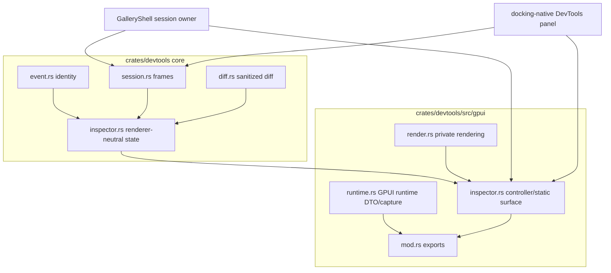

# DevTools Workbench Hardening - Plan

## Goal Capsule

Harden the DevTools workbench that already landed on `main` by making its module boundaries, event identity model, Gallery dogfood, docking-native dogfood, and documentation strong enough to carry the next ecosystem layer without another rewrite.

Authority order: current user request, AGENTS.md repository rules, `docs/plans/2026-07-09-004-feat-devtools-live-runtime-workbench-plan.md`, current `crates/devtools` contracts, engineering memory under `docs/knowledge/engineering`, local reference code under `repo-ref/`, then this plan.

Execution profile: fearless refactor is allowed. Breaking API cleanup, file moves, and deletion of superseded code are allowed when they remove ambiguity. Work may proceed on `main`, use subagents for review or read-only research, create intermediate conventional commits, periodically merge/pull local `main`, and push `origin/main`.

Stop and re-plan if the implementation would add remote debugging transport, mutate application runtime state, make DevTools own docking or GPUI runtime authority, persist trace storage, bypass sanitizer/redaction, or require a reverse dependency from source runtime crates into `open_gpui_devtools`.

---

## Product Contract

### Summary

Open GPUI DevTools now has session frames, sanitized diffs, event identities, a GPUI inspector controller, GPUI runtime metadata capture, and docking runtime capture.
The next problem is architectural carrying capacity: `crates/devtools/src/gpui.rs` mixes unrelated ownership layers, event selection still exposes an ambiguous sequence-only API, Gallery does not own a live session across the shell lifetime, and docking-native proves only a summary capture instead of embedding the reusable inspector.

This plan turns the existing workbench into a maintainable local inspector platform. It does not add a new provider family for its own sake; it first makes the already-shipped workbench harder to misuse.

### Problem Frame

The current DevTools surface is useful but still has three structural liabilities:

- `crates/devtools/src/gpui.rs` contains runtime DTOs, capture helpers, controller state wiring, static inspector rendering, interactive row rendering, detail rendering, and style helpers in one 1700+ line module.
- `DevtoolsInspectorState::select_event(sequence)` and `selected_event_sequence()` preserve a sequence-centered mental model even though session-backed captures can contain multiple event producers with the same sequence.
- Gallery and docking-native dogfood do not yet prove the same live workbench contract: Gallery owns a persistent controller but reconstructs deterministic sessions in helper functions, while docking-native renders text summary lines and keeps its DevTools capture helper test-only.

The durable direction is identity-first and session-backed. UI rows may display sequence numbers, but selection, debug selectors, diff identity, replay frames, and tests must use `DevtoolsEventIdentity`.

### Requirements

**DevTools architecture and API**

- R1. The GPUI DevTools feature module must split into ownership-based files so runtime DTO/capture code, controller code, render helpers, and module re-exports no longer live in one file.
- R2. Event identity must be first-class across inspector state, GPUI debug selectors, tests, diff rows, replay frames, and Gallery/docking dogfood.
- R3. Sequence-only event selection APIs must be removed or demoted out of the public selection contract; sequence may remain only as display metadata derived from `DevtoolsEventIdentity`.
- R4. Root and feature-module exports must make common APIs easy to find while keeping optional adapter APIs behind their feature modules.
- R5. Superseded static, duplicate, or compatibility-only DevTools code must be deleted unless a test or documented public compatibility reason remains.

**Gallery dogfood**

- R6. `GalleryShell` must own the live `DevtoolsSession` or a narrow session owner for the DevTools page lifecycle instead of reconstructing sessions through page helper calls for UI state.
- R7. Gallery DevTools refresh must update the existing `DevtoolsInspectorController` through session frames and preserve filter/selection when the identity still exists.
- R8. Gallery contract tests must prove generation/history/diff come from the shell-owned session path while preserving fixture helpers for deterministic offline tests.
- R9. Gallery must keep legacy `SnapshotCollection` compatibility and the guard against reintroduced static `theme_snapshot`, `form_snapshot`, `resource_snapshot`, or `docking_snapshot` builders.

**Docking-native dogfood**

- R10. `examples/docking-native` must embed a real `DevtoolsInspectorController` panel backed by runtime status capture, not only render a text summary.
- R11. The docking-native DevTools panel must use public `DockViewportRuntimeStatus` facts and explicit capability/unavailable records only.
- R12. The docking crate must not depend on `open_gpui_devtools`; the example remains the integration owner.

**Redaction, replay, and documentation**

- R13. GPUI runtime metadata must remain app-provided or public read-only DTO data; raw text input, clipboard contents, unredacted labels, and private window internals stay outside session frames, diffs, details, and exports.
- R14. Import/replay validation and redaction-induced identity collision behavior must remain covered after module and API cleanup.
- R15. README, changelog, public API snapshots, and engineering memory must document any breaking event-selection changes and the shell-owned/session-backed workbench model.
- R16. Stale engineering memory that still describes sequence-only event selectors must be corrected or superseded so future agents do not copy the obsolete pattern.
- R17. Gallery live refresh must read at least one real `GalleryShell` fact that can change under test, not only advance a deterministic fixture generation.
- R18. Gallery DevTools refresh/history/diff controls must have explicit idle, refreshing, no-change, no-previous-frame, capture-error, selection-preserved, and selection-remapped states with stable selectors and keyboard activation.
- R19. Docking-native DevTools refresh must run from an explicit action or test helper outside render; render must only display the current inspector controller.
- R20. DevTools workbench interactions touched by this plan must preserve practical keyboard/focus behavior and expose stable control names for contract tests.

### Acceptance Examples

- AE1. Given two events with `sequence=0` from different scopes, selecting the second event by `DevtoolsEventIdentity` remains correct after filtering, refresh, diff rendering, and replay import.
- AE2. Given a downstream caller that still expects to display event sequence, row DTOs expose sequence as display metadata without offering sequence-only selection.
- AE3. Given the Gallery DevTools page, invoking a shell refresh increments the same session generation and updates the existing inspector controller without rebuilding the controller entity.
- AE4. Given a selected Gallery event identity, refreshing the shell-owned session preserves the selection when the identity is present and remaps deterministically when it disappears.
- AE5. Given docking-native runtime status, the DevTools inspector panel renders target/domain/event/detail rows from the runtime capture and exposes stable test selectors.
- AE6. Given malformed or oversized imported session JSON, replay validation still rejects it before inspector state loads it and no raw secret string appears in error, detail, or export JSON.
- AE7. Given `cargo check -p open-gpui-devtools --no-default-features`, session/diff/identity core still compiles without GPUI, docking, command, motion, form, resource, or UI component features.
- AE8. Given a changed Gallery shell fact such as the active page, viewport fact, focus marker, or other runtime state, refreshing DevTools updates the same controller and the new frame/diff reflects that real shell fact change.
- AE9. Given Gallery DevTools controls, Refresh is keyboard-activatable, Frame History and Diff controls expose stable selectors, and no-previous-frame/no-change/capture-error states are observable.
- AE10. Given docking-native DevTools, an explicit refresh action updates the session generation and controller from current docking runtime status without mutating state during render.
- AE11. Given the same logical event emitted with a new recorder sequence, `DevtoolsEventIdentity` is treated as a new event instance; exact identities preserve selection, and disappeared identities remap only through documented fallback policy.

### Scope Boundaries

In scope: DevTools module splitting, event identity API cleanup, Gallery shell-owned session dogfood, docking-native embedded inspector dogfood, focused tests, docs, public API drift gates, and engineering memory.

Out of scope: Chrome DevTools Protocol, WebSocket/TCP transport, property editing, runtime mutation commands, input injection, persistent trace storage, screenshot baseline infrastructure, broad redesign of Gallery shell layout, and a new global GPUI runtime snapshot authority.

### Sources and Research

- Prior live workbench plan: `docs/plans/2026-07-09-004-feat-devtools-live-runtime-workbench-plan.md`.
- Prior workbench memory: `docs/knowledge/engineering/progress/2026-07-09-devtools-live-runtime-workbench.md`.
- Current integrated state: `docs/knowledge/engineering/current-state.md`.
- Stale selector memory to reconcile: `docs/knowledge/engineering/verification/2026-07-09-devtools-inspector-click-dogfood.md`.
- Current DevTools GPUI module: `crates/devtools/src/gpui.rs`.
- Current inspector core: `crates/devtools/src/inspector.rs`.
- Current session/diff/event core: `crates/devtools/src/session.rs`, `crates/devtools/src/diff.rs`, `crates/devtools/src/event.rs`.
- Gallery DevTools dogfood: `examples/ui-foundation-gallery/src/pages/devtools.rs`, `examples/ui-foundation-gallery/src/shell.rs`, `examples/ui-foundation-gallery/tests/foundation_gallery/devtools_contracts.rs`.
- Docking-native dogfood: `examples/docking-native/src/main.rs`.
- Local prior-art directories for directional comparison: `repo-ref/flutter-devtools`, `repo-ref/react-devtools`, `repo-ref/chromium-devtools-frontend`, `repo-ref/zed`.

---

## Planning Contract

### Key Technical Decisions

- KTD1. Split `gpui` by ownership, not by helper size. `gpui/mod.rs` owns re-exports, `gpui/runtime.rs` owns GPUI runtime DTO/capture helpers, `gpui/inspector.rs` owns public GPUI inspector/controller types, and `gpui/render.rs` owns private render composition.
- KTD2. Make event identity the only selection key. `sequence` is a recorder-local display fact; `DevtoolsEventIdentity` is the stable event-instance row, selector, diff, and replay identity. Selection is preserved only when the exact identity still exists; if a logically similar event is emitted with a new recorder identity, fallback remapping must be explicit and tested.
- KTD3. Break ambiguous public APIs now. Pre-1.0 DevTools should remove sequence-only selection before downstream users build on it; docs and changelog carry the migration path.
- KTD4. Let Gallery own the live session, not the page fixture. Page-level deterministic helpers remain useful for contract tests, but runtime UI state belongs to `GalleryShell` or a shell-owned session owner.
- KTD5. Embed the reusable inspector in docking-native before adding more docking-specific DevTools projection. A summary line proves less than real controller wiring, click selectors, detail export, and session refresh.
- KTD6. Keep runtime fact ownership outside DevTools. GPUI and docking examples provide DTO/status facts; DevTools sanitizes, snapshots, diffs, and renders them.
- KTD7. Use focused contract tests as the safety net for fearless refactor. Module moves and API cleanup are acceptable only when no-default, feature-gated, Gallery, docking-native, public API, and doc gates remain green.

### Assumptions

- The user has authorized this plan to proceed without an additional scoping confirmation and has explicitly accepted breaking cleanup, deletion of superseded code, subagent review, intermediate commits, and pushing to `origin/main`.
- The DevTools crate is still pre-1.0 enough that removing sequence-only event selection is the right break, provided the migration path is documented in README/changelog text.
- Existing local prior-art checkouts under `repo-ref/` are sufficient for directional comparison; no new reference repositories are required for this refactor.
- Gallery and docking-native should prove the live workbench through existing GPUI test harnesses rather than new screenshot baseline infrastructure.

### High-Level Technical Design



### Sequencing

1. Split `crates/devtools/src/gpui.rs` without semantic changes and update feature-gated tests.
2. Remove sequence-only event selection from the public contract and update tests/selectors to identity-first APIs.
3. Clean root/module exports and docs so the moved files are discoverable.
4. Move Gallery runtime state to a shell-owned session owner and add refresh/history/diff tests through the shell.
5. Embed a real docking-native DevTools inspector panel backed by runtime session capture.
6. Re-run import/redaction/public API/doc gates, then record engineering memory and commit/push.

### Risks and Mitigations

| Risk | Mitigation |
|---|---|
| Large file split hides behavior changes | Land the split first as a focused commit and keep tests unchanged until after move. |
| Sequence API removal breaks tests broadly | Update tests through `DevtoolsEventIdentity`; keep sequence only in row display assertions. |
| Gallery shell is conflict-prone | Serialize edits to `examples/ui-foundation-gallery/src/shell.rs`; do not run parallel writers on it. |
| Docking-native `main.rs` is too large | Keep the embedded inspector panel local and narrow; do not refactor unrelated demo panels in the same unit. |
| Optional features drift | Run no-default, `gpui`, `docking`, all-features, Gallery, and docking-native checks before committing. |
| Redaction regresses during moves | Re-run session import/redaction and framework adapter tests; add a regression if a moved path exposes raw strings. |

---

## Implementation Units

### U1. Split the DevTools GPUI Feature Module

- **Goal:** Move `crates/devtools/src/gpui.rs` into ownership-based submodules without changing behavior.
- **Requirements:** R1, R4, R5, R13, AE7.
- **Files:** Create `crates/devtools/src/gpui/mod.rs`, `crates/devtools/src/gpui/runtime.rs`, `crates/devtools/src/gpui/inspector.rs`, `crates/devtools/src/gpui/render.rs`; delete `crates/devtools/src/gpui.rs`; modify `crates/devtools/src/lib.rs`, `crates/devtools/tests/framework_adapters.rs`.
- **Approach:** Move GPUI runtime DTOs/capture helpers to `runtime.rs`; move `DevtoolsInspector` and `DevtoolsInspectorController` to `inspector.rs`; move render-only helpers to `render.rs`; keep public exports available through `open_gpui_devtools::gpui::*` and existing root re-exports. Replace tests that read `../src/gpui.rs` with checks against the new module files or behavior-level assertions.
- **Test scenarios:** GPUI runtime adapter still emits metadata-only capture; inspector controller still renders category, target, domain, event, snapshot, detail, and action selectors; no-default build still excludes GPUI; all public root exports used by Gallery compile.
- **Verification:** `cargo check -p open-gpui-devtools --features gpui --tests --locked`; `cargo nextest run -p open-gpui-devtools --all-features framework_adapters --no-fail-fast --locked`.

### U2. Make Event Identity the Only Selection Key

- **Goal:** Remove sequence-only event selection from the public inspector selection contract.
- **Requirements:** R2, R3, R5, R14, R15, AE1, AE2, AE6, AE11.
- **Files:** Modify `crates/devtools/src/inspector.rs`, `crates/devtools/src/event.rs`, new GPUI render module files from U1, `crates/devtools/tests/inspector_contracts.rs`, `crates/devtools/tests/diff_contracts.rs`, `examples/ui-foundation-gallery/tests/foundation_gallery/devtools_contracts.rs`, `crates/devtools/README.md`, `CHANGELOG.md`.
- **Approach:** Remove or hide `DevtoolsInspectorState::select_event(sequence)` and its `UnknownEvent(u64)` error path. Keep `DevtoolsEventRow.sequence` and a derived display accessor only if tests or UI copy need it. Update all row clicks, debug selectors, state replacement, and tests to build/select by `DevtoolsEventIdentity`. Add a source guard that fails if GPUI event selectors or tests reintroduce sequence-only selection.
- **Test scenarios:** Same-sequence cross-scope events select correctly; exact identities preserve selection after frame replacement; same logical event with a new recorder identity is treated as a new event instance; filtering event rows keeps selected identity when present and applies only the documented fallback when absent; sequence display remains visible but cannot drive selection; replay/import uses identity and still rejects malformed input safely.
- **Verification:** `cargo nextest run -p open-gpui-devtools --all-features --test inspector_contracts --test diff_contracts --test session_contracts --no-fail-fast --locked`; source scan confirms no `select_event(0)` or `devtools-inspector:event:{sequence}` style selector remains.

### U3. Clean DevTools Public Layering and Documentation

- **Goal:** Make DevTools root exports and feature modules easy to navigate after the split and breaking cleanup.
- **Requirements:** R4, R5, R15, AE7.
- **Files:** Modify `crates/devtools/src/lib.rs`, `crates/devtools/README.md`, `docs/verification.md`, `CHANGELOG.md`, `docs/release/breaking-changes.md`, and any public API snapshot inputs required by `xtask`.
- **Approach:** Group root re-exports by core protocol, session/diff, inspector state, snapshots/probes, and feature-gated UI adapters. Keep optional adapter modules public under their existing feature names. Document the identity-first event selection migration and the app-provided GPUI runtime DTO boundary.
- **Test scenarios:** Public API scan passes; README references existing paths and feature flags; changelog and release breaking inventory have a migration note for sequence-only selection removal; doc link scan passes.
- **Verification:** `cargo run -p xtask -- scan-public-api --check`; `cargo run -p xtask -- scan-doc-links`; `cargo run -p xtask -- verify-release-docs`.

### U4. Make Gallery DevTools Shell-Owned and Live

- **Goal:** Move Gallery DevTools UI state from deterministic helper reconstruction to a shell-owned live session.
- **Requirements:** R6, R7, R8, R9, R13, R17, R18, R20, AE3, AE4, AE6, AE8, AE9.
- **Files:** Modify `examples/ui-foundation-gallery/src/pages/devtools.rs`, `examples/ui-foundation-gallery/src/shell.rs`, `examples/ui-foundation-gallery/tests/foundation_gallery/devtools_contracts.rs`.
- **Approach:** Factor the provider/registry builder so both tests and `GalleryShell` use the same capture sources. Add a `GalleryDevtoolsWorkbench` or equivalent shell field that owns `DevtoolsSession`, refreshes it, and updates the existing `DevtoolsInspectorController` with `update_session_frame()`. Include at least one shell-provided runtime fact that tests can mutate before refresh, so live refresh proves more than deterministic fixture replay. Add user-facing Refresh, Frame History, and Diff controls with stable selectors, keyboard activation, and explicit state labels for idle, refreshing, no-change, no-previous-frame, capture-error, selection-preserved, and selection-remapped. Keep deterministic fixture functions for offline contract tests, but name and structure them so UI code cannot accidentally rebuild a fresh session as its live state.
- **Test scenarios:** Initial Gallery DevTools controller renders from generation 1 or 2 consistently; a shell refresh increments the same session generation; a changed shell fact appears in the refreshed frame and diff; selected event identity survives when the row remains present; disappeared event identity remaps deterministically; Refresh is keyboard-activatable and focus/selection remain coherent after refresh and filtering; no-previous-frame/no-change/capture-error states are observable through selectors; legacy `devtools_gallery_capture()` and `devtools_gallery_collection()` still work for compatibility tests; static builder guard still passes.
- **Verification:** `cargo check -p open-gpui-ui-foundation-gallery --all-targets --locked`; `cargo nextest run -p open-gpui-ui-foundation-gallery devtools_gallery --no-fail-fast --locked`.

### U5. Embed a Docking-Native DevTools Inspector Panel

- **Goal:** Replace docking-native summary-only dogfood with a real embedded DevTools inspector controller over docking runtime status.
- **Requirements:** R10, R11, R12, R13, R19, R20, AE5, AE6, AE10.
- **Files:** Modify `examples/docking-native/Cargo.toml`, `examples/docking-native/src/main.rs`.
- **Approach:** Enable the `gpui` feature for `open_gpui_devtools` in the example. Add a narrow `DockingDevtoolsPanel` or equivalent entity that owns a `DevtoolsSession` and a `DevtoolsInspectorController`. Define the panel's entry point and layout relative to the existing runtime status panel, then refresh through an explicit action or test helper: read public runtime status and viewport capabilities, capture through the existing docking DevTools adapter, refresh the session, and call `DevtoolsInspectorController::update_session_frame()`. Do not update controller state from render. Keep the existing text summary as compact runtime context only if it remains useful.
- **Test scenarios:** The example compiles with `docking` and `gpui` DevTools features; the DevTools panel is discoverable from the demo layout and renders the inspector root selector; explicit refresh produces a new generation with docking target/domain/event rows; Refresh has a stable selector and control name; unsupported platform capability diagnostics remain explicit; no dependency direction changes in `open_gpui_docking`.
- **Verification:** `cargo check -p open-gpui-docking-native --all-targets --locked`; `cargo nextest run -p open-gpui-docking-native runtime_status_panel devtools --no-fail-fast --locked`.

### U6. Final Hardening, Memory, and Landing

- **Goal:** Prove the refactor did not weaken session, replay, redaction, docs, or public API boundaries.
- **Requirements:** R13, R14, R15, R16, AE6, AE7.
- **Files:** Modify tests/docs touched by prior units; update or supersede `docs/knowledge/engineering/verification/2026-07-09-devtools-inspector-click-dogfood.md`; add memory concepts under `docs/knowledge/engineering/progress/`, `docs/knowledge/engineering/verification/`, and `docs/knowledge/engineering/subagents/` only when they capture durable execution facts.
- **Approach:** Run focused gates first, then the DevTools all-features suite, then example gates and xtask scanners. Use engineering memory for subagent findings, verification summaries, commits, and final handoff; do not write execution progress into this plan.
- **Test scenarios:** Import validation still rejects bad schema and oversized event batches; redaction tests still hide emails, token-like strings, raw text, clipboard contents, and paths; redaction-induced identity collisions remain deterministic and do not expose raw values; no-default DevTools compiles; public API and doc link scans pass; final `git diff --check` is clean.
- **Verification:** Commands in the Verification Contract all pass or are documented as not applicable with a concrete reason.

---

## Verification Contract

| Gate | Command | Done signal |
|---|---|---|
| Formatting | `cargo fmt -p open-gpui-devtools -p open-gpui-ui-foundation-gallery -p open-gpui-docking-native --check` | Changed Rust files are formatted. |
| DevTools no-default core | `cargo check -p open-gpui-devtools --no-default-features --tests --locked` | Session, diff, event identity, inspector state, and snapshots compile without optional UI/framework adapters. |
| DevTools GPUI feature | `cargo check -p open-gpui-devtools --features gpui --tests --locked` | Split GPUI feature compiles independently. |
| DevTools docking feature | `cargo check -p open-gpui-devtools --features docking --tests --locked` | Docking capture remains feature-gated and independent. |
| DevTools all features | `cargo nextest run -p open-gpui-devtools --all-features --no-fail-fast --locked` | Core, adapters, session, diff, inspector, and framework tests pass. |
| Gallery DevTools | `cargo nextest run -p open-gpui-ui-foundation-gallery devtools_gallery --no-fail-fast --locked` | Shell-owned session and legacy fixture compatibility pass. |
| Gallery compile | `cargo check -p open-gpui-ui-foundation-gallery --all-targets --locked` | Gallery example and tests compile. |
| Docking-native compile | `cargo check -p open-gpui-docking-native --all-targets --locked` | Embedded inspector panel compiles in the native docking example. |
| Docking-native dogfood | `cargo nextest run -p open-gpui-docking-native runtime_status_panel devtools --no-fail-fast --locked` | Runtime status summary and embedded inspector dogfood tests pass. |
| API and docs | `cargo run -p xtask -- scan-public-api --check`; `cargo run -p xtask -- scan-doc-links`; `cargo run -p xtask -- verify-release-docs` | Public API tiers, links, and release docs reflect the breaking cleanup. |
| Redaction collision | `cargo nextest run -p open-gpui-devtools --all-features redaction collision --no-fail-fast --locked` or the equivalent named regression tests if filters change during implementation. | Redaction-induced identity collisions remain covered after the API/module cleanup. |
| UI interaction contracts | Covered by the DevTools, Gallery DevTools, and docking-native dogfood nextest gates with tests for keyboard refresh activation, focus/selection retention, and stable control names. | Workbench controls changed by this plan remain operable and test-addressable. |
| Source guards | Run the PowerShell source guard below. | No sequence-only selection or selector patterns remain outside this plan's guard text and changelog migration examples. |
| Diff hygiene | `git diff --check` | No whitespace or conflict-marker issues remain. |

Source guard:

```powershell
rg -n "select_event\(0\)|select_event\(sequence|devtools-inspector:event:\{sequence\}" crates examples docs/knowledge/engineering
if ($LASTEXITCODE -eq 0) { exit 1 }
if ($LASTEXITCODE -eq 1) { exit 0 }
exit $LASTEXITCODE
```

---

## Definition of Done

- All non-deferred implementation units U1-U6 are complete and verified against their listed test scenarios.
- `crates/devtools/src/gpui.rs` no longer exists as a monolithic module; public GPUI feature exports still compile through `open_gpui_devtools::gpui`.
- Public event selection is identity-first, with no sequence-only selector or public selection path surviving outside display metadata.
- Gallery DevTools UI state is shell-owned/session-backed and tests prove a live refresh path through the existing controller using at least one mutable real shell fact.
- Docking-native embeds a real DevTools inspector controller panel backed by docking runtime capture.
- No raw sensitive payload, raw text, clipboard content, unredacted app label, or private runtime fact is introduced into capture, diff, detail, or export JSON.
- README, changelog, public API scans, docs scans, and engineering memory describe the breaking cleanup and live workbench model.
- The stale inspector-click dogfood memory no longer teaches `devtools-inspector:event:0` as the current selector contract.
- Dead-end code from attempted approaches is removed before final commit.
- The final tree is committed with conventional commits and pushed to `origin/main` if remote state allows a clean push.
