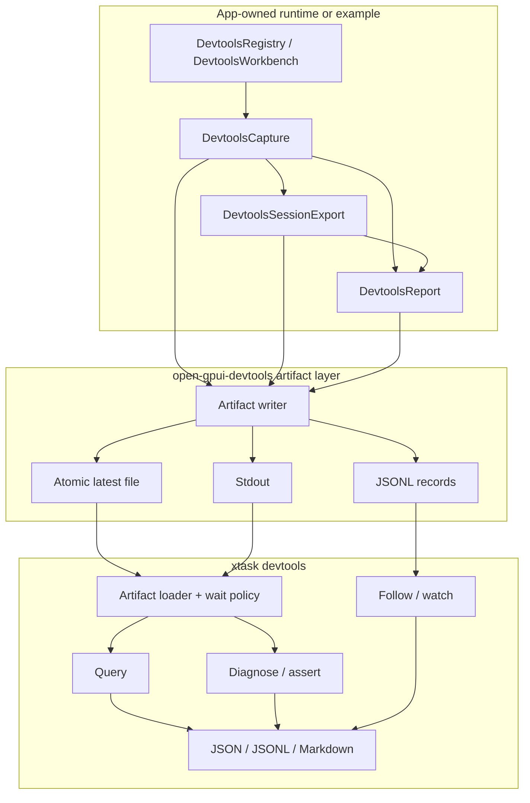

# DevTools Headless Artifact Pipeline - Plan

## Goal Capsule

Make Open GPUI DevTools useful as a headless UI debugging pipeline: running examples and app-owned workbenches can emit stable artifacts, `xtask devtools` can query/assert/follow/wait over those artifacts, and complex docking, multi-viewport, layout, motion, command, form, and resource scenarios can be debugged from structured data without opening a GUI viewer.

Authority order: current user request, AGENTS.md repository rules, ADR 0019, current `open-gpui-devtools` capture/session/report contracts, existing Gallery and docking-native dogfood, engineering memory under `docs/knowledge/engineering`, official prior-art documentation, then this plan.

Execution profile: fearless refactor is allowed during implementation. Breaking CLI/API cleanup is acceptable because the DevTools CLI and artifact producer layer are still new. Delete superseded glue when the new producer/query path makes it unnecessary. Keep work local, read-only, bounded, schema-versioned, and sanitized.

Stop and re-plan if implementation would add remote debugging transport, clone CDP semantics, mutate application runtime state, make DevTools own GPUI/docking authority, persist unbounded trace storage, bypass sanitizer/redaction, or turn the GUI inspector into the primary contract again.

---

## Product Contract

### Summary

The existing DevTools stack already has the core data model: `DevtoolsCapture`, `DevtoolsSession`, `DevtoolsSessionExport`, `DevtoolsCaptureDiff`, `DevtoolsReport`, `DevtoolsWorkbench`, typed adapters, Gallery dogfood, and docking-native embedded inspector dogfood.
The next gap is not another provider abstraction or a GUI workbench; it is the artifact production and command-line usage layer around those contracts.

This plan adds a stable headless pipeline:

- App-owned workbenches and examples emit capture/session/report artifacts through a renderer-neutral writer/sink contract.
- `xtask devtools` consumes files, stdin, and updating artifacts through clear fail-fast, bounded wait, and follow semantics.
- Query/assert outputs expose the facts users need for complex UI debugging: targets, domains, events, snapshots, findings, diff rows, bounds, focus, generation, severity, and redaction status.
- Gallery and docking-native become reproducible artifact producers and fixture sources, not just visual dogfood pages.

### Problem Frame

ADR 0019 correctly made headless diagnostics the primary DevTools product shape. The first slice implemented report/diagnose/diff/stream consumers, but the producer side is still informal: the CLI mostly assumes a JSON artifact already exists, `stream` expands retained frames from one export instead of following a live-producing file, and complex UI debugging still requires a human to know which JSON fields to inspect.

The local codebase now has enough dogfood to close that gap. Gallery already produces session-backed multi-domain captures. Docking-native already refreshes a session over public `DockViewportRuntimeStatus`. Layout, timeline, motion, GPUI runtime, command, form, resource, and UI component adapters are present. The work should standardize how those facts leave the app and how command-line consumers inspect them.

### Requirements

**Artifact producer and sink contract**

- R1. `open-gpui-devtools` must expose a renderer-neutral artifact writer/sink contract for capture, session export, and report artifacts.
- R2. Producers must support at least single write, atomic latest-file replacement, stdout, and JSONL record emission while preserving existing bounded session history.
- R3. Artifact metadata must identify schema version, artifact kind, producer id, optional scenario id, session/generation, monotonic sequence, flush reason, timestamp/order when available, and redaction summary.
- R4. Producer APIs must be app-owned. DevTools may serialize sanitized facts but must not refresh app state in the background, own runtime authority, or mutate UI state.
- R5. Artifact writes must be bounded and sanitizer-safe. No raw user text, clipboard payload, unredacted window title, path-like secret, token-like value, or private runtime struct dump may enter artifact metadata or records.

**Command-line contract**

- R6. `xtask devtools` must be refactored into maintainable command, artifact loading, rendering, query, and watch/follow modules before new CLI behavior expands the current single file.
- R7. The CLI must accept `--input -` for stdin and `--output -` for stdout wherever the command shape supports it.
- R8. The current fail-fast default must stay. `--timeout-ms` remains bounded blocking until an artifact appears and parses. Follow/watch behavior must be explicit, long-running, and flush JSONL records incrementally.
- R9. Query must support a small stable selector set over artifact kind, target id/kind, domain id/kind, event id/identity, snapshot kind/probe id, finding id/severity/category, diff status/kind, generation, and text-safe labels.
- R10. Assert/diagnose commands must be able to fail the process on severity thresholds, missing query matches, generation thresholds, changed/no-change diff state, and domain/target/finding presence.
- R11. JSON, JSONL, and Markdown outputs must be stable enough for scripts and issue comments. Markdown can summarize; JSON/JSONL must retain machine-readable ids and reasons.

**Scenario diagnostics**

- R12. `DevtoolsReport` must grow rule hooks or domain-specific findings without turning reports into raw JSON dumps.
- R13. Docking diagnostics must surface explicit public facts for unsupported platform capabilities, stale/missing route facts, missing route-ready coordinates, rejected drop targets, visual-affordance churn, and diff collisions.
- R14. Layout and UI diagnostics must surface zero-size bounds, non-finite bounds, scroll overflow anomalies, missing target/domain joins, and selector/bounds/focus facts when producers provide them.
- R15. Motion diagnostics must stay conservative: frame-demand, timeline order, reset reason, terminal-state frame requests, reduced-motion final-state violations, and retarget metadata can be reported; full motion graph debugging is deferred.
- R16. Command, form, and resource diagnostics must remain typed and redacted: shortcut conflicts, missing actions, invalid key context, form validation/submission state, resource pending/error/retry facts, and pagination summary are useful; raw values are not.

**Dogfood and fixtures**

- R17. Gallery must expose a headless artifact producer path that can emit deterministic session/report artifacts covering command, form, resource, layout, timeline, motion, GPUI runtime, accessibility/theme, and gallery shell facts.
- R18. Docking-native must expose a headless artifact producer path over public docking runtime status and multi-viewport facts without adding a reverse dependency from `open-gpui-docking` to `open-gpui-devtools`.
- R19. The repo must gain stable DevTools fixture artifacts and CLI contract tests so query/assert/follow/wait behavior can be reproduced without launching a GUI.
- R20. Fixture artifacts must be intentionally small, sanitized, and versioned. They are not persistent trace storage.

**Documentation and architecture**

- R21. Add or update an ADR for producer/sink/query/follow semantics so ADR 0019 remains the headless direction and this plan defines the next layer.
- R22. README, verification docs, changelog, and public API inventory must document the artifact producer path, CLI query/assert/follow usage, wait semantics, and non-goals.
- R23. The plan must not introduce a full GUI viewer, CDP bridge, DAP bridge, LSP server, screenshot baseline system, or persistent trace database.

### Acceptance Examples

- AE1. Given Gallery's deterministic DevTools workbench, a headless producer writes a session export and report artifact whose query output includes command, form, resource, layout, timeline, motion, GPUI runtime, and redaction summary facts.
- AE2. Given docking-native runtime status with platform viewport windows unsupported, the emitted report contains a stable warning/error finding derived from explicit public capability records, and no private docking runtime fields are serialized.
- AE3. Given `xtask devtools query --input - --target-kind viewport`, piping a valid session export through stdin returns only matching viewport target rows as JSON.
- AE4. Given a missing artifact and no timeout, the CLI fails fast. Given the same path with `--timeout-ms`, the CLI waits until the artifact exists and parses, then emits the requested output.
- AE5. Given a producer that atomically replaces a latest session export, `xtask devtools follow` emits one JSONL report/query record per new generation and flushes each record.
- AE6. Given `xtask devtools assert` with an expected finding or selector that does not exist, the process exits non-zero and prints a machine-readable reason in JSON mode.
- AE7. Given two captures where a sanitized identity collision occurs, diff/report/query output preserves the collision as an explicit finding and never overwrites a row silently.
- AE8. Given secret-like strings in producer ids, labels, scenario ids, snapshot payloads, or event payloads, serialized artifacts and selectors contain only sanitized values and redaction summaries.
- AE9. Given generated fixtures under the DevTools fixture directory, CLI contract tests can reproduce report, query, assert, diff, follow, and wait behavior without launching Gallery or docking-native.

### Scope Boundaries

In scope: renderer-neutral artifact writer/sink APIs, `xtask devtools` refactor, stdin/stdout support, stable query/assert commands, follow/watch semantics, bounded wait semantics, domain-specific report findings, Gallery/docking-native headless producers, small fixture artifacts, CLI contract tests, ADR/docs/release notes, and deletion of superseded one-off artifact glue.

Deferred for later: full GUI viewer over artifacts, remote attach, WebSocket/TCP transport, CDP/DAP/LSP adapters, mutation/property editing, input injection, screenshot/pixel baseline infrastructure, broad app scenario runner, persistent trace database, full motion graph timeline debugger, and comprehensive typed UI node tree for every component.

### Sources and Research

- Current headless direction: `docs/adr/0019-open-gpui-devtools-headless-diagnostics.md`.
- Current public contract: `crates/devtools/README.md`, `crates/devtools/src/lib.rs`, `crates/devtools/src/session.rs`, `crates/devtools/src/report.rs`, `xtask/src/devtools.rs`.
- Current dogfood: `examples/ui-foundation-gallery/src/pages/devtools.rs`, `examples/docking-native/src/main.rs`.
- Current workbench state: `docs/knowledge/engineering/progress/2026-07-09-devtools-workbench-hardening.md`.
- Playwright Trace Viewer records offline traces, opens saved trace files from CLI/browser, and inspects actions, logs, snapshots, errors, metadata, and attachments: https://playwright.dev/docs/trace-viewer.
- Chrome DevTools Protocol is divided into domains with JSON commands/events, but also carries remote debugging and mutation/control semantics this plan intentionally avoids: https://chromedevtools.github.io/devtools-protocol/.
- Flutter/Dart DevTools can be launched from CLI and attaches to a running app through service URLs; Open GPUI should borrow explicit launch/connect vocabulary, not the remote service protocol itself: https://docs.flutter.dev/tools/devtools/cli and https://dart.dev/tools/dart-devtools.
- Language Server Protocol diagnostics show useful ownership semantics: newly pushed diagnostics replace older diagnostics for the same owner rather than merging silently: https://microsoft.github.io/language-server-protocol/specifications/lsp/3.17/specification/.
- SARIF is a standard static-analysis result format and is useful as a future CI/export reference, but not the first artifact shape: https://www.oasis-open.org/standard/sarifv2-1-os/.
- OpenTelemetry's log data model reinforces structured timestamp/severity/attributes concepts; Open GPUI should keep its own UI-specific schema while preserving these machine-readable traits: https://opentelemetry.io/docs/specs/otel/logs/data-model/.

---

## Planning Contract

### Key Technical Decisions

- KTD1. Keep `DevtoolsCapture`, `DevtoolsSessionExport`, `DevtoolsCaptureDiff`, and `DevtoolsReport` as canonical artifacts. Add producer/sink APIs around them rather than inventing a separate trace format.
- KTD2. Put artifact reading/writing/wait-policy logic in `open-gpui-devtools` when it is reusable; keep `xtask` as the CLI shell and orchestration layer.
- KTD3. Break the CLI now if necessary. A smaller, consistent `--input -`, `--output -`, `--format`, `--timeout-ms`, `--follow`, and `--until` shape is better than preserving early ad hoc flags.
- KTD4. Query is a deliberately small selector language, not `jq`, SQL, GraphQL, or a scripting runtime. Stable ids, kinds, severities, generation, and safe labels cover the first debugging workflows.
- KTD5. Follow/watch is artifact-driven, not process-attach. For latest-file mode, the CLI observes replacement/mtime changes and emits a new record when generation or content identity advances. For JSONL mode, it consumes appended records. No file-system watcher dependency is required for v1.
- KTD6. Reports remain judgment-bearing. Domain diagnostics should produce stable findings with severity, ids, category, target/domain/event links, and recommendations instead of making callers infer problems from raw JSON.
- KTD7. Gallery and docking-native are the first producers because they already own app/workbench state and cover the widest real scenario spread. Do not build a generic app launcher before those producers prove the contract.
- KTD8. Fixture artifacts are executable documentation. Every new CLI command should have small sanitized fixtures and contract tests before broader examples depend on it.
- KTD9. ADR 0020 should land before or with U1. ADR 0019 says "artifact-first"; the new ADR defines producer/sink/query/follow semantics and non-goals.

### Assumptions

- The user has authorized planning from current context without an additional scoping confirmation and has explicitly accepted breaking refactors for the implementation phase.
- No new reference repositories need to be cloned for this plan. Official docs and current local dogfood are sufficient; copying a large DevTools frontend implementation would add noise.
- `xtask devtools` is early enough that refactoring command internals and changing flags can be done with changelog/release notes rather than compatibility shims.
- Gallery/docking-native producer paths can be implemented as deterministic test/helper surfaces first. Full "launch arbitrary example and capture" orchestration is deferred.

### High-Level Technical Design

### Sequencing

1. Write ADR 0020 and add the library-level artifact writer/sink contract.
2. Refactor `xtask devtools` so new command behavior has a maintainable home.
3. Add stdin/stdout, query/assert, and follow/watch semantics with fixtures and CLI contract tests.
4. Add Gallery headless producer and use it to generate sanitized fixture artifacts.
5. Add docking-native producer and docking/multi-viewport report rules.
6. Add broader domain report rules for layout, motion, command, form, and resource.
7. Finish docs, public API inventory, release notes, and verification memory.

### Risks and Mitigations

| Risk | Mitigation |
|---|---|
| CLI scope balloons into a scripting engine | Keep v1 query selectors small and explicit; defer complex expressions. |
| Producer layer starts owning runtime refresh | Keep producer APIs app-owned; examples call refresh explicitly and then write artifacts. |
| Follow semantics become flaky on Windows | Use parse-success plus generation/content identity advancement; avoid relying solely on file-system watcher events. |
| Fixtures expose secrets or become huge | Generate small intentional fixtures and assert sanitizer/redaction summaries. |
| Domain diagnostics become noisy | Emit stable findings only for actionable invariant/capability/structural problems. |
| `xtask/src/devtools.rs` becomes unmaintainable | Split it before adding query/follow/assert behavior. |
| Tests require launching GUI windows | First producer tests operate through existing deterministic workbench/session helpers; GUI launch remains optional dogfood. |

---

## Implementation Units

### U1. ADR and Artifact Writer Contract

- **Goal:** Define the producer/sink/query/follow semantics and add the reusable artifact writer primitives.
- **Requirements:** R1, R2, R3, R4, R5, R21, R23, AE1, AE8.
- **Dependencies:** None.
- **Files:** `docs/adr/0020-open-gpui-devtools-artifact-pipeline.md`, `docs/adr/README.md`, `crates/devtools/src/artifact.rs`, `crates/devtools/src/lib.rs`, `crates/devtools/tests/artifact_contracts.rs`, `crates/devtools/README.md`.
- **Approach:** Add a renderer-neutral artifact module that can wrap `DevtoolsCapture`, `DevtoolsSessionExport`, and `DevtoolsReport` with sanitized metadata and write them to single JSON, atomic latest JSON, stdout-compatible buffers, or JSONL records. Keep file-system policy narrow: parent creation, temp-then-rename for latest files, no recursive cleanup, no persistent store. ADR 0020 records default fail-fast, bounded wait, follow modes, fixture policy, and non-goals.
- **Execution note:** Start with contract tests over in-memory writer output and temp files before touching `xtask`.
- **Patterns to follow:** `crates/devtools/src/session.rs` import limits, `crates/devtools/src/report.rs` schema/version style, sanitizer helpers in `crates/devtools/src/adapters`.
- **Test scenarios:** Writing capture/session/report artifacts includes sanitized metadata and correct kind/schema. Atomic latest write leaves a complete parseable file. JSONL writer emits one record per call and flushes newline-delimited JSON. Metadata with secret-like strings is sanitized. Report generation from a written session export preserves diff/finding counts. Empty or default captures remain valid artifacts with warnings only at report time.
- **Verification:** `cargo check -p open-gpui-devtools --tests --locked`; `cargo nextest run -p open-gpui-devtools --test artifact_contracts --no-fail-fast --locked`.

### U2. Refactor `xtask devtools` Around Artifacts

- **Goal:** Split the CLI implementation before adding more command behavior.
- **Requirements:** R6, R7, R8, R11.
- **Dependencies:** U1.
- **Files:** Replace `xtask/src/devtools.rs` with `xtask/src/devtools/mod.rs` plus submodules such as `artifact.rs`, `commands.rs`, `render.rs`, `query.rs`, and `watch.rs`; modify `xtask/src/commands.rs`, `xtask/Cargo.toml`, `Cargo.toml`, `Cargo.lock` only if dependencies or module paths require it.
- **Approach:** Move current report/diagnose/diff/stream behavior into submodules while preserving existing smoke behavior. Centralize artifact loading, parse/wait policy, output rendering, and stream record writing. Add stdin/stdout support in the shared loader/writer path but keep new query/assert/follow commands for U3.
- **Execution note:** Treat this as a behavior-preserving refactor plus stdin/stdout plumbing; run current CLI smoke before adding new semantics.
- **Patterns to follow:** Current `xtask/src/devtools.rs` clap derive shape and existing `report`, `diagnose`, `diff`, `stream` behavior.
- **Test scenarios:** Existing report/diagnose/diff/stream commands produce the same JSON/Markdown/JSONL shape for fixtures. Missing inputs still fail fast. `--timeout-ms` still waits for partial JSON to become parseable. `--input -` reads stdin for commands with one input. `--output -` writes stdout when explicit. Help text remains understandable after command splitting.
- **Verification:** `cargo check -p xtask --locked`; CLI smoke commands over small fixture artifacts; `cargo run -p xtask -- devtools --help`.

### U3. Query, Assert, Wait, and Follow CLI

- **Goal:** Add the command-line workflows that let users inspect UI state from artifacts without a GUI.
- **Requirements:** R7, R8, R9, R10, R11, R19, AE3, AE4, AE5, AE6, AE7.
- **Dependencies:** U1, U2.
- **Files:** `xtask/src/devtools/query.rs`, `xtask/src/devtools/watch.rs`, `xtask/src/devtools/commands.rs`, `crates/devtools/src/artifact.rs`, `crates/devtools/src/report.rs`, `xtask/tests/devtools_cli_contracts.rs` or the repo's nearest xtask test location, `crates/devtools/tests/fixtures/*`.
- **Approach:** Add `query`, `assert`, and `follow` commands. Query returns typed rows for target/domain/event/snapshot/finding/diff/generation selections. Assert reuses query/report conditions and exits non-zero with structured failure details. Follow supports latest-file polling and JSONL consumption, emitting one JSONL record per generation/content advancement and respecting `--limit`, `--idle-after-ms`, and `--timeout-ms` where applicable.
- **Execution note:** Keep the selector grammar intentionally small. If implementation pressure grows, ship target/domain/event/finding/diff selectors first and defer label contains/compound predicates.
- **Patterns to follow:** `DevtoolsInspectorState` row DTOs for targets/domains/events/snapshots, `DevtoolsReportFinding` severity/category/id shape, current `stream` JSONL schema style.
- **Test scenarios:** Query by target kind, domain kind, event id, finding severity, diff status, generation, and snapshot kind returns deterministic JSON. Query no-match returns empty success unless assert mode requested. Assert missing selector fails with non-zero exit. Assert `finding>=warning` fails when a warning exists and succeeds when none exists. Follow over atomically replaced session files emits only new generations. Follow over JSONL consumes appended records. `--limit` stops cleanly. Partial JSON is retried only within configured wait/follow policy. Markdown output is compact and does not lose ids.
- **Verification:** `cargo check -p xtask --locked`; xtask CLI contract tests; focused smoke for stdin, stdout, fail-fast, timeout, assert fail, follow latest, follow JSONL.

### U4. Gallery Headless Producer and Fixtures

- **Goal:** Make Gallery the first deterministic multi-domain artifact producer.
- **Requirements:** R17, R19, R20, R22, AE1, AE8, AE9.
- **Dependencies:** U1, U3.
- **Files:** `examples/ui-foundation-gallery/src/pages/devtools.rs`, `examples/ui-foundation-gallery/src/shell.rs` if the shell-owned workbench needs a public export hook, `examples/ui-foundation-gallery/tests/foundation_gallery/devtools_contracts.rs`, `crates/devtools/tests/fixtures/gallery-session.json`, `crates/devtools/tests/fixtures/gallery-report.json`, docs touched by fixture path policy.
- **Approach:** Add a headless export helper around the existing `GalleryDevtoolsWorkbench` or deterministic session helpers. It should produce sanitized session and report artifacts through the U1 writer contract and provide a stable fixture-generation test. The producer path must cover existing Gallery domains rather than rebuilding static snapshot fixtures by hand.
- **Execution note:** Prefer deterministic test/helper entry points over launching the Gallery GUI. A runnable example flag can be deferred unless it is cheap and follows existing CLI patterns.
- **Patterns to follow:** `devtools_gallery_session_export()`, `devtools_gallery_capture()`, current static-builder guards, `GalleryDevtoolsWorkbench` session history/diff model.
- **Test scenarios:** Gallery producer emits session/report artifacts with command, form, resource, layout, timeline, motion, GPUI runtime, accessibility/theme, and shell facts. Fixture report has stable summary/finding counts. Query CLI tests can target Gallery fixture domains. Sensitive-looking shell facts are sanitized. Legacy `SnapshotCollection` compatibility helpers still pass. Fixture regeneration does not require manual GUI interaction.
- **Verification:** `cargo check -p open-gpui-ui-foundation-gallery --all-targets --locked`; `cargo nextest run -p open-gpui-ui-foundation-gallery devtools --no-fail-fast --locked`; CLI query/assert smoke over Gallery fixtures.

### U5. Docking-Native Producer and Docking Diagnostics

- **Goal:** Make docking-native a reproducible multi-viewport artifact producer and strengthen docking report findings.
- **Requirements:** R13, R18, R19, R20, R22, AE2, AE5, AE7, AE8.
- **Dependencies:** U1, U3.
- **Files:** `crates/devtools/src/docking.rs`, `crates/devtools/src/report.rs` or a new report-rule module, `crates/devtools/tests/docking_runtime_contracts.rs`, `examples/docking-native/src/main.rs`, `examples/docking-native/Cargo.toml` if needed, `crates/devtools/tests/fixtures/docking-session.json`, `crates/devtools/tests/fixtures/docking-report.json`.
- **Approach:** Add a headless export helper around the existing docking runtime DevTools session path and ensure it writes artifacts through the shared writer. Extend report findings for docking runtime facts that are already explicit in public status records. Do not add `open_gpui_devtools` as a dependency of `open-gpui-docking`; the example remains the integration owner.
- **Execution note:** Keep graph/host-render snapshots deferred unless public status/debug records are already available. The first producer should focus on runtime capability, lifecycle, route/drop/tear-off/platform-sync, and visual-affordance facts already present.
- **Patterns to follow:** `docking_runtime_capture()`, `docking_runtime_inspection()`, `docking_runtime_devtools_session()`, existing runtime status panel tests.
- **Test scenarios:** Docking fixture includes runtime target/domain rows and viewport targets. Unsupported platform capability produces a stable finding. Missing/stale route facts produce findings only from explicit public records. Visual affordance active layer/churn data remains sanitized. Query by viewport target/domain returns rows. Diff/query over two docking frames reports changed lifecycle facts. No reverse dependency appears in `open-gpui-docking`.
- **Verification:** `cargo check -p open-gpui-devtools --features docking --tests --locked`; `cargo nextest run -p open-gpui-devtools --features docking --test docking_runtime_contracts --no-fail-fast --locked`; `cargo check -p open-gpui-docking-native --all-targets --locked`; docking-native focused nextest gates over runtime status/devtools.

### U6. Layout, Motion, Command, Form, and Resource Report Rules

- **Goal:** Add the first useful scenario diagnostics beyond generic structural validation.
- **Requirements:** R12, R14, R15, R16, AE1, AE6, AE8.
- **Dependencies:** U1, U3, U4.
- **Files:** `crates/devtools/src/report.rs` or `crates/devtools/src/report_rules.rs`, `crates/devtools/src/layout.rs`, `crates/devtools/src/timeline.rs`, `crates/devtools/src/motion.rs`, `crates/devtools/src/command.rs`, `crates/devtools/src/form.rs`, `crates/devtools/src/resource.rs`, `crates/devtools/tests/report_contracts.rs`, relevant adapter test files.
- **Approach:** Introduce a small internal report-rule pass over existing targets/domains/events/snapshots. Start with rules that can be evaluated from stable DTOs: invalid/non-finite/zero-size layout bounds, scroll offset beyond max offset, timeline event order anomalies, terminal motion requesting frames, command shortcut conflicts or missing action diagnostics already present in command snapshots, form validation/submission redaction summaries, and resource error/retry summaries. Keep rule ids stable and domain-prefixed.
- **Execution note:** Do not parse arbitrary adapter payloads with brittle string matching when a typed DTO is not available. If a rule needs typed data that does not exist, defer it or add the narrow typed DTO first.
- **Patterns to follow:** Existing `structural_findings()` in `report.rs`, adapter diagnostics from command/form/resource/docking modules.
- **Test scenarios:** Each rule category has at least one positive and one clean case. Findings include severity, stable id, category, message, relevant target/domain/event when known, and recommendation. Redacted payloads do not leak through findings. Report JSON and Markdown include the new findings. `--fail-on warning` exits non-zero for warning findings. Clean Gallery fixture does not become noisy.
- **Verification:** `cargo nextest run -p open-gpui-devtools --all-features --test report_contracts --no-fail-fast --locked`; adapter-specific focused tests for changed feature gates.

### U7. Docs, Release Notes, Public API, and Final Verification

- **Goal:** Leave the artifact pipeline discoverable and keep repo verification stable.
- **Requirements:** R21, R22, R23, AE1-AE9.
- **Dependencies:** U1-U6.
- **Files:** `crates/devtools/README.md`, `docs/adr/README.md`, `docs/verification.md`, `CHANGELOG.md`, `docs/release/breaking-changes.md`, `docs/knowledge/engineering/progress/*`, `docs/knowledge/engineering/verification/*`, public API inventory files used by `xtask`.
- **Approach:** Document producer setup, CLI examples, fixture policy, wait/follow semantics, query/assert selector subset, non-goals, and migration notes for any broken flags/APIs. Update public API snapshots intentionally. Add engineering memory only for durable results and verification evidence, not for transient plan progress.
- **Execution note:** Run docs and API gates late, after command names and public types settle.
- **Patterns to follow:** ADR 0019, current DevTools README verification section, existing engineering progress/verification memory format.
- **Test scenarios:** README examples match real commands. ADR links resolve. Changelog documents breaking CLI/API changes. Public API scan accepts new exports or catches accidental ones. Doc link scan passes. Final smoke commands over Gallery and docking fixtures match documented usage.
- **Verification:** Full Verification Contract below.

---

## Verification Contract

| Gate | Command | Done signal |
|---|---|---|
| Formatting | `cargo fmt -p open-gpui-devtools -p open-gpui-ui-foundation-gallery -p open-gpui-docking-native -p xtask --check` | Changed Rust files are formatted. |
| DevTools core | `cargo check -p open-gpui-devtools --tests --locked` | Artifact/report/query-facing core compiles without optional all-feature pressure. |
| DevTools all features | `cargo check -p open-gpui-devtools --all-features --tests --locked` | Feature-gated adapters and report rules compile together. |
| DevTools focused tests | `cargo nextest run -p open-gpui-devtools --all-features --test artifact_contracts --test report_contracts --test docking_runtime_contracts --no-fail-fast --locked` | Artifact contracts, report rules, and docking diagnostics pass. |
| DevTools broad tests | `cargo nextest run -p open-gpui-devtools --all-features --no-fail-fast --locked` | Core and adapter suites pass. |
| xtask compile | `cargo check -p xtask --locked` | Refactored CLI compiles. |
| xtask CLI contracts | Run the new xtask/devtools CLI contract tests added by U3. | stdin/stdout, query, assert, timeout, follow, and fixture behavior pass. |
| CLI smoke | `cargo run -p xtask -- devtools --help`; plus documented fixture smoke for `report`, `diagnose`, `diff`, `stream`, `query`, `assert`, and `follow` | User-facing commands work over checked-in fixtures. |
| Gallery producer | `cargo check -p open-gpui-ui-foundation-gallery --all-targets --locked`; `cargo nextest run -p open-gpui-ui-foundation-gallery devtools --no-fail-fast --locked` | Gallery producer and fixture coverage pass. |
| Docking-native producer | `cargo check -p open-gpui-docking-native --all-targets --locked`; focused docking-native runtime/devtools nextest gates | Docking producer and embedded dogfood remain green. |
| Public API | `cargo run -p xtask -- scan-public-api --check` | New exports are intentional and documented. |
| Docs | `cargo run -p xtask -- scan-doc-links`; `cargo run -p xtask -- verify-release-docs` | ADR/README/release docs are linked and release-ready. |
| Diff hygiene | `git diff --check` | No whitespace or conflict-marker issues remain. |

If a broad Windows test hits resource pressure, first keep the focused package gates green, then retry with `$env:CARGO_BUILD_JOBS = '1'` and record any environment-specific failure with exact command and symptom.

---

## Definition of Done

- ADR 0020 exists and records artifact producer/sink/query/follow semantics plus non-goals.
- `open-gpui-devtools` exposes renderer-neutral artifact writer/sink primitives for capture, session export, and report artifacts.
- `xtask devtools` is split into maintainable modules and supports stdin/stdout where applicable.
- Query/assert/follow/wait semantics are implemented with small stable selectors, bounded blocking, explicit long-running follow mode, deterministic JSON/JSONL/Markdown output, and non-zero assert failures.
- Gallery can produce sanitized headless session/report artifacts and those artifacts are used by fixture-backed CLI tests.
- Docking-native can produce sanitized runtime artifacts through public runtime status, and docking report findings cover explicit multi-viewport capability/lifecycle problems.
- Report findings include useful domain rules for at least docking plus the first safe layout/motion/command/form/resource diagnostics that can be proven from typed facts.
- Fixture artifacts are small, sanitized, versioned, and sufficient to reproduce CLI behavior without launching a GUI.
- Existing GUI inspectors remain consumers of the same artifacts; no GUI viewer becomes the primary contract.
- No remote transport, mutation API, persistent trace store, CDP clone, screenshot baseline system, or broad scenario runner is introduced.
- README, changelog, release docs, public API inventory, and engineering memory describe the new pipeline and any intentional breaking changes.
- Abandoned experimental code and superseded one-off artifact glue are removed before final commit.
- Verification Contract gates pass or environment-specific failures are documented with exact commands and symptoms.

---

## Appendix

### Subagent Research Synthesis

Read-only local analysis found that the repo already has the data layer and dogfood surfaces needed for the next slice: `DevtoolsCapture`, `DevtoolsSession`, `DevtoolsReport`, `DevtoolsWorkbench`, layout/timeline/motion/GPUI runtime/docking/form/resource/command adapters, Gallery session exports, and docking-native runtime DevTools sessions.
The largest gaps are producer/sink standardization, query/assert/follow CLI semantics, scenario diagnostics, fixture-backed CLI tests, and documentation of the new semantics.

Read-only scenario analysis recommended starting with producer/sink foundations and docking/multi-viewport artifacts, then growing query/wait/assert and typed UI/layout/motion diagnostics.
The plan follows that ordering and defers GUI viewer, remote attach, full motion graph debugging, and full UI node tree standardization.

Official prior-art research shaped three decisions:

- CDP demonstrates the value of domain-oriented JSON commands/events, but its remote/mutation/control semantics are out of scope for Open GPUI v1.
- Playwright demonstrates the value of offline traces, CLI-opened artifacts, action snapshots, logs, errors, metadata, and attachments; Open GPUI should copy artifact usefulness, not browser DOM assumptions.
- Flutter/Dart DevTools demonstrates explicit CLI launch/connect workflows over a running app; Open GPUI should keep that vocabulary local and app-owned before adding any service transport.
